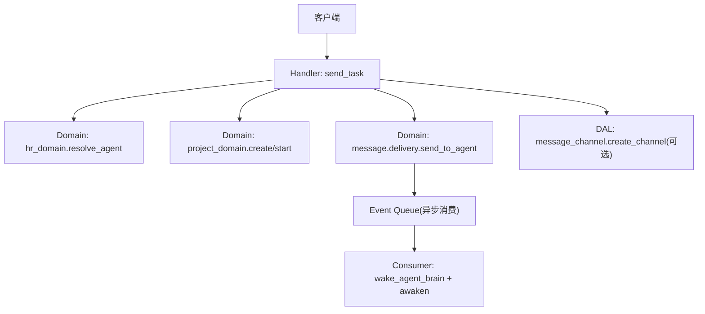
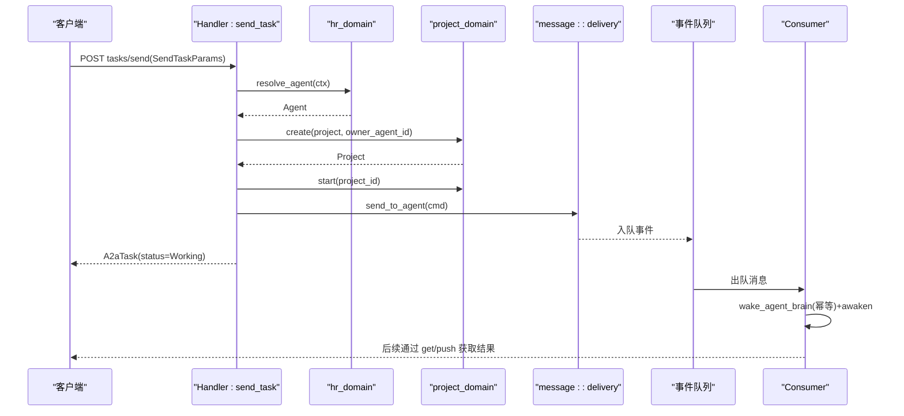
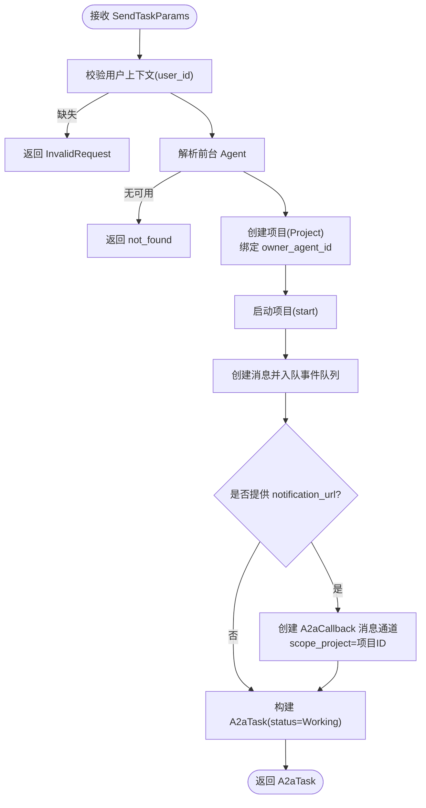
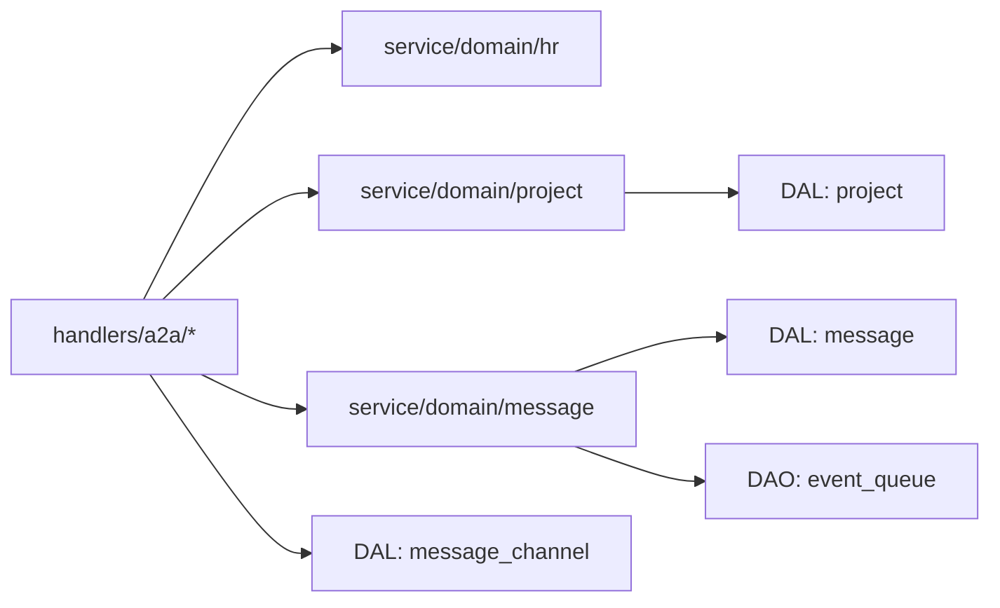

# 任务创建

<cite>
**本文引用的文件**
- [send_task.rs](src/handlers/a2a/send_task.rs)
- [get_task.rs](src/handlers/a2a/get_task.rs)
- [cancel_task.rs](src/handlers/a2a/cancel_task.rs)
- [mapper.rs](src/handlers/a2a/mapper.rs)
- [a2a.rs](common/src/api/a2a.rs)
- [project.rs](src/models/project.rs)
- [task.rs](src/models/task.rs)
- [code.rs](common/src/error/code.rs)
</cite>

## 目录
1. [简介](#简介)
2. [项目结构](#项目结构)
3. [核心组件](#核心组件)
4. [架构总览](#架构总览)
5. [详细组件分析](#详细组件分析)
6. [依赖关系分析](#依赖关系分析)
7. [性能考虑](#性能考虑)
8. [故障排查指南](#故障排查指南)
9. [结论](#结论)
10. [附录：API 规范与示例](#附录api-规范与示例)

## 简介
本文档围绕 A2A 协议的任务创建流程，完整说明从接收 SendTaskParams 参数开始，到解析用户上下文、查找前台 Agent、创建项目（Project）、启动项目状态流转、创建消息并入队事件队列、以及可选的 notification_url 回调通道创建的端到端过程。文档同时给出任务数据模型、必填字段校验、错误处理机制、任务与 Agent/项目的绑定关系、通知推送通道的创建逻辑，并提供 API 接口规范、请求参数说明、响应格式、常见错误码、使用示例与最佳实践建议。

## 项目结构
本功能涉及四层单向调用：Adapter（HTTP Handler）→ Domain → DAL → DAO。任务创建入口位于 handlers/a2a/send_task.rs；领域层通过 hr_domain、project_domain、message::domain 完成业务编排；DAL/DAO 负责持久化与队列入队；公共类型定义在 common/src/api/a2a.rs；实体模型在 models 目录中。

图表来源
- [send_task.rs:32-127](src/handlers/a2a/send_task.rs#L32-L127)
- [get_task.rs:18-48](src/handlers/a2a/get_task.rs#L18-L48)
- [cancel_task.rs:18-53](src/handlers/a2a/cancel_task.rs#L18-L53)
- [mapper.rs:58-84](src/handlers/a2a/mapper.rs#L58-L84)

章节来源
- [send_task.rs:1-128](src/handlers/a2a/send_task.rs#L1-L128)
- [a2a.rs:147-306](common/src/api/a2a.rs#L147-L306)

## 核心组件
- 请求与响应模型：SendTaskParams、GetTaskParams、CancelTaskParams、A2aTask、A2aMessage、A2aArtifact、A2aTaskState 等，定义于 common/src/api/a2a.rs。
- Handler 层：tasks/send、tasks/get、tasks/cancel 三个入口，分别负责创建、查询、取消任务。
- 映射器：将内部 ProjectStatus、Message、Artifact 转换为 A2A 协议对象。
- 领域层：hr_domain 解析前台 Agent；project_domain 创建并启动项目；message::delivery 投递消息并自动入队事件队列。
- 消息通道：可选创建 A2aCallback 类型的 MessageChannel，用于推送通知。

章节来源
- [a2a.rs:147-306](common/src/api/a2a.rs#L147-L306)
- [mapper.rs:14-99](src/handlers/a2a/mapper.rs#L14-L99)
- [send_task.rs:32-127](src/handlers/a2a/send_task.rs#L32-L127)
- [get_task.rs:18-48](src/handlers/a2a/get_task.rs#L18-L48)
- [cancel_task.rs:18-53](src/handlers/a2a/cancel_task.rs#L18-L53)

## 架构总览
任务创建采用“同步返回工作态 + 异步唤醒”的模式：
- Handler 立即创建项目、启动项目、写入消息并返回 working 状态的 A2aTask。
- 消费者异步出队消息，幂等唤醒 Agent 脑区并执行，Agent 回复后通过轮询或推送通知返回结果。

图表来源
- [send_task.rs:32-127](src/handlers/a2a/send_task.rs#L32-L127)
- [get_task.rs:18-48](src/handlers/a2a/get_task.rs#L18-L48)

## 详细组件分析

### 任务创建流程（tasks/send）
- 输入：SendTaskParams（id、message、session_id、metadata、notification_url）。
- 步骤：
  1) 从 RequestContext 提取 user_id，缺失则返回无效请求错误。
  2) 调用 hr_domain().resolve_agent(ctx) 获取前台 Agent，不存在则返回未找到错误。
  3) 从 message 中提取文本内容，截取前缀作为项目名称，避免过长。
  4) 调用 project_domain().project_manage().create(...) 创建项目，并将 agent.id 作为 owner_agent_id 绑定。
  5) 调用 project_domain().project_manage().start(...) 启动项目，进入 InProgress。
  6) 构造 SendToAgentCommand，调用 message::delivery().send_to_agent(...) 创建消息并自动入队事件队列。
  7) 若提供 notification_url，创建类型为 A2aCallback 的消息通道，scope_project 绑定当前项目，以便后续推送。
  8) 构建并返回 A2aTask，状态为 Working（InProgress），供客户端轮询。

图表来源
- [send_task.rs:32-127](src/handlers/a2a/send_task.rs#L32-L127)

章节来源
- [send_task.rs:32-127](src/handlers/a2a/send_task.rs#L32-L127)
- [a2a.rs:269-288](common/src/api/a2a.rs#L269-L288)

### 任务查询（tasks/get）
- 根据 task_id（即 project_id）查询项目，再查询关联消息与产物，最后映射为 A2aTask 返回。
- 适用于轮询获取任务最新状态与消息。

章节来源
- [get_task.rs:18-48](src/handlers/a2a/get_task.rs#L18-L48)
- [mapper.rs:58-84](src/handlers/a2a/mapper.rs#L58-L84)

### 任务取消（tasks/cancel）
- 查询项目存在性，归档项目（对应 A2A canceled），重新读取最新状态，组装消息与产物，返回 A2aTask。

章节来源
- [cancel_task.rs:18-53](src/handlers/a2a/cancel_task.rs#L18-L53)

### 数据模型与映射
- A2aTask：id=session/project id，status.state 由 ProjectStatus 映射而来，messages/artifacts 来自内部实体转换。
- A2aMessage：role=user/agent，parts 包含文本内容，message_id 与 task_id 关联。
- A2aArtifact：artifact_id/name/parts。
- 映射函数：build_a2a_task、message_to_a2a、artifact_to_a2a、extract_text_from_a2a_message。

章节来源
- [a2a.rs:147-265](common/src/api/a2a.rs#L147-L265)
- [mapper.rs:14-99](src/handlers/a2a/mapper.rs#L14-L99)

### 任务与 Agent、项目的绑定关系
- 每个 A2A Task 对应一个 Project，Project 的 owner_agent_id 绑定前台 Agent，表示该任务由该 Agent 负责推进。
- Project 启动后进入 InProgress，随后由消费者异步唤醒 Agent 执行。

章节来源
- [send_task.rs:45-73](src/handlers/a2a/send_task.rs#L45-L73)
- [project.rs:15-58](src/models/project.rs#L15-L58)

### notification_url 回调通道创建逻辑
- 当 SendTaskParams 提供 notification_url 时，创建 ChannelType=A2aCallback 的消息通道，名称包含项目名，配置 URL，scope_project 设置为当前项目 ID。
- 后续 deliver_message 会按 scope_project 过滤并向该 URL 推送 A2A Task 格式的消息。

章节来源
- [send_task.rs:93-114](src/handlers/a2a/send_task.rs#L93-L114)

## 依赖关系分析
- Handler 层依赖 Domain 层进行业务编排，不直接操作数据库或队列。
- Domain 层通过 DAL/DAO 访问持久化与队列，保持单向依赖。
- 公共类型与枚举在 common 模块中集中管理，确保前后端一致。

图表来源
- [send_task.rs:32-127](src/handlers/a2a/send_task.rs#L32-L127)
- [get_task.rs:18-48](src/handlers/a2a/get_task.rs#L18-L48)
- [cancel_task.rs:18-53](src/handlers/a2a/cancel_task.rs#L18-L53)

章节来源
- [send_task.rs:32-127](src/handlers/a2a/send_task.rs#L32-L127)
- [get_task.rs:18-48](src/handlers/a2a/get_task.rs#L18-L48)
- [cancel_task.rs:18-53](src/handlers/a2a/cancel_task.rs#L18-L53)

## 性能考虑
- 任务创建为快速路径：仅做必要校验与持久化，立即返回 Working，避免阻塞等待 Agent 回复。
- 唤醒与执行走异步队列，降低请求延迟，提高吞吐。
- 消息内容截断与轻量映射减少序列化开销。
- 推送通知可选，仅在需要时创建消息通道，避免不必要的 I/O。

## 故障排查指南
- 缺少用户上下文：返回 invalid_request，检查 JWT 与中间件是否正确注入 RequestContext。
- 无可用前台 Agent：返回 not_found，确认 hr_domain.resolve_agent 是否能找到有效 Agent。
- 项目创建/启动失败：检查 project_domain 的错误码与数据库状态。
- 消息入队失败：检查事件队列服务与 DAL 实现。
- 推送通知失败：检查消息通道配置与网络可达性，关注 channel_push_failed 错误码。

章节来源
- [code.rs:1-146](common/src/error/code.rs#L1-L146)
- [send_task.rs:32-127](src/handlers/a2a/send_task.rs#L32-L127)

## 结论
A2A 任务创建以 Handler 为入口，组合 hr_domain、project_domain、message::domain 完成“创建项目—启动项目—投递消息—可选推送通道”的完整流程，并通过异步消费者完成 Agent 唤醒与执行。该设计将同步与异步解耦，既保证低延迟响应，又具备可扩展的通知能力。

## 附录：API 规范与示例

### 接口定义
- tasks/send
  - 方法：POST
  - 路径：/a2a/tasks/send
  - 请求体：SendTaskParams
  - 响应：A2aTask（status.state=working）
- tasks/get
  - 方法：GET
  - 路径：/a2a/tasks/{id}
  - 查询参数：history_length（可选）
  - 响应：A2aTask
- tasks/cancel
  - 方法：POST
  - 路径：/a2a/tasks/{id}/cancel
  - 响应：A2aTask（status.state=canceled）

章节来源
- [a2a.rs:269-306](common/src/api/a2a.rs#L269-L306)
- [get_task.rs:18-48](src/handlers/a2a/get_task.rs#L18-L48)
- [cancel_task.rs:18-53](src/handlers/a2a/cancel_task.rs#L18-L53)

### 请求参数说明（SendTaskParams）
- id：字符串，客户端生成的任务标识（服务端使用自身 project id）。
- message：A2aMessage，至少包含 Text 部分。
- session_id：可选，用于多轮对话关联。
- metadata：可选，任意 JSON。
- notification_url：可选，推送通知回调 URL。

章节来源
- [a2a.rs:269-288](common/src/api/a2a.rs#L269-L288)

### 响应格式（A2aTask）
- id：任务 ID（= project id）。
- session_id：可选。
- status：包含 state（submitted/working/input_required/completed/failed/canceled）、timestamp、message。
- messages：消息列表。
- artifacts：产物列表。
- metadata：元数据。

章节来源
- [a2a.rs:147-198](common/src/api/a2a.rs#L147-L198)
- [mapper.rs:58-84](src/handlers/a2a/mapper.rs#L58-L84)

### 常见错误码
- invalid_request：请求参数或上下文无效（如缺少 user_id）。
- not_found：资源不存在（如无可用前台 Agent、任务不存在）。
- resource_conflict/conflict：资源冲突。
- payload_too_large：载荷过大。
- db_query_failed/db_migration_failed：数据库相关错误。
- third_party_unavailable/third_party_error：第三方服务不可用或错误。
- tool_execution_failed：工具执行失败。
- network_error：网络错误。
- runtime_awaken_failed：运行时唤醒失败。
- config_missing/config_invalid：配置缺失或无效。
- unsupported_operation：不支持的操作。
- channel_push_failed：推送失败。
- jwt_invalid：JWT 无效。
- internal：内部错误。

章节来源
- [code.rs:1-146](common/src/error/code.rs#L1-L146)

### 使用示例
- 提交任务
  - 请求体示例（JSON）：
    {
      "id": "client-task-001",
      "message": {
        "role": "user",
        "parts": [{"type": "text", "text": "请帮我生成一份季度报告"}]
      },
      "session_id": "sess-abc",
      "metadata": {"source": "a2a"},
      "notification_url": "https://your-server.com/a2a/callback"
    }
  - 响应示例（JSON）：
    {
      "id": "project-id-xxx",
      "session_id": "sess-abc",
      "status": {"state": "working", "timestamp": "2026-01-01T12:00:00Z"},
      "messages": [],
      "artifacts": [],
      "metadata": {}
    }

- 查询任务
  - GET /a2a/tasks/{id}?history_length=50
  - 返回最新状态与消息、产物。

- 取消任务
  - POST /a2a/tasks/{id}/cancel
  - 返回 canceled 状态的任务信息。

章节来源
- [a2a.rs:269-306](common/src/api/a2a.rs#L269-L306)
- [get_task.rs:18-48](src/handlers/a2a/get_task.rs#L18-L48)
- [cancel_task.rs:18-53](src/handlers/a2a/cancel_task.rs#L18-L53)

### 最佳实践
- 始终携带有效的 JWT，确保 RequestContext 能解析 user_id。
- 合理设置 session_id，便于多轮对话关联。
- 如需推送通知，务必提供可访问的 notification_url，并确保服务端能正确处理回调。
- 使用 tasks/get 轮询时，结合 history_length 控制历史消息数量，减少带宽消耗。
- 对长文本消息进行适当截断或分段，避免超出系统限制。
- 监控错误码，针对 invalid_request、not_found、channel_push_failed 等进行针对性排查。