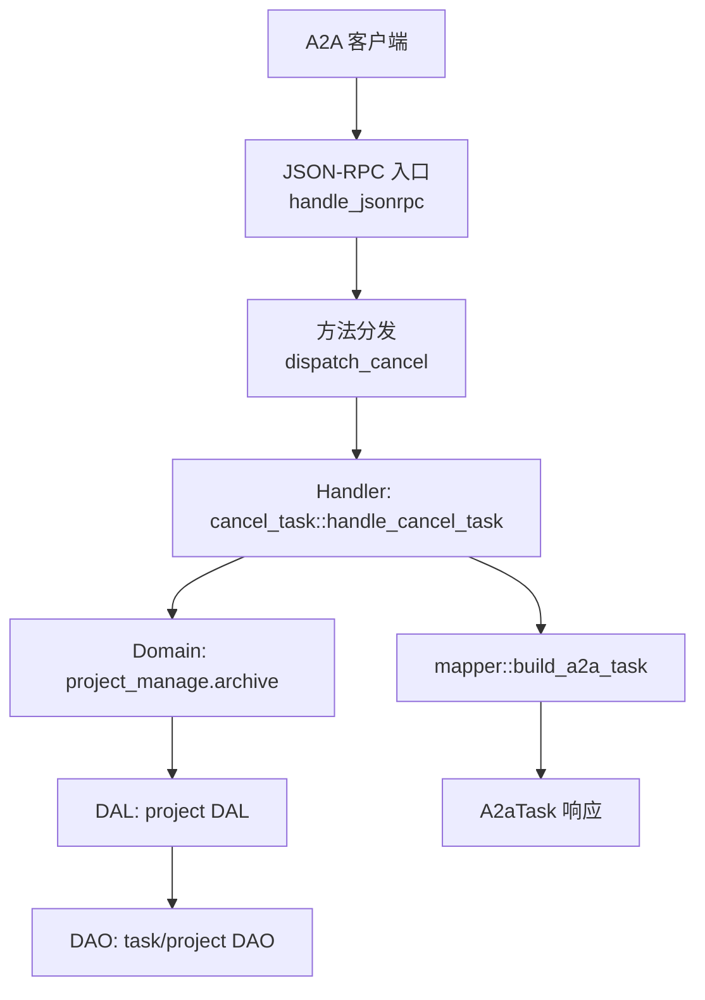
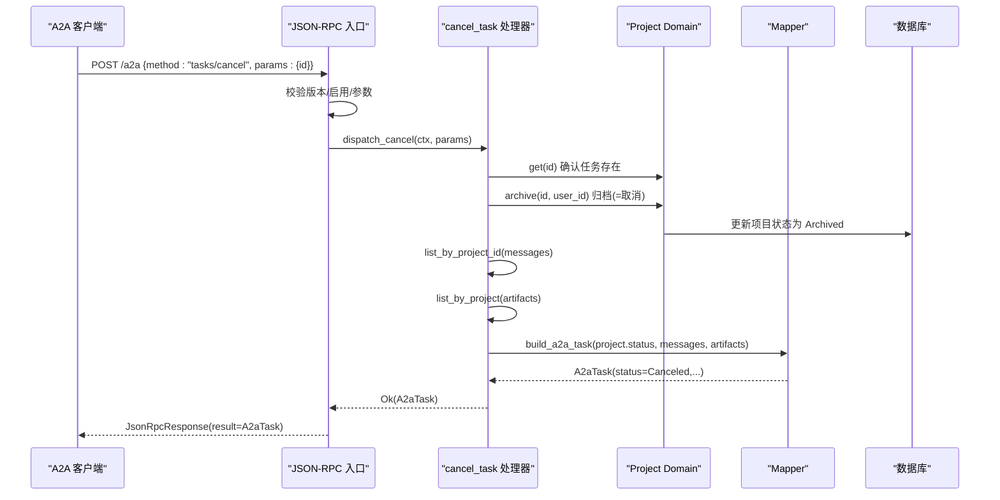
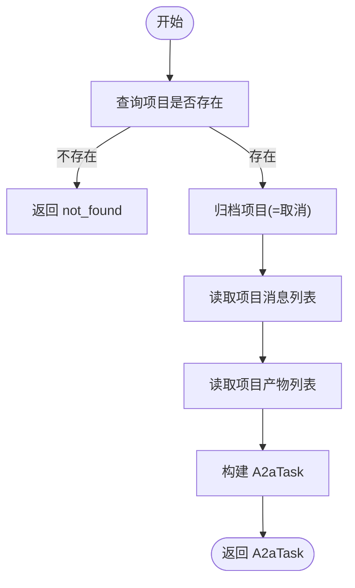
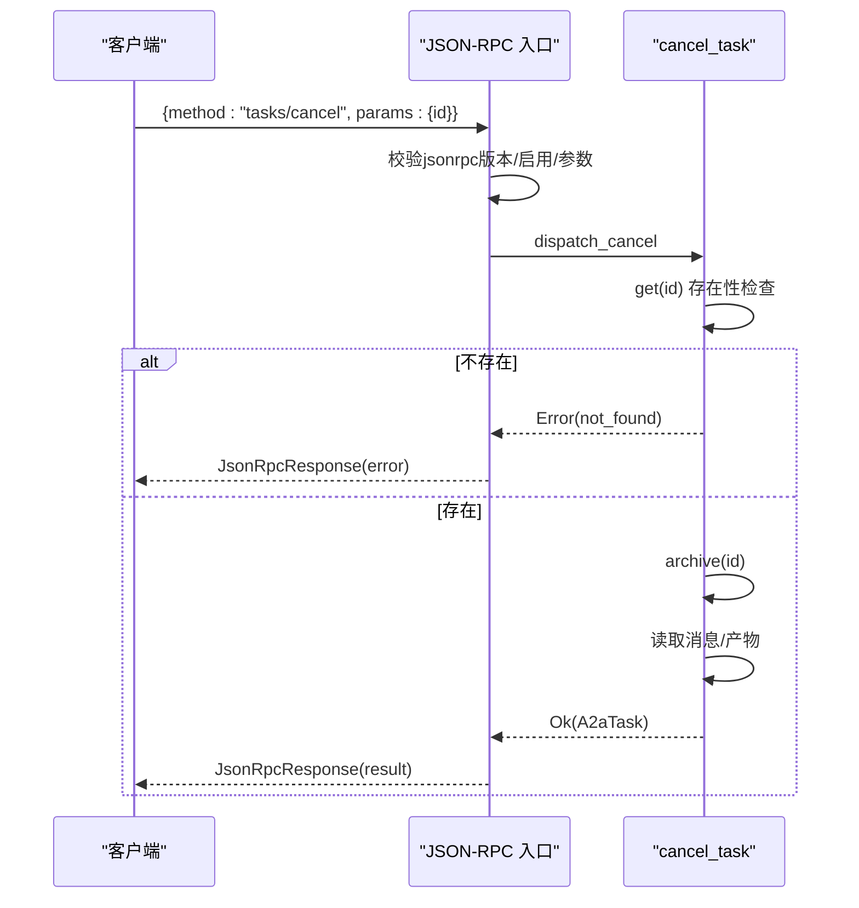
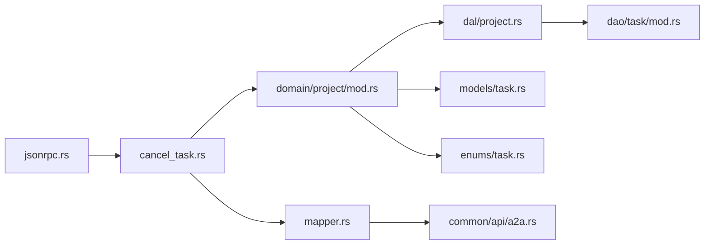

# 任务取消

<cite>
**本文引用的文件**
- [src/handlers/a2a/cancel_task.rs](src/handlers/a2a/cancel_task.rs)
- [src/handlers/a2a/jsonrpc.rs](src/handlers/a2a/jsonrpc.rs)
- [common/src/api/a2a.rs](common/src/api/a2a.rs)
- [src/handlers/a2a/mapper.rs](src/handlers/a2a/mapper.rs)
- [src/service/domain/project/mod.rs](src/service/domain/project/mod.rs)
- [src/models/task.rs](src/models/task.rs)
- [common/src/enums/task.rs](common/src/enums/task.rs)
- [src/models/project.rs](src/models/project.rs)
- [src/service/dal/project.rs](src/service/dal/project.rs)
- [src/service/dao/task/mod.rs](src/service/dao/task/mod.rs)
- [src/pkg/request_context.rs](src/pkg/request_context.rs)
</cite>

## 目录
1. [简介](#简介)
2. [项目结构](#项目结构)
3. [核心组件](#核心组件)
4. [架构总览](#架构总览)
5. [详细组件分析](#详细组件分析)
6. [依赖关系分析](#依赖关系分析)
7. [性能与并发特性](#性能与并发特性)
8. [故障排查指南](#故障排查指南)
9. [结论](#结论)
10. [附录：接口规范与错误码](#附录接口规范与错误码)

## 简介
本章节面向 A2A 协议的任务取消能力，围绕“哪些状态可取消、幂等性保证、取消流程（状态检查、资源清理、消息通知、事务回滚）、对正在执行 Agent 的影响与处理、接口规范、参数校验、错误处理、审计日志与监控指标、失败补偿策略”进行系统化说明。该能力通过 JSON-RPC 的 tasks/cancel 方法暴露，内部将 A2A Task 映射为 ai_orz 的 Project，并以归档方式实现“取消”。

## 项目结构
- 入口层：JSON-RPC 统一入口负责鉴权、版本校验与方法分发。
- Handler 层：tasks/cancel 的具体业务编排。
- Domain 层：Project 领域服务提供 archive 等状态变更能力。
- DAL/DAO 层：持久化访问与数据一致性保障。
- 模型与枚举：TaskStatus、ProjectStatus 等定义状态机。
- 映射器：将内部实体转换为 A2A 协议对象返回给调用方。

**图示来源**
- [src/handlers/a2a/jsonrpc.rs:22-93](src/handlers/a2a/jsonrpc.rs#L22-L93)
- [src/handlers/a2a/cancel_task.rs:17-54](src/handlers/a2a/cancel_task.rs#L17-L54)
- [src/handlers/a2a/mapper.rs:1-200](src/handlers/a2a/mapper.rs#L1-L200)
- [src/service/domain/project/mod.rs:196-226](src/service/domain/project/mod.rs#L196-L226)

**章节来源**
- [src/handlers/a2a/jsonrpc.rs:22-93](src/handlers/a2a/jsonrpc.rs#L22-L93)
- [src/handlers/a2a/cancel_task.rs:17-54](src/handlers/a2a/cancel_task.rs#L17-L54)

## 核心组件
- JSON-RPC 入口：校验版本、启用开关、按 method 分发到具体 handler。
- Cancel Handler：校验任务存在、执行归档（对应 A2A Canceled）、拉取消息与产物并组装 A2aTask。
- Domain Project：提供 archive 等状态转换能力，封装事务与一致性。
- 模型与枚举：TaskStatus、ProjectStatus 定义状态；Task 聚合体包含 po 与业务方法。
- 映射器：构建 A2aTask，填充 status、messages、artifacts。

**章节来源**
- [common/src/api/a2a.rs:147-198](common/src/api/a2a.rs#L147-L198)
- [src/models/task.rs:65-188](src/models/task.rs#L65-L188)
- [common/src/enums/task.rs:8-27](common/src/enums/task.rs#L8-L27)
- [src/service/domain/project/mod.rs:196-226](src/service/domain/project/mod.rs#L196-L226)

## 架构总览
A2A 任务取消的整体调用链如下：

**图示来源**
- [src/handlers/a2a/jsonrpc.rs:22-93](src/handlers/a2a/jsonrpc.rs#L22-L93)
- [src/handlers/a2a/cancel_task.rs:17-54](src/handlers/a2a/cancel_task.rs#L17-L54)
- [src/handlers/a2a/mapper.rs:1-200](src/handlers/a2a/mapper.rs#L1-L200)
- [src/service/domain/project/mod.rs:196-226](src/service/domain/project/mod.rs#L196-L226)

## 详细组件分析

### 业务规则与限制条件
- 可取消的任务范围
  - 以 Project 为载体，取消即归档。当前实现直接调用归档，未做前置状态拦截。
  - 若需严格限制仅特定状态可取消（如 Pending/InProgress），应在 Domain 层 transition_status 或 archive 前增加状态校验。
- 幂等性保证
  - 多次提交相同 id 的取消请求，最终结果均为已归档状态；重复查询会返回相同的 A2aTask（status=Canceled）。
  - 建议在 Domain 层对“已归档”再次归档做幂等返回，避免重复写库。
- 权限与上下文
  - 使用 RequestContext 中的 uid 作为修改者标识，确保审计可追溯。

**章节来源**
- [src/handlers/a2a/cancel_task.rs:17-54](src/handlers/a2a/cancel_task.rs#L17-L54)
- [src/service/domain/project/mod.rs:196-226](src/service/domain/project/mod.rs#L196-L226)
- [common/src/enums/task.rs:8-27](common/src/enums/task.rs#L8-L27)

### 取消流程详解
- 状态检查
  - 先 get(id) 确认任务存在，不存在则返回 not_found。
- 资源清理
  - 调用 archive 将项目归档（对应 A2A Canceled）。
  - 读取该项目下的 messages 与 artifacts，用于后续 A2aTask 组装。
- 消息通知
  - 当前取消流程不主动推送通知；如需 SSE/PushNotification，可在 Domain 层或消费者中基于事件触发。
- 事务回滚
  - 若归档成功但后续读取消息/产物失败，应保证整体回滚或补偿，避免状态不一致。建议将“归档 + 读取”置于同一事务或使用补偿逻辑。

**图示来源**
- [src/handlers/a2a/cancel_task.rs:17-54](src/handlers/a2a/cancel_task.rs#L17-L54)

**章节来源**
- [src/handlers/a2a/cancel_task.rs:17-54](src/handlers/a2a/cancel_task.rs#L17-L54)

### 对正在执行的 Agent 的影响与处理方式
- 影响面
  - 当前实现仅归档 Project，并未显式中断正在运行的 Agent Loop。
  - 若 Agent 仍在运行，可能出现“任务已归档但后台仍在执行”的不一致。
- 建议处理方式
  - 在 Domain 层或调度层增加“取消信号”机制：当项目被归档时，向正在运行的 Agent 发送中断信号或设置取消标志，使其尽快退出。
  - 在 Agent Loop 中监听取消信号，完成必要清理后优雅退出，并记录审计日志。

[本节为概念性说明，不直接分析具体文件]

### 接口规范、参数验证与错误处理
- 端点与方法
  - JSON-RPC 方法名：tasks/cancel
  - 请求体：{ jsonrpc:"2.0", id, method:"tasks/cancel", params:{ id } }
  - 响应体：成功返回 A2aTask；失败返回 JsonRpcError。
- 参数验证
  - id 必填且非空；解析失败返回 INVALID_PARAMS。
  - 版本必须为 "2.0"，否则返回 INVALID_REQUEST。
  - A2A Server 未启用时返回 METHOD_NOT_FOUND。
- 错误处理
  - 任务不存在：not_found。
  - 其他异常：INTERNAL_ERROR，携带错误信息。

**图示来源**
- [src/handlers/a2a/jsonrpc.rs:22-93](src/handlers/a2a/jsonrpc.rs#L22-L93)
- [src/handlers/a2a/cancel_task.rs:17-54](src/handlers/a2a/cancel_task.rs#L17-L54)
- [common/src/api/a2a.rs:121-145](common/src/api/a2a.rs#L121-L145)

**章节来源**
- [src/handlers/a2a/jsonrpc.rs:22-93](src/handlers/a2a/jsonrpc.rs#L22-L93)
- [common/src/api/a2a.rs:121-145](common/src/api/a2a.rs#L121-L145)
- [src/handlers/a2a/cancel_task.rs:17-54](src/handlers/a2a/cancel_task.rs#L17-L54)

### 审计日志与监控指标
- 审计日志
  - 使用 RequestContext 中的 uid 作为 modified_by，写入归档操作，便于追踪。
  - 建议在 Domain 层 archive 前后记录关键审计字段：task_id、user_id、时间戳、操作类型。
- 监控指标
  - 建议采集：取消请求数、成功率、失败原因分布、平均耗时、归档耗时、消息/产物读取耗时。
  - 可通过 AOP 统计模块埋点，或在 Domain/DAL 层注入计数器。

[本节为通用实践建议，不直接分析具体文件]

### 失败处理与补偿机制示例
- 场景一：归档成功，但读取消息/产物失败
  - 补偿：记录失败并告警，延迟重试读取；若超过阈值，标记为“部分完成”，由管理端介入。
- 场景二：归档失败（数据库异常）
  - 补偿：立即返回错误，客户端可重试；服务端记录失败原因与上下文。
- 场景三：幂等重复取消
  - 行为：重复归档视为成功；返回已归档的 A2aTask。
- 场景四：Agent 仍在运行
  - 补偿：在 Domain 层发出取消信号，等待 Agent 退出；超时仍未退出则强制终止并记录。

[本节为概念性方案，不直接分析具体文件]

## 依赖关系分析
- Handler 依赖 Domain 的 ProjectManage.archive 与 Message/Artifact 列表查询。
- Domain 依赖 DAL/DAO 完成持久化。
- 模型与枚举提供状态与实体定义。
- 映射器依赖 A2A 协议类型，将内部实体转为外部协议对象。

**图示来源**
- [src/handlers/a2a/jsonrpc.rs:22-93](src/handlers/a2a/jsonrpc.rs#L22-L93)
- [src/handlers/a2a/cancel_task.rs:17-54](src/handlers/a2a/cancel_task.rs#L17-L54)
- [src/service/domain/project/mod.rs:196-226](src/service/domain/project/mod.rs#L196-L226)
- [src/service/dal/project.rs:1-200](src/service/dal/project.rs#L1-L200)
- [src/service/dao/task/mod.rs:1-200](src/service/dao/task/mod.rs#L1-L200)
- [common/src/api/a2a.rs:147-198](common/src/api/a2a.rs#L147-L198)
- [src/models/task.rs:65-188](src/models/task.rs#L65-L188)
- [common/src/enums/task.rs:8-27](common/src/enums/task.rs#L8-L27)

**章节来源**
- [src/handlers/a2a/jsonrpc.rs:22-93](src/handlers/a2a/jsonrpc.rs#L22-L93)
- [src/handlers/a2a/cancel_task.rs:17-54](src/handlers/a2a/cancel_task.rs#L17-L54)
- [src/service/domain/project/mod.rs:196-226](src/service/domain/project/mod.rs#L196-L226)

## 性能与并发特性
- 读多写少：取消后主要读取消息与产物，注意分页与缓存策略。
- 事务边界：归档与读取应尽量在同一事务内，减少不一致窗口。
- 并发安全：避免多个并发取消导致竞态；可在 Domain 层加锁或依赖数据库唯一约束。
- 资源释放：若引入 Agent 中断机制，需确保资源及时释放，避免泄漏。

[本节为通用性能建议，不直接分析具体文件]

## 故障排查指南
- 常见问题
  - 任务不存在：检查 id 是否正确，确认项目未被删除。
  - 参数无效：检查 JSON-RPC 结构与字段类型。
  - 服务未启用：检查 A2A Server 配置。
- 定位步骤
  - 查看 JSON-RPC 错误码与消息。
  - 检查 Domain 层 archive 是否成功。
  - 检查消息/产物读取是否成功。
  - 核对审计日志中的 modified_by 与时间戳。

**章节来源**
- [src/handlers/a2a/jsonrpc.rs:22-93](src/handlers/a2a/jsonrpc.rs#L22-L93)
- [src/handlers/a2a/cancel_task.rs:17-54](src/handlers/a2a/cancel_task.rs#L17-L54)

## 结论
当前 A2A 任务取消通过“归档 Project”实现，具备基本幂等性与一致性。为提升健壮性，建议：
- 在 Domain 层增加状态前置校验与幂等保护。
- 引入 Agent 取消信号，确保后台执行与前端状态一致。
- 完善审计日志与监控指标，便于问题定位与容量规划。
- 优化事务边界与补偿机制，提高系统韧性。

[本节为总结性内容，不直接分析具体文件]

## 附录：接口规范与错误码
- 请求
  - 方法：tasks/cancel
  - 参数：CancelTaskParams{id}
- 响应
  - 成功：A2aTask（status.state=Canceled，包含 messages/artifacts）
  - 失败：JsonRpcError（code/message/data）
- 标准错误码
  - PARSE_ERROR、INVALID_REQUEST、METHOD_NOT_FOUND、INVALID_PARAMS、INTERNAL_ERROR

**章节来源**
- [common/src/api/a2a.rs:121-145](common/src/api/a2a.rs#L121-L145)
- [common/src/api/a2a.rs:267-306](common/src/api/a2a.rs#L267-L306)
- [src/handlers/a2a/jsonrpc.rs:22-93](src/handlers/a2a/jsonrpc.rs#L22-L93)