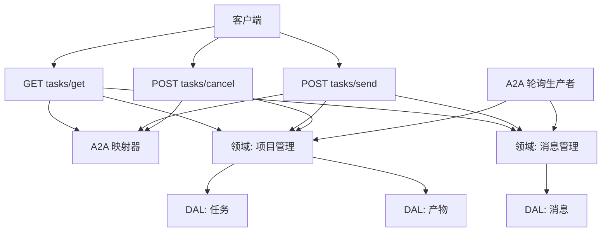
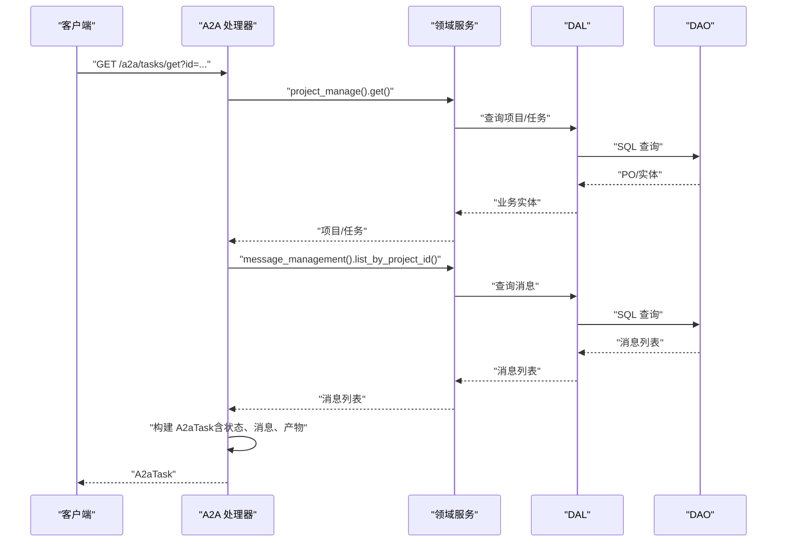
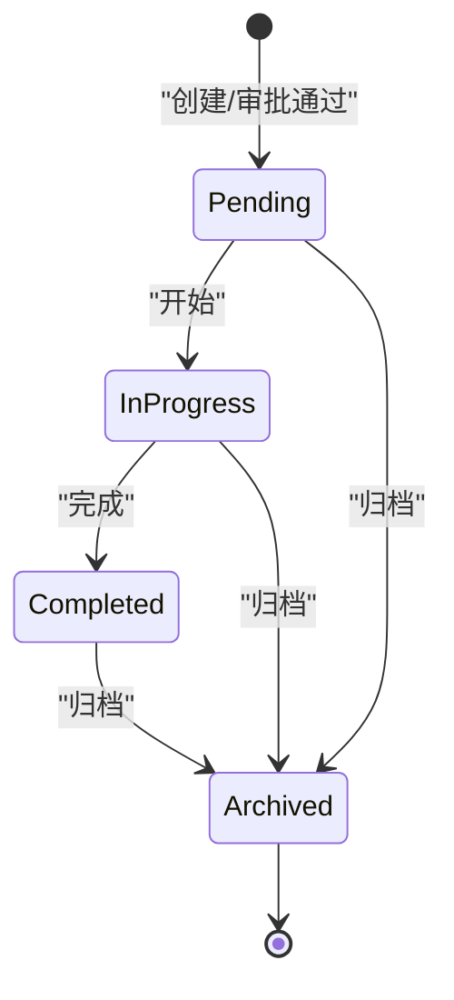
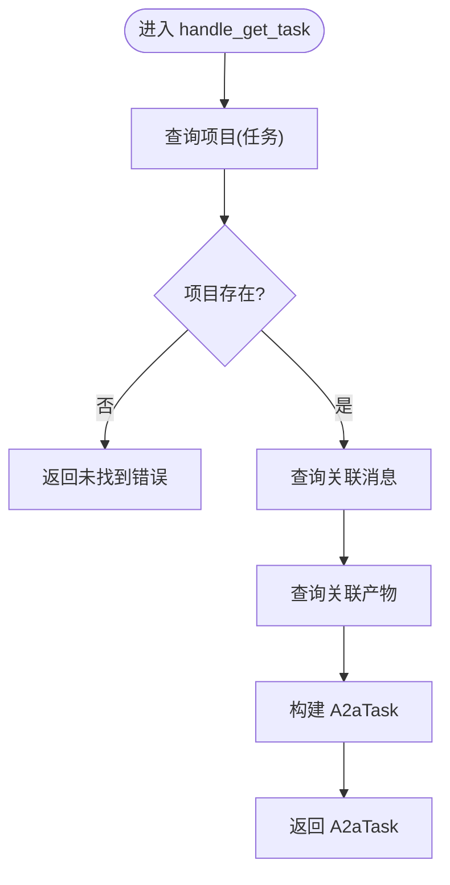
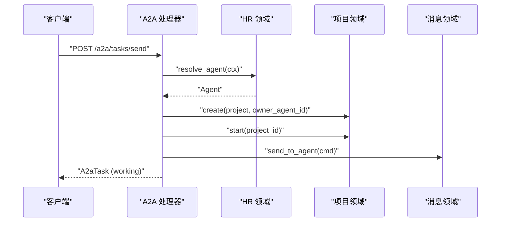
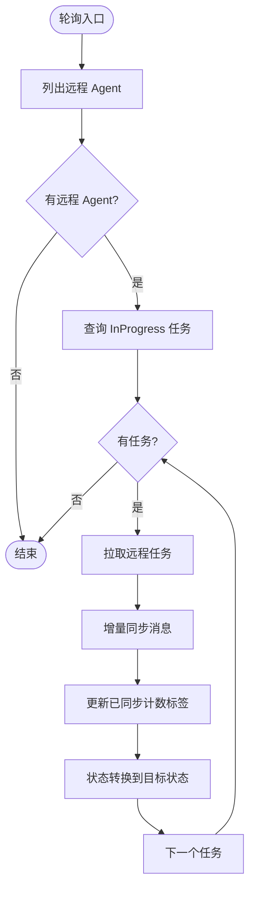
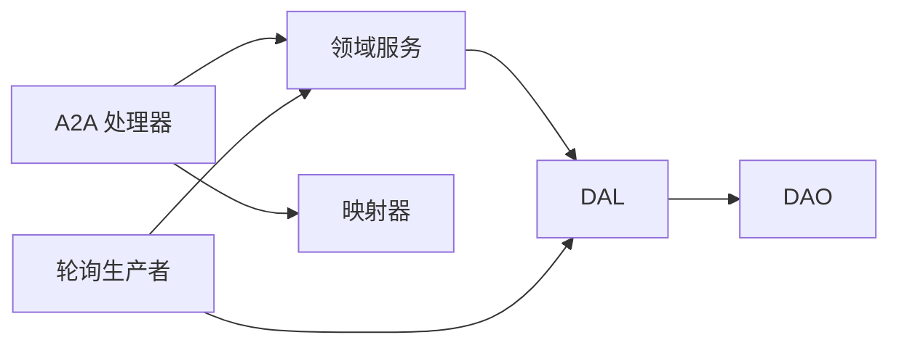

# 任务查询

<cite>
**本文引用的文件**
- [get_task.rs](src/handlers/a2a/get_task.rs)
- [send_task.rs](src/handlers/a2a/send_task.rs)
- [cancel_task.rs](src/handlers/a2a/cancel_task.rs)
- [mapper.rs](src/handlers/a2a/mapper.rs)
- [a2a.rs](common/src/api/a2a.rs)
- [task.rs](src/service/domain/project/task.rs)
- [task_enum.rs](common/src/enums/task.rs)
- [project_status_enum.rs](common/src/enums/project.rs)
- [a2a_polling.rs](src/producer/a2a_polling.rs)
- [integration_test.rs](src/handlers/a2a/integration_test.rs)
</cite>

## 目录
1. [简介](#简介)
2. [项目结构](#项目结构)
3. [核心组件](#核心组件)
4. [架构总览](#架构总览)
5. [详细组件分析](#详细组件分析)
6. [依赖关系分析](#依赖关系分析)
7. [性能与缓存策略](#性能与缓存策略)
8. [客户端轮询最佳实践与重试机制](#客户端轮询最佳实践与重试机制)
9. [故障排查指南](#故障排查指南)
10. [结论](#结论)

## 简介
本文件面向 A2A 协议的任务查询能力，聚焦以下目标：
- 说明任务状态轮询机制与查询接口设计
- 记录任务状态机各阶段（working、completed、failed 等）含义与转换条件
- 说明如何获取任务执行结果、消息历史与进度信息
- 提供查询接口的完整规范、分页支持、过滤条件与排序选项
- 记录任务结果的缓存策略与性能优化方案
- 给出客户端轮询的最佳实践与错误重试实现示例

## 项目结构
围绕 A2A 任务查询的关键代码分布在以下位置：
- HTTP 处理器层：tasks/send、tasks/get、tasks/cancel
- 协议映射层：内部实体与 A2A 实体的转换
- 领域服务层：任务创建、查询、状态流转与进度更新
- 生产者层：远程 Agent 任务的轮询与状态同步
- 公共协议定义：A2A Task、Message、Artifact、方法参数等

图表来源
- [get_task.rs:1-49](src/handlers/a2a/get_task.rs#L1-L49)
- [send_task.rs:1-128](src/handlers/a2a/send_task.rs#L1-L128)
- [cancel_task.rs:1-55](src/handlers/a2a/cancel_task.rs#L1-L55)
- [mapper.rs:1-99](src/handlers/a2a/mapper.rs#L1-L99)
- [a2a_polling.rs:1-272](src/producer/a2a_polling.rs#L1-L272)

章节来源
- [get_task.rs:1-49](src/handlers/a2a/get_task.rs#L1-L49)
- [send_task.rs:1-128](src/handlers/a2a/send_task.rs#L1-L128)
- [cancel_task.rs:1-55](src/handlers/a2a/cancel_task.rs#L1-L55)
- [mapper.rs:1-99](src/handlers/a2a/mapper.rs#L1-L99)
- [a2a_polling.rs:1-272](src/producer/a2a_polling.rs#L1-L272)

## 核心组件
- A2A 协议类型与方法参数：定义 A2aTask、A2aTaskState、A2aMessage、A2aArtifact、SendTaskParams、GetTaskParams、CancelTaskParams
- 任务处理器：
  - tasks/send：异步提交任务，立即返回 working 状态
  - tasks/get：查询任务状态、消息历史与产物
  - tasks/cancel：取消任务并归档
- 映射器：ProjectStatus ↔ A2aTaskState，Message/Artifact ↔ A2A 实体
- 领域任务服务：任务创建、查询、状态流转、进度更新
- 轮询生产者：定时拉取远程 Agent 任务状态，同步本地任务状态与消息

章节来源
- [a2a.rs:147-306](common/src/api/a2a.rs#L147-L306)
- [mapper.rs:14-84](src/handlers/a2a/mapper.rs#L14-L84)
- [task.rs:166-225](src/service/domain/project/task.rs#L166-L225)
- [a2a_polling.rs:56-272](src/producer/a2a_polling.rs#L56-L272)

## 架构总览
A2A 任务查询遵循四层单向调用：Adapter（HTTP Handler / 公开回调）→ Domain → DAL → DAO。Handler 组合业务域，Domain 封装业务规则与事件，DAL 聚合数据访问，DAO 负责持久化。

图表来源
- [get_task.rs:17-48](src/handlers/a2a/get_task.rs#L17-L48)
- [mapper.rs:57-84](src/handlers/a2a/mapper.rs#L57-L84)

章节来源
- [get_task.rs:17-48](src/handlers/a2a/get_task.rs#L17-L48)
- [mapper.rs:57-84](src/handlers/a2a/mapper.rs#L57-L84)

## 详细组件分析

### 任务状态机与 A2A 状态映射
- 内部任务状态（TaskStatus）：Cancelled、PendingReview、Pending、InProgress、Completed、Archived
- A2A 任务状态（A2aTaskState）：Submitted、Working、InputRequired、Completed、Failed、Canceled
- 映射关系由映射器将 ProjectStatus 转为 A2aTaskState；同时轮询生产者根据远程任务状态更新本地任务状态

图表来源
- [task.rs:394-482](src/service/domain/project/task.rs#L394-L482)
- [task_enum.rs:8-27](common/src/enums/task.rs#L8-L27)

章节来源
- [task.rs:394-482](src/service/domain/project/task.rs#L394-L482)
- [task_enum.rs:8-27](common/src/enums/task.rs#L8-L27)
- [mapper.rs:14-23](src/handlers/a2a/mapper.rs#L14-L23)

### 任务查询接口规范（tasks/get）
- 请求参数
  - id：任务 ID（对应 project id）
  - history_length：可选，限制历史消息长度
- 响应体
  - A2aTask：包含 id、session_id、status、messages、artifacts、metadata
- 行为
  - 查询项目（任务）
  - 查询关联消息
  - 查询关联产物
  - 转换为 A2aTask 返回

图表来源
- [get_task.rs:17-48](src/handlers/a2a/get_task.rs#L17-L48)
- [mapper.rs:57-84](src/handlers/a2a/mapper.rs#L57-L84)

章节来源
- [get_task.rs:17-48](src/handlers/a2a/get_task.rs#L17-L48)
- [a2a.rs:290-298](common/src/api/a2a.rs#L290-L298)

### 任务提交接口（tasks/send）
- 请求参数
  - id：客户端生成的 task id（服务端忽略，使用自身 project id）
  - message：A2aMessage
  - session_id：可选，会话标识
  - metadata：可选，元数据
  - notification_url：可选，推送通知回调 URL
- 行为
  - 解析用户上下文
  - 解析前台 Agent
  - 创建项目（任务），绑定 agent
  - 启动项目（流转到 InProgress）
  - 发送消息到 Agent（入队 event_queue）
  - 可选：创建 A2aCallback 渠道用于推送通知
  - 立即返回 working 状态的 A2aTask

图表来源
- [send_task.rs:31-128](src/handlers/a2a/send_task.rs#L31-L128)

章节来源
- [send_task.rs:31-128](src/handlers/a2a/send_task.rs#L31-L128)
- [a2a.rs:269-288](common/src/api/a2a.rs#L269-L288)

### 任务取消接口（tasks/cancel）
- 请求参数
  - id：任务 ID
- 行为
  - 查询项目（确保存在）
  - 归档项目（对应 A2A canceled）
  - 重新查询项目获取最新状态
  - 查询消息与产物
  - 构建并返回 A2aTask

章节来源
- [cancel_task.rs:17-54](src/handlers/a2a/cancel_task.rs#L17-L54)

### 轮询机制与状态同步
- 轮询生产者周期性拉取远程 Agent 的任务状态
- 对每个任务：
  - 提取远程任务 ID（标签中）
  - 拉取远程任务消息，增量同步至本地用户
  - 根据远程状态更新本地任务状态（Working/Completed/Failed/Canceled）
  - 更新已同步消息计数标签，避免重复推送

图表来源
- [a2a_polling.rs:56-272](src/producer/a2a_polling.rs#L56-L272)

章节来源
- [a2a_polling.rs:56-272](src/producer/a2a_polling.rs#L56-L272)

### 分页、过滤与排序
- 任务列表查询支持分页参数 limit、offset（通过 DAL 的 TaskQuery/PaginationParams）
- 过滤条件包括：
  - assignee_type：User/Agent
  - assignee_id：具体分配对象 ID
  - project_id：项目维度
  - status_in：任务状态集合
- 排序选项：当前实现以默认顺序为主，如需扩展可在 DAL 层增加排序字段与方向

章节来源
- [task.rs:166-225](src/service/domain/project/task.rs#L166-L225)

### 进度信息与结果获取
- 进度更新：领域服务提供 update_progress(task_id, progress)，写入任务进度并记录事件
- 结果获取：
  - 通过 tasks/get 获取 messages（包含用户与 Agent 的消息历史）
  - artifacts 作为任务产物返回
  - 对于远程 Agent，轮询生产者会将新消息推送到本地用户侧

章节来源
- [task.rs:484-524](src/service/domain/project/task.rs#L484-L524)
- [get_task.rs:26-48](src/handlers/a2a/get_task.rs#L26-L48)
- [a2a_polling.rs:139-216](src/producer/a2a_polling.rs#L139-L216)

## 依赖关系分析
- Handler 层依赖 Domain 层进行业务编排，不直接访问 DAL/DAO
- Domain 层通过 DAL 聚合数据访问，保持无业务感知
- 轮询生产者依赖 Domain 与 DAL，用于跨 Agent 的状态同步
- 映射器集中处理 A2A 协议与内部实体的转换，降低耦合

图表来源
- [get_task.rs:17-48](src/handlers/a2a/get_task.rs#L17-L48)
- [a2a_polling.rs:56-272](src/producer/a2a_polling.rs#L56-L272)
- [mapper.rs:14-84](src/handlers/a2a/mapper.rs#L14-L84)

章节来源
- [get_task.rs:17-48](src/handlers/a2a/get_task.rs#L17-L48)
- [a2a_polling.rs:56-272](src/producer/a2a_polling.rs#L56-L272)
- [mapper.rs:14-84](src/handlers/a2a/mapper.rs#L14-L84)

## 性能与缓存策略
- 查询路径优化
  - tasks/get 仅加载必要的数据：项目、消息、产物，避免冗余字段
  - 消息历史可通过 history_length 限制返回量，减少网络与序列化开销
- 轮询优化
  - 轮询间隔固定为 30 秒，避免高频拉取造成压力
  - 增量同步消息计数标签，防止重复推送
- 建议的缓存策略
  - 短期缓存：对频繁读取的项目/任务元数据进行内存级缓存（如按任务 ID 缓存最近 N 次查询结果，设置短 TTL）
  - 消息历史缓存：对同一任务的消息列表做轻量缓存，结合 last_message_id 或时间戳增量拉取
  - 产物缓存：产物描述较短时可缓存，避免重复查询
- 数据库层面
  - 利用 SQLx 离线查询缓存（.sqlx）提升查询编译与执行效率
  - 合理索引：按 project_id、assignee_id、status 建立索引以提升过滤与分页性能

[本节为通用性能建议，不直接分析具体文件]

## 客户端轮询最佳实践与重试机制
- 轮询策略
  - 初始间隔：1-3 秒，逐步退避至 5-10 秒
  - 最大轮询次数：根据业务容忍度设定上限，避免无限轮询
  - 终止条件：当状态为 Completed、Failed、Canceled 时停止轮询
- 指数退避与抖动
  - 失败时采用指数退避（如 1s、2s、4s、8s...）并加入随机抖动，避免雪崩
- 幂等与去重
  - 基于任务 ID 与消息 ID 去重，避免重复渲染
  - 使用 history_length 控制历史消息范围，减少带宽占用
- 错误处理
  - 网络错误：重试直至达到最大次数
  - 业务错误：如未找到任务，立即终止并提示用户
- 示例流程（概念性）
  - 发起 tasks/send 获得 working 任务
  - 循环调用 tasks/get，直到终态或超时
  - 遇到错误则退避重试，最终汇总结果

[本节为通用实践指导，不直接分析具体文件]

## 故障排查指南
- 常见问题
  - 任务不存在：tasks/get 与 tasks/cancel 在找不到项目时会返回未找到错误
  - 轮询失败：远程任务拉取失败会记录警告日志并跳过该任务
  - 消息同步失败：推送消息失败会记录警告日志，不影响后续轮询
- 定位步骤
  - 检查任务 ID 是否正确
  - 查看轮询日志，确认是否成功拉取远程任务与推送消息
  - 检查任务状态流转是否符合预期（禁止非法状态转换）
- 测试验证
  - 集成测试覆盖 tasks/get 与 tasks/cancel 的错误场景

章节来源
- [get_task.rs:17-48](src/handlers/a2a/get_task.rs#L17-L48)
- [cancel_task.rs:17-54](src/handlers/a2a/cancel_task.rs#L17-L54)
- [a2a_polling.rs:114-128](src/producer/a2a_polling.rs#L114-L128)
- [integration_test.rs:105-134](src/handlers/a2a/integration_test.rs#L105-L134)

## 结论
A2A 任务查询通过清晰的层次划分与严格的领域规则，实现了稳定的任务状态管理与消息同步。tasks/get 提供统一的查询入口，tasks/send 与 tasks/cancel 分别处理异步提交与取消。轮询生产者保障远程 Agent 状态与本地一致。配合分页、过滤与合理的缓存策略，系统在高并发下仍能保持良好性能。客户端应遵循轮询最佳实践与重试机制，以获得稳定可靠的体验。