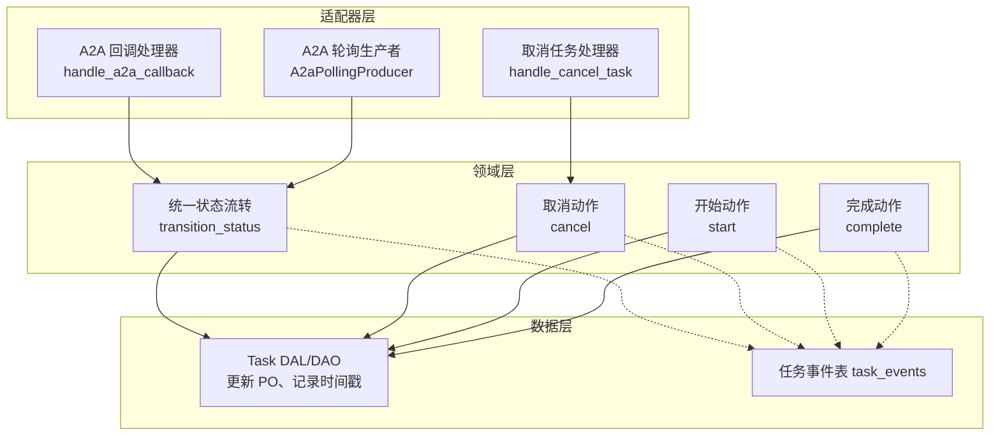
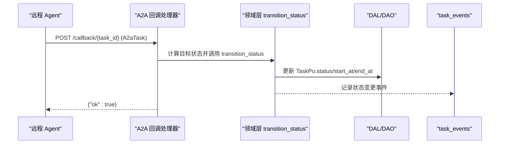
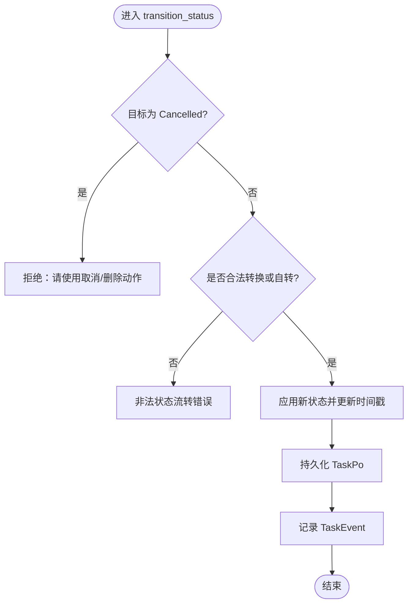
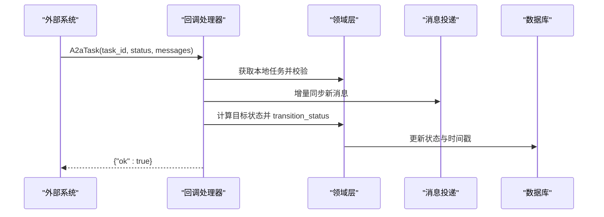
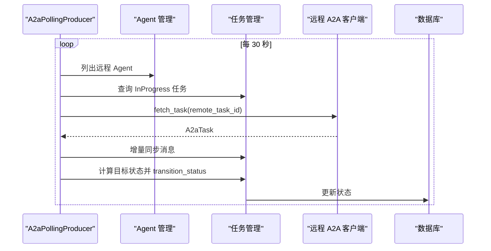
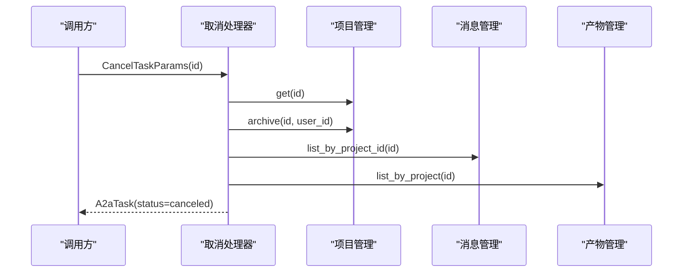
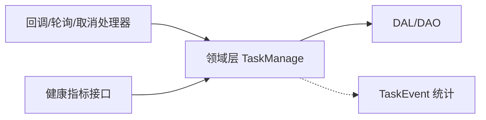

# 任务生命周期

<cite>
**本文引用的文件**
- [common/src/api/a2a.rs](common/src/api/a2a.rs)
- [common/src/enums/task.rs](common/src/enums/task.rs)
- [src/models/task.rs](src/models/task.rs)
- [src/service/domain/project/task.rs](src/service/domain/project/task.rs)
- [src/handlers/a2a/callback.rs](src/handlers/a2a/callback.rs)
- [src/producer/a2a_polling.rs](src/producer/a2a_polling.rs)
- [src/handlers/a2a/cancel_task.rs](src/handlers/a2a/cancel_task.rs)
- [src/pkg/stats/task_event.rs](src/pkg/stats/task_event.rs)
- [src/handlers/system/health_metrics.rs](src/handlers/system/health_metrics.rs)
- [common/src/config.rs](common/src/config.rs)
</cite>

## 目录
1. [简介](#简介)
2. [项目结构](#项目结构)
3. [核心组件](#核心组件)
4. [架构总览](#架构总览)
5. [详细组件分析](#详细组件分析)
6. [依赖关系分析](#依赖关系分析)
7. [性能与可靠性](#性能与可靠性)
8. [监控与可观测性](#监控与可观测性)
9. [故障排查指南](#故障排查指南)
10. [结论](#结论)
11. [附录：配置与扩展点](#附录：配置与扩展点)

## 简介
本文件面向 A2A 协议的任务生命周期管理，围绕“创建 → 待处理/待审核 → 工作中 → 完成/失败 → 取消”的完整状态流转进行说明。文档覆盖：
- 每个状态的触发条件、转换规则与持久化机制
- 生命周期钩子与扩展点（创建前校验、执行中监控、完成后清理）
- 超时、重试与失败恢复策略
- 监控指标与日志追踪方案
- 配置项与自定义扩展实现指南

## 项目结构
A2A 任务生命周期涉及四层单向调用：Adapter（HTTP Handler / AOP Producer）→ Domain → DAL → DAO。关键文件分布如下：
- 协议与枚举：common/src/api/a2a.rs、common/src/enums/task.rs
- 领域模型与业务：src/models/task.rs、src/service/domain/project/task.rs
- 适配器层：src/handlers/a2a/*（回调、取消、发送等）、src/producer/a2a_polling.rs
- 统计与监控：src/pkg/stats/task_event.rs、src/handlers/system/health_metrics.rs
- 配置：common/src/config.rs

图表来源
- [src/handlers/a2a/callback.rs:17-197](src/handlers/a2a/callback.rs#L17-L197)
- [src/producer/a2a_polling.rs:60-271](src/producer/a2a_polling.rs#L60-L271)
- [src/handlers/a2a/cancel_task.rs:17-54](src/handlers/a2a/cancel_task.rs#L17-L54)
- [src/service/domain/project/task.rs:281-482](src/service/domain/project/task.rs#L281-L482)
- [src/pkg/stats/task_event.rs:12-45](src/pkg/stats/task_event.rs#L12-L45)

章节来源
- [common/src/api/a2a.rs:147-198](common/src/api/a2a.rs#L147-L198)
- [common/src/enums/task.rs:8-27](common/src/enums/task.rs#L8-L27)
- [src/models/task.rs:16-81](src/models/task.rs#L16-L81)
- [src/service/domain/project/task.rs:281-482](src/service/domain/project/task.rs#L281-L482)
- [src/handlers/a2a/callback.rs:17-197](src/handlers/a2a/callback.rs#L17-L197)
- [src/producer/a2a_polling.rs:60-271](src/producer/a2a_polling.rs#L60-L271)
- [src/handlers/a2a/cancel_task.rs:17-54](src/handlers/a2a/cancel_task.rs#L17-L54)
- [src/pkg/stats/task_event.rs:12-45](src/pkg/stats/task_event.rs#L12-L45)

## 核心组件
- A2A 协议实体与状态：A2aTask、A2aTaskState（Submitted/Working/InputRequired/Completed/Failed/Canceled）
- 内部任务状态：TaskStatus（Cancelled/PendingReview/Pending/InProgress/Completed/Archived）
- 领域任务实体：Task/TaskPo，封装状态变更方法与时间戳
- 统一状态流转：transition_status，集中校验合法转换并落库
- A2A 回调处理器：将远程 A2A 状态映射为本地 TaskStatus，并同步消息
- A2A 轮询生产者：定时拉取远程任务状态，驱动本地状态迁移
- 取消任务处理器：通过归档 Project 映射到 A2A canceled，并返回 A2aTask
- 任务事件统计：TaskEvent 记录创建、开始、完成、取消、状态变化等

章节来源
- [common/src/api/a2a.rs:147-198](common/src/api/a2a.rs#L147-L198)
- [common/src/enums/task.rs:8-27](common/src/enums/task.rs#L8-L27)
- [src/models/task.rs:16-81](src/models/task.rs#L16-L81)
- [src/service/domain/project/task.rs:281-482](src/service/domain/project/task.rs#L281-L482)
- [src/handlers/a2a/callback.rs:17-197](src/handlers/a2a/callback.rs#L17-L197)
- [src/producer/a2a_polling.rs:60-271](src/producer/a2a_polling.rs#L60-L271)
- [src/handlers/a2a/cancel_task.rs:17-54](src/handlers/a2a/cancel_task.rs#L17-L54)
- [src/pkg/stats/task_event.rs:12-45](src/pkg/stats/task_event.rs#L12-L45)

## 架构总览
A2A 任务生命周期由两条路径驱动：
- 推送路径：远程 Agent 主动回调，回调处理器解析 A2aTask 状态，映射为本地 TaskStatus，调用统一状态流转并持久化
- 拉取路径：轮询生产者周期性查询远程任务，比较本地状态，必要时驱动状态迁移

图表来源
- [src/handlers/a2a/callback.rs:17-197](src/handlers/a2a/callback.rs#L17-L197)
- [src/service/domain/project/task.rs:394-482](src/service/domain/project/task.rs#L394-L482)
- [src/pkg/stats/task_event.rs:12-45](src/pkg/stats/task_event.rs#L12-L45)

## 详细组件分析

### 状态机与转换规则
- 允许的状态转换（含自转）：
  - PendingReview → Pending/InProgress/Archived
  - Pending → InProgress/Archived
  - InProgress → Completed/Archived
  - Completed → Archived
  - 同态自转允许（幂等）
- 禁止通过统一接口直接置为 Cancelled；取消需走专用取消流程
- 进入 InProgress 时设置 start_at（若未设置），进入 Completed 时设置 end_at

图表来源
- [src/service/domain/project/task.rs:394-482](src/service/domain/project/task.rs#L394-L482)

章节来源
- [src/service/domain/project/task.rs:394-482](src/service/domain/project/task.rs#L394-L482)

### A2A 回调路径（推送）
- 回调入口接收 A2aTask，校验本地任务存在且非终态
- 校验标签中的远程任务 ID 匹配
- 同步新增的 agent/assistant 消息至用户
- 根据 A2aTaskState 映射目标本地状态：
  - Completed → Completed
  - Failed/Canceled → Cancelled（通过专用取消流程）
  - Working/Submitted/InputRequired → 若本地为 Pending，则转为 InProgress
- 调用统一状态流转并记录事件

图表来源
- [src/handlers/a2a/callback.rs:17-197](src/handlers/a2a/callback.rs#L17-L197)
- [src/service/domain/project/task.rs:394-482](src/service/domain/project/task.rs#L394-L482)

章节来源
- [src/handlers/a2a/callback.rs:17-197](src/handlers/a2a/callback.rs#L17-L197)

### A2A 轮询路径（拉取）
- 周期轮询（默认间隔 30s）
- 查询分配给远程 Agent 且处于 InProgress 的任务
- 对每个任务：
  - 从标签提取远程任务 ID
  - 调用远程 API 获取最新 A2aTask
  - 增量同步新消息
  - 根据远程状态计算目标本地状态并调用 transition_status
- 记录处理数量日志

图表来源
- [src/producer/a2a_polling.rs:60-271](src/producer/a2a_polling.rs#L60-L271)
- [src/service/domain/project/task.rs:394-482](src/service/domain/project/task.rs#L394-L482)

章节来源
- [src/producer/a2a_polling.rs:60-271](src/producer/a2a_polling.rs#L60-L271)

### 取消任务（A2A tasks/cancel）
- 查询 Project（即任务）确保存在
- 归档 Project（对应 A2A canceled）
- 查询消息与产物，构建 A2aTask 返回

图表来源
- [src/handlers/a2a/cancel_task.rs:17-54](src/handlers/a2a/cancel_task.rs#L17-L54)

章节来源
- [src/handlers/a2a/cancel_task.rs:17-54](src/handlers/a2a/cancel_task.rs#L17-L54)

### 任务模型与持久化
- TaskPo：包含 id、status、priority、tags、due_at、start_at、end_at、dependencies、root_user_id、assignee_type、assignee_id、project_id、thinking_depth、progress、created_by、modified_by、created_at、updated_at、execution_plan、execution_result
- Task：聚合 PO 并提供业务方法（start/complete/cancel/set_progress 等）
- 状态变更时写入 start_at/end_at，进度更新时写入 updated_at

章节来源
- [src/models/task.rs:16-81](src/models/task.rs#L16-L81)
- [src/models/task.rs:237-315](src/models/task.rs#L237-L315)

## 依赖关系分析
- Adapter → Domain：回调/轮询/取消处理器调用领域层的任务管理接口
- Domain → DAL/DAO：统一状态流转与具体动作最终落库
- 统计：所有关键动作均记录 TaskEvent，便于事后分析与可视化
- 健康指标：健康检查接口汇总 pending_tasks、active_projects、total_tasks 等

图表来源
- [src/handlers/a2a/callback.rs:17-197](src/handlers/a2a/callback.rs#L17-L197)
- [src/producer/a2a_polling.rs:60-271](src/producer/a2a_polling.rs#L60-L271)
- [src/handlers/a2a/cancel_task.rs:17-54](src/handlers/a2a/cancel_task.rs#L17-L54)
- [src/handlers/system/health_metrics.rs:106-134](src/handlers/system/health_metrics.rs#L106-L134)
- [src/pkg/stats/task_event.rs:12-45](src/pkg/stats/task_event.rs#L12-L45)

章节来源
- [src/handlers/system/health_metrics.rs:106-134](src/handlers/system/health_metrics.rs#L106-L134)
- [src/pkg/stats/task_event.rs:12-45](src/pkg/stats/task_event.rs#L12-L45)

## 性能与可靠性
- 轮询间隔：A2aPollingProducer 默认 30 秒，适合大多数场景；可通过消费者配置调整空队列睡眠与错误重试睡眠
- 幂等性：transition_status 支持同态自转，避免重复迁移
- 容错：回调与轮询在状态迁移失败时记录警告日志，不中断主流程；消息同步失败也记录警告
- 资源释放：取消/完成时设置 end_at，有助于后续清理与归档

章节来源
- [src/producer/a2a_polling.rs:56-58](src/producer/a2a_polling.rs#L56-L58)
- [src/service/domain/project/task.rs:435-437](src/service/domain/project/task.rs#L435-L437)
- [src/handlers/a2a/callback.rs:160-185](src/handlers/a2a/callback.rs#L160-L185)
- [src/producer/a2a_polling.rs:234-259](src/producer/a2a_polling.rs#L234-L259)

## 监控与可观测性
- 任务事件：TaskEvent 记录创建、开始、完成、取消、状态变化、进度更新等，字段包括 task_id、project_id、event_type、from_status、to_status、duration_ms、priority 等
- 健康指标：pending_tasks 统计 PendingReview/Pending/InProgress 三类任务数量；同时提供 active_agents、total_agents、active_projects、total_projects、uptime_secs 等
- 日志追踪：回调与轮询路径在关键步骤输出结构化日志，便于定位问题

章节来源
- [src/pkg/stats/task_event.rs:12-45](src/pkg/stats/task_event.rs#L12-L45)
- [src/handlers/system/health_metrics.rs:106-134](src/handlers/system/health_metrics.rs#L106-L134)
- [src/handlers/a2a/callback.rs:187-194](src/handlers/a2a/callback.rs#L187-L194)
- [src/producer/a2a_polling.rs:265-267](src/producer/a2a_polling.rs#L265-L267)

## 故障排查指南
- 回调失败：检查本地任务是否存在、标签是否包含正确的远程任务 ID、状态是否为终态；查看回调日志中的错误信息
- 轮询失败：检查远程 Agent 配置是否有效、网络连通性；查看轮询日志中的 fetch_task 错误
- 状态流转失败：确认当前状态与目标状态是否符合转换规则；查看 transition_status 的错误日志
- 消息同步失败：检查消息内容是否为空、目标用户是否存在；查看消息投递日志

章节来源
- [src/handlers/a2a/callback.rs:22-52](src/handlers/a2a/callback.rs#L22-L52)
- [src/producer/a2a_polling.rs:98-128](src/producer/a2a_polling.rs#L98-L128)
- [src/service/domain/project/task.rs:426-433](src/service/domain/project/task.rs#L426-L433)

## 结论
A2A 任务生命周期通过“回调 + 轮询”双通道驱动，结合统一的 transition_status 保证状态一致性与可追溯性。配合 TaskEvent 与健康指标，可实现端到端的可观测性。取消通过专用流程确保语义正确。建议在生产环境中合理配置轮询间隔与消费者参数，并持续完善错误处理与日志追踪。

## 附录：配置与扩展点
- A2A Server 配置：enabled、protocol_version、endpoint、card_path
- 消费者配置：concurrency、empty_queue_sleep_ms、error_retry_sleep_ms，以及 Topic 专属覆盖
- 扩展点：
  - 创建前验证：可在 handler 层对 SendTaskParams 做前置校验（如必填字段、权限）
  - 执行中监控：利用 TaskEvent 与 AOP 统计埋点，记录 think_round、tool_call 等
  - 完成后清理：在 Completed/Archived 后执行归档与资源回收（例如清理临时文件、通知下游）
  - 超时与重试：通过消费者配置控制空队列与错误重试睡眠；对于远端不可用场景，建议在轮询中增加退避策略
  - 失败恢复：对回调/轮询中的状态迁移失败进行告警与重试；对消息同步失败进行补偿

章节来源
- [common/src/config.rs:510-549](common/src/config.rs#L510-L549)
- [common/src/config.rs:418-488](common/src/config.rs#L418-L488)
- [src/pkg/stats/task_event.rs:12-45](src/pkg/stats/task_event.rs#L12-L45)