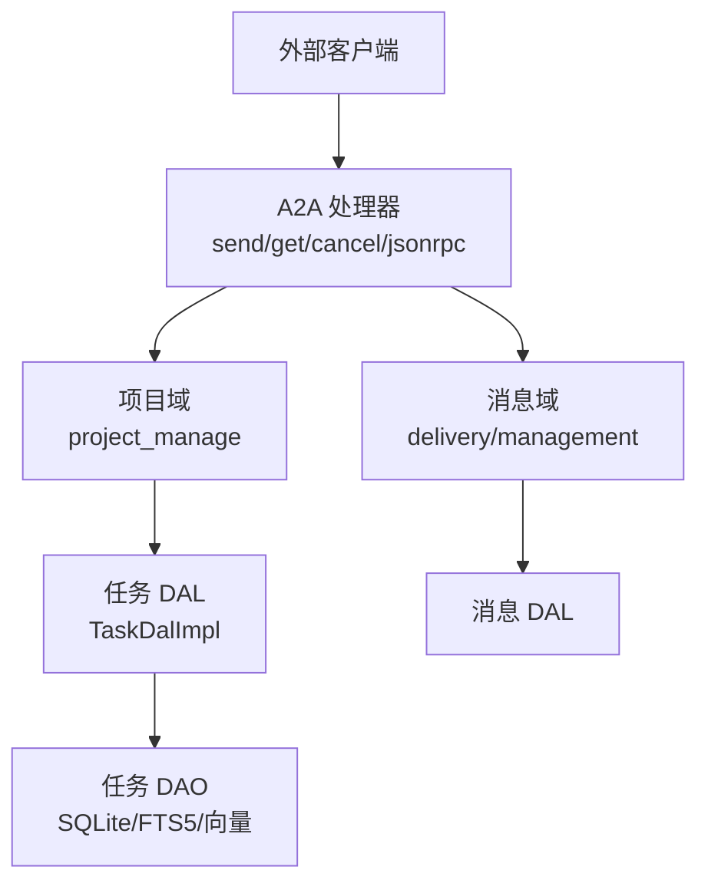
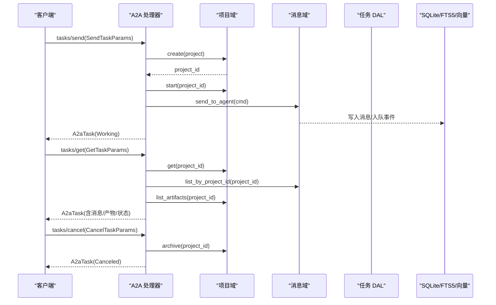
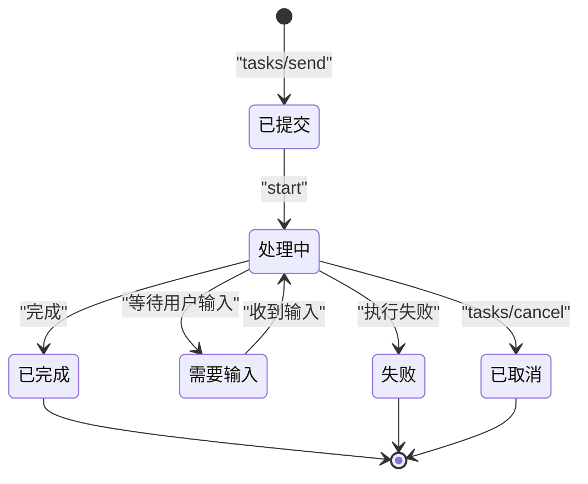
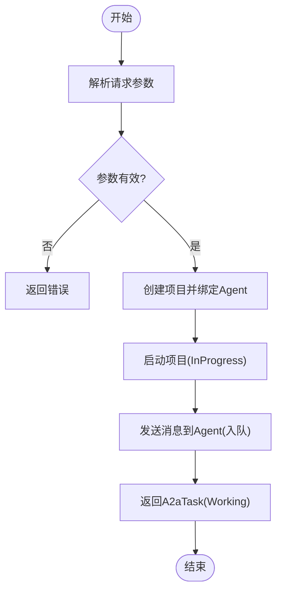
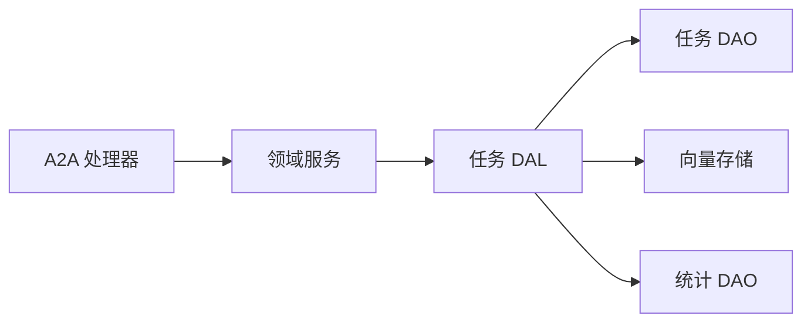

# 任务管理

<cite>
**本文引用的文件**
- [common/src/api/a2a.rs](common/src/api/a2a.rs)
- [src/handlers/a2a/mod.rs](src/handlers/a2a/mod.rs)
- [src/handlers/a2a/send_task.rs](src/handlers/a2a/send_task.rs)
- [src/handlers/a2a/get_task.rs](src/handlers/a2a/get_task.rs)
- [src/handlers/a2a/cancel_task.rs](src/handlers/a2a/cancel_task.rs)
- [src/models/task.rs](src/models/task.rs)
- [src/service/dal/task.rs](src/service/dal/task.rs)
- [common/src/enums/task.rs](common/src/enums/task.rs)
- [docs/external_agent_design.md](docs/external_agent_design.md)
</cite>

## 目录
1. [简介](#简介)
2. [项目结构](#项目结构)
3. [核心组件](#核心组件)
4. [架构总览](#架构总览)
5. [详细组件分析](#详细组件分析)
6. [依赖关系分析](#依赖关系分析)
7. [性能与并发](#性能与并发)
8. [故障排查](#故障排查)
9. [结论](#结论)
10. [附录：API 参考](#附录api-参考)

## 简介
本文件为 A2A 协议的任务管理系统提供完整技术文档，覆盖任务的创建、执行、查询、取消与完成状态；记录任务数据结构、状态机转换与持久化机制；说明任务调度、优先级管理与资源分配策略；包含并发控制、重试机制与失败处理；并提供完整的 API 接口文档（请求参数、响应格式、错误处理）以及监控、日志追踪与性能分析方法。

## 项目结构
A2A 任务管理位于“适配器层 → 领域层 → 数据访问层”的单向调用链中：
- 适配器层（HTTP Handler / JSON-RPC 入口）：负责协议解析、参数校验、调用领域服务并返回 A2A 协议对象。
- 领域层（Domain/DAL）：封装业务规则（项目/消息/任务）、统计与向量索引维护、事件发布。
- 数据访问层（DAO）：SQLite/FTS5/向量存储等具体实现。

图示来源
- [src/handlers/a2a/mod.rs:1-28](src/handlers/a2a/mod.rs#L1-L28)
- [src/handlers/a2a/send_task.rs:1-128](src/handlers/a2a/send_task.rs#L1-L128)
- [src/handlers/a2a/get_task.rs:1-49](src/handlers/a2a/get_task.rs#L1-L49)
- [src/handlers/a2a/cancel_task.rs:1-55](src/handlers/a2a/cancel_task.rs#L1-L55)
- [src/service/dal/task.rs:1-207](src/service/dal/task.rs#L1-L207)

章节来源
- [src/handlers/a2a/mod.rs:1-28](src/handlers/a2a/mod.rs#L1-L28)

## 核心组件
- A2A 协议类型：A2aTask、A2aTaskStatus、A2aTaskState、A2aMessage、A2aArtifact、SendTaskParams、GetTaskParams、CancelTaskParams。
- 任务模型：TaskPo（持久化对象，仅 DAO/DAL 使用）、Task（业务实体，聚合 po + 统计/产物）。
- 任务状态枚举：TaskStatus（Cancelled/PendingReview/Pending/InProgress/Completed/Archived）。
- 任务 DAL：TaskDalImpl，统一封装创建、查询、搜索、更新、状态变更、取消、统计、向量重建等能力。
- A2A 处理器：tasks/send、tasks/get、tasks/cancel、JSON-RPC 分发。

章节来源
- [common/src/api/a2a.rs:147-306](common/src/api/a2a.rs#L147-L306)
- [src/models/task.rs:16-81](src/models/task.rs#L16-L81)
- [common/src/enums/task.rs:8-27](common/src/enums/task.rs#L8-L27)
- [src/service/dal/task.rs:89-207](src/service/dal/task.rs#L89-L207)

## 架构总览
A2A 任务的生命周期由处理器驱动，通过领域服务与 DAL 完成持久化与事件发布，最终对外暴露 A2A 协议对象。

图示来源
- [src/handlers/a2a/send_task.rs:31-128](src/handlers/a2a/send_task.rs#L31-L128)
- [src/handlers/a2a/get_task.rs:17-49](src/handlers/a2a/get_task.rs#L17-L49)
- [src/handlers/a2a/cancel_task.rs:17-55](src/handlers/a2a/cancel_task.rs#L17-L55)

## 详细组件分析

### A2A 任务数据结构
- A2aTask：id（= project id）、session_id、status、messages、artifacts、metadata。
- A2aTaskStatus：state（Submitted/Working/InputRequired/Completed/Failed/Canceled）、timestamp、message。
- A2aMessage：role、parts、message_id、task_id。
- A2aArtifact：artifact_id、name、parts。
- SendTaskParams：id、message、session_id、metadata、notification_url。
- GetTaskParams：id、history_length。
- CancelTaskParams：id。

章节来源
- [common/src/api/a2a.rs:147-306](common/src/api/a2a.rs#L147-L306)

### 任务数据模型与持久化
- TaskPo：包含 id/title/description/status/priority/tags/due_at/start_at/end_at/dependencies/root_user_id/assignee_type/assignee_id/project_id/thinking_depth/progress/created_by/modified_by/created_at/updated_at/execution_plan/execution_result。
- Task：聚合 TaskPo 与 search_match/stats/model_call_stats/artifacts，提供 start/complete/cancel/set_progress 等业务方法。
- 持久化：SQLite 存储 TaskPo；FTS5 全文检索；向量索引（LanceDB/HNSW/InMemory/SqliteVss）用于语义搜索；统计信息通过 AOP 事件收集。

章节来源
- [src/models/task.rs:16-343](src/models/task.rs#L16-L343)
- [src/service/dal/task.rs:221-255](src/service/dal/task.rs#L221-L255)

### 状态机与转换
- 内部任务状态：TaskStatus（Cancelled/PendingReview/Pending/InProgress/Completed/Archived）。
- A2A 任务状态：A2aTaskState（Submitted/Working/InputRequired/Completed/Failed/Canceled）。
- 典型转换：
  - 提交：Pending → InProgress（项目启动时），对应 A2A Working。
  - 完成：InProgress → Completed，对应 A2A Completed。
  - 取消：任意活跃态 → Archived/Cancelled，对应 A2A Canceled。
  - 失败：运行时异常或外部 Agent 回调标记 Failed。
- 状态变更会发布 TaskStatusChangedEvent（AOP 异步消费，不阻塞主流程）。

图示来源
- [common/src/enums/task.rs:8-27](common/src/enums/task.rs#L8-L27)
- [common/src/api/a2a.rs:182-198](common/src/api/a2a.rs#L182-L198)
- [src/service/dal/task.rs:607-658](src/service/dal/task.rs#L607-L658)

章节来源
- [common/src/enums/task.rs:8-27](common/src/enums/task.rs#L8-L27)
- [common/src/api/a2a.rs:182-198](common/src/api/a2a.rs#L182-L198)
- [src/service/dal/task.rs:607-658](src/service/dal/task.rs#L607-L658)

### 任务生命周期与处理器
- 创建（tasks/send）：
  - 解析用户上下文，解析前台 Agent，创建项目（绑定 owner_agent_id），启动项目（转为 InProgress），发送消息到 Agent（自动入队 event_queue），立即返回 Working 状态的 A2aTask。
  - 可选 notification_url 注册 A2aCallback 渠道，后续消息推送至该 URL。
- 查询（tasks/get）：
  - 根据 task_id（project_id）查询项目、消息、产物，转换为 A2aTask 返回。
- 取消（tasks/cancel）：
  - 归档项目（对应 A2A Canceled），重新查询最新状态与消息/产物，返回 A2aTask。

图示来源
- [src/handlers/a2a/send_task.rs:31-128](src/handlers/a2a/send_task.rs#L31-L128)

章节来源
- [src/handlers/a2a/send_task.rs:31-128](src/handlers/a2a/send_task.rs#L31-L128)
- [src/handlers/a2a/get_task.rs:17-49](src/handlers/a2a/get_task.rs#L17-L49)
- [src/handlers/a2a/cancel_task.rs:17-55](src/handlers/a2a/cancel_task.rs#L17-L55)

### 任务调度、优先级与资源分配
- 调度：tasks/send 将消息投递到 event_queue，consumer 异步消费并唤醒 Agent（wake_agent_brain + awaken），复用现有消息通道链路。
- 优先级：Task.priority（数值越大优先级越高），在查询/排序时可结合使用。
- 资源分配：assignee_type/assignee_id 指定任务分配给 User 或 Agent；project_domain.create 支持绑定 owner_agent_id，使任务与 Agent 关联。
- 远程 Agent 异步更新：支持 Push 回调（POST /a2a/callback/:task_id）与 Poll 轮询（A2aPollingProducer 每 30 秒拉取远程状态），直接处理业务逻辑（新消息→send_to_user；状态变更→transition_status）。

章节来源
- [src/handlers/a2a/send_task.rs:75-91](src/handlers/a2a/send_task.rs#L75-L91)
- [docs/external_agent_design.md:107-135](docs/external_agent_design.md#L107-L135)
- [common/src/enums/task.rs:61-87](common/src/enums/task.rs#L61-L87)

### 并发控制、重试与失败处理
- 并发控制：消息入队后由 consumer 串行/并行消费（取决于队列配置），避免重复唤醒；状态变更通过事务保证一致性。
- 重试机制：外部 Agent 轮询兜底（每 30 秒），Push 回调优先；向量索引写入/更新失败降级为 warn 日志，不影响主流程。
- 失败处理：
  - 参数无效：InvalidRequest。
  - 未找到资源：not_found。
  - 向量化失败：降级并记录日志。
  - 状态变更：仅在状态实际变化时发布事件，避免重复。

章节来源
- [src/service/dal/task.rs:221-255](src/service/dal/task.rs#L221-L255)
- [src/service/dal/task.rs:607-658](src/service/dal/task.rs#L607-L658)
- [docs/external_agent_design.md:107-135](docs/external_agent_design.md#L107-L135)

### 监控、日志与性能分析
- 监控：AOP 事件中心记录 TaskStatusChangedEvent、ToolCallEvent、AgentAwakeEvent 等；系统域提供 AopStats 子能力读取内存收集器（滑动窗口 60 分钟）。
- 日志：工具调用日志（tool_tracing）按日 JSONL 持久化；向量索引操作记录 warn/debug 日志。
- 性能：混合搜索（FTS5 + 向量）默认前 20 条结果，距离阈值 0.8；统计查询支持时间范围与粒度（Daily/自定义）。

章节来源
- [src/service/dal/task.rs:366-571](src/service/dal/task.rs#L366-L571)
- [docs/superpowers/plans/2026-07-25-stats-charts-phase3.md:1-8](docs/superpowers/plans/2026-07-25-stats-charts-phase3.md#L1-L8)

## 依赖关系分析
- 处理器依赖领域服务（project/message），领域服务依赖 DAL，DAL 依赖 DAO。
- 向量索引依赖 Cortex/ModelProviderDao；统计依赖 ModelProviderStatsDao。
- A2A 协议类型与内部模型通过 mapper 转换。

图示来源
- [src/handlers/a2a/mod.rs:1-28](src/handlers/a2a/mod.rs#L1-L28)
- [src/service/dal/task.rs:211-219](src/service/dal/task.rs#L211-L219)

章节来源
- [src/service/dal/task.rs:211-219](src/service/dal/task.rs#L211-L219)

## 性能与并发
- 搜索性能：混合搜索先向量（Top 20，距离阈值 0.8），再 FTS5，合并去重后排序（Hybrid > Vector > Keyword），截断到 20 条并分页。
- 向量重建：rebuild_vectors 检查 model_provider_id 一致则跳过；否则清空集合并逐条 upsert，单条失败不影响整体。
- 统计查询：get_stats/get_model_call_stats 支持 time_range 与 interval，按需加载减少 IO。

章节来源
- [src/service/dal/task.rs:366-571](src/service/dal/task.rs#L366-L571)
- [src/service/dal/task.rs:723-800](src/service/dal/task.rs#L723-L800)

## 故障排查
- 常见问题：
  - 缺少用户上下文：InvalidRequest。
  - 任务不存在：not_found。
  - 向量索引失败：降级为 warn，不影响主流程。
  - 状态未变化：不发布事件，避免重复。
- 排查步骤：
  - 检查 A2A 请求参数（id、message、session_id、notification_url）。
  - 确认项目存在且状态活跃。
  - 查看 AOP 事件与日志（TaskStatusChangedEvent、vector_index、rebuild_vectors）。
  - 验证向量索引是否可用（Embedding Provider）。

章节来源
- [src/handlers/a2a/send_task.rs:31-43](src/handlers/a2a/send_task.rs#L31-L43)
- [src/handlers/a2a/get_task.rs:17-25](src/handlers/a2a/get_task.rs#L17-L25)
- [src/service/dal/task.rs:221-255](src/service/dal/task.rs#L221-L255)
- [src/service/dal/task.rs:607-658](src/service/dal/task.rs#L607-L658)

## 结论
A2A 任务管理以清晰的四层架构实现，通过处理器驱动领域服务与 DAL，完成任务的创建、执行、查询、取消与完成；状态机与事件机制确保一致性；混合搜索与向量索引提升查询性能；AOP 监控与日志提供可观测性；远程 Agent 的 Push/Poll 双通道保障可靠性。

## 附录：API 参考
- tasks/send
  - 方法：POST（JSON-RPC method: "tasks/send"）
  - 请求体：SendTaskParams（id、message、session_id、metadata、notification_url）
  - 响应：A2aTask（Working）
  - 错误：InvalidRequest（缺少用户上下文）、not_found（无可用前台 Agent）
- tasks/get
  - 方法：GET（JSON-RPC method: "tasks/get"）
  - 请求体：GetTaskParams（id、history_length）
  - 响应：A2aTask（含 messages、artifacts、status）
  - 错误：not_found（任务不存在）
- tasks/cancel
  - 方法：DELETE（JSON-RPC method: "tasks/cancel"）
  - 请求体：CancelTaskParams（id）
  - 响应：A2aTask（Canceled）
  - 错误：not_found（任务不存在）

章节来源
- [common/src/api/a2a.rs:267-306](common/src/api/a2a.rs#L267-L306)
- [src/handlers/a2a/send_task.rs:31-128](src/handlers/a2a/send_task.rs#L31-L128)
- [src/handlers/a2a/get_task.rs:17-49](src/handlers/a2a/get_task.rs#L17-L49)
- [src/handlers/a2a/cancel_task.rs:17-55](src/handlers/a2a/cancel_task.rs#L17-L55)