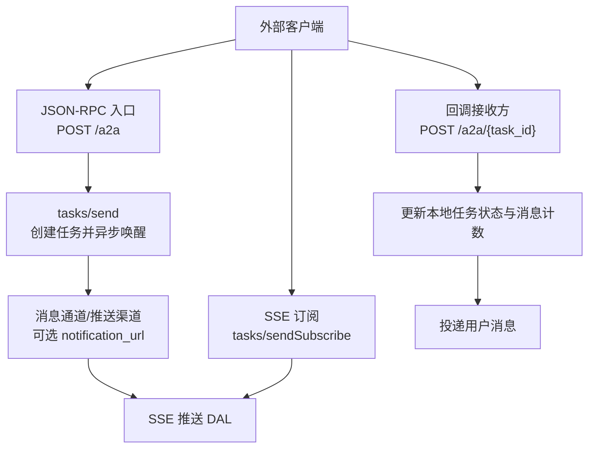
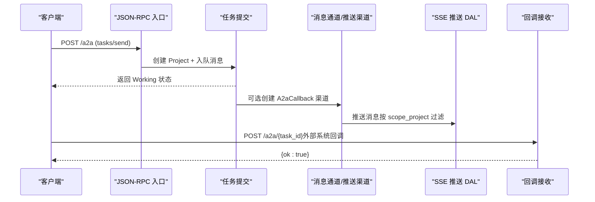
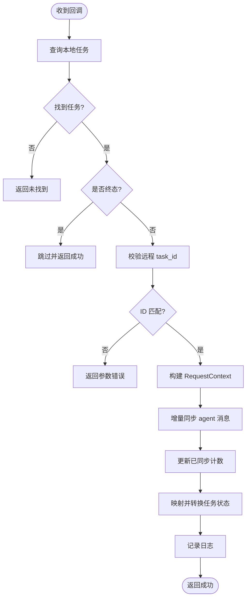
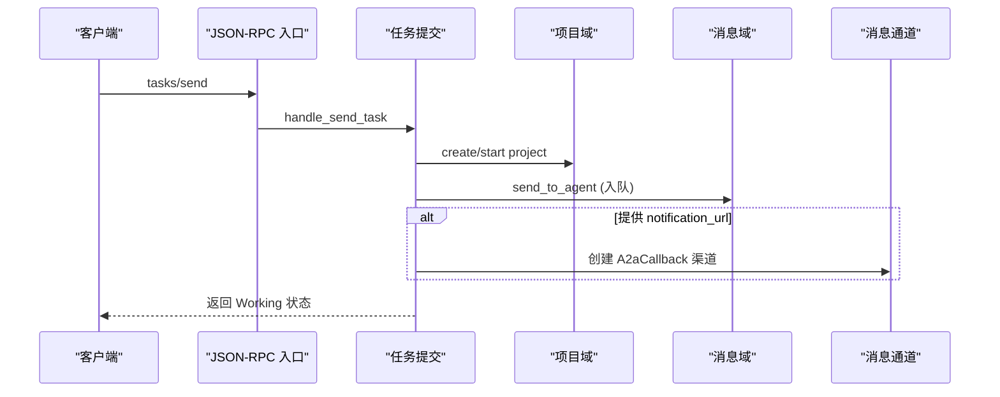
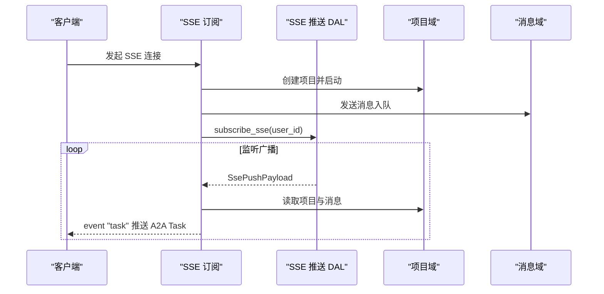
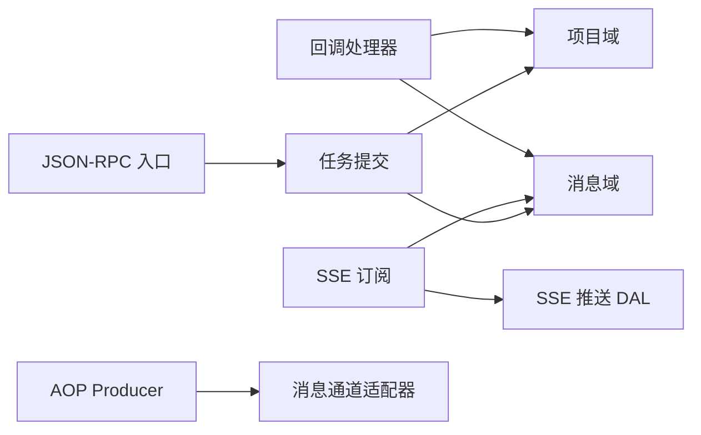

# 回调机制

<cite>
**本文引用的文件**
- [src/handlers/a2a/callback.rs](src/handlers/a2a/callback.rs)
- [src/handlers/a2a/send_task.rs](src/handlers/a2a/send_task.rs)
- [src/handlers/a2a/send_subscribe.rs](src/handlers/a2a/send_subscribe.rs)
- [src/handlers/a2a/jsonrpc.rs](src/handlers/a2a/jsonrpc.rs)
- [common/src/api/a2a.rs](common/src/api/a2a.rs)
- [src/service/dal/message_push.rs](src/service/dal/message_push.rs)
- [src/producer/mod.rs](src/producer/mod.rs)
- [src/producer/message_channel.rs](src/producer/message_channel.rs)
</cite>

## 目录
1. [简介](#简介)
2. [项目结构](#项目结构)
3. [核心组件](#核心组件)
4. [架构总览](#架构总览)
5. [详细组件分析](#详细组件分析)
6. [依赖关系分析](#依赖关系分析)
7. [性能与背压](#性能与背压)
8. [故障排查指南](#故障排查指南)
9. [结论](#结论)
10. [附录：示例代码路径](#附录示例代码路径)

## 简介
本文件面向 A2A 协议的回调机制，覆盖以下主题：
- 回调订阅流程、事件通知机制与消息推送方式
- 回调端点的注册、验证与安全配置
- 事件类型定义、消息格式与传输协议
- 重试策略、失败处理与幂等性保证
- 回调处理的完整示例（以源码路径引用）
- 回调性能优化、批量处理与背压机制方案

本项目采用严格四层单向调用：Adapter（HTTP Handler / 公开回调 Handler / AOP Producer）→ Domain → DAL → DAO。回调相关实现遵循该分层原则，Handler 层负责请求解析与编排，Domain/DAL/DAO 负责业务与持久化。

## 项目结构
与 A2A 回调相关的代码主要分布在以下位置：
- HTTP 回调入口与任务提交入口：src/handlers/a2a/*
- A2A 协议类型与消息格式：common/src/api/a2a.rs
- SSE 消息推送基础设施：src/service/dal/message_push.rs
- AOP Producer 注册与启动：src/producer/mod.rs、src/producer/message_channel.rs

图表来源
- [src/handlers/a2a/jsonrpc.rs:22-75](src/handlers/a2a/jsonrpc.rs#L22-L75)
- [src/handlers/a2a/send_task.rs:32-128](src/handlers/a2a/send_task.rs#L32-L128)
- [src/handlers/a2a/send_subscribe.rs:36-124](src/handlers/a2a/send_subscribe.rs#L36-L124)
- [src/handlers/a2a/callback.rs:17-197](src/handlers/a2a/callback.rs#L17-L197)
- [src/service/dal/message_push.rs:41-114](src/service/dal/message_push.rs#L41-L114)

章节来源
- [src/handlers/a2a/jsonrpc.rs:1-94](src/handlers/a2a/jsonrpc.rs#L1-L94)
- [src/handlers/a2a/send_task.rs:1-128](src/handlers/a2a/send_task.rs#L1-L128)
- [src/handlers/a2a/send_subscribe.rs:1-212](src/handlers/a2a/send_subscribe.rs#L1-L212)
- [src/handlers/a2a/callback.rs:1-198](src/handlers/a2a/callback.rs#L1-L198)
- [common/src/api/a2a.rs:1-306](common/src/api/a2a.rs#L1-L306)
- [src/service/dal/message_push.rs:1-163](src/service/dal/message_push.rs#L1-L163)
- [src/producer/mod.rs:1-27](src/producer/mod.rs#L1-L27)
- [src/producer/message_channel.rs:1-116](src/producer/message_channel.rs#L1-L116)

## 核心组件
- JSON-RPC 入口：统一路由 tasks/send、tasks/get、tasks/cancel，校验版本与启用开关，错误码标准化。
- 任务提交：创建 Project（对应 A2A Task），绑定 Agent，入队消息，立即返回 Working 状态；支持可选的 notification_url 建立回调渠道。
- SSE 订阅：复用 message_push_dal，按用户级广播通道推送完整 A2A Task 快照。
- 回调接收：校验任务存在与终态跳过、远程 task_id 一致性、增量同步 agent 消息、更新已同步计数、映射并转换任务状态。
- 推送 DAL：封装 SSE 订阅/取消/推送接口，序列化 payload 并通过底层 DAO 广播。
- AOP Producer：注册 a2a_polling 与 cron_trigger，message_channel 初始化适配器与消费者。

章节来源
- [src/handlers/a2a/jsonrpc.rs:22-94](src/handlers/a2a/jsonrpc.rs#L22-L94)
- [src/handlers/a2a/send_task.rs:32-128](src/handlers/a2a/send_task.rs#L32-L128)
- [src/handlers/a2a/send_subscribe.rs:36-124](src/handlers/a2a/send_subscribe.rs#L36-L124)
- [src/handlers/a2a/callback.rs:17-197](src/handlers/a2a/callback.rs#L17-L197)
- [src/service/dal/message_push.rs:41-114](src/service/dal/message_push.rs#L41-L114)
- [src/producer/mod.rs:9-25](src/producer/mod.rs#L9-L25)
- [src/producer/message_channel.rs:25-90](src/producer/message_channel.rs#L25-L90)

## 架构总览
A2A 回调机制由“任务提交—消息流转—回调推送”构成闭环：
- 客户端通过 JSON-RPC 提交任务，服务端创建 Project 并异步唤醒 Agent。
- 若提供 notification_url，则创建 A2aCallback 类型的消息通道，后续消息投递时按 scope_project 过滤并推送到该 URL。
- 客户端也可通过 SSE 订阅实时获取任务快照。
- 回调端点用于接收外部系统对任务状态的变更通知，进行幂等更新与消息同步。

图表来源
- [src/handlers/a2a/jsonrpc.rs:22-75](src/handlers/a2a/jsonrpc.rs#L22-L75)
- [src/handlers/a2a/send_task.rs:93-128](src/handlers/a2a/send_task.rs#L93-L128)
- [src/handlers/a2a/callback.rs:17-197](src/handlers/a2a/callback.rs#L17-L197)
- [src/service/dal/message_push.rs:73-103](src/service/dal/message_push.rs#L73-L103)

## 详细组件分析

### 回调接收处理器（handle_a2a_callback）
职责与流程：
- 校验任务存在且非终态（Completed/Cancelled/Archived），否则跳过。
- 校验本地任务标签中的远程 task_id 与回调中一致，防止串扰。
- 构建 RequestContext（caller_type=System），提取 agent_id、project_id、task_id。
- 增量同步 agent 消息：根据 tags 中的已同步计数，仅处理新增消息，提取文本后投递给用户。
- 更新已同步计数到任务标签，避免重复推送。
- 将 A2A 任务状态映射为本地任务状态并执行状态迁移。
- 记录日志并返回成功响应。

幂等性与一致性：
- 终态跳过确保多次回调不改变最终结果。
- 基于 tags 的已同步计数实现增量幂等。
- 远程 task_id 校验保障回调与任务一一对应。

图表来源
- [src/handlers/a2a/callback.rs:17-197](src/handlers/a2a/callback.rs#L17-L197)

章节来源
- [src/handlers/a2a/callback.rs:17-197](src/handlers/a2a/callback.rs#L17-L197)

### 任务提交（tasks/send）
职责与流程：
- 从 RequestContext 提取 user_id，缺失则报错。
- 解析前台 Agent，创建 Project（对应 A2A Task），绑定 owner_agent_id。
- 启动项目至 InProgress，创建消息并自动入队 event_queue。
- 若提供 notification_url，创建 A2aCallback 类型的消息通道，scope_project 限定为该任务。
- 立即返回 Working 状态的 A2A Task，等待后续回调或轮询。

图表来源
- [src/handlers/a2a/jsonrpc.rs:77-93](src/handlers/a2a/jsonrpc.rs#L77-L93)
- [src/handlers/a2a/send_task.rs:32-128](src/handlers/a2a/send_task.rs#L32-L128)

章节来源
- [src/handlers/a2a/send_task.rs:32-128](src/handlers/a2a/send_task.rs#L32-L128)
- [src/handlers/a2a/jsonrpc.rs:77-93](src/handlers/a2a/jsonrpc.rs#L77-L93)

### SSE 订阅（tasks/sendSubscribe）
职责与流程：
- 从 RequestContext 提取 user_id，缺失则返回错误事件。
- 创建 Project 与消息，复用现有 message_push 机制订阅用户 SSE 通道。
- 监听广播流，过滤目标 project_id，构造完整 A2A Task 事件推送。
- 进程退出时自动取消订阅。

图表来源
- [src/handlers/a2a/send_subscribe.rs:36-124](src/handlers/a2a/send_subscribe.rs#L36-L124)
- [src/service/dal/message_push.rs:86-103](src/service/dal/message_push.rs#L86-L103)

章节来源
- [src/handlers/a2a/send_subscribe.rs:36-124](src/handlers/a2a/send_subscribe.rs#L36-L124)
- [src/service/dal/message_push.rs:86-103](src/service/dal/message_push.rs#L86-L103)

### JSON-RPC 入口与分发
职责与流程：
- 检查 A2A Server 启用开关与 JSON-RPC 版本。
- 按 method 分派到 tasks/send、tasks/get、tasks/cancel。
- 统一错误码与响应格式。

章节来源
- [src/handlers/a2a/jsonrpc.rs:22-75](src/handlers/a2a/jsonrpc.rs#L22-L75)

### A2A 协议类型与消息格式
- A2aTask：包含 id、session_id、status、messages、artifacts、metadata。
- A2aTaskState：Submitted、Working、InputRequired、Completed、Failed、Canceled。
- A2aMessage：role（user/agent）、parts（Text/File/Data）。
- SendTaskParams：id、message、session_id、metadata、notification_url。

章节来源
- [common/src/api/a2a.rs:147-306](common/src/api/a2a.rs#L147-L306)

### 推送 DAL（SSE 推送）
- 提供 push_to_sse、subscribe_sse、unsubscribe_sse、sse_connection_count。
- 内部序列化 payload 并通过底层 DAO 广播。
- 测试用例展示订阅与推送的基本行为。

章节来源
- [src/service/dal/message_push.rs:41-114](src/service/dal/message_push.rs#L41-L114)
- [src/service/dal/message_push.rs:116-163](src/service/dal/message_push.rs#L116-L163)

### AOP Producer 注册与消息通道
- 启动阶段注册 CronTriggerProducer 与 A2aPollingProducer。
- 初始化消息通道适配器，将外部消息转换为内部命令并投递到 Agent。

章节来源
- [src/producer/mod.rs:9-25](src/producer/mod.rs#L9-L25)
- [src/producer/message_channel.rs:25-90](src/producer/message_channel.rs#L25-L90)

## 依赖关系分析
- Handler 层依赖 Domain 与 DAL，不直接访问 DAO。
- 回调处理器依赖项目域与消息域，完成状态迁移与消息投递。
- 推送 DAL 依赖底层 DAO，屏蔽广播细节。
- AOP Producer 在启动阶段注册，解耦业务逻辑与调度。

图表来源
- [src/handlers/a2a/callback.rs:17-197](src/handlers/a2a/callback.rs#L17-L197)
- [src/handlers/a2a/send_task.rs:32-128](src/handlers/a2a/send_task.rs#L32-L128)
- [src/handlers/a2a/send_subscribe.rs:36-124](src/handlers/a2a/send_subscribe.rs#L36-L124)
- [src/service/dal/message_push.rs:41-114](src/service/dal/message_push.rs#L41-L114)
- [src/producer/message_channel.rs:25-90](src/producer/message_channel.rs#L25-L90)

章节来源
- [src/handlers/a2a/callback.rs:17-197](src/handlers/a2a/callback.rs#L17-L197)
- [src/handlers/a2a/send_task.rs:32-128](src/handlers/a2a/send_task.rs#L32-L128)
- [src/handlers/a2a/send_subscribe.rs:36-124](src/handlers/a2a/send_subscribe.rs#L36-L124)
- [src/service/dal/message_push.rs:41-114](src/service/dal/message_push.rs#L41-L114)
- [src/producer/message_channel.rs:25-90](src/producer/message_channel.rs#L25-L90)

## 性能与背压
- 增量同步：回调处理器基于 tags 中的已同步计数仅处理新增消息，避免重复计算与 I/O。
- SSE 广播：按用户级广播通道推送，同一条消息自动推送给所有订阅者，减少重复构建与存储。
- 背压建议：
  - 在消息投递层使用有界队列或速率限制，防止瞬时峰值导致内存膨胀。
  - 对回调处理增加超时与并发上限，避免长尾请求阻塞。
  - 批量聚合：当同一任务短时间内产生多条消息时，可合并为一次推送，降低网络开销。
  - 监控指标：统计 delivered_count、连接数、错误率，结合告警动态调整阈值。

[本节为通用指导，不直接分析具体文件]

## 故障排查指南
常见问题与定位要点：
- 回调被跳过：检查任务是否处于终态（Completed/Cancelled/Archived）。
- 远程 ID 不匹配：确认本地任务标签中的远程 task_id 与回调一致。
- 消息未同步：检查 tags 中的已同步计数是否正确更新；查看投递错误日志。
- SSE 无推送：确认用户订阅成功、project_id 过滤条件正确、广播通道正常。
- JSON-RPC 错误：检查 A2A Server 启用开关、版本校验与方法名。

章节来源
- [src/handlers/a2a/callback.rs:30-52](src/handlers/a2a/callback.rs#L30-L52)
- [src/handlers/a2a/callback.rs:110-143](src/handlers/a2a/callback.rs#L110-L143)
- [src/handlers/a2a/jsonrpc.rs:26-58](src/handlers/a2a/jsonrpc.rs#L26-L58)

## 结论
A2A 回调机制在本项目中通过清晰的层次划分与标准化的协议类型实现：
- Handler 层专注请求编排与校验，Domain/DAL/DAO 承载业务与持久化。
- 回调处理器具备幂等性与一致性保障，支持增量同步与状态映射。
- SSE 订阅复用现有推送基础设施，提供实时任务快照。
- 通过可选的 notification_url 建立回调渠道，实现外部系统与内部任务的联动。
- 性能方面建议引入背压与批量聚合，结合监控指标持续优化。

[本节为总结，不直接分析具体文件]

## 附录：示例代码路径
- 回调接收与处理：[src/handlers/a2a/callback.rs:17-197](src/handlers/a2a/callback.rs#L17-L197)
- 任务提交与回调渠道创建：[src/handlers/a2a/send_task.rs:93-128](src/handlers/a2a/send_task.rs#L93-L128)
- SSE 订阅与推送：[src/handlers/a2a/send_subscribe.rs:36-124](src/handlers/a2a/send_subscribe.rs#L36-L124)
- JSON-RPC 入口与分发：[src/handlers/a2a/jsonrpc.rs:22-75](src/handlers/a2a/jsonrpc.rs#L22-L75)
- A2A 协议类型定义：[common/src/api/a2a.rs:147-306](common/src/api/a2a.rs#L147-L306)
- SSE 推送 DAL 接口与实现：[src/service/dal/message_push.rs:41-114](src/service/dal/message_push.rs#L41-L114)
- AOP Producer 注册与消息通道：[src/producer/mod.rs:9-25](src/producer/mod.rs#L9-L25)、[src/producer/message_channel.rs:25-90](src/producer/message_channel.rs#L25-L90)