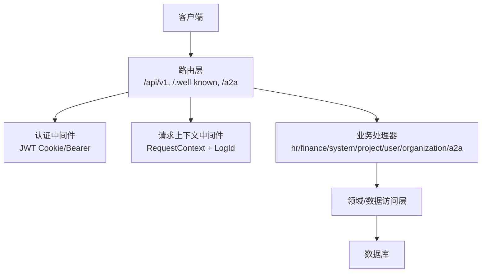
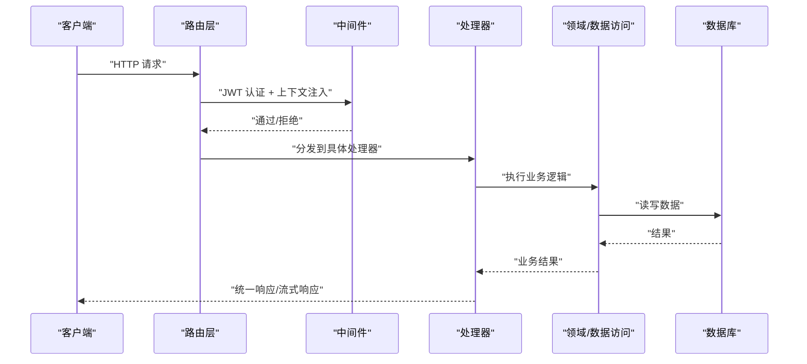
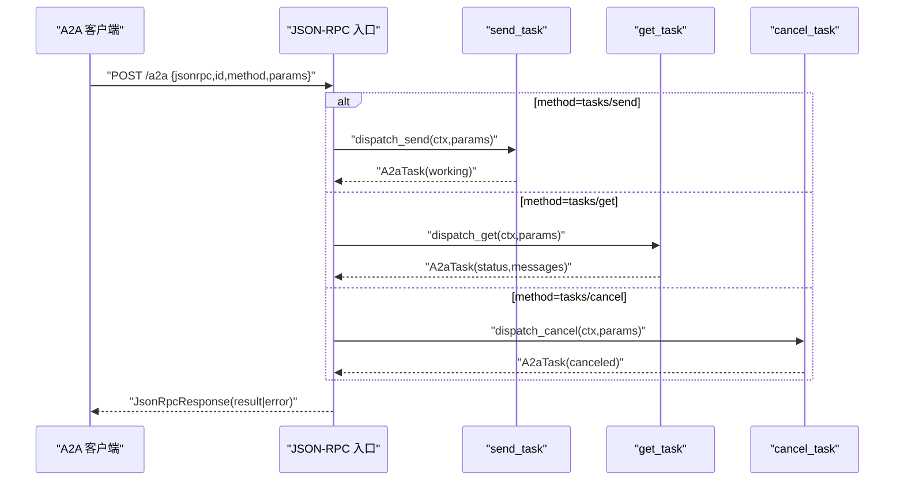
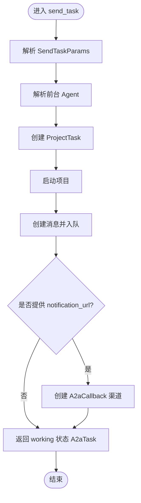
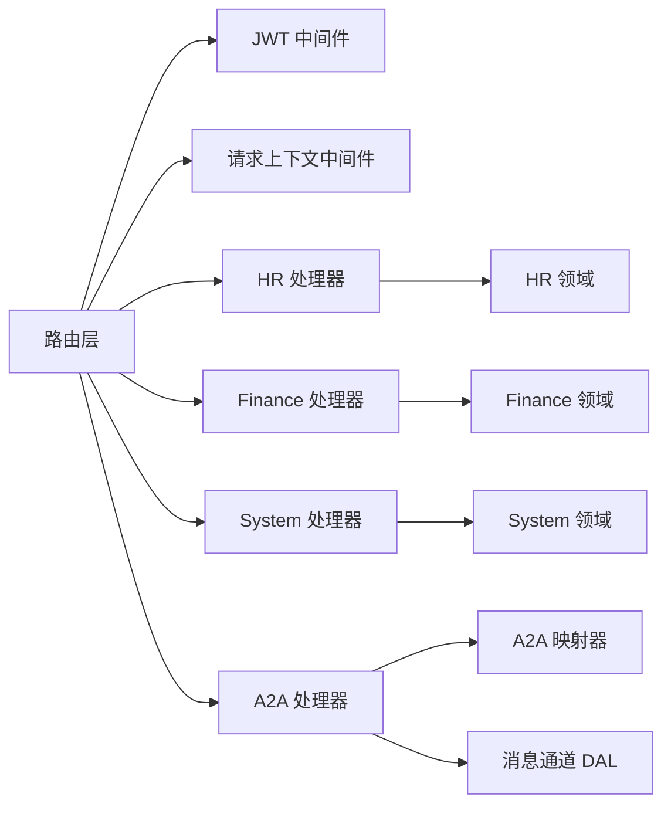

# API 参考

<cite>
**本文引用的文件**
- [src/main.rs](src/main.rs)
- [src/router.rs](src/router.rs)
- [common/src/api/mod.rs](common/src/api/mod.rs)
- [common/src/api/a2a.rs](common/src/api/a2a.rs)
- [src/handlers/a2a/mod.rs](src/handlers/a2a/mod.rs)
- [src/handlers/a2a/jsonrpc.rs](src/handlers/a2a/jsonrpc.rs)
- [src/handlers/a2a/send_task.rs](src/handlers/a2a/send_task.rs)
- [src/middleware/jwt_auth.rs](src/middleware/jwt_auth.rs)
- [src/middleware/request_context.rs](src/middleware/request_context.rs)
- [common/src/api/auth.rs](common/src/api/auth.rs)
- [src/handlers/organization/auth/login.rs](src/handlers/organization/auth/login.rs)
- [common/src/error/code.rs](common/src/error/code.rs)
- [common/config/ai_orz.toml](common/config/ai_orz.toml)
</cite>

## 目录
1. [简介](#简介)
2. [项目结构](#项目结构)
3. [核心组件](#核心组件)
4. [架构总览](#架构总览)
5. [详细接口说明](#详细接口说明)
6. [依赖关系分析](#依赖关系分析)
7. [性能与速率限制](#性能与速率限制)
8. [故障排查指南](#故障排查指南)
9. [结论](#结论)
10. [附录：版本、安全与兼容性](#附录版本安全与兼容性)

## 简介
本 API 参考文档面向 AI Orz 的后端服务，覆盖以下能力：
- RESTful API：组织、用户、项目、任务、工具、消息通道、MCP 服务器、系统管理等模块的 HTTP 接口。
- A2A 协议接口：基于 JSON-RPC 2.0 的任务提交、查询、取消，以及 Agent Card 发现与 SSE 订阅。
- WebSocket/SSE 实时通信：SSE 流式推送（如 /finance/messages/sse）与 A2A subscribe。
- 认证与安全：JWT Cookie/Bearer 双模式认证、角色权限控制、请求上下文注入。
- 错误处理：统一响应格式、标准错误码、JSON-RPC 错误码。
- 配置与版本：A2A Server 开关、JWT 过期时间、监听端口等。
- 客户端实现指南、调试与监控建议、迁移与兼容说明。

## 项目结构
后端采用 Axum 路由分层：
- 入口：main.rs 启动服务并调用框架运行。
- 路由：router.rs 定义公开路由、受保护路由、A2A 协议路由、健康检查与静态资源。
- 中间件：jwt_auth.rs 负责 JWT 校验；request_context.rs 负责从请求头构建 RequestContext 并注入日志 ID。
- 处理器：handlers/* 按业务域划分（hr、finance、system、project、user、organization、a2a 等）。
- 共享 DTO：common/src/api/* 提供前后端共享的请求/响应类型与分页结构。

图表来源
- [src/router.rs:12-59](src/router.rs#L12-L59)
- [src/middleware/jwt_auth.rs:25-87](src/middleware/jwt_auth.rs#L25-L87)
- [src/middleware/request_context.rs:20-40](src/middleware/request_context.rs#L20-L40)

章节来源
- [src/main.rs:1-5](src/main.rs#L1-L5)
- [src/router.rs:12-740](src/router.rs#L12-L740)
- [common/src/api/mod.rs:1-156](common/src/api/mod.rs#L1-L156)

## 核心组件
- 统一响应体 ApiResponse<T>：包含 code、message、data，用于所有 HTTP 响应。
- 分页参数与结果：PaginationParams、PagedResult<T>。
- A2A 协议类型：AgentCard、JsonRpcRequest/Response、Task、Message、Artifact、方法参数等。
- 认证流程：登录返回 JWT，浏览器通过 Cookie 自动携带，API 调用使用 Authorization: Bearer。
- 请求上下文：从请求头提取用户信息、组织、角色，生成或透传 LogId。

章节来源
- [common/src/api/mod.rs:6-83](common/src/api/mod.rs#L6-L83)
- [common/src/api/a2a.rs:10-145](common/src/api/a2a.rs#L10-L145)
- [common/src/api/auth.rs:1-39](common/src/api/auth.rs#L1-L39)
- [src/middleware/jwt_auth.rs:25-87](src/middleware/jwt_auth.rs#L25-L87)
- [src/middleware/request_context.rs:20-40](src/middleware/request_context.rs#L20-L40)

## 架构总览
整体调用链：
- 客户端发起 HTTP 请求。
- 路由层根据路径选择公开或受保护路由。
- 中间件进行 JWT 认证与上下文注入。
- 处理器执行业务逻辑，调用领域/数据访问层。
- 数据持久化到数据库，必要时触发异步消费者（消息队列/AOP）。
- 返回统一响应或流式响应（SSE）。

图表来源
- [src/router.rs:12-59](src/router.rs#L12-L59)
- [src/middleware/jwt_auth.rs:25-87](src/middleware/jwt_auth.rs#L25-L87)
- [src/middleware/request_context.rs:20-40](src/middleware/request_context.rs#L20-L40)

## 详细接口说明

### 通用约定
- 基础路径：/api/v1（REST）、/.well-known/agent.json（A2A 发现）、/a2a（A2A JSON-RPC）、/a2a/subscribe（A2A SSE）、/health（健康检查）。
- 统一响应：ApiResponse<T>，code=0 表示成功，非零为错误；data 在成功时存在。
- 分页：PaginationParams（limit、offset），PagedResult<T>（items、total）。
- 认证：
  - 浏览器：Cookie ai_orz_jwt 自动携带。
  - API：Authorization: Bearer <token>。
  - 未认证：浏览器 302 重定向到登录页；API 返回 401 JSON。
- 请求上下文：X-User-Id、X-User-Name、X-Organization-Id、X-User-Role、Caller-Type；LogId 写回响应头。

章节来源
- [common/src/api/mod.rs:6-83](common/src/api/mod.rs#L6-L83)
- [src/middleware/jwt_auth.rs:25-87](src/middleware/jwt_auth.rs#L25-L87)
- [src/middleware/request_context.rs:20-40](src/middleware/request_context.rs#L20-L40)

### 认证与组织
- POST /api/v1/organization/auth/login
  - 请求：LoginRequest（username、password_hash、organization_id）。
  - 响应：ApiResponse<LoginResponse>（user_id、username、organization_id、token）。
  - 行为：验证凭据，签发 JWT，设置 Cookie（浏览器场景），返回 token（API 场景）。
- POST /api/v1/organization/auth/logout
  - 登出（清除会话/Cookie）。
- GET /api/v1/organization/list
  - 列出组织（公开查询，无需登录）。

章节来源
- [common/src/api/auth.rs:1-39](common/src/api/auth.rs#L1-L39)
- [src/handlers/organization/auth/login.rs:18-69](src/handlers/organization/auth/login.rs#L18-L69)
- [src/router.rs:63-94](src/router.rs#L63-L94)

### 项目与任务（REST）
- 项目
  - POST /api/v1/projects
  - GET /api/v1/projects
  - POST /api/v1/projects/query
  - POST /api/v1/projects/search
  - GET /api/v1/projects/{id}
  - PUT /api/v1/projects/{id}
  - PUT /api/v1/projects/{id}/status
- 任务
  - POST /api/v1/tasks
  - GET /api/v1/tasks
  - POST /api/v1/tasks/query
  - POST /api/v1/tasks/search
  - GET /api/v1/tasks/{id}
  - PUT /api/v1/tasks/{id}
  - PUT /api/v1/tasks/{id}/status
  - PUT /api/v1/tasks/{id}/progress
  - GET /api/v1/projects/{project_id}/tasks
  - GET /api/v1/agents/{agent_id}/tasks

章节来源
- [src/router.rs:145-213](src/router.rs#L145-L213)

### 产物（Artifacts，REST）
- POST /api/v1/artifacts
- GET /api/v1/artifacts
- POST /api/v1/artifacts/text
- POST /api/v1/artifacts/register-from-path
- GET /api/v1/artifacts/{id}
- PUT /api/v1/artifacts/{id}
- DELETE /api/v1/artifacts/{id}
- GET /api/v1/artifacts/{id}/content

章节来源
- [src/router.rs:215-240](src/router.rs#L215-L240)

### 组织管理（受保护）
- GET /api/v1/organization/me
- PUT /api/v1/organization/me
- GET /api/v1/organization/
- GET /api/v1/organization/{organization_id}
- PUT /api/v1/organization/{organization_id}
- DELETE /api/v1/organization/{organization_id}
- 子路由 /api/v1/organization/user/*（创建、列表、更新、删除用户等）

章节来源
- [src/router.rs:242-290](src/router.rs#L242-L290)

### HR（智能体与技能）
- 智能体
  - POST /api/v1/hr/agents
  - GET /api/v1/hr/agents
  - POST /api/v1/hr/agents/query
  - POST /api/v1/hr/agents/search
  - GET /api/v1/hr/agents/reception
  - POST /api/v1/hr/agents/external
  - GET /api/v1/hr/agents/{id}
  - PUT /api/v1/hr/agents/{id}
  - PUT /api/v1/hr/agents/{id}/status
  - DELETE /api/v1/hr/agents/{id}
  - 工具包/技能包安装卸载、绑定工具等
- 技能
  - CRUD、查询、搜索、标签、文件内容读取/更新、推荐种子节点、记忆检索等

章节来源
- [src/router.rs:292-413](src/router.rs#L292-L413)

### 财务（模型、消息通道、MCP、工具）
- 附件上传/文本附件/内容获取/更新/删除
- 模型提供者：CRUD、测试连接、切换嵌入、重建进度、调用模型
- 消息：发送、列表、搜索、SSE 订阅
- 消息通道：CRUD、状态更新、测试连接
- MCP 服务器：CRUD、状态更新、同步工具、列出工具
- 工具：CRUD、查询、搜索、标签、调试调用、绑定/解绑

章节来源
- [src/router.rs:415-601](src/router.rs#L415-L601)

### 系统管理（需 Admin 角色）
- 定时任务：CRUD、暂停/恢复
- 备份：创建、列表、删除、恢复
- 日志：查询、级别分布、时序统计
- AOP 监控：队列统计、事件列表、事件详情、实时统计概览/时序/分布
- 健康指标聚合
- Seed 配置：列表、下载、删除、保存、加载、diff、默认应用
- 后台任务：进度查询、列表、清理

章节来源
- [src/router.rs:603-739](src/router.rs#L603-L739)

### A2A 协议接口

#### Agent Card 发现
- GET /.well-known/agent.json
  - 公开访问，无需 JWT。
  - 返回组织级 AgentCard（名称、描述、版本、URL、能力声明、技能列表、默认输入/输出模式）。

章节来源
- [src/router.rs:19-26](src/router.rs#L19-L26)
- [common/src/api/a2a.rs:10-62](common/src/api/a2a.rs#L10-L62)

#### JSON-RPC 2.0 入口
- POST /a2a
  - 需要 JWT（Bearer 或 Cookie）。
  - 请求体：JsonRpcRequest（jsonrpc="2.0"、id、method、params）。
  - 支持方法：
    - tasks/send：异步提交任务，立即返回 working 状态。
    - tasks/get：查询任务状态与消息。
    - tasks/cancel：取消任务。
  - 响应：JsonRpcResponse（result 或 error）。
  - 错误：遵循 JSON-RPC 标准错误码（解析错误、无效请求、方法未找到、参数无效、内部错误）。

图表来源
- [src/handlers/a2a/jsonrpc.rs:21-94](src/handlers/a2a/jsonrpc.rs#L21-L94)
- [src/handlers/a2a/send_task.rs:31-128](src/handlers/a2a/send_task.rs#L31-L128)
- [common/src/api/a2a.rs:64-145](common/src/api/a2a.rs#L64-L145)

章节来源
- [src/handlers/a2a/jsonrpc.rs:1-94](src/handlers/a2a/jsonrpc.rs#L1-L94)
- [common/src/api/a2a.rs:64-145](common/src/api/a2a.rs#L64-L145)

#### A2A 任务提交（tasks/send）
- 行为：
  - 解析 params（SendTaskParams：id、message、session_id、metadata、notification_url）。
  - 解析前台 Agent，创建 Project（对应 Task），启动项目。
  - 创建消息并入队，异步唤醒 Agent。
  - 立即返回 working 状态的 A2aTask。
  - 可选：若提供 notification_url，创建 A2aCallback 渠道以推送任务状态变更。

图表来源
- [src/handlers/a2a/send_task.rs:31-128](src/handlers/a2a/send_task.rs#L31-L128)

章节来源
- [src/handlers/a2a/send_task.rs:1-128](src/handlers/a2a/send_task.rs#L1-L128)

#### A2A 订阅（SSE）
- POST /a2a/subscribe
  - 需要 JWT。
  - 建立 SSE 流式通道，接收任务状态更新与消息推送。

章节来源
- [src/router.rs:39-48](src/router.rs#L39-L48)

#### A2A 回调（外部 Agent 推送）
- POST /a2a/callback/{task_id}
  - 公开端点，无需 JWT。
  - 用于外部 Agent 推送任务更新到本服务。

章节来源
- [src/router.rs:49-56](src/router.rs#L49-L56)

### 实时通信（SSE/WebSocket）
- SSE 订阅：
  - /finance/messages/sse：消息流式推送。
  - /a2a/subscribe：A2A 任务状态与消息推送。
- WebSocket：当前代码库未发现显式 WebSocket 路由；如需扩展，可在 router.rs 中新增 ws 路由并接入消息通道。

章节来源
- [src/router.rs:485-496](src/router.rs#L485-L496)
- [src/router.rs:39-48](src/router.rs#L39-L48)

## 依赖关系分析
- 路由依赖中间件：
  - jwt_auth_middleware：外层先执行，负责认证与用户信息注入。
  - request_context_middleware：内层后执行，负责构建 RequestContext 与 LogId。
- 处理器依赖领域/数据访问层：
  - hr_domain、project_domain、message_domain 等。
- A2A 处理器依赖：
  - mapper：A2A 实体与内部实体转换。
  - message_channel：用于 PushNotifications 回调渠道。
- 错误处理：
  - 统一错误码与 HTTP 状态映射。
  - JSON-RPC 错误码与内部错误包装。

图表来源
- [src/router.rs:12-59](src/router.rs#L12-L59)
- [src/handlers/a2a/mod.rs:1-28](src/handlers/a2a/mod.rs#L1-L28)

章节来源
- [src/router.rs:12-59](src/router.rs#L12-L59)
- [src/handlers/a2a/mod.rs:1-28](src/handlers/a2a/mod.rs#L1-L28)

## 性能与速率限制
- 异步处理：
  - A2A tasks/send 不等待 Agent 回复，立即返回 working，降低请求延迟。
  - 消息入队由消费者异步处理，避免阻塞请求线程。
- 流式推送：
  - SSE 用于实时消息与任务状态更新，减少轮询开销。
- 缓存与索引：
  - 向量存储与 FTS5 全文索引提升搜索性能（见迁移脚本与存储模块）。
- 速率限制：
  - 当前代码未内置全局速率限制；建议在网关层或中间件层添加限流策略（如令牌桶/漏桶）。
- 监控与可观测性：
  - AOP 队列统计、日志级别分布与时序、健康指标聚合，便于容量规划与瓶颈定位。

[本节为通用指导，无特定文件分析]

## 故障排查指南
- 认证失败：
  - 浏览器：检查 Cookie ai_orz_jwt 是否存在且有效；未认证将 302 重定向到登录页。
  - API：检查 Authorization: Bearer 是否正确；未认证返回 401 JSON。
- 请求上下文缺失：
  - 确认中间件顺序：jwt_auth_middleware 必须在 request_context_middleware 之前。
  - 检查请求头是否包含必要字段（X-User-Id、X-User-Name、X-Organization-Id、X-User-Role）。
- A2A 错误：
  - JSON-RPC 错误码：-32700（解析错误）、-32600（无效请求）、-32601（方法未找到）、-32602（参数无效）、-32603（内部错误）。
  - 检查 A2A Server 是否启用（配置项 a2a_server.enabled）。
- 日志与追踪：
  - 响应头包含 LogId，便于跨链路追踪。
  - 系统日志查询与统计接口可用于问题定位。

章节来源
- [src/middleware/jwt_auth.rs:25-87](src/middleware/jwt_auth.rs#L25-L87)
- [src/middleware/request_context.rs:20-40](src/middleware/request_context.rs#L20-L40)
- [common/src/api/a2a.rs:121-145](common/src/api/a2a.rs#L121-L145)
- [common/src/error/code.rs:1-146](common/src/error/code.rs#L1-L146)

## 结论
AI Orz 提供了完整的 RESTful API、A2A 协议接口与实时通信能力，具备统一的认证、上下文、错误处理与监控机制。通过模块化路由与中间件设计，服务具备良好的可扩展性与可维护性。建议在生产环境启用 HTTPS、调整 JWT 密钥与过期时间，并在网关层实施速率限制与审计。

[本节为总结，无特定文件分析]

## 附录：版本、安全与兼容性

### 版本信息
- A2A 协议版本：v0.3.0（见 AgentCard.version）。
- JSON-RPC 版本：固定为 "2.0"。
- API 版本：/api/v1。

章节来源
- [common/src/api/a2a.rs:10-36](common/src/api/a2a.rs#L10-L36)
- [src/handlers/a2a/jsonrpc.rs:37-44](src/handlers/a2a/jsonrpc.rs#L37-L44)
- [src/router.rs:12-18](src/router.rs#L12-L18)

### 安全考虑
- JWT：
  - 生产环境务必修改签名密钥（JWT_SECRET）。
  - 合理设置过期时间（JWT_EXPIRY_HOURS）。
- 角色权限：
  - 系统管理路由要求 Admin 角色；高危操作在 handler 内二次校验 SuperAdmin。
- 传输安全：
  - 建议启用 HTTPS；Cookie secure 标志可根据环境配置。

章节来源
- [common/config/ai_orz.toml:36-42](common/config/ai_orz.toml#L36-L42)
- [src/router.rs:110-117](src/router.rs#L110-L117)
- [src/handlers/organization/auth/login.rs:40-49](src/handlers/organization/auth/login.rs#L40-L49)

### 向后兼容与迁移
- 统一响应格式 ApiResponse<T> 与分页结构已稳定，建议客户端基于此适配。
- A2A 协议遵循 v0.3.0，未来升级需关注 AgentCard.version 与方法变更。
- 若引入 WebSocket，需在路由层新增 ws 路由并保持与现有认证/上下文中间件一致。

[本节为通用指导，无特定文件分析]