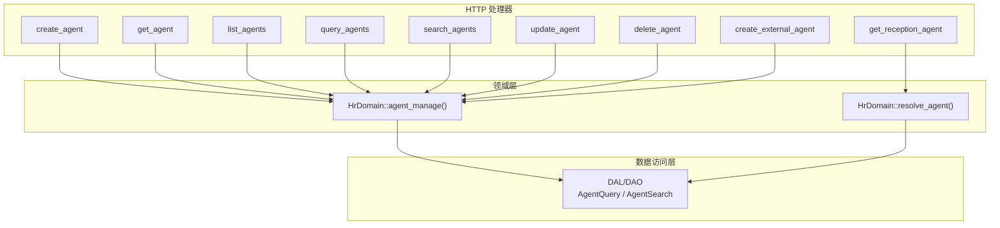
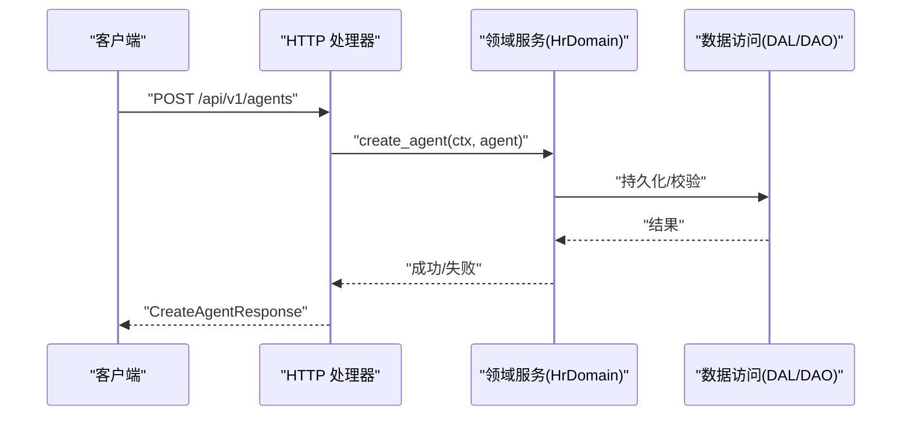
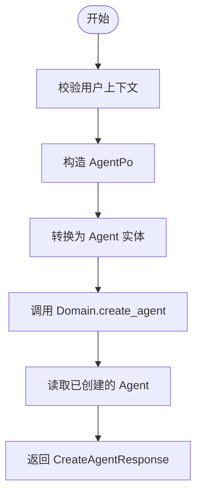
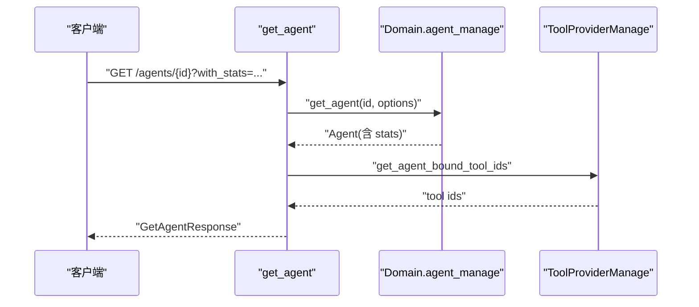
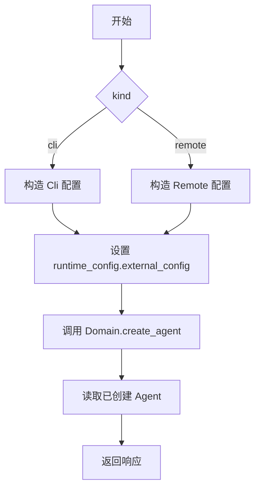
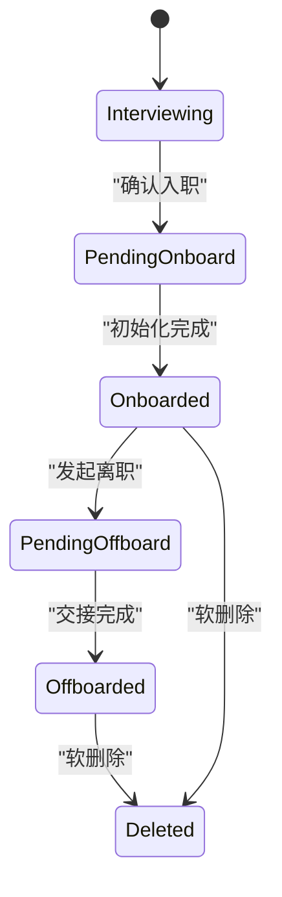
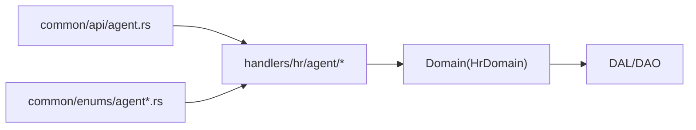

# Agent 管理 API

<cite>
**本文引用的文件**
- [src/handlers/hr/agent/mod.rs](src/handlers/hr/agent/mod.rs)
- [common/src/api/agent.rs](common/src/api/agent.rs)
- [src/handlers/hr/agent/create_agent.rs](src/handlers/hr/agent/create_agent.rs)
- [src/handlers/hr/agent/get_agent.rs](src/handlers/hr/agent/get_agent.rs)
- [src/handlers/hr/agent/list_agents.rs](src/handlers/hr/agent/list_agents.rs)
- [src/handlers/hr/agent/query_agents.rs](src/handlers/hr/agent/query_agents.rs)
- [src/handlers/hr/agent/search_agents.rs](src/handlers/hr/agent/search_agents.rs)
- [src/handlers/hr/agent/update_agent.rs](src/handlers/hr/agent/update_agent.rs)
- [src/handlers/hr/agent/delete_agent.rs](src/handlers/hr/agent/delete_agent.rs)
- [src/handlers/hr/agent/create_external_agent.rs](src/handlers/hr/agent/create_external_agent.rs)
- [src/handlers/hr/agent/get_reception_agent.rs](src/handlers/hr/agent/get_reception_agent.rs)
- [common/src/enums/agent.rs](common/src/enums/agent.rs)
- [common/src/enums/agent_kind.rs](common/src/enums/agent_kind.rs)
- [AgentRuntimeInfo 状态机 + BusyGuard RAII：Idle/Busy/Resting 三态转换 + task_id/project_id 业务上下文 + 前端 runtime-list 过滤](docs/wiki/knowledge/zh/AgentRuntimeInfo 三态状态机 + BusyGuard RAII：Idle Busy Resting 转换 + task_id project_id 业务上下文透视/AgentRuntimeInfo 三态状态机 + BusyGuard RAII：Idle Busy Resting 转换 + task_id project_id 业务上下文透视.md)
</cite>

## 目录
1. [简介](#简介)
2. [项目结构](#项目结构)
3. [核心组件](#核心组件)
4. [架构总览](#架构总览)
5. [详细组件分析](#详细组件分析)
6. [依赖关系分析](#依赖关系分析)
7. [性能考虑](#性能考虑)
8. [故障排查指南](#故障排查指南)
9. [结论](#结论)
10. [附录](#附录)

## 简介
本文件为 Agent 管理 API 的完整技术文档，覆盖 Agent 全生命周期管理与高级查询能力。内容包含：
- 标准 CRUD：创建、获取详情、列表、更新、删除
- 外部 Agent 集成：CLI/Remote 类型 Agent 的创建与配置
- 接待 Agent：统一路由到当前可用的前台 Agent
- 复杂查询与搜索：分页过滤、关键词搜索、FTS5 + 向量语义混合搜索
- 状态管理：Agent 生命周期状态与运行时状态
- 最佳实践：错误处理、批量操作建议、性能优化建议

## 项目结构
Agent 管理相关接口位于 handlers 层，按方法粒度拆分；请求/响应 DTO 定义在 common 层；枚举（状态、类型）也在 common 层；Domain/DAL/DAO 通过 Domain 入口被 Handler 调用。

图表来源
- [src/handlers/hr/agent/mod.rs:1-55](src/handlers/hr/agent/mod.rs#L1-L55)
- [common/src/api/agent.rs:1-394](common/src/api/agent.rs#L1-L394)

章节来源
- [src/handlers/hr/agent/mod.rs:1-55](src/handlers/hr/agent/mod.rs#L1-L55)

## 核心组件
- 请求/响应 DTO：统一在 common 层定义，便于前后端共享
- 处理器（Handler）：每个方法一个文件，职责单一，负责参数校验、上下文提取、调用 Domain
- 领域服务（Domain）：封装业务规则（如状态流转、路由策略），对外暴露统一接口
- 数据访问（DAL/DAO）：实现查询、搜索、分页等持久化逻辑

章节来源
- [common/src/api/agent.rs:1-394](common/src/api/agent.rs#L1-L394)
- [src/handlers/hr/agent/create_agent.rs:1-60](src/handlers/hr/agent/create_agent.rs#L1-L60)
- [src/handlers/hr/agent/get_agent.rs:1-138](src/handlers/hr/agent/get_agent.rs#L1-L138)
- [src/handlers/hr/agent/list_agents.rs:1-62](src/handlers/hr/agent/list_agents.rs#L1-L62)
- [src/handlers/hr/agent/query_agents.rs:1-69](src/handlers/hr/agent/query_agents.rs#L1-L69)
- [src/handlers/hr/agent/search_agents.rs:1-68](src/handlers/hr/agent/search_agents.rs#L1-L68)
- [src/handlers/hr/agent/update_agent.rs:1-87](src/handlers/hr/agent/update_agent.rs#L1-L87)
- [src/handlers/hr/agent/delete_agent.rs:1-35](src/handlers/hr/agent/delete_agent.rs#L1-L35)
- [src/handlers/hr/agent/create_external_agent.rs:1-124](src/handlers/hr/agent/create_external_agent.rs#L1-L124)
- [src/handlers/hr/agent/get_reception_agent.rs:1-39](src/handlers/hr/agent/get_reception_agent.rs#L1-L39)

## 架构总览
遵循四层单向调用：Adapter（HTTP Handler）→ Domain → DAL → DAO。Handler 仅做参数解析与上下文传递，Domain 承载业务规则，DAL/DAO 专注数据访问。

图表来源
- [src/handlers/hr/agent/create_agent.rs:1-60](src/handlers/hr/agent/create_agent.rs#L1-L60)
- [common/src/api/agent.rs:10-38](common/src/api/agent.rs#L10-L38)

## 详细组件分析

### 创建 Agent（create_agent）
- 功能：创建本地 Agent，设置名称、角色、描述、能力、灵魂提示词、模型提供商 ID
- 输入：CreateAgentRequest
- 输出：CreateAgentResponse（id、name、description、created_at）
- 关键点：
  - 校验用户上下文
  - 构造 AgentPo 并转为 Agent 实体
  - 调用 Domain 创建后，再读取一次以返回 created_at

图表来源
- [src/handlers/hr/agent/create_agent.rs:1-60](src/handlers/hr/agent/create_agent.rs#L1-L60)
- [common/src/api/agent.rs:10-38](common/src/api/agent.rs#L10-L38)

章节来源
- [src/handlers/hr/agent/create_agent.rs:1-60](src/handlers/hr/agent/create_agent.rs#L1-L60)
- [common/src/api/agent.rs:10-38](common/src/api/agent.rs#L10-L38)

### 获取 Agent 详情（get_agent）
- 功能：根据 ID 获取 Agent 详情，支持可选统计信息加载
- 输入：GetAgentRequest（path id，query with_stats、with_model_call_stats、stats_time_start/end、stats_interval）
- 输出：GetAgentResponse（含 kind、external_config、runtime_state、tools、stats 等）
- 关键点：
  - 根据 kind 组装 external_config（cli/remote）
  - 从 runtime_info 读取运行时状态与当前消息 ID
  - 查询已绑定工具 ID 列表

图表来源
- [src/handlers/hr/agent/get_agent.rs:1-138](src/handlers/hr/agent/get_agent.rs#L1-L138)
- [common/src/api/agent.rs:80-182](common/src/api/agent.rs#L80-L182)

章节来源
- [src/handlers/hr/agent/get_agent.rs:1-138](src/handlers/hr/agent/get_agent.rs#L1-L138)
- [common/src/api/agent.rs:80-182](common/src/api/agent.rs#L80-L182)

### 列出 Agent（list_agents）
- 功能：分页列出 Agent，默认排除 Deleted，按 created_at 降序
- 输入：ListAgentsRequest（分页参数）
- 输出：PagedResult<AgentListItem>
- 关键点：
  - 使用 Domain.query 内置 exclude_status=Deleted
  - 列表项包含运行时状态（来自 runtime_info）

章节来源
- [src/handlers/hr/agent/list_agents.rs:1-62](src/handlers/hr/agent/list_agents.rs#L1-L62)
- [common/src/api/agent.rs:254-268](common/src/api/agent.rs#L254-L268)

### 通用查询 Agent（query_agents）
- 功能：POST body 复杂查询，支持 ids、keyword、status、created_by、model_provider_id、roles、runtime_state、分页
- 输入：AgentQueryRequest
- 输出：PagedResult<AgentListItem>
- 关键点：
  - 固定排除 Deleted
  - 将查询条件映射为 AgentQuery

章节来源
- [src/handlers/hr/agent/query_agents.rs:1-69](src/handlers/hr/agent/query_agents.rs#L1-L69)
- [common/src/api/agent.rs:270-293](common/src/api/agent.rs#L270-L293)

### 搜索 Agent（search_agents）
- 功能：关键词搜索，支持 FTS5 + 向量语义混合搜索，同时支持过滤条件与分页
- 输入：SearchAgentsRequest
- 输出：PagedResult<AgentListItem>
- 关键点：
  - 构建 AgentSearch，filters 复用 AgentQuery
  - 适合“语义相关性”场景

章节来源
- [src/handlers/hr/agent/search_agents.rs:1-68](src/handlers/hr/agent/search_agents.rs#L1-L68)
- [common/src/api/agent.rs:295-316](common/src/api/agent.rs#L295-L316)

### 更新 Agent（update_agent）
- 功能：更新 Agent 元信息与配置（名称、描述、能力、灵魂提示词、模型提供商 ID）
- 输入：UpdateAgentRequest（path id）
- 输出：UpdateAgentResponse
- 关键点：
  - 先读取现有 Agent，再增量更新字段
  - 记录 modified_by 与 updated_at

章节来源
- [src/handlers/hr/agent/update_agent.rs:1-87](src/handlers/hr/agent/update_agent.rs#L1-L87)
- [common/src/api/agent.rs:184-245](common/src/api/agent.rs#L184-L245)

### 删除 Agent（delete_agent）
- 功能：软删除 Agent（标记为 Deleted）
- 输入：DeleteAgentRequest（path id）
- 输出：DeleteAgentResponse（success）
- 关键点：
  - 先读取 Agent 以 enrich_ctx
  - 调用 Domain.delete_agent

章节来源
- [src/handlers/hr/agent/delete_agent.rs:1-35](src/handlers/hr/agent/delete_agent.rs#L1-L35)
- [common/src/api/agent.rs:218-252](common/src/api/agent.rs#L218-L252)

### 外部 Agent 集成（create_external_agent）
- 功能：创建 CLI 或 Remote 类型的 Agent，设置 external_config
- 输入：CreateExternalAgentRequest（kind、command/endpoint 等）
- 输出：CreateExternalAgentResponse（id、name、kind、created_at）
- 关键点：
  - 校验 kind 与必填字段
  - 构造 ExternalAgentConfig（Cli/Remote）
  - 写入 runtime_config.external_config
  - 复用 Domain.create_agent（跳过 model_provider_id 校验）

图表来源
- [src/handlers/hr/agent/create_external_agent.rs:1-124](src/handlers/hr/agent/create_external_agent.rs#L1-L124)
- [common/src/enums/agent_kind.rs:1-80](common/src/enums/agent_kind.rs#L1-L80)

章节来源
- [src/handlers/hr/agent/create_external_agent.rs:1-124](src/handlers/hr/agent/create_external_agent.rs#L1-L124)
- [common/src/enums/agent_kind.rs:1-80](common/src/enums/agent_kind.rs#L1-L80)

### 接待 Agent（get_reception_agent）
- 功能：统一路由到当前可用的前台 Agent
- 输入：无参
- 输出：GetReceptionAgentResponse（agent_id、agent_name）
- 关键点：
  - 优先 feishu_reception 角色的 Onboarded Agent
  - 回退到任意 Onboarded Agent

章节来源
- [src/handlers/hr/agent/get_reception_agent.rs:1-39](src/handlers/hr/agent/get_reception_agent.rs#L1-L39)
- [common/src/api/agent.rs:380-394](common/src/api/agent.rs#L380-L394)

### 状态管理
- 生命周期状态（持久化）：Deleted、Interviewing、PendingOnboard、Onboarded、Offboarded、PendingOffboard
- 运行时状态（内存）：Idle、Resting、Busy（服务重启后重置）
- 列表/详情中均返回运行时状态，用于前端展示与调度

图表来源
- [common/src/enums/agent.rs:8-30](common/src/enums/agent.rs#L8-L30)

章节来源
- [common/src/enums/agent.rs:8-111](common/src/enums/agent.rs#L8-L111)

## 依赖关系分析
- Handler 依赖 common 层的 DTO 与枚举
- Handler 通过 Domain 入口访问业务逻辑
- Domain 组合 DAL/DAO 进行数据访问
- 列表/查询/搜索在不同 Handler 中复用相同的转换逻辑（将 Agent 实体转为 AgentListItem）

图表来源
- [common/src/api/agent.rs:1-394](common/src/api/agent.rs#L1-L394)
- [common/src/enums/agent.rs:1-152](common/src/enums/agent.rs#L1-L152)
- [common/src/enums/agent_kind.rs:1-152](common/src/enums/agent_kind.rs#L1-L152)
- [src/handlers/hr/agent/mod.rs:1-55](src/handlers/hr/agent/mod.rs#L1-L55)

章节来源
- [src/handlers/hr/agent/mod.rs:1-55](src/handlers/hr/agent/mod.rs#L1-L55)
- [common/src/api/agent.rs:1-394](common/src/api/agent.rs#L1-L394)

## 性能考虑
- 列表与查询：
  - list_agents 默认排除 Deleted，减少无效数据
  - query_agents 支持多条件过滤与分页，避免全量拉取
- 搜索：
  - search_agents 使用 FTS5 + 向量语义混合搜索，适合关键词与语义相关性场景
- 详情：
  - get_agent 支持按需加载统计信息（with_stats、with_model_call_stats、时间范围、粒度），避免不必要开销
- 运行时状态：
  - 列表/详情中的 runtime_state 来自内存 runtime_info，读取成本低

[本节为通用指导，不直接分析具体文件]

## 故障排查指南
- 常见错误：
  - 缺少用户上下文：创建类接口会校验 uid，缺失时返回 InvalidRequest
  - 未找到资源：get/update/delete 若不存在则返回 NotFound
  - 非法 kind：外部 Agent 创建时 kind 必须为 cli 或 remote
- 排查步骤：
  - 检查请求路径与查询参数是否完整
  - 确认用户上下文是否注入成功
  - 查看 Domain 返回的错误码与消息
  - 对于搜索/查询，逐步缩小过滤条件定位问题

章节来源
- [src/handlers/hr/agent/create_agent.rs:18-25](src/handlers/hr/agent/create_agent.rs#L18-L25)
- [src/handlers/hr/agent/get_agent.rs:24-46](src/handlers/hr/agent/get_agent.rs#L24-L46)
- [src/handlers/hr/agent/update_agent.rs:31-35](src/handlers/hr/agent/update_agent.rs#L31-L35)
- [src/handlers/hr/agent/delete_agent.rs:23-27](src/handlers/hr/agent/delete_agent.rs#L23-L27)
- [src/handlers/hr/agent/create_external_agent.rs:34-44](src/handlers/hr/agent/create_external_agent.rs#L34-L44)

## 结论
本 API 提供完整的 Agent 生命周期管理能力，并通过通用查询与搜索接口满足复杂筛选与语义检索需求。结合状态管理与外部 Agent 集成，可支撑多样化的协作场景。建议在大规模数据下优先使用 query/search 的分页与过滤能力，并在详情接口按需加载统计信息以提升性能。

[本节为总结性内容，不直接分析具体文件]

## 附录

### API 清单与参数说明
- 创建 Agent（create_agent）
  - 方法：POST
  - 路径：/api/v1/agents
  - 请求体：CreateAgentRequest（name、roles、description、capabilities、soul、model_provider_id）
  - 响应：CreateAgentResponse（id、name、description、created_at）
  - 参考：[common/src/api/agent.rs:10-38](common/src/api/agent.rs#L10-L38)

- 获取 Agent 详情（get_agent）
  - 方法：GET
  - 路径：/api/v1/agents/{id}
  - 查询参数：with_stats、with_model_call_stats、stats_time_start、stats_time_end、stats_interval
  - 响应：GetAgentResponse（含 external_config、runtime_state、tools、stats 等）
  - 参考：[common/src/api/agent.rs:80-182](common/src/api/agent.rs#L80-L182)

- 列出 Agent（list_agents）
  - 方法：GET
  - 路径：/api/v1/hr/agents
  - 查询参数：pagination（limit、offset）
  - 响应：PagedResult<AgentListItem>
  - 参考：[common/src/api/agent.rs:254-268](common/src/api/agent.rs#L254-L268)

- 通用查询 Agent（query_agents）
  - 方法：POST
  - 路径：/api/v1/hr/agents/query
  - 请求体：AgentQueryRequest（ids、keyword、status、created_by、model_provider_id、roles、runtime_state、pagination）
  - 响应：PagedResult<AgentListItem>
  - 参考：[common/src/api/agent.rs:270-293](common/src/api/agent.rs#L270-L293)

- 搜索 Agent（search_agents）
  - 方法：POST
  - 路径：/api/v1/hr/agents/search
  - 请求体：SearchAgentsRequest（keyword、status、created_by、model_provider_id、roles、runtime_state、pagination）
  - 响应：PagedResult<AgentListItem>
  - 参考：[common/src/api/agent.rs:295-316](common/src/api/agent.rs#L295-L316)

- 更新 Agent（update_agent）
  - 方法：PUT
  - 路径：/api/v1/agents/{id}
  - 请求体：UpdateAgentRequest（name、roles、description、capabilities、soul、model_provider_id）
  - 响应：UpdateAgentResponse
  - 参考：[common/src/api/agent.rs:184-245](common/src/api/agent.rs#L184-L245)

- 删除 Agent（delete_agent）
  - 方法：DELETE
  - 路径：/api/v1/agents/{id}
  - 请求体：DeleteAgentRequest（id）
  - 响应：DeleteAgentResponse（success）
  - 参考：[common/src/api/agent.rs:218-252](common/src/api/agent.rs#L218-L252)

- 外部 Agent 集成（create_external_agent）
  - 方法：POST
  - 路径：/api/v1/hr/agents/external
  - 请求体：CreateExternalAgentRequest（kind、command/endpoint 等）
  - 响应：CreateExternalAgentResponse（id、name、kind、created_at）
  - 参考：[src/handlers/hr/agent/create_external_agent.rs:1-124](src/handlers/hr/agent/create_external_agent.rs#L1-L124)

- 接待 Agent（get_reception_agent）
  - 方法：GET
  - 路径：/api/v1/hr/agents/reception
  - 请求体：无
  - 响应：GetReceptionAgentResponse（agent_id、agent_name）
  - 参考：[common/src/api/agent.rs:380-394](common/src/api/agent.rs#L380-L394)

### 状态与类型
- 生命周期状态：Deleted、Interviewing、PendingOnboard、Onboarded、Offboarded、PendingOffboard
- 运行时状态：Idle、Resting、Busy
- Agent 类型：Local、Cli、Remote

章节来源
- [common/src/enums/agent.rs:8-111](common/src/enums/agent.rs#L8-L111)
- [common/src/enums/agent_kind.rs:1-80](common/src/enums/agent_kind.rs#L1-L80)