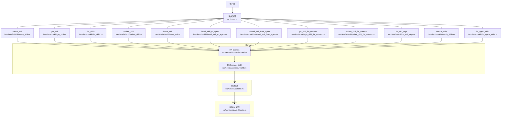
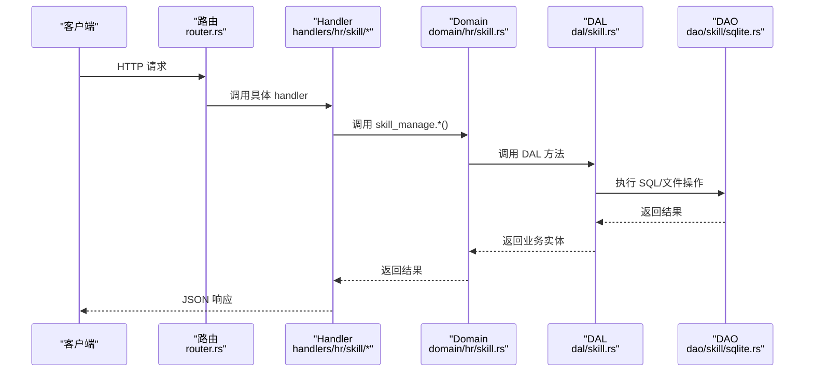
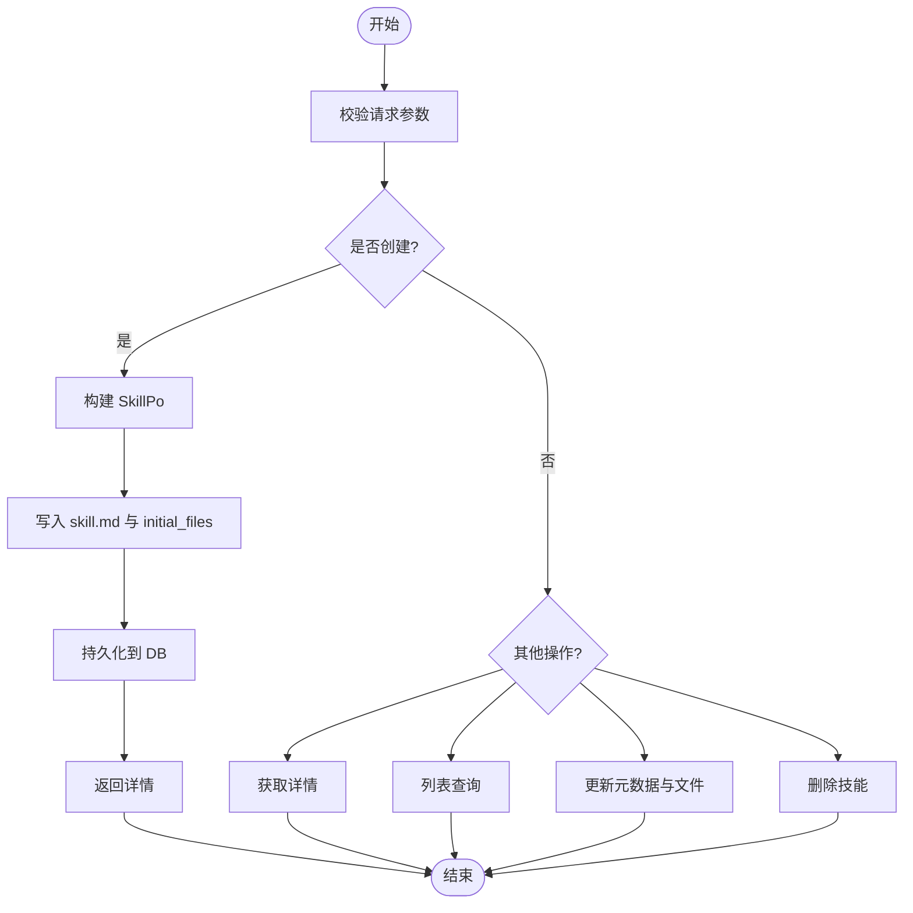
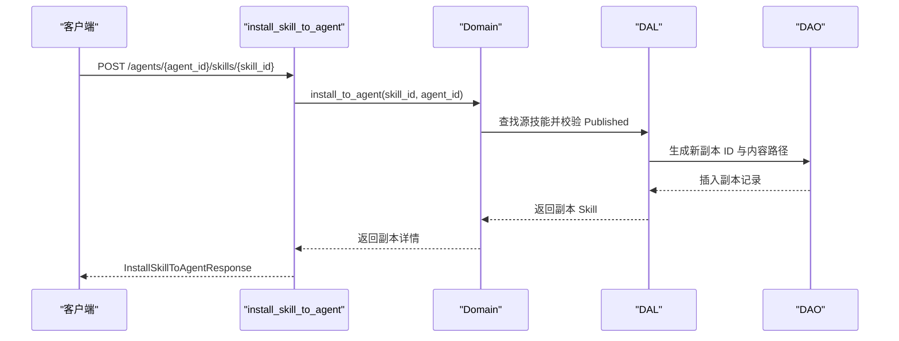
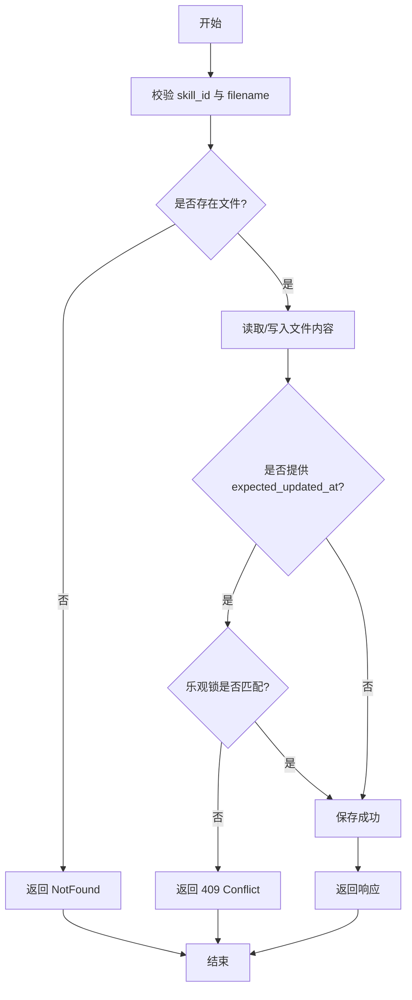
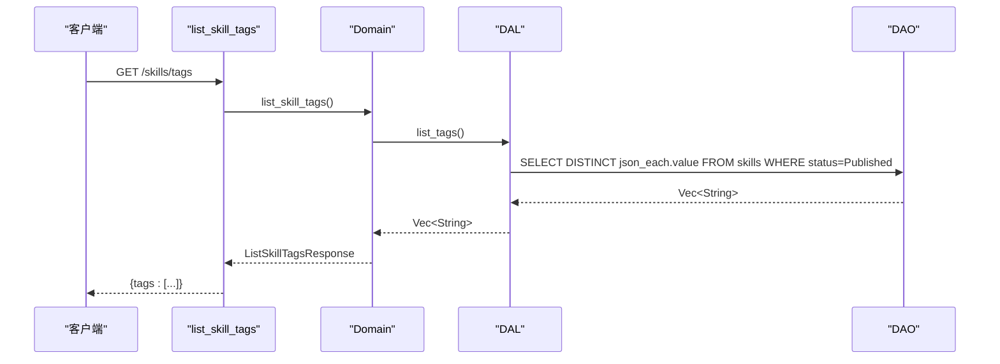
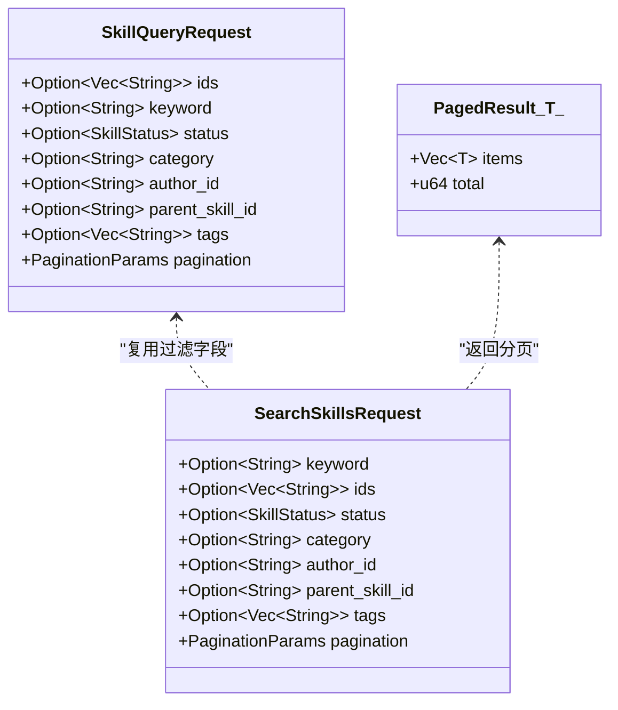
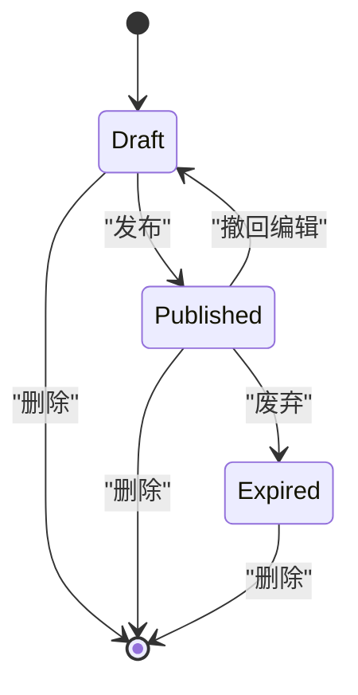
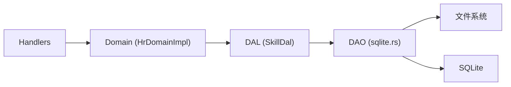

# 技能包管理 API

<cite>
**本文引用的文件**
- [common/src/api/skill.rs](common/src/api/skill.rs)
- [src/router.rs](src/router.rs)
- [src/handlers/hr/skill/mod.rs](src/handlers/hr/skill/mod.rs)
- [src/handlers/hr/skill/create_skill.rs](src/handlers/hr/skill/create_skill.rs)
- [src/handlers/hr/skill/get_skill.rs](src/handlers/hr/skill/get_skill.rs)
- [src/handlers/hr/skill/list_skills.rs](src/handlers/hr/skill/list_skills.rs)
- [src/handlers/hr/skill/update_skill.rs](src/handlers/hr/skill/update_skill.rs)
- [src/handlers/hr/skill/delete_skill.rs](src/handlers/hr/skill/delete_skill.rs)
- [src/handlers/hr/skill/install_skill_to_agent.rs](src/handlers/hr/skill/install_skill_to_agent.rs)
- [src/handlers/hr/skill/uninstall_skill_from_agent.rs](src/handlers/hr/skill/uninstall_skill_from_agent.rs)
- [src/handlers/hr/skill/get_skill_file_content.rs](src/handlers/hr/skill/get_skill_file_content.rs)
- [src/handlers/hr/skill/update_skill_file_content.rs](src/handlers/hr/skill/update_skill_file_content.rs)
- [src/handlers/hr/skill/list_skill_tags.rs](src/handlers/hr/skill/list_skill_tags.rs)
- [src/handlers/hr/skill/search_skills.rs](src/handlers/hr/skill/search_skills.rs)
- [src/handlers/hr/skill/list_agent_skills.rs](src/handlers/hr/skill/list_agent_skills.rs)
- [src/service/domain/hr/mod.rs](src/service/domain/hr/mod.rs)
- [src/service/domain/hr/skill.rs](src/service/domain/hr/skill.rs)
- [src/service/dal/skill.rs](src/service/dal/skill.rs)
- [src/service/dao/skill/sqlite.rs](src/service/dao/skill/sqlite.rs)
- [src/models/skill.rs](src/models/skill.rs)
- [common/src/enums/skill.rs](common/src/enums/skill.rs)
</cite>

## 目录
1. [简介](#简介)
2. [项目结构](#项目结构)
3. [核心组件](#核心组件)
4. [架构总览](#架构总览)
5. [详细组件分析](#详细组件分析)
6. [依赖关系分析](#依赖关系分析)
7. [性能与扩展性](#性能与扩展性)
8. [故障排除指南](#故障排除指南)
9. [结论](#结论)
10. [附录：API 参考](#附录api-参考)

## 简介
本文件为“技能包管理 API”的权威文档，覆盖技能包的完整生命周期管理与高级特性。内容包括：
- 基础操作：创建、获取详情、列表查询、更新配置、删除
- Agent 绑定：安装到 Agent、从 Agent 卸载
- 文件管理：读取与更新技能文件内容（含乐观锁）
- 标签系统：列出已发布技能的 distinct tags
- 搜索与批量：关键词/向量混合搜索、按 tag 批量安装/卸载技能包
- 版本管理：通过状态机与副本机制实现版本演进与回滚
- 开发示例、安装部署流程与故障排除

## 项目结构
技能包管理遵循四层单向调用：Adapter（HTTP Handler）→ Domain → DAL → DAO，禁止跨层调用与同层互调。Handler 仅负责参数校验与上下文组装；Domain 编排业务规则；DAL 聚合领域能力；DAO 负责持久化与存储。

**图表来源**
- [src/router.rs:361-401](src/router.rs#L361-L401)
- [src/handlers/hr/skill/mod.rs:1-35](src/handlers/hr/skill/mod.rs#L1-L35)
- [src/service/domain/hr/mod.rs:38-92](src/service/domain/hr/mod.rs#L38-L92)
- [src/service/domain/hr/skill.rs:1-39](src/service/domain/hr/skill.rs#L1-L39)
- [src/service/dal/skill.rs:678-721](src/service/dal/skill.rs#L678-L721)
- [src/service/dao/skill/sqlite.rs:261-295](src/service/dao/skill/sqlite.rs#L261-L295)

**章节来源**
- [src/router.rs:361-401](src/router.rs#L361-L401)
- [src/handlers/hr/skill/mod.rs:1-35](src/handlers/hr/skill/mod.rs#L1-L35)

## 核心组件
- 请求/响应 DTO：定义在 common 层，前后端共享
  - 创建/更新/删除/查询/搜索/文件读写/标签/安装卸载等
- Handler：每个方法一个文件，职责单一，使用宏注册为工具与 HTTP 路由
- Domain：SkillManage trait 定义业务能力，HrDomainImpl 聚合实现
- DAL：SkillDal 抽象数据访问，封装查询、搜索、标签聚合、安装逻辑
- DAO：SQLite 实现具体 SQL 与存储路径策略

关键数据结构：
- SkillPo：数据库持久化对象（元数据、状态、作者、时间戳、内容路径）
- Skill：业务实体（PO + 文件列表 + 搜索匹配信息）
- SkillStatus：Expired/Published/Draft
- SkillAuthorType：User/Agent

**章节来源**
- [common/src/api/skill.rs:11-465](common/src/api/skill.rs#L11-L465)
- [src/models/skill.rs:20-193](src/models/skill.rs#L20-L193)
- [common/src/enums/skill.rs:6-79](common/src/enums/skill.rs#L6-L79)
- [src/service/domain/hr/mod.rs:317-392](src/service/domain/hr/mod.rs#L317-L392)

## 架构总览
技能包管理的请求处理链路如下：
- Adapter 层：Axum 路由将请求分发到对应 handler
- Domain 层：SkillManage 编排业务规则（权限、状态、副本、导入校验）
- DAL 层：组合查询、搜索、标签聚合、安装/卸载流程
- DAO 层：SQLite 查询与文件系统写入/读取

**图表来源**
- [src/router.rs:361-401](src/router.rs#L361-L401)
- [src/handlers/hr/skill/create_skill.rs:1-92](src/handlers/hr/skill/create_skill.rs#L1-L92)
- [src/service/domain/hr/skill.rs:1-39](src/service/domain/hr/skill.rs#L1-L39)
- [src/service/dal/skill.rs:678-721](src/service/dal/skill.rs#L678-L721)
- [src/service/dao/skill/sqlite.rs:261-295](src/service/dao/skill/sqlite.rs#L261-L295)

## 详细组件分析

### 基础 CRUD
- 创建技能 create_skill
  - 输入：名称、描述、标签、分类、初始状态、主内容、初始多文件映射
  - 行为：生成唯一 ID，构造 SkillPo，可选写入 skill.md 与 initial_files，持久化后返回详情
  - 安全：文件名合法性校验，防止路径遍历
- 获取详情 get_skill
  - 输入：skill_id
  - 行为：查询并返回包含文件摘要的详情
- 列表 list_skills
  - 输入：分页参数
  - 行为：默认排除 Expired，返回分页列表项
- 更新 update_skill
  - 输入：skill_id 与可空字段（名称、描述、标签、分类、状态、主内容）、附加文件导入
  - 行为：先校验导入目标路径，再合并文件写入/导入，最后返回更新后的详情
- 删除 delete_skill
  - 输入：skill_id
  - 行为：存在性校验后删除（DB + 文件目录）

**图表来源**
- [src/handlers/hr/skill/create_skill.rs:1-92](src/handlers/hr/skill/create_skill.rs#L1-L92)
- [src/handlers/hr/skill/get_skill.rs:1-30](src/handlers/hr/skill/get_skill.rs#L1-L30)
- [src/handlers/hr/skill/list_skills.rs:1-41](src/handlers/hr/skill/list_skills.rs#L1-L41)
- [src/handlers/hr/skill/update_skill.rs:1-126](src/handlers/hr/skill/update_skill.rs#L1-L126)
- [src/handlers/hr/skill/delete_skill.rs:1-34](src/handlers/hr/skill/delete_skill.rs#L1-L34)

**章节来源**
- [common/src/api/skill.rs:11-465](common/src/api/skill.rs#L11-L465)
- [src/handlers/hr/skill/create_skill.rs:1-92](src/handlers/hr/skill/create_skill.rs#L1-L92)
- [src/handlers/hr/skill/get_skill.rs:1-30](src/handlers/hr/skill/get_skill.rs#L1-L30)
- [src/handlers/hr/skill/list_skills.rs:1-41](src/handlers/hr/skill/list_skills.rs#L1-L41)
- [src/handlers/hr/skill/update_skill.rs:1-126](src/handlers/hr/skill/update_skill.rs#L1-L126)
- [src/handlers/hr/skill/delete_skill.rs:1-34](src/handlers/hr/skill/delete_skill.rs#L1-L34)

### Agent 绑定与解绑
- 安装 install_skill_to_agent
  - 输入：源 skill_id、目标 agent_id
  - 行为：复制已发布的技能到 Agent 私有目录，生成副本记录（parent_skill_id 指向源），返回新副本详情
- 卸载 uninstall_skill_from_agent
  - 输入：agent_id、skill_id（副本）
  - 行为：校验副本归属与类型，删除 DB 记录与文件目录

**图表来源**
- [src/handlers/hr/skill/install_skill_to_agent.rs:1-36](src/handlers/hr/skill/install_skill_to_agent.rs#L1-L36)
- [src/service/domain/hr/skill.rs:153-198](src/service/domain/hr/skill.rs#L153-L198)
- [src/service/dao/skill/sqlite.rs:275-295](src/service/dao/skill/sqlite.rs#L275-L295)

**章节来源**
- [src/handlers/hr/skill/install_skill_to_agent.rs:1-36](src/handlers/hr/skill/install_skill_to_agent.rs#L1-L36)
- [src/handlers/hr/skill/uninstall_skill_from_agent.rs:1-34](src/handlers/hr/skill/uninstall_skill_from_agent.rs#L1-L34)
- [src/service/domain/hr/skill.rs:153-198](src/service/domain/hr/skill.rs#L153-L198)
- [src/service/dao/skill/sqlite.rs:275-295](src/service/dao/skill/sqlite.rs#L275-L295)

### 文件管理
- 列出文件 list_skill_files
  - 输入：skill_id
  - 行为：返回文件摘要（文件名、大小、是否预读内容）
- 读取内容 get_skill_file_content
  - 输入：skill_id、filename
  - 行为：读取指定文本文件内容，不存在返回 NotFound
- 更新内容 update_skill_file_content
  - 输入：skill_id、filename、content、expected_updated_at（可选）
  - 行为：创建或覆盖文件，支持乐观锁冲突检测（409 Conflict）

**图表来源**
- [src/handlers/hr/skill/get_skill_file_content.rs:1-38](src/handlers/hr/skill/get_skill_file_content.rs#L1-L38)
- [src/handlers/hr/skill/update_skill_file_content.rs:1-34](src/handlers/hr/skill/update_skill_file_content.rs#L1-L34)
- [common/src/api/skill.rs:229-249](common/src/api/skill.rs#L229-L249)

**章节来源**
- [src/handlers/hr/skill/get_skill_file_content.rs:1-38](src/handlers/hr/skill/get_skill_file_content.rs#L1-L38)
- [src/handlers/hr/skill/update_skill_file_content.rs:1-34](src/handlers/hr/skill/update_skill_file_content.rs#L1-L34)
- [common/src/api/skill.rs:229-249](common/src/api/skill.rs#L229-L249)

### 标签系统与批量操作
- 列出标签 list_skill_tags
  - 输入：无
  - 行为：聚合已发布技能的 distinct tags，用于前端下拉框
- 批量安装 InstallSkillPack
  - 输入：agent_id、tag
  - 行为：查询该 tag 下所有 Published 技能，逐个安装到 Agent 目录，幂等跳过已安装
- 批量卸载 UninstallSkillPack
  - 输入：agent_id、tag、delete_copies（可选）
  - 行为：从 Agent 的 installed_skill_packs 移除 tag，可选择同时删除副本

**图表来源**
- [src/handlers/hr/skill/list_skill_tags.rs:1-28](src/handlers/hr/skill/list_skill_tags.rs#L1-L28)
- [src/service/dal/skill.rs:692-694](src/service/dal/skill.rs#L692-L694)
- [src/service/dao/skill/sqlite.rs:261-273](src/service/dao/skill/sqlite.rs#L261-L273)

**章节来源**
- [src/handlers/hr/skill/list_skill_tags.rs:1-28](src/handlers/hr/skill/list_skill_tags.rs#L1-L28)
- [src/service/dal/skill.rs:678-721](src/service/dal/skill.rs#L678-L721)
- [src/service/dao/skill/sqlite.rs:261-273](src/service/dao/skill/sqlite.rs#L261-L273)

### 搜索与查询
- 列表查询 query_skills
  - 输入：完整过滤条件（ids、keyword、status、category、author_id、parent_skill_id、tags、pagination）
  - 行为：条件过滤，返回分页列表
- 全文/语义搜索 search_skills
  - 输入：同上，但强调 keyword 的 FTS5 + 向量语义混合搜索
  - 行为：根据参数选择检索策略，合并排序，返回分页结果

**图表来源**
- [common/src/api/skill.rs:282-330](common/src/api/skill.rs#L282-L330)
- [src/handlers/hr/skill/search_skills.rs:1-50](src/handlers/hr/skill/search_skills.rs#L1-L50)

**章节来源**
- [src/handlers/hr/skill/search_skills.rs:1-50](src/handlers/hr/skill/search_skills.rs#L1-L50)
- [common/src/api/skill.rs:282-330](common/src/api/skill.rs#L282-L330)

### 版本管理与状态机
- 状态：Draft（草稿）、Published（已发布）、Expired（过期）
- 版本演进：
  - 原始技能以 Draft 迭代，发布后成为 Published 供安装
  - 安装到 Agent 后生成副本（parent_skill_id 非空），副本可独立修改
  - 重新安装 reinstall_skill_pack 可覆盖副本，保持与最新 Published 一致
- 回滚与清理：
  - 卸载技能包时可选择删除副本，或仅移除 tag 关联

**图表来源**
- [common/src/enums/skill.rs:6-79](common/src/enums/skill.rs#L6-L79)
- [src/service/domain/hr/mod.rs:249-290](src/service/domain/hr/mod.rs#L249-L290)

**章节来源**
- [common/src/enums/skill.rs:6-79](common/src/enums/skill.rs#L6-L79)
- [src/service/domain/hr/mod.rs:249-290](src/service/domain/hr/mod.rs#L249-L290)

## 依赖关系分析
- Handler 依赖 Domain 单例 HrDomain，通过 skill_manage() 获取 SkillManage 接口
- Domain 依赖 DAL（SkillDal）与 Agent/Tool DAL，不直接访问 DAO
- DAL 封装查询、搜索、标签聚合、安装流程，调用 DAO 完成 SQL 与文件 IO
- DAO 使用 SQLite 与文件系统，路径策略区分用户技能与 Agent 副本

**图表来源**
- [src/service/domain/hr/mod.rs:38-92](src/service/domain/hr/mod.rs#L38-L92)
- [src/service/dal/skill.rs:678-721](src/service/dal/skill.rs#L678-L721)
- [src/service/dao/skill/sqlite.rs:261-295](src/service/dao/skill/sqlite.rs#L261-L295)

**章节来源**
- [src/service/domain/hr/mod.rs:38-92](src/service/domain/hr/mod.rs#L38-L92)
- [src/service/dal/skill.rs:678-721](src/service/dal/skill.rs#L678-L721)
- [src/service/dao/skill/sqlite.rs:261-295](src/service/dao/skill/sqlite.rs#L261-L295)

## 性能与扩展性
- 搜索性能：FTS5 + 向量语义混合搜索，按参数自动选择策略，支持降级
- 文件 IO：小文件预读，大文件按需加载，避免内存膨胀
- 并发安全：文件更新支持乐观锁，减少竞争写冲突
- 可扩展点：
  - 新增查询条件只需扩展 SkillQuery/Search
  - 新增标签聚合可通过 DAL 层追加 SQL
  - 文件存储策略可在 DAO 层替换后端

[本节为通用指导，无需特定文件引用]

## 故障排除指南
- 常见错误
  - NotFound：技能或文件不存在
  - InvalidRequest：缺少用户上下文、非法路径、未发布技能不可安装
  - Conflict：乐观锁不匹配（expected_updated_at 不一致）
- 排查步骤
  - 检查路由是否正确注册
  - 确认请求参数与路径段匹配
  - 查看 Domain 层校验逻辑与错误码
  - 验证 DAO 层 SQL 与文件路径
- 日志定位
  - Handler 层记录请求入口
  - Domain 层记录业务决策
  - DAL/DAO 层记录 SQL 与 IO 异常

**章节来源**
- [src/handlers/hr/skill/create_skill.rs:26-32](src/handlers/hr/skill/create_skill.rs#L26-L32)
- [src/handlers/hr/skill/get_skill_file_content.rs:27-35](src/handlers/hr/skill/get_skill_file_content.rs#L27-L35)
- [src/service/domain/hr/skill.rs:153-184](src/service/domain/hr/skill.rs#L153-L184)

## 结论
技能包管理 API 提供了完整的生命周期管理能力，涵盖 CRUD、Agent 绑定、文件管理、标签聚合、搜索与批量操作、版本管理等。系统采用清晰的分层架构，确保高内聚低耦合，便于扩展与维护。建议在生产环境启用 FTS5 与向量搜索以提升检索效率，并结合乐观锁保障文件一致性。

[本节为总结，无需特定文件引用]

## 附录：API 参考
- 基础操作
  - POST /api/v1/skills：创建技能
  - GET /api/v1/skills/{id}：获取详情
  - GET /api/v1/skills：列表查询
  - PUT /api/v1/skills/{id}：更新配置
  - DELETE /api/v1/skills/{id}：删除技能
- Agent 绑定
  - POST /api/v1/agents/{agent_id}/skills/{skill_id}：安装到 Agent
  - DELETE /api/v1/agents/{agent_id}/skills/{skill_id}：从 Agent 卸载
- 文件管理
  - GET /api/v1/skills/{skill_id}/files：列出文件
  - GET /api/v1/skills/{skill_id}/files/{*filename}：读取内容
  - PUT /api/v1/skills/{skill_id}/files/{*filename}：更新内容
- 标签与搜索
  - GET /api/v1/hr/skills/tags：列出 distinct tags
  - POST /api/v1/skills/search：全文/语义搜索
  - POST /api/v1/skills/query：条件查询
- 批量操作
  - 安装技能包：按 tag 批量安装到 Agent
  - 卸载技能包：按 tag 移除并可选删除副本

**章节来源**
- [src/router.rs:361-401](src/router.rs#L361-L401)
- [common/src/api/skill.rs:11-465](common/src/api/skill.rs#L11-L465)