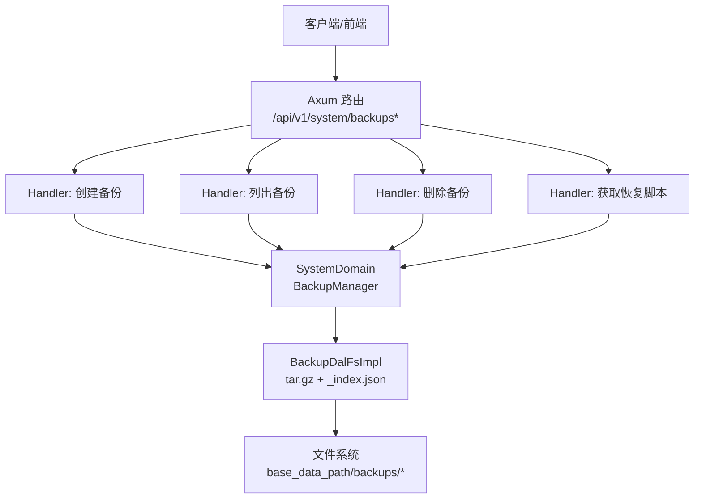
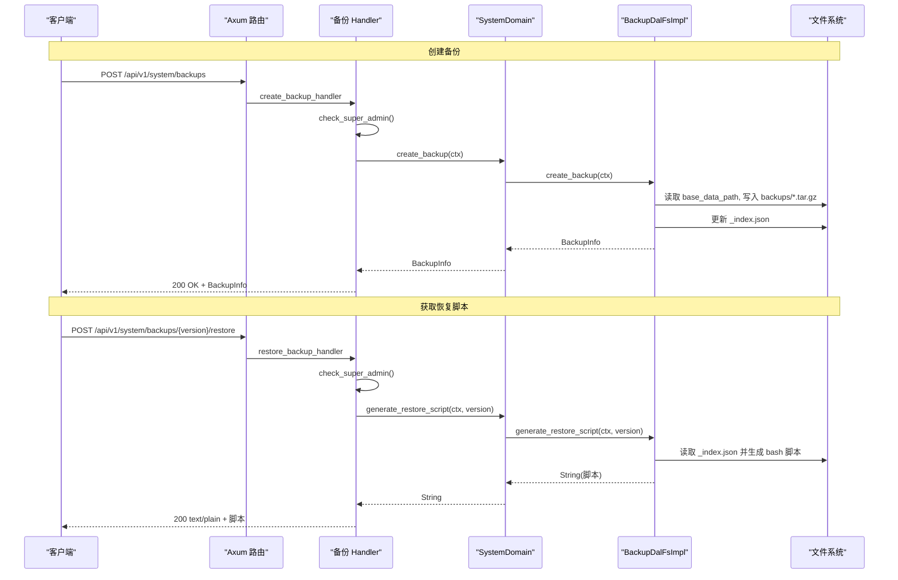
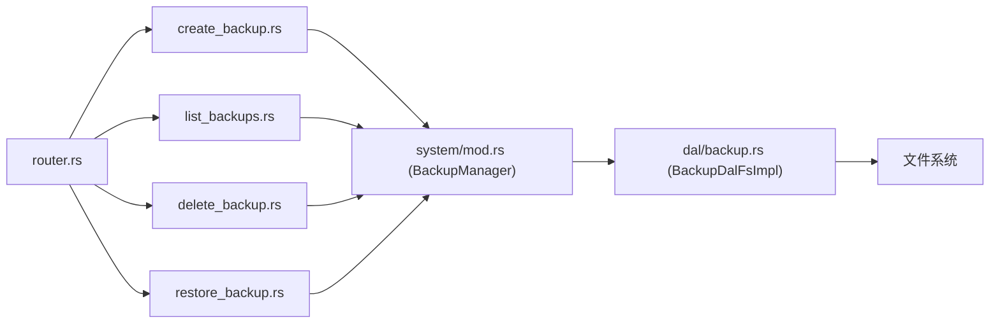

# 备份恢复 API

<cite>
**本文引用的文件**
- [src/handlers/system/backup/mod.rs](src/handlers/system/backup/mod.rs)
- [src/handlers/system/backup/create_backup.rs](src/handlers/system/backup/create_backup.rs)
- [src/handlers/system/backup/list_backups.rs](src/handlers/system/backup/list_backups.rs)
- [src/handlers/system/backup/delete_backup.rs](src/handlers/system/backup/delete_backup.rs)
- [src/handlers/system/backup/restore_backup.rs](src/handlers/system/backup/restore_backup.rs)
- [src/router.rs](src/router.rs)
- [src/service/domain/system/mod.rs](src/service/domain/system/mod.rs)
- [src/service/dal/backup.rs](src/service/dal/backup.rs)
- [common/src/error/code.rs](common/src/error/code.rs)
- [frontend/src/pages/system/backup.rs](frontend/src/pages/system/backup.rs)
</cite>

## 目录
1. [简介](#简介)
2. [项目结构](#项目结构)
3. [核心组件](#核心组件)
4. [架构总览](#架构总览)
5. [详细接口规范](#详细接口规范)
6. [依赖关系分析](#依赖关系分析)
7. [性能与容量建议](#性能与容量建议)
8. [故障排查指南](#故障排查指南)
9. [结论](#结论)
10. [附录：备份策略与自动化建议](#附录：备份策略与自动化建议)

## 简介
本文件为 AI Orz 的“备份恢复”功能提供完整的 API 文档，覆盖以下能力：
- 创建数据备份
- 列出所有备份
- 删除指定版本备份
- 获取指定版本的恢复脚本（用于灾难恢复）

该功能基于文件系统实现，将应用数据目录打包为 tar.gz 归档，并通过索引文件管理元信息。所有写操作均要求 SuperAdmin 权限，读列表接口允许 Admin/SuperAdmin。

## 项目结构
备份恢复相关代码采用四层单向调用：Adapter（HTTP Handler）→ Domain → DAL → 文件系统。路由集中在系统模块下，按方法粒度拆分 handler 文件，DAL 负责具体归档、索引与恢复脚本生成。

图表来源
- [src/router.rs:634-646](src/router.rs#L634-L646)
- [src/handlers/system/backup/mod.rs:1-32](src/handlers/system/backup/mod.rs#L1-L32)
- [src/service/domain/system/mod.rs:261-277](src/service/domain/system/mod.rs#L261-L277)
- [src/service/dal/backup.rs:70-84](src/service/dal/backup.rs#L70-L84)

章节来源
- [src/router.rs:634-646](src/router.rs#L634-L646)
- [src/handlers/system/backup/mod.rs:1-32](src/handlers/system/backup/mod.rs#L1-L32)

## 核心组件
- Adapter（HTTP 层）
  - 创建备份：POST /api/v1/system/backups
  - 列出备份：GET /api/v1/system/backups
  - 删除备份：DELETE /api/v1/system/backups/{version}
  - 获取恢复脚本：POST /api/v1/system/backups/{version}/restore
- Domain（业务编排）
  - 通过 BackupManager 暴露 create/list/delete/generate_restore_script
- DAL（持久化与归档）
  - 基于文件系统实现 BackupDalFsImpl
  - 使用 tar.gz 归档数据目录，排除 backups/ 与 logs/
  - 使用 _index.json 维护备份元信息（版本号、时间戳、文件名、大小、MD5）
  - 支持重建索引（防御性）

章节来源
- [src/handlers/system/backup/create_backup.rs:1-27](src/handlers/system/backup/create_backup.rs#L1-L27)
- [src/handlers/system/backup/list_backups.rs:1-22](src/handlers/system/backup/list_backups.rs#L1-L22)
- [src/handlers/system/backup/delete_backup.rs:1-25](src/handlers/system/backup/delete_backup.rs#L1-L25)
- [src/handlers/system/backup/restore_backup.rs:1-35](src/handlers/system/backup/restore_backup.rs#L1-L35)
- [src/service/domain/system/mod.rs:261-277](src/service/domain/system/mod.rs#L261-L277)
- [src/service/dal/backup.rs:1-84](src/service/dal/backup.rs#L1-L84)

## 架构总览
备份流程从 HTTP 请求进入，经路由分发到对应 Handler，进行权限校验后调用 Domain，再由 Domain 委派给 DAL 完成归档或索引操作。恢复流程返回可执行的 bash 脚本，由运维在目标环境执行。

图表来源
- [src/router.rs:634-646](src/router.rs#L634-L646)
- [src/handlers/system/backup/create_backup.rs:16-26](src/handlers/system/backup/create_backup.rs#L16-L26)
- [src/handlers/system/backup/restore_backup.rs:18-35](src/handlers/system/backup/restore_backup.rs#L18-L35)
- [src/service/domain/system/mod.rs:261-277](src/service/domain/system/mod.rs#L261-L277)
- [src/service/dal/backup.rs:100-243](src/service/dal/backup.rs#L100-L243)

## 详细接口规范

### 通用说明
- 基础路径：/api/v1/system/backups
- 认证与鉴权：
  - 列表接口：需要 Admin/SuperAdmin（路由层 role 中间件）
  - 创建/删除/恢复脚本：需要 SuperAdmin（handler 内部二次校验）
- 错误响应：统一使用 common::error 的错误码与 HTTP 状态码映射

章节来源
- [src/router.rs:634-646](src/router.rs#L634-L646)
- [src/handlers/system/backup/mod.rs:19-32](src/handlers/system/backup/mod.rs#L19-L32)
- [common/src/error/code.rs:1-146](common/src/error/code.rs#L1-L146)

### 创建备份
- 方法：POST
- URL：/api/v1/system/backups
- 请求体：无业务字段（当前实现不接收参数）
- 成功响应：200 OK，返回备份元信息对象
- 失败响应：
  - 403 Forbidden：非 SuperAdmin
  - 500 Internal：IO 或序列化异常
  - 404 ResourceNotFound：若后续扩展中引用不存在资源

响应体字段（BackupInfo）
- version：u64，单调递增的版本号
- timestamp：string，ISO8601 时间戳
- file_name：string，归档文件名，形如 v{N}_YYYYMMDD_HHMMSS.tar.gz
- size_bytes：u64，归档文件大小
- md5：string，归档文件的 MD5（十六进制小写）

示例请求
- 方法：POST
- URL：/api/v1/system/backups
- 头部：Authorization: Bearer <token>
- 主体：空

示例响应
- 状态码：200
- 主体：
  {
    "version": 1,
    "timestamp": "2026-07-17T15:30:00+00:00",
    "file_name": "v1_20260717_153000.tar.gz",
    "size_bytes": 1234567,
    "md5": "abc123def456..."
  }

章节来源
- [src/handlers/system/backup/create_backup.rs:1-27](src/handlers/system/backup/create_backup.rs#L1-L27)
- [src/service/dal/backup.rs:21-34](src/service/dal/backup.rs#L21-L34)
- [src/service/dal/backup.rs:100-152](src/service/dal/backup.rs#L100-L152)

### 列出备份
- 方法：GET
- URL：/api/v1/system/backups
- 查询参数：无
- 成功响应：200 OK，返回备份元信息数组（按 version 降序）
- 失败响应：
  - 403 Forbidden：非 Admin/SuperAdmin
  - 500 Internal：IO 或解析异常

示例请求
- 方法：GET
- URL：/api/v1/system/backups
- 头部：Authorization: Bearer <token>

示例响应
- 状态码：200
- 主体：[BackupInfo, ...]

章节来源
- [src/handlers/system/backup/list_backups.rs:1-22](src/handlers/system/backup/list_backups.rs#L1-L22)
- [src/service/dal/backup.rs:154-174](src/service/dal/backup.rs#L154-L174)

### 删除备份
- 方法：DELETE
- URL：/api/v1/system/backups/{version}
- 路径参数：
  - version：u64，要删除的备份版本
- 成功响应：204 No Content
- 失败响应：
  - 403 Forbidden：非 SuperAdmin
  - 404 ResourceNotFound：版本不存在
  - 500 Internal：IO 或索引写入失败

示例请求
- 方法：DELETE
- URL：/api/v1/system/backups/3
- 头部：Authorization: Bearer <token>

示例响应
- 状态码：204
- 主体：空

章节来源
- [src/handlers/system/backup/delete_backup.rs:1-25](src/handlers/system/backup/delete_backup.rs#L1-L25)
- [src/service/dal/backup.rs:176-196](src/service/dal/backup.rs#L176-L196)

### 获取恢复脚本
- 方法：POST
- URL：/api/v1/system/backups/{version}/restore
- 路径参数：
  - version：u64，目标恢复版本
- 成功响应：200 OK，Content-Type: text/plain; charset=utf-8，返回 bash 脚本
- 失败响应：
  - 403 Forbidden：非 SuperAdmin
  - 404 ResourceNotFound：版本不存在
  - 500 Internal：IO 或索引读取失败

脚本行为说明
- 停止服务提示
- 将当前数据目录重命名为 .bak.<时间戳>
- 解压目标版本归档到数据目录
- 提示重启服务

示例请求
- 方法：POST
- URL：/api/v1/system/backups/3/restore
- 头部：Authorization: Bearer <token>

示例响应
- 状态码：200
- Content-Type：text/plain; charset=utf-8
- 主体：bash 脚本文本

章节来源
- [src/handlers/system/backup/restore_backup.rs:1-35](src/handlers/system/backup/restore_backup.rs#L1-L35)
- [src/service/dal/backup.rs:198-243](src/service/dal/backup.rs#L198-L243)

## 依赖关系分析
- 路由注册：/backups 子集挂载于系统模块下
- Handler 职责：仅做参数提取、权限校验与调用 Domain
- Domain：聚合 DAL 能力，对外暴露统一接口
- DAL：实现归档、索引、恢复脚本生成等具体逻辑
- 错误处理：统一使用 ErrorCode 映射到 HTTP 状态码

图表来源
- [src/router.rs:634-646](src/router.rs#L634-L646)
- [src/service/domain/system/mod.rs:261-277](src/service/domain/system/mod.rs#L261-L277)
- [src/service/dal/backup.rs:70-84](src/service/dal/backup.rs#L70-L84)

章节来源
- [src/router.rs:634-646](src/router.rs#L634-L646)
- [src/service/domain/system/mod.rs:261-277](src/service/domain/system/mod.rs#L261-L277)
- [src/service/dal/backup.rs:70-84](src/service/dal/backup.rs#L70-L84)

## 性能与容量建议
- 归档范围：包含 base_data_path 下除 backups/ 与 logs/ 外的全部数据；大目录归档耗时与磁盘 I/O 成正比
- 并发限制：避免同时触发多次创建备份，防止 IO 竞争导致超时或损坏
- 存储规划：确保 backups/ 所在分区有足够空间；定期清理旧版本归档
- 索引重建：当 _index.json 缺失或损坏时，系统会扫描 backups/ 重建索引，可能带来额外 IO

章节来源
- [src/service/dal/backup.rs:100-152](src/service/dal/backup.rs#L100-L152)
- [src/service/dal/backup.rs:154-174](src/service/dal/backup.rs#L154-L174)
- [src/service/dal/backup.rs:358-394](src/service/dal/backup.rs#L358-L394)

## 故障排查指南
- 403 Forbidden：确认当前用户角色为 SuperAdmin；检查路由层与 handler 内权限校验
- 404 ResourceNotFound：确认 version 存在且未被删除；检查 _index.json 是否完整
- 500 Internal：检查文件系统权限、磁盘空间、tar.gz 写入与 MD5 计算过程
- 恢复脚本无效：确认已停止服务后再执行；核对 data_dir 与备份文件路径

章节来源
- [src/handlers/system/backup/mod.rs:19-32](src/handlers/system/backup/mod.rs#L19-L32)
- [src/service/dal/backup.rs:176-196](src/service/dal/backup.rs#L176-L196)
- [src/service/dal/backup.rs:198-243](src/service/dal/backup.rs#L198-L243)
- [common/src/error/code.rs:1-146](common/src/error/code.rs#L1-L146)

## 结论
备份恢复 API 提供了面向运维的可靠数据保护能力：通过统一的 HTTP 接口创建、查看、删除备份，并提供安全的恢复脚本生成。权限控制严格，错误处理清晰，适合纳入生产环境的灾备流程。

## 附录：备份策略与自动化建议
- 定期备份
  - 结合系统定时任务机制（如 Cron Trigger），周期性调用创建备份接口
  - 建议保留最近 N 个版本，并定期清理旧归档以释放空间
- 灾难恢复
  - 先停止服务，再执行恢复脚本；恢复前务必备份当前数据目录
  - 恢复完成后验证关键数据完整性（如数据库、配置、向量索引等）
- 数据迁移
  - 利用备份归档在不同环境间迁移数据；注意目标环境的数据目录结构与权限
- 安全考虑
  - 仅 SuperAdmin 可执行高危操作；对备份文件访问进行最小权限控制
  - 传输层启用 HTTPS；对恢复脚本进行审计与留痕

章节来源
- [src/handlers/system/backup/mod.rs:19-32](src/handlers/system/backup/mod.rs#L19-L32)
- [src/service/dal/backup.rs:198-243](src/service/dal/backup.rs#L198-L243)
- [frontend/src/pages/system/backup.rs:1-322](frontend/src/pages/system/backup.rs#L1-L322)