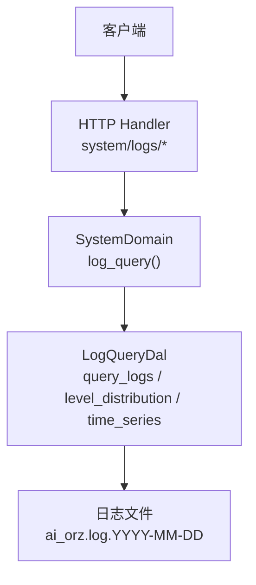
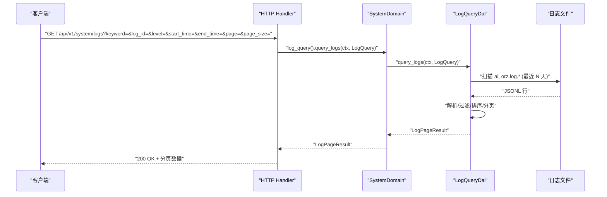

# 日志查询 API

<cite>
**本文引用的文件**
- [src/handlers/system/logs/query_logs.rs](src/handlers/system/logs/query_logs.rs)
- [src/handlers/system/logs/log_stats.rs](src/handlers/system/logs/log_stats.rs)
- [common/src/api/log_stats.rs](common/src/api/log_stats.rs)
- [src/service/domain/system/mod.rs](src/service/domain/system/mod.rs)
- [src/service/dal/log_query.rs](src/service/dal/log_query.rs)
- [docs/logging_design.md](docs/logging_design.md)
</cite>

## 目录
1. [简介](#简介)
2. [项目结构](#项目结构)
3. [核心组件](#核心组件)
4. [架构总览](#架构总览)
5. [详细组件分析](#详细组件分析)
6. [依赖关系分析](#依赖关系分析)
7. [性能考虑](#性能考虑)
8. [故障排查指南](#故障排查指南)
9. [结论](#结论)
10. [附录](#附录)

## 简介
本文档面向 AI Orz 的日志查询与统计分析能力，覆盖以下接口与主题：
- 日志查询：按关键词、调用链 ID、日志级别、时间范围过滤，支持分页。
- 统计分析：日志级别分布、按小时桶的时序统计。
- 日志格式与结构化字段：tracing JSON 输出规范、自动注入的请求上下文字段。
- 搜索语法与过滤规则：大小写不敏感匹配、精确匹配、时间范围含边界。
- 请求/响应示例：常见使用场景（错误排查、性能分析、审计追踪）。
- 存储与轮转：基于 tracing-appender 的按日滚动日志文件。
- 访问控制：仅管理员可访问系统日志接口。

## 项目结构
日志查询功能遵循四层单向调用：Adapter（HTTP Handler）→ Domain → DAL → 文件系统日志。Domain 层聚合统计逻辑，DAL 层负责读取并解析 JSONL 日志文件，Handler 层暴露 HTTP 接口。

图表来源
- [src/handlers/system/logs/query_logs.rs:1-29](src/handlers/system/logs/query_logs.rs#L1-L29)
- [src/handlers/system/logs/log_stats.rs:1-118](src/handlers/system/logs/log_stats.rs#L1-L118)
- [src/service/domain/system/mod.rs:151-170](src/service/domain/system/mod.rs#L151-L170)
- [src/service/dal/log_query.rs:100-210](src/service/dal/log_query.rs#L100-L210)

章节来源
- [src/handlers/system/logs/query_logs.rs:1-29](src/handlers/system/logs/query_logs.rs#L1-L29)
- [src/handlers/system/logs/log_stats.rs:1-118](src/handlers/system/logs/log_stats.rs#L1-L118)
- [src/service/domain/system/mod.rs:151-170](src/service/domain/system/mod.rs#L151-L170)
- [src/service/dal/log_query.rs:100-210](src/service/dal/log_query.rs#L100-L210)

## 核心组件
- HTTP Handler
  - GET /api/v1/system/logs：查询应用日志，返回分页结果。
  - GET /api/v1/system/logs/stats/level-distribution：日志级别分布统计。
  - GET /api/v1/system/logs/stats/time-series：日志时序统计（按小时桶）。
- Domain
  - SystemDomain::log_query：统一入口，封装 query_logs、level_distribution、time_series。
- DAL
  - LogQueryDalFsImpl：从文件系统读取 JSONL 日志，解析并过滤，返回分页结果；在 Domain 中复用该能力进行统计聚合。
- 公共 DTO
  - LogQueryRequest、LogStatsQueryParams、LogEntry、LogPageResult、LogLevelDistributionResponse、LogTimeSeriesResponse。

章节来源
- [common/src/api/log_stats.rs:41-77](common/src/api/log_stats.rs#L41-L77)
- [src/service/dal/log_query.rs:34-82](src/service/dal/log_query.rs#L34-L82)
- [src/service/domain/system/mod.rs:151-170](src/service/domain/system/mod.rs#L151-L170)

## 架构总览
日志查询与统计的整体流程如下：

图表来源
- [src/handlers/system/logs/query_logs.rs:13-28](src/handlers/system/logs/query_logs.rs#L13-L28)
- [src/service/domain/system/mod.rs:281-342](src/service/domain/system/mod.rs#L281-L342)
- [src/service/dal/log_query.rs:120-210](src/service/dal/log_query.rs#L120-L210)

## 详细组件分析

### 日志查询接口
- 端点
  - GET /api/v1/system/logs
- 认证与权限
  - 路由层已要求管理员角色（Admin/SuperAdmin），普通用户不可访问。
- 查询参数（全部为 Query 参数）
  - keyword：可选，message 字段包含匹配，不区分大小写。
  - log_id：可选，调用链 ID 精确匹配。
  - level：可选，INFO/WARN/ERROR/DEBUG/TRACE，不区分大小写。
  - start_time：可选，起始时间（unix ms，含）。
  - end_time：可选，结束时间（unix ms，含）。
  - page：可选，页码（从 1 开始，默认 1）。
  - page_size：可选，每页条数（默认 20）。
- 响应体
  - total：匹配总数（受单次扫描上限限制）。
  - entries：当前页日志条目数组。
  - page：当前页码。
  - page_size：每页条数。
- 行为说明
  - 时间范围过滤：当提供 start_time/end_time 时，会解析每条日志的 timestamp（RFC3339）为 unix ms 并比较。
  - 排序：按时间倒序（最新在前）。
  - 分页：先收集匹配项（最多 MAX_SCAN_ENTRIES），再按 page/page_size 切片。
  - 文件扫描：仅扫描最近 MAX_SCAN_DAYS 天的日志文件，文件名需符合 ai_orz.log.YYYY-MM-DD。

章节来源
- [src/handlers/system/logs/query_logs.rs:1-29](src/handlers/system/logs/query_logs.rs#L1-L29)
- [common/src/api/log_stats.rs:52-77](common/src/api/log_stats.rs#L52-L77)
- [src/service/dal/log_query.rs:120-210](src/service/dal/log_query.rs#L120-L210)
- [src/service/dal/log_query.rs:217-258](src/service/dal/log_query.rs#L217-L258)

#### 请求示例
- 查询最近 1 小时内 ERROR 级别且包含关键字 “timeout” 的日志，第 1 页，每页 50 条：
  - GET /api/v1/system/logs?level=ERROR&keyword=timeout&page=1&page_size=50&start_time=<now_ms-3600000>&end_time=<now_ms>

#### 响应示例
- 成功响应（简化）：
  - {
      "total": 120,
      "entries": [
        {
          "timestamp": "2026-08-06T10:00:00Z",
          "level": "ERROR",
          "message": "...",
          "log_id": "req-abc-123",
          "user_id": "u-1",
          "operation": "create_project",
          "raw": {}
        }
      ],
      "page": 1,
      "page_size": 50
    }

### 日志级别分布接口
- 端点
  - GET /api/v1/system/logs/stats/level-distribution
- 查询参数
  - start_time：可选，unix ms（含），默认 24 小时前。
  - end_time：可选，unix ms（含），默认当前时间。
- 响应体
  - items：每个级别的计数列表。
  - total：所有级别计数之和。
- 行为说明
  - 通过 DAL 拉取时间范围内的日志（上限 MAX_SCAN_ENTRIES），在 Domain 侧按 level 聚合。

章节来源
- [src/handlers/system/logs/log_stats.rs:25-49](src/handlers/system/logs/log_stats.rs#L25-L49)
- [common/src/api/log_stats.rs:7-23](common/src/api/log_stats.rs#L7-L23)
- [src/service/domain/system/mod.rs:286-309](src/service/domain/system/mod.rs#L286-L309)

#### 请求示例
- GET /api/v1/system/logs/stats/level-distribution?start_time=<24h前>&end_time=<现在>

#### 响应示例
- {
    "items": [
      {"level": "INFO", "count": 1200},
      {"level": "WARN", "count": 50},
      {"level": "ERROR", "count": 10}
    ],
    "total": 1260
  }

### 日志时序接口
- 端点
  - GET /api/v1/system/logs/stats/time-series
- 查询参数
  - start_time：可选，unix ms（含），默认 24 小时前。
  - end_time：可选，unix ms（含），默认当前时间。
- 响应体
  - points：按小时桶的日志数量序列，interval_start 为桶起始时间（unix ms）。
- 行为说明
  - 通过 DAL 拉取时间范围内的日志（上限 MAX_SCAN_ENTRIES），在 Domain 侧将 timestamp 解析为 unix ms，并按小时对齐聚合。

章节来源
- [src/handlers/system/logs/log_stats.rs:51-76](src/handlers/system/logs/log_stats.rs#L51-L76)
- [common/src/api/log_stats.rs:25-39](common/src/api/log_stats.rs#L25-L39)
- [src/service/domain/system/mod.rs:311-342](src/service/domain/system/mod.rs#L311-L342)

#### 请求示例
- GET /api/v1/system/logs/stats/time-series?start_time=<24h前>&end_time=<现在>

#### 响应示例
- {
    "points": [
      {"interval_start": 1722931200000, "count": 300},
      {"interval_start": 1722934800000, "count": 420}
    ]
  }

### 日志格式与结构化字段
- 存储格式
  - tracing-subscriber JSON 格式，每行一个对象，存放于 {base_data_path}/logs/ai_orz.log.YYYY-MM-DD。
- 顶层字段
  - timestamp：ISO8601/RFC3339 时间戳。
  - level：日志级别。
  - target：模块路径。
  - filename：源文件路径。
  - line_number：行号。
- fields 子对象
  - message：日志消息。
  - log_id：请求唯一标识（由 RequestContext 注入）。
  - user_id：当前用户 ID。
  - operation：操作名称（第二个字符串字面量）。
  - 其他业务字段：由 #[log_field] 自动注入。
- 自动注入机制
  - 通过 #[derive(LogFields)] 将 RequestContext 的业务字段注入到 tracing span，便于跨层追踪。

章节来源
- [src/service/dal/log_query.rs:1-23](src/service/dal/log_query.rs#L1-L23)
- [docs/logging_design.md:106-127](docs/logging_design.md#L106-L127)
- [docs/logging_design.md:132-165](docs/logging_design.md#L132-L165)

### 搜索语法与过滤规则
- 关键词匹配
  - 对 message 字段进行不区分大小写的包含匹配。
- 级别过滤
  - 不区分大小写，内部统一转为大写比较。
- 调用链 ID
  - 精确匹配 fields.log_id。
- 时间范围
  - 解析 timestamp 为 unix ms，start_time <= ts <= end_time。
- 排序与分页
  - 按 timestamp 字典序倒序（ISO8601 可直接比较）。
  - 分页在内存中进行，先收集匹配项（上限 MAX_SCAN_ENTRIES），再 skip/take。

章节来源
- [src/service/dal/log_query.rs:147-209](src/service/dal/log_query.rs#L147-L209)
- [src/service/dal/log_query.rs:263-354](src/service/dal/log_query.rs#L263-L354)

### 访问控制
- 路由层强制要求管理员角色（Admin/SuperAdmin），非管理员无法访问日志相关接口。

章节来源
- [src/handlers/system/logs/query_logs.rs:1-4](src/handlers/system/logs/query_logs.rs#L1-L4)
- [src/handlers/system/logs/log_stats.rs:1-5](src/handlers/system/logs/log_stats.rs#L1-L5)

## 依赖关系分析
- Handler 依赖 Domain 的 log_query 接口。
- Domain 依赖 DAL 的 LogQueryDal 接口，实现统计聚合。
- DAL 直接读取文件系统日志，无外部数据库依赖。
- 公共 DTO 定义在 common 层，供前后端共享。

图表来源
- [src/handlers/system/logs/query_logs.rs:13-28](src/handlers/system/logs/query_logs.rs#L13-L28)
- [src/service/domain/system/mod.rs:151-170](src/service/domain/system/mod.rs#L151-L170)
- [common/src/api/log_stats.rs:41-77](common/src/api/log_stats.rs#L41-L77)

章节来源
- [src/handlers/system/logs/query_logs.rs:13-28](src/handlers/system/logs/query_logs.rs#L13-L28)
- [src/service/domain/system/mod.rs:151-170](src/service/domain/system/mod.rs#L151-L170)
- [common/src/api/log_stats.rs:41-77](common/src/api/log_stats.rs#L41-L77)

## 性能考虑
- 扫描上限
  - 单次查询最多收集 MAX_SCAN_ENTRIES 条记录，防止内存溢出。
- 文件窗口
  - 仅扫描最近 MAX_SCAN_DAYS 天的日志文件，减少 IO。
- 时间过滤
  - 仅在启用时间范围时解析 timestamp，避免不必要的解析开销。
- 聚合策略
  - 级别分布与时序统计复用 query_logs 的结果，在 Domain 侧做轻量聚合。
- 建议
  - 尽量缩小时间范围与关键词，提高命中率。
  - 分页查询时合理设置 page_size，避免过大导致响应延迟。

章节来源
- [src/service/dal/log_query.rs:112-118](src/service/dal/log_query.rs#L112-L118)
- [src/service/dal/log_query.rs:147-209](src/service/dal/log_query.rs#L147-L209)
- [src/service/domain/system/mod.rs:286-342](src/service/domain/system/mod.rs#L286-L342)

## 故障排查指南
- 常见问题
  - 无日志返回：检查日志目录是否存在、是否生成 ai_orz.log.YYYY-MM-DD 文件。
  - 时间过滤无效：确认 timestamp 是否为 RFC3339 格式，否则无法解析为 unix ms。
  - 关键词不匹配：确认 message 字段内容，注意大小写不敏感匹配。
  - 级别过滤不生效：确认传入 level 值正确（内部会转大写）。
- 定位方法
  - 使用 log_id 精确匹配，快速定位某次请求的所有日志。
  - 结合 operation 字段筛选具体业务操作。
- 处理步骤
  - 缩小时间范围，逐步排查。
  - 降低 page_size，观察首屏响应。
  - 检查日志轮转配置与磁盘空间。

章节来源
- [src/service/dal/log_query.rs:263-354](src/service/dal/log_query.rs#L263-L354)
- [src/service/dal/log_query.rs:217-258](src/service/dal/log_query.rs#L217-L258)

## 结论
AI Orz 的日志查询与统计功能以 tracing JSON 为基础，通过 Handler → Domain → DAL 的分层设计，提供了灵活的过滤、分页与统计能力。配合管理员访问控制与合理的性能保护，适用于错误排查、性能分析与审计追踪等典型场景。建议在生产环境中结合日志轮转策略与监控告警，确保可观测性与稳定性。

## 附录

### 接口清单
- GET /api/v1/system/logs
  - 查询应用日志，支持 keyword、log_id、level、start_time、end_time、page、page_size。
- GET /api/v1/system/logs/stats/level-distribution
  - 日志级别分布，支持 start_time、end_time。
- GET /api/v1/system/logs/stats/time-series
  - 日志时序统计（按小时桶），支持 start_time、end_time。

章节来源
- [src/handlers/system/logs/query_logs.rs:1-29](src/handlers/system/logs/query_logs.rs#L1-L29)
- [src/handlers/system/logs/log_stats.rs:1-118](src/handlers/system/logs/log_stats.rs#L1-L118)
- [common/src/api/log_stats.rs:41-77](common/src/api/log_stats.rs#L41-L77)

### 数据结构参考
- LogQueryRequest：查询参数集合。
- LogStatsQueryParams：统计查询参数集合。
- LogEntry：单条日志条目。
- LogPageResult：分页结果。
- LogLevelDistributionResponse：级别分布响应。
- LogTimeSeriesResponse：时序响应。

章节来源
- [common/src/api/log_stats.rs:7-77](common/src/api/log_stats.rs#L7-L77)
- [src/service/dal/log_query.rs:34-82](src/service/dal/log_query.rs#L34-L82)

### 日志轮转与存储策略
- 轮转方式：tracing-appender 按日滚动，生成 ai_orz.log.YYYY-MM-DD。
- 存储位置：{base_data_path}/logs/。
- 扫描策略：仅扫描最近 MAX_SCAN_DAYS 天的文件。
- 建议：定期清理过期日志文件，避免磁盘占用过高。

章节来源
- [src/service/dal/log_query.rs:1-23](src/service/dal/log_query.rs#L1-L23)
- [src/service/dal/log_query.rs:217-258](src/service/dal/log_query.rs#L217-L258)