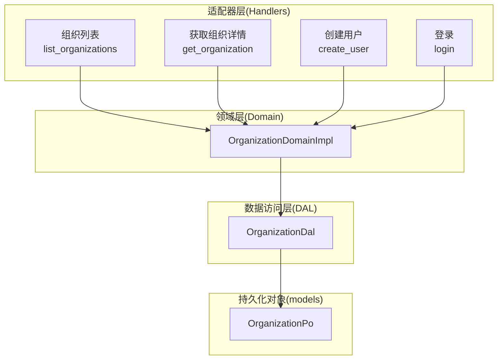
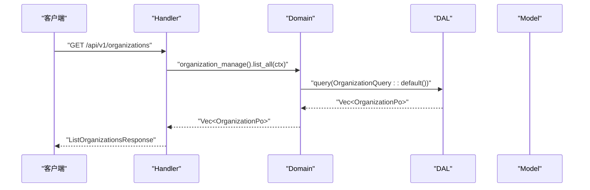
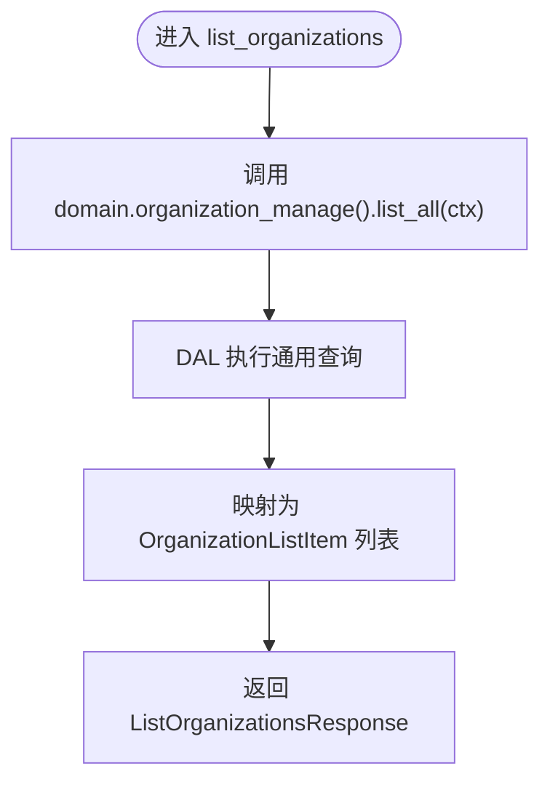
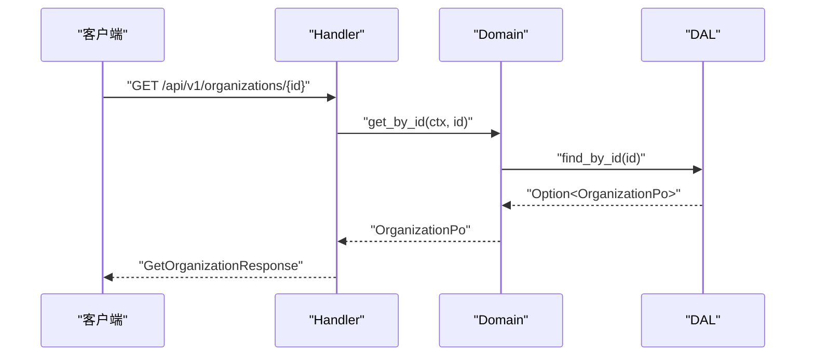
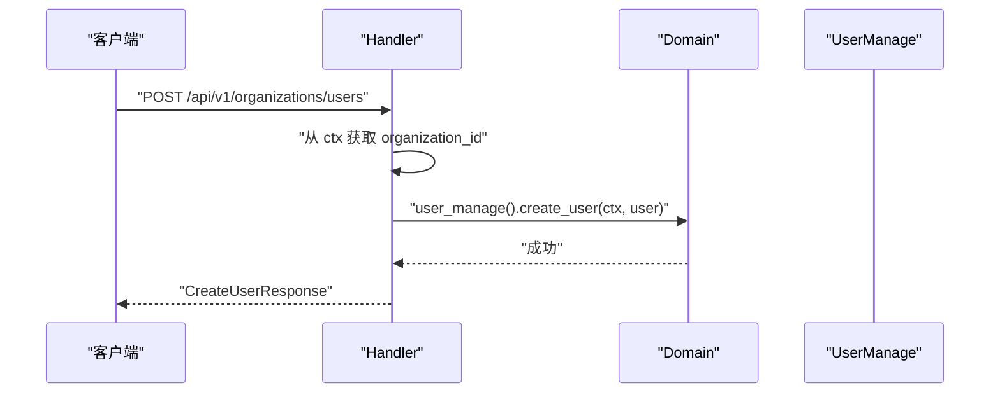
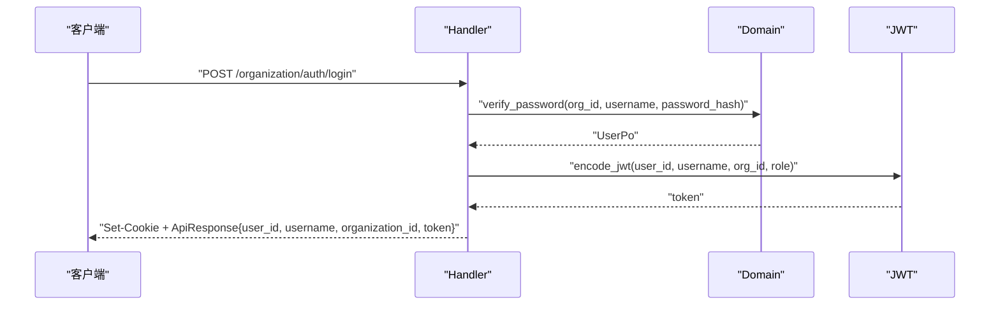
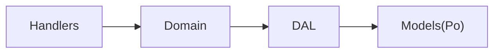

# 组织管理模块 API

<cite>
**本文引用的文件**
- [src/handlers/organization/mod.rs](src/handlers/organization/mod.rs)
- [src/handlers/organization/auth/login.rs](src/handlers/organization/auth/login.rs)
- [src/handlers/organization/organizations/list_organizations.rs](src/handlers/organization/organizations/list_organizations.rs)
- [src/handlers/organization/organizations/get_organization.rs](src/handlers/organization/organizations/get_organization.rs)
- [src/handlers/organization/user/create_user.rs](src/handlers/organization/user/create_user.rs)
- [common/src/api/organization.rs](common/src/api/organization.rs)
- [src/service/domain/organization/mod.rs](src/service/domain/organization/mod.rs)
- [src/service/dal/organization.rs](src/service/dal/organization.rs)
- [src/models/organization.rs](src/models/organization.rs)
</cite>

## 目录
1. [简介](#简介)
2. [项目结构](#项目结构)
3. [核心组件](#核心组件)
4. [架构总览](#架构总览)
5. [详细组件分析](#详细组件分析)
6. [依赖关系分析](#依赖关系分析)
7. [性能考虑](#性能考虑)
8. [故障排查指南](#故障排查指南)
9. [结论](#结论)
10. [附录：API 参考与示例](#附录api-参考与示例)

## 简介
本文件为 AI Orz 的组织管理模块 API 文档，覆盖多租户场景下的组织 CRUD、用户管理、当前组织信息获取、认证登录等能力。文档基于四层单向调用架构（Adapter → Domain → DAL → DAO）进行说明，强调多租户数据隔离、权限控制与组织边界。

## 项目结构
组织管理相关代码按“处理器层（handlers）—领域层（domain）—数据访问层（dal）—持久化对象（models）”分层组织，DTO 定义在 common 包中供前后端共享。

图表来源
- [src/handlers/organization/organizations/list_organizations.rs:1-40](src/handlers/organization/organizations/list_organizations.rs#L1-L40)
- [src/handlers/organization/organizations/get_organization.rs:1-48](src/handlers/organization/organizations/get_organization.rs#L1-L48)
- [src/handlers/organization/user/create_user.rs:1-72](src/handlers/organization/user/create_user.rs#L1-L72)
- [src/handlers/organization/auth/login.rs:1-69](src/handlers/organization/auth/login.rs#L1-L69)
- [src/service/domain/organization/mod.rs:1-200](src/service/domain/organization/mod.rs#L1-L200)
- [src/service/dal/organization.rs:1-126](src/service/dal/organization.rs#L1-L126)
- [src/models/organization.rs:1-62](src/models/organization.rs#L1-L62)

章节来源
- [src/handlers/organization/mod.rs:1-15](src/handlers/organization/mod.rs#L1-L15)

## 核心组件
- 适配器层（Handlers）
  - 组织列表：列出系统内所有组织，返回精简列表项。
  - 获取组织详情：按 ID 获取组织基础信息。
  - 创建用户：在当前组织下创建新用户并分配角色。
  - 登录：校验用户名密码，签发 JWT 并设置 Cookie。
- 领域层（Domain）
  - OrganizationDomainImpl：聚合组织管理与用户管理能力，编排 DAL 调用。
- 数据访问层（DAL）
  - OrganizationDal：封装对 OrganizationDao 的查询、统计、增删改操作。
- 模型（Models）
  - OrganizationPo：组织持久化对象，包含状态、范围、时间戳等字段。

章节来源
- [src/service/domain/organization/mod.rs:1-200](src/service/domain/organization/mod.rs#L1-L200)
- [src/service/dal/organization.rs:1-126](src/service/dal/organization.rs#L1-L126)
- [src/models/organization.rs:1-62](src/models/organization.rs#L1-L62)

## 架构总览
遵循严格四层单向调用：Handler → Domain → DAL → DAO；跨层统一通过 RequestContext 传递租户上下文（如 organization_id），实现多租户数据隔离。

图表来源
- [src/handlers/organization/organizations/list_organizations.rs:1-40](src/handlers/organization/organizations/list_organizations.rs#L1-L40)
- [src/service/domain/organization/mod.rs:1-200](src/service/domain/organization/mod.rs#L1-L200)
- [src/service/dal/organization.rs:1-126](src/service/dal/organization.rs#L1-L126)
- [src/models/organization.rs:1-62](src/models/organization.rs#L1-L62)

## 详细组件分析

### 组织列表接口
- 路径与方法：GET /api/v1/organizations
- 功能：列出系统内所有组织，返回组织 ID、名称、描述与总数。
- 处理流程：
  - Handler 调用领域层的组织管理能力 list_all。
  - 领域层委托 DAL 执行通用查询，返回组织 PO 集合。
  - Handler 将 PO 转换为 DTO 响应。
- 多租户与权限：
  - 该接口用于全局组织选择（如登录页），不强制绑定当前组织上下文。
  - 若需按当前组织过滤，应在请求上下文中注入 organization_id，由 DAL 查询条件限定。

图表来源
- [src/handlers/organization/organizations/list_organizations.rs:1-40](src/handlers/organization/organizations/list_organizations.rs#L1-L40)
- [src/service/dal/organization.rs:1-126](src/service/dal/organization.rs#L1-L126)

章节来源
- [src/handlers/organization/organizations/list_organizations.rs:1-40](src/handlers/organization/organizations/list_organizations.rs#L1-L40)
- [common/src/api/organization.rs:122-140](common/src/api/organization.rs#L122-L140)

### 获取组织详情接口
- 路径与方法：GET /api/v1/organizations/{id}
- 功能：根据组织 ID 获取组织基础信息（名称、描述、外部 Base URL、状态、创建时间）。
- 处理流程：
  - Handler 解析 path 参数 organization_id。
  - 调用领域层 get_by_id，若不存在则返回未找到错误。
  - 将 PO 转为 OrganizationInfoResponse 返回。
- 多租户与权限：
  - 建议结合当前用户权限与组织可见性策略，在 DAL 查询时附加组织范围或成员关系过滤。

图表来源
- [src/handlers/organization/organizations/get_organization.rs:1-48](src/handlers/organization/organizations/get_organization.rs#L1-L48)
- [src/service/dal/organization.rs:1-126](src/service/dal/organization.rs#L1-L126)

章节来源
- [src/handlers/organization/organizations/get_organization.rs:1-48](src/handlers/organization/organizations/get_organization.rs#L1-L48)
- [common/src/api/organization.rs:188-201](common/src/api/organization.rs#L188-L201)

### 创建用户接口
- 路径与方法：POST /api/v1/organizations/users
- 功能：在当前认证组织的上下文中创建新用户，支持角色分配。
- 处理流程：
  - 从 RequestContext 提取 organization_id，缺失则返回请求错误。
  - 生成随机用户 ID，转换角色枚举。
  - 构造 UserPo 并通过领域层 user_manage().create_user 持久化。
  - 返回创建结果。
- 多租户与权限：
  - 必须处于已认证的请求上下文，确保用户归属到正确组织。
  - 角色映射：数字到 UserRole 的转换由 Handler 完成，DAL/DAO 负责存储。

图表来源
- [src/handlers/organization/user/create_user.rs:1-72](src/handlers/organization/user/create_user.rs#L1-L72)
- [src/service/domain/organization/mod.rs:1-200](src/service/domain/organization/mod.rs#L1-L200)

章节来源
- [src/handlers/organization/user/create_user.rs:1-72](src/handlers/organization/user/create_user.rs#L1-L72)

### 登录接口
- 路径与方法：POST /organization/auth/login
- 功能：验证用户名与密码，签发 JWT，设置 Cookie。
- 处理流程：
  - 调用领域层 user_manage().verify_password 校验凭证。
  - 使用 jwt::encode_jwt 生成 token，附带用户 ID、用户名、组织 ID、角色。
  - 设置 Cookie（含过期时间与安全属性），返回登录响应。
- 多租户与权限：
  - 登录请求携带 organization_id，JWT 中嵌入该组织上下文，后续请求通过中间件解析以进行数据隔离。

图表来源
- [src/handlers/organization/auth/login.rs:1-69](src/handlers/organization/auth/login.rs#L1-L69)
- [src/service/domain/organization/mod.rs:1-200](src/service/domain/organization/mod.rs#L1-L200)

章节来源
- [src/handlers/organization/auth/login.rs:1-69](src/handlers/organization/auth/login.rs#L1-L69)

### 当前组织信息获取与更新
- 能力概述：
  - 获取当前组织信息：返回当前用户所在组织的详细信息。
  - 更新当前组织信息：允许修改组织名称、描述、外部 Base URL。
- 数据模型：
  - OrganizationInfoResponse：组织 ID、名称、描述、Base URL、状态、创建时间。
  - UpdateCurrentOrganizationRequest：可更新的字段均为可选。
- 多租户与权限：
  - 这些接口通常依赖当前请求上下文中的 organization_id，确保只操作当前租户的数据。

章节来源
- [common/src/api/organization.rs:159-186](common/src/api/organization.rs#L159-L186)

## 依赖关系分析
- Handler 依赖 Domain 暴露的业务能力，不直接访问 DAL。
- Domain 聚合多个子能力（组织管理、用户管理），通过 trait 解耦。
- DAL 封装 DAO 的具体实现，提供统一的查询与统计接口。
- Models 仅作为持久化对象在 DAL/DAO 内部使用，不在 Domain 及以上暴露。

图表来源
- [src/service/domain/organization/mod.rs:1-200](src/service/domain/organization/mod.rs#L1-L200)
- [src/service/dal/organization.rs:1-126](src/service/dal/organization.rs#L1-L126)
- [src/models/organization.rs:1-62](src/models/organization.rs#L1-L62)

章节来源
- [src/service/domain/organization/mod.rs:1-200](src/service/domain/organization/mod.rs#L1-L200)
- [src/service/dal/organization.rs:1-126](src/service/dal/organization.rs#L1-L126)

## 性能考虑
- 查询优化：
  - 使用 DAL 的通用查询接口，避免 N+1 查询；分页与计数透传到 DAO 层。
- 上下文传递：
  - 通过 RequestContext 传递 organization_id，减少重复解析开销。
- 缓存策略：
  - 对于组织列表等低频变更数据，可在上层引入缓存（如内存缓存或 Redis）以降低数据库压力。
- 并发与安全：
  - 登录接口应限制频率，防止暴力破解；JWT 过期时间合理配置。

## 故障排查指南
- 常见错误：
  - 未找到组织：当组织 ID 不存在时，Handler 会返回未找到错误。
  - 缺少组织上下文：创建用户时若 RequestContext 无 organization_id，返回请求错误。
  - 登录失败：用户名或密码不正确时，领域层会拒绝认证。
- 定位方法：
  - 检查 Handler 是否正确解析参数与上下文。
  - 确认 Domain 与 DAL 的查询条件是否包含必要的组织隔离字段。
  - 查看日志与错误码，定位具体失败阶段。

章节来源
- [src/handlers/organization/organizations/get_organization.rs:1-48](src/handlers/organization/organizations/get_organization.rs#L1-L48)
- [src/handlers/organization/user/create_user.rs:1-72](src/handlers/organization/user/create_user.rs#L1-L72)
- [src/handlers/organization/auth/login.rs:1-69](src/handlers/organization/auth/login.rs#L1-L69)

## 结论
组织管理模块通过清晰的层次划分与严格的上下文传递，实现了多租户数据隔离与权限控制。API 覆盖了组织 CRUD、用户管理、当前组织信息与认证登录等关键能力，适合企业级场景使用。建议在后续迭代中完善权限策略与审计日志，提升安全性与可观测性。

## 附录：API 参考与示例

### 组织列表
- 请求：GET /api/v1/organizations
- 响应：ListOrganizationsResponse（data: 组织列表项，total: 总数）
- 示例：
  - 请求头：无特殊要求
  - 响应体：包含组织 ID、名称、描述与总数

章节来源
- [src/handlers/organization/organizations/list_organizations.rs:1-40](src/handlers/organization/organizations/list_organizations.rs#L1-L40)
- [common/src/api/organization.rs:122-140](common/src/api/organization.rs#L122-L140)

### 获取组织详情
- 请求：GET /api/v1/organizations/{id}
- 响应：GetOrganizationResponse（data: OrganizationInfoResponse）
- 示例：
  - 路径参数：organization_id
  - 响应体：组织 ID、名称、描述、Base URL、状态、创建时间

章节来源
- [src/handlers/organization/organizations/get_organization.rs:1-48](src/handlers/organization/organizations/get_organization.rs#L1-L48)
- [common/src/api/organization.rs:188-201](common/src/api/organization.rs#L188-L201)

### 创建用户
- 请求：POST /api/v1/organizations/users
- 响应：CreateUserResponse（user_id、username、display_name、email、role）
- 示例：
  - 请求体：包含用户名、显示名、邮箱、密码哈希、角色
  - 注意：必须在已认证的组织上下文中调用

章节来源
- [src/handlers/organization/user/create_user.rs:1-72](src/handlers/organization/user/create_user.rs#L1-L72)

### 登录
- 请求：POST /organization/auth/login
- 响应：ApiResponse{user_id, username, organization_id, token}，并设置 Cookie
- 示例：
  - 请求体：organization_id、username、password_hash
  - 响应头：Set-Cookie（包含 JWT）

章节来源
- [src/handlers/organization/auth/login.rs:1-69](src/handlers/organization/auth/login.rs#L1-L69)

### 当前组织信息
- 获取当前组织：返回 OrganizationInfoResponse
- 更新当前组织：支持 name、description、base_url 的可选更新

章节来源
- [common/src/api/organization.rs:159-186](common/src/api/organization.rs#L159-L186)