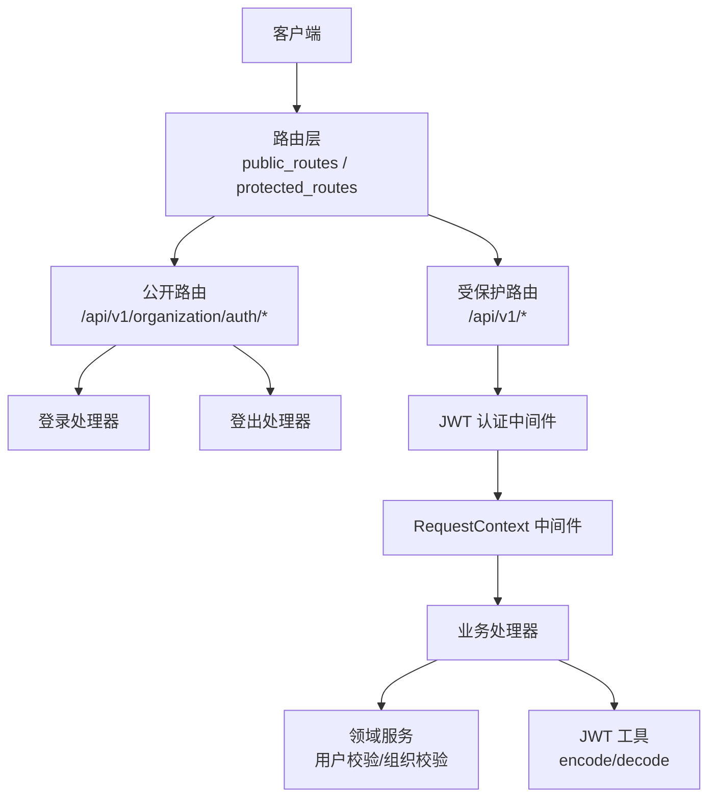
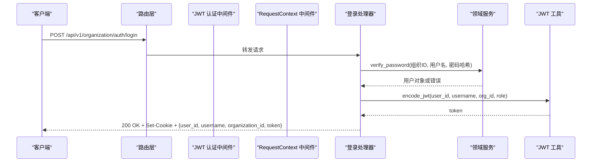
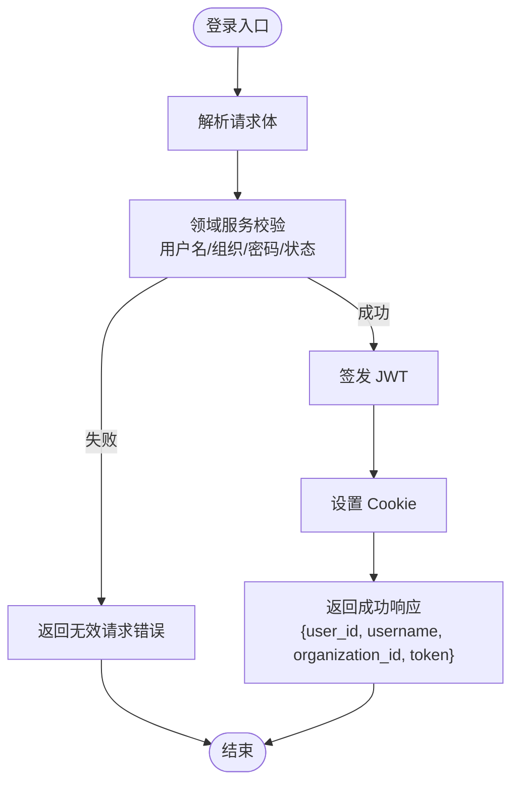
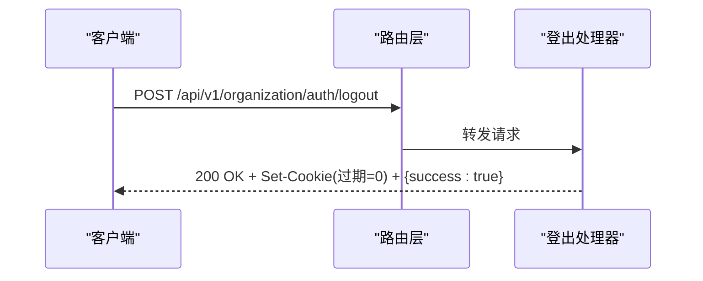
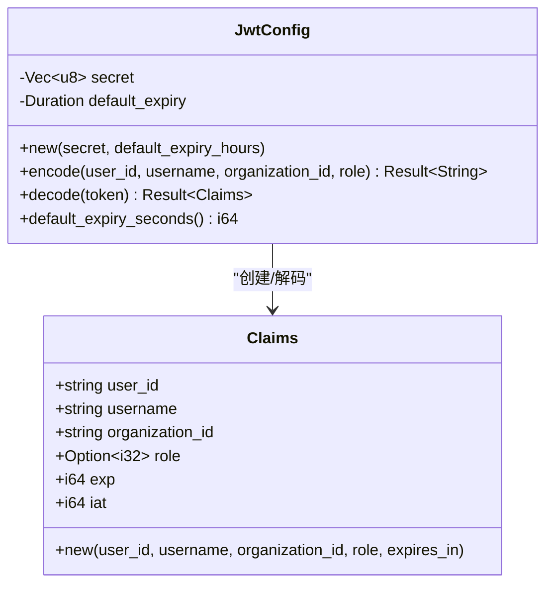
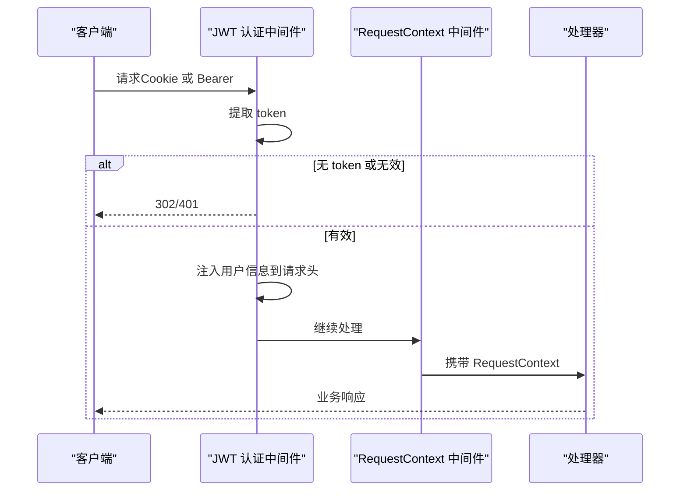
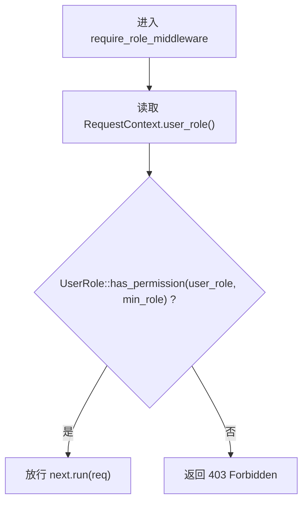
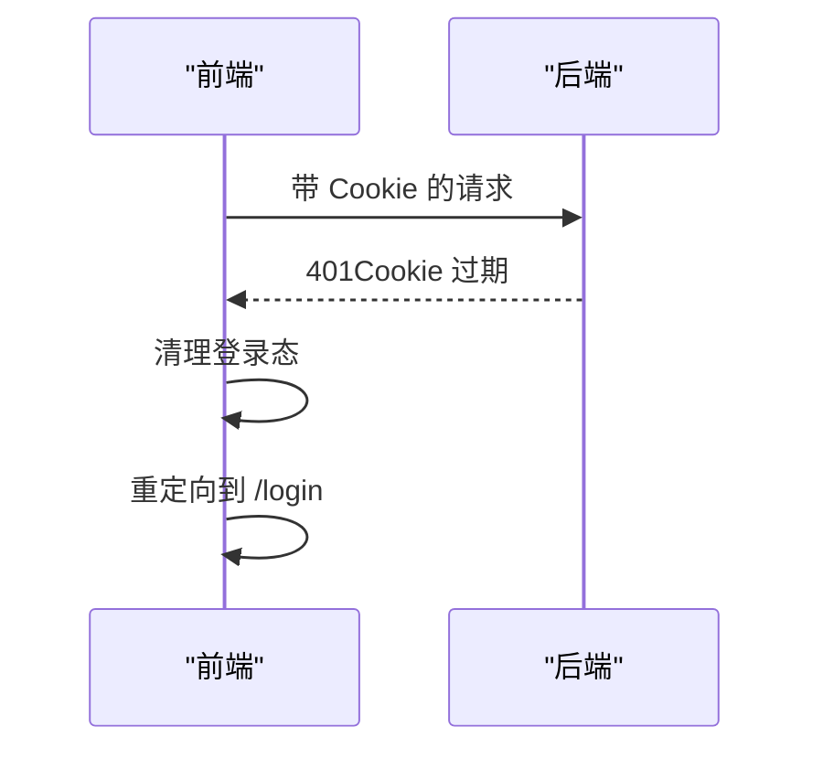
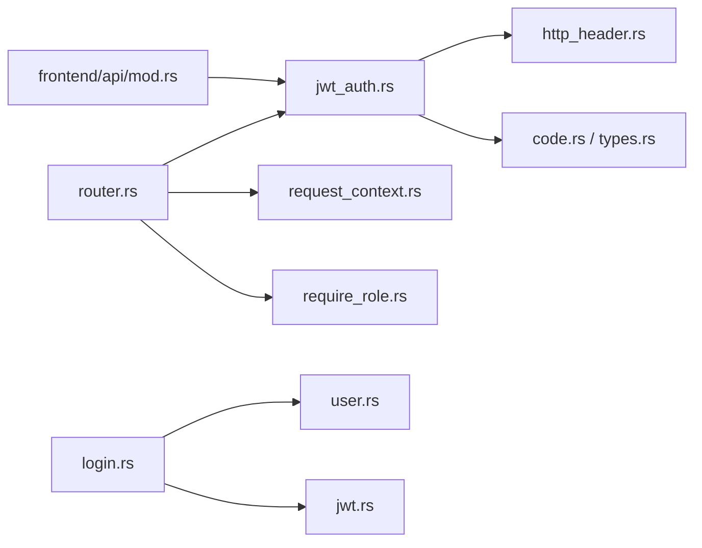

# 认证与授权 API

<cite>
**本文引用的文件**
- [router.rs](src/router.rs)
- [jwt_auth.rs](src/middleware/jwt_auth.rs)
- [require_role.rs](src/middleware/require_role.rs)
- [request_context.rs](src/middleware/request_context.rs)
- [jwt.rs](src/pkg/jwt.rs)
- [auth.rs](common/src/api/auth.rs)
- [login.rs](src/handlers/organization/auth/login.rs)
- [logout.rs](src/handlers/organization/auth/logout.rs)
- [user.rs](src/service/domain/organization/user.rs)
- [http_header.rs](common/src/constants/http_header.rs)
- [code.rs](common/src/error/code.rs)
- [types.rs](common/src/error/types.rs)
- [mod.rs](frontend/src/api/mod.rs)
</cite>

## 目录
1. [简介](#简介)
2. [项目结构](#项目结构)
3. [核心组件](#核心组件)
4. [架构总览](#架构总览)
5. [详细组件分析](#详细组件分析)
6. [依赖关系分析](#依赖关系分析)
7. [性能考虑](#性能考虑)
8. [故障排查指南](#故障排查指南)
9. [结论](#结论)
10. [附录](#附录)

## 简介
本文件为 AI Orz 的认证与授权 API 提供完整技术文档，覆盖用户登录、登出、JWT 令牌签发与验证、RBAC 权限控制与角色管理、请求参数与响应格式、错误处理与会话管理。同时给出中间件如何拦截未认证请求与进行权限校验的流程说明，并提供常见场景示例（成功登录、权限不足、令牌过期等）。

## 项目结构
认证与授权相关代码分布在以下位置：
- 路由注册：公开路由包含登录/登出；受保护路由统一挂载 JWT 认证与 RequestContext 中间件。
- 中间件：JWT 认证、角色权限校验、请求上下文注入。
- 领域服务：用户名密码校验、组织归属校验、用户状态检查。
- JWT 工具：Claims 定义、编码/解码、全局配置。
- DTO：前后端共享的登录/登出请求与响应结构。
- 错误码：统一的错误类型与 HTTP 状态映射。
- 前端：401 时清理登录态并重定向到登录页。

**图表来源**
- [router.rs:61-136](src/router.rs#L61-L136)
- [jwt_auth.rs:25-87](src/middleware/jwt_auth.rs#L25-L87)
- [request_context.rs:20-40](src/middleware/request_context.rs#L20-L40)
- [login.rs:18-68](src/handlers/organization/auth/login.rs#L18-L68)
- [logout.rs:15-39](src/handlers/organization/auth/logout.rs#L15-L39)
- [jwt.rs:70-106](src/pkg/jwt.rs#L70-L106)

**章节来源**
- [router.rs:61-136](src/router.rs#L61-L136)

## 核心组件
- 登录接口：POST /api/v1/organization/auth/login
  - 请求体：用户名、密码哈希、组织 ID
  - 响应：用户 ID、用户名、组织 ID、JWT token
  - 行为：校验用户名/组织/密码/状态，签发 JWT，设置 Cookie，返回 token
- 登出接口：POST /api/v1/organization/auth/logout
  - 响应：success=true
  - 行为：清除 Cookie（设置过期时间为 0）
- JWT 工具：Claims 包含 user_id、username、organization_id、role、exp、iat；支持 encode/decode
- 认证中间件：优先从 Cookie 提取 token，否则从 Authorization: Bearer；失败时浏览器重定向到登录页，API 返回 401
- 权限中间件：基于 UserRole 的 RBAC，判断当前用户是否满足最低角色要求
- 请求上下文：将用户信息（X-User-Id、X-Username、X-Organization-Id、X-User-Role、X-Caller-Type）注入 RequestContext，供后续处理器使用

**章节来源**
- [auth.rs:5-38](common/src/api/auth.rs#L5-L38)
- [login.rs:18-68](src/handlers/organization/auth/login.rs#L18-L68)
- [logout.rs:15-39](src/handlers/organization/auth/logout.rs#L15-L39)
- [jwt.rs:11-106](src/pkg/jwt.rs#L11-L106)
- [jwt_auth.rs:25-87](src/middleware/jwt_auth.rs#L25-L87)
- [require_role.rs:16-38](src/middleware/require_role.rs#L16-L38)
- [request_context.rs:20-40](src/middleware/request_context.rs#L20-L40)

## 架构总览
认证与授权采用“中间件 + 领域校验”的分层模式：
- 路由层区分公开与受保护路径
- 中间件链：JWT 认证 → RequestContext 注入 → 可选角色权限校验
- 处理器调用领域服务完成业务校验（如用户名/密码/组织/状态）
- JWT 工具负责签名与验签，错误通过统一错误体系上报

**图表来源**
- [router.rs:61-94](src/router.rs#L61-L94)
- [login.rs:18-68](src/handlers/organization/auth/login.rs#L18-L68)
- [jwt.rs:70-106](src/pkg/jwt.rs#L70-L106)

## 详细组件分析

### 登录流程
- 入口：POST /api/v1/organization/auth/login
- 步骤：
  1) 解析请求体（用户名、密码哈希、组织 ID）
  2) 调用领域服务校验用户名、组织归属、密码哈希、用户状态
  3) 签发 JWT（包含用户 ID、用户名、组织 ID、角色、过期时间）
  4) 设置 HttpOnly Cookie（名称固定），并返回 token
- 错误：
  - 用户名/组织/密码不匹配：返回无效请求错误
  - 用户被禁用：返回无效请求错误
  - JWT 签发失败：返回内部错误

**图表来源**
- [login.rs:18-68](src/handlers/organization/auth/login.rs#L18-L68)
- [user.rs:85-117](src/service/domain/organization/user.rs#L85-L117)
- [jwt.rs:70-106](src/pkg/jwt.rs#L70-L106)

**章节来源**
- [login.rs:18-68](src/handlers/organization/auth/login.rs#L18-L68)
- [user.rs:85-117](src/service/domain/organization/user.rs#L85-L117)
- [jwt.rs:70-106](src/pkg/jwt.rs#L70-L106)

### 登出流程
- 入口：POST /api/v1/organization/auth/logout
- 行为：清除 Cookie（设置过期时间为 0），返回 success=true
- 注意：登出不撤销服务端侧的 JWT 有效性；如需强制失效需结合黑名单或缩短过期时间策略

**图表来源**
- [router.rs:61-94](src/router.rs#L61-L94)
- [logout.rs:15-39](src/handlers/organization/auth/logout.rs#L15-L39)

**章节来源**
- [logout.rs:15-39](src/handlers/organization/auth/logout.rs#L15-L39)

### JWT 令牌机制
- Claims 字段：user_id、username、organization_id、role、exp、iat
- 编码：HS256 算法，使用全局配置的 secret 与默认过期时间
- 解码：验证签名与过期时间，返回 Claims
- 全局配置：init_jwt(secret, default_expiry_hours)，jwt_config() 获取单例

**图表来源**
- [jwt.rs:11-106](src/pkg/jwt.rs#L11-L106)

**章节来源**
- [jwt.rs:11-106](src/pkg/jwt.rs#L11-L106)

### 认证中间件（JWT）
- 双模式：优先 Cookie，其次 Authorization: Bearer
- 失败响应：
  - 浏览器请求：302 重定向到登录页
  - API 请求：401 JSON（错误码 unauthorized/invalid_token）
- 成功后注入请求头：X-User-Id、X-Username、X-Organization-Id、X-User-Role、X-Caller-Type=user
- 执行顺序：在 RequestContext 中间件之前（外层先执行）

**图表来源**
- [jwt_auth.rs:25-87](src/middleware/jwt_auth.rs#L25-L87)
- [request_context.rs:20-40](src/middleware/request_context.rs#L20-L40)

**章节来源**
- [jwt_auth.rs:25-87](src/middleware/jwt_auth.rs#L25-L87)
- [request_context.rs:20-40](src/middleware/request_context.rs#L20-L40)

### 权限控制（RBAC）与角色管理
- 角色层级：SuperAdmin > Admin > Member
- 权限判定：从 min_role 向上遍历祖先链，若包含当前用户角色则允许
- 应用方式：
  - 路由级：system 路由整体要求 Admin
  - 接口级：特定接口可叠加 require_role_middleware(UserRole::...)
- 失败响应：403 JSON（错误码 forbidden）

**图表来源**
- [require_role.rs:16-38](src/middleware/require_role.rs#L16-L38)
- [user.rs:34-99](common/src/enums/user.rs#L34-L99)

**章节来源**
- [require_role.rs:16-38](src/middleware/require_role.rs#L16-L38)
- [user.rs:34-99](common/src/enums/user.rs#L34-L99)

### 会话管理
- 浏览器场景：使用 HttpOnly Cookie（名称固定）自动携带 token
- API 场景：Authorization: Bearer 手动携带 token
- 登出：清除 Cookie（设置过期时间为 0）
- 前端：收到 401 时清理登录态并重定向到登录页

**图表来源**
- [jwt_auth.rs:139-155](src/middleware/jwt_auth.rs#L139-L155)
- [mod.rs:37-45](frontend/src/api/mod.rs#L37-L45)

**章节来源**
- [jwt_auth.rs:139-155](src/middleware/jwt_auth.rs#L139-L155)
- [mod.rs:37-45](frontend/src/api/mod.rs#L37-L45)

## 依赖关系分析
- 路由依赖中间件：protected_routes 统一挂载 jwt_auth_middleware 与 request_context_middleware；system 路由额外挂载 require_role_middleware
- 登录处理器依赖领域服务与 JWT 工具
- 中间件依赖常量 header key 与统一错误类型
- 前端依赖后端统一错误响应（401 触发清理与重定向）

**图表来源**
- [router.rs:61-136](src/router.rs#L61-L136)
- [login.rs:18-68](src/handlers/organization/auth/login.rs#L18-L68)
- [jwt_auth.rs:25-87](src/middleware/jwt_auth.rs#L25-L87)
- [http_header.rs:1-20](common/src/constants/http_header.rs#L1-L20)
- [code.rs:1-146](common/src/error/code.rs#L1-L146)
- [types.rs:106-246](common/src/error/types.rs#L106-L246)
- [mod.rs:37-45](frontend/src/api/mod.rs#L37-L45)

**章节来源**
- [router.rs:61-136](src/router.rs#L61-L136)
- [jwt_auth.rs:25-87](src/middleware/jwt_auth.rs#L25-L87)
- [login.rs:18-68](src/handlers/organization/auth/login.rs#L18-L68)

## 性能考虑
- JWT 解码与签名验证为轻量操作，开销主要在于密钥长度与算法选择（HS256）
- Cookie 模式减少客户端手动注入 token 的开销
- 建议合理设置 JWT 过期时间以平衡安全与用户体验
- 避免在高频路径中进行额外的数据库查询；登录流程已在领域层集中校验

[本节为通用指导，无需具体文件引用]

## 故障排查指南
- 未认证（401）：
  - 检查 Cookie 是否存在且名称正确
  - 检查 Authorization: Bearer 是否正确携带
  - 检查 JWT 是否过期或签名无效
- 权限不足（403）：
  - 检查当前用户角色是否满足接口要求的最低角色
  - 确认 require_role_middleware 是否按预期挂载
- 登录失败：
  - 检查用户名、组织 ID、密码哈希是否匹配
  - 检查用户状态是否为启用
- 前端 401 处理：
  - 确认前端在 401 时清理登录态并重定向到登录页

**章节来源**
- [jwt_auth.rs:139-155](src/middleware/jwt_auth.rs#L139-L155)
- [require_role.rs:16-38](src/middleware/require_role.rs#L16-L38)
- [user.rs:85-117](src/service/domain/organization/user.rs#L85-L117)
- [mod.rs:37-45](frontend/src/api/mod.rs#L37-L45)

## 结论
AI Orz 的认证与授权体系通过路由分层、中间件链与领域校验实现清晰的职责分离。JWT 提供无状态的身份凭证，RBAC 提供细粒度的权限控制，前后端协作确保会话管理与错误处理的一致性。建议在新增受保护接口时遵循现有中间件模式，并在必要时叠加角色权限校验。

[本节为总结性内容，无需具体文件引用]

## 附录

### API 定义与示例

- 登录
  - 方法：POST
  - 路径：/api/v1/organization/auth/login
  - 请求体：
    - username: string
    - password_hash: string
    - organization_id: string
  - 响应：
    - user_id: string
    - username: string
    - organization_id: string
    - token: string
  - 成功示例：
    - 200 OK + Set-Cookie + {user_id, username, organization_id, token}
  - 失败示例：
    - 400 Bad Request（用户名/组织/密码错误或用户被禁用）

- 登出
  - 方法：POST
  - 路径：/api/v1/organization/auth/logout
  - 响应：
    - success: boolean
  - 成功示例：
    - 200 OK + Set-Cookie(过期=0) + {success: true}

- 受保护接口访问
  - 方法：任意（GET/POST/PUT/DELETE）
  - 路径：/api/v1/*（除公开路由外）
  - 认证：
    - 浏览器：Cookie 自动携带
    - API：Authorization: Bearer <token>
  - 失败示例：
    - 401 Unauthorized（未认证或过期）
    - 403 Forbidden（权限不足）

**章节来源**
- [auth.rs:5-38](common/src/api/auth.rs#L5-L38)
- [login.rs:18-68](src/handlers/organization/auth/login.rs#L18-L68)
- [logout.rs:15-39](src/handlers/organization/auth/logout.rs#L15-L39)
- [router.rs:61-136](src/router.rs#L61-L136)
- [code.rs:1-146](common/src/error/code.rs#L1-L146)