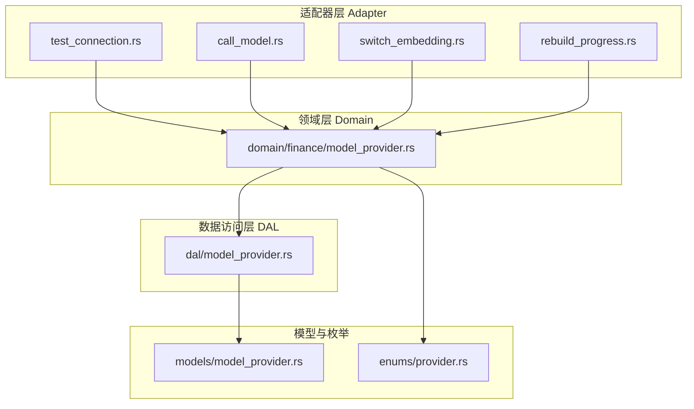
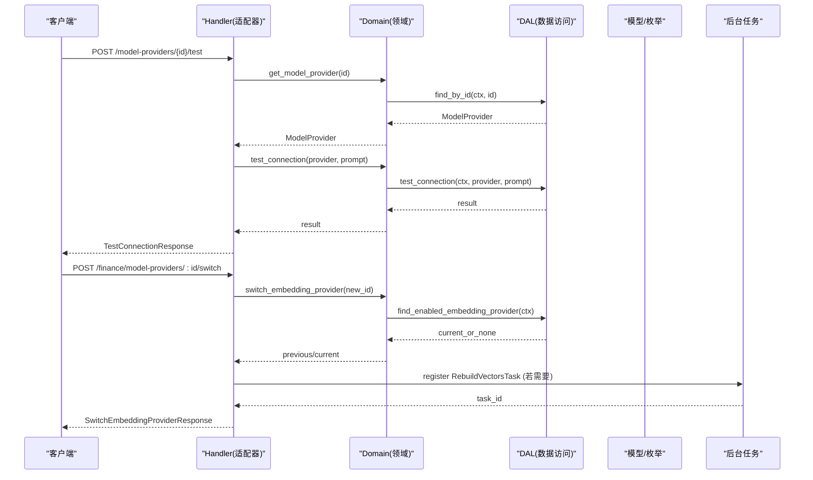
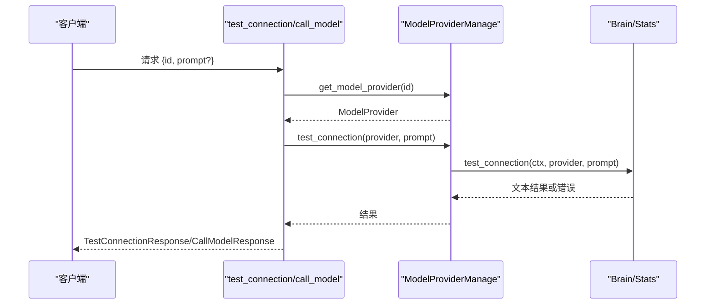
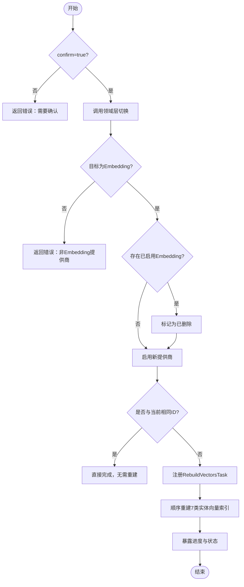
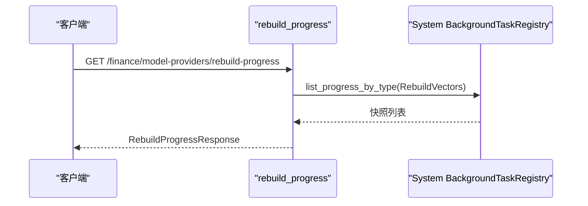
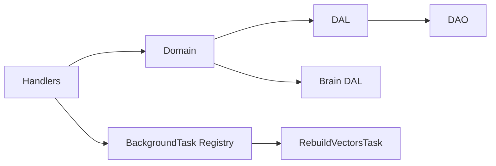

# 模型提供商管理 API

<cite>
**本文引用的文件**
- [common/src/api/model_provider.rs](common/src/api/model_provider.rs)
- [src/handlers/finance/model_provider/mod.rs](src/handlers/finance/model_provider/mod.rs)
- [src/handlers/finance/model_provider/test_connection.rs](src/handlers/finance/model_provider/test_connection.rs)
- [src/handlers/finance/model_provider/call_model.rs](src/handlers/finance/model_provider/call_model.rs)
- [src/handlers/finance/model_provider/switch_embedding.rs](src/handlers/finance/model_provider/switch_embedding.rs)
- [src/handlers/finance/model_provider/rebuild_progress.rs](src/handlers/finance/model_provider/rebuild_progress.rs)
- [src/handlers/finance/model_provider/rebuild_vectors_task.rs](src/handlers/finance/model_provider/rebuild_vectors_task.rs)
- [src/service/domain/finance/model_provider.rs](src/service/domain/finance/model_provider.rs)
- [src/service/dal/model_provider.rs](src/service/dal/model_provider.rs)
- [src/models/model_provider.rs](src/models/model_provider.rs)
- [common/src/enums/provider.rs](common/src/enums/provider.rs)
- [common/src/enums/mod.rs](common/src/enums/mod.rs)
- [src/handlers/finance/model_provider/create_model_provider.rs](src/handlers/finance/model_provider/create_model_provider.rs)
- [src/handlers/finance/model_provider/update_model_provider.rs](src/handlers/finance/model_provider/update_model_provider.rs)
- [common/src/enums/agent.rs](common/src/enums/agent.rs)  ← ModelProviderStatus 新增 Disabled=2
</cite>

## 目录
1. [简介](#简介)
2. [项目结构](#项目结构)
3. [核心组件](#核心组件)
4. [架构总览](#架构总览)
5. [详细组件分析](#详细组件分析)
6. [依赖关系分析](#依赖关系分析)
7. [性能与可靠性](#性能与可靠性)
8. [故障排查指南](#故障排查指南)
9. [结论](#结论)
10. [附录：接口清单与使用示例](#附录接口清单与使用示例)

## 简介
本文件面向“模型提供商管理”相关 API，覆盖配置、调用、连接测试、向量重建、嵌入模型切换等能力。系统采用严格四层单向调用：Adapter（HTTP Handler）→ Domain → DAL → DAO，禁止跨层与同层互调；Domain 输入为 Command/Query，输出业务实体与内部事件；DAL 对外统一使用业务实体；通用工具集中在 pkg 层。启动流程分两阶段：同步 service::init() 注册单例与 AOP producer/consumer，异步 service::init_base_data() 幂等注入默认基础数据。技术栈包括 Axum 0.8、sqlx 0.8（SQLite）、DuckDB 统计、LanceDB/HNSW/InMemory/SqliteVss 多后端向量存储、FTS5+trigram 全文检索。

## 项目结构
围绕模型提供商管理的代码主要分布在以下位置：
- common/src/api/model_provider.rs：前后端共享的请求/响应 DTO、枚举与分页参数定义
- src/handlers/finance/model_provider/*：按方法粒度拆分的 HTTP Handler
- src/service/domain/finance/model_provider.rs：领域服务实现（校验、编排、事务边界）
- src/service/dal/model_provider.rs：数据访问层抽象与统计注入
- src/models/model_provider.rs：持久化对象 PO 与业务对象 ModelProvider
- common/src/enums/provider.rs：ProviderType、ModelCapability 等枚举
- rebuild_vectors_task.rs：向量索引重建后台任务（BackgroundTask）

图表来源
- [src/handlers/finance/model_provider/test_connection.rs:1-68](src/handlers/finance/model_provider/test_connection.rs#L1-L68)
- [src/handlers/finance/model_provider/call_model.rs:1-42](src/handlers/finance/model_provider/call_model.rs#L1-L42)
- [src/handlers/finance/model_provider/switch_embedding.rs:1-55](src/handlers/finance/model_provider/switch_embedding.rs#L1-L55)
- [src/handlers/finance/model_provider/rebuild_progress.rs:1-50](src/handlers/finance/model_provider/rebuild_progress.rs#L1-L50)
- [src/service/domain/finance/model_provider.rs:1-149](src/service/domain/finance/model_provider.rs#L1-L149)
- [src/service/dal/model_provider.rs:1-223](src/service/dal/model_provider.rs#L1-L223)
- [src/models/model_provider.rs:1-248](src/models/model_provider.rs#L1-L248)
- [common/src/enums/provider.rs:1-154](common/src/enums/provider.rs#L1-L154)

章节来源
- [src/handlers/finance/model_provider/mod.rs:1-25](src/handlers/finance/model_provider/mod.rs#L1-L25)
- [common/src/api/model_provider.rs:1-391](common/src/api/model_provider.rs#L1-L391)

## 核心组件
- 请求/响应 DTO：创建、更新、查询、列表、删除、连接测试、模型调用、切换嵌入提供商、重建进度等
- Provider 类型与能力：OpenAI、DeepSeek、Qwen、Doubao、Ollama、Custom、FastEmbed、DoubaoVision；Agent/Embedding 能力区分
- 领域服务：创建/获取/更新/删除/查询提供商；唯一性校验（仅一个启用的 Embedding 提供商）；连接测试；切换嵌入提供商；创建 Embedding 时已有启用者降级为 Disabled(2)；启用走切换确认；创建/更新按生效状态条件触发重建
- 数据访问层：CRUD、综合查询、统计注入（可选）、启用中的 Embedding 提供商查询
- 后台任务：RebuildVectorsTask，串行执行 7 类实体的向量重建并暴露进度

章节来源
- [common/src/api/model_provider.rs:1-391](common/src/api/model_provider.rs#L1-L391)
- [common/src/enums/provider.rs:1-154](common/src/enums/provider.rs#L1-L154)
- [src/service/domain/finance/model_provider.rs:1-149](src/service/domain/finance/model_provider.rs#L1-L149)
- [src/service/dal/model_provider.rs:1-223](src/service/dal/model_provider.rs#L1-L223)
- [src/handlers/finance/model_provider/rebuild_vectors_task.rs:1-194](src/handlers/finance/model_provider/rebuild_vectors_task.rs#L1-L194)

## 架构总览
下图展示从 HTTP 请求到领域逻辑、数据访问与模型的调用链，以及后台任务对向量重建的编排。

图表来源
- [src/handlers/finance/model_provider/test_connection.rs:1-68](src/handlers/finance/model_provider/test_connection.rs#L1-L68)
- [src/handlers/finance/model_provider/switch_embedding.rs:1-55](src/handlers/finance/model_provider/switch_embedding.rs#L1-L55)
- [src/service/domain/finance/model_provider.rs:1-149](src/service/domain/finance/model_provider.rs#L1-L149)
- [src/service/dal/model_provider.rs:1-223](src/service/dal/model_provider.rs#L1-L223)
- [src/handlers/finance/model_provider/rebuild_vectors_task.rs:1-194](src/handlers/finance/model_provider/rebuild_vectors_task.rs#L1-L194)

## 详细组件分析

### 连接测试与模型调用
- 连接测试：通过指定 provider id 与可选 prompt，验证连通性与鉴权，空响应视为失败
- 模型调用：复用连接测试路径，将 prompt 作为入参返回生成结果

图表来源
- [src/handlers/finance/model_provider/test_connection.rs:1-68](src/handlers/finance/model_provider/test_connection.rs#L1-L68)
- [src/handlers/finance/model_provider/call_model.rs:1-42](src/handlers/finance/model_provider/call_model.rs#L1-L42)
- [src/service/domain/finance/model_provider.rs:93-101](src/service/domain/finance/model_provider.rs#L93-L101)

章节来源
- [src/handlers/finance/model_provider/test_connection.rs:1-68](src/handlers/finance/model_provider/test_connection.rs#L1-L68)
- [src/handlers/finance/model_provider/call_model.rs:1-42](src/handlers/finance/model_provider/call_model.rs#L1-L42)
- [src/service/domain/finance/model_provider.rs:93-101](src/service/domain/finance/model_provider.rs#L93-L101)

### 切换嵌入提供商与向量重建
- 切换前校验：目标必须为 Embedding 能力；同一 provider 无需重建
- 切换逻辑：禁用当前启用的 Embedding 提供商，启用新提供商
- 重建任务：注册 RebuildVectorsTask，遍历 agent/memory/skill/task/project/message/tool 七类实体逐一重建向量索引，并发度受控（同一时刻仅允许一个 Running）

图表来源
- [src/handlers/finance/model_provider/switch_embedding.rs:1-55](src/handlers/finance/model_provider/switch_embedding.rs#L1-L55)
- [src/service/domain/finance/model_provider.rs:103-147](src/service/domain/finance/model_provider.rs#L103-L147)
- [src/handlers/finance/model_provider/rebuild_vectors_task.rs:108-193](src/handlers/finance/model_provider/rebuild_vectors_task.rs#L108-L193)

章节来源
- [src/handlers/finance/model_provider/switch_embedding.rs:1-55](src/handlers/finance/model_provider/switch_embedding.rs#L1-L55)
- [src/service/domain/finance/model_provider.rs:103-147](src/service/domain/finance/model_provider.rs#L103-L147)
- [src/handlers/finance/model_provider/rebuild_vectors_task.rs:1-194](src/handlers/finance/model_provider/rebuild_vectors_task.rs#L1-L194)

### 重建进度查询
- 通过系统后台任务注册中心查询最近一次 RebuildVectors 任务的进度快照，映射为向后兼容的 RebuildProgressResponse

图表来源
- [src/handlers/finance/model_provider/rebuild_progress.rs:1-50](src/handlers/finance/model_provider/rebuild_progress.rs#L1-L50)

章节来源
- [src/handlers/finance/model_provider/rebuild_progress.rs:1-50](src/handlers/finance/model_provider/rebuild_progress.rs#L1-L50)

### 领域与数据访问层要点
- 领域层：
  - 创建：Embedding 采用「创建不阻塞 + 启用时切换」策略——已有启用 Embedding 时新创建降级为 Disabled(2)，首个创建直接 Normal 启用
  - 更新：仅使用中(Normal) Embedding 的 model_name/api_key/base_url 变化触发重建；Disabled 编辑不触发（启用时 switch 全量重建兜底）
  - 切换嵌入提供商：先禁用旧，再启用新，必要时触发重建
  - 连接测试：委托底层 brain_dal.test_connection
- ModelProviderStatus 枚举：Deleted=0(软删除) / Normal=1(启用) / Disabled=2(未启用)
- 数据访问层：
  - 提供带选项的查询：可注入 ModelCallStats（汇总、token 统计、时序），失败降级不影响主流程
  - 提供综合查询与分页
  - 提供启用中 Embedding 提供商查询用于唯一性校验

章节来源
- [src/service/domain/finance/model_provider.rs:1-149](src/service/domain/finance/model_provider.rs#L1-L149)
- [src/service/dal/model_provider.rs:45-104](src/service/dal/model_provider.rs#L45-L104)
- [src/service/dal/model_provider.rs:124-156](src/service/dal/model_provider.rs#L124-L156)
- [src/service/dal/model_provider.rs:190-221](src/service/dal/model_provider.rs#L190-L221)

### 数据模型与枚举
- ModelProviderPo：持久化对象，包含名称、类型、能力、模型名、API Key、Base URL、描述、JSON 配置、状态、审计字段
- ModelProvider：业务对象，封装 PO 并可附带统计信息
- ProviderType：OpenAI、DeepSeek、Qwen、Doubao、Ollama、Custom、FastEmbed、DoubaoVision
- ModelCapability：Agent、Embedding

章节来源
- [src/models/model_provider.rs:9-68](src/models/model_provider.rs#L9-L68)
- [src/models/model_provider.rs:144-197](src/models/model_provider.rs#L144-L197)
- [common/src/enums/provider.rs:9-45](common/src/enums/provider.rs#L9-L45)
- [common/src/enums/mod.rs:21-33](common/src/enums/mod.rs#L21-L33)

## 依赖关系分析
- Handler 仅依赖 Domain 暴露的接口，不直接访问 DAL/DAO
- Domain 组合多个 DAL（model_provider_dal、brain_dal 等），负责业务规则与事务边界
- DAL 聚合 DAO 与 Stats DAO，提供统一的数据访问与统计注入
- 后台任务通过全局 registry 注册与查询，避免耦合具体实现

图表来源
- [src/handlers/finance/model_provider/mod.rs:1-25](src/handlers/finance/model_provider/mod.rs#L1-L25)
- [src/service/domain/finance/model_provider.rs:1-149](src/service/domain/finance/model_provider.rs#L1-L149)
- [src/service/dal/model_provider.rs:1-223](src/service/dal/model_provider.rs#L1-L223)
- [src/handlers/finance/model_provider/rebuild_vectors_task.rs:1-194](src/handlers/finance/model_provider/rebuild_vectors_task.rs#L1-L194)

章节来源
- [src/handlers/finance/model_provider/mod.rs:1-25](src/handlers/finance/model_provider/mod.rs#L1-L25)
- [src/service/dal/model_provider.rs:17-41](src/service/dal/model_provider.rs#L17-L41)

## 性能与可靠性
- 负载均衡与多模型支持
  - 通过 ProviderType 与 ModelCapability 区分不同提供商与用途（Agent/Embedding）
  - 可在上层策略选择不同 provider 实例（如 OpenAI/Doubao/Ollama/FastEmbed），DAL 层提供查询与统计以辅助决策
- 熔断与降级
  - 统计注入失败会记录警告并继续返回基础数据，保证可用性
  - 连接测试空响应视为失败，避免误判
- 监控与指标
  - 可通过 with_model_call_stats 获取调用摘要、token 统计与时序数据
  - 后台任务进度暴露步骤、消息、时间戳与错误信息
- 并发控制
  - 向量重建任务同一时刻仅允许一个 Running，防止资源竞争
- 上下文窗口与压缩阈值
  - 支持 max_context_length 与 recommended_context_length 配置，用于运行时上下文压缩检测与阈值判断

[本节为通用指导，不直接分析具体文件]

## 故障排查指南
- 连接测试失败
  - 检查 provider 是否存在、状态是否正常、API Key/Base URL 是否正确
  - 查看返回 error 字段定位原因
- 切换嵌入提供商失败
  - 确认 confirm=true
  - 确认目标 provider 为 Embedding 能力
  - 若提示已有启用的 Embedding 提供商，需先禁用或切换到目标
- 向量重建冲突
  - 若提示有运行中的重建任务，等待完成后再发起新的重建
- 统计缺失
  - 若 with_model_call_stats=true 但统计为空，检查统计写入与查询链路，日志中会有降级告警

章节来源
- [src/handlers/finance/model_provider/test_connection.rs:23-67](src/handlers/finance/model_provider/test_connection.rs#L23-L67)
- [src/handlers/finance/model_provider/switch_embedding.rs:14-54](src/handlers/finance/model_provider/switch_embedding.rs#L14-L54)
- [src/handlers/finance/model_provider/rebuild_vectors_task.rs:108-120](src/handlers/finance/model_provider/rebuild_vectors_task.rs#L108-L120)
- [src/service/dal/model_provider.rs:134-151](src/service/dal/model_provider.rs#L134-L151)

## 结论
模型提供商管理 API 提供了完整的生命周期管理能力：配置、调用、连通性测试、切换嵌入提供商与向量重建。系统遵循严格的分层架构与单向依赖，结合后台任务与统计注入，实现了高可用与可观测性。通过 ProviderType 与 ModelCapability 的多模型支持与能力区分，便于在多种提供商之间灵活切换与扩展。

[本节为总结，不直接分析具体文件]

## 附录：接口清单与使用示例

- 创建模型提供商
  - 方法：POST
  - 路径：/api/v1/finance/model-providers
  - 请求体：CreateModelProviderRequest
  - 响应：CreateModelProviderResponse（含 status(i32) 和 rebuild_task_id(Option<String>) 字段）
  - 说明：支持 name、provider_type、capability、model_name、api_key、base_url、description、max_context_length、recommended_context_length

- 获取模型提供商详情
  - 方法：GET
  - 路径：/api/v1/finance/model-providers/{id}
  - 查询参数：with_model_call_stats、stats_start_time、stats_end_time、stats_interval
  - 响应：GetModelProviderResponse（可选附带统计）

- 更新模型提供商
  - 方法：PUT
  - 路径：/api/v1/finance/model-providers/{id}
  - 请求体：UpdateModelProviderRequest
  - 响应：UpdateModelProviderResponse（含 rebuild_task_id(Option<String>) 字段）

- 更新状态（启用/禁用）
  - 方法：PUT
  - 路径：/api/v1/finance/model-providers/{id}
  - 请求体：UpdateModelProviderStatusRequest
  - 响应：UpdateModelProviderResponse

- 删除模型提供商
  - 方法：DELETE
  - 路径：/api/v1/finance/model-providers/{id}
  - 请求体：DeleteModelProviderRequest
  - 响应：DeleteModelProviderResponse

- 列出所有模型提供商
  - 方法：GET
  - 路径：/api/v1/finance/model-providers
  - 响应：ListModelProvidersResponse

- 综合查询模型提供商
  - 方法：POST
  - 路径：/api/v1/finance/model-providers/query
  - 请求体：ModelProviderQueryRequest（支持 provider_type、capability、status、exclude_status、分页）
  - 响应：PagedResult<ModelProviderListItem>

- 连接测试
  - 方法：POST
  - 路径：/api/v1/model-providers/{id}/test
  - 请求体：TestModelProviderConnectionRequest（prompt 可选）
  - 响应：TestConnectionResponse

- 调用模型
  - 方法：POST
  - 路径：/api/v1/model-providers/{id}/call
  - 请求体：CallModelRequest
  - 响应：CallModelResponse

- 切换嵌入提供商
  - 方法：POST
  - 路径：/api/v1/finance/model-providers/:id/switch
  - 请求体：SwitchEmbeddingProviderRequest（confirm 必填）
  - 响应：SwitchEmbeddingProviderResponse（包含重建状态与任务 ID）

- 查询重建进度
  - 方法：GET
  - 路径：/api/v1/finance/model-providers/rebuild-progress
  - 查询参数：task_id（用于兼容）
  - 响应：RebuildProgressResponse

章节来源
- [common/src/api/model_provider.rs:9-391](common/src/api/model_provider.rs#L9-L391)
- [src/handlers/finance/model_provider/test_connection.rs:1-68](src/handlers/finance/model_provider/test_connection.rs#L1-L68)
- [src/handlers/finance/model_provider/call_model.rs:1-42](src/handlers/finance/model_provider/call_model.rs#L1-L42)
- [src/handlers/finance/model_provider/switch_embedding.rs:1-55](src/handlers/finance/model_provider/switch_embedding.rs#L1-L55)
- [src/handlers/finance/model_provider/rebuild_progress.rs:1-50](src/handlers/finance/model_provider/rebuild_progress.rs#L1-L50)