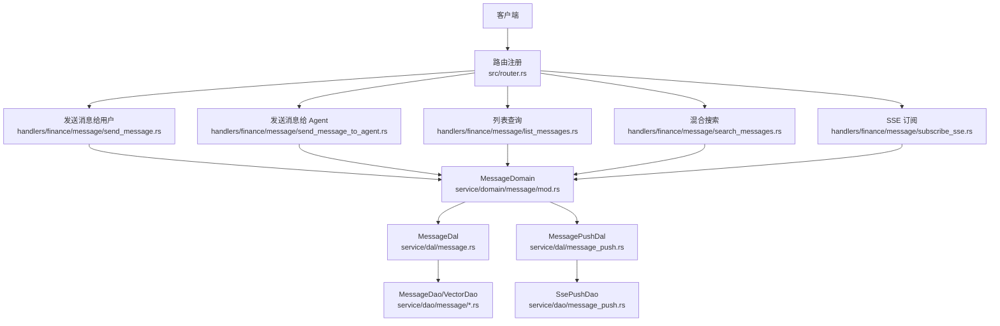
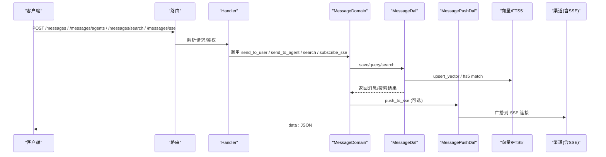
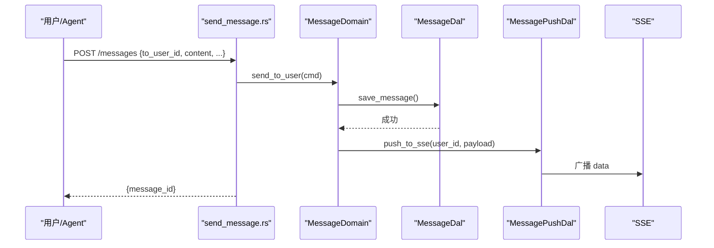
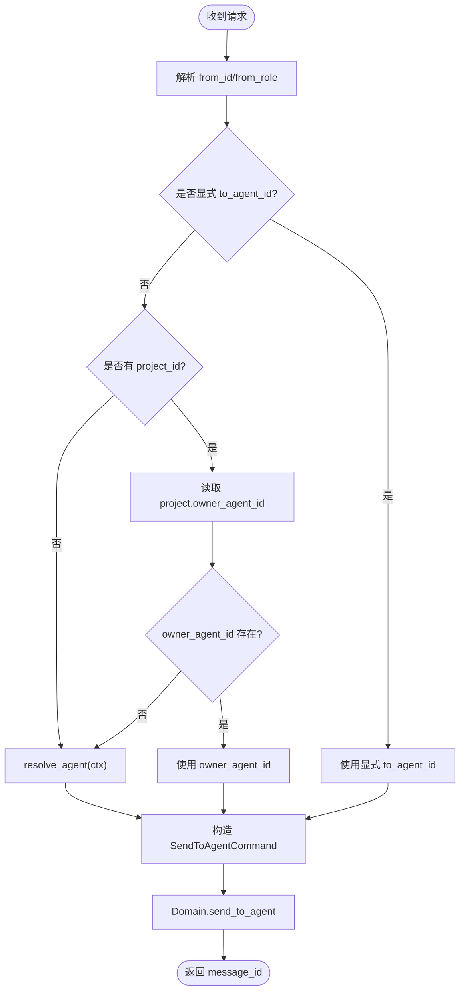
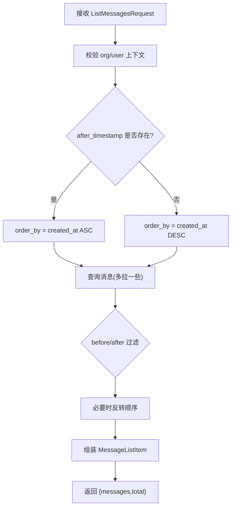
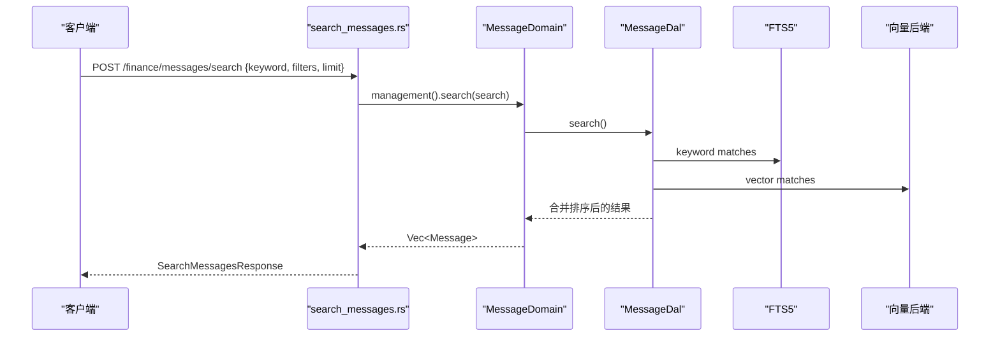
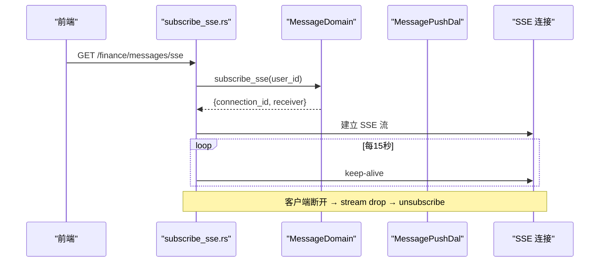
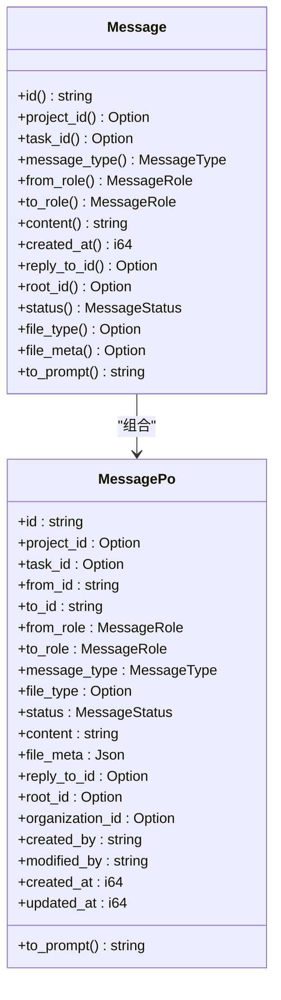
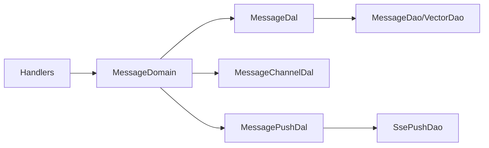

# 消息处理 API

<cite>
**本文引用的文件**
- [router.rs](src/router.rs)
- [send_message.rs](src/handlers/finance/message/send_message.rs)
- [list_messages.rs](src/handlers/finance/message/list_messages.rs)
- [search_messages.rs](src/handlers/finance/message/search_messages.rs)
- [subscribe_sse.rs](src/handlers/finance/message/subscribe_sse.rs)
- [send_message_to_agent.rs](src/handlers/finance/message/send_message_to_agent.rs)
- [message.rs](src/models/message.rs)
- [mod.rs](src/service/domain/message/mod.rs)
- [message.rs](src/service/dal/message.rs)
- [message_push.rs](src/service/dao/message_push.rs)
- [message_channel_design.md](docs/message_channel_design.md)
- [2026-07-14-sse-message-push.md](docs/superpowers/plans/2026-07-14-sse-message-push.md)
- [message_interaction_design.md](docs/message_interaction_design.md)
- [app.rs](tests/common/app.rs)
</cite>

## 目录
1. [简介](#简介)
2. [项目结构](#项目结构)
3. [核心组件](#核心组件)
4. [架构总览](#架构总览)
5. [详细组件分析](#详细组件分析)
6. [依赖关系分析](#依赖关系分析)
7. [性能与可靠性](#性能与可靠性)
8. [故障排查指南](#故障排查指南)
9. [结论](#结论)
10. [附录：API 参考与示例](#附录api-参考与示例)

## 简介
本文件面向“消息处理 API”，覆盖消息发送、接收、搜索、SSE 订阅等接口，并说明消息格式、路由规则、优先级队列、重试机制、实时推送、持久化、向量搜索、全文检索、模板与批量发送、异步处理等能力。系统遵循严格四层单向调用：Adapter（HTTP Handler / AOP Producer）→ Domain → DAL → DAO，禁止跨层与同层互调；Domain 输入为 Command/Query，输出业务实体与内部事件；DAO/DAL 使用 RequestContext 作为首参并通过 ctx.clone() 传递。

## 项目结构
消息相关能力分布在以下层次：
- Adapter 层：Axum HTTP Handler，负责请求解析、鉴权上下文注入、DTO 转换、编排 Domain。
- Domain 层：MessageDomain 聚合投递与管理能力，定义命令参数与订阅接口。
- DAL 层：MessageDal 封装消息保存、查询、混合搜索与向量化流程；MessagePushDal 封装 SSE 推送加工。
- DAO 层：MessageDao/MessageVectorDao/SsePushDao 实现 SQLite FTS5、LanceDB/HNSW/SqliteVss 向量索引与 SSE 连接管理。

图表来源
- [router.rs:480-524](src/router.rs#L480-L524)
- [send_message.rs:1-41](src/handlers/finance/message/send_message.rs#L1-L41)
- [send_message_to_agent.rs:1-98](src/handlers/finance/message/send_message_to_agent.rs#L1-L98)
- [list_messages.rs:1-122](src/handlers/finance/message/list_messages.rs#L1-L122)
- [search_messages.rs:1-79](src/handlers/finance/message/search_messages.rs#L1-L79)
- [subscribe_sse.rs:1-93](src/handlers/finance/message/subscribe_sse.rs#L1-L93)
- [mod.rs:32-66](src/service/domain/message/mod.rs#L32-L66)
- [message.rs:20-122](src/service/dal/message.rs#L20-L122)
- [message_push.rs:1-58](src/service/dao/message_push.rs#L1-L58)

章节来源
- [router.rs:480-524](src/router.rs#L480-L524)

## 核心组件
- 消息模型与事件
  - Message 业务实体组合 MessagePo 持久化对象，支持事件总线（Event trait），默认优先级 5，按任务/项目/消息 ID 分组消费。
  - MessagePo 包含消息元数据、附件信息、回复链、组织上下文等字段。
- Domain 能力
  - 投递：send_to_user、send_to_agent、send_tool_call_request/result、send_task_assignment、deliver_message、subscribe/unsubscribe SSE。
  - 管理：query、list_by_*、get_by_id、update_status、delete、cleanup_conversation、search（混合搜索）。
- DAL 能力
  - 保存消息并发布 AOP 事件；自动尝试构建向量参数并写入向量索引（失败降级）。
  - 混合搜索：FTS5 关键词 + LanceDB/HNSW/SqliteVss 向量语义，结果合并排序。
  - SSE 推送：注册/注销连接、广播消息、keep-alive。
- DAO 能力
  - 消息 CRUD、FTS5 全文检索、向量索引 CRUD。
  - SsePushDaoImpl：内存级 broadcast channel 管理用户连接集合与连接映射。

章节来源
- [message.rs:18-247](src/models/message.rs#L18-L247)
- [mod.rs:119-378](src/service/domain/message/mod.rs#L119-L378)
- [message.rs:131-193](src/service/dal/message.rs#L131-L193)
- [message.rs:393-564](src/service/dal/message.rs#L393-L564)
- [message_push.rs:1-58](src/service/dao/message_push.rs#L1-L58)

## 架构总览
消息从 Handler 进入，经 Domain 编排，DAL 完成持久化与搜索增强，DAO 落库与索引更新；投递时通过多渠道分发（含 SSE）。

图表来源
- [send_message.rs:1-41](src/handlers/finance/message/send_message.rs#L1-L41)
- [send_message_to_agent.rs:1-98](src/handlers/finance/message/send_message_to_agent.rs#L1-L98)
- [search_messages.rs:1-79](src/handlers/finance/message/search_messages.rs#L1-L79)
- [subscribe_sse.rs:1-93](src/handlers/finance/message/subscribe_sse.rs#L1-L93)
- [message.rs:131-193](src/service/dal/message.rs#L131-L193)
- [message.rs:393-564](src/service/dal/message.rs#L393-L564)
- [message_push.rs:1-58](src/service/dao/message_push.rs#L1-L58)

## 详细组件分析

### 发送消息给用户
- 路由：POST /api/v1/messages
- 入口：send_message_handler
- 行为：从 RequestContext 获取调用方身份，构造 SendToUserCommand，调用 Domain.delivery().send_to_user，返回 message_id。
- 后续：DAL 保存消息并发布 AOP 事件，尝试向量化；投递阶段可走多渠道（含 SSE）。

图表来源
- [send_message.rs:1-41](src/handlers/finance/message/send_message.rs#L1-L41)
- [message.rs:131-193](src/service/dal/message.rs#L131-L193)
- [message_push.rs:1-58](src/service/dao/message_push.rs#L1-L58)

章节来源
- [send_message.rs:1-41](src/handlers/finance/message/send_message.rs#L1-L41)
- [message.rs:131-193](src/service/dal/message.rs#L131-L193)

### 发送消息给 Agent（协作）
- 路由：POST /api/v1/messages/agents
- 入口：send_message_to_agent_handler
- 行为：解析 from_id/from_role；根据 to_agent_id 或 project.owner_agent_id 或 resolve_agent 确定目标 Agent；构造 SendToAgentCommand 并调用 Domain.delivery().send_to_agent。
- 场景：默认对话框（无 project_id）与 Project 对话框（有 project_id）两种上下文。

图表来源
- [send_message_to_agent.rs:1-98](src/handlers/finance/message/send_message_to_agent.rs#L1-L98)

章节来源
- [send_message_to_agent.rs:1-98](src/handlers/finance/message/send_message_to_agent.rs#L1-L98)

### 消息列表与分页
- 路由：GET /api/v1/messages
- 入口：list_messages_handler
- 行为：校验组织/用户上下文；根据 after_timestamp 决定排序方向；查询后在 Handler 层按时间过滤并组装响应 DTO。
- 分页模式：
  - 初始加载/上拉翻页：传 before_timestamp，按 created_at DESC 取 limit。
  - 下拉轮询新消息：传 after_timestamp，按 created_at ASC 追加。
  - 两者都传：after < created_at < before。

图表来源
- [list_messages.rs:1-122](src/handlers/finance/message/list_messages.rs#L1-L122)

章节来源
- [list_messages.rs:1-122](src/handlers/finance/message/list_messages.rs#L1-L122)

### 混合搜索（全文 + 向量）
- 路由：POST /api/v1/finance/messages/search
- 入口：search_messages_handler
- 行为：构造 MessageSearch（keyword + filters + top_k），调用 Domain.management().search；DAL 执行 FTS5 MATCH + 向量搜索并合并结果，标注 match_type、fts_rank、vector_distance。
- 返回：SearchMessagesResponse，包含匹配类型与相关性指标。

图表来源
- [search_messages.rs:1-79](src/handlers/finance/message/search_messages.rs#L1-L79)
- [message.rs:393-564](src/service/dal/message.rs#L393-L564)

章节来源
- [search_messages.rs:1-79](src/handlers/finance/message/search_messages.rs#L1-L79)
- [message.rs:393-564](src/service/dal/message.rs#L393-L564)

### SSE 实时推送
- 路由：GET /api/v1/finance/messages/sse
- 入口：subscribe_sse_handler
- 行为：从 JWT 提取 user_id，调用 Domain.delivery().subscribe_sse 获取 receiver；将 BroadcastStream 转为 SSE Event 流；keep_alive 间隔 15s；stream 丢弃时自动 unsubscribe 清理连接。
- 推送路径：消息投递时通过 MessagePushDal.push_to_sse 广播 JSON payload，前端 EventSource 接收 data。

图表来源
- [subscribe_sse.rs:1-93](src/handlers/finance/message/subscribe_sse.rs#L1-L93)
- [2026-07-14-sse-message-push.md:58-221](docs/superpowers/plans/2026-07-14-sse-message-push.md#L58-L221)

章节来源
- [subscribe_sse.rs:1-93](src/handlers/finance/message/subscribe_sse.rs#L1-L93)
- [2026-07-14-sse-message-push.md:58-221](docs/superpowers/plans/2026-07-14-sse-message-push.md#L58-L221)

### 消息模型与事件
- Message 实现 Event trait，priority 默认 5，order_key 优先 task_id，其次 project_id，最后消息 id。
- MessagePo 提供 to_prompt 格式化，便于大模型消费；支持附件消息的 file_type/file_meta。
- 向量可索引：MessagePo 实现 Vectorizable，collection 名为 messages。

图表来源
- [message.rs:18-247](src/models/message.rs#L18-L247)
- [message.rs:249-400](src/models/message.rs#L249-L400)

章节来源
- [message.rs:18-247](src/models/message.rs#L18-L247)
- [message.rs:249-400](src/models/message.rs#L249-L400)

## 依赖关系分析
- Handler 仅依赖 Domain 暴露的 trait，不直接访问 DAL/DAO。
- Domain 聚合 MessageDal、MessageChannelDal、MessagePushDal、AttachmentDal。
- DAL 依赖 DAO（消息、向量、Cortex、ModelProvider），对错误进行降级记录。
- DAO 层通过 OnceLock 暴露单例，避免全局状态散落。

图表来源
- [mod.rs:32-66](src/service/domain/message/mod.rs#L32-L66)
- [message.rs:20-122](src/service/dal/message.rs#L20-L122)
- [message_push.rs:1-58](src/service/dao/message_push.rs#L1-L58)

章节来源
- [mod.rs:32-66](src/service/domain/message/mod.rs#L32-L66)
- [message.rs:20-122](src/service/dal/message.rs#L20-L122)

## 性能与可靠性
- 向量索引
  - 写入失败降级：save_message 中向量化失败会记录警告日志并继续，不影响主流程。
  - 重建能力：rebuild_vectors 清空集合后遍历消息重建索引，失败项记录警告。
- 搜索性能
  - FTS5 MATCH + BM25 排序；向量相似度距离；混合搜索权重合并（关键词权重更高）。
- SSE 推送
  - 内存广播通道，连接数受限于进程内存；keep_alive 15s 保活；客户端断开自动清理。
- 分页与过滤
  - 列表查询在 Handler 层做时间范围过滤，减少网络传输；limit 适度放大以支持边界过滤。
- 优先级与顺序
  - 消息默认优先级 5；order_key 保证同一任务内顺序消费。

[本节为通用性能讨论，无需特定文件引用]

## 故障排查指南
- 缺少上下文
  - 列表/搜索接口要求 organization_id 与 uid，缺失将返回 InvalidRequest。
- 向量服务不可用
  - 保存消息时若 Embedding Provider 不可用，记录调试/警告日志并跳过索引；搜索仍可用关键词。
- SSE 连接泄漏
  - 旧实现可能等待 ctrl_c 才清理；当前实现通过 CleanupStream Drop 在 stream 结束时触发 unsubscribe，避免内存增长。
- 测试验证
  - 集成测试工具支持连接 SSE 端点并收集 data 事件，可用于端到端验证。

章节来源
- [list_messages.rs:25-36](src/handlers/finance/message/list_messages.rs#L25-L36)
- [message.rs:150-193](src/service/dal/message.rs#L150-L193)
- [subscribe_sse.rs:17-85](src/handlers/finance/message/subscribe_sse.rs#L17-L85)
- [app.rs:199-263](tests/common/app.rs#L199-L263)

## 结论
该消息处理 API 以清晰的分层与明确的职责划分实现了高可用的消息收发、搜索与实时推送。通过 FTS5 + 向量混合搜索提升检索质量；通过 SSE 实现低延迟推送；通过 DAL 的降级策略保障核心链路稳定。建议在生产环境关注向量服务可用性、SSE 连接规模与数据库索引维护。

[本节为总结性内容，无需特定文件引用]

## 附录：API 参考与示例

### 路由与用途
- POST /api/v1/messages — 发送消息给用户
- POST /api/v1/messages/agents — 发送消息给 Agent（协作）
- GET /api/v1/messages — 列表查询（双向分页）
- POST /api/v1/finance/messages/search — 混合搜索（关键词 + 向量）
- GET /api/v1/finance/messages/sse — SSE 订阅实时消息

章节来源
- [router.rs:480-524](src/router.rs#L480-L524)

### 请求/响应要点
- 列表请求：ListMessagesRequest 支持 project/task/from/to/before/after/limit。
- 列表响应：ListMessagesResponse 包含脱敏的消息列表与 total。
- 搜索请求：SearchMessagesRequest 支持 keyword、filters、limit。
- 搜索响应：SearchMessagesResponse 包含 match_type、fts_rank、vector_distance。
- SSE：EventSource 接收 data 行，JSON 负载由服务端序列化；keep-alive 文本用于心跳。

章节来源
- [common/src/api/message.rs:7-172](common/src/api/message.rs#L7-L172)
- [subscribe_sse.rs:52-93](src/handlers/finance/message/subscribe_sse.rs#L52-L93)

### 消息格式与模板
- 文本消息：content 存储完整文本。
- 附件消息：content 存储相对路径，file_meta 存储 name/mime_type/size。
- 工具调用消息：ToolCallMessagePayload，包含 request_id/tool_id/tool_name/args/result/is_success/error_message。
- 任务分配消息：TaskAssignmentMessagePayload，包含 task_id/title/description/project_id/from_id/to_agent_id。
- Prompt 格式化：MessagePo.to_prompt 统一输出结构化提示，便于大模型理解。

章节来源
- [message.rs:249-400](src/models/message.rs#L249-L400)
- [common/src/api/message.rs:174-235](common/src/api/message.rs#L174-L235)

### 批量发送与异步处理
- 批量发送：可通过循环调用 send_to_user/send_to_agent 实现；注意控制并发与限流。
- 异步处理：消息创建后发布 AOP 事件，消费者可异步处理（如通知、统计、索引重建）。
- 多渠道投递：deliver_message 可将消息推送到多个渠道（含 SSE），失败项独立记录。

章节来源
- [message.rs:131-193](src/service/dal/message.rs#L131-L193)
- [message_channel_design.md:517-614](docs/message_channel_design.md#L517-L614)

### 优先级队列与重试机制
- 优先级：Message.priority 默认 5，可在扩展中覆盖。
- 顺序保证：order_key 基于 task_id/project_id/id，确保同任务顺序消费。
- 重试：当前代码未内置统一重试策略；建议在消费者层结合幂等键与退避重试。

章节来源
- [message.rs:222-247](src/models/message.rs#L222-L247)