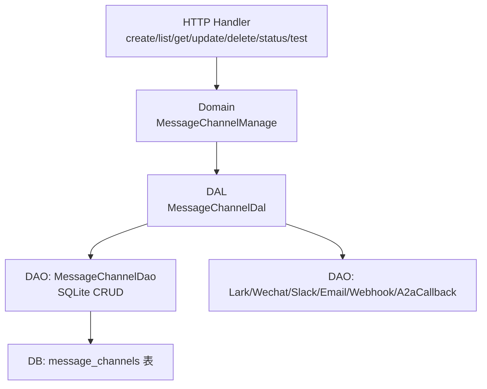
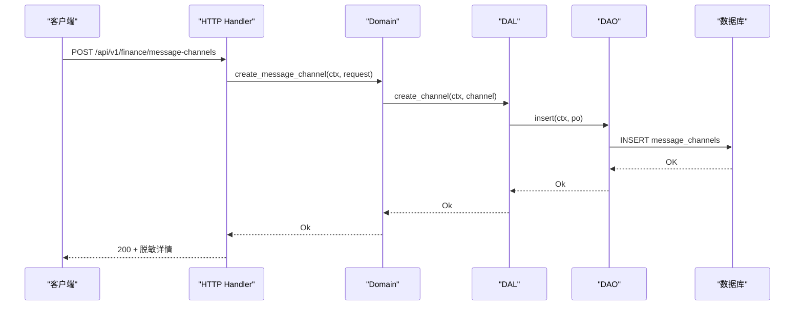
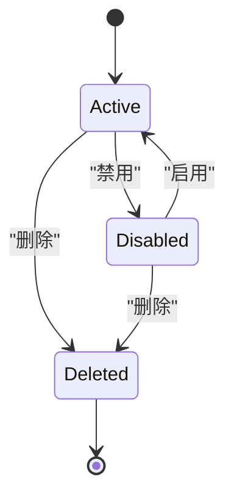
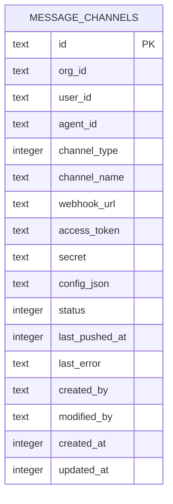
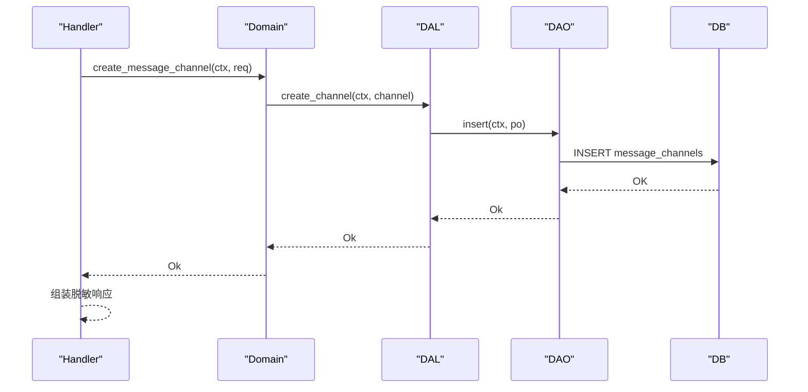
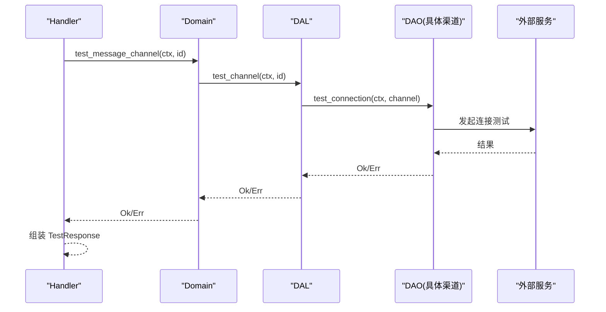
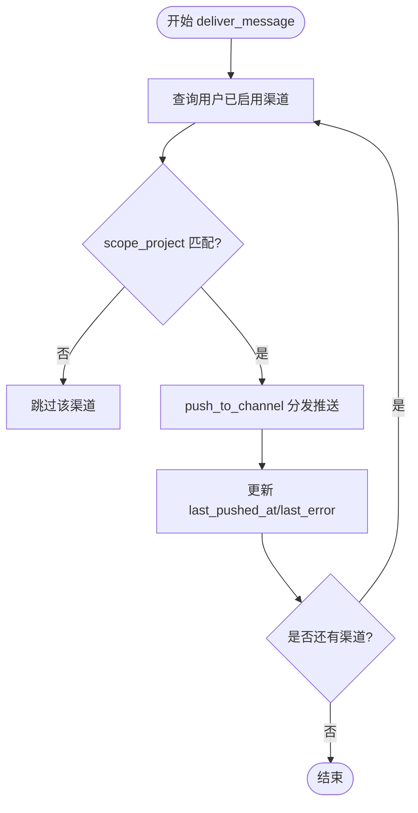
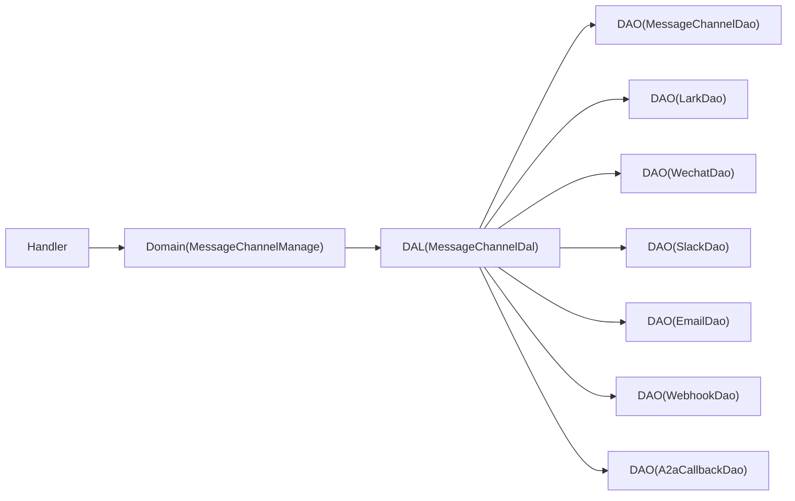

# 消息渠道管理 API

<cite>
**本文引用的文件**
- [common/src/api/message_channel.rs](common/src/api/message_channel.rs)
- [src/handlers/finance/message_channel/mod.rs](src/handlers/finance/message_channel/mod.rs)
- [src/handlers/finance/message_channel/create_message_channel.rs](src/handlers/finance/message_channel/create_message_channel.rs)
- [src/handlers/finance/message_channel/test_message_channel_connection.rs](src/handlers/finance/message_channel/test_message_channel_connection.rs)
- [src/service/domain/finance/message_channel.rs](src/service/domain/finance/message_channel.rs)
- [src/service/dal/message_channel.rs](src/service/dal/message_channel.rs)
- [src/service/dao/message_channel/mod.rs](src/service/dao/message_channel/mod.rs)
- [src/service/dao/message_channel/sqlite.rs](src/service/dao/message_channel/sqlite.rs)
- [src/models/message_channel.rs](src/models/message_channel.rs)
- [common/src/enums/message_channel.rs](common/src/enums/message_channel.rs)
- [migrations/20260508000000_message_channels.sql](migrations/20260508000000_message_channels.sql)
- [docs/message_channel_design.md](docs/message_channel_design.md)
</cite>

## 目录
1. [简介](#简介)
2. [项目结构](#项目结构)
3. [核心组件](#核心组件)
4. [架构总览](#架构总览)
5. [详细组件分析](#详细组件分析)
6. [依赖关系分析](#依赖关系分析)
7. [性能考虑](#性能考虑)
8. [故障排查指南](#故障排查指南)
9. [结论](#结论)
10. [附录](#附录)

## 简介
本文件为“消息渠道管理 API”的权威技术文档，覆盖渠道创建、配置、测试、状态管理等接口；说明多渠道支持（飞书、微信、Slack、邮件、Webhook、A2A 回调）、连接验证、故障转移、消息路由等能力；并提供渠道插件扩展方式、自定义渠道实现与批量操作建议。文档严格遵循四层单向调用：Adapter（HTTP Handler / 公开回调）→ Domain → DAL → DAO，禁止跨层调用与同层互调。

## 项目结构
消息渠道管理相关代码按职责分层组织：
- Adapter 层：HTTP Handler 负责参数解析、上下文校验、编排 Domain 并返回脱敏 DTO。
- Domain 层：Finance 域提供消息渠道管理能力入口（CRUD、查询、测试）。
- DAL 层：统一整合渠道配置管理与消息分发，内部通过纯 match 分发到各渠道 DAO。
- DAO 层：数据访问与具体渠道推送实现（SQLite 持久化 + 各渠道 HTTP/SMTP 推送）。

图表来源
- [src/handlers/finance/message_channel/mod.rs:1-22](src/handlers/finance/message_channel/mod.rs#L1-L22)
- [src/service/domain/finance/message_channel.rs:1-73](src/service/domain/finance/message_channel.rs#L1-L73)
- [src/service/dal/message_channel.rs:1-127](src/service/dal/message_channel.rs#L1-L127)
- [src/service/dao/message_channel/mod.rs:1-98](src/service/dao/message_channel/mod.rs#L1-L98)
- [migrations/20260508000000_message_channels.sql:1-31](migrations/20260508000000_message_channels.sql#L1-L31)

章节来源
- [src/handlers/finance/message_channel/mod.rs:1-22](src/handlers/finance/message_channel/mod.rs#L1-L22)
- [docs/message_channel_design.md:52-69](docs/message_channel_design.md#L52-L69)

## 核心组件
- 枚举与实体
  - ChannelType：定义支持的渠道类型（飞书、微信、Slack、邮件、Webhook、A2A 回调）。
  - ChannelStatus：渠道状态（已删除、活跃、已禁用），并在领域模型中提供状态迁移规则。
  - MessageChannelPo：持久化对象，包含渠道基础信息、敏感字段、扩展配置 JSON、推送状态等。
  - ChannelConfig：各渠道的详细配置（如 SMTP、Slack Token、Webhook 模板等）。
- 管理面 DTO
  - Create/Update/List/Query/Test/Status 请求与响应结构，统一在 common 共享给前后端。
- 分层能力
  - Domain：对外暴露 create/get/query/update/delete/test 等方法。
  - DAL：统一整合配置管理与消息分发，内部纯 match 分发到各渠道 DAO。
  - DAO：SQLite 持久化与具体渠道推送实现。

章节来源
- [common/src/enums/message_channel.rs:1-122](common/src/enums/message_channel.rs#L1-L122)
- [src/models/message_channel.rs:1-260](src/models/message_channel.rs#L1-L260)
- [common/src/api/message_channel.rs:1-315](common/src/api/message_channel.rs#L1-L315)
- [src/service/domain/finance/message_channel.rs:1-73](src/service/domain/finance/message_channel.rs#L1-L73)
- [src/service/dal/message_channel.rs:1-127](src/service/dal/message_channel.rs#L1-L127)
- [src/service/dao/message_channel/mod.rs:1-98](src/service/dao/message_channel/mod.rs#L1-L98)

## 架构总览
消息渠道管理采用严格分层与单向依赖：
- Handler 仅做参数解析、上下文校验、权限与归属校验、调用 Domain 并组装脱敏响应。
- Domain 封装业务规则（如状态迁移、查询组合），不感知 DAO 细节。
- DAL 聚合配置管理与消息分发，内部通过 channel_type 进行纯 match 分发到对应 DAO。
- DAO 负责 SQLite 持久化与各渠道外部系统交互（HTTP/SMTP）。

图表来源
- [src/handlers/finance/message_channel/create_message_channel.rs:1-79](src/handlers/finance/message_channel/create_message_channel.rs#L1-L79)
- [src/service/domain/finance/message_channel.rs:1-73](src/service/domain/finance/message_channel.rs#L1-L73)
- [src/service/dal/message_channel.rs:148-158](src/service/dal/message_channel.rs#L148-L158)
- [src/service/dao/message_channel/sqlite.rs:20-55](src/service/dao/message_channel/sqlite.rs#L20-L55)
- [migrations/20260508000000_message_channels.sql:5-23](migrations/20260508000000_message_channels.sql#L5-L23)

## 详细组件分析

### 渠道类型与状态
- 渠道类型：支持飞书、微信、Slack、邮件、Webhook、A2A 回调。新增类型需更新枚举与 DAL 分发逻辑。
- 渠道状态：Active/Disabled/Deleted，状态迁移规则内聚于领域模型，确保 Deleted 不可通过普通状态更新产生。

图表来源
- [common/src/enums/message_channel.rs:82-122](common/src/enums/message_channel.rs#L82-L122)
- [src/models/message_channel.rs:67-107](src/models/message_channel.rs#L67-L107)

章节来源
- [common/src/enums/message_channel.rs:1-122](common/src/enums/message_channel.rs#L1-L122)
- [src/models/message_channel.rs:19-113](src/models/message_channel.rs#L19-L113)

### 渠道配置与存储
- 配置结构：ChannelConfig 以 JSON 形式存储，包含飞书、微信、邮件、Slack、Webhook 等渠道专属字段。
- 持久化：message_channels 表记录渠道基础信息与推送状态，索引优化用户/组织/Agent/类型/状态查询。

图表来源
- [migrations/20260508000000_message_channels.sql:5-31](migrations/20260508000000_message_channels.sql#L5-L31)
- [src/models/message_channel.rs:115-155](src/models/message_channel.rs#L115-L155)

章节来源
- [src/models/message_channel.rs:197-255](src/models/message_channel.rs#L197-L255)
- [migrations/20260508000000_message_channels.sql:1-31](migrations/20260508000000_message_channels.sql#L1-L31)

### 管理面 API 清单
- 受保护路由（示例）：
  - POST /api/v1/finance/message-channels
  - GET /api/v1/finance/message-channels
  - GET /api/v1/finance/message-channels/{id}
  - PUT /api/v1/finance/message-channels/{id}
  - DELETE /api/v1/finance/message-channels/{id}
  - PUT /api/v1/finance/message-channels/{id}/status
  - POST /api/v1/finance/message-channels/{id}/test
- 行为要点：
  - 创建/更新时填充 ChannelConfig 并写入数据库。
  - 列表/查询支持多条件过滤与分页。
  - 状态更新走 /status，限制 Deleted 不可通过该接口产生。
  - 测试连接通过 Domain/DAL 分发到具体渠道 DAO 执行连通性检查。

章节来源
- [docs/message_channel_design.md:52-69](docs/message_channel_design.md#L52-L69)
- [src/handlers/finance/message_channel/mod.rs:1-22](src/handlers/finance/message_channel/mod.rs#L1-L22)
- [common/src/api/message_channel.rs:9-228](common/src/api/message_channel.rs#L9-L228)

### 创建渠道流程
- Handler 接收请求，构造 ChannelConfig 与 MessageChannelPo，调用 Domain.create_message_channel。
- Domain 委托 DAL.create_channel，DAL 调用 DAO.insert 持久化。
- 成功后返回脱敏详情。

图表来源
- [src/handlers/finance/message_channel/create_message_channel.rs:22-78](src/handlers/finance/message_channel/create_message_channel.rs#L22-L78)
- [src/service/domain/finance/message_channel.rs:14-20](src/service/domain/finance/message_channel.rs#L14-L20)
- [src/service/dal/message_channel.rs:148-150](src/service/dal/message_channel.rs#L148-L150)
- [src/service/dao/message_channel/sqlite.rs:20-55](src/service/dao/message_channel/sqlite.rs#L20-L55)

章节来源
- [src/handlers/finance/message_channel/create_message_channel.rs:1-79](src/handlers/finance/message_channel/create_message_channel.rs#L1-L79)
- [src/service/domain/finance/message_channel.rs:1-73](src/service/domain/finance/message_channel.rs#L1-L73)
- [src/service/dal/message_channel.rs:148-150](src/service/dal/message_channel.rs#L148-L150)
- [src/service/dao/message_channel/sqlite.rs:20-55](src/service/dao/message_channel/sqlite.rs#L20-L55)

### 测试渠道连接流程
- Handler 获取渠道并校验归属后，调用 Domain.test_message_channel。
- DAL 根据 channel_type 分发到对应 DAO.test_connection。
- 成功返回 success=true，失败返回错误信息。

图表来源
- [src/handlers/finance/message_channel/test_message_channel_connection.rs:17-56](src/handlers/finance/message_channel/test_message_channel_connection.rs#L17-L56)
- [src/service/domain/finance/message_channel.rs:63-71](src/service/domain/finance/message_channel.rs#L63-L71)
- [src/service/dal/message_channel.rs:202-222](src/service/dal/message_channel.rs#L202-L222)

章节来源
- [src/handlers/finance/message_channel/test_message_channel_connection.rs:1-57](src/handlers/finance/message_channel/test_message_channel_connection.rs#L1-L57)
- [src/service/dal/message_channel.rs:202-222](src/service/dal/message_channel.rs#L202-L222)

### 消息分发与路由（运行面）
- DAL.deliver_message 查询用户所有已启用渠道，按 scope_project 过滤后逐个推送。
- 内部 push_to_channel 使用纯 match 分发到各渠道 DAO。
- 推送结果更新渠道 last_pushed_at/last_error，并汇总 DeliveryResult。

图表来源
- [src/service/dal/message_channel.rs:226-284](src/service/dal/message_channel.rs#L226-L284)
- [src/service/dal/message_channel.rs:289-335](src/service/dal/message_channel.rs#L289-L335)

章节来源
- [src/service/dal/message_channel.rs:226-335](src/service/dal/message_channel.rs#L226-L335)

### 批量操作与查询
- 列表/查询：支持按用户、Agent、类型、状态、分页、排序等多条件组合查询。
- 批量状态更新：可通过多次调用 /status 或结合后端批处理接口实现。
- 注意：当前管理面未提供一次性批量更新多个渠道状态的专用接口，建议通过循环调用或后端批处理任务完成。

章节来源
- [src/service/dao/message_channel/mod.rs:11-36](src/service/dao/message_channel/mod.rs#L11-L36)
- [src/service/dao/message_channel/sqlite.rs:92-130](src/service/dao/message_channel/sqlite.rs#L92-L130)
- [common/src/api/message_channel.rs:82-128](common/src/api/message_channel.rs#L82-L128)

## 依赖关系分析
- Handler 依赖 Domain 暴露的管理方法，不直接访问 DAL/DAO。
- Domain 仅依赖 DAL 接口，屏蔽 DAO 细节。
- DAL 聚合多个 DAO（MessageChannelDao 与各渠道 DAO），内部通过 channel_type 进行纯 match 分发。
- DAO 依赖数据库与外部服务（HTTP/SMTP），无业务感知。

图表来源
- [src/service/dal/message_channel.rs:131-142](src/service/dal/message_channel.rs#L131-L142)
- [src/service/domain/finance/message_channel.rs:11-73](src/service/domain/finance/message_channel.rs#L11-L73)

章节来源
- [src/service/dal/message_channel.rs:131-142](src/service/dal/message_channel.rs#L131-L142)
- [src/service/domain/finance/message_channel.rs:11-73](src/service/domain/finance/message_channel.rs#L11-L73)

## 性能考虑
- 查询优化：DAO 使用 QueryBuilder 构建动态 SQL，支持排序与分页，减少不必要的数据传输。
- 推送隔离：deliver_message 对每个渠道独立推送并记录结果，单个渠道失败不影响其他渠道。
- 索引设计：message_channels 表针对 org_id、user_id、agent_id、channel_type、status 建立索引，提升筛选效率。
- 可扩展性：新增渠道只需在 DAL 的 match 中添加分支，编译期保证完整性。

章节来源
- [src/service/dao/message_channel/sqlite.rs:92-130](src/service/dao/message_channel/sqlite.rs#L92-L130)
- [migrations/20260508000000_message_channels.sql:25-31](migrations/20260508000000_message_channels.sql#L25-L31)
- [src/service/dal/message_channel.rs:289-313](src/service/dal/message_channel.rs#L289-L313)

## 故障排查指南
- 常见错误
  - 缺少组织/用户上下文：Handler 会返回 InvalidRequest 错误。
  - 渠道不存在：get/test 时会返回 NotFound。
  - 渠道状态非法：transition_status 会拒绝无效迁移（如从 Deleted 切换）。
  - 推送失败：DAL 捕获渠道 DAO 错误并记录 last_error，整体仍返回成功（聚合失败计数）。
- 定位步骤
  - 检查渠道是否存在且属于当前用户/组织。
  - 查看 last_error 与 last_pushed_at 判断最近一次推送结果。
  - 使用 /test 接口触发连接测试，观察返回 error 字段。
  - 若 Webhook 未实现，集成测试已覆盖 unsupported_operation 场景，后续实现后可将失败转为成功。

章节来源
- [src/handlers/finance/message_channel/test_message_channel_connection.rs:20-56](src/handlers/finance/message_channel/test_message_channel_connection.rs#L20-L56)
- [src/models/message_channel.rs:67-107](src/models/message_channel.rs#L67-L107)
- [src/service/dal/message_channel.rs:202-222](src/service/dal/message_channel.rs#L202-L222)
- [docs/message_channel_design.md:23-36](docs/message_channel_design.md#L23-L36)

## 结论
消息渠道管理 API 提供了完整的渠道生命周期管理能力，并通过严格的分层与纯 match 分发机制实现了多渠道支持与可扩展的消息路由。当前管理面已具备 CRUD、查询、状态管理与连接测试能力；运行面消息分发已具备框架与部分渠道实现，通用 Webhook 尚未完全实现但已有明确的失败聚合策略。后续可按需扩展新渠道类型与推送实现。

## 附录
- 渠道配置示例（字段说明）
  - 飞书：lark_app_id、lark_app_secret、lark_encrypt_key、lark_verification_token、lark_open_id、lark_user_name
  - 微信：wechat_app_id、wechat_app_secret、wechat_open_id
  - 邮件：email_smtp_host、email_smtp_port、email_username、email_password、email_from_address、email_to_address
  - Slack：slack_bot_token、slack_channel_id
  - Webhook：webhook_method、webhook_headers、webhook_body_template
- 高级特性
  - 渠道插件开发：新增渠道类型需在枚举与 DAL 分发处添加分支，并实现对应 DAO 的 push/test_connection。
  - 自定义渠道实现：遵循约定方法名 push() 与 test_connection()，无需 trait，保持简单直接。
  - 批量操作：通过循环调用 /status 或后端批处理任务完成批量状态更新。

章节来源
- [src/models/message_channel.rs:197-255](src/models/message_channel.rs#L197-L255)
- [src/service/dal/message_channel.rs:289-313](src/service/dal/message_channel.rs#L289-L313)
- [docs/message_channel_design.md:478-513](docs/message_channel_design.md#L478-L513)