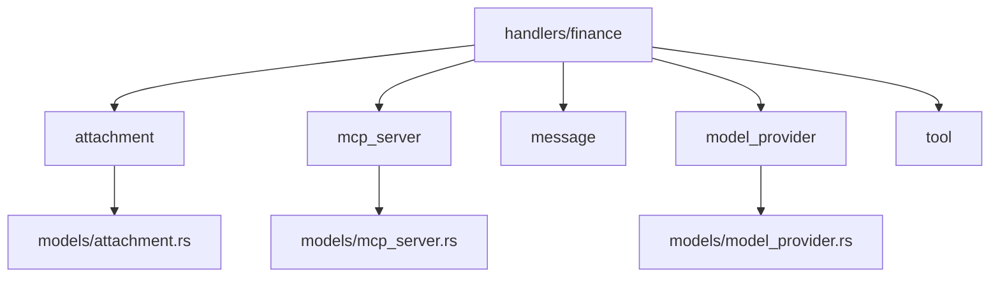
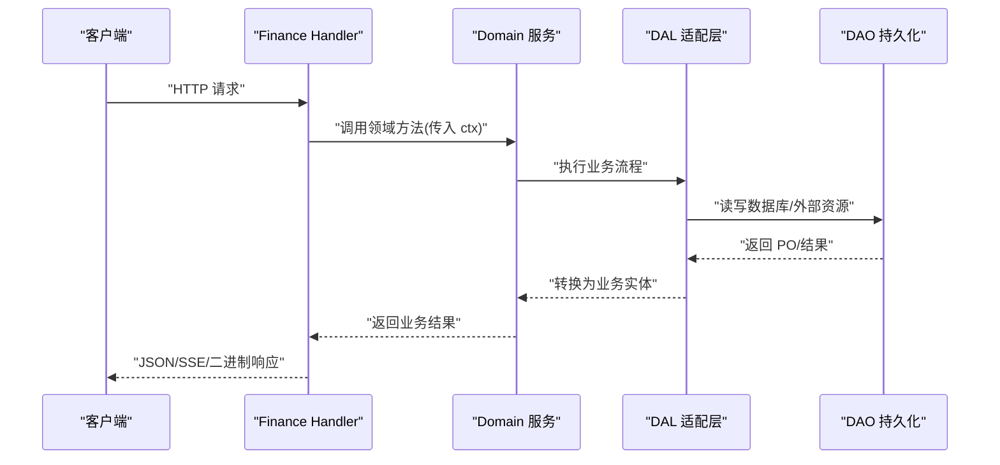
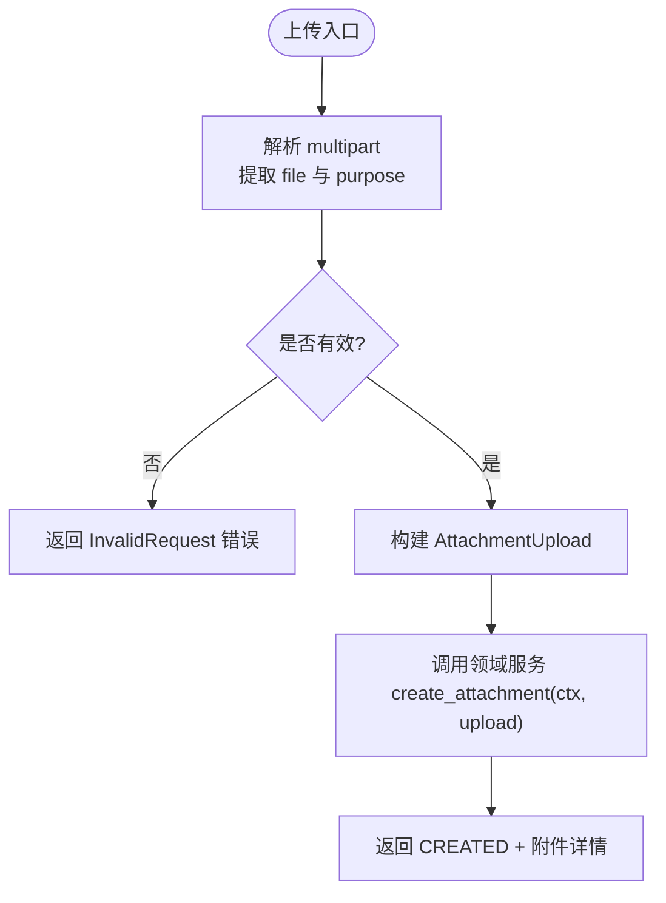
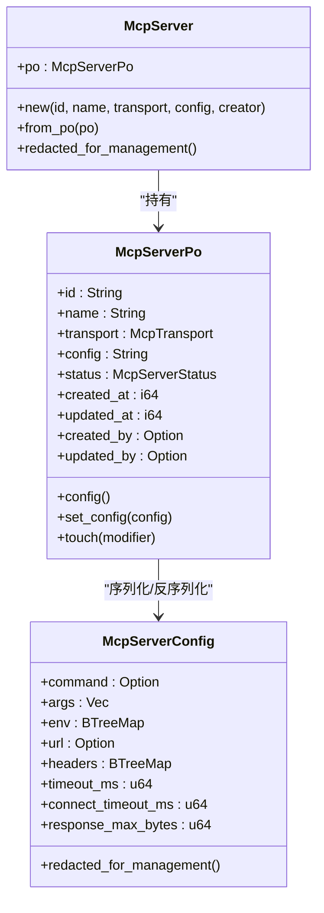
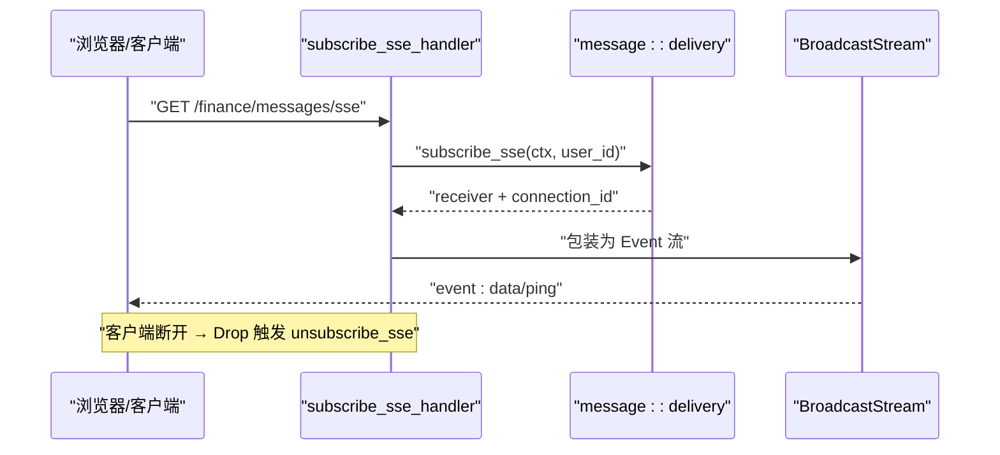
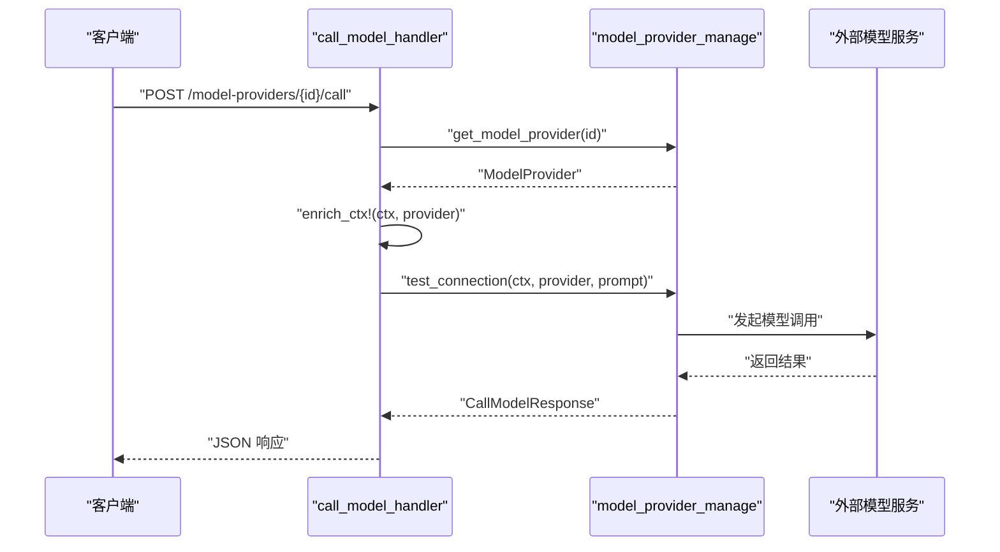
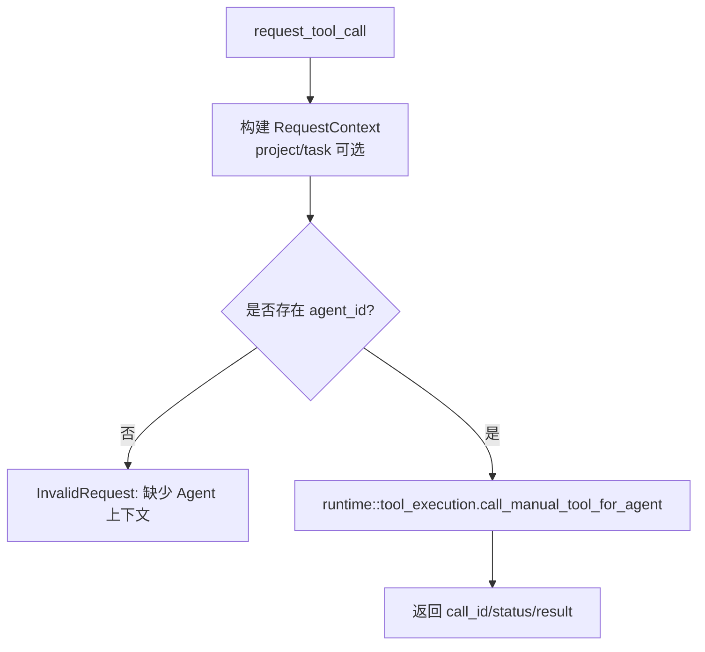
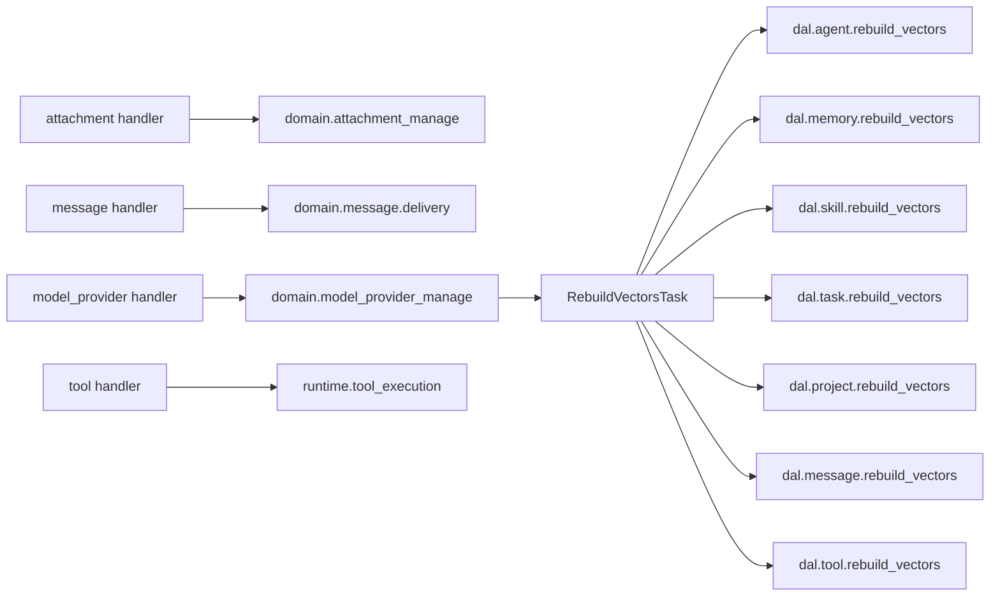

# 财务管理模块 API

<cite>
**本文引用的文件**
- [src/handlers/finance/mod.rs](src/handlers/finance/mod.rs)
- [src/handlers/finance/attachment/mod.rs](src/handlers/finance/attachment/mod.rs)
- [src/handlers/finance/attachment/upload_attachment.rs](src/handlers/finance/attachment/upload_attachment.rs)
- [src/handlers/finance/attachment/get_attachment_content.rs](src/handlers/finance/attachment/get_attachment_content.rs)
- [src/handlers/finance/mcp_server/mod.rs](src/handlers/finance/mcp_server/mod.rs)
- [src/handlers/finance/mcp_server/create_mcp_server.rs](src/handlers/finance/mcp_server/create_mcp_server.rs)
- [src/handlers/finance/message/mod.rs](src/handlers/finance/message/mod.rs)
- [src/handlers/finance/message/send_message.rs](src/handlers/finance/message/send_message.rs)
- [src/handlers/finance/message/subscribe_sse.rs](src/handlers/finance/message/subscribe_sse.rs)
- [src/handlers/finance/model_provider/mod.rs](src/handlers/finance/model_provider/mod.rs)
- [src/handlers/finance/model_provider/call_model.rs](src/handlers/finance/model_provider/call_model.rs)
- [src/handlers/finance/model_provider/rebuild_vectors_task.rs](src/handlers/finance/model_provider/rebuild_vectors_task.rs)
- [src/handlers/finance/tool/mod.rs](src/handlers/finance/tool/mod.rs)
- [src/handlers/finance/tool/request_tool_call.rs](src/handlers/finance/tool/request_tool_call.rs)
- [src/models/attachment.rs](src/models/attachment.rs)
- [src/models/mcp_server.rs](src/models/mcp_server.rs)
- [src/models/model_provider.rs](src/models/model_provider.rs)
</cite>

## 目录
1. [简介](#简介)
2. [项目结构](#项目结构)
3. [核心组件](#核心组件)
4. [架构总览](#架构总览)
5. [详细组件分析](#详细组件分析)
6. [依赖关系分析](#依赖关系分析)
7. [性能与扩展性](#性能与扩展性)
8. [故障排查指南](#故障排查指南)
9. [结论](#结论)
10. [附录：接口清单与使用示例](#附录接口清单与使用示例)

## 简介
本文件为 AI Orz 财务管理模块的 API 文档，覆盖以下能力：
- 附件管理：上传、下载、文本内容读取与更新、列表与删除
- MCP 服务器管理：创建、查询、更新、状态切换、工具同步
- 消息处理：发送消息、搜索消息、SSE 实时推送订阅
- 模型提供商管理：配置、测试连接、调用模型、向量索引重建任务
- 工具管理：手动工具同步调用、工具绑定/解绑、工具查询与调试

遵循四层单向调用：Adapter（HTTP Handler）→ Domain → DAL → DAO。Handler 仅做参数校验、上下文装配与响应封装；业务逻辑在 Domain/DAL/DAO 中实现。

## 项目结构
财务模块位于 handlers/finance，按领域子模块组织：
- attachment：附件上传、读取、更新、删除、列表
- mcp_server：MCP 服务器配置 CRUD 与状态管理
- message：消息发送、搜索、SSE 订阅
- model_provider：模型提供商 CRUD、连接测试、模型调用、向量重建任务
- tool：工具注册、查询、调试、手动调用、绑定到 Agent

图表来源
- [src/handlers/finance/mod.rs:1-15](src/handlers/finance/mod.rs#L1-L15)
- [src/handlers/finance/attachment/mod.rs:1-21](src/handlers/finance/attachment/mod.rs#L1-L21)
- [src/handlers/finance/mcp_server/mod.rs:1-24](src/handlers/finance/mcp_server/mod.rs#L1-L24)
- [src/handlers/finance/message/mod.rs:1-17](src/handlers/finance/message/mod.rs#L1-L17)
- [src/handlers/finance/model_provider/mod.rs:1-25](src/handlers/finance/model_provider/mod.rs#L1-L25)
- [src/handlers/finance/tool/mod.rs:1-46](src/handlers/finance/tool/mod.rs#L1-L46)

章节来源
- [src/handlers/finance/mod.rs:1-15](src/handlers/finance/mod.rs#L1-L15)

## 核心组件
- 附件管理
  - 上传：multipart 表单解析，持久化并返回附件元数据
  - 读取：按 ID 获取 UTF-8 文本内容与元信息
  - 更新：文本内容全量替换，支持可选乐观锁
  - 列表/删除：按用户维度管理附件资产
- MCP 服务器管理
  - 创建/更新/删除/查询：维护 stdio 或 streamable HTTP 传输配置
  - 状态切换：启用/禁用，影响工具发现与调用
- 消息处理
  - 发送消息：将文本消息投递至目标用户，支持上下文关联（项目/任务/回复）
  - SSE 订阅：基于 BroadcastStream 的实时推送，自动清理断开的连接
- 模型提供商管理
  - 配置与查询：存储提供商类型、模型名、能力、限流与配额等
  - 连接测试与调用：注入 RequestContext 后执行远程模型调用
  - 向量重建：后台任务遍历多实体重建向量索引，提供进度查询
- 工具管理
  - 手动工具同步调用：内部系统工具，立即返回结果
  - 工具绑定/解绑：将工具与 Agent 关联
  - 工具查询/调试：检索、标签、调试调用

章节来源
- [src/handlers/finance/attachment/upload_attachment.rs:17-82](src/handlers/finance/attachment/upload_attachment.rs#L17-L82)
- [src/handlers/finance/attachment/get_attachment_content.rs:12-37](src/handlers/finance/attachment/get_attachment_content.rs#L12-L37)
- [src/handlers/finance/mcp_server/create_mcp_server.rs:14-47](src/handlers/finance/mcp_server/create_mcp_server.rs#L14-L47)
- [src/handlers/finance/message/send_message.rs:9-40](src/handlers/finance/message/send_message.rs#L9-L40)
- [src/handlers/finance/message/subscribe_sse.rs:52-92](src/handlers/finance/message/subscribe_sse.rs#L52-L92)
- [src/handlers/finance/model_provider/call_model.rs:11-41](src/handlers/finance/model_provider/call_model.rs#L11-L41)
- [src/handlers/finance/model_provider/rebuild_vectors_task.rs:16-193](src/handlers/finance/model_provider/rebuild_vectors_task.rs#L16-L193)
- [src/handlers/finance/tool/request_tool_call.rs:11-53](src/handlers/finance/tool/request_tool_call.rs#L11-L53)

## 架构总览
财务模块遵循 Adapter → Domain → DAL → DAO 的单向调用链。Handler 通过 domain() 访问领域服务，DAL 负责跨层实体转换，DAO 负责持久化。

图表来源
- [src/handlers/finance/attachment/upload_attachment.rs:17-82](src/handlers/finance/attachment/upload_attachment.rs#L17-L82)
- [src/handlers/finance/message/subscribe_sse.rs:52-92](src/handlers/finance/message/subscribe_sse.rs#L52-L92)
- [src/handlers/finance/model_provider/call_model.rs:11-41](src/handlers/finance/model_provider/call_model.rs#L11-L41)

## 详细组件分析

### 附件管理
- 上传附件
  - 入口：POST /attachments/upload
  - 行为：解析 multipart，提取 file 与 purpose，构造 AttachmentUpload，调用领域服务创建附件，返回 CREATED 与详情
  - 错误：缺少用户上下文、表单解析失败、缺少 file 字段
- 读取附件内容
  - 入口：GET /api/v1/attachments/{id}/content
  - 行为：根据 ID 获取 UTF-8 文本内容与元信息，不存在返回 404
- 更新附件内容
  - 入口：PUT /api/v1/attachments/{id}/content
  - 行为：全量替换文本内容，支持可选 expected_updated_at 进行乐观锁控制
- 列表与删除
  - 入口：GET /attachments, DELETE /attachments/{id}
  - 行为：按用户维度列出或删除附件

图表来源
- [src/handlers/finance/attachment/upload_attachment.rs:17-82](src/handlers/finance/attachment/upload_attachment.rs#L17-L82)

章节来源
- [src/handlers/finance/attachment/upload_attachment.rs:17-82](src/handlers/finance/attachment/upload_attachment.rs#L17-L82)
- [src/handlers/finance/attachment/get_attachment_content.rs:12-37](src/handlers/finance/attachment/get_attachment_content.rs#L12-L37)
- [src/models/attachment.rs:9-186](src/models/attachment.rs#L9-L186)

### MCP 服务器管理
- 创建 MCP 服务器
  - 入口：POST /api/v1/finance/mcp-servers
  - 行为：构造 McpServer（含 transport 与 config），调用领域服务创建，返回脱敏后的详情
- 其他操作
  - 查询/更新/删除/状态切换：维护 stdio 或 streamable HTTP 配置，控制启用/禁用
- 安全注意
  - 配置中的敏感字段（env、headers、URL）在管理面展示时会被脱敏

图表来源
- [src/models/mcp_server.rs:17-322](src/models/mcp_server.rs#L17-L322)
- [src/handlers/finance/mcp_server/create_mcp_server.rs:14-47](src/handlers/finance/mcp_server/create_mcp_server.rs#L14-L47)

章节来源
- [src/handlers/finance/mcp_server/create_mcp_server.rs:14-47](src/handlers/finance/mcp_server/create_mcp_server.rs#L14-L47)
- [src/models/mcp_server.rs:17-322](src/models/mcp_server.rs#L17-L322)

### 消息处理
- 发送消息
  - 入口：POST /api/v1/messages
  - 行为：从 RequestContext 获取 from_agent_id，构造 SendToUserCommand，调用领域投递服务，返回消息 ID
- SSE 订阅
  - 入口：GET /api/v1/finance/messages/sse
  - 行为：从 JWT 获取用户 ID，订阅广播通道，返回 Sse Stream；客户端断开或服务关闭时自动注销连接，避免内存泄漏；每 15 秒发送 keep-alive
- 搜索消息
  - 入口：GET /api/v1/messages/search
  - 行为：基于全文/向量检索返回匹配消息

图表来源
- [src/handlers/finance/message/subscribe_sse.rs:52-92](src/handlers/finance/message/subscribe_sse.rs#L52-L92)
- [src/handlers/finance/message/send_message.rs:9-40](src/handlers/finance/message/send_message.rs#L9-L40)

章节来源
- [src/handlers/finance/message/send_message.rs:9-40](src/handlers/finance/message/send_message.rs#L9-L40)
- [src/handlers/finance/message/subscribe_sse.rs:52-92](src/handlers/finance/message/subscribe_sse.rs#L52-L92)

### 模型提供商管理
- 调用模型
  - 入口：POST /api/v1/model-providers/{id}/call
  - 行为：根据 id 获取 Provider，enrich_ctx 注入 provider 信息，调用 test_connection 生成文本补全，返回结果
- 连接测试
  - 入口：POST /api/v1/model-providers/{id}/test
  - 行为：验证配置与网络连通性
- 向量索引重建任务
  - 入口：POST /api/v1/model-providers/{id}/rebuild-vectors
  - 行为：创建 RebuildVectorsTask，独占运行，遍历 agent/memory/skill/task/project/message/tool 七类实体重建向量索引；提供进度查询接口
- 切换嵌入提供者
  - 入口：POST /api/v1/model-providers/{id}/switch-embedding
  - 行为：切换底层嵌入模型并触发重建

图表来源
- [src/handlers/finance/model_provider/call_model.rs:11-41](src/handlers/finance/model_provider/call_model.rs#L11-L41)
- [src/models/model_provider.rs:9-248](src/models/model_provider.rs#L9-L248)

章节来源
- [src/handlers/finance/model_provider/call_model.rs:11-41](src/handlers/finance/model_provider/call_model.rs#L11-L41)
- [src/handlers/finance/model_provider/rebuild_vectors_task.rs:16-193](src/handlers/finance/model_provider/rebuild_vectors_task.rs#L16-L193)
- [src/models/model_provider.rs:9-248](src/models/model_provider.rs#L9-L248)

### 工具管理
- 手动工具同步调用
  - 入口：POST /api/v1/tools/request-call
  - 行为：从 RequestContext 获取 agent_id，构造上下文（可选 project/task），调用 runtime::tool_execution.call_manual_tool_for_agent，立即返回 trace_ref.call_id、status、result
- 工具绑定/解绑
  - 入口：POST /tools/bind-to-agent, POST /tools/unbind-from-agent
  - 行为：将工具与 Agent 建立/解除关联
- 工具查询/调试
  - 入口：GET /tools, GET /tools/{id}, POST /tools/debug-call
  - 行为：检索工具、查看详情、调试调用以快速验证

图表来源
- [src/handlers/finance/tool/request_tool_call.rs:11-53](src/handlers/finance/tool/request_tool_call.rs#L11-L53)

章节来源
- [src/handlers/finance/tool/request_tool_call.rs:11-53](src/handlers/finance/tool/request_tool_call.rs#L11-L53)

## 依赖关系分析
- Handler 依赖领域服务 domain()，不直接访问 DAL/DAO
- 领域服务通过 DAL 统一对外暴露业务实体，PO 仅在 DAL/DAO 内部使用
- 向量重建任务依赖各 DAL 的 rebuild_vectors 方法，串行执行七个实体
- SSE 订阅依赖 tokio_stream::wrappers::BroadcastStream，确保事件分发与清理

图表来源
- [src/handlers/finance/model_provider/rebuild_vectors_task.rs:131-162](src/handlers/finance/model_provider/rebuild_vectors_task.rs#L131-L162)

章节来源
- [src/handlers/finance/model_provider/rebuild_vectors_task.rs:16-193](src/handlers/finance/model_provider/rebuild_vectors_task.rs#L16-L193)

## 性能与扩展性
- 向量重建任务
  - 并发保护：同一时刻仅允许一个 RebuildVectors 任务运行，避免资源竞争
  - 进度快照：current_step、total_steps、step_message、started_at、finished_at、error、result 提供完整可观测性
- SSE 实时推送
  - 自动清理：CleanupStream 在 Drop 时异步注销连接，防止内存泄漏
  - Keep-Alive：每 15 秒发送 ping，保持长连接活跃
- 模型调用
  - 上下文增强：通过 enrich_ctx! 注入 provider 信息，减少重复参数传递
  - 超时与限流：ModelProviderConfig 支持 rpm/tpm/daily_quota 等限制

[本节为通用指导，不直接分析具体文件]

## 故障排查指南
- 上传失败
  - 检查 multipart 字段是否正确包含 file 与 purpose
  - 确认用户上下文存在（uid 非空）
- 读取附件 404
  - 确认附件 ID 存在且属于当前用户
- SSE 连接不稳定
  - 检查 keep-alive 间隔与客户端 EventSource 配置
  - 关注服务端日志中连接注销与广播通道错误
- 向量重建冲突
  - 若返回“正在执行中”，等待现有任务完成后再提交新任务
- 模型调用失败
  - 检查 Provider 配置（base_url、api_key、能力）与网络连通性
  - 查看 test_connection 返回的错误信息

章节来源
- [src/handlers/finance/attachment/upload_attachment.rs:17-82](src/handlers/finance/attachment/upload_attachment.rs#L17-L82)
- [src/handlers/finance/message/subscribe_sse.rs:52-92](src/handlers/finance/message/subscribe_sse.rs#L52-L92)
- [src/handlers/finance/model_provider/rebuild_vectors_task.rs:108-120](src/handlers/finance/model_provider/rebuild_vectors_task.rs#L108-L120)
- [src/handlers/finance/model_provider/call_model.rs:11-41](src/handlers/finance/model_provider/call_model.rs#L11-L41)

## 结论
财务管理模块提供了完整的附件、MCP 服务器、消息、模型提供商与工具管理能力，采用清晰的四层架构与严格的单向依赖。通过 SSE 实时推送、后台向量重建任务、上下文增强与脱敏策略，满足高可用与安全合规要求。建议在生产环境结合监控与日志，关注向量重建任务进度与 SSE 连接健康度。

[本节为总结，不直接分析具体文件]

## 附录：接口清单与使用示例

### 附件管理
- 上传附件
  - 方法：POST
  - 路径：/attachments/upload
  - 请求体：multipart/form-data，字段 file、purpose
  - 响应：CREATED + ApiResponse<UploadAttachmentResponse>
  - 示例场景：用户上传知识库文档，用于后续检索与引用
- 读取附件内容
  - 方法：GET
  - 路径：/api/v1/attachments/{id}/content
  - 响应：AttachmentContentResponse（包含元信息与 UTF-8 文本）
  - 示例场景：前端展示附件文本内容
- 更新附件内容
  - 方法：PUT
  - 路径：/api/v1/attachments/{id}/content
  - 请求体：TextContentUpdate（content、expected_updated_at 可选）
  - 示例场景：版本迭代时全量替换文本，使用乐观锁避免覆盖冲突
- 列表与删除
  - 方法：GET /attachments, DELETE /attachments/{id}
  - 示例场景：管理员清理过期附件

章节来源
- [src/handlers/finance/attachment/upload_attachment.rs:17-82](src/handlers/finance/attachment/upload_attachment.rs#L17-L82)
- [src/handlers/finance/attachment/get_attachment_content.rs:12-37](src/handlers/finance/attachment/get_attachment_content.rs#L12-L37)
- [src/models/attachment.rs:9-186](src/models/attachment.rs#L9-L186)

### MCP 服务器管理
- 创建 MCP 服务器
  - 方法：POST
  - 路径：/api/v1/finance/mcp-servers
  - 请求体：CreateMcpServerRequest（name、transport、config）
  - 响应：CreateMcpServerResponse（脱敏后的详情）
  - 示例场景：接入外部工具服务，启用 stdio 或 streamable HTTP
- 查询/更新/删除/状态切换
  - 方法：GET/PUT/DELETE/PATCH
  - 路径：/api/v1/finance/mcp-servers/{id}
  - 示例场景：临时禁用某 MCP 服务器以进行维护

章节来源
- [src/handlers/finance/mcp_server/create_mcp_server.rs:14-47](src/handlers/finance/mcp_server/create_mcp_server.rs#L14-L47)
- [src/models/mcp_server.rs:17-322](src/models/mcp_server.rs#L17-L322)

### 消息处理
- 发送消息
  - 方法：POST
  - 路径：/api/v1/messages
  - 请求体：SendMessageParams（to_user_id、content、project_id、task_id、reply_to_id 可选）
  - 响应：SendMessageResponse（message_id）
  - 示例场景：Agent 向用户发送通知或回复
- SSE 订阅
  - 方法：GET
  - 路径：/api/v1/finance/messages/sse
  - 响应：SSE 流（data/ping）
  - 示例场景：前端实时接收消息推送
- 搜索消息
  - 方法：GET
  - 路径：/api/v1/messages/search
  - 响应：匹配的消息列表
  - 示例场景：按关键词检索历史对话

章节来源
- [src/handlers/finance/message/send_message.rs:9-40](src/handlers/finance/message/send_message.rs#L9-L40)
- [src/handlers/finance/message/subscribe_sse.rs:52-92](src/handlers/finance/message/subscribe_sse.rs#L52-L92)

### 模型提供商管理
- 调用模型
  - 方法：POST
  - 路径：/api/v1/model-providers/{id}/call
  - 请求体：CallModelRequest（prompt）
  - 响应：CallModelResponse（result）
  - 示例场景：根据提示词生成文本补全
- 连接测试
  - 方法：POST
  - 路径：/api/v1/model-providers/{id}/test
  - 响应：连通性结果
  - 示例场景：部署前验证配置正确性
- 向量重建任务
  - 方法：POST
  - 路径：/api/v1/model-providers/{id}/rebuild-vectors
  - 响应：任务 ID，后续通过进度接口查询
  - 示例场景：切换嵌入模型后重建所有实体向量索引
- 切换嵌入提供者
  - 方法：POST
  - 路径：/api/v1/model-providers/{id}/switch-embedding
  - 响应：切换结果
  - 示例场景：更换底层嵌入模型以提升检索质量

章节来源
- [src/handlers/finance/model_provider/call_model.rs:11-41](src/handlers/finance/model_provider/call_model.rs#L11-L41)
- [src/handlers/finance/model_provider/rebuild_vectors_task.rs:16-193](src/handlers/finance/model_provider/rebuild_vectors_task.rs#L16-L193)
- [src/models/model_provider.rs:9-248](src/models/model_provider.rs#L9-L248)

### 工具管理
- 手动工具同步调用
  - 方法：POST
  - 路径：/api/v1/tools/request-call
  - 请求体：RequestToolCallParams（tool_id、params、project_id、task_id 可选）
  - 响应：RequestToolCallResponse（call_id、status、result）
  - 示例场景：快速执行轻量工具并立即获得结果
- 工具绑定/解绑
  - 方法：POST
  - 路径：/tools/bind-to-agent, /tools/unbind-from-agent
  - 示例场景：为特定 Agent 启用/停用工具
- 工具查询/调试
  - 方法：GET/POST
  - 路径：/tools, /tools/{id}, /tools/debug-call
  - 示例场景：检索工具、查看详情、调试调用以验证行为

章节来源
- [src/handlers/finance/tool/request_tool_call.rs:11-53](src/handlers/finance/tool/request_tool_call.rs#L11-L53)