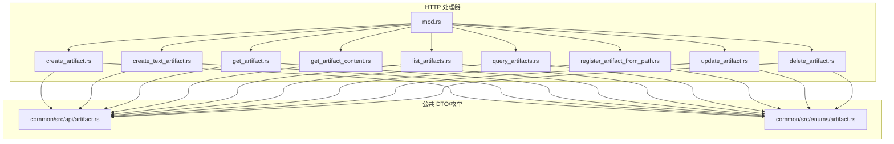
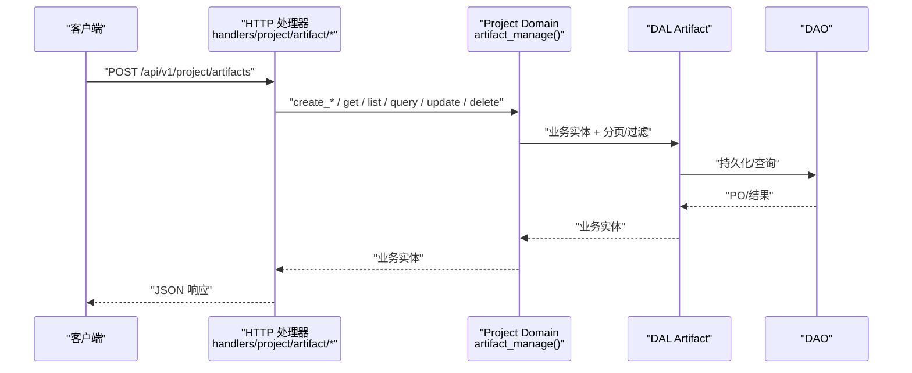
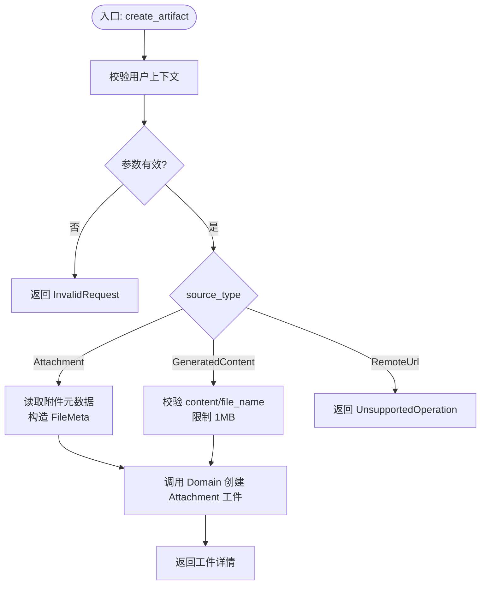
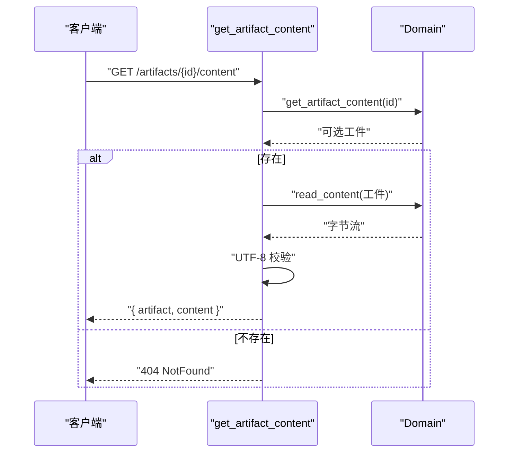
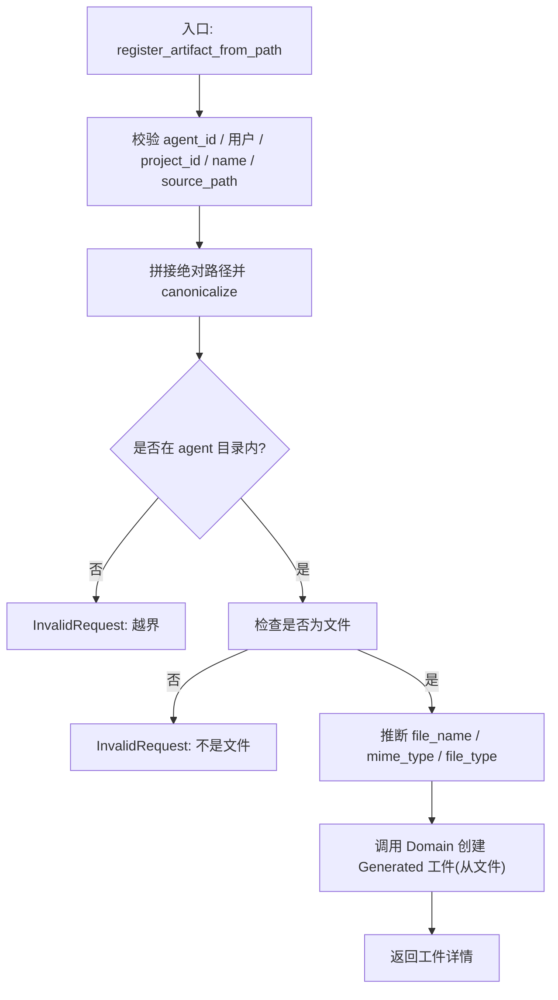
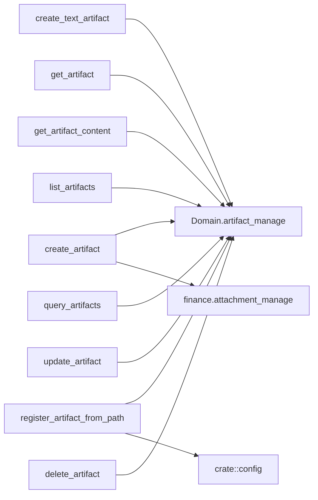

# 工件管理接口

<cite>
**本文引用的文件**
- [common/src/api/artifact.rs](common/src/api/artifact.rs)
- [common/src/enums/artifact.rs](common/src/enums/artifact.rs)
- [src/handlers/project/artifact/mod.rs](src/handlers/project/artifact/mod.rs)
- [src/handlers/project/artifact/create_artifact.rs](src/handlers/project/artifact/create_artifact.rs)
- [src/handlers/project/artifact/create_text_artifact.rs](src/handlers/project/artifact/create_text_artifact.rs)
- [src/handlers/project/artifact/get_artifact.rs](src/handlers/project/artifact/get_artifact.rs)
- [src/handlers/project/artifact/get_artifact_content.rs](src/handlers/project/artifact/get_artifact_content.rs)
- [src/handlers/project/artifact/list_artifacts.rs](src/handlers/project/artifact/list_artifacts.rs)
- [src/handlers/project/artifact/query_artifacts.rs](src/handlers/project/artifact/query_artifacts.rs)
- [src/handlers/project/artifact/register_artifact_from_path.rs](src/handlers/project/artifact/register_artifact_from_path.rs)
- [src/handlers/project/artifact/update_artifact.rs](src/handlers/project/artifact/update_artifact.rs)
- [src/handlers/project/artifact/delete_artifact.rs](src/handlers/project/artifact/delete_artifact.rs)
</cite>

## 目录
1. [简介](#简介)
2. [项目结构](#项目结构)
3. [核心组件](#核心组件)
4. [架构总览](#架构总览)
5. [详细组件分析](#详细组件分析)
6. [依赖分析](#依赖分析)
7. [性能考虑](#性能考虑)
8. [故障排查指南](#故障排查指南)
9. [结论](#结论)
10. [附录：完整示例与最佳实践](#附录：完整示例与最佳实践)

## 简介
本文件为项目管理模块的“工件（Artifact）”管理接口提供完整文档，覆盖创建、获取、内容访问、列表查询、更新、删除等能力。重点说明支持的工件类型（文本、文件等）、MIME 类型处理、内容存储机制，以及从路径注册工件、文本工件创建、内容检索等典型流程。同时给出端到端操作示例与版本管理建议，帮助开发者快速集成并安全使用。

## 项目结构
工件管理的 HTTP 处理器按方法粒度拆分，统一在 handlers/project/artifact 目录下组织，并通过 mod.rs 暴露各 handler。DTO 与枚举定义位于 common 层，供前后端共享。

图表来源
- [src/handlers/project/artifact/mod.rs:1-24](src/handlers/project/artifact/mod.rs#L1-L24)
- [common/src/api/artifact.rs:1-269](common/src/api/artifact.rs#L1-L269)
- [common/src/enums/artifact.rs:1-62](common/src/enums/artifact.rs#L1-L62)

章节来源
- [src/handlers/project/artifact/mod.rs:1-24](src/handlers/project/artifact/mod.rs#L1-L24)
- [common/src/api/artifact.rs:1-269](common/src/api/artifact.rs#L1-L269)
- [common/src/enums/artifact.rs:1-62](common/src/enums/artifact.rs#L1-L62)

## 核心组件
- 请求/响应模型：CreateArtifactRequest、GetArtifactRequest、DeleteArtifactRequest、ListArtifactsRequest、ArtifactQueryRequest、UpdateArtifactRequest、GetArtifactContentRequest 及其对应响应类型，定义于 common/src/api/artifact.rs。
- 工件来源类型：ArtifactSourceType（Attachment、GeneratedContent、RemoteUrl），定义于 common/src/enums/artifact.rs。
- HTTP 处理器：每个 CRUD 与扩展能力独立文件，遵循四层单向调用（Adapter → Domain → DAL → DAO）。

章节来源
- [common/src/api/artifact.rs:1-269](common/src/api/artifact.rs#L1-L269)
- [common/src/enums/artifact.rs:1-62](common/src/enums/artifact.rs#L1-L62)

## 架构总览
工件管理遵循严格四层单向调用：Adapter（HTTP Handler）→ Domain → DAL → DAO。Domain 对外以业务实体和内部事件交互；DAL 使用业务实体；DAO 内部使用 PO。所有 service 层公共方法首参为 ctx: RequestContext，跨层传递使用 ctx.clone()。

图表来源
- [src/handlers/project/artifact/create_artifact.rs:1-146](src/handlers/project/artifact/create_artifact.rs#L1-L146)
- [src/handlers/project/artifact/get_artifact.rs:1-32](src/handlers/project/artifact/get_artifact.rs#L1-L32)
- [src/handlers/project/artifact/list_artifacts.rs:1-52](src/handlers/project/artifact/list_artifacts.rs#L1-L52)
- [src/handlers/project/artifact/query_artifacts.rs:1-43](src/handlers/project/artifact/query_artifacts.rs#L1-L43)
- [src/handlers/project/artifact/update_artifact.rs:1-54](src/handlers/project/artifact/update_artifact.rs#L1-L54)
- [src/handlers/project/artifact/delete_artifact.rs:1-36](src/handlers/project/artifact/delete_artifact.rs#L1-L36)

## 详细组件分析

### 创建工件（通用）
- 功能：支持从现有财务附件引用或生成文本内容创建工件；预留 RemoteUrl 扩展。
- 关键校验：project_id/name 非空；Attachment 模式禁止携带 content/file_name/mime_type；GeneratedContent 模式必须提供 content 与 file_name，且文本大小限制为 1MB。
- MIME/类型：Attachment 模式复用附件的 MIME 与 FileType；GeneratedContent 模式默认 text/plain 与 Document。
- 返回：工件详情。

图表来源
- [src/handlers/project/artifact/create_artifact.rs:1-146](src/handlers/project/artifact/create_artifact.rs#L1-L146)
- [common/src/api/artifact.rs:9-45](common/src/api/artifact.rs#L9-L45)
- [common/src/enums/artifact.rs:8-26](common/src/enums/artifact.rs#L8-L26)

章节来源
- [src/handlers/project/artifact/create_artifact.rs:1-146](src/handlers/project/artifact/create_artifact.rs#L1-L146)
- [common/src/api/artifact.rs:9-45](common/src/api/artifact.rs#L9-L45)
- [common/src/enums/artifact.rs:8-26](common/src/enums/artifact.rs#L8-L26)

### 创建文本工件（专用工具）
- 功能：Agent 直接提供文本内容，一步完成文件写入与工件元数据注册。
- 约束：content 最大 1MB；未指定时 file_name 默认 name.md，mime_type 默认 text/plain，file_type 默认 Document。
- 返回：工件详情。

章节来源
- [src/handlers/project/artifact/create_text_artifact.rs:1-69](src/handlers/project/artifact/create_text_artifact.rs#L1-L69)
- [common/src/api/artifact.rs:218-242](common/src/api/artifact.rs#L218-L242)

### 获取工件详情
- 功能：根据 ID 获取工件元数据。
- 行为：不存在则返回 404。
- 返回：工件详情。

章节来源
- [src/handlers/project/artifact/get_artifact.rs:1-32](src/handlers/project/artifact/get_artifact.rs#L1-L32)
- [common/src/api/artifact.rs:50-59](common/src/api/artifact.rs#L50-L59)

### 获取工件文本内容
- 功能：针对 source_type = GeneratedContent 的工件，返回 UTF-8 文本内容与基础元信息。
- 行为：若工件不存在或无内容返回 404；若非 UTF-8 文本返回 InvalidRequest。
- 返回：包含工件详情与文本内容的响应。

图表来源
- [src/handlers/project/artifact/get_artifact_content.rs:1-68](src/handlers/project/artifact/get_artifact_content.rs#L1-L68)
- [common/src/api/artifact.rs:161-193](common/src/api/artifact.rs#L161-L193)

章节来源
- [src/handlers/project/artifact/get_artifact_content.rs:1-68](src/handlers/project/artifact/get_artifact_content.rs#L1-L68)
- [common/src/api/artifact.rs:161-193](common/src/api/artifact.rs#L161-L193)

### 列出工件（按项目）
- 功能：按项目维度列出工件，支持 task_id、file_type、source_type 过滤与分页。
- 限制：limit 上限默认 100。
- 返回：分页后的工件详情列表。

章节来源
- [src/handlers/project/artifact/list_artifacts.rs:1-52](src/handlers/project/artifact/list_artifacts.rs#L1-L52)
- [common/src/api/artifact.rs:76-122](common/src/api/artifact.rs#L76-L122)

### 通用查询工件
- 功能：POST body 的完整查询能力，支持跨项目查询、多条件组合与分页。
- 返回：分页后的工件详情列表。

章节来源
- [src/handlers/project/artifact/query_artifacts.rs:1-43](src/handlers/project/artifact/query_artifacts.rs#L1-L43)
- [common/src/api/artifact.rs:99-119](common/src/api/artifact.rs#L99-L119)

### 从路径注册工件
- 功能：将 Agent 目录下的已有文件复制至工件存储，并注册元数据；源文件保留。
- 安全：强制 canonicalize 校验 source_path 必须在 agent 目录之下；仅允许文件。
- 推断：未指定 file_name 时取 basename；未指定 mime_type 时按文件名推断；未指定 file_type 时按 mime_type 推断。
- 返回：工件详情。

图表来源
- [src/handlers/project/artifact/register_artifact_from_path.rs:1-108](src/handlers/project/artifact/register_artifact_from_path.rs#L1-L108)
- [common/src/api/artifact.rs:244-268](common/src/api/artifact.rs#L244-L268)

章节来源
- [src/handlers/project/artifact/register_artifact_from_path.rs:1-108](src/handlers/project/artifact/register_artifact_from_path.rs#L1-L108)
- [common/src/api/artifact.rs:244-268](common/src/api/artifact.rs#L244-L268)

### 更新工件
- 功能：部分更新内容或元数据（name/description/tags），仅对 GeneratedContent 工件可更新内容。
- 乐观锁：支持 expected_updated_at，不匹配返回 409 Conflict。
- 限制：内容更新同样受 1MB 限制。
- 返回：更新后的工件详情。

章节来源
- [src/handlers/project/artifact/update_artifact.rs:1-54](src/handlers/project/artifact/update_artifact.rs#L1-L54)
- [common/src/api/artifact.rs:195-216](common/src/api/artifact.rs#L195-L216)

### 删除工件
- 功能：根据 ID 删除工件。
- 行为：不存在返回 404。
- 返回：成功标志。

章节来源
- [src/handlers/project/artifact/delete_artifact.rs:1-36](src/handlers/project/artifact/delete_artifact.rs#L1-L36)
- [common/src/api/artifact.rs:61-74](common/src/api/artifact.rs#L61-L74)

## 依赖分析
- 处理器依赖：
  - 公共 DTO/枚举：common/src/api/artifact.rs、common/src/enums/artifact.rs
  - Domain：通过 crate::service::domain::project::artifact_manage() 调用
  - 配置：register_artifact_from_path 中通过 crate::config 获取 agent_data_dir
- 耦合关系：
  - 处理器与 Domain 解耦良好，职责单一
  - 文本内容大小限制在各处理器中重复校验，便于独立演进
- 外部依赖：
  - 文件系统访问（路径注册）
  - 附件服务（创建工件时读取附件元数据）

图表来源
- [src/handlers/project/artifact/create_artifact.rs:1-146](src/handlers/project/artifact/create_artifact.rs#L1-L146)
- [src/handlers/project/artifact/register_artifact_from_path.rs:1-108](src/handlers/project/artifact/register_artifact_from_path.rs#L1-L108)

章节来源
- [src/handlers/project/artifact/create_artifact.rs:1-146](src/handlers/project/artifact/create_artifact.rs#L1-L146)
- [src/handlers/project/artifact/register_artifact_from_path.rs:1-108](src/handlers/project/artifact/register_artifact_from_path.rs#L1-L108)

## 性能考虑
- 文本内容限制：创建与更新均限制 1MB，避免大对象传输与存储压力。
- 列表分页：list_artifacts 默认 limit 上限 100，防止全表扫描。
- 内容读取：get_artifact_content 仅在需要时读取文件内容，减少不必要 IO。
- 路径注册：先 canonicalize 再判断，避免额外解析开销；仅复制一次到工件存储。

## 故障排查指南
- 404 Not Found：
  - 获取/删除工件时 ID 不存在
  - 获取内容时工件不存在或无内容
- InvalidRequest：
  - 缺少必要字段（project_id、name、content/file_name 等）
  - 文本内容超过 1MB
  - 路径注册时 source_path 越界或非文件
  - 内容非 UTF-8 文本
- UnsupportedOperation：
  - 使用 RemoteUrl 类型创建工件（当前未启用）
- 409 Conflict：
  - 更新工件时 optimistic locking 失败（expected_updated_at 不匹配）

章节来源
- [src/handlers/project/artifact/create_artifact.rs:1-146](src/handlers/project/artifact/create_artifact.rs#L1-L146)
- [src/handlers/project/artifact/create_text_artifact.rs:1-69](src/handlers/project/artifact/create_text_artifact.rs#L1-L69)
- [src/handlers/project/artifact/get_artifact_content.rs:1-68](src/handlers/project/artifact/get_artifact_content.rs#L1-L68)
- [src/handlers/project/artifact/register_artifact_from_path.rs:1-108](src/handlers/project/artifact/register_artifact_from_path.rs#L1-L108)
- [src/handlers/project/artifact/update_artifact.rs:1-54](src/handlers/project/artifact/update_artifact.rs#L1-L54)

## 结论
工件管理接口提供了完整的生命周期管理能力，涵盖多种来源类型与内容访问方式。通过严格的参数校验、MIME/类型推断与安全路径控制，确保数据一致性与安全性。结合分页与通用查询，满足复杂检索场景。建议在业务侧结合乐观锁与版本号进行并发更新控制，并在前端合理展示工件类型与内容预览。

## 附录：完整示例与最佳实践

### 支持的工件类型与来源
- Attachment：引用现有财务附件，复用其 MIME 与 FileType。
- GeneratedContent：由 Agent/运行时生成的文本内容，默认 text/plain 与 Document。
- RemoteUrl：预留扩展，当前未启用。

章节来源
- [common/src/enums/artifact.rs:8-26](common/src/enums/artifact.rs#L8-L26)
- [src/handlers/project/artifact/create_artifact.rs:37-50](src/handlers/project/artifact/create_artifact.rs#L37-L50)

### 典型操作流程示例
- 从路径注册工件
  - 步骤：准备 Agent 目录下的源文件 → 调用 register_artifact_from_path → 自动推断 MIME/类型 → 复制到工件存储 → 返回工件详情
  - 注意：source_path 必须在 agent 目录内；仅支持文件
- 创建文本工件
  - 步骤：准备文本内容（≤1MB）→ 调用 create_text_artifact → 可选指定 file_name/mime_type/file_type → 返回工件详情
- 获取工件内容
  - 步骤：调用 get_artifact_content → 服务端读取并校验 UTF-8 → 返回 { artifact, content }
- 列表与查询
  - 步骤：list_artifacts 按项目过滤；query_artifacts 支持跨项目与更丰富条件
- 更新与删除
  - 步骤：update_artifact 支持部分更新与乐观锁；delete_artifact 删除后不可恢复

章节来源
- [src/handlers/project/artifact/register_artifact_from_path.rs:1-108](src/handlers/project/artifact/register_artifact_from_path.rs#L1-L108)
- [src/handlers/project/artifact/create_text_artifact.rs:1-69](src/handlers/project/artifact/create_text_artifact.rs#L1-L69)
- [src/handlers/project/artifact/get_artifact_content.rs:1-68](src/handlers/project/artifact/get_artifact_content.rs#L1-L68)
- [src/handlers/project/artifact/list_artifacts.rs:1-52](src/handlers/project/artifact/list_artifacts.rs#L1-L52)
- [src/handlers/project/artifact/query_artifacts.rs:1-43](src/handlers/project/artifact/query_artifacts.rs#L1-L43)
- [src/handlers/project/artifact/update_artifact.rs:1-54](src/handlers/project/artifact/update_artifact.rs#L1-L54)
- [src/handlers/project/artifact/delete_artifact.rs:1-36](src/handlers/project/artifact/delete_artifact.rs#L1-L36)

### 版本管理与并发更新建议
- 使用 UpdateArtifactRequest.expected_updated_at 实现乐观锁，避免覆盖冲突。
- 前端在编辑前获取工件详情中的 updated_at，提交时携带该值；若返回 409，提示用户刷新并重试。
- 对于重要工件，可在业务层引入显式版本号字段（如 version 整数），在 Domain/DAL 层配合更新逻辑实现更强一致性。

章节来源
- [common/src/api/artifact.rs:195-216](common/src/api/artifact.rs#L195-L216)
- [src/handlers/project/artifact/update_artifact.rs:21-54](src/handlers/project/artifact/update_artifact.rs#L21-L54)