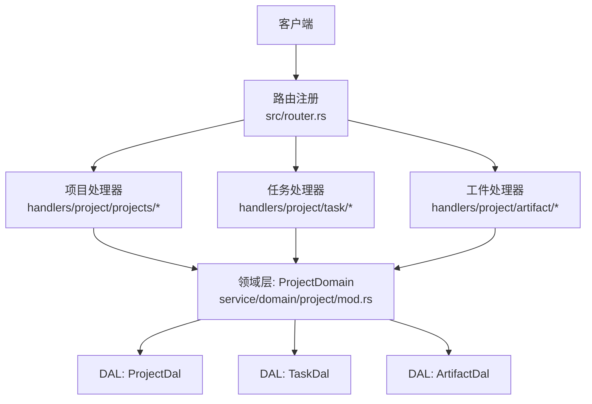
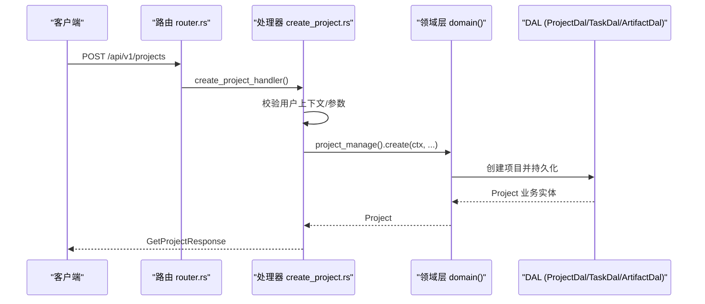
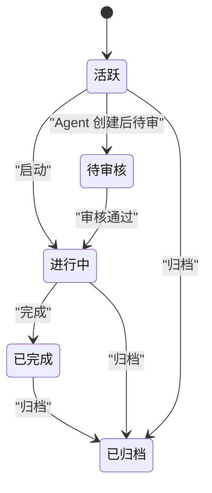
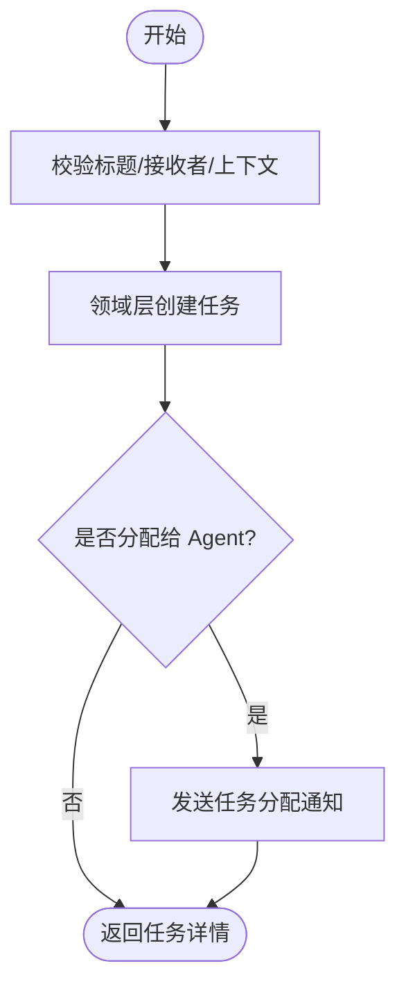
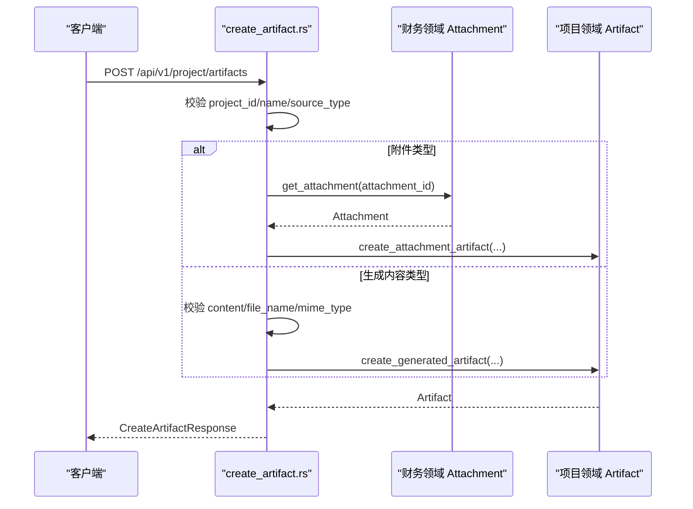
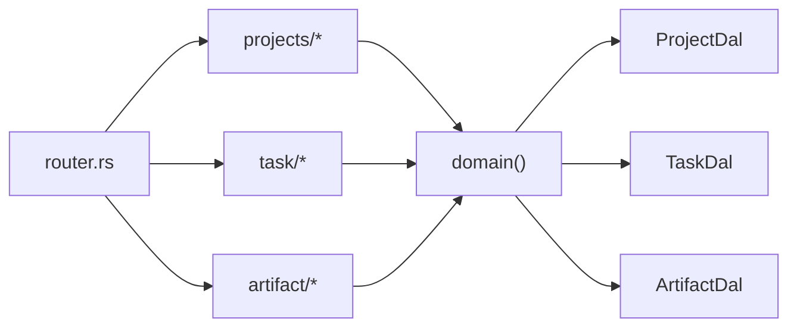

# 项目管理模块 API

<cite>
**本文引用的文件**
- [router.rs](src/router.rs)
- [project.rs](common/src/api/project.rs)
- [mod.rs（项目处理器入口）](src/handlers/project/mod.rs)
- [projects/mod.rs](src/handlers/project/projects/mod.rs)
- [create_project.rs](src/handlers/project/projects/create_project.rs)
- [task/mod.rs](src/handlers/project/task/mod.rs)
- [create_task.rs](src/handlers/project/task/create_task.rs)
- [artifact/mod.rs](src/handlers/project/artifact/mod.rs)
- [create_artifact.rs](src/handlers/project/artifact/create_artifact.rs)
- [mod.rs（领域层入口）](src/service/domain/project/mod.rs)
- [project.rs（领域模型）](src/models/project.rs)
- [project.rs（状态枚举）](common/src/enums/project.rs)
- [task.rs（任务枚举）](common/src/enums/task.rs)
</cite>

## 目录
1. [简介](#简介)
2. [项目结构](#项目结构)
3. [核心组件](#核心组件)
4. [架构总览](#架构总览)
5. [详细组件分析](#详细组件分析)
6. [依赖关系分析](#依赖关系分析)
7. [性能考虑](#性能考虑)
8. [故障排查指南](#故障排查指南)
9. [结论](#结论)
10. [附录：API 参考与示例](#附录api-参考与示例)

## 简介
本文件为 AI Orz 项目管理模块的 API 文档，覆盖项目 CRUD、任务管理、工件（Artifact）管理等接口。重点说明项目生命周期、任务状态流转、进度跟踪、协作通知、复杂查询条件、关联数据加载与批量操作等能力，并提供创建项目、分配任务、更新进度的完整调用示例路径。

## 项目结构
项目管理相关代码遵循严格四层单向调用：Adapter（HTTP Handler / AOP Producer）→ Domain → DAL → DAO。Handler 仅做参数校验与透传；Domain 组合 DAL 完成业务编排；DAL/DAO 负责持久化与数据访问。

图表来源
- [router.rs:145-240](src/router.rs#L145-L240)
- [mod.rs（领域层入口）:91-105](src/service/domain/project/mod.rs#L91-L105)

章节来源
- [router.rs:145-240](src/router.rs#L145-L240)
- [mod.rs（项目处理器入口）:1-6](src/handlers/project/mod.rs#L1-L6)

## 核心组件
- 项目领域（ProjectDomain）：聚合项目管理、任务管理、工件管理能力，对外暴露统一 trait 与单例访问。
- 领域模型（Project/Task/Artifact）：业务实体封装 PO，提供状态变更、摘要生成、进度汇总等方法。
- HTTP 处理器：按方法粒度拆分，职责单一，只做入参校验、上下文注入与调用领域层。
- 路由：集中注册受保护的项目、任务、工件接口，统一 JWT 认证与请求上下文中间件。

章节来源
- [mod.rs（领域层入口）:61-105](src/service/domain/project/mod.rs#L61-L105)
- [project.rs（领域模型）:60-80](src/models/project.rs#L60-L80)
- [create_project.rs:10-46](src/handlers/project/projects/create_project.rs#L10-L46)
- [create_task.rs:12-85](src/handlers/project/task/create_task.rs#L12-L85)
- [create_artifact.rs:13-53](src/handlers/project/artifact/create_artifact.rs#L13-L53)

## 架构总览
下图展示从 HTTP 请求到领域层的调用链，以及领域层对 DAL 的组合使用方式。

图表来源
- [router.rs:145-175](src/router.rs#L145-L175)
- [create_project.rs:22-46](src/handlers/project/projects/create_project.rs#L22-L46)
- [mod.rs（领域层入口）:111-129](src/service/domain/project/mod.rs#L111-L129)

## 详细组件分析

### 项目生命周期与状态流转
- 项目状态枚举包含：已删除、活跃、待审核、进行中、已完成、已归档。
- 领域层提供启动、完成、归档与统一状态流转方法，确保状态变更合法性与时间戳填充。
- 项目详情响应支持按需加载统计信息、模型调用统计、任务依赖图、产物列表与进度汇总。

图表来源
- [project.rs（状态枚举）:8-27](common/src/enums/project.rs#L8-L27)
- [mod.rs（领域层入口）:184-225](src/service/domain/project/mod.rs#L184-L225)
- [project.rs（领域模型）:173-183](src/models/project.rs#L173-L183)

章节来源
- [project.rs（状态枚举）:8-27](common/src/enums/project.rs#L8-L27)
- [mod.rs（领域层入口）:184-225](src/service/domain/project/mod.rs#L184-L225)
- [project.rs（领域模型）:173-183](src/models/project.rs#L173-L183)

### 任务管理与状态流转
- 任务状态包括：已取消、待审核、待开始、进行中、已完成、已归档。
- 领域层提供创建、获取、列表、通用查询、搜索、计数、更新基本信息、开始/完成/取消、统一状态流转与进度更新。
- 任务可分配给用户或 Agent；当分配给 Agent 时，处理器会发送任务分配通知消息（由消息领域负责）。

图表来源
- [create_task.rs:21-85](src/handlers/project/task/create_task.rs#L21-L85)
- [mod.rs（领域层入口）:232-359](src/service/domain/project/mod.rs#L232-L359)

章节来源
- [task.rs（任务枚举）:8-27](common/src/enums/task.rs#L8-L27)
- [create_task.rs:21-85](src/handlers/project/task/create_task.rs#L21-L85)
- [mod.rs（领域层入口）:232-359](src/service/domain/project/mod.rs#L232-L359)

### 工件（Artifact）管理
- 支持三类来源：附件引用型、生成内容型、预留远程 URL。
- 处理器根据 source_type 分支处理：
  - 附件类型：校验 attachment_id，读取附件元信息，创建引用型工件。
  - 生成内容类型：校验 content/file_name/mime_type，限制文本大小，写入存储并创建工件。
- 领域层提供创建、获取、列表、查询、删除、内容读写与部分更新等能力。

图表来源
- [create_artifact.rs:22-53](src/handlers/project/artifact/create_artifact.rs#L22-L53)
- [create_artifact.rs:55-146](src/handlers/project/artifact/create_artifact.rs#L55-L146)
- [mod.rs（领域层入口）:361-498](src/service/domain/project/mod.rs#L361-L498)

章节来源
- [create_artifact.rs:22-53](src/handlers/project/artifact/create_artifact.rs#L22-L53)
- [create_artifact.rs:55-146](src/handlers/project/artifact/create_artifact.rs#L55-L146)
- [mod.rs（领域层入口）:361-498](src/service/domain/project/mod.rs#L361-L498)

### 复杂查询与关联数据加载
- 项目查询支持 ids、keyword、root_user_id、status_in、owner_agent_id 与分页；搜索支持 FTS5 + 向量语义混合检索。
- 项目详情支持 with_stats、with_model_call_stats、stats_time_start/end、stats_interval、with_task_graph、with_artifacts、with_progress_summary 等选项按需加载。
- 任务查询支持 project_id、assignee_type、assignee_id、status、limit 等；搜索同样支持关键词与向量语义。

章节来源
- [project.rs（API DTO）:33-72](common/src/api/project.rs#L33-L72)
- [project.rs（API DTO）:214-251](common/src/api/project.rs#L214-L251)
- [mod.rs（领域层入口）:160-179](src/service/domain/project/mod.rs#L160-L179)
- [mod.rs（领域层入口）:284-313](src/service/domain/project/mod.rs#L284-L313)

### 协作功能与通知
- 任务分配给 Agent 时，处理器构造任务分配命令并通过消息领域投递通知，实现跨域协作。
- 项目负责人（owner_agent_id）可在项目上下文中被注入 RequestContext，便于后续流程追踪。

章节来源
- [create_task.rs:65-82](src/handlers/project/task/create_task.rs#L65-L82)
- [project.rs（领域模型）:265-280](src/models/project.rs#L265-L280)

## 依赖关系分析
- Handler 依赖领域层单例 domain()，不直接访问 DAL/DAO。
- 领域层组合 ProjectDal、TaskDal、ArtifactDal，对外只暴露业务实体与内部事件。
- 路由集中注册所有项目、任务、工件接口，统一应用 JWT 认证与请求上下文中间件。

图表来源
- [router.rs:145-240](src/router.rs#L145-L240)
- [mod.rs（领域层入口）:61-105](src/service/domain/project/mod.rs#L61-L105)

章节来源
- [router.rs:145-240](src/router.rs#L145-L240)
- [mod.rs（领域层入口）:61-105](src/service/domain/project/mod.rs#L61-L105)

## 性能考虑
- 列表与搜索接口均支持分页，避免全量拉取。
- 项目详情按需加载统计、模型调用统计、任务依赖图、产物列表与进度汇总，减少不必要的数据传输。
- 搜索采用 FTS5 + 向量语义混合检索，提升相关性同时兼顾性能。
- 工件内容读取与更新针对生成内容类型优化，限制文本大小以避免过大负载。

[本节为通用指导，无需特定文件来源]

## 故障排查指南
- 缺少用户上下文：处理器在创建项目/任务/工件时会校验 ctx.uid()，为空则返回无效请求错误。
- 必填字段缺失：如 task title、assignee_id、project_id、name、content/file_name（生成内容类型）等，缺失将返回无效请求错误。
- 不支持的操作：remote_url 工件创建当前保留，调用将返回不支持操作错误。
- 附件不存在：基于附件创建工件时，若附件未找到将返回未找到错误。

章节来源
- [create_project.rs:22-46](src/handlers/project/projects/create_project.rs#L22-L46)
- [create_task.rs:21-85](src/handlers/project/task/create_task.rs#L21-L85)
- [create_artifact.rs:22-53](src/handlers/project/artifact/create_artifact.rs#L22-L53)
- [create_artifact.rs:55-101](src/handlers/project/artifact/create_artifact.rs#L55-L101)

## 结论
项目管理模块以清晰的分层架构与统一的领域抽象，提供了完善的项目、任务与工件管理能力。通过丰富的查询条件、按需加载与协作通知机制，满足复杂业务场景下的项目管理需求。建议在集成测试中覆盖关键状态流转与边界条件，确保稳定性与一致性。

[本节为总结性内容，无需特定文件来源]

## 附录：API 参考与示例

### 路由总览
- 项目：POST/GET /api/v1/projects、POST /api/v1/projects/query、POST /api/v1/projects/search、GET/PUT /api/v1/projects/{id}、PUT /api/v1/projects/{id}/status
- 任务：POST/GET /api/v1/tasks、POST /api/v1/tasks/query、POST /api/v1/tasks/search、GET/PUT /api/v1/tasks/{id}、PUT /api/v1/tasks/{id}/status、PUT /api/v1/tasks/{id}/progress、GET /api/v1/projects/{project_id}/tasks、GET /api/v1/agents/{agent_id}/tasks
- 工件：POST/GET /api/v1/project/artifacts、POST /api/v1/project/artifacts/text、POST /api/v1/project/artifacts/register-from-path、GET/DELETE/PUT /api/v1/project/artifacts/{id}、GET /api/v1/project/artifacts/{id}/content

章节来源
- [router.rs:145-240](src/router.rs#L145-L240)

### 项目创建示例
- 请求体字段：name、description、priority、tags、owner_agent_id（可选）
- 处理器路径：create_project.rs
- 领域调用：ProjectDomain.project_manage().create(...)
- 响应：GetProjectResponse（含基础信息与可选统计/产物/进度汇总）

章节来源
- [project.rs（API DTO）:10-31](common/src/api/project.rs#L10-L31)
- [create_project.rs:22-46](src/handlers/project/projects/create_project.rs#L22-L46)
- [mod.rs（领域层入口）:111-129](src/service/domain/project/mod.rs#L111-L129)

### 任务分配示例
- 请求体字段：title、description、priority、tags、assignee_type、assignee_id、project_id、due_at、dependencies、root_user_id（可选）
- 处理器路径：create_task.rs
- 领域调用：TaskDomain.task_manage().create_with_options(...)
- 协作通知：若 assignee_type=Agent，发送任务分配消息

章节来源
- [create_task.rs:21-85](src/handlers/project/task/create_task.rs#L21-L85)
- [mod.rs（领域层入口）:249-265](src/service/domain/project/mod.rs#L249-L265)

### 进度更新示例
- 端点：PUT /api/v1/tasks/{id}/progress
- 处理器路径：update_task_progress（由 task/mod.rs 导出）
- 领域调用：TaskDomain.task_manage().update_progress(...)

章节来源
- [router.rs:200-213](src/router.rs#L200-L213)
- [task/mod.rs:1-28](src/handlers/project/task/mod.rs#L1-L28)
- [mod.rs（领域层入口）:352-359](src/service/domain/project/mod.rs#L352-L359)

### 工件创建示例（附件类型）
- 端点：POST /api/v1/project/artifacts
- 请求体字段：source_type=Attachment，attachment_id、project_id、name、description、file_type、tags
- 处理器路径：create_artifact.rs（附件分支）
- 领域调用：ArtifactDomain.artifact_manage().create_attachment_artifact(...)

章节来源
- [create_artifact.rs:55-101](src/handlers/project/artifact/create_artifact.rs#L55-L101)
- [mod.rs（领域层入口）:366-379](src/service/domain/project/mod.rs#L366-L379)

### 工件创建示例（生成内容类型）
- 端点：POST /api/v1/project/artifacts
- 请求体字段：source_type=GeneratedContent，content、file_name、mime_type、project_id、name、description、file_type、tags
- 处理器路径：create_artifact.rs（生成内容分支）
- 领域调用：ArtifactDomain.artifact_manage().create_generated_artifact(...)

章节来源
- [create_artifact.rs:103-146](src/handlers/project/artifact/create_artifact.rs#L103-L146)
- [mod.rs（领域层入口）:465-480](src/service/domain/project/mod.rs#L465-L480)

### 复杂查询与搜索
- 项目查询：POST /api/v1/projects/query，支持 ids、keyword、root_user_id、status_in、owner_agent_id、分页
- 项目搜索：POST /api/v1/projects/search，支持 keyword、ids、root_user_id、status_in、owner_agent_id、分页
- 任务查询：POST /api/v1/tasks/query，支持 project_id、assignee_type、assignee_id、status、limit
- 任务搜索：POST /api/v1/tasks/search，支持 keyword、ids、root_user_id、status_in、assignee_type、assignee_id、分页

章节来源
- [project.rs（API DTO）:214-251](common/src/api/project.rs#L214-L251)
- [router.rs:145-213](src/router.rs#L145-L213)
- [mod.rs（领域层入口）:160-179](src/service/domain/project/mod.rs#L160-L179)
- [mod.rs（领域层入口）:295-313](src/service/domain/project/mod.rs#L295-L313)