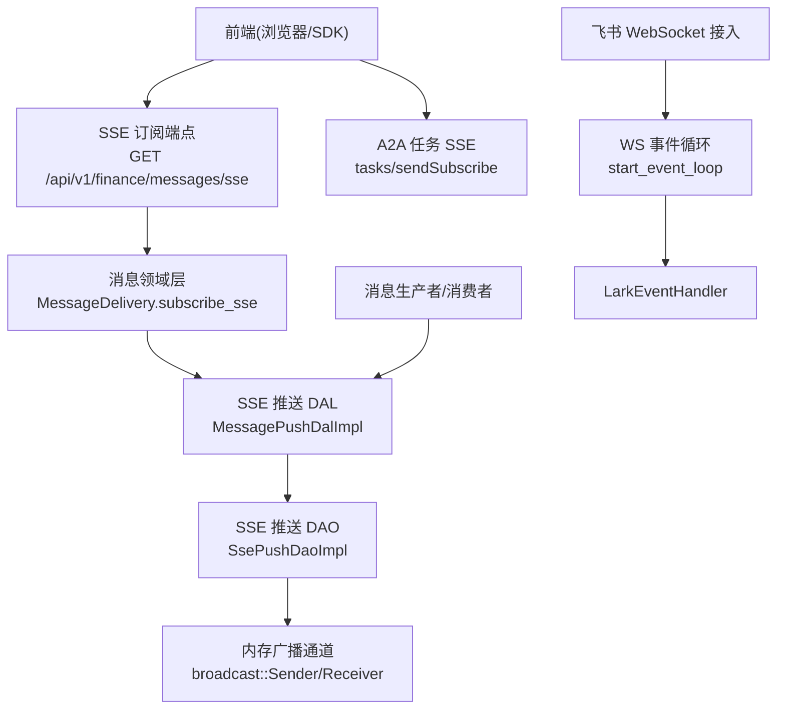
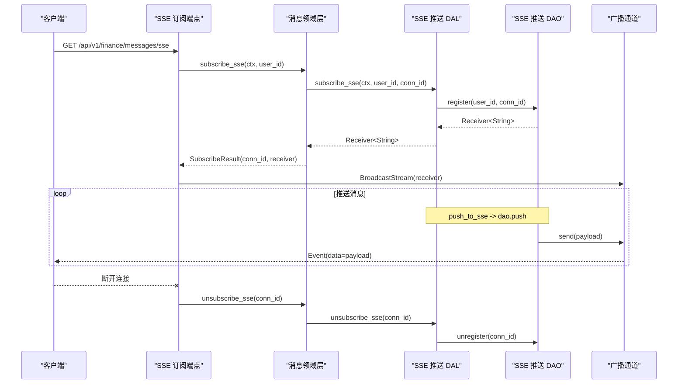
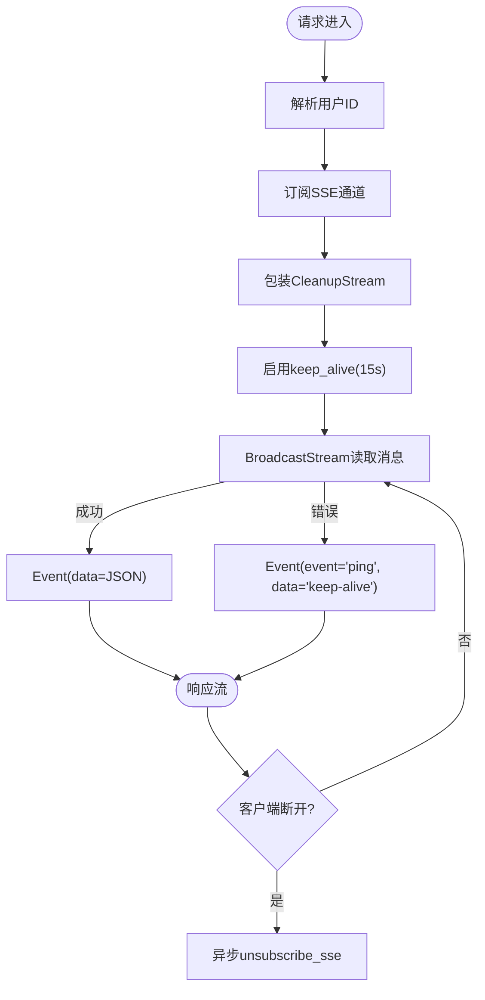
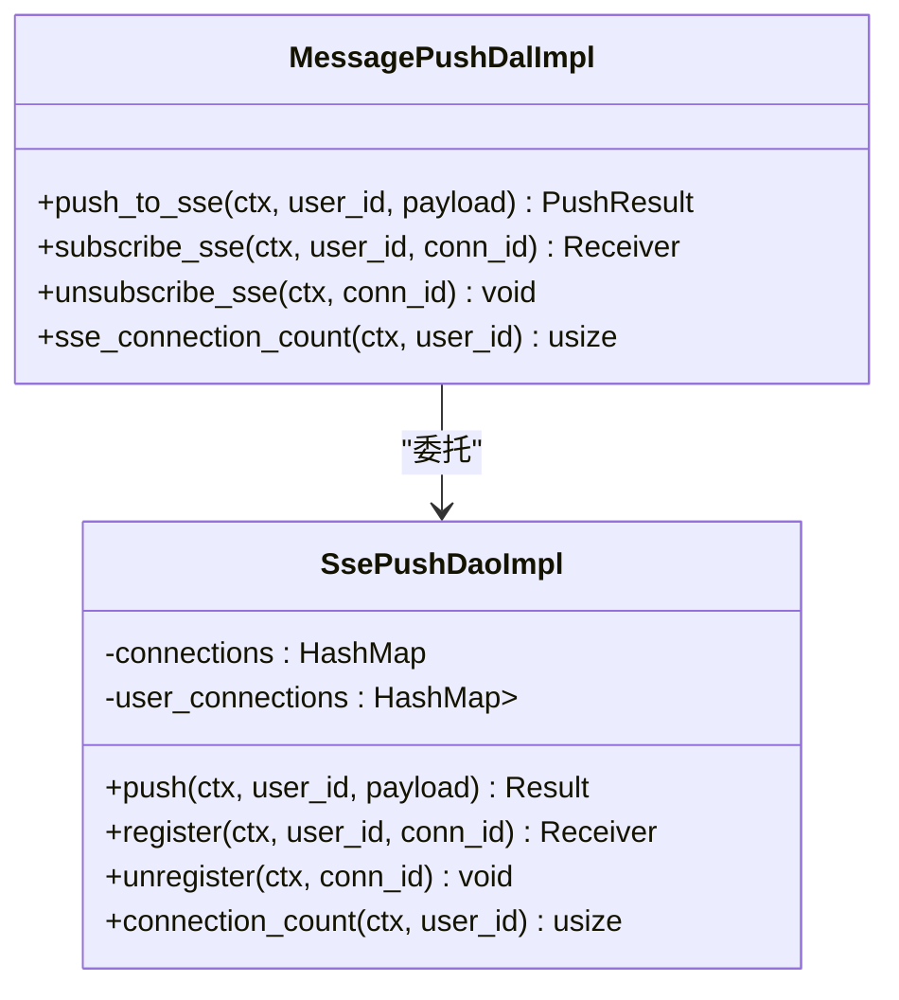
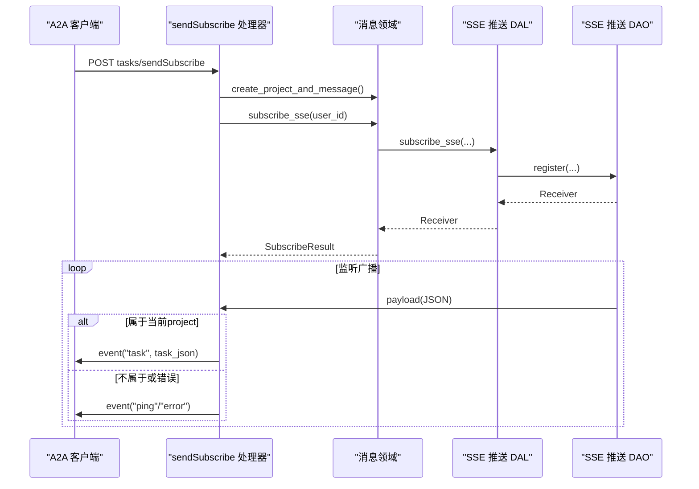
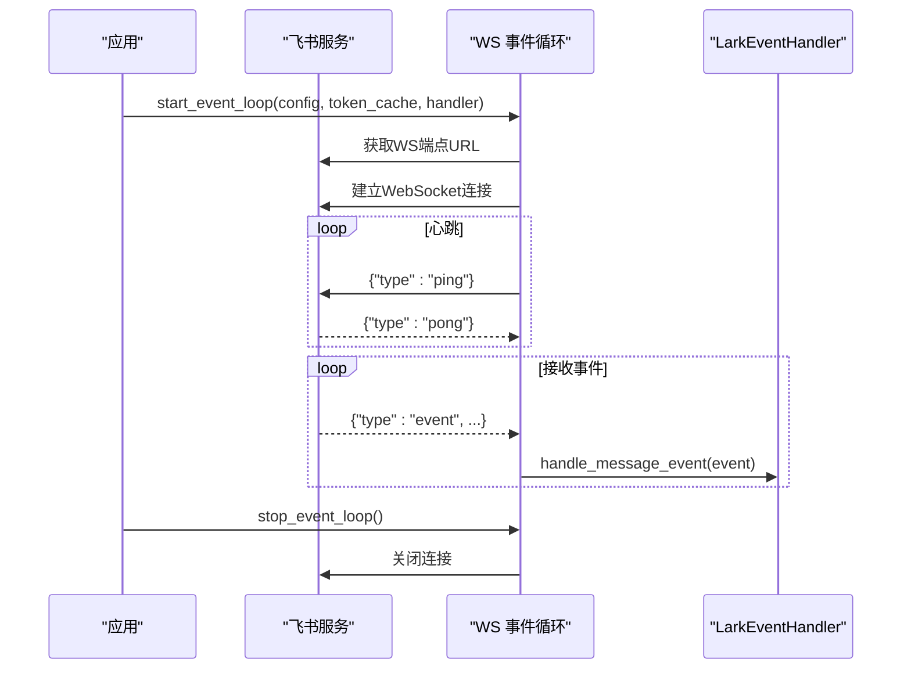
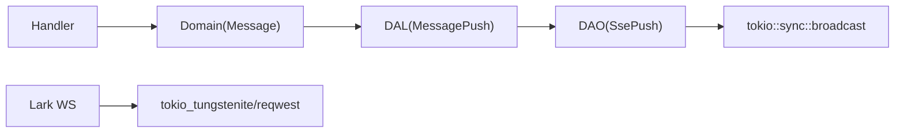

# WebSocket 与 SSE

<cite>
**本文引用的文件**
- [src/handlers/finance/message/subscribe_sse.rs](src/handlers/finance/message/subscribe_sse.rs)
- [src/service/dal/message_push.rs](src/service/dal/message_push.rs)
- [src/service/dao/message_push.rs](src/service/dao/message_push.rs)
- [src/service/domain/message/mod.rs](src/service/domain/message/mod.rs)
- [src/service/domain/message/delivery.rs](src/service/domain/message/delivery.rs)
- [src/handlers/a2a/send_subscribe.rs](src/handlers/a2a/send_subscribe.rs)
- [src/service/dao/lark/ws.rs](src/service/dao/lark/ws.rs)
- [frontend/src/utils/message.rs](frontend/src/utils/message.rs)
- [docs/message_interaction_design.md](docs/message_interaction_design.md)
- [docs/testing_guidelines.md](docs/testing_guidelines.md)
</cite>

## 目录
1. [简介](#简介)
2. [项目结构](#项目结构)
3. [核心组件](#核心组件)
4. [架构总览](#架构总览)
5. [详细组件分析](#详细组件分析)
6. [依赖关系分析](#依赖关系分析)
7. [性能考虑](#性能考虑)
8. [故障诊断指南](#故障诊断指南)
9. [结论](#结论)
10. [附录](#附录)

## 简介
本技术文档围绕本项目中的实时通信能力，系统性说明 Server-Sent Events（SSE）与 WebSocket 的实现、协议与运行机制。重点覆盖：
- SSE 连接建立、消息推送机制、断线重连策略与心跳保持
- WebSocket 连接协议、消息格式、事件类型与状态管理（以飞书长连接为例）
- 实时消息订阅、广播机制、用户会话管理与连接池优化
- 客户端集成示例（JavaScript SDK 使用）、错误处理
- 性能优化技巧、并发连接限制与资源管理策略
- 监控指标、故障诊断与调试工具使用方法

## 项目结构
本项目采用分层架构：HTTP Handler → Domain → DAL → DAO。实时通信相关代码主要分布在以下位置：
- HTTP 层：SSE 订阅端点、A2A 任务 SSE 流式接口
- 领域层：消息投递与订阅抽象
- 数据访问层：SSE 推送通道注册/注销、广播分发
- 外部集成：飞书 WebSocket 长连接（事件入站）

图表来源
- [src/handlers/finance/message/subscribe_sse.rs:52-92](src/handlers/finance/message/subscribe_sse.rs#L52-L92)
- [src/service/domain/message/delivery.rs:438-459](src/service/domain/message/delivery.rs#L438-L459)
- [src/service/dal/message_push.rs:71-104](src/service/dal/message_push.rs#L71-L104)
- [src/service/dao/message_push.rs:60-131](src/service/dao/message_push.rs#L60-L131)
- [src/service/dao/lark/ws.rs:152-228](src/service/dao/lark/ws.rs#L152-L228)

章节来源
- [docs/message_interaction_design.md:162-245](docs/message_interaction_design.md#L162-L245)

## 核心组件
- SSE 订阅端点：负责从认证上下文提取用户 ID，创建并维护 SSE 流，封装清理逻辑，设置 keep-alive 心跳。
- 消息领域层：提供 subscribe/unsubscribe 抽象，生成唯一 connection_id，协调 DAL。
- SSE 推送 DAL：将 JSON payload 序列化并通过 DAO 推送到对应用户的 broadcast 通道。
- SSE 推送 DAO：内存级连接表与用户-连接映射，实现 register/unregister/push/connection_count。
- A2A SSE 流式接口：复用现有 SSE 基础设施，按项目维度过滤并推送完整任务视图。
- 飞书 WebSocket 接入：获取连接地址、建立 WS、定时发送 ping、接收事件并回调处理器。

章节来源
- [src/handlers/finance/message/subscribe_sse.rs:17-92](src/handlers/finance/message/subscribe_sse.rs#L17-L92)
- [src/service/domain/message/mod.rs:250-331](src/service/domain/message/mod.rs#L250-L331)
- [src/service/dal/message_push.rs:12-114](src/service/dal/message_push.rs#L12-L114)
- [src/service/dao/message_push.rs:12-136](src/service/dao/message_push.rs#L12-L136)
- [src/handlers/a2a/send_subscribe.rs:35-124](src/handlers/a2a/send_subscribe.rs#L35-L124)
- [src/service/dao/lark/ws.rs:48-90](src/service/dao/lark/ws.rs#L48-L90)

## 架构总览
SSE 与 WebSocket 在本项目中承担不同职责：
- SSE：面向浏览器的服务端到客户端单向推送，用于消息与任务状态实时更新。
- WebSocket：面向第三方平台（如飞书）的双向长连接，用于事件入站与心跳维持。

图表来源
- [src/handlers/finance/message/subscribe_sse.rs:52-92](src/handlers/finance/message/subscribe_sse.rs#L52-L92)
- [src/service/domain/message/delivery.rs:438-459](src/service/domain/message/delivery.rs#L438-L459)
- [src/service/dal/message_push.rs:71-104](src/service/dal/message_push.rs#L71-L104)
- [src/service/dao/message_push.rs:60-131](src/service/dao/message_push.rs#L60-L131)

## 详细组件分析

### SSE 订阅端点与连接生命周期
- 功能要点
  - 从 RequestContext 提取用户 ID，调用领域层订阅。
  - 使用 CleanupStream 包装流，在流被丢弃时异步注销连接，避免内存泄漏。
  - 通过 axum Sse.keep_alive 配置 15 秒心跳，保证代理/网关不超时。
  - 对广播通道错误返回 keep-alive 事件，保持连接活性。

图表来源
- [src/handlers/finance/message/subscribe_sse.rs:17-92](src/handlers/finance/message/subscribe_sse.rs#L17-L92)

章节来源
- [src/handlers/finance/message/subscribe_sse.rs:17-92](src/handlers/finance/message/subscribe_sse.rs#L17-L92)

### 消息推送 DAL/DAO 与广播机制
- DAL 职责
  - 将业务对象序列化为 JSON，调用 DAO 推送。
  - 暴露 subscribe/unsubscribe/connection_count 等能力。
- DAO 职责
  - 维护 connections（conn_id -> Sender）与 user_connections（user_id -> Set<conn_id>）。
  - register 创建广播通道并登记；unregister 清理；push 遍历用户连接发送。
- 复杂度
  - push 时间复杂度 O(N)，N 为当前用户活跃连接数。
  - register/unregister 为哈希表操作，均摊 O(1)。

图表来源
- [src/service/dal/message_push.rs:71-114](src/service/dal/message_push.rs#L71-L114)
- [src/service/dao/message_push.rs:40-131](src/service/dao/message_push.rs#L40-L131)

章节来源
- [src/service/dal/message_push.rs:12-114](src/service/dal/message_push.rs#L12-L114)
- [src/service/dao/message_push.rs:12-136](src/service/dao/message_push.rs#L12-L136)

### A2A 任务 SSE 流式接口
- 功能要点
  - 复用 message_push 的 SSE 基础设施，按 project_id 过滤事件。
  - 收到消息后构建完整 A2A Task 并推送 event("task")。
  - 对非目标项目或错误返回 keep-alive 或 error 事件。

图表来源
- [src/handlers/a2a/send_subscribe.rs:35-124](src/handlers/a2a/send_subscribe.rs#L35-L124)

章节来源
- [src/handlers/a2a/send_subscribe.rs:1-212](src/handlers/a2a/send_subscribe.rs#L1-L212)

### 飞书 WebSocket 长连接（事件入站）
- 协议要点
  - 通过 HTTP 获取 WS 端点 URL，建立连接。
  - 每 30 秒发送 {"type":"ping"}，等待 {"type":"pong"}。
  - 下行消息 type 包括 event、pong、close，仅处理 im.message.receive_v1 事件。
- 状态管理
  - WsState 包含心跳任务句柄、接收任务句柄与关闭信号。
  - stop_event_loop 发送关闭信号并等待任务退出。

图表来源
- [src/service/dao/lark/ws.rs:92-143](src/service/dao/lark/ws.rs#L92-L143)
- [src/service/dao/lark/ws.rs:152-228](src/service/dao/lark/ws.rs#L152-L228)
- [src/service/dao/lark/ws.rs:230-290](src/service/dao/lark/ws.rs#L230-L290)

章节来源
- [src/service/dao/lark/ws.rs:48-90](src/service/dao/lark/ws.rs#L48-L90)
- [src/service/dao/lark/ws.rs:152-290](src/service/dao/lark/ws.rs#L152-L290)

### 客户端集成与错误处理
- 前端使用 EventSource 订阅 SSE，自动携带 Cookie，由 JWT 中间件完成认证。
- 乐观消息：发送成功后立即显示临时消息，待 SSE 真实消息到达后替换。
- 错误处理：SSE 流中通过 event("error") 传递错误信息；客户端需捕获并重试。

章节来源
- [docs/message_interaction_design.md:162-245](docs/message_interaction_design.md#L162-L245)
- [frontend/src/utils/message.rs:42-84](frontend/src/utils/message.rs#L42-L84)

## 依赖关系分析
- Handler 依赖领域层，领域层依赖 DAL，DAL 依赖 DAO。
- SSE 推送 DAO 使用内存数据结构，无外部依赖，具备高吞吐低延迟特性。
- 飞书 WebSocket 依赖 tokio_tungstenite、reqwest 等网络库。

图表来源
- [src/service/domain/message/mod.rs:250-331](src/service/domain/message/mod.rs#L250-L331)
- [src/service/dal/message_push.rs:71-114](src/service/dal/message_push.rs#L71-L114)
- [src/service/dao/message_push.rs:60-131](src/service/dao/message_push.rs#L60-L131)
- [src/service/dao/lark/ws.rs:152-228](src/service/dao/lark/ws.rs#L152-L228)

章节来源
- [src/service/domain/message/mod.rs:250-331](src/service/domain/message/mod.rs#L250-L331)
- [src/service/dal/message_push.rs:71-114](src/service/dal/message_push.rs#L71-L114)
- [src/service/dao/message_push.rs:60-131](src/service/dao/message_push.rs#L60-L131)
- [src/service/dao/lark/ws.rs:152-228](src/service/dao/lark/ws.rs#L152-L228)

## 性能考虑
- 广播通道容量：默认 channel(100)，在高并发下可能丢消息，建议根据峰值调整。
- 推送复杂度：push 为 O(N)，应控制单用户最大连接数，必要时引入限流或分片。
- 心跳间隔：SSE keep_alive 15 秒，WS ping 30 秒，兼顾代理超时与带宽开销。
- 连接清理：CleanupStream 确保断开即释放，避免内存泄漏。
- 鉴权与路由：JWT/Cookie 中间件统一认证，减少重复校验成本。

[本节为通用指导，不直接分析具体文件]

## 故障诊断指南
- SSE 连通性测试：验证 /messages/sse 返回 200 且为流式响应。
- 端到端内容验证：订阅 SSE 后检查收到的 event JSON 是否包含正确的 message_id 与 content。
- Webhook 渠道失败聚合：不可达 URL 不会 panic，错误落入 details.error，deliver_message 仍返回 Ok。
- 无渠道无 SSE 边界：total/success/failed 全 0，函数返回 Ok。
- 日志定位：关注 lark ws 相关日志（连接、心跳、接收错误），以及 SSE 推送计数。

章节来源
- [docs/testing_guidelines.md:479-499](docs/testing_guidelines.md#L479-L499)

## 结论
本项目通过分层架构清晰分离了实时通信的职责：SSE 用于浏览器侧的消息与任务状态推送，WebSocket 用于第三方平台的事件入站。基于内存广播通道的推送机制具备低延迟与高吞吐特性，配合严格的生命周期管理与心跳策略，保障了连接的稳定性与资源可控。建议在大规模部署时关注广播通道容量、连接数上限与监控指标，持续优化性能与可观测性。

## 附录
- SSE 消息负载字段定义（与 MessageListItem 对齐）
  - message_id, project_id, task_id, from_id, from_role, to_id, to_role, message_type, status, content, reply_to_id, created_at, file_type, file_meta
- 事件类型
  - SSE：data（消息体）、event("ping"/"error"/"task")
  - WebSocket（飞书）：{"type":"event"}, {"type":"pong"}, {"type":"close"}
- 客户端集成要点
  - 使用 EventSource 订阅 /api/v1/finance/messages/sse
  - 处理 error 事件并重试；使用乐观消息提升体验
  - 对于 A2A 场景，订阅 tasks/sendSubscribe 并按 project_id 过滤

章节来源
- [src/service/dal/message_push.rs:12-33](src/service/dal/message_push.rs#L12-L33)
- [src/handlers/a2a/send_subscribe.rs:85-124](src/handlers/a2a/send_subscribe.rs#L85-L124)
- [src/service/dao/lark/ws.rs:48-90](src/service/dao/lark/ws.rs#L48-L90)
- [frontend/src/utils/message.rs:42-84](frontend/src/utils/message.rs#L42-L84)