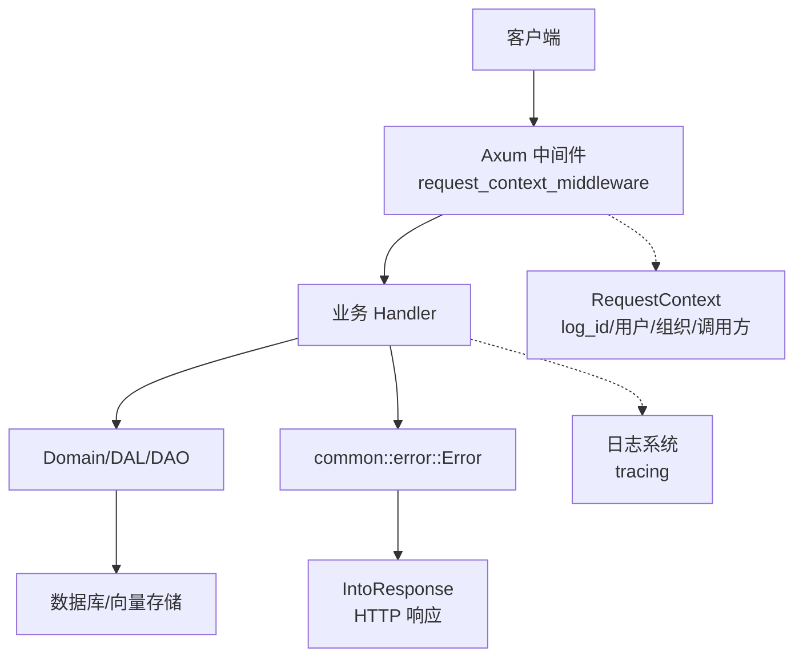
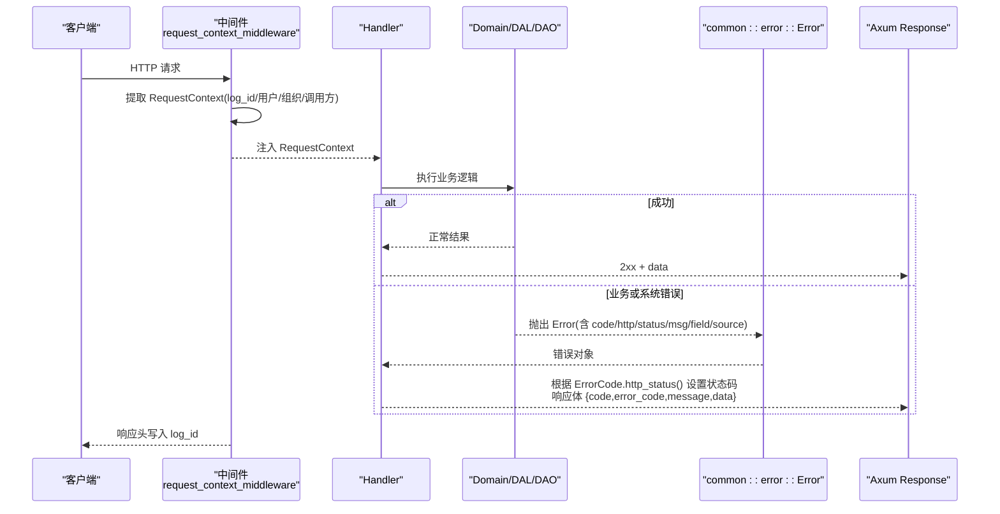
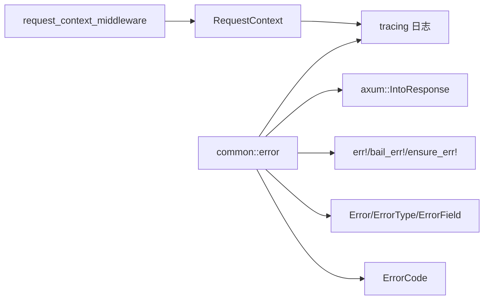

# 错误处理与状态码

<cite>
**本文引用的文件**
- [common/src/error/mod.rs](common/src/error/mod.rs)
- [common/src/error/types.rs](common/src/error/types.rs)
- [common/src/error/code.rs](common/src/error/code.rs)
- [common/src/error/macros.rs](common/src/error/macros.rs)
- [common/src/error/axum.rs](common/src/error/axum.rs)
- [src/middleware/request_context.rs](src/middleware/request_context.rs)
- [src/pkg/request_context.rs](src/pkg/request_context.rs)
- [src/pkg/logging.rs](src/pkg/logging.rs)
- [common/src/error_test.rs](common/src/error_test.rs)
- [统一错误模型：ErrorCode + ErrorType + ErrorField 的跨层错误处理体系](docs/wiki/knowledge/zh/统一错误模型：ErrorCode + ErrorType + ErrorField 的跨层错误处理体系/统一错误模型：ErrorCode + ErrorType + ErrorField 的跨层错误处理体系.md)

## 2026-09-01 增量变更
- [ai-orz-macros/src/lib.rs#L114-L309](ai-orz-macros/src/lib.rs#L114-L309) — 11 处 panic 仅限编译期必需属性缺失；新增 trait/attr 宏扩展
- [common/src/error/types/tests.rs](common/src/error/types/tests.rs) — 新增 ErrorCode/ErrorType 契约测试断言
- [common/src/enums/mod.rs](common/src/enums/mod.rs) — 新增 Error 相关枚举值

**本文关联的 RAG 知识卡**：
- [统一错误模型：ErrorCode + ErrorType + ErrorField 的跨层错误处理体系](docs/wiki/knowledge/zh/统一错误模型：ErrorCode + ErrorType + ErrorField 的跨层错误处理体系/统一错误模型：ErrorCode + ErrorType + ErrorField 的跨层错误处理体系.md)
</cite>

## 更新摘要

**2026-09-01 增量**：ai-orz-macros 宏级 panic 仅限 id/name/description/params 11 处属性缺失（禁止业务逻辑 panic）；error/types/tests.rs 同步新增契约测试；新增 ErrorCode 枚举值必须同步补测试断言。

## 目录
1. [简介](#简介)
2. [项目结构](#项目结构)
3. [核心组件](#核心组件)
4. [架构总览](#架构总览)
5. [详细组件分析](#详细组件分析)
6. [依赖关系分析](#依赖关系分析)
7. [性能考虑](#性能考虑)
8. [故障排查指南](#故障排查指南)
9. [结论](#结论)
10. [附录](#附录)

## 简介
本文件为 AI Orz 的错误处理系统提供统一规范与实践说明，覆盖 HTTP 状态码使用、错误响应格式、错误码定义、全局错误处理器、业务异常分类、错误传播机制、请求上下文追踪、错误日志记录与调试信息收集，以及常见错误场景的处理示例、监控告警与故障恢复策略，并给出客户端错误处理最佳实践与用户体验优化建议。

## 项目结构
错误处理体系由公共错误模型（common）与 Axum 集成层组成，并通过中间件将请求上下文贯穿到各层：
- 公共错误模型：ErrorCode、ErrorType、Error、ErrorField 及宏工具 err!/bail_err!/ensure_err!
- Axum 集成：实现 IntoResponse，将 Error 转换为标准 HTTP 响应体
- 请求上下文：从请求头提取 log_id、用户身份、组织、调用方类型等，注入到请求扩展并在响应中写回 log_id
- 日志系统：tracing 初始化，支持 JSON/文本输出、按日滚动与保留天数清理

图表来源
- [src/middleware/request_context.rs:20-40](src/middleware/request_context.rs#L20-L40)
- [common/src/error/axum.rs:12-28](common/src/error/axum.rs#L12-L28)
- [src/pkg/request_context.rs:295-356](src/pkg/request_context.rs#L295-L356)
- [src/pkg/logging.rs:29-123](src/pkg/logging.rs#L29-L123)

章节来源
- [src/middleware/request_context.rs:20-40](src/middleware/request_context.rs#L20-L40)
- [common/src/error/axum.rs:12-28](common/src/error/axum.rs#L12-L28)
- [src/pkg/request_context.rs:295-356](src/pkg/request_context.rs#L295-L356)
- [src/pkg/logging.rs:29-123](src/pkg/logging.rs#L29-L123)

## 核心组件
- 错误类型与分类
  - ErrorType：Validation/Biz/Auth/Permission/Db/Io/Third/Tool/Runtime/Network/Config/System
  - ErrorCode：通过 define_error_codes! 生成，每个变体绑定 error_type、http status、code 字符串
  - Error：包含 code、error_type、msg、field、source；提供便捷构造器 bad_request/unauthorized/forbidden/not_found/conflict/payload_too_large/tool_call_failed/internal/db_error/io_error 等
  - ErrorField：结构化上下文，支持 trace_ref 与动态 extra map
- 宏工具
  - err!/bail_err!/ensure_err!：统一构建错误、提前返回、条件断言失败转错误
- Axum 集成
  - IntoResponse：将 Error 转为 HTTP 响应，状态码来自 ErrorCode.http_status()，响应体包含 code、error_code、message、data
- 请求上下文
  - RequestContext：携带 log_id、用户、组织、调用方类型、Agent/Task/Project/Model 等维度信息，支持 Builder 模式与 enrich_ctx! 宏
  - request_context_middleware：从请求头提取上下文，注入 Extension，并将 log_id 写回响应头
- 日志系统
  - tracing 初始化：控制台+文件（可选），JSON/文本格式，按日滚动，保留天数清理

章节来源
- [common/src/error/types.rs:10-39](common/src/error/types.rs#L10-L39)
- [common/src/error/types.rs:106-246](common/src/error/types.rs#L106-L246)
- [common/src/error/code.rs:5-142](common/src/error/code.rs#L5-L142)
- [common/src/error/macros.rs:3-112](common/src/error/macros.rs#L3-L112)
- [common/src/error/macros.rs:114-211](common/src/error/macros.rs#L114-L211)
- [common/src/error/axum.rs:12-28](common/src/error/axum.rs#L12-L28)
- [src/pkg/request_context.rs:22-61](src/pkg/request_context.rs#L22-L61)
- [src/middleware/request_context.rs:20-40](src/middleware/request_context.rs#L20-L40)
- [src/pkg/logging.rs:29-123](src/pkg/logging.rs#L29-L123)

## 架构总览
错误处理遵循四层单向调用：Adapter（Handler/AOP Producer）→ Domain → DAL → DAO。错误在 Domain/DAL/DAO 中以 common::error::Error 形式向上抛出，最终在 Adapter 层通过 IntoResponse 转换为 HTTP 响应。请求上下文 RequestContext 贯穿整个生命周期，用于追踪与审计。

图表来源
- [src/middleware/request_context.rs:20-40](src/middleware/request_context.rs#L20-L40)
- [common/src/error/axum.rs:12-28](common/src/error/axum.rs#L12-L28)
- [common/src/error/types.rs:225-228](common/src/error/types.rs#L225-L228)

## 详细组件分析

#### 2026-09-01 增量：宏级 panic 边界 + 契约测试同步约束
- **宏级 panic 边界**：ai-orz-macros 中仅剩 11 处 panic，全部集中在编译期属性缺失检查——如 handler 宏找不到 id/name/description/params 必填属性、domain 宏缺少实体定义等。这些 panic 发生在 proc macro 展开阶段，用户看到的是清晰的编译错误信息而非运行时崩溃，属于宏系统合理的失败快速机制。禁止任何业务逻辑路径在运行时 panic。
- **契约测试同步约束**：common/src/error/types/tests.rs 为 ErrorCode 和 ErrorType 的每个枚举变体都提供了契约测试断言，验证 http_status()、error_code()、error_type() 三个方法返回值与预期一致。后续任何新增 ErrorCode 枚举值必须同步在 tests.rs 中补对应断言，否则 CI 会 fail——这条约束通过 cargo test 强制执行，防止错误码新增与文档/测试不同步。
- **错误相关枚举集中在 common/src/enums/mod.rs**：ErrorCode 新增枚举值统一收敛到此文件，配合宏级 panic 边界和契约测试，形成"枚举定义 → 宏展开 → 契约测试"的完整闭环。

### 错误码与状态码规范
- 状态码映射
  - 400：InvalidRequest、PayloadTooLarge、ToolParameterInvalid、UnsupportedOperation
  - 401：Unauthorized、InvalidToken、JwtInvalid
  - 403：Forbidden
  - 404：ResourceNotFound、NotFound
  - 409：ResourceConflict、Conflict、EmbeddingProviderSwitchRequired、RebuildInProgress
  - 500：DbQueryFailed、DbMigrationFailed、IoError、Internal、ChannelPushFailed、RuntimeAwakenFailed、ToolExecutionFailed
  - 502：ThirdPartyUnavailable
  - 503：NetworkError
- 设计要点
  - 所有状态码来源于 ErrorCode.http_status()，集中维护，避免散落在业务代码
  - 错误码字符串稳定，便于客户端匹配与统计
  - ErrorType 提供粗粒度分类，便于监控与告警聚合

章节来源
- [common/src/error/code.rs:5-142](common/src/error/code.rs#L5-L142)
- [common/src/error/types.rs:225-228](common/src/error/types.rs#L225-L228)

### 错误响应格式
- HTTP 响应体字段
  - code：整数状态码（与 HTTP 状态一致）
  - error_code：稳定的机器可读错误码字符串
  - message：人类可读消息
  - data：固定为 null（错误时）
- 行为
  - 当 ErrorCode.http_status() 无效时，降级为 500
  - 通过 IntoResponse 自动转换，无需在 Handler 中手动拼装

章节来源
- [common/src/error/axum.rs:12-28](common/src/error/axum.rs#L12-L28)

### 全局错误处理器与错误传播
- 全局转换
  - Error 实现 IntoResponse，作为“全局错误处理器”将错误统一转为 HTTP 响应
- 传播路径
  - 底层库错误通过 From 实现转换为 common::error::Error（如 sqlx::Error、std::io::Error、anyhow::Error、reqwest::Error、serde_json::Error、jsonwebtoken::errors::Error、base64::DecodeError、toml::de::Error）
  - 业务层使用 err!/bail_err!/ensure_err! 快速构造并返回
- 链式上下文
  - with_source 保留原始错误，便于诊断
  - with_field 附加结构化上下文（如 trace_ref、字段名、原因等）

章节来源
- [common/src/error/types.rs:260-360](common/src/error/types.rs#L260-L360)
- [common/src/error/macros.rs:3-112](common/src/error/macros.rs#L3-L112)
- [common/src/error/macros.rs:114-211](common/src/error/macros.rs#L114-L211)

### 请求上下文追踪
- 提取与注入
  - request_context_middleware 从请求头提取 log_id、user_id、username、organization_id、user_role、caller_type，创建 RequestContext 并注入到请求扩展
  - 响应阶段将 log_id 写回响应头，便于客户端关联日志
- 上下文字段
  - 追踪标识：log_id
  - 用户身份：user_id、username、user_role
  - 组织维度：organization_id
  - 业务维度：agent_id、project_id、task_id、model_provider_id、model_name
  - 调用方类型：CallerType（User/Agent/System）
- 构建与增强
  - 提供 Builder 模式与 enrich_ctx! 宏，支持从多个实体逐步增强上下文

章节来源
- [src/middleware/request_context.rs:20-40](src/middleware/request_context.rs#L20-L40)
- [src/pkg/request_context.rs:22-61](src/pkg/request_context.rs#L22-L61)
- [src/pkg/request_context.rs:295-356](src/pkg/request_context.rs#L295-L356)
- [src/pkg/request_context.rs:621-631](src/pkg/request_context.rs#L621-L631)

### 错误日志记录与调试信息
- 日志初始化
  - 支持 JSON/文本格式，控制台与文件双输出，按日滚动，可配置保留天数
  - 非阻塞写入，保证性能
- 调试信息
  - ErrorField 支持 trace_ref 与 extra 动态字段，便于定位工具调用链与问题根因
  - with_source 保留原始错误栈，配合 tracing 进行深度诊断

章节来源
- [src/pkg/logging.rs:29-123](src/pkg/logging.rs#L29-L123)
- [common/src/error/types.rs:41-76](common/src/error/types.rs#L41-L76)
- [common/src/error/types.rs:206-213](common/src/error/types.rs#L206-L213)

### 常见错误场景与处理示例
- 认证失败
  - 使用 Unauthorized/InvalidToken/JwtInvalid，HTTP 401
  - 建议在鉴权中间件或 Handler 入口处尽早返回，减少后续处理开销
- 权限不足
  - 使用 Forbidden，HTTP 403
  - 结合 require_role 中间件或业务校验，确保最小权限原则
- 数据验证错误
  - 使用 InvalidRequest/PayloadTooLarge，HTTP 400/413
  - 通过 ensure_err! 在参数校验点快速失败，附带 field 信息（字段名、规则等）
- 资源不存在
  - 使用 ResourceNotFound/NotFound，HTTP 404
- 冲突
  - 使用 ResourceConflict/Conflict/RebuildInProgress/EmbeddingProviderSwitchRequired，HTTP 409
- 数据库/IO/网络/第三方错误
  - 分别映射到 DbQueryFailed/DbMigrationFailed、IoError、NetworkError、ThirdPartyUnavailable/ThirdPartyError
  - 通过 From 实现自动转换，保持上层错误语义一致
- 工具执行失败
  - ToolExecutionFailed，HTTP 500
  - 建议附带 tool 名称、参数摘要、trace_ref，便于回溯

章节来源
- [common/src/error/code.rs:5-142](common/src/error/code.rs#L5-L142)
- [common/src/error/types.rs:150-198](common/src/error/types.rs#L150-L198)
- [common/src/error_test.rs:15-53](common/src/error_test.rs#L15-L53)

### 错误监控、告警与故障恢复
- 监控与告警
  - 基于 ErrorType 与 ErrorCode 的聚合统计，区分 Validation/Biz/Auth/Permission/Db/Third/Network/System 等类别
  - 对高频错误（如 NetworkError、ThirdPartyUnavailable、DbQueryFailed）设置阈值告警
- 故障恢复策略
  - 重试与退避：针对 NetworkError/ThirdPartyUnavailable 实施指数退避重试
  - 熔断与降级：第三方不可用时降级为本地缓存或只读模式
  - 限流与背压：防止雪崩，保护下游服务
  - 幂等与补偿：对写操作引入幂等键与补偿任务

[本节为通用指导，不直接分析具体文件]

### 客户端错误处理最佳实践与用户体验优化
- 客户端侧
  - 依据 error_code 做分支处理，而非仅依赖 HTTP 状态码
  - 对用户可见的消息使用 message 字段，内部调试使用 error_code 与 field
  - 对 401/403 引导重新登录或申请权限；对 409 提示冲突并引导刷新
  - 对 5xx 显示友好提示并支持重试
- 体验优化
  - 前端展示错误时附带可操作的下一步（如重试、联系客服、查看帮助）
  - 对频繁错误进行埋点统计，辅助产品与运维改进

[本节为通用指导，不直接分析具体文件]

## 依赖关系分析
- 模块耦合
  - common::error 提供统一错误模型与宏，被 src/pkg 与业务层广泛引用
  - axum 集成仅在启用 axum-integration 特性时生效
  - 请求上下文中间件依赖 RequestContext 与常量头定义
  - 日志系统独立于错误模型，但常与错误上下文配合使用
- 外部依赖
  - sqlx、tokio、reqwest、serde_json、jsonwebtoken、base64、toml 等通过 From 实现转换为 common::error::Error

图表来源
- [common/src/error/mod.rs:10-24](common/src/error/mod.rs#L10-L24)
- [common/src/error/axum.rs:12-28](common/src/error/axum.rs#L12-L28)
- [src/middleware/request_context.rs:20-40](src/middleware/request_context.rs#L20-L40)
- [src/pkg/logging.rs:29-123](src/pkg/logging.rs#L29-L123)

章节来源
- [common/src/error/mod.rs:10-24](common/src/error/mod.rs#L10-L24)
- [common/src/error/axum.rs:12-28](common/src/error/axum.rs#L12-L28)
- [src/middleware/request_context.rs:20-40](src/middleware/request_context.rs#L20-L40)
- [src/pkg/logging.rs:29-123](src/pkg/logging.rs#L29-L123)

## 性能考虑
- 错误构造与传播
  - 使用宏 err!/bail_err!/ensure_err! 减少样板代码，提升可读性与一致性
  - with_source 会持有 Arc<AnyhowError>，注意在大对象或深层堆栈中的内存占用
- 日志与追踪
  - 非阻塞文件输出避免 I/O 阻塞主流程
  - 合理设置日志级别与保留天数，控制磁盘与 CPU 开销
- 状态码转换
  - 通过 ErrorCode.http_status() 集中管理，避免重复计算与不一致

[本节为通用指导，不直接分析具体文件]

## 故障排查指南
- 快速定位
  - 使用响应头 log_id 关联服务端日志，缩小排查范围
  - 检查 error_code 与 message，确定错误类别与触发点
- 深入诊断
  - 查看 ErrorField 中的 trace_ref 与 extra 字段，定位工具调用链与参数
  - 通过 with_source 获取原始错误栈，结合 tracing 日志定位根因
- 常见问题
  - 401/403：检查 JWT 与角色权限中间件是否正确注入 X-User-Role
  - 400/413：检查请求体大小与参数校验逻辑
  - 5xx：关注 NetworkError/ThirdPartyUnavailable/DbQueryFailed，评估重试与熔断策略

章节来源
- [src/middleware/request_context.rs:20-40](src/middleware/request_context.rs#L20-L40)
- [common/src/error/types.rs:206-213](common/src/error/types.rs#L206-L213)
- [common/src/error_test.rs:55-83](common/src/error_test.rs#L55-L83)

## 结论
AI Orz 的错误处理体系以 common::error 为核心，结合 Axum 集成与请求上下文中间件，实现了统一的错误码、状态码、响应格式与追踪能力。通过宏工具简化错误构造与传播，借助日志系统与结构化上下文提升可观测性。建议在生产环境完善监控告警与故障恢复策略，并在客户端侧建立稳健的错误处理与用户体验优化方案。

[本节为总结，不直接分析具体文件]

## 附录
- 常用错误码速查
  - 400：invalid_request、payload_too_large、tool_parameter_invalid、unsupported_operation
  - 401：unauthorized、invalid_token、jwt_invalid
  - 403：forbidden
  - 404：resource_not_found、not_found
  - 409：resource_conflict、conflict、embedding_provider_switch_required、rebuild_in_progress
  - 500：db_query_failed、db_migration_failed、io_error、internal、channel_push_failed、runtime_awaken_failed、tool_execution_failed
  - 502：third_party_unavailable
  - 503：network_error

章节来源
- [common/src/error/code.rs:5-142](common/src/error/code.rs#L5-L142)