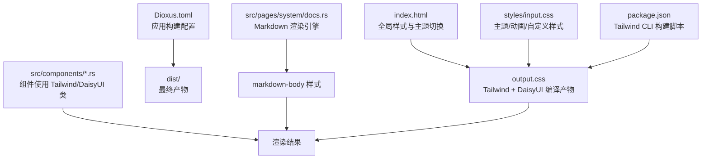
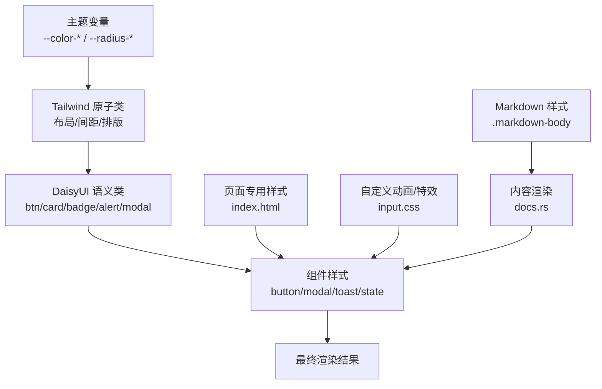
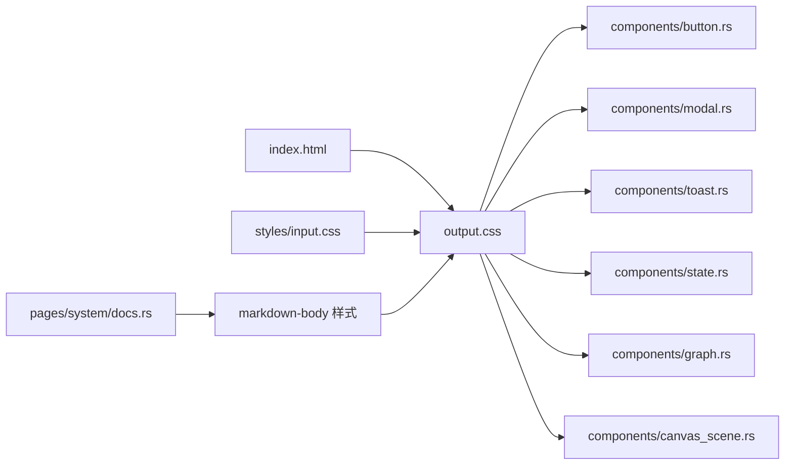

# UI 样式与主题

<cite>
**本文引用的文件**
- [frontend/styles/input.css](frontend/styles/input.css)
- [frontend/index.html](frontend/index.html)
- [frontend/package.json](frontend/package.json)
- [frontend/Dioxus.toml](frontend/Dioxus.toml)
- [frontend/src/components/button.rs](frontend/src/components/button.rs)
- [frontend/src/components/modal.rs](frontend/src/components/modal.rs)
- [frontend/src/components/toast.rs](frontend/src/components/toast.rs)
- [frontend/src/components/state.rs](frontend/src/components/state.rs)
- [frontend/src/components/graph.rs](frontend/src/components/graph.rs)
- [frontend/src/components/canvas_scene.rs](frontend/src/components/canvas_scene.rs)
- [frontend/src/pages/workspace.rs](frontend/src/pages/workspace.rs)
- [frontend/src/pages/system/docs.rs](frontend/src/pages/system/docs.rs)

### 本文关联的三类文档（四类互引闭环）

**① 设计文档（Design）**：
- [Canvas 渲染与可视化手册](docs/archive/design-archive/canvas_rendering_playbook.md) — HUD 风格 Canvas 渲染、图表与知识图谱可视化规范
- 【Batch10 追加】[ui_design_system.md](docs/design/ui_design_system.md) — Tailwind CSS v4 + DaisyUI v5；orz-light oklch 自定义主题色板（p1-p9 紫蓝渐变主色/o1-o9 橙金强调/g1-g9 成功/b1-b9 错误/r1-r9 危险/n1-n12 灰阶）；30+ DaisyUI 主题切换（data-theme 属性）；HUD 流光条 .hud-streamer 动画；.btn-primary / .card / .stats 等工具类统一

**② 落地计划（Plan）**：
- [知识图谱推荐起点与组件复用重构](docs/archive/plan-archive/知识图谱推荐起点与组件复用重构.md) — 知识图谱推荐起点与 Canvas 组件复用重构
- [统计图表Phase1基础设施与时序图展示重构](docs/archive/plan-archive/统计图表Phase1基础设施与时序图展示重构.md) — 图表组件落地点与前后端对接

**④ RAG 原子知识卡**：
- [Canvas HUD 可视化 RAG 卡](docs/wiki/knowledge/zh/Canvas%20HUD%20%E5%8F%AF%E8%A7%86%E5%8C%96%EF%BC%9AGraphCanvas%20%E7%9F%A5%E8%AF%86%E5%9B%BE%E8%B0%B1%20+%20%E5%9B%BE%E8%A1%A8%E5%9C%BA%E6%99%AFLineDonut%20+%20%E4%BB%AA%E8%A1%A8%E7%9B%98Gauge%E5%8F%8C%E7%89%88%20+%20HudPalette%E6%A9%99%E5%85%89%E5%85%89%E6%99%95/Canvas%20HUD%20%E5%8F%AF%E8%A7%86%E5%8C%96%EF%BC%9AGraphCanvas%20%E7%9F%A5%E8%AF%86%E5%9B%BE%E8%B0%B1%20+%20%E5%9B%BE%E8%A1%A8%E5%9C%BA%E6%99%AFLineDonut%20+%20%E4%BB%AA%E8%A1%A8%E7%9B%98Gauge%E5%8F%8C%E7%89%88%20+%20HudPalette%E6%A9%99%E5%85%89%E5%85%89%E6%99%95.md) — GraphCanvas + Line/Donut + Gauge 仪表盘速查
- 【Batch10 追加】[UI Design System 组件设计系统：6 层组件分层 + Hooks 3 个 + Store 2 个 + DaisyUI 主题 + 交互组件复用约束](docs/wiki/knowledge/zh/UI%20Design%20System%20组件设计系统：6%20层组件分层%20+%20Hooks%203%20个%20+%20Store%202%20个%20+%20DaisyUI%20主题%20+%20交互组件复用约束/UI%20Design%20System%20组件设计系统：6%20层组件分层%20+%20Hooks%203%20个%20+%20Store%202%20个%20+%20DaisyUI%20主题%20+%20交互组件复用约束.md) — §3.4 DaisyUI v5 主题配置详解 + §红线 6 禁止定义未在 Design System 枚举的自定义 CSS 类 + §红线 7 色值必须来自 oklch 色板（禁止硬编码 #hex/rgb）
</cite>

## 更新摘要
**变更内容**
- 新增完整的 Markdown 渲染样式系统，支持 pulldown-cmark 输出的 HTML
- 增强 DaisyUI 主题集成，支持 30+ 内置主题的自动适配
- 完善响应式设计策略，包含移动端适配和媒体查询优化
- 改进代码块格式化，提供语法高亮友好的样式基础
- 扩展组件样式约定，提升可访问性和用户体验

## 目录
1. [简介](#简介)
2. [项目结构](#项目结构)
3. [核心组件](#核心组件)
4. [架构总览](#架构总览)
5. [详细组件分析](#详细组件分析)
6. [依赖关系分析](#依赖关系分析)
7. [性能考虑](#性能考虑)
8. [故障排查指南](#故障排查指南)
9. [结论](#结论)
10. [附录](#附录)

## 简介
本文件为 AI Orz 前端应用的 UI 样式与主题文档，聚焦基于 Tailwind CSS v4 与 DaisyUI v5 的样式系统、主题定制、响应式策略、可访问性支持、动画与交互状态、样式变量管理、CSS 模块化组织、开发规范、性能优化与跨浏览器兼容性。特别增强了 Markdown 渲染样式支持，通过 pulldown-cmark 解析器将 Markdown 内容转换为符合设计规范的 HTML 输出，并集成了完整的代码块格式化功能。

## 项目结构
前端样式体系由以下关键部分构成：
- **样式入口与主题配置**：通过 Tailwind 插件引入 DaisyUI 并声明多主题，定义自定义字体与圆角等主题变量；同时提供自定义 HUD/知识图谱动画与样式。
- **Markdown 渲染系统**：基于 pulldown-cmark 的完整 Markdown 解析器，支持表格、删除线、任务列表等扩展语法，输出符合设计规范的 HTML。
- **全局 HTML 与内联样式**：index.html 中注入页面级基础样式、登录页品牌区、图表容器、看板、消息附件、Toast 进度条等专用样式，以及移动端媒体查询适配。
- **构建脚本**：package.json 中定义 Tailwind CLI 构建与监听命令，输出到 public/output.css。
- **Dioxus 应用配置**：Dioxus.toml 指定输出目录、资源目录、标题与打包标识。
- **组件层**：按钮、模态、Toast、状态展示、Canvas/SVG 图形等组件使用 Tailwind 原子类与 DaisyUI 语义化类组合，形成一致的视觉风格。

**图示来源**
- [frontend/styles/input.css:1-45](frontend/styles/input.css#L1-L45)
- [frontend/index.html:1-12](frontend/index.html#L1-L12)
- [frontend/package.json:4-11](frontend/package.json#L4-L11)
- [frontend/Dioxus.toml:1-18](frontend/Dioxus.toml#L1-L18)
- [frontend/src/pages/system/docs.rs:191-201](frontend/src/pages/system/docs.rs#L191-L201)

**章节来源**
- [frontend/styles/input.css:1-45](frontend/styles/input.css#L1-L45)
- [frontend/index.html:1-12](frontend/index.html#L1-L12)
- [frontend/package.json:4-11](frontend/package.json#L4-L11)
- [frontend/Dioxus.toml:1-18](frontend/Dioxus.toml#L1-L18)

## 核心组件
- **按钮（Button）**：封装多种变体（主色、强调、次要、危险、幽灵），尺寸控制，禁用态与点击事件处理，全部基于 DaisyUI 的 btn 系列类。
- **模态（Modal）**：基于原生 dialog 与 DaisyUI modal 类，提供标题、关闭按钮、底部操作区与遮罩点击关闭。
- **Toast 通知**：全局容器 + 单条通知，类型（成功/错误/警告/信息）、图标、自动消失、退出动画与进度条。
- **状态展示**：Loading、EmptyState、ErrorAlert、SuccessAlert，统一使用 DaisyUI alert/loading 类。
- **图形与 Canvas**：SVG 知识图谱背景、HUD 装饰、节点呼吸/扫描环/旋转刻度、边流动与发光；CanvasScene 支持拖拽、hover、选中光晕与力导向布局。
- **Markdown 渲染器**：基于 pulldown-cmark 的完整 Markdown 解析器，支持表格、删除线、任务列表等扩展语法，输出符合设计规范的 HTML。

**章节来源**
- [frontend/src/components/button.rs:1-50](frontend/src/components/button.rs#L1-L50)
- [frontend/src/components/modal.rs:1-44](frontend/src/components/modal.rs#L1-L44)
- [frontend/src/components/toast.rs:1-104](frontend/src/components/toast.rs#L1-L104)
- [frontend/src/components/state.rs:1-50](frontend/src/components/state.rs#L1-L50)
- [frontend/src/components/graph.rs:323-450](frontend/src/components/graph.rs#L323-L450)
- [frontend/src/components/canvas_scene.rs:519-578](frontend/src/components/canvas_scene.rs#L519-L578)
- [frontend/src/pages/system/docs.rs:191-201](frontend/src/pages/system/docs.rs#L191-L201)

## 架构总览
样式架构遵循"集中主题 + 原子类 + 组件语义"的分层：
- **主题层**：input.css 通过 @theme 与 data-theme 覆盖 DaisyUI 颜色、圆角、边框等变量；index.html 通过 data-theme 切换主题。
- **样式层**：Tailwind 原子类负责布局、间距、排版、阴影、过渡；DaisyUI 提供语义化组件类（btn、card、badge、alert、modal 等）。
- **组件层**：各组件以最小内联样式为原则，优先使用 Tailwind/DaisyUI 类；复杂动画与特效集中在 input.css。
- **页面层**：index.html 中针对登录页、图表容器、看板、消息附件等场景补充专用样式与媒体查询。
- **内容层**：markdown-body 样式为 pulldown-cmark 输出的 HTML 提供完整的视觉呈现，包括代码块、表格、引用等元素。

**图示来源**
- [frontend/styles/input.css:42-72](frontend/styles/input.css#L42-L72)
- [frontend/index.html:1-12](frontend/index.html#L1-L12)
- [frontend/src/components/button.rs:27-49](frontend/src/components/button.rs#L27-L49)
- [frontend/src/components/modal.rs:16-43](frontend/src/components/modal.rs#L16-L43)
- [frontend/src/components/toast.rs:8-25](frontend/src/components/toast.rs#L8-L25)
- [frontend/styles/input.css:203-336](frontend/styles/input.css#L203-L336)

## 详细组件分析

### 颜色主题与字体规范
- **主题变量**：在 input.css 中通过 @theme 定义无衬线/等宽字体族；通过 [data-theme="orz-light"] 覆盖 primary/secondary/accent/neutral/base/info/success/warning/error 等语义色，以及圆角与边框宽度。
- **主题切换**：index.html 根元素设置 data-theme="orz-light"，可在运行时切换不同 DaisyUI 内置主题或自定义主题。
- **字体**：sans 使用系统字体栈，mono 使用 SF Mono/Monaco/Cascadia Code/Roboto Mono 等，保证代码与终端显示一致性。

**章节来源**
- [frontend/styles/input.css:42-72](frontend/styles/input.css#L42-L72)
- [frontend/index.html:1-12](frontend/index.html#L1-L12)

### 间距系统与布局约定
- **间距**：优先使用 Tailwind 的 spacing 工具类（如 gap-2/gap-4/padding/margin），保持 8px 基准节奏。
- **布局**：flex/grid 用于响应式排列；卡片使用 card/card-body/card-header；表格使用 table；表单使用 form-input/select/input-bordered 等 DaisyUI 类。
- **栅格**：工作台统计区域使用 grid-cols-2 md:grid-cols-4 实现小屏双列、大屏四列。

**章节来源**
- [frontend/src/pages/workspace.rs:724-743](frontend/src/pages/workspace.rs#L724-L743)
- [frontend/src/pages/message/search.rs:55-79](frontend/src/pages/message/search.rs#L55-L79)
- [frontend/src/pages/hr/memory_search.rs:77-103](frontend/src/pages/hr/memory_search.rs#L77-L103)

### 组件样式约定
- **按钮**：通过 Button 组件统一映射到 btn-primary/btn-secondary/btn-outline/btn-error/btn-ghost，并提供 btn-sm 尺寸。
- **模态**：使用 modal/modal-open/modal-box/modal-action，确保键盘与遮罩行为一致。
- **Toast**：使用 toast-top toast-end 定位，alert-success/alert-error/alert-warning/alert-info 区分类型，配合进度条与淡出动画。
- **状态**：loading-spinner/loading-md、alert/alert-error/alert-success 统一提示样式。

**章节来源**
- [frontend/src/components/button.rs:27-49](frontend/src/components/button.rs#L27-L49)
- [frontend/src/components/modal.rs:16-43](frontend/src/components/modal.rs#L16-L43)
- [frontend/src/components/toast.rs:8-25](frontend/src/components/toast.rs#L8-L25)
- [frontend/src/components/state.rs:6-12](frontend/src/components/state.rs#L6-L12)
- [frontend/src/components/state.rs:25-36](frontend/src/components/state.rs#L25-L36)

### 响应式设计策略与移动端适配
- **媒体查询**：index.html 中对登录页进行移动端适配（flex-direction 切换、字号调整、特性列表隐藏）。
- **栅格与弹性**：工作台统计区域使用 grid-cols-2 md:grid-cols-4；三栏布局在小屏时通过 flex-col 与 sticky 头部提升可用性。
- **图表与详情面板**：知识图谱详情面板在小屏时全宽堆叠，避免横向溢出。
- **移动端优化**：触摸目标大小优化、输入框字体大小调整、导航菜单折叠等。

**章节来源**
- [frontend/index.html:241-247](frontend/index.html#L241-L247)
- [frontend/src/pages/workspace.rs:724-743](frontend/src/pages/workspace.rs#L724-L743)
- [frontend/index.html:307-310](frontend/index.html#L307-L310)

### 可访问性支持
- **语义化标签**：使用 dialog、form、button、table、thead/tbody/th/td 等语义元素，便于屏幕阅读器识别。
- **焦点与键盘**：模态框使用原生 dialog 方法，支持 ESC 关闭；输入框支持 Enter 触发搜索。
- **对比度与可读性**：通过 DaisyUI 语义色与 base-content 文本色保证明暗主题下的对比度；代码块使用 monospace 字体提升可读性。

**章节来源**
- [frontend/src/components/modal.rs:21-39](frontend/src/components/modal.rs#L21-L39)
- [frontend/src/pages/hr/memory_search.rs:85-95](frontend/src/pages/hr/memory_search.rs#L85-L95)
- [frontend/index.html:66-77](frontend/index.html#L66-L77)

### 主题定制方法与样式变量管理
- **主题覆盖**：在 input.css 中使用 [data-theme="orz-light"] 覆盖语义色与圆角，便于统一品牌色。
- **主题扩展**：DaisyUI 插件启用多个内置主题（light/dark/cupcake/emerald/...），可通过切换 data-theme 快速换肤。
- **变量命名**：遵循 oklch 色彩空间与语义变量名（primary/secondary/accent/neutral/base/info/success/warning/error），便于维护与替换。

**章节来源**
- [frontend/styles/input.css:2-37](frontend/styles/input.css#L2-L37)
- [frontend/styles/input.css:47-72](frontend/styles/input.css#L47-L72)

### CSS 模块化组织
- **单一入口**：styles/input.css 作为 Tailwind 入口，集中主题、动画与自定义样式。
- **页面级样式**：index.html 中保留少量页面专用样式（登录页、图表容器、看板、Toast 进度条），避免分散。
- **组件级样式**：组件尽量使用 Tailwind/DaisyUI 类，减少自定义 CSS；复杂动画集中在 input.css。

**章节来源**
- [frontend/styles/input.css:1-45](frontend/styles/input.css#L1-L45)
- [frontend/index.html:8-417](frontend/index.html#L8-L417)

### 常用样式模式与动画效果
- **HUD 流光条**：左侧竖条 + 流动高光，用于未读消息提示。
- **知识图谱**：背景网格 + 径向光晕；节点呼吸光晕、扫描环、外环刻度旋转；边出现动画 + 流光；角落装饰；hover 放大。
- **打字指示器**：三个点依次弹跳，表示正在输入。
- **Toast 进度条**：底部进度条随时间收缩，提示自动消失。

**章节来源**
- [frontend/styles/input.css:74-202](frontend/styles/input.css#L74-L202)
- [frontend/index.html:14-29](frontend/index.html#L14-L29)
- [frontend/index.html:401-410](frontend/index.html#L401-L410)

### 交互状态实现方式
- **拖拽与命中检测**：CanvasScene 中 mousedown/mousemove/mouseup/onmouseleave 实现节点拖拽与 hover 高亮；选中节点触发光晕。
- **点击导航**：WorkspaceGraph 中根据节点类型跳转到对应详情页路由。
- **键盘交互**：搜索输入框支持 Enter 触发搜索；模态框支持 ESC 关闭。

**章节来源**
- [frontend/src/components/canvas_scene.rs:519-578](frontend/src/components/canvas_scene.rs#L519-L578)
- [frontend/src/components/workspace_graph.rs:545-570](frontend/src/components/workspace_graph.rs#L545-L570)
- [frontend/src/pages/hr/memory_search.rs:85-95](frontend/src/pages/hr/memory_search.rs#L85-L95)

### Markdown 渲染样式系统
**新增** 完整的 Markdown 渲染样式系统，基于 pulldown-cmark 解析器，提供丰富的内容呈现能力：

- **基础排版**：h1-h6 标题层级、段落间距、链接样式、加粗文本
- **列表支持**：有序列表、无序列表、嵌套列表、任务列表（checkbox）
- **引用块**：带左边框的引用样式，支持嵌套引用
- **代码块**：行内代码和代码块的完整样式支持，使用等宽字体和主题背景色
- **表格样式**：完整的表格渲染，支持表头、斑马纹、横向滚动
- **图片处理**：响应式图片，最大宽度限制，圆角边框
- **分隔线**：水平分隔线的样式定义

**章节来源**
- [frontend/styles/input.css:203-336](frontend/styles/input.css#L203-L336)
- [frontend/src/pages/system/docs.rs:191-201](frontend/src/pages/system/docs.rs#L191-L201)

### 代码块格式化与语法高亮基础
**新增** 代码块格式化样式，为未来的语法高亮功能奠定基础：

- **行内代码**：使用等宽字体、浅色背景、边框和圆角的行内代码样式
- **代码块容器**：独立的代码块区域，支持横向滚动和适当的内边距
- **主题适配**：所有代码样式都基于 DaisyUI 主题变量，确保在不同主题下的一致性
- **字体优化**：使用项目配置的等宽字体栈，确保代码的可读性

**章节来源**
- [frontend/styles/input.css:283-305](frontend/styles/input.css#L283-L305)

## 依赖关系分析
样式与组件之间的依赖关系如下：
- index.html 加载 output.css（Tailwind + DaisyUI 编译产物）与内联样式。
- styles/input.css 通过 @import "tailwindcss" 与 @plugin "daisyui" 引入框架与主题，定义 @theme 与自定义动画。
- 组件通过 rsx! 中的 class 属性引用 Tailwind/DaisyUI 类，形成"组件 → 样式类 → 主题变量"的单向依赖。
- Markdown 渲染器依赖 pulldown-cmark 库，将 Markdown 内容转换为 HTML，然后应用 markdown-body 样式。

**图示来源**
- [frontend/index.html:1-12](frontend/index.html#L1-L12)
- [frontend/styles/input.css:1-45](frontend/styles/input.css#L1-L45)
- [frontend/src/components/button.rs:27-49](frontend/src/components/button.rs#L27-L49)
- [frontend/src/components/modal.rs:16-43](frontend/src/components/modal.rs#L16-L43)
- [frontend/src/components/toast.rs:8-25](frontend/src/components/toast.rs#L8-L25)
- [frontend/src/components/state.rs:6-12](frontend/src/components/state.rs#L6-L12)
- [frontend/src/components/graph.rs:323-450](frontend/src/components/graph.rs#L323-L450)
- [frontend/src/components/canvas_scene.rs:519-578](frontend/src/components/canvas_scene.rs#L519-L578)
- [frontend/src/pages/system/docs.rs:191-201](frontend/src/pages/system/docs.rs#L191-L201)

**章节来源**
- [frontend/index.html:1-12](frontend/index.html#L1-L12)
- [frontend/styles/input.css:1-45](frontend/styles/input.css#L1-L45)

## 性能考虑
- **构建优化**：Tailwind CLI 使用 --minify 压缩输出；Dioxus wasm_opt level=4 优化 WASM。
- **样式体积**：仅引入必要主题与插件；自定义样式集中在 input.css，避免重复定义。
- **动画性能**：使用 transform/opacity 等合成器友好属性；知识图谱节点动画采用轻量 keyframes。
- **渲染循环**：CanvasScene 使用 request_animation_frame 与 dirty flag，稳定时跳过重绘，降低 CPU 占用。
- **移动端适配**：媒体查询减少不必要的 DOM 与样式计算；小屏隐藏非关键特性（如品牌特性列表）。
- **Markdown 渲染**：使用 pulldown-cmark 进行高效的 Markdown 解析，避免客户端 JavaScript 开销。

**章节来源**
- [frontend/package.json:4-11](frontend/package.json#L4-L11)
- [frontend/Dioxus.toml:5-6](frontend/Dioxus.toml#L5-L6)
- [frontend/src/components/canvas_scene.rs:519-578](frontend/src/components/canvas_scene.rs#L519-L578)
- [frontend/index.html:241-247](frontend/index.html#L241-L247)
- [frontend/src/pages/system/docs.rs:191-201](frontend/src/pages/system/docs.rs#L191-L201)

## 故障排查指南
- **主题不生效**：检查 index.html 的 data-theme 是否正确设置；确认 input.css 中对应主题变量已覆盖。
- **样式未编译**：确认 package.json 中 build:css/watch:css 命令执行成功；检查 output.css 是否生成。
- **组件样式错乱**：优先使用 Tailwind/DaisyUI 标准类；避免与 input.css 中的自定义类冲突。
- **动画卡顿**：减少复杂滤镜与大量粒子；使用 transform/opacity；合理设置动画时长与缓动。
- **移动端布局异常**：检查媒体查询断点与 flex/grid 组合；确保容器有足够高度与滚动能力。
- **Markdown 渲染问题**：确认 pulldown-cmark 选项正确配置；检查 markdown-body 样式是否被其他样式覆盖。

**章节来源**
- [frontend/index.html:1-12](frontend/index.html#L1-L12)
- [frontend/styles/input.css:47-72](frontend/styles/input.css#L47-L72)
- [frontend/package.json:4-11](frontend/package.json#L4-L11)
- [frontend/src/pages/system/docs.rs:191-201](frontend/src/pages/system/docs.rs#L191-L201)

## 结论
AI Orz 前端的样式系统以 Tailwind CSS v4 与 DaisyUI v5 为核心，通过集中主题变量、原子类与语义化组件类，实现了统一的视觉语言与高效的开发体验。新增的 Markdown 渲染样式系统提供了完整的文档展示能力，支持丰富的内容格式和代码块格式化。结合 index.html 的页面级样式与 input.css 的自定义动画，覆盖了从基础布局到复杂图形交互的全链路需求。响应式策略与可访问性支持确保了多端一致性与无障碍体验。建议后续继续遵循"组件优先使用原子类、复杂动画集中管理"的原则，持续优化样式体积与渲染性能。

## 附录
- **构建命令**：npm run build:css 生成压缩版 output.css；npm run watch:css 监听变更。
- **主题扩展**：在 input.css 的 @plugin "daisyui" 中添加新主题；在 [data-theme] 中覆盖变量。
- **组件扩展**：新增组件时优先复用 DaisyUI 类；必要时在 input.css 中定义通用动画与特效。
- **Markdown 扩展**：当前支持表格、删除线、任务列表等扩展语法，可根据需要添加更多 pulldown-cmark 选项。

**章节来源**
- [frontend/package.json:4-11](frontend/package.json#L4-L11)
- [frontend/styles/input.css:2-37](frontend/styles/input.css#L2-L37)
- [frontend/styles/input.css:47-72](frontend/styles/input.css#L47-L72)
- [frontend/src/pages/system/docs.rs:191-201](frontend/src/pages/system/docs.rs#L191-L201)