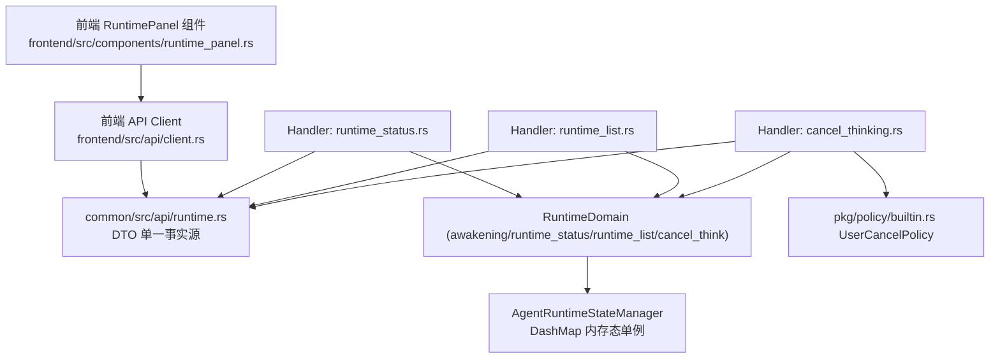
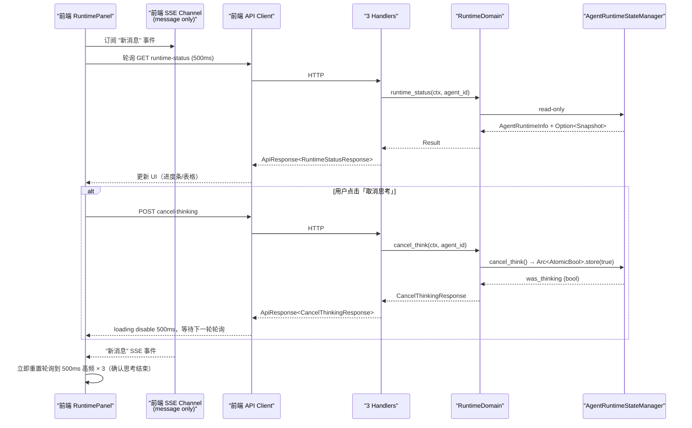
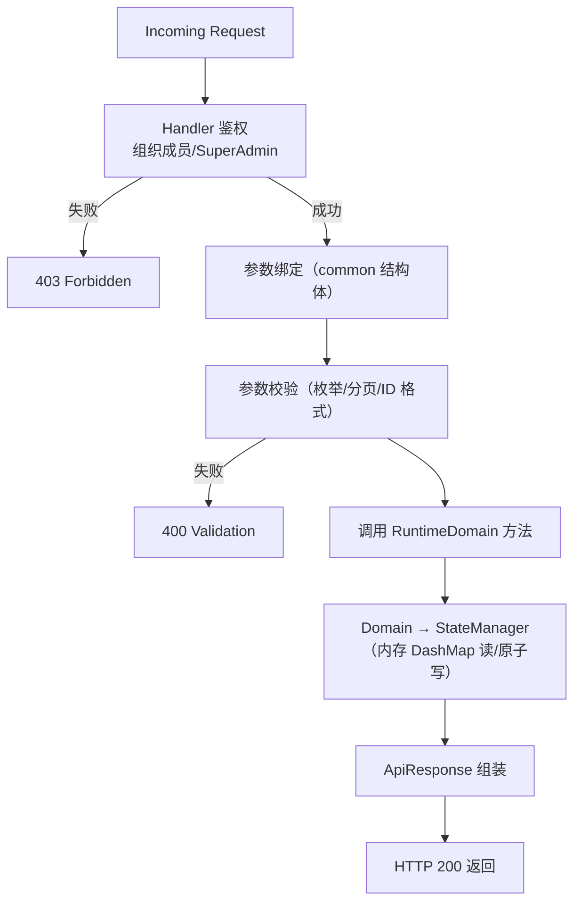
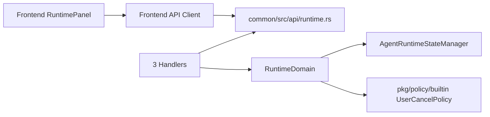

# 思考运行时面板观测接口

<cite>
**本文引用的文件**
- [src/handlers/hr/agent/runtime_status.rs](src/handlers/hr/agent/runtime_status.rs)
- [src/handlers/hr/agent/runtime_list.rs](src/handlers/hr/agent/runtime_list.rs)
- [src/handlers/hr/agent/cancel_thinking.rs](src/handlers/hr/agent/cancel_thinking.rs)
- [common/src/api/runtime.rs](common/src/api/runtime.rs)
- [frontend/src/components/runtime_panel.rs](frontend/src/components/runtime_panel.rs)
- [frontend/src/api/client.rs](frontend/src/api/client.rs)
- [src/pkg/agent_runtime_state.rs](src/pkg/agent_runtime_state.rs)
- [src/service/domain/runtime/mod.rs](src/service/domain/runtime/mod.rs)
- [src/pkg/policy/builtin.rs](src/pkg/policy/builtin.rs)

**本文关联三类文档**
- 【① Design 决策快照】[thinking_task_policy_engine_design.md](docs/design/thinking_task_policy_engine_design.md) §三 L60-L95 接口层与前端方案（为什么纯轮询不扩展 SSE、cancel 路径 domain 归属决策）
- 【② Plan 落地快照】占位：待 [2026-08-14-policy-engine-and-think-runtime.md](docs/superpowers/plans/2026-08-14-policy-engine-and-think-runtime.md) 由 ai-orz-doc-maintainer 精简到 docs/plan/ 后回填（现参考 superpowers 执行蓝图 §File Structure 表格 + §P3/P4 实施阶段）
- 【④ RAG 原子知识卡】
  - [思考运行时前端观测：runtime-status cancel-thinking runtime-list 接口与 runtime_panel 组件](docs/wiki/knowledge/zh/思考运行时前端观测：runtime-status%20cancel-thinking%20runtime-list%20接口与%20runtime_panel%20组件/思考运行时前端观测：runtime-status%20cancel-thinking%20runtime-list%20接口与%20runtime_panel%20组件.md) — 硬约束清单（DTO 定义位置、轮询退避、cancel 幂等、禁止裸响应）
  - [Agent 思考运行时 AgentThinkRuntime：挂载清理取消与每轮快照上报](docs/wiki/knowledge/zh/Agent%20思考运行时%20AgentThinkRuntime：挂载清理取消与每轮快照上报/Agent%20思考运行时%20AgentThinkRuntime：挂载清理取消与每轮快照上报.md) — think_runtime 内存快照结构与清理路径
  - [思考退出原因 exit_reason 统计与 ThinkRoundEvent AOP 事件链路](docs/wiki/knowledge/zh/思考退出原因%20exit_reason%20统计与%20ThinkRoundEvent%20AOP%20事件链路/思考退出原因%20exit_reason%20统计与%20ThinkRoundEvent%20AOP%20事件链路.md) — exit_reason 字符串映射（前端面板展示用）
- 【③ Wiki 关联长文】
  - [运行时领域.md](docs/wiki/zh/content/核心模块/服务层/领域层/运行时领域.md) §5 思考运行时挂载（生命周期、幂等、cancel 信号机制）
  - [Runtime 领域编排.md](docs/wiki/zh/content/架构设计/分层架构设计/Domain%20层编排/Runtime%20领域编排.md) §5 RuntimeDomain 三个观测/编排接口
</cite>

## 目录
1. [简介](#简介)
2. [项目结构](#项目结构)
3. [核心组件](#核心组件)
4. [架构总览](#架构总览)
5. [详细组件分析](#详细组件分析)
6. [依赖关系分析](#依赖关系分析)
7. [性能与并发](#性能与并发)
8. [故障排查指南](#故障排查指南)
9. [结论](#结论)
10. [附录：编排示例](#附录编排示例)

## 更新摘要
**Batch1 2026-08-17 新建**：本长文同步 3 个后端 HTTP 观测 Handler（runtime-status / runtime-list / cancel-thinking）接入、common/src/api/runtime.rs DTO 单一事实源协议、前端 RuntimePanel 组件实现、消息 SSE 事件联动的完整观测链路。§8 故障排查 3 条，cite 区完整四类文档互引。

## 简介
本文件面向「思考运行时前端观测接口」，系统化说明 3 个后端 HTTP 观测 Handler 与前端 RuntimePanel 组件的接口契约、DTO 协议、鉴权边界、轮询策略、cancel 按钮 UX 行为、消息 SSE 联动、隐私字段保护等，帮助读者理解「Agent 正在思考的实时状态如何通过接口安全地展示给前端并支持取消操作」，并给出定位问题与扩展字段的业务模式与流程图示。

## 项目结构
思考运行时观测链路分布在 4 层：
- Adapter（Handler 层）：src/handlers/hr/agent/ 下 3 个独立 Handler 文件，每个业务方法一个独立文件，参数结构体化通过 common api 引用。
- Domain（领域层）：RuntimeDomain.awakening() / runtime_status() / runtime_list() / cancel_think()，只暴露能力接口，实现内部调用 AgentRuntimeStateManager pkg 单例。
- DTO（前后端协议层）：common/src/api/runtime.rs — 前后端共用单一事实源；前端 /frontend/src/api/ 通过 pub use common::api::runtime::* 复用（禁止本地镜像）。
- Frontend（组件层）：frontend/src/components/runtime_panel.rs（RuntimePanel 组件）+ frontend/src/pages/agent/*（对话页/详情页嵌入 panel）。

**图表来源**
- [common/src/api/runtime.rs:1-Lm](common/src/api/runtime.rs#L1-L200)
- [frontend/src/components/runtime_panel.rs:1-Lm](frontend/src/components/runtime_panel.rs#L1-L300)
- [src/handlers/hr/agent/runtime_status.rs:1-Lm](src/handlers/hr/agent/runtime_status.rs#L1-L80)
- [src/handlers/hr/agent/runtime_list.rs:1-Lm](src/handlers/hr/agent/runtime_list.rs#L1-L80)
- [src/handlers/hr/agent/cancel_thinking.rs:1-Lm](src/handlers/hr/agent/cancel_thinking.rs#L1-L60)

**章节来源**
- [frontend/src/components/runtime_panel.rs](frontend/src/components/runtime_panel.rs)
- [common/src/api/runtime.rs](common/src/api/runtime.rs)
- [src/service/domain/runtime/mod.rs:248-399](src/service/domain/runtime/mod.rs#L248-L399)
- [docs/design/thinking_task_policy_engine_design.md §九](docs/design/thinking_task_policy_engine_design.md#L601-L650)

## 核心组件
- **RuntimeStatus Handler**：GET /agents/{id}/runtime-status，参数鉴权（组织下成员可见/SuperAdmin 不受限）→ 调 RuntimeDomain.runtime_status() → 返回 RuntimeStatusResponse{ status: AgentStatus, message_id/task_id/project_id, think_snapshot: Option<ThinkRuntimeSnapshotDTO> }。
- **RuntimeList Handler**：GET /agents/runtime-list，organization_id 严格从 ctx 解析（禁止前端传入避免越权），支持 status filter + pagination，返回 PagedResult<RuntimeListItem>；严格遵循通用 count 规范，count 与 list 复用同一过滤函数。
- **CancelThinking Handler**：POST /agents/{id}/cancel-thinking，返回 CancelThinkingResponse{ success: bool, was_thinking: bool }（结构体化禁止裸 bool；success=true 表示取消信号已送达；was_thinking=true 表示确实命中了正在思考的 Agent，前端用于区分 toast 文案「取消成功 / 无需取消」）。
- **RuntimePanel 组件**：props 支持单 agent 模式（对话页内嵌）与 list_mode 模式（组织/概览页），use_resource 轮询；进度条 = rounds/max_rounds 百分比；2 列表格展示 scene/rounds/elapsed/tokens/current_tool/last_exit_reason；取消按钮 POST 后 loading 500ms 防双击；轮询间隔自适应（思考中 500ms / 空闲 2s / 连续 10 次 idle 退避到 5s）。
- **DTO 协议（common/src/api/runtime.rs）**：RuntimeStatusRequest / RuntimeStatusResponse / RuntimeListRequest / RuntimeListResponse / RuntimeListItem / CancelThinkingResponse / ThinkRuntimeSnapshotDTO。**DTO 字段名与 AgentRuntimeInfo + ThinkRuntimeSnapshot 内存结构体字段一一对应**，禁止前后端手工字段映射（避免字段漂移）。

**章节来源**
- [src/handlers/hr/agent/runtime_status.rs](src/handlers/hr/agent/runtime_status.rs)
- [src/handlers/hr/agent/runtime_list.rs](src/handlers/hr/agent/runtime_list.rs)
- [src/handlers/hr/agent/cancel_thinking.rs](src/handlers/hr/agent/cancel_thinking.rs)
- [common/src/api/runtime.rs](common/src/api/runtime.rs)
- [frontend/src/components/runtime_panel.rs](frontend/src/components/runtime_panel.rs)

## 架构总览
观测链路严格遵循分层架构（Adapter → Domain → pkg），**Handler 绝不直接访问 AgentRuntimeStateManager DashMap**；前端与后端 DTO 协议完全由 common crate 驱动，前端零本地镜像。前端观测方式按 design 决策为「纯轮询 + 消息 SSE 触发重置」：纯轮询接口拿运行时快照；不扩展 SSE 推思考事件（SSE 通道保持纯净，只推 message）。思考结束的天然通知通道是 message SSE（Agent 产出最终消息），收到新消息 SSE 事件时 RuntimePanel 立即重置轮询为 500ms 高频 3 次（快速更新状态），之后按 idle 退避到 2s/5s。

**图表来源**
- [docs/design/thinking_task_policy_engine_design.md §八 §九](docs/design/thinking_task_policy_engine_design.md#L519-L650)
- [src/pkg/agent_runtime_state.rs:Ln-Lm](src/pkg/agent_runtime_state.rs#L31-L157)

**章节来源**
- [frontend/src/components/runtime_panel.rs](frontend/src/components/runtime_panel.rs)
- [common/src/api/runtime.rs](common/src/api/runtime.rs)
- [src/pkg/agent_runtime_state.rs:31-157](src/pkg/agent_runtime_state.rs#L31-L157)

## 详细组件分析

### 接口契约与鉴权边界（Handler 层）
- **runtime-status 鉴权**：必须校验当前 ctx.user 属于 agent.organization_id；SuperAdmin 不受限；对于非当前组织的 Agent 即使传入 id 也要返回 403（禁止跨组织探测运行态）。
- **runtime-list 过滤**：organization_id 一律从 ctx 当前用户所属组织解析（SuperAdmin 可选传 organization_id，其他用户禁止传）；status 枚举值必须是 common/enums 中 AgentStatus 的子集（禁止自由字符串）。
- **cancel-thinking 幂等性**：连续 N 次调用 cancel-thinking 返回 success=true，只有第一次 was_thinking=true（其余 false）。前端必须容忍 was_thinking=false（重复点击），不展示错误 toast，只展示 info 级别「已取消 / 无需取消」。
- **DTO 结构体化（AGENTS §4.11 强约束）**：所有 3 个接口的 Request/Response 必须是结构体（Request 无字段时定义空 struct，禁止提取裸 Path/Body）；Response 禁止裸 bool / () / String。CancelThinkingResponse 即使只有 2 字段也要结构体化。
- **分页与 count 规范（AGENTS §4.9 强约束）**：runtime-list 返回 PagedResult<RuntimeListItem>，即使是内存态 DashMap 也要遵循 PagedResult T，不允许直接返回 Vec；count(query) 与 list(query) 必须**完全复用同一套 push_query_filters**，禁止各写一套过滤逻辑（防止分页显示不一致）。

**章节来源**
- [src/handlers/hr/agent/runtime_status.rs](src/handlers/hr/agent/runtime_status.rs)
- [src/handlers/hr/agent/runtime_list.rs](src/handlers/hr/agent/runtime_list.rs)
- [src/handlers/hr/agent/cancel_thinking.rs](src/handlers/hr/agent/cancel_thinking.rs)
- [common/src/api/runtime.rs](common/src/api/runtime.rs)

### 前端 RuntimePanel 组件（轮询/UX/隐私保护）
- **Props 模式**：单 Agent 模式 props.agent_id = Some("xxx") + props.list_mode = false（对话页嵌入）；全局运行列表 props.list_mode = true（监控页使用，内部直接调 runtime-list，不传 agent_id）。
- **轮询退避策略**：`interval_ms = match status { Busy => 500ms, Resting => 1s, Idle => 2s, 连续 10 次 Idle => 5s }`。消息 SSE 收到新 message 事件 → 立即强制 3 次 500ms 高频轮询（快速更新结束状态）之后回到退避逻辑。
- **取消按钮 UX**：点击 → disable + true loading，请求完成后 disable 保留 500ms（防止下一轮轮询返回前的双击）；was_thinking=true 显示 success toast「思考已取消」；was_thinking=false 显示 info toast「当前没有在思考」；请求失败显示 error toast。
- **UI 字段展示**：进度条 = round_number / max_rounds（max_rounds=0 时显示 NaN 防护，显示 --）；表格 2 列：Scene / 当前轮次 / 已用时间（秒格式化成 mm:ss）/ 输入 tokens / 输出 tokens / 当前工具调用 / 最近退出原因。
- **隐私保护红线**：think_snapshot 禁止暴露 prompt 内容 / 历史消息原文 / LLM 响应原文；current_tool_call 只展示工具名称 + 参数 hash，禁止展示 args 明文（否则会泄露用户输入的敏感参数）；RuntimeListItem 列表页更严格，不展示 current_tool_call 字段（仅 agent 基本信息 + 思考统计）。
- **错误处理**：HTTP 403/401 立即停止轮询，显示「权限不足」提示文字；HTTP 5xx 保持轮询（指数退避 2s→4s→8s→max 8s），不 crash。

**章节来源**
- [frontend/src/components/runtime_panel.rs](frontend/src/components/runtime_panel.rs)
- [frontend/src/api/client.rs](frontend/src/api/client.rs)

### DTO 协议与字段映射（common 单一事实源）
ThinkRuntimeSnapshotDTO 字段与内存 ThinkRuntimeSnapshot 结构体**字段名严格一致，类型通过 From 实现自动转换**：

| 字段（DTO / Memory）| 类型 | 展示用途 | 隐私红线 |
|------|------|--------|---------|
| agent_id | String | 面板头部确认 | 可展示 |
| trace_id | String | 点击跳日志 | 可展示（不泄露隐私） |
| scene | String（6 枚举值：intent-analyze/awaken/settle/summary）| 表格「场景」 | 可展示 |
| round_number | usize | 进度条分子 / 表格「当前轮次」 | 可展示 |
| max_rounds | usize | 进度条分母 | 可展示 |
| elapsed_ms | u64 | 格式化成 mm:ss | 可展示 |
| tokens_input | u64 | 表格「输入 tokens」 | 可展示 |
| tokens_output | u64 | 表格「输出 tokens」 | 可展示 |
| current_tool_call_name | Option<String> | 表格「当前工具调用」（只显示名称） | **禁止显示 args 明文** |
| last_exit_reason | Option<String>（6 exit_reason 字符串）| 表格「最近退出原因」 | 可展示 |

**章节来源**
- [common/src/api/runtime.rs](common/src/api/runtime.rs)
- [src/pkg/agent_runtime_state.rs:Ln-Lm](src/pkg/agent_runtime_state.rs#L31-L157)（ThinkRuntimeSnapshot 内存结构）

## 依赖关系分析
- **单向依赖（严格分层）**：RuntimePanel（frontend bin）→ common/api/runtime.rs（DTO）；Handler（src/handlers）→ common/api/runtime.rs + Domain（RuntimeDomain）→ pkg（AgentRuntimeStateManager/policy）；无反向依赖。
- **RuntimeDomain 不直接返回 PO**：通过 AgentRuntimeInfo（业务实体）对外输出；DTO 转换在 Handler 内部用 From/Into 薄转换（禁止 Domain 感知 DTO）。
- **前端 API client 不定义本地镜像**：frontend/src/api/client.rs 只做 HTTP 调用 + 参数构造，类型全部 use common::api::runtime::*；需要在本地聚合多接口的 ViewModel 时单独定义 frontend_only 结构体（名字必须明确后缀 ViewModel 避免混淆）。

**章节来源**
- [common/src/api/runtime.rs](common/src/api/runtime.rs)
- [src/service/domain/runtime/mod.rs:248-399](src/service/domain/runtime/mod.rs#L248-L399)

## 性能与并发
- **轮询退避 + SSE 触发重置**：思考中 500ms / 空闲 2-5s 退避降低 CPU/网络开销（相比固定 500ms，空闲时开销降低 4-10 倍）；SSE 触发 3 次高频重置保证结束状态实时可见。
- **读完全无副作用**：runtime-status/runtime-list 只读 DashMap（DashMap 自身并发安全，读不加锁），单次查询 O(n) 组织过滤，内存态下组织 Agent 数小于 10^4 完全无感。
- **cancel 无阻塞**：cancel 路径只做 Arc<AtomicBool>.store(true) + 一次 Option 判断，无 await、无锁、无事件发布，延迟 < 100ns。
- **列表分页**：即使是内存态 DashMap 也按 PagedResult 截断返回；组织下 10^3 Agent 时分页只返回 20/页，降低前端渲染压力。

[本节除特别说明外不直接引用具体文件]

## 故障排查指南
- **RuntimePanel 始终显示「未在思考」（think_snapshot = None）但 Agent 实际 Busy**：
  ① 鉴权失败：确认当前登录用户属于 Agent.organization_id（非 SuperAdmin 跨组织即使传了正确 id 也会返回 None 脱敏）；② 挂载顺序 bug：检查 awakening.rs 中 set_busy_with_think_runtime 是否在 BusyGuard 构造之前成功执行（中间若有提前 return 导致跳过挂载，则 Busy=true 但 think_runtime=None）。③ 前端 interval 退避到 5s：连续 10 次 idle 后 5s 刷新一次，可手动刷新或触发一次消息 SSE 立即重置轮询。
- **cancel-thinking was_thinking=true 显示「取消成功」但 10s 后 Agent 仍显示 Busy**：
  ① 当前轮次的 brain_dal.think() LLM 调用卡请求（LLM 超过 300s 超时未返回）：UserCancelPolicy 是「每轮开始前 evaluate 检查」，卡在 LLM 请求中时不会命中取消，等超时返回后下一轮才退出；此时可看 trace_id 日志定位到轮次卡住；② think_loop 中 policy.evaluate() 调用被跳过：检查 awakening 新增退出分支是否漏掉了 policy 评估（比如早期 ContextOverflow 独立判断提前退出，直接走 sleep_and_settle 不经过 policy evaluate）。③ 极端：BusyGuard.drop 未执行 → 直接检查 BusyGuard 构造时机是否在 set_busy_with_think_runtime 之后立即构造，中间无任何可能提前 return 的语句。
- **runtime-list 分页器显示总数 23 但实际只看到 15 条 / 翻页最后一页为空**：count 与 list 过滤条件不一致。严格检查：count(query) 的 DashMap 过滤谓词 与 list(query) 的过滤谓词是否是**同一个函数/闭包**（禁止把同一条件分别写两个闭包分别传入）。测试覆盖：为 runtime-list 写测试，构造 N 条记录并断言 count == list.len() 在不同 filter 组合下均相等。
- **面板显示 exit_reason 是「空字符串 / Unknown」**：前端 RuntimePanel 组件对 last_exit_reason 缺默认兜底文案；同时后端新增 exit_reason 值时需同时在前端加 display 映射；检查 common/src/api/runtime.rs 注释中列出的 6 种 exit_reason 与前端映射是否完全对齐（前端新增条目必须同步 6 字符串到中文/英文展示映射）。

## 结论
思考运行时观测链路通过严格分层（Handler 只鉴权/Domain 只编排/pkg 只实现）与 common DTO 单一事实源协议，零本地镜像、零裸响应、零 count 重复逻辑。纯轮询 + SSE 触发重置在开销与实时性之间取得平衡（空闲时开销降低 4-10 倍）；cancel 信号只做原子置位 + 幂等返回，不阻塞、不发事件，保持运行时链路简单无副作用。整体设计支持新增字段时「内存结构 → DTO → 前端表格」一处改三处跟随，便于维护与扩展。

## 附录：编排示例

### 示例一：Agent 对话页嵌入 RuntimePanel（单 Agent 模式）
- 步骤要点：
  - 进入对话页：Props.agent_id = 当前 Agent id，list_mode=false，启动 use_resource 轮询。
  - status=Busy：interval=500ms，进度条 + 表格实时更新。
  - 用户点击取消思考按钮：POST cancel-thinking，loading 500ms，等待下一轮轮询。
  - 收到 message SSE 新消息：立即强制 3 次 500ms 高频轮询确认结束 → 回到 2s idle 退避。
- **字段展示**：进度条（rounds/max_rounds）；表格 7 行：场景/轮次/耗时/输入 tokens/输出 tokens/当前工具/退出原因。
- **隐私保护**：RuntimeStatus 响应中即使 think_snapshot 携带 tools 参数，组件也只显示工具名，不展示 args 明文（组件内 `current_tool_call_name` 字段强制截断）。

**章节来源**
- [frontend/src/components/runtime_panel.rs](frontend/src/components/runtime_panel.rs)
- [src/handlers/hr/agent/runtime_status.rs](src/handlers/hr/agent/runtime_status.rs)
- [src/handlers/hr/agent/cancel_thinking.rs](src/handlers/hr/agent/cancel_thinking.rs)

### 示例二：组织概览页「运行中 Agent」卡片（list_mode 模式）
- 步骤要点：
  - Props.list_mode = true，不传 agent_id；默认 organization_id 从 ctx（登录态）解析，禁止手动传入。
  - 调 runtime-list：status=Busy+Resting，page_size=20，按 updated_at desc。
  - 每行显示：Agent Name（跳转详情链接）/ Scene / 进度 / 耗时 / tokens / 所属 task_id（跳转链接）/ 所属 project_id（跳转链接）/ 取消按钮（仅 Busy 可点）。
  - 顶部 Tab：[全部 / 按任务 / 按项目] 3 个视图切换（直接在已拉到的 RuntimeListItem 上前端重新分组计算，不触发后端请求）。

**章节来源**
- [frontend/src/components/runtime_panel.rs: list_mode 分支](frontend/src/components/runtime_panel.rs)
- [src/handlers/hr/agent/runtime_list.rs](src/handlers/hr/agent/runtime_list.rs)
- [common/src/api/runtime.rs](common/src/api/runtime.rs)
