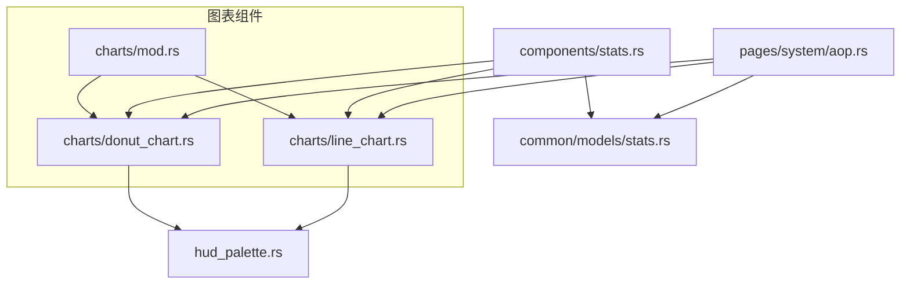
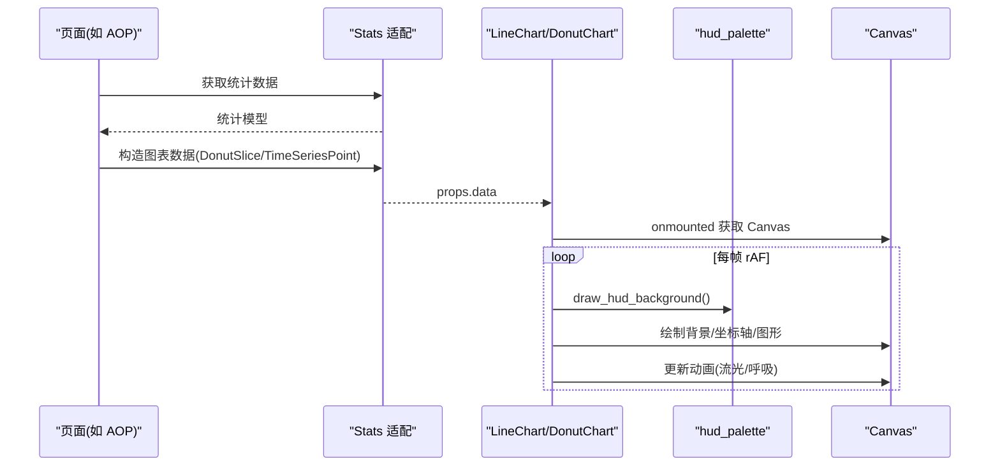
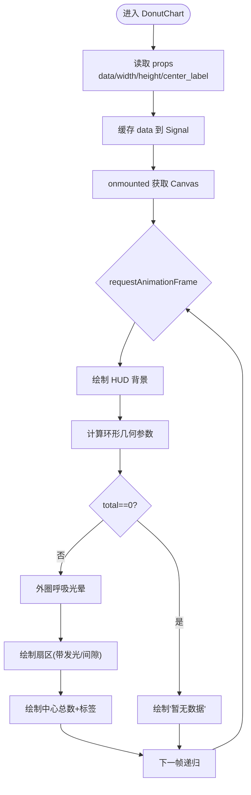
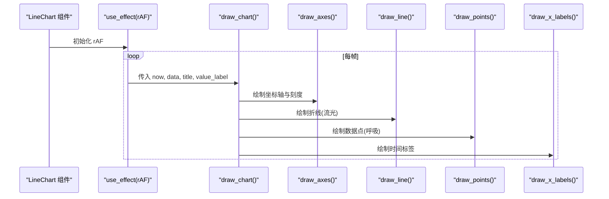
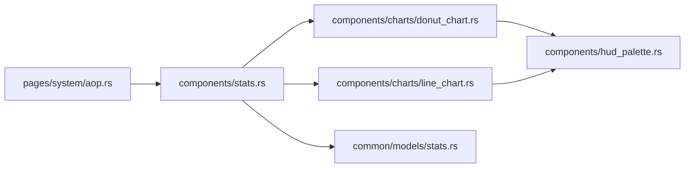

# 图表组件

<cite>
**本文引用的文件**
- [frontend/src/components/charts/mod.rs](frontend/src/components/charts/mod.rs)
- [frontend/src/components/charts/donut_chart.rs](frontend/src/components/charts/donut_chart.rs)
- [frontend/src/components/charts/line_chart.rs](frontend/src/components/charts/line_chart.rs)
- [frontend/src/components/chart_scene.rs](frontend/src/components/chart_scene.rs)
- [frontend/src/components/hud_palette.rs](frontend/src/components/hud_palette.rs)
- [frontend/src/components/stats.rs](frontend/src/components/stats.rs)
- [common/src/models/stats.rs](common/src/models/stats.rs)
- [frontend/src/pages/system/aop.rs](frontend/src/pages/system/aop.rs)

### 本文关联的三类文档（四类互引闭环）

**① 设计文档（Design）**：
- [Canvas 渲染与可视化手册](docs/design/canvas_rendering_playbook.md) — HUD 风格 Canvas 渲染、图表与知识图谱可视化规范

**② 落地计划（Plan）**：
- [知识图谱推荐起点与组件复用重构](docs/plan/知识图谱推荐起点与组件复用重构.md) — 知识图谱推荐起点与 Canvas 组件复用重构
- [统计图表Phase1基础设施与时序图展示重构](docs/plan/统计图表Phase1基础设施与时序图展示重构.md) — 图表组件落地点与前后端对接

**④ RAG 原子知识卡**：
- [Canvas HUD 可视化 RAG 卡](docs/wiki/knowledge/zh/Canvas%20HUD%20%E5%8F%AF%E8%A7%86%E5%8C%96%EF%BC%9AGraphCanvas%20%E7%9F%A5%E8%AF%86%E5%9B%BE%E8%B0%B1%20+%20%E5%9B%BE%E8%A1%A8%E5%9C%BA%E6%99%AFLineDonut%20+%20%E4%BB%AA%E8%A1%A8%E7%9B%98Gauge%E5%8F%8C%E7%89%88%20+%20HudPalette%E6%A9%99%E5%85%89%E5%85%89%E6%99%95/Canvas%20HUD%20%E5%8F%AF%E8%A7%86%E5%8C%96%EF%BC%9AGraphCanvas%20%E7%9F%A5%E8%AF%86%E5%9B%BE%E8%B0%B1%20+%20%E5%9B%BE%E8%A1%A8%E5%9C%BA%E6%99%AFLineDonut%20+%20%E4%BB%AA%E8%A1%A8%E7%9B%98Gauge%E5%8F%8C%E7%89%88%20+%20HudPalette%E6%A9%99%E5%85%89%E5%85%89%E6%99%95.md) — GraphCanvas + Line/Donut + Gauge 仪表盘速查
</cite>

## 目录
1. [简介](#简介)
2. [项目结构](#项目结构)
3. [核心组件](#核心组件)
4. [架构总览](#架构总览)
5. [详细组件分析](#详细组件分析)
6. [依赖关系分析](#依赖关系分析)
7. [性能与响应式](#性能与响应式)
8. [数据绑定与实时更新](#数据绑定与实时更新)
9. [使用示例与最佳实践](#使用示例与最佳实践)
10. [故障排查](#故障排查)
11. [结论](#结论)

## 简介
本章节面向 AI Orz 前端应用中的图表组件，覆盖环形图、折线图的数据格式、配置项、交互与样式定制，以及生命周期管理、性能优化、响应式适配和与数据源的绑定方式。文档基于仓库中实际实现进行说明，确保可追溯与可落地。

## 项目结构
图表相关代码集中在 frontend/src/components/charts 下，包含模块入口、环形图与折线图实现；HUD 风格背景与配色由 hud_palette 提供；统计面板 stats 将后端统计模型映射为图表数据；页面层（如 system/aop）演示了图表在业务场景中的组合使用。

**图示来源**
- [frontend/src/components/charts/mod.rs:1-4](frontend/src/components/charts/mod.rs#L1-L4)
- [frontend/src/components/charts/donut_chart.rs:1-340](frontend/src/components/charts/donut_chart.rs#L1-L340)
- [frontend/src/components/charts/line_chart.rs:1-422](frontend/src/components/charts/line_chart.rs#L1-L422)
- [frontend/src/components/hud_palette.rs:1-123](frontend/src/components/hud_palette.rs#L1-L123)
- [frontend/src/components/stats.rs:1-261](frontend/src/components/stats.rs#L1-L261)
- [common/src/models/stats.rs:1-172](common/src/models/stats.rs#L1-L172)
- [frontend/src/pages/system/aop.rs:1-554](frontend/src/pages/system/aop.rs#L1-L554)

**章节来源**
- [frontend/src/components/charts/mod.rs:1-4](frontend/src/components/charts/mod.rs#L1-L4)
- [frontend/src/components/charts/donut_chart.rs:1-340](frontend/src/components/charts/donut_chart.rs#L1-L340)
- [frontend/src/components/charts/line_chart.rs:1-422](frontend/src/components/charts/line_chart.rs#L1-L422)
- [frontend/src/components/hud_palette.rs:1-123](frontend/src/components/hud_palette.rs#L1-L123)
- [frontend/src/components/stats.rs:1-261](frontend/src/components/stats.rs#L1-L261)
- [common/src/models/stats.rs:1-172](common/src/models/stats.rs#L1-L172)
- [frontend/src/pages/system/aop.rs:1-554](frontend/src/pages/system/aop.rs#L1-L554)

## 核心组件
- 环形图 DonutChart：消费分类数据 Vec<DonutSlice>，绘制 HUD 风格环形图，支持中心标签、发光扇区、外圈呼吸光晕与图例展示。
- 折线图 LineChart：消费时序数据 Vec<TimeSeriesPoint>，绘制 HUD 风格折线趋势图，支持标题、数值轴标签、坐标轴刻度、X 轴时间标签、流光虚线与数据点呼吸光晕。
- HUD 背景与配色：统一深色渐变背景、网格与四角装饰，保证视觉一致性。
- 统计面板：将后端统计模型转换为图表所需数据结构并渲染。

**章节来源**
- [frontend/src/components/charts/donut_chart.rs:21-43](frontend/src/components/charts/donut_chart.rs#L21-L43)
- [frontend/src/components/charts/line_chart.rs:21-34](frontend/src/components/charts/line_chart.rs#L21-L34)
- [frontend/src/components/hud_palette.rs:1-123](frontend/src/components/hud_palette.rs#L1-L123)
- [frontend/src/components/stats.rs:1-261](frontend/src/components/stats.rs#L1-L261)

## 架构总览
图表组件采用“数据驱动 + Canvas 渲染”的架构：
- 数据层：后端统计模型 TimeSeriesPoint、ToolCallSummary 等通过 API 返回到前端。
- 适配层：stats 页面组件将领域统计对象映射为图表 Props（DonutSlice、TimeSeriesPoint）。
- 渲染层：LineChart/DonutChart 使用 requestAnimationFrame 循环绘制，HUD 背景工具统一视觉风格。
- 扩展层：chart_scene.rs 预留 ChartRenderer trait，便于未来抽取通用渲染逻辑。

**图示来源**
- [frontend/src/pages/system/aop.rs:349-531](frontend/src/pages/system/aop.rs#L349-L531)
- [frontend/src/components/stats.rs:19-87](frontend/src/components/stats.rs#L19-L87)
- [frontend/src/components/charts/line_chart.rs:36-143](frontend/src/components/charts/line_chart.rs#L36-L143)
- [frontend/src/components/charts/donut_chart.rs:45-187](frontend/src/components/charts/donut_chart.rs#L45-L187)
- [frontend/src/components/hud_palette.rs:37-45](frontend/src/components/hud_palette.rs#L37-L45)

## 详细组件分析

### 环形图 DonutChart
- 数据格式
  - 输入：Vec<DonutSlice>，每个切片包含 label、value、color。
  - 输出：HUD 风格环形图，中心显示总数与可选标签，右侧图例显示占比百分比。
- 配置选项
  - width、height：画布尺寸（CSS 像素），默认 240x240。
  - center_label：中心标签文本。
- 交互与样式
  - 扇区间隙、阴影发光、外圈呼吸光晕（2.4s 周期）。
  - 图例使用 Dioxus + DaisyUI 渲染，避免 Canvas 文字模糊。
- 生命周期与动画
  - 使用 use_effect + requestAnimationFrame 实现持续渲染。
  - 组件卸载时停止动画，释放资源。
- 空数据处理
  - 当 total=0 时绘制“暂无数据”。

**图示来源**
- [frontend/src/components/charts/donut_chart.rs:45-187](frontend/src/components/charts/donut_chart.rs#L45-L187)
- [frontend/src/components/charts/donut_chart.rs:189-292](frontend/src/components/charts/donut_chart.rs#L189-L292)

**章节来源**
- [frontend/src/components/charts/donut_chart.rs:21-43](frontend/src/components/charts/donut_chart.rs#L21-L43)
- [frontend/src/components/charts/donut_chart.rs:45-187](frontend/src/components/charts/donut_chart.rs#L45-L187)
- [frontend/src/components/charts/donut_chart.rs:189-292](frontend/src/components/charts/donut_chart.rs#L189-L292)

### 折线图 LineChart
- 数据格式
  - 输入：Vec<TimeSeriesPoint>，按时间升序，包含 interval_start、tokens_input、tokens_output、call_count。
- 配置选项
  - width、height：画布尺寸（CSS 像素），默认 600x200。
  - title：左上角标题。
  - value_label：Y 轴数值描述。
- 交互与样式
  - HUD 背景、坐标轴刻度、X 轴时间标签（M-D 短日期）。
  - 折线流光（虚线滚动）、数据点呼吸光晕（2.4s 周期）。
- 生命周期与动画
  - 使用 requestAnimationFrame 循环绘制，组件卸载时清理。
- 空数据处理
  - 无数据时绘制“暂无时序数据”。

**图示来源**
- [frontend/src/components/charts/line_chart.rs:36-143](frontend/src/components/charts/line_chart.rs#L36-L143)
- [frontend/src/components/charts/line_chart.rs:145-224](frontend/src/components/charts/line_chart.rs#L145-L224)
- [frontend/src/components/charts/line_chart.rs:226-392](frontend/src/components/charts/line_chart.rs#L226-L392)

**章节来源**
- [frontend/src/components/charts/line_chart.rs:21-34](frontend/src/components/charts/line_chart.rs#L21-L34)
- [frontend/src/components/charts/line_chart.rs:36-143](frontend/src/components/charts/line_chart.rs#L36-L143)
- [frontend/src/components/charts/line_chart.rs:145-392](frontend/src/components/charts/line_chart.rs#L145-L392)

### HUD 背景与配色
- 提供统一的 HUD 背景绘制函数，包括基底色、径向光晕、网格与四角装饰。
- 颜色常量与 hex_to_rgba 工具用于一致的主题色控制。

**章节来源**
- [frontend/src/components/hud_palette.rs:1-123](frontend/src/components/hud_palette.rs#L1-L123)

### 统计面板与数据适配
- 将 AgentStats、ModelCallStats 等模型转换为图表数据：
  - ToolCallSummary.by_tool → DonutSlice[]
  - ModelCallStats.model_call_time_series → TimeSeriesPoint[]
- 提供多个统计面板组件（Agent/Project/Task/Tool/ModelProvider），统一卡片外壳与图表嵌入。

**章节来源**
- [frontend/src/components/stats.rs:1-261](frontend/src/components/stats.rs#L1-L261)
- [common/src/models/stats.rs:17-28](common/src/models/stats.rs#L17-L28)
- [common/src/models/stats.rs:85-149](common/src/models/stats.rs#L85-L149)

## 依赖关系分析
- 环形图与折线图均依赖 HUD 背景工具以保持一致视觉风格。
- 统计面板依赖 common 层的统计模型，作为图表数据源。
- 页面层（如 AOP）负责轮询数据并组装图表数据，再注入图表组件。

**图示来源**
- [frontend/src/pages/system/aop.rs:349-531](frontend/src/pages/system/aop.rs#L349-L531)
- [frontend/src/components/stats.rs:19-87](frontend/src/components/stats.rs#L19-L87)
- [frontend/src/components/charts/donut_chart.rs:189-292](frontend/src/components/charts/donut_chart.rs#L189-L292)
- [frontend/src/components/charts/line_chart.rs:145-224](frontend/src/components/charts/line_chart.rs#L145-L224)
- [frontend/src/components/hud_palette.rs:37-45](frontend/src/components/hud_palette.rs#L37-L45)
- [common/src/models/stats.rs:17-28](common/src/models/stats.rs#L17-L28)

**章节来源**
- [frontend/src/pages/system/aop.rs:349-531](frontend/src/pages/system/aop.rs#L349-L531)
- [frontend/src/components/stats.rs:19-87](frontend/src/components/stats.rs#L19-L87)
- [frontend/src/components/charts/donut_chart.rs:189-292](frontend/src/components/charts/donut_chart.rs#L189-L292)
- [frontend/src/components/charts/line_chart.rs:145-224](frontend/src/components/charts/line_chart.rs#L145-L224)
- [frontend/src/components/hud_palette.rs:37-45](frontend/src/components/hud_palette.rs#L37-L45)
- [common/src/models/stats.rs:17-28](common/src/models/stats.rs#L17-L28)

## 性能与响应式
- 高清屏适配：两个图表均在绘制前根据 devicePixelRatio 设置 canvas 宽高并缩放上下文，确保高分辨率清晰渲染。
- 动画性能：使用 requestAnimationFrame 循环绘制，并在组件卸载时停止动画，避免内存泄漏与无效计算。
- 数据缓存：通过 Signal 缓存 props.data，减少重复计算。
- 渲染优化：
  - 环形图仅在 total>0 时绘制扇区，否则快速返回提示。
  - 折线图对 X 轴标签进行采样，避免密集重叠。
- 响应式布局：
  - 图表容器使用 Tailwind/DaisyUI 类名，结合 CSS 宽度自适应。
  - 可通过 props.width/height 灵活控制尺寸。

**章节来源**
- [frontend/src/components/charts/donut_chart.rs:72-85](frontend/src/components/charts/donut_chart.rs#L72-L85)
- [frontend/src/components/charts/line_chart.rs:72-78](frontend/src/components/charts/line_chart.rs#L72-L78)
- [frontend/src/components/charts/donut_chart.rs:127-131](frontend/src/components/charts/donut_chart.rs#L127-L131)
- [frontend/src/components/charts/line_chart.rs:122-126](frontend/src/components/charts/line_chart.rs#L122-L126)
- [frontend/src/components/charts/line_chart.rs:351-382](frontend/src/components/charts/line_chart.rs#L351-L382)

## 数据绑定与实时更新
- 数据绑定：
  - 环形图：将 ToolCallSummary.by_tool 映射为 DonutSlice[]，颜色来自调色板循环。
  - 折线图：将 ModelCallStats.model_call_time_series 直接作为 TimeSeriesPoint[] 传入。
- 实时更新机制：
  - 页面层（如 AOP）使用定时器轮询接口，刷新 overview、time series、distribution 数据，并更新图表 props。
  - 图表内部通过 Signal 缓存数据，props.data 变化时自动重绘。
- 典型流程：
  - 页面加载 → 拉取统计 → 构造图表数据 → 渲染图表 → 定时刷新 → 更新数据 → 重绘。

**章节来源**
- [frontend/src/components/stats.rs:19-87](frontend/src/components/stats.rs#L19-L87)
- [frontend/src/pages/system/aop.rs:349-531](frontend/src/pages/system/aop.rs#L349-L531)
- [frontend/src/components/charts/donut_chart.rs:54-59](frontend/src/components/charts/donut_chart.rs#L54-L59)
- [frontend/src/components/charts/line_chart.rs:46-51](frontend/src/components/charts/line_chart.rs#L46-L51)

## 使用示例与最佳实践
- 在 Agent/Project/Task/Tool/ModelProvider 统计面板中嵌入图表：
  - 使用 StatsPanel 包裹，按需渲染折线图或环形图。
  - 当数据为空时不渲染图表，保持界面简洁。
- 在 AOP 监控页中组合多种图表：
  - 折线图展示事件趋势（最近 60 分钟）。
  - 双列环形图分别展示状态分布与消费者分布。
  - 5 秒轮询刷新，显示最后更新时间。
- 最佳实践：
  - 合理设置图表尺寸，避免在小屏上拥挤。
  - 使用 HUD 主题色与背景，保持整体风格一致。
  - 对大量数据点进行采样与格式化，提升可读性。
  - 在组件卸载时确保清理动画与监听器，防止内存泄漏。

**章节来源**
- [frontend/src/components/stats.rs:89-261](frontend/src/components/stats.rs#L89-L261)
- [frontend/src/pages/system/aop.rs:349-531](frontend/src/pages/system/aop.rs#L349-L531)

## 故障排查
- 图表不显示：
  - 检查 props.data 是否为空或 total=0，确认数据转换是否正确。
  - 确认 onmounted 已获取 Canvas 元素并设置 context。
- 动画卡顿或内存泄漏：
  - 确认 use_drop 中已停止 rAF 并释放 Closure。
  - 避免在高频回调中进行昂贵计算。
- 高分屏模糊：
  - 确认已根据 devicePixelRatio 设置 canvas 宽高并缩放上下文。
- 时间标签重叠：
  - 调整采样策略或字体大小，确保可读性。

**章节来源**
- [frontend/src/components/charts/donut_chart.rs:127-131](frontend/src/components/charts/donut_chart.rs#L127-L131)
- [frontend/src/components/charts/line_chart.rs:122-126](frontend/src/components/charts/line_chart.rs#L122-L126)
- [frontend/src/components/charts/line_chart.rs:351-382](frontend/src/components/charts/line_chart.rs#L351-L382)

## 结论
AI Orz 前端图表组件以 HUD 风格为核心，提供了环形图与折线图的完整实现，具备清晰的 API、良好的性能与响应式能力。通过 stats 适配层与页面层的数据绑定，实现了从后端统计到前端可视化的端到端链路。未来可扩展更多图表类型，并通过 chart_scene.rs 的 ChartRenderer trait 抽象通用渲染逻辑，进一步提升可维护性与复用性。