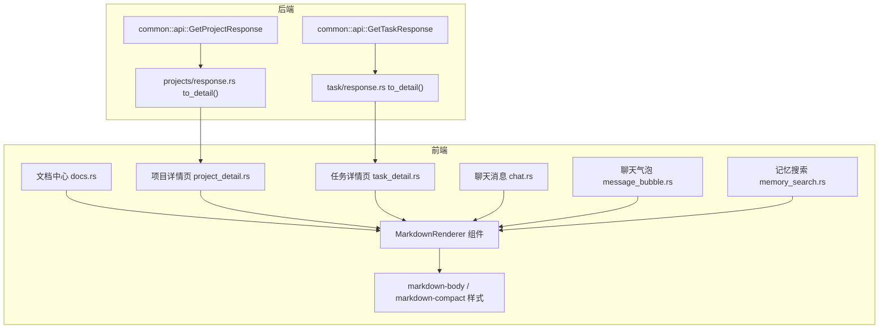
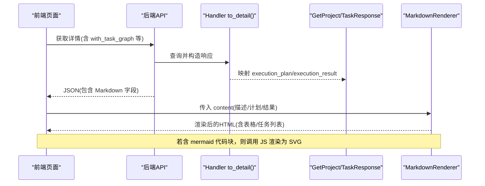
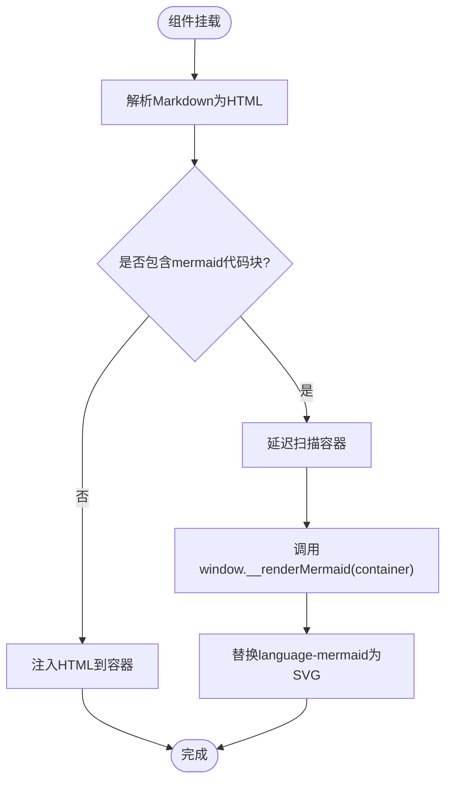
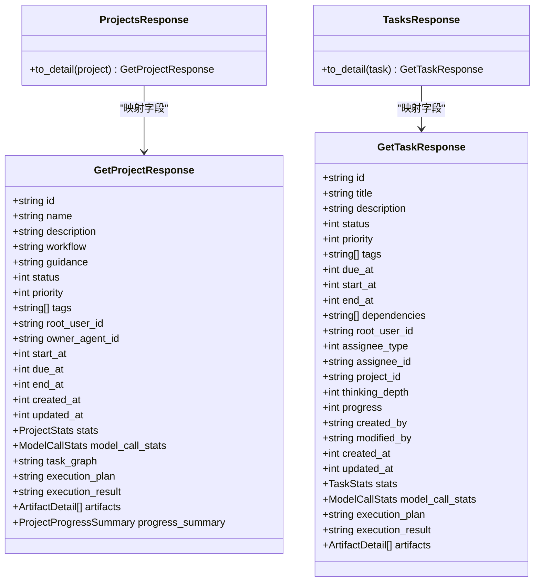
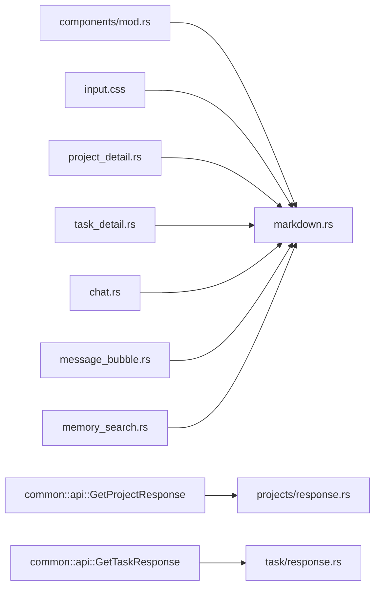

# Markdown渲染组件

<cite>
**本文引用的文件**   
- [frontend/src/components/markdown.rs](frontend/src/components/markdown.rs)
- [frontend/styles/input.css](frontend/styles/input.css)
- [frontend/src/pages/message/chat.rs](frontend/src/pages/message/chat.rs)
- [frontend/src/components/chat/message_bubble.rs](frontend/src/components/chat/message_bubble.rs)
- [frontend/src/pages/hr/memory_search.rs](frontend/src/pages/hr/memory_search.rs)
- [common/src/api/project.rs](common/src/api/project.rs)
- [common/src/api/task.rs](common/src/api/task.rs)
- [src/handlers/project/projects/response.rs](src/handlers/project/projects/response.rs)
- [src/handlers/project/task/response.rs](src/handlers/project/task/response.rs)
</cite>

## 更新摘要
**变更内容**
- 优化了Markdown渲染组件的compact模式，提升小容器场景下的显示效果
- 增强了性能优化，通过use_memo缓存HTML避免重复解析
- 改进了Mermaid图渲染机制，支持延迟扫描和JS互操作
- 完善了样式系统，提供紧凑模式专用样式类

## 目录
1. [简介](#简介)
2. [项目结构](#项目结构)
3. [核心组件](#核心组件)
4. [架构总览](#架构总览)
5. [详细组件分析](#详细组件分析)
6. [依赖关系分析](#依赖关系分析)
7. [性能考虑](#性能考虑)
8. [故障排查指南](#故障排查指南)
9. [结论](#结论)
10. [附录](#附录)

## 简介
本文件围绕"Markdown 渲染组件"的落地方案与实现进行系统化说明，覆盖前端可复用渲染组件、后端 DTO 读取链路补全、详情页/聊天消息/记忆内容的统一 Markdown 渲染，以及可选的 Mermaid 图支持。目标是：
- 提供统一的 Markdown 渲染能力（表格、删除线、任务列表等扩展语法）。
- 补全 Project/Task 执行计划与执行结果的读取链路，使 Agent 产出的 Markdown 内容可在前端正确展示。
- 将详情字段、聊天消息、记忆内容等 Markdown 性质字段从纯文本插值迁移到 Markdown 渲染。
- 在独立阶段引入 Mermaid 图渲染，用于任务依赖图等可视化场景。

## 项目结构
Markdown 渲染能力由前后端协同构成：
- 前端组件层：公共 Markdown 渲染组件与样式。
- 页面消费层：项目/任务详情、聊天消息、记忆搜索等页面按需使用。
- 后端 API 层：Project/Task 响应 DTO 新增执行计划/结果字段，Handler 映射持久化对象字段。

图示来源
- [frontend/src/components/markdown.rs:39-90](frontend/src/components/markdown.rs#L39-L90)
- [frontend/styles/input.css:203-372](frontend/styles/input.css#L203-L372)
- [frontend/src/pages/message/chat.rs:1243](frontend/src/pages/message/chat.rs#L1243)
- [frontend/src/components/chat/message_bubble.rs:73](frontend/src/components/chat/message_bubble.rs#L73)
- [frontend/src/pages/hr/memory_search.rs:170](frontend/src/pages/hr/memory_search.rs#L170)
- [common/src/api/project.rs:99-153](common/src/api/project.rs#L99-L153)
- [common/src/api/task.rs:136-194](common/src/api/task.rs#L136-L194)
- [src/handlers/project/projects/response.rs:20-45](src/handlers/project/projects/response.rs#L20-L45)
- [src/handlers/project/task/response.rs:25-53](src/handlers/project/task/response.rs#L25-L53)

章节来源
- [frontend/src/components/markdown.rs:39-90](frontend/src/components/markdown.rs#L39-L90)
- [frontend/styles/input.css:203-372](frontend/styles/input.css#L203-L372)
- [frontend/src/pages/message/chat.rs:1243](frontend/src/pages/message/chat.rs#L1243)
- [frontend/src/components/chat/message_bubble.rs:73](frontend/src/components/chat/message_bubble.rs#L73)
- [frontend/src/pages/hr/memory_search.rs:170](frontend/src/pages/hr/memory_search.rs#L170)
- [common/src/api/project.rs:99-153](common/src/api/project.rs#L99-L153)
- [common/src/api/task.rs:136-194](common/src/api/task.rs#L136-L194)
- [src/handlers/project/projects/response.rs:20-45](src/handlers/project/projects/response.rs#L20-L45)
- [src/handlers/project/task/response.rs:25-53](src/handlers/project/task/response.rs#L25-L53)

## 核心组件
- MarkdownRenderer 组件：封装 pulldown-cmark 渲染为 HTML，并通过 dangerous_inner_html 注入；支持 compact 模式；对含 mermaid 代码块的内容在挂载后调用 JS 渲染层替换为 SVG。
- render_markdown 函数：供非组件场景（如文档中心）复用，启用表格、删除线、任务列表扩展语法，并将原始 HTML 事件降级为文本，保证 XSS 安全。
- MermaidDiagram 组件：渲染裸 Mermaid 字符串，通过 window.__renderMermaidCode 注入到容器。

关键特性
- 缓存策略：使用 use_memo 按 content 缓存 HTML，避免长列表重复解析。
- 安全策略：原始 HTML 被转义为文本，禁止透传，dangerous_inner_html 注入安全。
- 主题适配：样式基于 DaisyUI 主题变量，自动适配多主题。
- 渐进增强：Mermaid 渲染为可选阶段，缺失 vendor 脚本时静默跳过。
- 紧凑模式：专为小容器场景优化的样式，收紧字号与边距。

章节来源
- [frontend/src/components/markdown.rs:39-165](frontend/src/components/markdown.rs#L39-L165)
- [frontend/styles/input.css:203-372](frontend/styles/input.css#L203-L372)

## 架构总览
Markdown 渲染贯穿"后端数据 → 前端组件 → 样式呈现"的全链路：
- 后端：Project/Task 响应 DTO 新增 execution_plan/execution_result 字段，Handler 映射持久化对象字段。
- 前端：详情页、聊天消息、记忆内容等消费 MarkdownRenderer；文档中心复用 render_markdown。
- 样式：markdown-body 与 markdown-compact 提供基础与紧凑两种视觉风格。

图示来源
- [src/handlers/project/projects/response.rs:20-45](src/handlers/project/projects/response.rs#L20-L45)
- [src/handlers/project/task/response.rs:25-53](src/handlers/project/task/response.rs#L25-L53)
- [common/src/api/project.rs:99-153](common/src/api/project.rs#L99-L153)
- [common/src/api/task.rs:136-194](common/src/api/task.rs#L136-L194)
- [frontend/src/components/markdown.rs:39-90](frontend/src/components/markdown.rs#L39-L90)

## 详细组件分析

### MarkdownRenderer 组件
职责
- 将 Markdown 源文本转换为 HTML，并注入到 div.markdown-body。
- 支持 compact 模式，用于聊天气泡、卡片摘要等小容器场景。
- 检测是否包含 mermaid 代码块，并在 DOM 挂载后调用全局渲染函数替换为 SVG。

实现要点
- 使用 pulldown-cmark 启用 TABLES、STRIKETHROUGH、TASKLISTS。
- 将原始 HTML 事件降级为文本，确保 dangerous_inner_html 注入安全。
- 使用 use_memo 缓存 HTML，减少重复解析开销。
- 使用 use_effect + 延迟扫描，确保 DOM 已挂载后再调用 JS 渲染。

图示来源
- [frontend/src/components/markdown.rs:39-90](frontend/src/components/markdown.rs#L39-L90)
- [frontend/src/components/markdown.rs:117-144](frontend/src/components/markdown.rs#L117-L144)

章节来源
- [frontend/src/components/markdown.rs:39-165](frontend/src/components/markdown.rs#L39-L165)

### Compact 模式优化
Compact 模式专为小容器场景设计，提供以下优化：
- 更小的字号（0.875rem vs 0.925rem）
- 收紧的行高（1.6 vs 1.75）
- 减少的上下边距（首尾元素去除外边距）
- 优化的标题间距和字号缩放

应用场景
- 聊天气泡中的消息内容
- 卡片组件中的摘要信息
- 列表展开时的详细内容
- 侧边栏面板中的预览内容

章节来源
- [frontend/styles/input.css:337-372](frontend/styles/input.css#L337-L372)
- [frontend/src/components/chat/message_bubble.rs:73](frontend/src/components/chat/message_bubble.rs#L73)
- [frontend/src/pages/hr/memory_search.rs:170](frontend/src/pages/hr/memory_search.rs#L170)

### 聊天消息 Markdown 渲染
- 仅 Text 类型消息气泡使用 MarkdownRenderer compact 模式，保持气泡宽度与代码块换行协调。
- ToolCall、附件类型保持现状不渲染。

章节来源
- [frontend/src/pages/message/chat.rs:1243](frontend/src/pages/message/chat.rs#L1243)
- [frontend/src/components/chat/message_bubble.rs:73](frontend/src/components/chat/message_bubble.rs#L73)

### 记忆内容 Markdown 渲染
- 记忆搜索与 Agent 记忆面板中，content/summary 展开时使用 MarkdownRenderer compact 模式，列表态保留截断预览。

章节来源
- [frontend/src/pages/hr/memory_search.rs:170](frontend/src/pages/hr/memory_search.rs#L170)

### 后端 DTO 与 Handler 映射
- GetProjectResponse：新增 execution_plan、execution_result 字段，带默认序列化控制。
- GetTaskResponse：同上。
- projects/response.rs to_detail()：映射 project.po.execution_plan/execution_result。
- task/response.rs to_detail()：映射 task.po.execution_plan/execution_result。

图示来源
- [common/src/api/project.rs:99-153](common/src/api/project.rs#L99-L153)
- [common/src/api/task.rs:136-194](common/src/api/task.rs#L136-L194)
- [src/handlers/project/projects/response.rs:20-45](src/handlers/project/projects/response.rs#L20-L45)
- [src/handlers/project/task/response.rs:25-53](src/handlers/project/task/response.rs#L25-L53)

章节来源
- [common/src/api/project.rs:99-153](common/src/api/project.rs#L99-L153)
- [common/src/api/task.rs:136-194](common/src/api/task.rs#L136-L194)
- [src/handlers/project/projects/response.rs:20-45](src/handlers/project/projects/response.rs#L20-L45)
- [src/handlers/project/task/response.rs:25-53](src/handlers/project/task/response.rs#L25-L53)

## 依赖关系分析
- 组件注册：components/mod.rs 注册 markdown 模块，供其他页面导入。
- 样式依赖：input.css 定义 markdown-body 与 markdown-compact，确保主题自适应。
- 页面依赖：project_detail.rs、task_detail.rs、chat.rs 等页面依赖 MarkdownRenderer。
- 后端依赖：common DTO 与 handler 映射确保数据链路完整。

图示来源
- [frontend/styles/input.css:203-372](frontend/styles/input.css#L203-L372)
- [frontend/src/pages/message/chat.rs:1243](frontend/src/pages/message/chat.rs#L1243)
- [frontend/src/components/chat/message_bubble.rs:73](frontend/src/components/chat/message_bubble.rs#L73)
- [frontend/src/pages/hr/memory_search.rs:170](frontend/src/pages/hr/memory_search.rs#L170)
- [common/src/api/project.rs:99-153](common/src/api/project.rs#L99-L153)
- [common/src/api/task.rs:136-194](common/src/api/task.rs#L136-L194)
- [src/handlers/project/projects/response.rs:20-45](src/handlers/project/projects/response.rs#L20-L45)
- [src/handlers/project/task/response.rs:25-53](src/handlers/project/task/response.rs#L25-L53)

章节来源
- [frontend/styles/input.css:203-372](frontend/styles/input.css#L203-L372)
- [frontend/src/pages/message/chat.rs:1243](frontend/src/pages/message/chat.rs#L1243)
- [frontend/src/components/chat/message_bubble.rs:73](frontend/src/components/chat/message_bubble.rs#L73)
- [frontend/src/pages/hr/memory_search.rs:170](frontend/src/pages/hr/memory_search.rs#L170)
- [common/src/api/project.rs:99-153](common/src/api/project.rs#L99-L153)
- [common/src/api/task.rs:136-194](common/src/api/task.rs#L136-L194)
- [src/handlers/project/projects/response.rs:20-45](src/handlers/project/projects/response.rs#L20-L45)
- [src/handlers/project/task/response.rs:25-53](src/handlers/project/task/response.rs#L25-L53)

## 性能考虑
- 渲染缓存：use_memo 按 content 缓存 HTML，避免聊天多消息场景每帧重复解析。
- 延迟渲染：Mermaid 渲染延迟 30ms 扫描，确保 DOM 挂载完成后再调用 JS。
- 样式优化：markdown-compact 收紧字号与边距，提升小容器内的阅读体验。
- 网络优化：with_task_graph 按需返回，减少不必要的数据传输。
- 内存管理：容器ID自增器避免DOM冲突，及时清理未使用的元素引用。

## 故障排查指南
常见问题与处理
- Mermaid 未渲染：检查 vendor 脚本是否加载，window.__renderMermaid 是否存在；组件会静默跳过缺失情况。
- HTML 注入安全：确认使用 render_markdown 而非直接拼接用户输入；原始 HTML 会被转义为文本。
- 样式异常：确认 markdown-body 与 markdown-compact 类名正确应用；检查 DaisyUI 主题变量是否生效。
- 数据缺失：检查后端 DTO 是否包含 execution_plan/execution_result，Handler 是否正确映射。
- 性能问题：检查是否有大量重复渲染，确认use_memo缓存是否正常工作。

章节来源
- [frontend/src/components/markdown.rs:117-165](frontend/src/components/markdown.rs#L117-L165)
- [frontend/styles/input.css:203-372](frontend/styles/input.css#L203-L372)
- [src/handlers/project/projects/response.rs:20-45](src/handlers/project/projects/response.rs#L20-L45)
- [src/handlers/project/task/response.rs:25-53](src/handlers/project/task/response.rs#L25-L53)

## 结论
Markdown 渲染组件为项目提供了统一、安全、可扩展的 Markdown 展示能力。通过前后端协作，Project/Task 的执行计划与结果得以完整呈现；详情页、聊天消息、记忆内容等 Markdown 性质字段得到一致化处理。Compact 模式的优化提升了小容器场景下的用户体验，而 Mermaid 支持作为可选阶段，增强了可视化能力而不影响核心功能。建议后续持续完善测试覆盖与性能监控，确保大规模内容下的稳定表现。

## 附录
- 技术栈版本：Axum 0.8 + sqlx 0.8（SQLite）+ DuckDB；Dioxus 0.7（WASM）+ Tailwind CSS v4 + DaisyUI v5。
- 质量门槛：clippy -D warnings 零容忍；集成测试位于 tests/integration/。
- 启动流程：两阶段初始化，service::init() 注册单例与 AOP producer/consumer，service::init_base_data() 幂等注入默认基础数据。