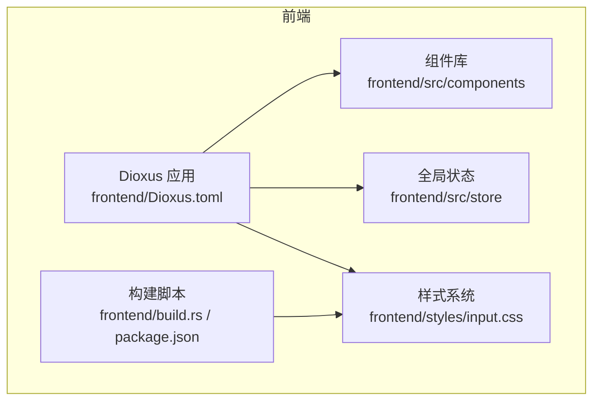
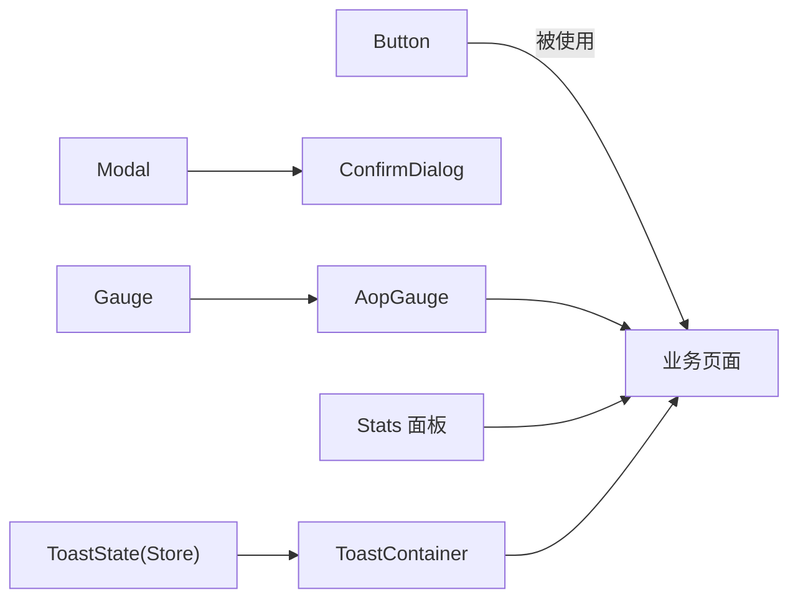
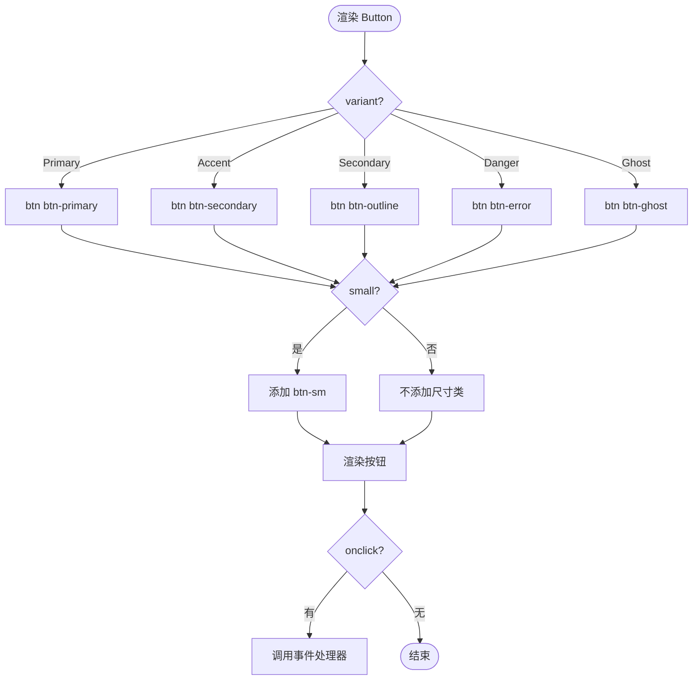
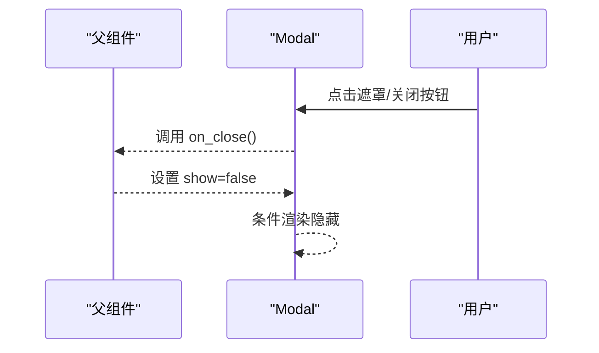
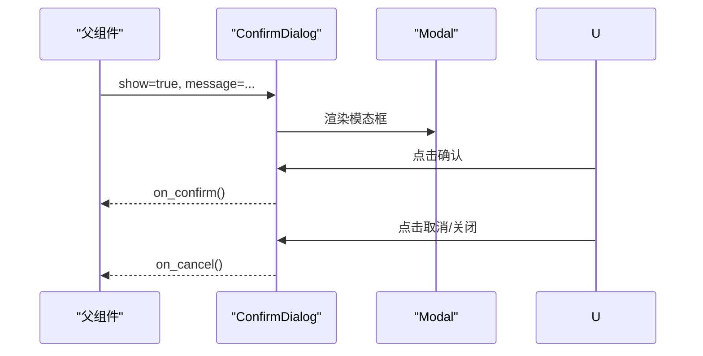
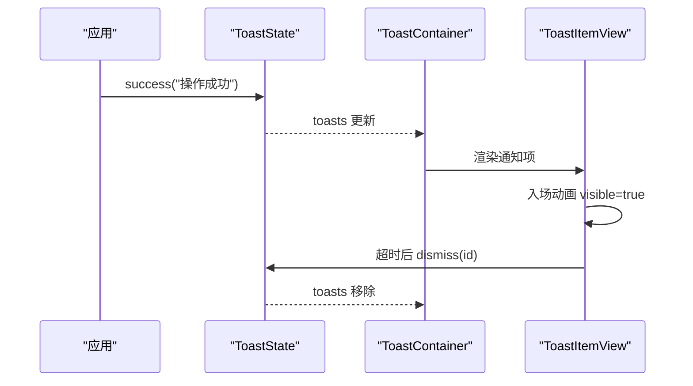
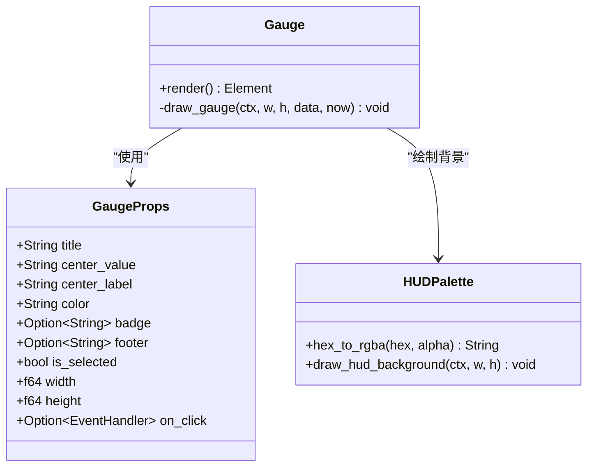
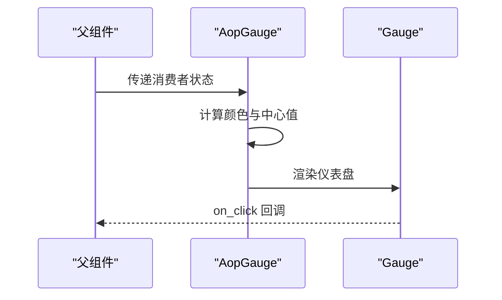
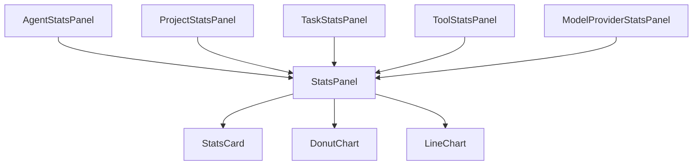
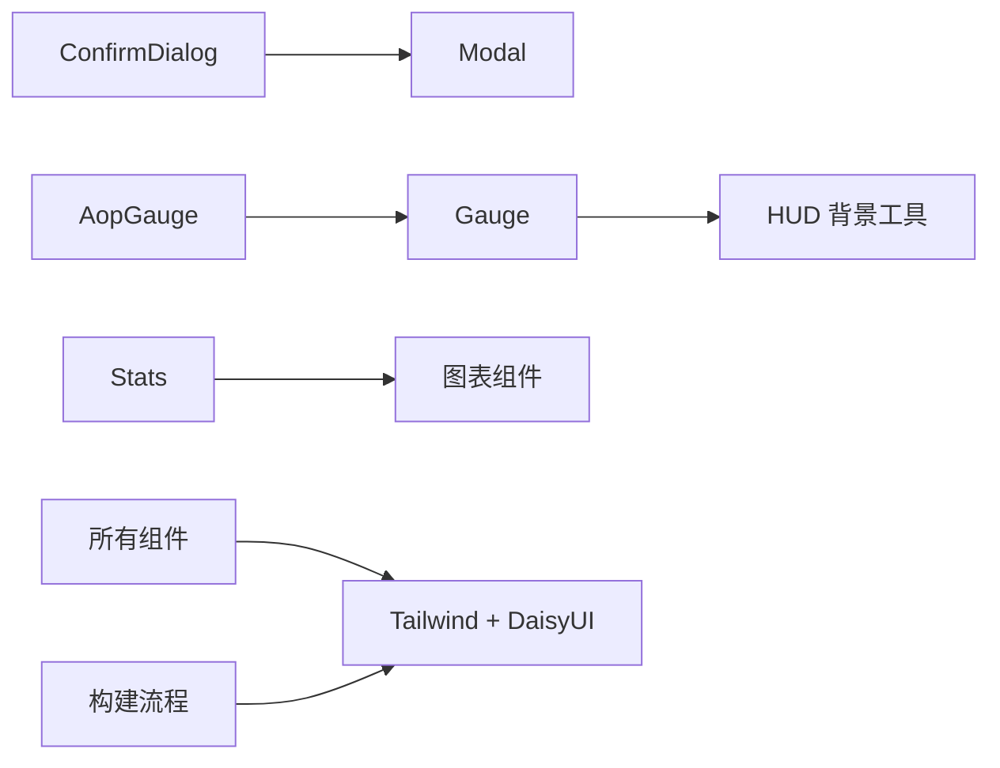

# 基础组件

<cite>
**本文引用的文件**   
- [frontend/src/components/button.rs](frontend/src/components/button.rs)
- [frontend/src/components/modal.rs](frontend/src/components/modal.rs)
- [frontend/src/components/confirm_dialog.rs](frontend/src/components/confirm_dialog.rs)
- [frontend/src/components/toast.rs](frontend/src/components/toast.rs)
- [frontend/src/store/toast.rs](frontend/src/store/toast.rs)
- [frontend/src/components/gauge.rs](frontend/src/components/gauge.rs)
- [frontend/src/components/aop_gauge.rs](frontend/src/components/aop_gauge.rs)
- [frontend/src/components/hud_palette.rs](frontend/src/components/hud_palette.rs)
- [frontend/src/components/stats.rs](frontend/src/components/stats.rs)
- [frontend/styles/input.css](frontend/styles/input.css)
- [frontend/package.json](frontend/package.json)
- [frontend/Cargo.toml](frontend/Cargo.toml)
- [frontend/Dioxus.toml](frontend/Dioxus.toml)
</cite>

## 目录
1. [简介](#简介)
2. [项目结构](#项目结构)
3. [核心组件](#核心组件)
4. [架构总览](#架构总览)
5. [详细组件分析](#详细组件分析)
6. [依赖关系分析](#依赖关系分析)
7. [性能考量](#性能考量)
8. [故障排查指南](#故障排查指南)
9. [结论](#结论)
10. [附录](#附录)

## 简介
本文件面向 AI Orz 前端应用的基础 UI 组件，覆盖按钮、模态框、提示框（Toast）、确认对话框、仪表盘（Gauge）等核心元素。文档从属性配置、事件处理、样式定制、状态管理、复用与组合模式、最佳实践、可访问性与响应式特性等方面进行全面说明，并提供在业务组件中正确使用的参考路径与流程图示。

## 项目结构
前端基于 Dioxus 0.7 + Tailwind CSS v4 + DaisyUI v5。基础 UI 组件集中在 frontend/src/components 下，全局通知状态位于 frontend/src/store。样式通过 Tailwind 构建并引入 DaisyUI 主题。

图表来源
- [frontend/Dioxus.toml:1-18](frontend/Dioxus.toml#L1-L18)
- [frontend/styles/input.css:1-45](frontend/styles/input.css#L1-L45)
- [frontend/package.json:1-14](frontend/package.json#L1-L14)

章节来源
- [frontend/Cargo.toml:1-26](frontend/Cargo.toml#L1-L26)
- [frontend/Dioxus.toml:1-18](frontend/Dioxus.toml#L1-L18)
- [frontend/package.json:1-14](frontend/package.json#L1-L14)

## 核心组件
- 按钮 Button：提供多种变体、尺寸、禁用态与点击事件。
- 模态框 Modal：通用弹窗容器，支持标题、内容、底部区域与关闭回调。
- 确认对话框 ConfirmDialog：基于 Modal 的高危操作二次确认封装。
- Toast 通知：全局通知容器与单条通知项，支持类型、自动消失与手动关闭。
- 仪表盘 Gauge：Canvas 绘制的 HUD 风格圆形仪表，支持标题、中心值、副标签、徽章、底部信息、选中态与呼吸光晕。
- AOP 仪表盘 AopGauge：在 Gauge 之上针对 AOP 消费者状态的薄封装。
- 统计面板 Stats：聚合展示 Agent/项目/任务/工具/模型提供商的统计卡片与时序图。

章节来源
- [frontend/src/components/button.rs:1-50](frontend/src/components/button.rs#L1-L50)
- [frontend/src/components/modal.rs:1-44](frontend/src/components/modal.rs#L1-L44)
- [frontend/src/components/confirm_dialog.rs:1-98](frontend/src/components/confirm_dialog.rs#L1-L98)
- [frontend/src/components/toast.rs:1-104](frontend/src/components/toast.rs#L1-L104)
- [frontend/src/store/toast.rs:1-112](frontend/src/store/toast.rs#L1-L112)
- [frontend/src/components/gauge.rs:1-324](frontend/src/components/gauge.rs#L1-L324)
- [frontend/src/components/aop_gauge.rs:1-116](frontend/src/components/aop_gauge.rs#L1-L116)
- [frontend/src/components/stats.rs:1-261](frontend/src/components/stats.rs#L1-L261)

## 架构总览
基础组件遵循“原子组件 → 复合组件”的分层组织方式：
- 原子组件：Button、Modal、Gauge、HUD 背景绘制工具等。
- 复合组件：ConfirmDialog（基于 Modal）、AopGauge（基于 Gauge）、StatsPanel（组合多个统计卡片与图表）。
- 全局状态：ToastState 通过 Context 提供，供 ToastContainer 消费。

图表来源
- [frontend/src/components/confirm_dialog.rs:1-98](frontend/src/components/confirm_dialog.rs#L1-L98)
- [frontend/src/components/aop_gauge.rs:1-116](frontend/src/components/aop_gauge.rs#L1-L116)
- [frontend/src/components/stats.rs:1-261](frontend/src/components/stats.rs#L1-L261)
- [frontend/src/components/toast.rs:1-104](frontend/src/components/toast.rs#L1-L104)
- [frontend/src/store/toast.rs:1-112](frontend/src/store/toast.rs#L1-L112)

## 详细组件分析

### 按钮 Button
- 属性
  - variant：Primary/Accent/Secondary/Danger/Ghost，映射到不同 DaisyUI 类。
  - disabled：布尔，控制原生按钮禁用态。
  - small：布尔，切换 btn-sm 尺寸。
  - onclick：可选的事件处理器，透传 MouseEvent。
  - children：子节点，作为按钮文本或图标。
- 事件处理
  - 点击时调用传入的 handler；若未提供则无副作用。
- 样式定制
  - 通过 variant 选择主色/强调/次要/危险/幽灵样式；small 切换尺寸。
- 状态管理
  - 无内部状态，完全受控于父组件 props。
- 可访问性
  - 使用原生 button 元素，具备默认键盘交互；disabled 由原生语义控制。
- 响应式设计
  - 基于 Tailwind/DaisyUI 的响应式类，适配多端布局。

图表来源
- [frontend/src/components/button.rs:15-49](frontend/src/components/button.rs#L15-L49)

章节来源
- [frontend/src/components/button.rs:1-50](frontend/src/components/button.rs#L1-L50)

### 模态框 Modal
- 属性
  - title：字符串，显示在模态框头部。
  - show：布尔，控制是否渲染。
  - on_close：闭包，用于关闭模态框。
  - children：内容区域。
  - footer：可选的底部区域元素。
- 事件处理
  - 点击遮罩或右上角关闭按钮触发 on_close。
- 样式定制
  - 使用 DaisyUI modal 类；body 阻止事件冒泡避免误关。
- 状态管理
  - 无内部状态，show 由父组件控制。
- 可访问性
  - 使用原生 dialog 语义；关闭按钮为可聚焦元素。
- 响应式设计
  - 基于 DaisyUI 的模态布局，适配移动端。

图表来源
- [frontend/src/components/modal.rs:5-43](frontend/src/components/modal.rs#L5-L43)

章节来源
- [frontend/src/components/modal.rs:1-44](frontend/src/components/modal.rs#L1-L44)

### 确认对话框 ConfirmDialog
- 属性
  - show/title/message：控制显示与文案。
  - confirm_text/cancel_text：自定义按钮文案。
  - confirm_class：确认按钮样式类（默认错误色）。
  - on_confirm/on_cancel：回调。
- 事件处理
  - 确认按钮触发 on_confirm；取消按钮或关闭触发 on_cancel。
- 样式定制
  - 基于 Modal 的 footer 插槽放置两个按钮。
- 状态管理
  - 无内部状态，完全受控。
- 可访问性
  - 继承 Modal 的可访问性；按钮具备焦点顺序。
- 响应式设计
  - 继承 Modal 的响应式行为。

图表来源
- [frontend/src/components/confirm_dialog.rs:60-97](frontend/src/components/confirm_dialog.rs#L60-L97)
- [frontend/src/components/modal.rs:15-43](frontend/src/components/modal.rs#L15-L43)

章节来源
- [frontend/src/components/confirm_dialog.rs:1-98](frontend/src/components/confirm_dialog.rs#L1-L98)

### 提示框 Toast
- 全局容器 ToastContainer
  - 订阅全局 ToastState，渲染所有待显示的通知项。
- 单条通知 ToastItemView
  - 入场动画、自动消失、手动关闭、进度条动画。
  - 根据类型（成功/错误/警告/信息）选择样式与图标。
- 全局状态 ToastState
  - 提供 show/success/error/warning/info/dismiss 等方法。
  - 使用 Dioxus Context 提供与获取。
- 事件处理
  - 自动计时器触发 dismiss；用户点击关闭也触发 dismiss。
- 样式定制
  - 使用 DaisyUI alert 类；CSS 定义 toast-visible/toast-leaving 动画。
- 可访问性
  - 通知项包含关闭按钮；建议配合 aria-live 区域（可在上层容器扩展）。
- 响应式设计
  - 固定定位在右上角，宽度最小化以适配小屏。

图表来源
- [frontend/src/components/toast.rs:7-93](frontend/src/components/toast.rs#L7-L93)
- [frontend/src/store/toast.rs:43-95](frontend/src/store/toast.rs#L43-L95)

章节来源
- [frontend/src/components/toast.rs:1-104](frontend/src/components/toast.rs#L1-L104)
- [frontend/src/store/toast.rs:1-112](frontend/src/store/toast.rs#L1-L112)

### 仪表盘 Gauge
- 属性
  - title/center_value/center_label/color/badge/footer/is_selected/width/height/on_click。
- 渲染逻辑
  - 使用 CanvasRenderingContext2d 绘制 HUD 风格背景、刻度、中心数字与副标签、徽章、底部信息。
  - 支持选中态发光边框与呼吸光晕（周期性动画）。
  - 高清屏适配：根据 devicePixelRatio 缩放画布。
- 事件处理
  - 点击 canvas 触发 on_click。
- 性能优化
  - requestAnimationFrame 驱动渲染循环；use_drop 清理引用防止内存泄漏。
  - 数据缓存 Signal 减少重复计算。
- 可访问性
  - 当前为图形元素，建议在外部提供 aria-label 或描述（可由父组件补充）。
- 响应式设计
  - width/height 可配置，结合外层布局实现自适应。

图表来源
- [frontend/src/components/gauge.rs:24-64](frontend/src/components/gauge.rs#L24-L64)
- [frontend/src/components/gauge.rs:67-159](frontend/src/components/gauge.rs#L67-L159)
- [frontend/src/components/gauge.rs:161-257](frontend/src/components/gauge.rs#L161-L257)
- [frontend/src/components/hud_palette.rs:20-45](frontend/src/components/hud_palette.rs#L20-L45)

章节来源
- [frontend/src/components/gauge.rs:1-324](frontend/src/components/gauge.rs#L1-L324)
- [frontend/src/components/hud_palette.rs:1-123](frontend/src/components/hud_palette.rs#L1-L123)

### AOP 仪表盘 AopGauge
- 职责
  - 将 AOP 消费者状态（pending/in_progress/oldest_age_secs/order_keys_count）映射为 Gauge 的显示数据与颜色。
- 颜色策略
  - pending≥10 红色告警；pending>0 橙色正常负载；in_progress>0 黄色处理中；否则绿色健康。
- 复用模式
  - 薄封装 Gauge，专注领域语义与配色。
- 可访问性与响应式
  - 继承 Gauge 的能力，可通过父组件扩展。

图表来源
- [frontend/src/components/aop_gauge.rs:44-87](frontend/src/components/aop_gauge.rs#L44-L87)
- [frontend/src/components/gauge.rs:67-159](frontend/src/components/gauge.rs#L67-L159)

章节来源
- [frontend/src/components/aop_gauge.rs:1-116](frontend/src/components/aop_gauge.rs#L1-L116)

### 统计面板 Stats
- 组件
  - StatsCard：统一统计卡片。
  - StatsPanel：统一卡片外壳与标题。
  - AgentStatsPanel/ProjectStatsPanel/TaskStatsPanel/ToolStatsPanel/ModelProviderStatsPanel：按领域聚合展示。
- 图表集成
  - 环形图 DonutChart 展示工具调用分布。
  - 折线图 LineChart 展示模型调用时序。
- 数据格式化
  - Token 计数 K/M 单位；QPS 保留两位小数。
- 复用模式
  - 通过 StatsPanel 包裹不同领域的 StatsCard 组合。

图表来源
- [frontend/src/components/stats.rs:89-116](frontend/src/components/stats.rs#L89-L116)
- [frontend/src/components/stats.rs:118-261](frontend/src/components/stats.rs#L118-L261)

章节来源
- [frontend/src/components/stats.rs:1-261](frontend/src/components/stats.rs#L1-L261)

## 依赖关系分析
- 组件间依赖
  - ConfirmDialog 依赖 Modal。
  - AopGauge 依赖 Gauge。
  - Stats 面板依赖图表组件（DonutChart、LineChart）。
  - Gauge 依赖 HUD 背景绘制工具。
- 样式依赖
  - 所有组件依赖 Tailwind + DaisyUI 提供的类。
  - 自定义动画与 HUD 风格在 input.css 中定义。
- 构建与运行
  - Dioxus 构建输出至 dist，资源目录 public。
  - Tailwind CLI 编译 CSS 到 public/output.css。

图表来源
- [frontend/src/components/confirm_dialog.rs:1-98](frontend/src/components/confirm_dialog.rs#L1-L98)
- [frontend/src/components/aop_gauge.rs:1-116](frontend/src/components/aop_gauge.rs#L1-L116)
- [frontend/src/components/stats.rs:1-261](frontend/src/components/stats.rs#L1-L261)
- [frontend/styles/input.css:1-45](frontend/styles/input.css#L1-L45)
- [frontend/package.json:1-14](frontend/package.json#L1-L14)

章节来源
- [frontend/styles/input.css:1-202](frontend/styles/input.css#L1-L202)
- [frontend/package.json:1-14](frontend/package.json#L1-L14)
- [frontend/Cargo.toml:1-26](frontend/Cargo.toml#L1-L26)
- [frontend/Dioxus.toml:1-18](frontend/Dioxus.toml#L1-L18)

## 性能考量
- 渲染循环
  - Gauge 使用 requestAnimationFrame 进行高效重绘，并在卸载时清理回调，避免内存泄漏。
- 高清屏适配
  - 根据 devicePixelRatio 调整画布尺寸与缩放，确保清晰度。
- 状态更新
  - Toast 使用异步定时器与信号更新，避免阻塞 UI。
- 样式构建
  - Tailwind 按需生成 CSS，减小体积；DaisyUI 主题提供一致视觉。

[本节为通用指导，不直接分析具体文件]

## 故障排查指南
- 模态框无法关闭
  - 检查 show 状态是否正确更新；确认 on_close 未被拦截。
  - 参考路径：[modal.rs:15-43](frontend/src/components/modal.rs#L15-L43)
- Toast 不消失或重复出现
  - 检查 duration_ms 与 dismiss 调用；确认 id 唯一且未被提前移除。
  - 参考路径：[toast.rs:27-93](frontend/src/components/toast.rs#L27-L93)、[store/toast.rs:52-73](frontend/src/store/toast.rs#L52-L73)
- 仪表盘绘制异常或模糊
  - 检查 width/height 与 devicePixelRatio 设置；确认 ctx 获取成功。
  - 参考路径：[gauge.rs:82-135](frontend/src/components/gauge.rs#L82-L135)
- 样式未生效
  - 确认 Tailwind 已编译 output.css；检查 input.css 中的 @source 与主题配置。
  - 参考路径：[styles/input.css:1-45](frontend/styles/input.css#L1-L45)、[package.json:4-11](frontend/package.json#L4-L11)

章节来源
- [frontend/src/components/modal.rs:15-43](frontend/src/components/modal.rs#L15-L43)
- [frontend/src/components/toast.rs:27-93](frontend/src/components/toast.rs#L27-L93)
- [frontend/src/store/toast.rs:52-73](frontend/src/store/toast.rs#L52-L73)
- [frontend/src/components/gauge.rs:82-135](frontend/src/components/gauge.rs#L82-L135)
- [frontend/styles/input.css:1-45](frontend/styles/input.css#L1-L45)
- [frontend/package.json:4-11](frontend/package.json#L4-L11)

## 结论
AI Orz 前端基础组件采用清晰的原子-复合分层设计，依托 Dioxus 的状态管理与 Tailwind/DaisyUI 的样式体系，提供了高内聚、低耦合、易复用的 UI 能力。通过统一的 HUD 视觉语言与完善的 Toast 通知机制，既保证了体验一致性，又提升了开发效率。建议在业务组件中优先复用这些基础组件，并通过组合模式构建更复杂的界面。

[本节为总结性内容，不直接分析具体文件]

## 附录
- 使用示例参考路径
  - 按钮：[button.rs:15-49](frontend/src/components/button.rs#L15-L49)
  - 模态框：[modal.rs:5-43](frontend/src/components/modal.rs#L5-L43)
  - 确认对话框：[confirm_dialog.rs:60-97](frontend/src/components/confirm_dialog.rs#L60-L97)
  - Toast 全局容器：[toast.rs:7-25](frontend/src/components/toast.rs#L7-L25)
  - Toast 状态 API：[store/toast.rs:43-95](frontend/src/store/toast.rs#L43-L95)
  - 仪表盘：[gauge.rs:67-159](frontend/src/components/gauge.rs#L67-L159)
  - AOP 仪表盘：[aop_gauge.rs:57-87](frontend/src/components/aop_gauge.rs#L57-L87)
  - 统计面板：[stats.rs:89-261](frontend/src/components/stats.rs#L89-L261)

[本节为索引与参考，不直接分析具体文件]