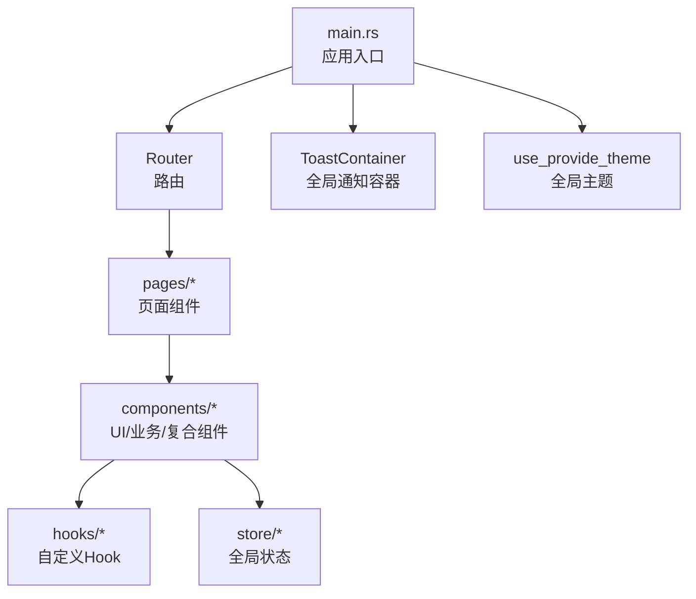
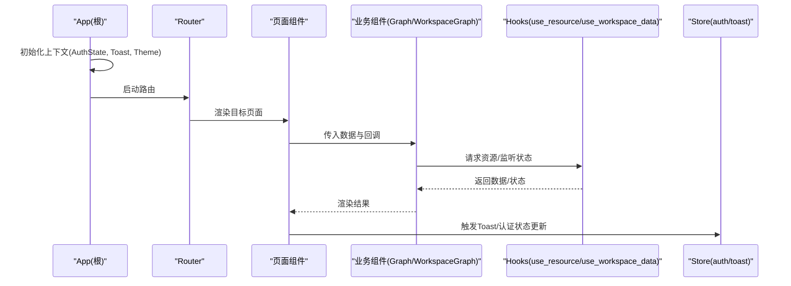
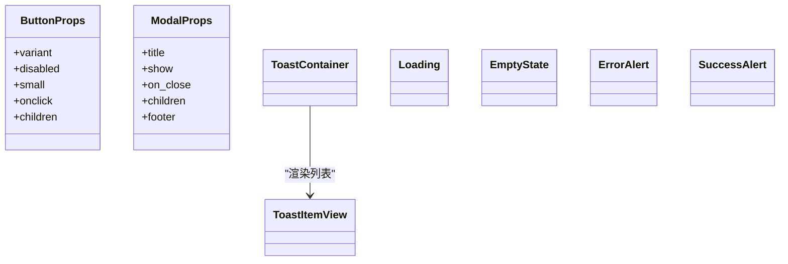
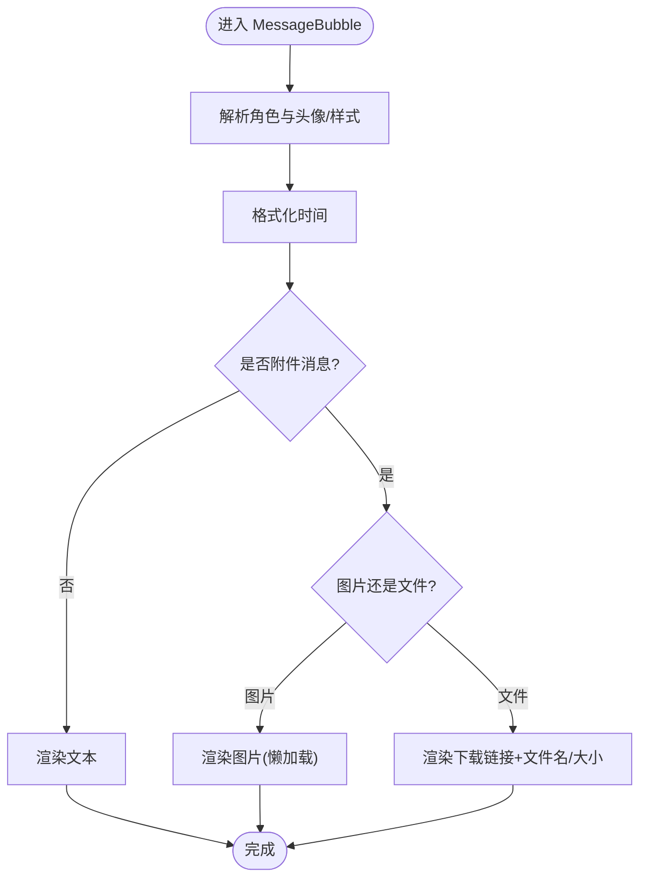
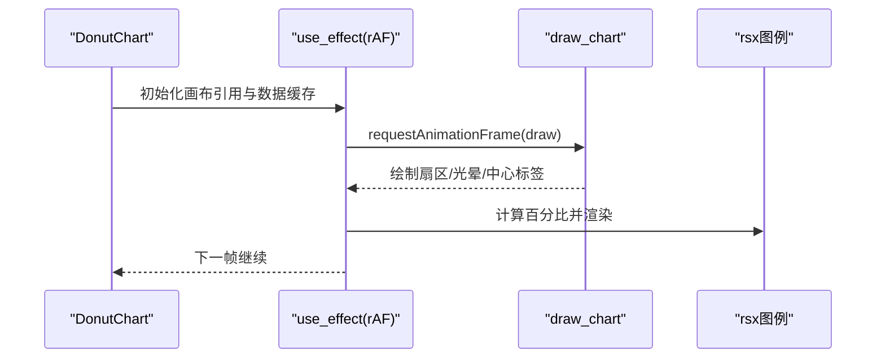
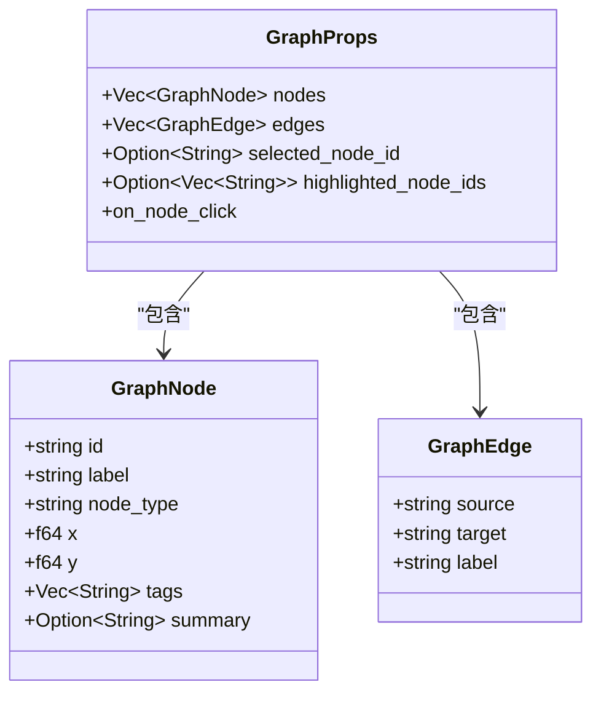
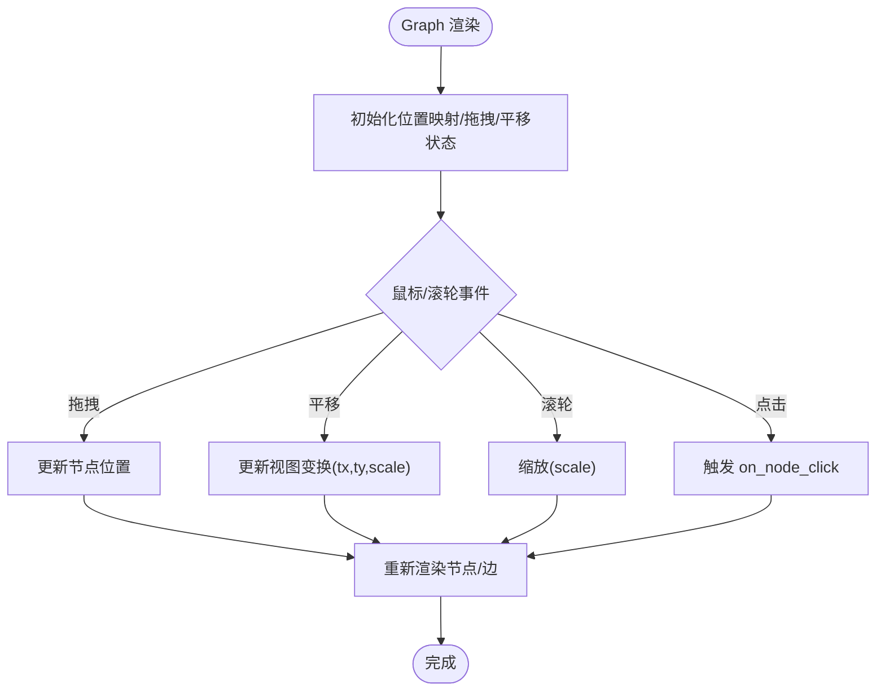
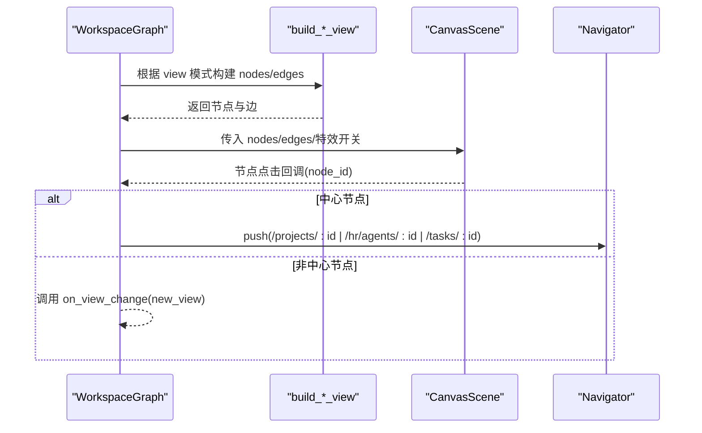
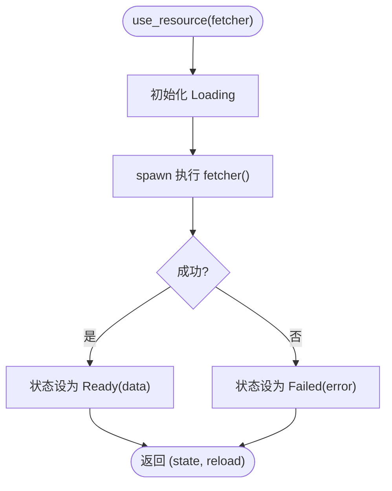
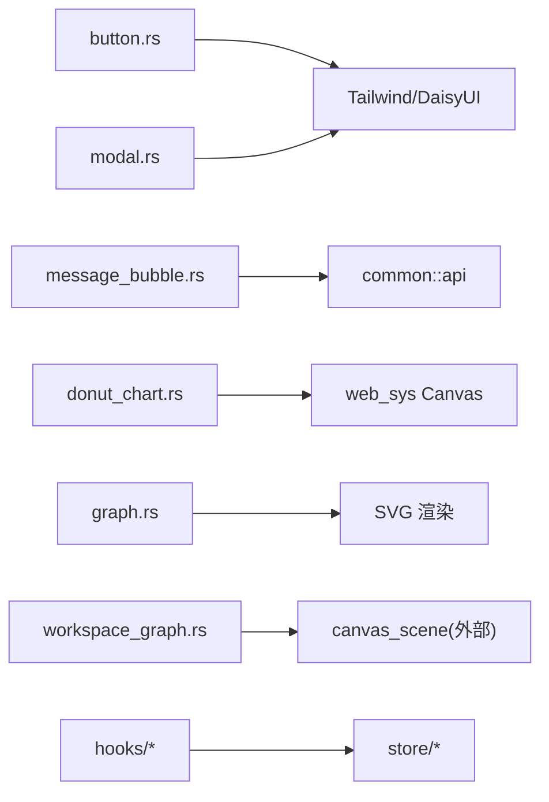

# 组件系统

<cite>
**本文引用的文件**
- [frontend/Cargo.toml](frontend/Cargo.toml)
- [frontend/Dioxus.toml](frontend/Dioxus.toml)
- [frontend/src/main.rs](frontend/src/main.rs)
- [frontend/src/components/mod.rs](frontend/src/components/mod.rs)
- [frontend/src/components/button.rs](frontend/src/components/button.rs)
- [frontend/src/components/modal.rs](frontend/src/components/modal.rs)
- [frontend/src/components/chat/mod.rs](frontend/src/components/chat/mod.rs)
- [frontend/src/components/chat/message_bubble.rs](frontend/src/components/chat/message_bubble.rs)
- [frontend/src/components/charts/mod.rs](frontend/src/components/charts/mod.rs)
- [frontend/src/components/charts/donut_chart.rs](frontend/src/components/charts/donut_chart.rs)
- [frontend/src/components/graph.rs](frontend/src/components/graph.rs)
- [frontend/src/components/workspace_graph.rs](frontend/src/components/workspace_graph.rs)
- [frontend/src/hooks/mod.rs](frontend/src/hooks/mod.rs)
- [frontend/src/hooks/use_resource.rs](frontend/src/hooks/use_resource.rs)
- [frontend/src/store/mod.rs](frontend/src/store/mod.rs)
- [frontend/src/components/state.rs](frontend/src/components/state.rs)
- [frontend/src/components/toast.rs](frontend/src/components/toast.rs)
- [frontend/src/components/hud.rs](frontend/src/components/hud.rs#L1-L262) — HudPanel / HudCard / HudSection / HudProgress / HudCallout / HudDivider / HudTable / HudTabs / PageHeader / StatReadout / StatGrid 全站 HUD 原子组件集合
- [frontend/styles/input.css#L1249-L1550](frontend/styles/input.css#L1249-L1550) — HUD CSS 皮肤块：.hud-panel / .hud-tone-* / .hud-signal / .hud-stat / .hud-progress / .hud-table / .hud-modal / .hud-input / .badge.hud-badge（backdrop-blur + glow）
- [frontend/src/pages/settings.rs](frontend/src/pages/settings.rs) — HUD 收口示例
- [frontend/src/pages/hr/agent_detail.rs](frontend/src/pages/hr/agent_detail.rs) — HUD 收口示例：工具与技能全景 HudCard
- [frontend/src/pages/message/chat.rs](frontend/src/pages/message/chat.rs) — HUD 收口示例：气泡 + 侧面板

### 本文关联的三类文档（四类互引闭环）

**① 设计文档（Design）**：
- [前端架构设计](docs/design/frontend_architecture.md) — 前端整体分层与模块划分
- 【Batch10 追加】[ui_design_system.md](docs/design/ui_design_system.md) — Tailwind v4 + DaisyUI v5 组件库落地；6 层组件分层（Layer1 基础→Layer6 页面）；orz-light oklch 自定义主题；ButtonVariant / ModalVariant 枚举；HUD 流光特效 CSS

**② 落地计划（Plan）（Batch10 追加）**：
- [统计图表Phase1基础设施与时序图展示重构.md](docs/archive/plan-archive/统计图表Phase1基础设施与时序图展示重构.md) — StatsPanel / LineChart / DonutChart / Gauge 4 个 charts/ Layer4 复合业务组件
- [知识图谱推荐起点与组件复用重构.md](docs/archive/plan-archive/知识图谱推荐起点与组件复用重构.md) — KnowledgeGraph Layer3 复合业务组件（两端复用：路由页 + Agent 详情页 Tab）

**④ RAG 原子知识卡**：
- [前端整体架构 RAG 卡](docs/wiki/knowledge/zh/前端整体架构：Dioxus%20Router%2041%20%E8%B7%AF%E7%94%B1%20+%20API%20%E5%AE%A2%E6%88%B7%E7%AB%AF%2013%20%E6%A8%A1%E5%9D%97%20+%20Hooks%203%E4%B8%AA%20+%20Store%202%E4%B8%AA%20+%20%E7%BB%84%E4%BB%B6%E4%BD%93%E7%B3%BB%206%E5%B1%82/前端整体架构：Dioxus%20Router%2041%20%E8%B7%AF%E7%94%B1%20+%20API%20%E5%AE%A2%E6%88%B7%E7%AB%AF%2013%20%E6%A8%A1%E5%9D%97%20+%20Hooks%203%E4%B8%AA%20+%20Store%202%E4%B8%AA%20+%20%E7%BB%84%E4%BB%B6%E4%BD%93%E7%B3%BB%206%E5%B1%82.md) — 41 路由 + 13 API 模块 + 3 Hooks 架构速查
- 【Batch10 追加】[UI Design System 组件设计系统：6 层组件分层 + Hooks 3 个 + Store 2 个 + DaisyUI 主题 + 交互组件复用约束](docs/wiki/knowledge/zh/UI%20Design%20System%20组件设计系统：6%20层组件分层%20+%20Hooks%203%20个%20+%20Store%202%20个%20+%20DaisyUI%20主题%20+%20交互组件复用约束/UI%20Design%20System%20组件设计系统：6%20层组件分层%20+%20Hooks%203%20个%20+%20Store%202%20个%20+%20DaisyUI%20主题%20+%20交互组件复用约束.md) — 6 层分层架构详解 + 8 条复用红线（禁止页面层自定义 CSS 类 / Button 统一走 ButtonVariant 枚举 等）
- 【T5 HUD 全站应用追加】[Tailwind CSS v4 + DaisyUI v5 主题系统与 HUD 驾驶舱风格](docs/wiki/knowledge/zh/Tailwind%20CSS%20v4%20+%20DaisyUI%20v5%20主题系统与%20HUD%20驾驶舱风格/Tailwind%20CSS%20v4%20+%20DaisyUI%20v5%20主题系统与%20HUD%20驾驶舱风格.md) — hud.rs 原子组件列表 + input.css HUD 皮肤块 + 全站 HUD 收口 3 条硬约束

## 2026-09-01 增量变更
- [frontend/src/pages/hr/agent_detail.rs#L60-L78](frontend/src/pages/hr/agent_detail.rs#L60-L78) — 拆分工具/技能 tab + SkillCard Expired 状态 HUD + 恢复按钮
- [frontend/src/components/canvas_scene.rs#L112-L117](frontend/src/components/canvas_scene.rs#L112-L117) — TextMetrics measure_text_width 精确测量替代字符数估算
- [frontend/src/components/graph_canvas.rs](frontend/src/components/graph_canvas.rs) / [force_layout.rs](frontend/src/components/force_layout.rs) / [relation_graph.rs](frontend/src/components/relation_graph.rs) / [workspace_graph.rs](frontend/src/components/workspace_graph.rs) / [hud.rs](frontend/src/components/hud.rs) — 追加 measure_text 调用点
- [frontend/src/utils/mod.rs](frontend/src/utils/mod.rs) / [utils/status.rs](frontend/src/utils/status.rs) / [hooks/mod.rs](frontend/src/hooks/mod.rs) — 新增状态辅助函数 + hooks 扩展

**本文关联的 RAG 知识卡**：
- [UI Design System 组件设计系统：6 层组件分层 + Hooks 3 个 + Store 2 个 + DaisyUI 主题 + 交互组件复用约束](docs/wiki/knowledge/zh/UI Design System 组件设计系统：6 层组件分层 + Hooks 3 个 + Store 2 个 + DaisyUI 主题 + 交互组件复用约束/UI Design System 组件设计系统：6 层组件分层 + Hooks 3 个 + Store 2 个 + DaisyUI 主题 + 交互组件复用约束.md)
- [Canvas HUD 可视化：GraphCanvas 知识图谱 + 图表场景LineDonut + 仪表盘Gauge双版 + HudPalette橙光光晕](docs/wiki/knowledge/zh/Canvas HUD 可视化：GraphCanvas 知识图谱 + 图表场景LineDonut + 仪表盘Gauge双版 + HudPalette橙光光晕/Canvas HUD 可视化：GraphCanvas 知识图谱 + 图表场景LineDonut + 仪表盘Gauge双版 + HudPalette橙光光晕.md)
- [前端整体架构：Dioxus Router 41 路由 + API 客户端 13 模块 + Hooks 3个 + Store 2个 + 组件体系 6层](docs/wiki/knowledge/zh/前端整体架构：Dioxus Router 41 路由 + API 客户端 13 模块 + Hooks 3个 + Store 2个 + 组件体系 6层/前端整体架构：Dioxus Router 41 路由 + API 客户端 13 模块 + Hooks 3个 + Store 2个 + 组件体系 6层.md)
</cite>

## 更新摘要（T5 HUD 设计系统全站应用）
**变更内容**
- 新增 Layer 2（基础展示组件）`frontend/src/components/hud.rs` 为全站 HUD 原子组件集合：10+ 个原语（HudPanel / HudCard / HudSection / HudProgress / HudCallout / HudDivider / HudTable / HudTabs / PageHeader / StatReadout / StatGrid），全站 40+ 前端页面统一迁移
- `frontend/styles/input.css` 新增 L1249-L1550 HUD CSS 皮肤块：.hud-panel（渐变发丝边 + backdrop-blur）、.hud-panel.hud-tone-* 四色变体、.hud-signal 流光条、.hud-stat 等宽数字、.hud-progress 系列、.hud-table、.hud-modal / .hud-input、.badge.hud-badge（L1507-L1549，backdrop-blur + glow 光晕）
- 组件系统层级调整：HudCard 作为 Layer 2 原子组件，向上被 Layer 3/4 组合使用；PageHeader / StatReadout / StatGrid 纳入组件系统规范
- 追加两张 RAG 知识卡引用：Tailwind CSS v4 + DaisyUI v5 主题系统与 HUD 驾驶舱风格、UI Design System 组件设计系统（已更新含 HUD 原子组件收口红线）

**2026-09-01 增量**：Agent 详情页拆分工具/技能 tab + SkillCard Expired 状态 HUD（badge 颜色 + 恢复按钮）；Canvas 文本测量统一走 web-sys TextMetrics measure_text_width；HUD 原语（HudCard/HudTabs/HudSection/HudProgress）全站使用点继续扩张；force_layout 布局每帧 dt clamp ≥ 1ms。

## 目录
1. [简介](#简介)
2. [项目结构](#项目结构)
3. [核心组件](#核心组件)
4. [架构总览](#架构总览)
5. [详细组件分析](#详细组件分析)
6. [依赖关系分析](#依赖关系分析)
7. [性能考量](#性能考量)
8. [故障排查指南](#故障排查指南)
9. [结论](#结论)
10. [附录：使用示例与开发指南](#附录使用示例与开发指南)

## 简介
本文件为 AI Orz 前端应用（基于 Dioxus）的组件系统文档。内容覆盖基础 UI 组件、业务组件与复合组件的设计模式，说明属性传递、事件处理、状态管理与生命周期钩子，记录自定义 Hook 的使用方法与最佳实践，并提供组件复用策略、样式定制方案与性能优化技巧，以及完整的组件使用示例与开发指南。

## 项目结构
前端采用 Dioxus 工程组织，入口在 main.rs，通过 Router 路由到各页面；组件集中在 components 目录，按功能模块划分（charts、chat、graph 等），全局状态与主题通过 hooks 与 store 提供。构建配置位于 Dioxus.toml，依赖声明在 Cargo.toml。

图表来源
- [frontend/src/main.rs:24-57](frontend/src/main.rs#L24-L57)
- [frontend/Dioxus.toml:1-18](frontend/Dioxus.toml#L1-L18)

章节来源
- [frontend/src/main.rs:1-58](frontend/src/main.rs#L1-L58)
- [frontend/Cargo.toml:1-26](frontend/Cargo.toml#L1-L26)
- [frontend/Dioxus.toml:1-18](frontend/Dioxus.toml#L1-L18)

## 核心组件
- 基础 UI 组件
  - 按钮 Button：支持多种变体、尺寸、禁用态与点击事件。
  - 模态框 Modal：可显示/隐藏、带标题、关闭回调与可选页脚。
  - 状态展示 Loading/EmptyState/ErrorAlert/SuccessAlert：统一加载、空态与提示。
  - Toast 通知：全局容器 + 单条通知，支持类型、自动消失与手动关闭。
- 业务组件
  - 聊天消息 MessageBubble：简版消息气泡，支持文本、图片与文件附件。
  - 知识图谱 Graph：SVG 节点/边渲染，拖拽、缩放、选择高亮、标签与摘要。
  - WorkspaceGraph：Canvas 场景图，根据视图模式（Global/ProjectDetail/AgentDetail/TaskDetail）动态构建节点与边，并支持导航跳转。
- 复合组件
  - 环形图 DonutChart：Canvas HUD 风格环形图，含呼吸光晕、图例与中心标签。
  - 图表集合 charts：DonutChart、LineChart 等可视化组件。

章节来源
- [frontend/src/components/button.rs:1-50](frontend/src/components/button.rs#L1-L50)
- [frontend/src/components/modal.rs:1-44](frontend/src/components/modal.rs#L1-L44)
- [frontend/src/components/state.rs:1-50](frontend/src/components/state.rs#L1-L50)
- [frontend/src/components/toast.rs:1-104](frontend/src/components/toast.rs#L1-L104)
- [frontend/src/components/chat/message_bubble.rs:1-72](frontend/src/components/chat/message_bubble.rs#L1-L72)
- [frontend/src/components/graph.rs:1-752](frontend/src/components/graph.rs#L1-L752)
- [frontend/src/components/workspace_graph.rs:1-592](frontend/src/components/workspace_graph.rs#L1-L592)
- [frontend/src/components/charts/donut_chart.rs:1-340](frontend/src/components/charts/donut_chart.rs#L1-L340)

## 架构总览
整体采用“根上下文 + 组件组合”的模式：
- 根 App 提供认证状态、Toast 容器与主题控制器。
- 页面通过 Router 挂载，调用业务组件进行数据展示与交互。
- 业务组件通过 Hooks 获取资源与状态，必要时调用 Store 中的全局状态。
- 可视化组件（Graph、WorkspaceGraph、DonutChart）分别基于 SVG 与 Canvas 实现，配合动画帧循环与事件处理。

图表来源
- [frontend/src/main.rs:24-57](frontend/src/main.rs#L24-L57)
- [frontend/src/hooks/use_resource.rs:1-41](frontend/src/hooks/use_resource.rs#L1-L41)
- [frontend/src/store/mod.rs:1-5](frontend/src/store/mod.rs#L1-L5)

## 详细组件分析

#### 2026-09-01 增量：SkillCard Expired HUD 渲染 + TextMetrics 精确测量
- **SkillCard Expired HUD 渲染路径**：Agent 详情页将"工具"和"技能"拆分为两个 HudTabs tab。在技能 tab 中，每个 SkillCard 通过状态枚举匹配渲染对应的 HUD 样式——Draft 为中性 tone、Published 为 accent tone、Expired 叠加橙光 badge + 恢复按钮。恢复按钮仅在 Expired 状态可见，点击后调用 restore_skill API 并在成功后刷新当前 tab 列表。
- **TextMetrics measure_text_width 精度升级**：GraphCanvas、ForceLayout、RelationGraph、WorkspaceGraph 等所有 Canvas 组件的节点标签宽度计算，从原先的"字符数 × 估计宽度"改为通过 web-sys CanvasRenderingContext2D 的 measure_text 返回 TextMetrics.width 精确测量。canvas_scene.rs 中统一封装 measure_text helper，所有 Canvas 标签渲染前调用它获取精确像素宽度，配合截断策略（超过节点宽度时在尾部追加 `…` 并悬浮 tooltip 显示完整内容），解决了中文/英文混排下字符估算严重偏差导致的标签截断错位问题。
- **force_layout dt clamp 下限**：力导向布局每帧的 dt 参数新增 clamp ≥ 1ms 下限，防止浏览器后台切回时 dt 突然变为 0 导致位置计算 NaN 或力累积爆炸。

### 基础 UI 组件
- 按钮 Button
  - 属性：变体（Primary/Accent/Secondary/Danger/Ghost）、禁用、小尺寸、点击事件、子元素。
  - 事件：onclick 透传原生 MouseEvent。
  - 样式：通过 Tailwind/DaisyUI 类名组合。
  - 复用：封装通用按钮样式与行为，便于跨页面复用。
- 模态框 Modal
  - 属性：标题、显示控制、关闭回调、子元素、可选页脚。
  - 事件：点击遮罩或关闭按钮触发 on_close。
  - 生命周期：show=false 时不渲染 DOM，减少开销。
- 状态展示
  - Loading：居中旋转指示器。
  - EmptyState：图标与文案占位。
  - ErrorAlert/SuccessAlert：错误与成功提示。
- Toast 通知
  - 容器：ToastContainer 置于根组件，读取全局 toast 列表。
  - 单条：ToastItemView 负责入场、倒计时、退出与移除。
  - 类型：Success/Error/Warning/Info，对应不同样式与图标。

图表来源
- [frontend/src/components/button.rs:15-49](frontend/src/components/button.rs#L15-L49)
- [frontend/src/components/modal.rs:5-43](frontend/src/components/modal.rs#L5-L43)
- [frontend/src/components/toast.rs:7-93](frontend/src/components/toast.rs#L7-L93)
- [frontend/src/components/state.rs:5-49](frontend/src/components/state.rs#L5-L49)

章节来源
- [frontend/src/components/button.rs:1-50](frontend/src/components/button.rs#L1-L50)
- [frontend/src/components/modal.rs:1-44](frontend/src/components/modal.rs#L1-L44)
- [frontend/src/components/state.rs:1-50](frontend/src/components/state.rs#L1-L50)
- [frontend/src/components/toast.rs:1-104](frontend/src/components/toast.rs#L1-L104)

### 聊天消息组件
- MessageBubble
  - 输入：MessageListItem（包含角色、时间、内容、附件元信息）。
  - 渲染：头像、角色标识、时间、文本或附件（图片/文件下载链接）。
  - 工具：role_avatar、role_class、format_time_hm、is_attachment_message、format_file_size。
  - 适用场景：极简对话展示（如 Agent 详情页、Workspace 底部对话框）。

图表来源
- [frontend/src/components/chat/message_bubble.rs:14-71](frontend/src/components/chat/message_bubble.rs#L14-L71)

章节来源
- [frontend/src/components/chat/mod.rs:1-12](frontend/src/components/chat/mod.rs#L1-L12)
- [frontend/src/components/chat/message_bubble.rs:1-72](frontend/src/components/chat/message_bubble.rs#L1-L72)

### 图表组件（环形图）
- DonutChart
  - 输入：Vec<DonutSlice>（label/value/color），可选宽高与中心标签。
  - 渲染：Canvas HUD 背景、扇区绘制、外圈呼吸光晕、中心总数与标签、DaisyUI 图例。
  - 生命周期：use_effect 注册 rAF 循环，use_drop 清理；设备像素比适配。
  - 性能：数据缓存 Signal，避免重复计算；rAF 递归注册并在卸载时停止。

图表来源
- [frontend/src/components/charts/donut_chart.rs:45-187](frontend/src/components/charts/donut_chart.rs#L45-L187)
- [frontend/src/components/charts/donut_chart.rs:189-292](frontend/src/components/charts/donut_chart.rs#L189-L292)

章节来源
- [frontend/src/components/charts/mod.rs:1-4](frontend/src/components/charts/mod.rs#L1-L4)
- [frontend/src/components/charts/donut_chart.rs:1-340](frontend/src/components/charts/donut_chart.rs#L1-L340)

### 知识图谱组件（Graph）
- Graph
  - 数据结构：GraphNode（id/label/node_type/tags/summary/x/y）、GraphEdge（source/target/label）。
  - 交互：拖拽节点、平移画布、滚轮缩放、右键菜单禁用、重置视图。
  - 视觉：节点填充色、边框色、透明度、发光、多色 tag 边框弧段、HUD 刻度环、扫描波纹。
  - 布局：圆形布局与以中心节点为中心的展开布局算法。
  - 事件：on_node_click 回调节点 ID。

图表来源
- [frontend/src/components/graph.rs:5-46](frontend/src/components/graph.rs#L5-L46)

图表来源
- [frontend/src/components/graph.rs:201-359](frontend/src/components/graph.rs#L201-L359)
- [frontend/src/components/graph.rs:354-659](frontend/src/components/graph.rs#L354-L659)

章节来源
- [frontend/src/components/graph.rs:1-752](frontend/src/components/graph.rs#L1-L752)

### 工作区关系图（WorkspaceGraph）
- 视图模式
  - Global：Project ↔ Agent 关联（通过 Task 推断）。
  - ProjectDetail：选中 Project 的 Task + Agent，Task 分层布局（Kahn 拓扑）。
  - AgentDetail：选中 Agent 的 Task + Project。
  - TaskDetail：选中 Task 为中心，展示前置/后继依赖与关联实体。
- 数据构建
  - 颜色规范：Project/Agent/Task 状态映射到颜色。
  - 边生成：依据 dependencies、assignee_type、project_id 推导。
- 交互
  - 节点点击：中心节点跳转详情页；非中心节点切换视图（on_view_change）。
  - 力导向布局与粒子效果由底层 CanvasScene 提供。

图表来源
- [frontend/src/components/workspace_graph.rs:89-481](frontend/src/components/workspace_graph.rs#L89-L481)
- [frontend/src/components/workspace_graph.rs:483-592](frontend/src/components/workspace_graph.rs#L483-L592)

章节来源
- [frontend/src/components/workspace_graph.rs:1-592](frontend/src/components/workspace_graph.rs#L1-L592)

### 自定义 Hook
- use_resource
  - 作用：统一管理异步资源加载状态（Loading/Ready/Failed），提供 reload 方法。
  - 用法：在组件中传入 fetcher，首次渲染自动加载，支持手动刷新。
- use_breakpoint / use_require_auth / use_theme
  - use_breakpoint：从上下文获取移动端断点信号。
  - use_require_auth：未登录重定向至接待页，并恢复 role。
  - use_theme：提供全局主题控制器（设置/读取/持久化）。

图表来源
- [frontend/src/hooks/use_resource.rs:1-41](frontend/src/hooks/use_resource.rs#L1-L41)

章节来源
- [frontend/src/hooks/mod.rs:15-139](frontend/src/hooks/mod.rs#L15-L139)
- [frontend/src/hooks/use_resource.rs:1-41](frontend/src/hooks/use_resource.rs#L1-L41)

## 依赖关系分析
- 组件内聚与耦合
  - 基础 UI 组件低耦合，仅依赖样式库与 Dioxus 基础 API。
  - 业务组件（Graph/WorkspaceGraph）依赖布局算法与 Canvas/SVG 能力，内部函数职责清晰。
  - 图表组件（DonutChart）依赖 HUD 调色板与 Canvas 2D 上下文。
- 外部依赖
  - Dioxus（web/router）、web-sys（Canvas/Window/EventSource 等）、wasm-bindgen、tracing、common API。
- 潜在循环依赖
  - 当前组件间通过 props 与回调通信，未见直接循环 import。

图表来源
- [frontend/Cargo.toml:11-25](frontend/Cargo.toml#L11-L25)
- [frontend/src/components/charts/donut_chart.rs:12-18](frontend/src/components/charts/donut_chart.rs#L12-L18)
- [frontend/src/components/workspace_graph.rs:10-13](frontend/src/components/workspace_graph.rs#L10-L13)

章节来源
- [frontend/Cargo.toml:1-26](frontend/Cargo.toml#L1-L26)

## 性能考量
- 渲染优化
  - Graph：同步更新节点位置映射，避免首帧延迟；拖拽阈值区分点击与拖拽，减少误触发。
  - DonutChart：设备像素比适配、rAF 循环、use_drop 清理；数据缓存避免重复计算。
  - WorkspaceGraph：按视图模式增量构建节点与边，减少无关渲染。
- 事件与动画
  - 合理的事件冒泡控制（stop_propagation）避免冲突。
  - 动画帧循环仅在组件存活期间运行，卸载时停止。
- 资源管理
  - use_resource 统一加载状态，避免重复请求。
  - Toast 自动销毁，防止内存泄漏。

[本节为通用指导，无需特定文件来源]

## 故障排查指南
- 常见问题
  - 模态框不显示：检查 show 属性与 on_close 是否正确绑定。
  - 图表无数据：确认数据源是否为空，DonutChart 会显示“暂无数据”。
  - 拖拽异常：确保节点 mousedown 阻止冒泡，避免与画布平移冲突。
  - Toast 不消失：检查 duration_ms 与 dismiss 逻辑。
- 调试建议
  - 使用 tracing 日志定位问题。
  - 在 Graph 中重置视图以恢复初始布局。
  - 在 WorkspaceGraph 中切换视图模式验证数据构建。

章节来源
- [frontend/src/components/modal.rs:15-43](frontend/src/components/modal.rs#L15-L43)
- [frontend/src/components/charts/donut_chart.rs:210-218](frontend/src/components/charts/donut_chart.rs#L210-L218)
- [frontend/src/components/graph.rs:511-518](frontend/src/components/graph.rs#L511-L518)
- [frontend/src/components/toast.rs:34-80](frontend/src/components/toast.rs#L34-L80)

## 结论
AI Orz 前端组件系统以 Dioxus 为核心，结合 Tailwind/DaisyUI 与 Canvas/SVG 实现丰富的可视化与交互。通过清晰的 Props 设计、事件处理与生命周期管理，配合自定义 Hook 与全局状态，实现了高内聚、低耦合的组件体系。建议在新增组件时遵循现有模式，注重性能优化与可复用性。

[本节为总结，无需特定文件来源]

## 附录：使用示例与开发指南
- 组件使用示例
  - 按钮：传入 variant、disabled、small 与 onclick，包裹子元素。
  - 模态框：设置 title、show、on_close，放置 children 与 footer。
  - 消息气泡：传入 MessageListItem，自动识别文本/附件。
  - 环形图：提供 Vec<DonutSlice>，可选 width/height/center_label。
  - 知识图谱：提供 nodes/edges，处理 on_node_click。
  - 工作区图：根据 view 模式传入 projects/agents/tasks，处理 on_view_change。
- 开发指南
  - 属性设计：使用 Props 派生，明确默认值与可选字段。
  - 事件处理：使用 EventHandler 传递回调，注意事件冒泡与防抖。
  - 状态管理：优先使用 Signal 与 use_effect，必要时引入 use_resource。
  - 样式定制：基于 Tailwind/DaisyUI 类名，保持主题一致性。
  - 性能优化：避免频繁重绘，合理使用缓存与惰性加载。

[本节为通用指导，无需特定文件来源]