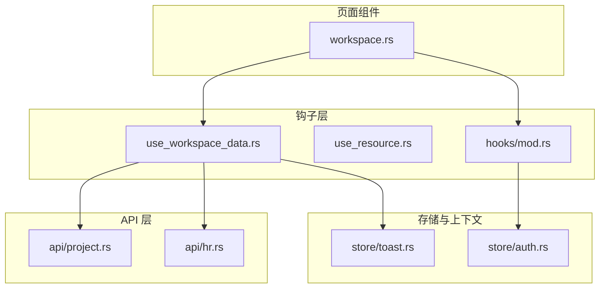
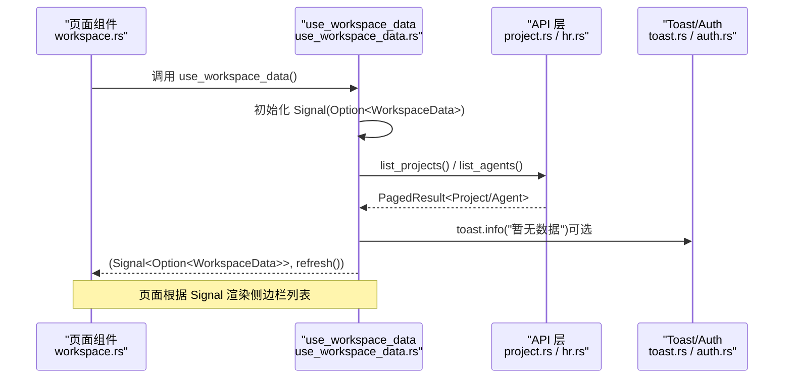
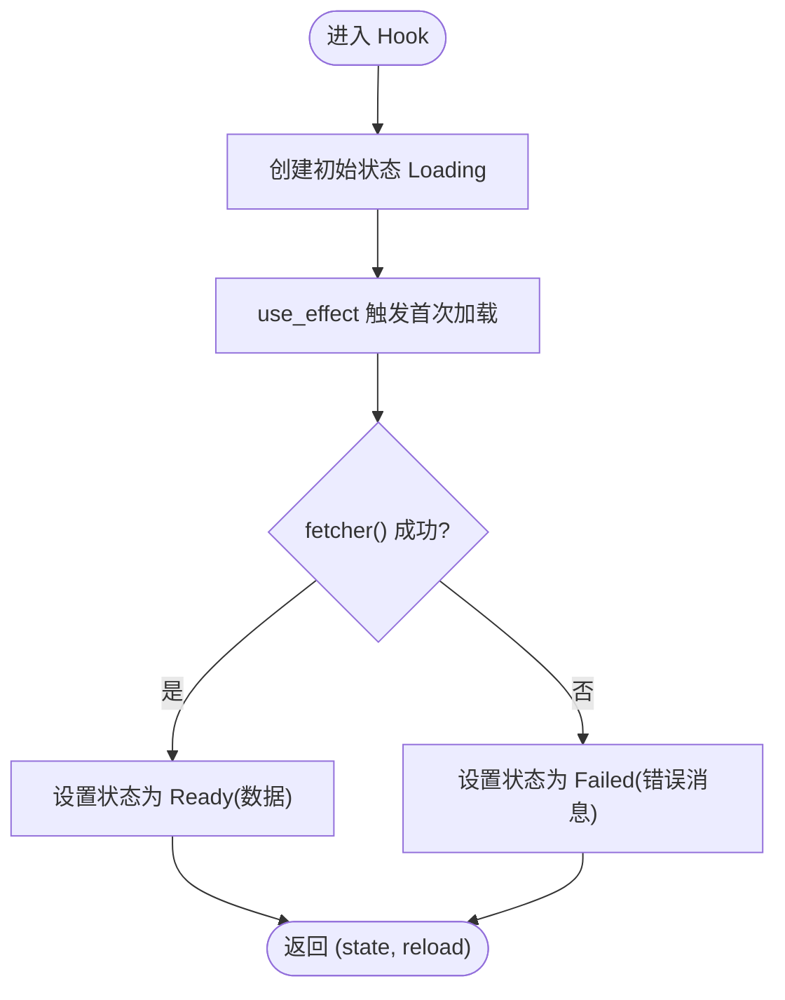
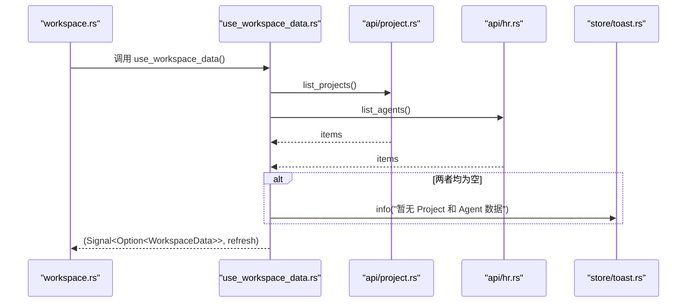
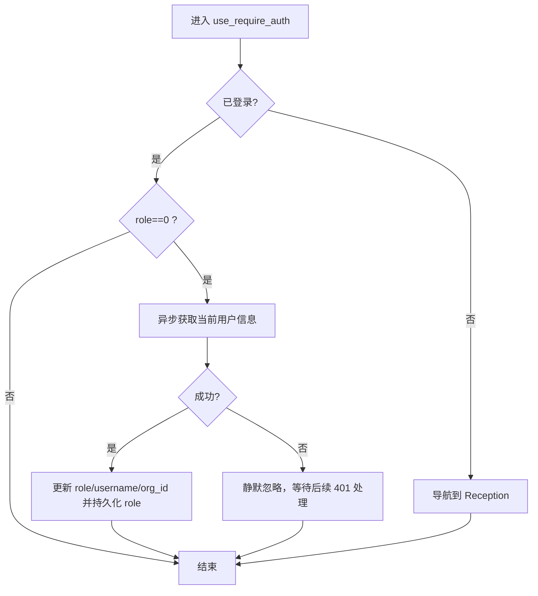
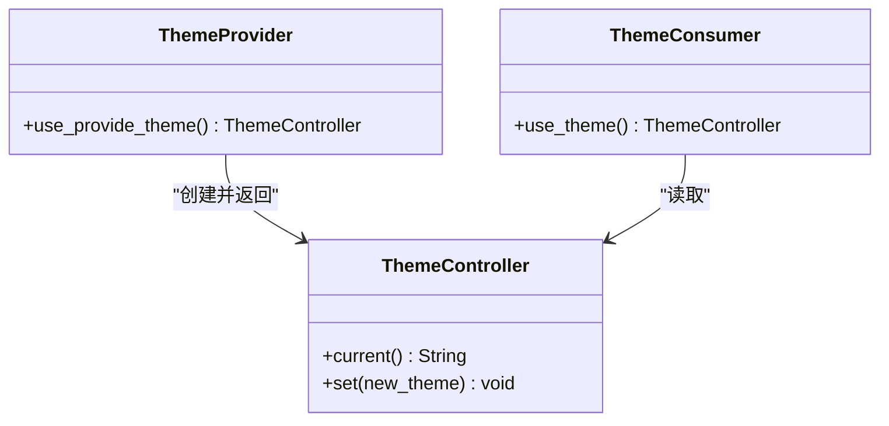
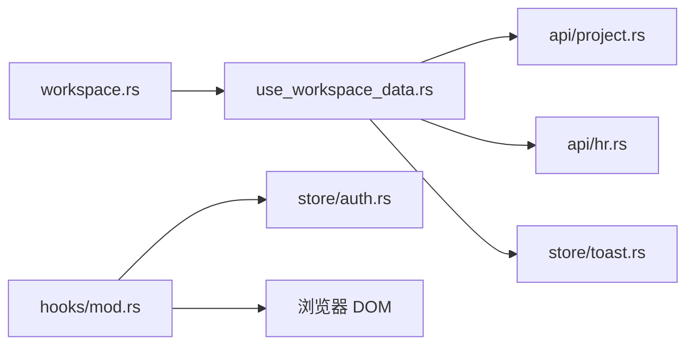

# 钩子系统

<cite>
**本文引用的文件**
- [frontend/src/hooks/mod.rs](frontend/src/hooks/mod.rs)
- [frontend/src/hooks/use_resource.rs](frontend/src/hooks/use_resource.rs)
- [frontend/src/hooks/use_workspace_data.rs](frontend/src/hooks/use_workspace_data.rs)
- [frontend/src/pages/workspace.rs](frontend/src/pages/workspace.rs)
- [frontend/src/store/auth.rs](frontend/src/store/auth.rs)
- [frontend/src/store/toast.rs](frontend/src/store/toast.rs)
- [frontend/src/api/project.rs](frontend/src/api/project.rs)
- [frontend/src/api/hr.rs](frontend/src/api/hr.rs)
</cite>

## 目录
1. [简介](#简介)
2. [项目结构](#项目结构)
3. [核心组件](#核心组件)
4. [架构总览](#架构总览)
5. [详细组件分析](#详细组件分析)
6. [依赖关系分析](#依赖关系分析)
7. [性能考量](#性能考量)
8. [故障排查指南](#故障排查指南)
9. [结论](#结论)
10. [附录：自定义 Hook 开发规范与最佳实践](#附录：自定义-hook-开发规范与最佳实践)

## 简介
本文件面向 AI Orz 前端（基于 Dioxus 0.7）的“钩子系统”，聚焦以下目标：
- 系统介绍基于 Dioxus 的自定义 Hook 设计模式与实现方法
- 详细说明资源管理 Hook、工作区数据 Hook 等核心钩子的使用场景与调用方式
- 阐述钩子的生命周期管理、状态同步与错误处理机制
- 提供组合使用、性能优化与调试技巧
- 记录自定义 Hook 的开发规范与最佳实践，并给出完整示例路径以便快速复用

## 项目结构
前端钩子集中在 frontend/src/hooks 目录，配合 store（全局状态）、api（HTTP 封装）与页面组件共同构成“数据获取 + 状态驱动 UI”的闭环。典型调用链为：页面组件 → 自定义 Hook → API 层 → 后端服务；同时通过 store 中的 Signal/Context 进行跨组件状态共享与副作用管理。

图表来源
- [frontend/src/pages/workspace.rs:103-134](frontend/src/pages/workspace.rs#L103-L134)
- [frontend/src/hooks/use_workspace_data.rs:23-53](frontend/src/hooks/use_workspace_data.rs#L23-L53)
- [frontend/src/hooks/mod.rs:19-54](frontend/src/hooks/mod.rs#L19-L54)
- [frontend/src/store/auth.rs:59-93](frontend/src/store/auth.rs#L59-L93)
- [frontend/src/store/toast.rs:37-111](frontend/src/store/toast.rs#L37-L111)
- [frontend/src/api/project.rs:16-27](frontend/src/api/project.rs#L16-L27)
- [frontend/src/api/hr.rs:25-32](frontend/src/api/hr.rs#L25-L32)

章节来源
- [frontend/src/pages/workspace.rs:103-134](frontend/src/pages/workspace.rs#L103-L134)
- [frontend/src/hooks/mod.rs:15-54](frontend/src/hooks/mod.rs#L15-L54)
- [frontend/src/hooks/use_resource.rs:1-41](frontend/src/hooks/use_resource.rs#L1-L41)
- [frontend/src/hooks/use_workspace_data.rs:1-54](frontend/src/hooks/use_workspace_data.rs#L1-L54)
- [frontend/src/store/auth.rs:1-94](frontend/src/store/auth.rs#L1-L94)
- [frontend/src/store/toast.rs:1-112](frontend/src/store/toast.rs#L1-L112)
- [frontend/src/api/project.rs:1-163](frontend/src/api/project.rs#L1-L163)
- [frontend/src/api/hr.rs:1-311](frontend/src/api/hr.rs#L1-L311)

## 核心组件
- use_resource：通用异步资源加载 Hook，封装 Loading/Ready/Failed 三态，自动在 effect 中触发首次加载，并提供手动刷新能力
- use_workspace_data：工作台侧边栏数据加载 Hook，并发拉取 projects 与 agents 列表，返回信号与刷新函数
- use_require_auth：认证守卫 Hook，未登录时跳转至接待页，并在刷新后尝试回填角色信息
- ThemeController / use_provide_theme / use_theme：主题控制器与提供者，基于 Context + Signal 实现全局主题切换与持久化
- ToastState / use_toast：全局通知系统，支持成功/错误/警告/信息四类提示，便于在 Hook 中统一反馈用户

章节来源
- [frontend/src/hooks/use_resource.rs:1-41](frontend/src/hooks/use_resource.rs#L1-L41)
- [frontend/src/hooks/use_workspace_data.rs:1-54](frontend/src/hooks/use_workspace_data.rs#L1-L54)
- [frontend/src/hooks/mod.rs:19-54](frontend/src/hooks/mod.rs#L19-L54)
- [frontend/src/hooks/mod.rs:102-139](frontend/src/hooks/mod.rs#L102-L139)
- [frontend/src/store/toast.rs:1-112](frontend/src/store/toast.rs#L1-L112)

## 架构总览
下图展示了从页面到钩子再到 API 与存储的完整调用链路，以及错误与通知的处理路径。

图表来源
- [frontend/src/pages/workspace.rs:103-134](frontend/src/pages/workspace.rs#L103-L134)
- [frontend/src/hooks/use_workspace_data.rs:23-53](frontend/src/hooks/use_workspace_data.rs#L23-L53)
- [frontend/src/api/project.rs:16-27](frontend/src/api/project.rs#L16-L27)
- [frontend/src/api/hr.rs:25-32](frontend/src/api/hr.rs#L25-L32)
- [frontend/src/store/toast.rs:75-94](frontend/src/store/toast.rs#L75-L94)

## 详细组件分析

### 资源管理 Hook：use_resource
- 职责：将任意异步 fetcher 包装为可订阅的信号状态，包含 Loading/Ready/Failed 三种状态
- 生命周期：
  - 组件挂载时通过 effect 自动执行一次加载
  - 可通过返回的刷新函数主动触发重新加载
- 状态同步：内部使用 Signal<ResourceState<T>>，UI 直接消费该信号
- 错误处理：失败时将错误消息写入 Failed 状态，由 UI 决定展示策略
- 适用场景：单条资源的懒加载、重试、统一错误态展示

图表来源
- [frontend/src/hooks/use_resource.rs:12-40](frontend/src/hooks/use_resource.rs#L12-L40)

章节来源
- [frontend/src/hooks/use_resource.rs:1-41](frontend/src/hooks/use_resource.rs#L1-L41)

### 工作区数据 Hook：use_workspace_data
- 职责：并发加载侧边栏所需的 projects 与 agents 列表，返回数据信号与刷新函数
- 生命周期：
  - 组件挂载时 effect 触发 load
  - 外部调用 refresh 可再次触发加载
- 状态同步：返回 Option<WorkspaceData>，UI 按 None/Some 分支渲染
- 错误处理：请求失败时采用默认空集合，避免阻断渲染；当两者皆空时通过 Toast 提示
- 组合使用：在 workspace 页面中作为侧边栏数据源，中心图任务数据按需加载

图表来源
- [frontend/src/hooks/use_workspace_data.rs:23-53](frontend/src/hooks/use_workspace_data.rs#L23-L53)
- [frontend/src/api/project.rs:16-27](frontend/src/api/project.rs#L16-L27)
- [frontend/src/api/hr.rs:25-32](frontend/src/api/hr.rs#L25-L32)
- [frontend/src/store/toast.rs:75-94](frontend/src/store/toast.rs#L75-L94)

章节来源
- [frontend/src/hooks/use_workspace_data.rs:1-54](frontend/src/hooks/use_workspace_data.rs#L1-L54)
- [frontend/src/pages/workspace.rs:103-134](frontend/src/pages/workspace.rs#L103-L134)

### 认证守卫 Hook：use_require_auth
- 职责：在未登录时重定向至接待页；刷新后若 role 缺失则尝试从接口回填
- 生命周期：
  - 每次渲染时读取 AuthState，必要时触发导航
  - 仅在 role=0 时发起用户信息查询，避免重复请求
- 状态同步：依赖 store/auth 的 Signal<AuthState>
- 错误处理：获取用户信息失败时静默处理，后续 API 调用会触发 401 由各页面自行处理

图表来源
- [frontend/src/hooks/mod.rs:19-54](frontend/src/hooks/mod.rs#L19-L54)
- [frontend/src/store/auth.rs:59-93](frontend/src/store/auth.rs#L59-L93)

章节来源
- [frontend/src/hooks/mod.rs:19-54](frontend/src/hooks/mod.rs#L19-L54)
- [frontend/src/store/auth.rs:1-94](frontend/src/store/auth.rs#L1-L94)

### 主题控制器：ThemeController / use_provide_theme / use_theme
- 职责：提供全局主题状态与控制器，支持本地存储持久化与 DOM data-theme 同步
- 生命周期：
  - 根组件调用 provide 注入 Context
  - 子组件通过 use_theme 获取控制器
- 状态同步：Signal<String> 作为主题值，变更时立即写回 HTML 属性
- 错误处理：DOM 操作失败时静默忽略

图表来源
- [frontend/src/hooks/mod.rs:102-139](frontend/src/hooks/mod.rs#L102-L139)

章节来源
- [frontend/src/hooks/mod.rs:102-139](frontend/src/hooks/mod.rs#L102-L139)

### 全局通知：ToastState / use_toast
- 职责：集中管理通知队列，提供 success/error/warning/info 快捷方法
- 生命周期：
  - 根组件 provide 注入全局状态
  - 任意子组件通过 use_toast 获取实例并显示通知
- 状态同步：Signal<Vec<ToastItem>> 驱动 UI 渲染
- 错误处理：无异常捕获，调用方负责传入有效消息

章节来源
- [frontend/src/store/toast.rs:1-112](frontend/src/store/toast.rs#L1-L112)

## 依赖关系分析
- 页面组件 workspace.rs 依赖 use_workspace_data 获取侧边栏数据，并依赖 use_toast 进行错误提示
- use_workspace_data 依赖 api/project.rs 与 api/hr.rs 获取项目与代理列表
- hooks/mod.rs 中的 use_require_auth 依赖 store/auth.rs 的认证状态
- ThemeController 依赖 local storage 与 DOM API 进行主题持久化与同步

图表来源
- [frontend/src/pages/workspace.rs:103-134](frontend/src/pages/workspace.rs#L103-L134)
- [frontend/src/hooks/use_workspace_data.rs:23-53](frontend/src/hooks/use_workspace_data.rs#L23-L53)
- [frontend/src/api/project.rs:16-27](frontend/src/api/project.rs#L16-L27)
- [frontend/src/api/hr.rs:25-32](frontend/src/api/hr.rs#L25-L32)
- [frontend/src/store/toast.rs:75-94](frontend/src/store/toast.rs#L75-L94)
- [frontend/src/hooks/mod.rs:19-54](frontend/src/hooks/mod.rs#L19-L54)

章节来源
- [frontend/src/pages/workspace.rs:103-134](frontend/src/pages/workspace.rs#L103-L134)
- [frontend/src/hooks/use_workspace_data.rs:23-53](frontend/src/hooks/use_workspace_data.rs#L23-L53)
- [frontend/src/hooks/mod.rs:19-54](frontend/src/hooks/mod.rs#L19-L54)

## 性能考量
- 并发加载：use_workspace_data 并发请求 projects 与 agents，减少首屏等待时间
- 条件请求：use_require_auth 仅在 role=0 时触发用户信息查询，避免重复网络开销
- 局部更新：所有状态均通过 Signal 驱动，仅变更部分视图重渲染
- 降级策略：当列表为空时不阻断渲染，并通过 Toast 提示，提升用户体验
- 建议：
  - 对高频刷新场景增加防抖或节流
  - 对大列表分页加载，避免一次性全量渲染
  - 对网络错误进行统一重试与退避策略

[本节为通用指导，无需引用具体文件]

## 故障排查指南
- 认证问题：
  - 现象：刷新后管理员菜单消失
  - 原因：旧 session 未持久化 role
  - 解决：use_require_auth 在 role=0 时调用用户信息接口回填并持久化 role
- 数据为空：
  - 现象：侧边栏无项目或代理
  - 原因：后端无数据或网络异常
  - 解决：检查 API 响应；use_workspace_data 会在两者皆空时提示
- 主题不生效：
  - 现象：切换主题无效
  - 原因：DOM 操作失败或 Context 未提供
  - 解决：确保在根组件调用 provide，并检查浏览器控制台是否有 DOM 错误

章节来源
- [frontend/src/hooks/mod.rs:19-54](frontend/src/hooks/mod.rs#L19-L54)
- [frontend/src/hooks/use_workspace_data.rs:27-43](frontend/src/hooks/use_workspace_data.rs#L27-L43)
- [frontend/src/store/auth.rs:59-93](frontend/src/store/auth.rs#L59-L93)

## 结论
AI Orz 前端的钩子系统以 Dioxus 的 Signal/Context 为核心，结合轻量化的自定义 Hook，实现了资源加载、认证守卫、主题控制与全局通知的统一抽象。通过 use_resource 与 use_workspace_data 等 Hook，页面组件可以专注于业务逻辑与 UI 表达，而将数据流、副作用与错误处理下沉到 Hook 层。整体架构清晰、可扩展性强，适合在多页面、多模块的前端应用中复用与演进。

[本节为总结性内容，无需引用具体文件]

## 附录：自定义 Hook 开发规范与最佳实践
- 命名与职责
  - 以 use_ 开头命名，单一职责，避免在一个 Hook 中耦合过多逻辑
  - 返回 Signal 与副作用函数（如刷新），保持纯数据与操作的解耦
- 生命周期管理
  - 使用 use_effect 触发副作用，use_drop 清理资源（如事件监听、SSE 连接）
  - 避免在 effect 中产生不必要的重复请求，使用条件判断与缓存
- 状态同步
  - 优先使用 Signal 进行细粒度更新，减少不必要重渲染
  - 复杂状态拆分为多个 Signal，提高可读性与可维护性
- 错误处理
  - 统一错误态（如 ResourceState::Failed），由 UI 决定展示策略
  - 在网络层与 Hook 层分别处理错误，避免重复逻辑
- 组合使用
  - 将通用逻辑抽取为独立 Hook，组合多个 Hook 完成复杂流程
  - 通过 Context 提供全局能力（如 Toast、Auth、Theme），Hook 内消费
- 调试技巧
  - 在关键路径打印日志或使用浏览器开发者工具观察 Signal 变化
  - 对异步流程增加超时与重试，便于定位慢请求与失败场景
- 代码示例路径
  - 资源加载：参考 [frontend/src/hooks/use_resource.rs:12-40](frontend/src/hooks/use_resource.rs#L12-L40)
  - 工作区数据：参考 [frontend/src/hooks/use_workspace_data.rs:23-53](frontend/src/hooks/use_workspace_data.rs#L23-L53)
  - 认证守卫：参考 [frontend/src/hooks/mod.rs:19-54](frontend/src/hooks/mod.rs#L19-L54)
  - 主题控制：参考 [frontend/src/hooks/mod.rs:102-139](frontend/src/hooks/mod.rs#L102-L139)
  - 全局通知：参考 [frontend/src/store/toast.rs:75-94](frontend/src/store/toast.rs#L75-L94)

[本节为规范与实践指导，无需额外引用文件]