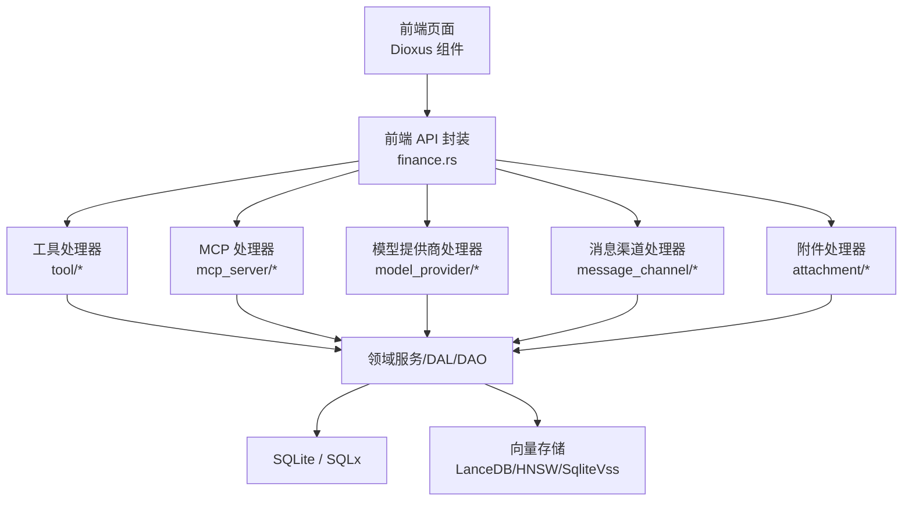
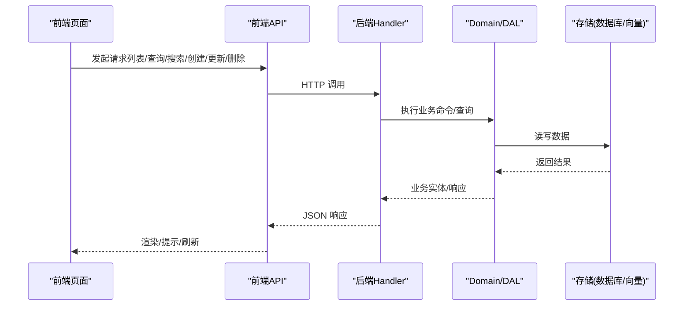
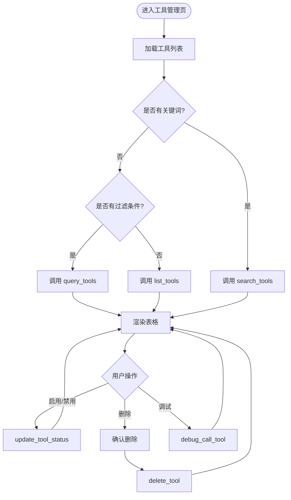
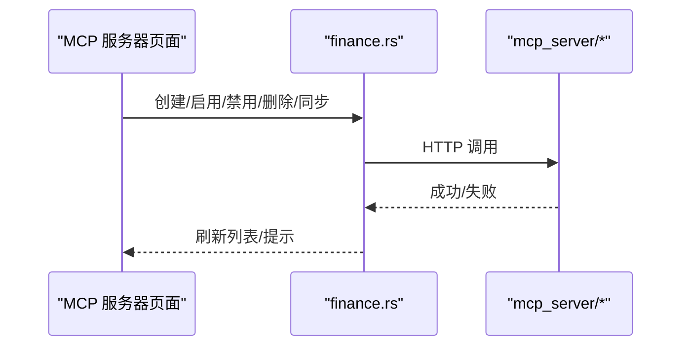
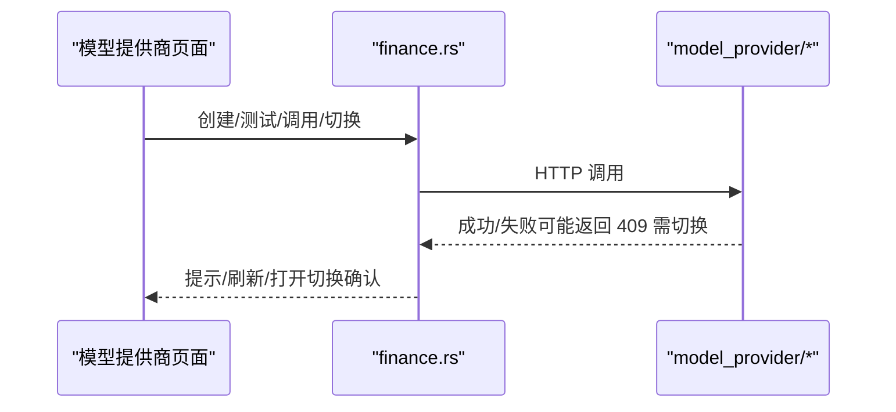
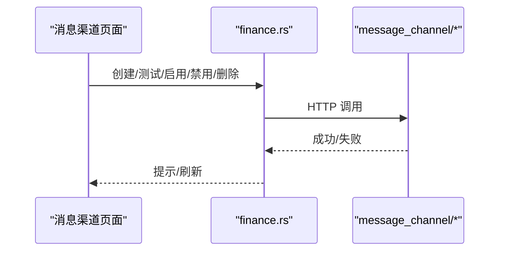
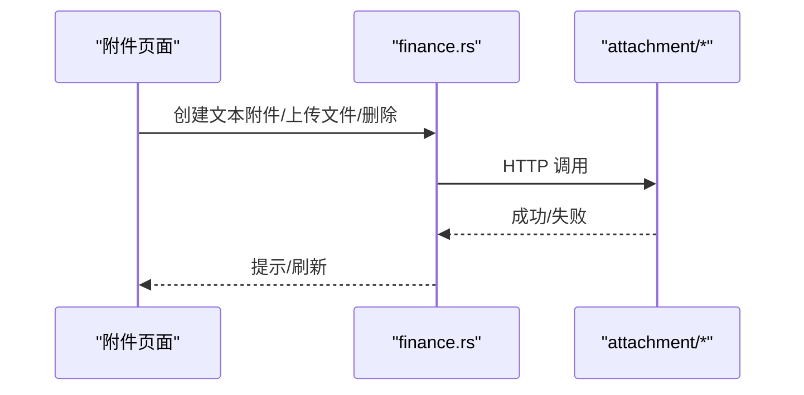
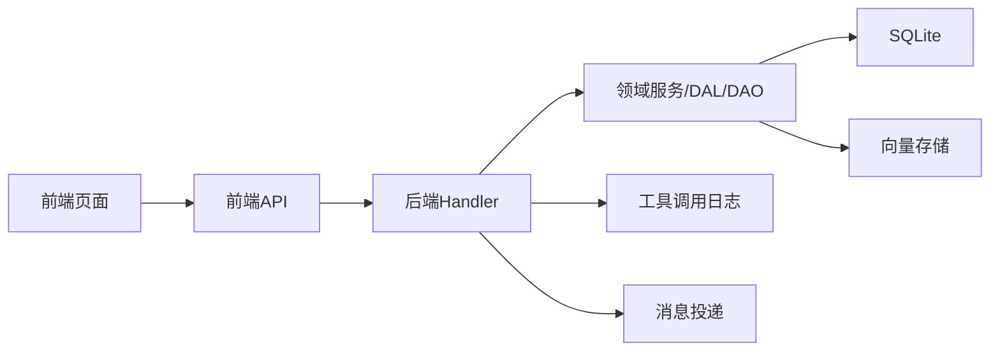

# Finance 管理页面

<cite>
**本文引用的文件**
- [frontend/src/pages/finance/mod.rs](frontend/src/pages/finance/mod.rs)
- [frontend/src/pages/finance/tools.rs](frontend/src/pages/finance/tools.rs)
- [frontend/src/pages/finance/mcp_servers.rs](frontend/src/pages/finance/mcp_servers.rs)
- [frontend/src/pages/finance/model_providers.rs](frontend/src/pages/finance/model_providers.rs)
- [frontend/src/pages/finance/message_channels.rs](frontend/src/pages/finance/message_channels.rs)
- [frontend/src/pages/finance/attachments.rs](frontend/src/pages/finance/attachments.rs)
- [frontend/src/api/finance.rs](frontend/src/api/finance.rs)
- [src/handlers/finance/mod.rs](src/handlers/finance/mod.rs)
- [src/handlers/finance/tool/mod.rs](src/handlers/finance/tool/mod.rs)
- [src/handlers/finance/mcp_server/mod.rs](src/handlers/finance/mcp_server/mod.rs)
- [src/handlers/finance/model_provider/mod.rs](src/handlers/finance/model_provider/mod.rs)
- [src/handlers/finance/message_channel/mod.rs](src/handlers/finance/message_channel/mod.rs)
- [src/handlers/finance/attachment/mod.rs](src/handlers/finance/attachment/mod.rs)
- [src/pkg/tool_tracing/mod.rs](src/pkg/tool_tracing/mod.rs)
- [src/consumer/message.rs](src/consumer/message.rs)
</cite>

## 目录
1. [简介](#简介)
2. [项目结构](#项目结构)
3. [核心组件](#核心组件)
4. [架构总览](#架构总览)
5. [详细组件分析](#详细组件分析)
6. [依赖关系分析](#依赖关系分析)
7. [性能考虑](#性能考虑)
8. [故障排查指南](#故障排查指南)
9. [结论](#结论)
10. [附录](#附录)

## 简介
Finance 管理页面模块提供面向运营与管理员的五大管理能力：工具管理系统、MCP 服务器集成、模型提供商管理、消息渠道管理与附件管理。前端基于 Dioxus（WASM）+ Tailwind/DaisyUI，后端采用 Axum 路由 + 按方法拆分的 Handler，领域服务通过 DAL/DAO 访问 SQLite（SQLx）与向量存储（LanceDB/HNSW/SqliteVss），并配合 AOP 统计与日志追踪。

本模块强调：
- 数据绑定：前端信号驱动视图更新，统一使用 toast 提示与确认对话框。
- 表单验证：必填校验、类型转换、可选字段空值处理。
- 异步操作：spawn 异步任务、防抖搜索、请求去重。
- 错误恢复：失败重试、状态刷新、用户可感知的错误提示。
- 监控与审计：工具执行日志、模型调用统计、消息投递追踪、文件存储优化。

## 项目结构
Finance 管理页面由前后端协同组成：
- 前端页面：位于 frontend/src/pages/finance，包含工具、MCP 服务器、模型提供商、消息渠道、附件等页面及详情页。
- 前端 API 封装：frontend/src/api/finance.rs，统一 HTTP 调用与参数序列化。
- 后端 Handler：src/handlers/finance/*，按资源域划分，每个接口独立文件，便于维护与测试。
- 通用能力：src/pkg/tool_tracing 提供工具调用日志；消费者层负责消息投递与结果回写。

图表来源
- [frontend/src/pages/finance/mod.rs:1-12](frontend/src/pages/finance/mod.rs#L1-L12)
- [frontend/src/api/finance.rs:24-332](frontend/src/api/finance.rs#L24-L332)
- [src/handlers/finance/mod.rs:1-15](src/handlers/finance/mod.rs#L1-L15)

章节来源
- [frontend/src/pages/finance/mod.rs:1-12](frontend/src/pages/finance/mod.rs#L1-L12)
- [src/handlers/finance/mod.rs:1-15](src/handlers/finance/mod.rs#L1-L15)

## 核心组件
- 工具管理：支持列表、查询、搜索、启用/禁用、删除、调试调用、标签聚合、调用记录查询。
- MCP 服务器集成：支持创建、启用/禁用、删除、同步工具、详情查看。
- 模型提供商管理：支持多模型配置、连接测试、调用测试、切换 Embedding Provider、重建向量索引。
- 消息渠道管理：支持多渠道配置、启用/禁用、连接测试、删除。
- 附件管理：支持文本附件创建、文件上传、内容获取与更新、删除。

章节来源
- [frontend/src/pages/finance/tools.rs:1-289](frontend/src/pages/finance/tools.rs#L1-L289)
- [frontend/src/pages/finance/mcp_servers.rs:1-306](frontend/src/pages/finance/mcp_servers.rs#L1-L306)
- [frontend/src/pages/finance/model_providers.rs:1-502](frontend/src/pages/finance/model_providers.rs#L1-L502)
- [frontend/src/pages/finance/message_channels.rs:1-332](frontend/src/pages/finance/message_channels.rs#L1-L332)
- [frontend/src/pages/finance/attachments.rs:1-187](frontend/src/pages/finance/attachments.rs#L1-L187)
- [frontend/src/api/finance.rs:24-332](frontend/src/api/finance.rs#L24-L332)

## 架构总览
Finance 管理页面遵循四层单向调用：Adapter（HTTP Handler）→ Domain → DAL → DAO。前端通过 API 封装调用后端 Handler，Handler 委托领域服务完成业务逻辑，DAL/DAO 负责持久化与查询。AOP 与日志追踪贯穿关键路径，保障可观测性。

图表来源
- [frontend/src/api/finance.rs:24-332](frontend/src/api/finance.rs#L24-L332)
- [src/handlers/finance/tool/mod.rs:1-46](src/handlers/finance/tool/mod.rs#L1-L46)
- [src/handlers/finance/mcp_server/mod.rs:1-24](src/handlers/finance/mcp_server/mod.rs#L1-L24)
- [src/handlers/finance/model_provider/mod.rs:1-25](src/handlers/finance/model_provider/mod.rs#L1-L25)
- [src/handlers/finance/message_channel/mod.rs:1-22](src/handlers/finance/message_channel/mod.rs#L1-L22)
- [src/handlers/finance/attachment/mod.rs:1-21](src/handlers/finance/attachment/mod.rs#L1-L21)

## 详细组件分析

### 工具管理系统
- 功能要点
  - 列表/查询/搜索：无关键词时走 list/query，有关键词走 search，支持协议与状态过滤。
  - 状态切换：启用/禁用工具，成功后刷新列表。
  - 删除：二次确认后删除，失败提示。
  - 调试调用：管理员专用，直接调用工具并返回执行结果与 trace 引用。
  - 调用记录：支持按 call_id/agent/project/task/tool/status 时间范围分页查询。
- 数据绑定与交互
  - 使用信号管理工具列表、加载态、搜索词、过滤条件。
  - 搜索输入防抖 300ms，避免频繁请求；使用 request id 丢弃过期结果。
  - 错误通过 toast 提示，成功则刷新数据。
- 后端接口
  - 工具 CRUD、查询、搜索、状态更新、调试调用、标签聚合、调用记录查询。

图表来源
- [frontend/src/pages/finance/tools.rs:36-101](frontend/src/pages/finance/tools.rs#L36-L101)
- [frontend/src/pages/finance/tools.rs:153-170](frontend/src/pages/finance/tools.rs#L153-L170)
- [frontend/src/pages/finance/tools.rs:218-255](frontend/src/pages/finance/tools.rs#L218-L255)
- [frontend/src/pages/finance/tools.rs:267-285](frontend/src/pages/finance/tools.rs#L267-L285)
- [frontend/src/api/finance.rs:107-163](frontend/src/api/finance.rs#L107-L163)
- [src/handlers/finance/tool/mod.rs:1-46](src/handlers/finance/tool/mod.rs#L1-L46)

章节来源
- [frontend/src/pages/finance/tools.rs:1-289](frontend/src/pages/finance/tools.rs#L1-L289)
- [frontend/src/api/finance.rs:107-163](frontend/src/api/finance.rs#L107-L163)
- [src/handlers/finance/tool/mod.rs:1-46](src/handlers/finance/tool/mod.rs#L1-L46)

### MCP 服务器集成
- 功能要点
  - 服务器管理：创建（Stdio/StreamableHttp）、启用/禁用、删除、详情查看。
  - 工具同步：触发从 MCP 服务器同步工具到系统。
- 数据绑定与交互
  - 新增表单根据传输方式动态显示 URL 或命令字段。
  - 创建成功后自动刷新列表，错误通过 toast 提示。
  - 同步工具后提示成功并刷新列表。
- 后端接口
  - MCP 服务器 CRUD、状态更新、工具同步。

图表来源
- [frontend/src/pages/finance/mcp_servers.rs:48-99](frontend/src/pages/finance/mcp_servers.rs#L48-L99)
- [frontend/src/pages/finance/mcp_servers.rs:208-222](frontend/src/pages/finance/mcp_servers.rs#L208-L222)
- [frontend/src/api/finance.rs:205-235](frontend/src/api/finance.rs#L205-L235)
- [src/handlers/finance/mcp_server/mod.rs:1-24](src/handlers/finance/mcp_server/mod.rs#L1-L24)

章节来源
- [frontend/src/pages/finance/mcp_servers.rs:1-306](frontend/src/pages/finance/mcp_servers.rs#L1-L306)
- [frontend/src/api/finance.rs:205-235](frontend/src/api/finance.rs#L205-L235)
- [src/handlers/finance/mcp_server/mod.rs:1-24](src/handlers/finance/mcp_server/mod.rs#L1-L24)

### 模型提供商管理
- 功能要点
  - 多模型配置：名称、类型、模型名、API Key、Base URL、描述、上下文长度等。
  - 连接测试：创建后自动测试连接，也可手动测试。
  - 调用测试：发送 prompt 获取模型响应。
  - 切换 Embedding Provider：需用户确认，将禁用当前、启用新 Provider 并重建向量索引。
- 数据绑定与交互
  - 表单必填校验（名称、模型名），可选字段空值处理。
  - 切换 Embedding Provider 时弹出确认模态框，提示重建影响。
  - 错误通过 toast 提示，成功刷新列表。
- 后端接口
  - 提供商 CRUD、状态切换、连接测试、调用测试、切换 Embedding Provider。

图表来源
- [frontend/src/pages/finance/model_providers.rs:64-116](frontend/src/pages/finance/model_providers.rs#L64-L116)
- [frontend/src/pages/finance/model_providers.rs:118-132](frontend/src/pages/finance/model_providers.rs#L118-L132)
- [frontend/src/pages/finance/model_providers.rs:134-159](frontend/src/pages/finance/model_providers.rs#L134-L159)
- [frontend/src/api/finance.rs:24-103](frontend/src/api/finance.rs#L24-L103)
- [src/handlers/finance/model_provider/mod.rs:1-25](src/handlers/finance/model_provider/mod.rs#L1-L25)

章节来源
- [frontend/src/pages/finance/model_providers.rs:1-502](frontend/src/pages/finance/model_providers.rs#L1-L502)
- [frontend/src/api/finance.rs:24-103](frontend/src/api/finance.rs#L24-L103)
- [src/handlers/finance/model_provider/mod.rs:1-25](src/handlers/finance/model_provider/mod.rs#L1-L25)

### 消息渠道管理
- 功能要点
  - 多渠道配置：飞书、微信、Slack、邮件、Webhook 等。
  - 连接测试：验证渠道连通性与配置正确性。
  - 启用/禁用：控制渠道可用性。
- 数据绑定与交互
  - 创建表单根据渠道类型动态显示必要字段（如飞书 Open ID、Webhook URL）。
  - 连接测试结果通过 toast 反馈。
  - 删除前二次确认。
- 后端接口
  - 渠道 CRUD、状态更新、连接测试。

图表来源
- [frontend/src/pages/finance/message_channels.rs:50-121](frontend/src/pages/finance/message_channels.rs#L50-L121)
- [frontend/src/pages/finance/message_channels.rs:202-218](frontend/src/pages/finance/message_channels.rs#L202-L218)
- [frontend/src/api/finance.rs:167-201](frontend/src/api/finance.rs#L167-L201)
- [src/handlers/finance/message_channel/mod.rs:1-22](src/handlers/finance/message_channel/mod.rs#L1-L22)

章节来源
- [frontend/src/pages/finance/message_channels.rs:1-332](frontend/src/pages/finance/message_channels.rs#L1-L332)
- [frontend/src/api/finance.rs:167-201](frontend/src/api/finance.rs#L167-L201)
- [src/handlers/finance/message_channel/mod.rs:1-22](src/handlers/finance/message_channel/mod.rs#L1-L22)

### 附件管理
- 功能要点
  - 文本附件：创建、删除、详情查看、内容获取与更新。
  - 文件上传：multipart/form-data 上传，返回附件详情。
- 数据绑定与交互
  - 创建表单必填文件名与内容，错误即时提示。
  - 删除前二次确认，成功后刷新列表。
- 后端接口
  - 附件 CRUD、内容获取/更新、上传。

图表来源
- [frontend/src/pages/finance/attachments.rs:41-73](frontend/src/pages/finance/attachments.rs#L41-L73)
- [frontend/src/pages/finance/attachments.rs:162-183](frontend/src/pages/finance/attachments.rs#L162-L183)
- [frontend/src/api/finance.rs:237-282](frontend/src/api/finance.rs#L237-L282)
- [src/handlers/finance/attachment/mod.rs:1-21](src/handlers/finance/attachment/mod.rs#L1-L21)

章节来源
- [frontend/src/pages/finance/attachments.rs:1-187](frontend/src/pages/finance/attachments.rs#L1-L187)
- [frontend/src/api/finance.rs:237-282](frontend/src/api/finance.rs#L237-L282)
- [src/handlers/finance/attachment/mod.rs:1-21](src/handlers/finance/attachment/mod.rs#L1-L21)

## 依赖关系分析
- 前端依赖
  - 页面组件依赖 API 封装函数，统一错误处理与提示。
  - 使用 Dioxus 信号进行状态管理，确保响应式更新。
- 后端依赖
  - Handler 按资源域组织，职责单一，便于测试与维护。
  - 领域服务通过 DAL/DAO 访问 SQLite 与向量存储，保证数据一致性。
- 可观测性依赖
  - 工具调用日志通过 tool_tracing 模块记录，支持按日归档与检索。
  - 消息投递与工具执行结果在消费者层写入消息系统，形成闭环。

图表来源
- [frontend/src/api/finance.rs:24-332](frontend/src/api/finance.rs#L24-L332)
- [src/handlers/finance/tool/mod.rs:1-46](src/handlers/finance/tool/mod.rs#L1-L46)
- [src/pkg/tool_tracing/mod.rs:1-12](src/pkg/tool_tracing/mod.rs#L1-L12)
- [src/consumer/message.rs:439-477](src/consumer/message.rs#L439-L477)

章节来源
- [frontend/src/api/finance.rs:24-332](frontend/src/api/finance.rs#L24-L332)
- [src/pkg/tool_tracing/mod.rs:1-12](src/pkg/tool_tracing/mod.rs#L1-L12)
- [src/consumer/message.rs:439-477](src/consumer/message.rs#L439-L477)

## 性能考虑
- 前端优化
  - 搜索防抖：减少重复请求，提升用户体验。
  - 请求去重：使用 request id 丢弃过期结果，避免竞态。
  - 局部刷新：仅更新必要状态，降低重渲染开销。
- 后端优化
  - 分页与过滤：列表与查询接口支持分页与条件过滤，减少数据传输量。
  - 向量索引重建：切换 Embedding Provider 时提示重建耗时，避免阻塞主流程。
  - 日志与统计：工具调用日志按日归档，避免单文件过大；统计事件通过 AOP 异步记录。
- 存储优化
  - 附件分片与压缩：大文件建议分块上传与压缩存储。
  - 向量存储降级：支持 HNSW/InMemory/SqliteVss 多后端降级，保障稳定性。

[本节为通用指导，不直接分析具体文件]

## 故障排查指南
- 常见错误与恢复
  - 网络错误：toast 提示失败原因，支持重试或检查配置。
  - 权限不足：调试调用需管理员权限，未授权时提示。
  - 连接失败：模型提供商或消息渠道连接测试失败，检查配置与网络。
  - 向量重建：切换 Embedding Provider 后重建索引期间搜索受影响，等待完成。
- 日志与追踪
  - 工具调用日志：通过 tool_tracing 模块查看每日 JSONL 日志，定位执行问题。
  - 消息投递：消费者层记录工具执行结果与消息投递状态，便于追踪链路。
- 调试建议
  - 使用浏览器开发者工具查看网络请求与响应。
  - 在后端日志中搜索相关 call_id 或 agent_id，定位问题根因。

章节来源
- [src/pkg/tool_tracing/mod.rs:1-12](src/pkg/tool_tracing/mod.rs#L1-L12)
- [src/consumer/message.rs:439-477](src/consumer/message.rs#L439-L477)

## 结论
Finance 管理页面模块以清晰的前后端分层与模块化设计，提供了完整的工具管理、MCP 集成、模型提供商管理、消息渠道管理与附件管理能力。通过信号驱动的数据绑定、严格的表单验证、健壮的异步处理与错误恢复机制，以及完善的日志与统计追踪，确保了系统的可维护性与可观测性。建议在后续迭代中继续强化性能优化与安全加固，进一步提升用户体验与系统稳定性。

[本节为总结性内容，不直接分析具体文件]

## 附录
- 安全配置与访问控制
  - 敏感信息（如 API Key）在前端以密码输入形式展示，避免明文泄露。
  - 调试调用限制管理员权限，防止滥用。
  - 后端 Handler 应结合认证中间件与角色校验，确保接口安全。
- 最佳实践
  - 前端：统一错误处理、用户友好提示、防抖与去重。
  - 后端：按方法拆分 Handler、领域服务解耦、DAL/DAO 专注数据访问。
  - 监控：AOP 统计与日志追踪贯穿关键路径，便于问题定位与性能分析。

[本节为通用指导，不直接分析具体文件]