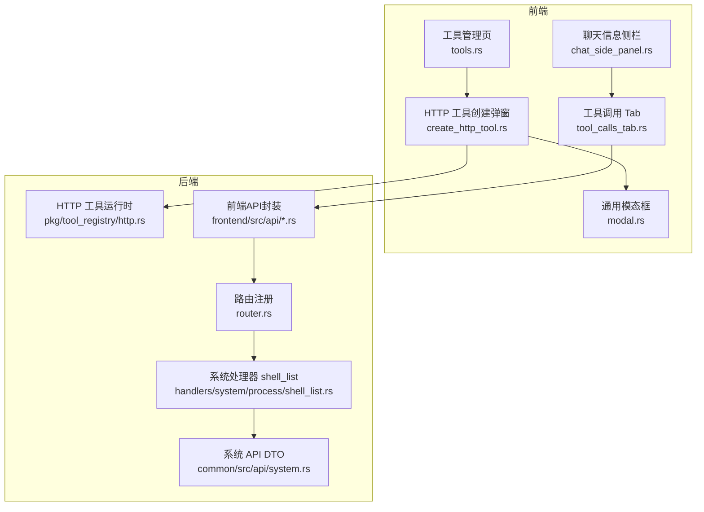
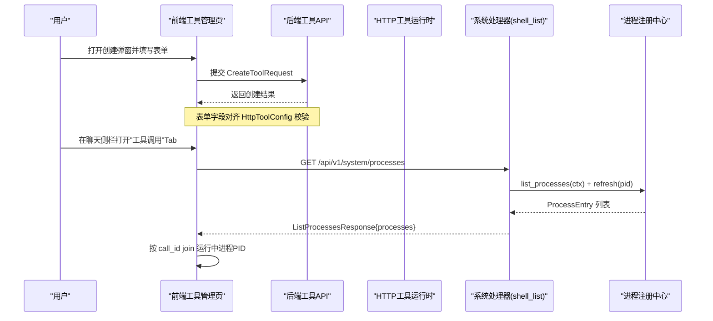
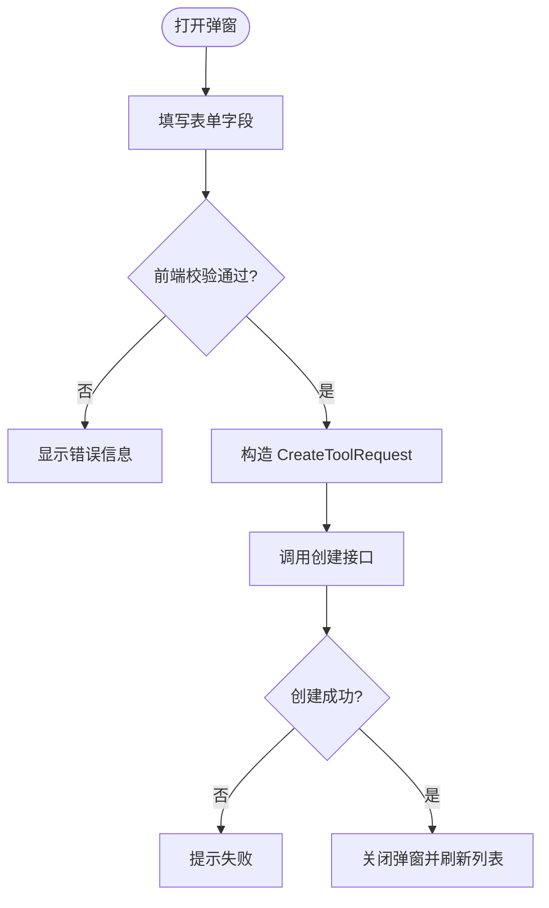
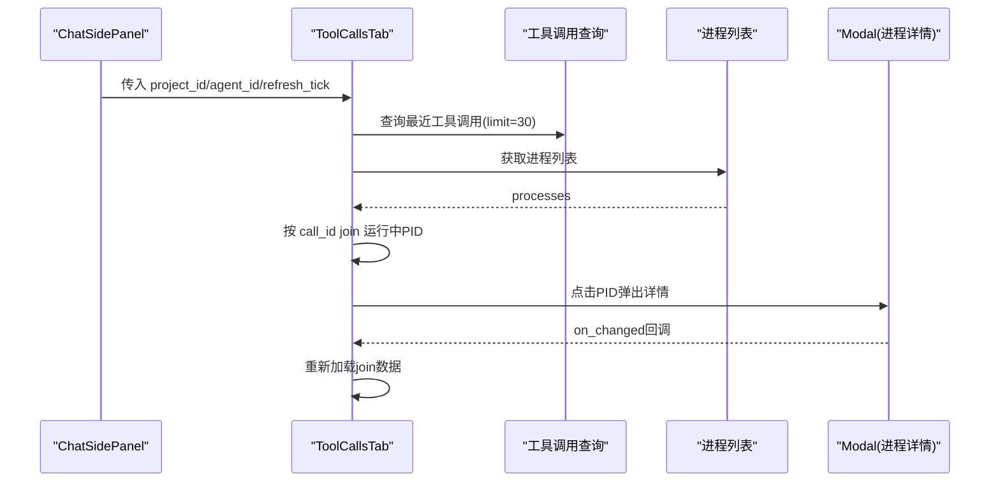
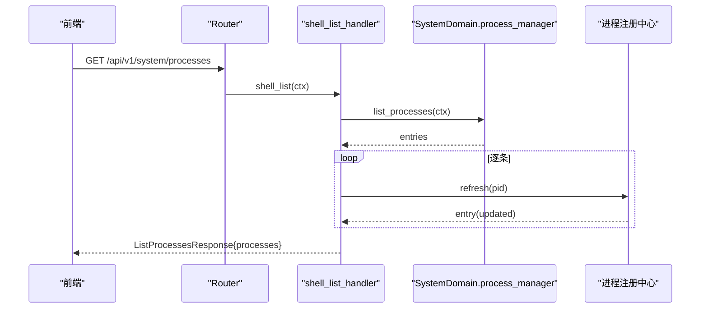
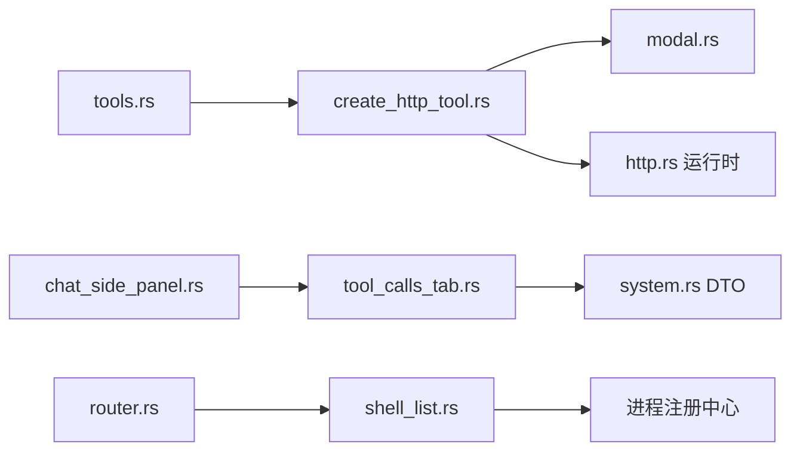

# HTTP工具创建界面

<cite>
**本文引用的文件**
- [frontend/src/pages/finance/tools.rs](frontend/src/pages/finance/tools.rs)
- [frontend/src/components/create_http_tool.rs](frontend/src/components/create_http_tool.rs)
- [frontend/src/components/modal.rs](frontend/src/components/modal.rs)
- [common/src/api/system.rs](common/src/api/system.rs)
- [src/handlers/system/process/shell_list.rs](src/handlers/system/process/shell_list.rs)
- [src/router.rs](src/router.rs)
- [src/pkg/tool_registry/http.rs](src/pkg/tool_registry/http.rs)
- [frontend/src/components/chat/tool_calls_tab.rs](frontend/src/components/chat/tool_calls_tab.rs)
- [frontend/src/api/system.rs](frontend/src/api/system.rs)
- [frontend/src/api/finance.rs](frontend/src/api/finance.rs)
- [HTTP 工具创建表单限定 method 白名单为 GET/POST](docs/wiki/knowledge/zh/HTTP 工具创建表单限定 method 白名单为 GET_POST/HTTP 工具创建表单限定 method 白名单为 GET_POST.md)
</cite>

## 更新摘要
**变更内容**
- 新增了完整的HTTP工具创建表单功能，支持GET/POST方法、URL模板、请求头/查询/体配置等
- 实现了进程管理双露接口（shell_list），提供HTTP和LLM工具两种访问方式
- 增强了聊天侧栏工具调用Tab，支持按call_id关联进行中的进程并复用详情弹窗
- 完善了前后端协作的数据流和安全控制机制
- 补充了完整的表单验证和提交流程

## 目录
1. [简介](#简介)
2. [项目结构](#项目结构)
3. [核心组件](#核心组件)
4. [架构总览](#架构总览)
5. [详细组件分析](#详细组件分析)
6. [依赖关系分析](#依赖关系分析)
7. [性能考虑](#性能考虑)
8. [故障排查指南](#故障排查指南)
9. [结论](#结论)
10. [附录](#附录)

## 简介
本文件围绕"HTTP 工具创建界面"及相关体验闭环进行系统化说明，覆盖前端表单、后端路由与处理器、进程管理双露接口（shell_list），以及聊天侧栏中的"工具调用"Tab。目标是帮助读者快速理解：
- 如何在管理面创建 HTTP 工具；
- 如何通过统一进程管理查看后台进程并关联到具体工具调用；
- 如何在聊天侧栏中按 call_id 关联进行中的进程并复用详情弹窗。

## 项目结构
本次改动涉及前后端多处协作：
- 前端新增/增强页面与组件：工具管理页增加创建入口与弹窗表单；聊天信息侧栏新增"工具调用"Tab；通用 Modal 组件复用。
- 后端新增系统域进程列表接口（shell_list）并通过路由暴露；HTTP 工具运行时负责配置校验与执行。

**图表来源**
- [frontend/src/pages/finance/tools.rs:114-123](frontend/src/pages/finance/tools.rs#L114-L123)
- [frontend/src/components/create_http_tool.rs:144-188](frontend/src/components/create_http_tool.rs#L144-L188)
- [frontend/src/components/modal.rs:15-43](frontend/src/components/modal.rs#L15-L43)
- [frontend/src/components/chat/tool_calls_tab.rs:78-163](frontend/src/components/chat/tool_calls_tab.rs#L78-L163)
- [src/router.rs:810-822](src/router.rs#L810-L822)
- [src/handlers/system/process/shell_list.rs:10-49](src/handlers/system/process/shell_list.rs#L10-L49)
- [common/src/api/system.rs:240-278](common/src/api/system.rs#L240-L278)
- [src/pkg/tool_registry/http.rs:41-73](src/pkg/tool_registry/http.rs#L41-L73)
- [frontend/src/api/system.rs:196-220](frontend/src/api/system.rs#L196-L220)
- [frontend/src/api/finance.rs:134-136](frontend/src/api/finance.rs#L134-L136)

**章节来源**
- [frontend/src/pages/finance/tools.rs:114-123](frontend/src/pages/finance/tools.rs#L114-L123)
- [src/router.rs:810-822](src/router.rs#L810-L822)

## 核心组件
- **HTTP 工具创建弹窗**：提供名称、描述、标签、方法（GET/POST）、URL 模板、Headers/Query/Body JSON、超时、响应大小限制、允许状态码、JSON Pointer、域名白/黑名单、本地网络访问开关、参数 Schema 等字段，提交前做前端解析校验，再构造 CreateToolRequest 调用后端创建接口。
- **聊天信息侧栏**：按对话模式动态组装 Tab（项目对话：总览/任务/产物/Agent/工具；默认对话：Agent/我/工具），支持手动刷新与 SSE 防抖自动刷新。
- **工具调用 Tab**：并行拉取最近工具调用记录与后台进程列表，按 call_id join 出仍在运行的进程 PID，点击 PID 弹出进程详情（复用共享组件）。
- **后端进程列表接口**：通过 shell_list 处理器列出后台进程，逐条探活刷新 alive 状态，并按调用方 scope（用户/Agent）过滤可见范围。

**章节来源**
- [frontend/src/components/create_http_tool.rs:15-142](frontend/src/components/create_http_tool.rs#L15-L142)
- [frontend/src/components/chat/tool_calls_tab.rs:78-163](frontend/src/components/chat/tool_calls_tab.rs#L78-L163)
- [src/handlers/system/process/shell_list.rs:10-49](src/handlers/system/process/shell_list.rs#L10-L49)
- [common/src/api/system.rs:240-278](common/src/api/system.rs#L240-L278)

## 架构总览
整体数据流遵循 Adapter → Domain → DAL → DAO 单向调用原则。HTTP 工具创建走管理面 API，进程列表走系统域处理器，聊天侧栏通过前端组件聚合多源数据。

**图表来源**
- [frontend/src/pages/finance/tools.rs:114-123](frontend/src/pages/finance/tools.rs#L114-L123)
- [frontend/src/components/create_http_tool.rs:164-188](frontend/src/components/create_http_tool.rs#L164-L188)
- [src/handlers/system/process/shell_list.rs:19-49](src/handlers/system/process/shell_list.rs#L19-L49)
- [src/router.rs:810-822](src/router.rs#L810-L822)
- [frontend/src/components/chat/tool_calls_tab.rs:101-139](frontend/src/components/chat/tool_calls_tab.rs#L101-L139)

## 详细组件分析

### HTTP 工具创建弹窗
- **表单状态与校验**：维护 HttpToolFormState，提供可选 JSON、逗号分隔列表、数字字段的解析函数；build_create_request 对必填字段与方法白名单（仅 GET/POST）进行校验。
- **提交流程**：构建 CreateToolRequest（包含 HttpToolConfig JSON），调用 create_tool 接口，成功后提示并关闭弹窗，触发父级列表刷新。
- **安全与约束**：方法白名单、URL 模板必填、headers/query/body 为对象且值需可渲染为标量、timeout_ms/response_max_bytes 有上下界、allowed_status_codes 非空且在有效范围、response_json_pointer 以 / 开头、域名白/黑名单与本地网络访问受控。

**图表来源**
- [frontend/src/components/create_http_tool.rs:85-142](frontend/src/components/create_http_tool.rs#L85-L142)
- [frontend/src/components/create_http_tool.rs:164-188](frontend/src/components/create_http_tool.rs#L164-L188)
- [src/pkg/tool_registry/http.rs:369-443](src/pkg/tool_registry/http.rs#L369-L443)

**章节来源**
- [frontend/src/components/create_http_tool.rs:15-142](frontend/src/components/create_http_tool.rs#L15-L142)
- [src/pkg/tool_registry/http.rs:41-73](src/pkg/tool_registry/http.rs#L41-L73)

### 聊天信息侧栏与工具调用 Tab
- **侧栏主组件**：根据 project_id/reception_agent_id 决定 Tab 序列；SSE 消息触发 refresh_tick 变化时防抖 2s 后刷新；支持手动刷新按钮。
- **工具调用 Tab**：并行请求工具调用记录与进程列表；按 call_id 收集 alive 的进程 PID；行展开显示 input/output 摘要；点击 PID 弹出进程详情（复用 ProcessDetailContent），并在变更后重拉 join 数据。

**图表来源**
- [frontend/src/components/chat/tool_calls_tab.rs:78-163](frontend/src/components/chat/tool_calls_tab.rs#L78-L163)
- [frontend/src/components/chat/tool_calls_tab.rs:278-291](frontend/src/components/chat/tool_calls_tab.rs#L278-L291)

**章节来源**
- [frontend/src/components/chat/tool_calls_tab.rs:78-163](frontend/src/components/chat/tool_calls_tab.rs#L78-L163)

### 后端进程列表接口（shell_list）
- **路由**：system nest 下 GET /processes 指向 shell_list_handler，排在 /processes/{pid} 之前避免遮蔽。
- **处理器**：使用 RequestContext 决定可见范围（用户 ctx 全量，Agent ctx 仅见自己启动的进程）；逐条 refresh 探活，将 ProcessStatus::Running 映射为 alive=true，并输出 ProcessInfo。
- **DTO**：ListProcessesRequest/ListProcessesResponse/ProcessInfo 定义于 common/src/api/system.rs。

**图表来源**
- [src/router.rs:810-822](src/router.rs#L810-L822)
- [src/handlers/system/process/shell_list.rs:19-49](src/handlers/system/process/shell_list.rs#L19-L49)
- [common/src/api/system.rs:240-278](common/src/api/system.rs#L240-L278)

**章节来源**
- [src/handlers/system/process/shell_list.rs:10-49](src/handlers/system/process/shell_list.rs#L10-L49)
- [src/router.rs:810-822](src/router.rs#L810-L822)
- [common/src/api/system.rs:240-278](common/src/api/system.rs#L240-L278)

## 依赖关系分析
- **前端依赖**：
  - tools.rs 依赖 create_http_tool.rs（弹窗）与 modal.rs（通用对话框）。
  - chat_side_panel.rs 依赖 tool_calls_tab.rs（工具调用 Tab）。
  - tool_calls_tab.rs 依赖 system API（list_processes）与 finance API（query_tool_call_entries）。
- **后端依赖**：
  - router.rs 将 /system/processes 路由到 shell_list_handler。
  - shell_list_handler 依赖 SystemDomain.process_manager() 与 pkg::process::registry()。
  - HTTP 工具运行时依赖 HttpToolConfig 与安全策略（域名白/黑名单、本地网络访问控制、超时与响应大小限制）。

**图表来源**
- [frontend/src/pages/finance/tools.rs:114-123](frontend/src/pages/finance/tools.rs#L114-L123)
- [frontend/src/components/create_http_tool.rs:144-188](frontend/src/components/create_http_tool.rs#L144-L188)
- [frontend/src/components/modal.rs:15-43](frontend/src/components/modal.rs#L15-L43)
- [frontend/src/components/chat/tool_calls_tab.rs:78-163](frontend/src/components/chat/tool_calls_tab.rs#L78-L163)
- [src/router.rs:810-822](src/router.rs#L810-L822)
- [src/handlers/system/process/shell_list.rs:19-49](src/handlers/system/process/shell_list.rs#L19-L49)
- [src/pkg/tool_registry/http.rs:41-73](src/pkg/tool_registry/http.rs#L41-L73)

**章节来源**
- [frontend/src/components/chat/tool_calls_tab.rs:78-163](frontend/src/components/chat/tool_calls_tab.rs#L78-L163)
- [src/router.rs:810-822](src/router.rs#L810-L822)

## 性能考虑
- **前端防抖**：聊天侧栏与工具调用 Tab 均使用 2s 防抖窗口，避免 SSE 高频触发导致重复请求；通过代际计数丢弃过期结果。
- **并行请求**：工具调用 Tab 并行拉取工具调用记录与进程列表，减少首屏等待时间。
- **后端探活**：shell_list 对每个条目进行 refresh，确保 alive 状态准确，但需注意在高并发场景下的额外开销。
- **资源限制**：HTTP 工具运行时对超时与响应体大小设置硬上限，防止异常请求拖垮服务。

## 故障排查指南
- **表单校验失败**：检查名称/URL 是否为空、方法是否仅 GET/POST、JSON 字段是否合法、数字字段是否在允许范围、状态码列表是否有效、JSON Pointer 是否以 / 开头。
- **创建失败**：确认后端工具 API 可用，检查域名白/黑名单与本地网络访问开关是否符合预期。
- **进程列表为空或状态不准**：确认 Agent 上下文是否正确注入；检查进程注册中心是否有对应条目；确认 shell_list 路由未被其他路径遮蔽。
- **工具调用 Tab 无数据**：确认已选择项目或前台 Agent；检查 limit 与查询条件；确认 JSONL 扫描是否启用。

**章节来源**
- [frontend/src/components/create_http_tool.rs:85-142](frontend/src/components/create_http_tool.rs#L85-L142)
- [src/handlers/system/process/shell_list.rs:19-49](src/handlers/system/process/shell_list.rs#L19-L49)
- [frontend/src/components/chat/tool_calls_tab.rs:101-139](frontend/src/components/chat/tool_calls_tab.rs#L101-L139)

## 结论
本次改动补齐了 HTTP 工具创建的前端体验闭环，并通过统一的进程管理接口与聊天侧栏的工具调用 Tab，实现了"工具调用—后台进程—日志"的可观测链路。前端采用防抖与并行请求优化交互体验，后端通过严格的安全策略与运行时限制保障稳定性。后续可在 PUT/PATCH/DELETE 方法扩展、更丰富的进程操作能力方面继续演进。

## 附录
- **关键数据结构参考**：
  - HttpToolConfig：method/url/headers/query/body/timeout_ms/response_max_bytes/allowed_status_codes/response_json_pointer/allowed_domains/blocked_domains/allow_local_network。
  - ProcessInfo：pid/call_id/tool_id/agent_id/command/working_dir/background/started_at/alive/exit_code/log_path。
- **相关路由**：
  - GET /api/v1/system/processes → shell_list_handler。
  - GET /api/v1/system/processes/{pid} → shell_status_handler。
  - POST /api/v1/system/processes/{pid}/kill → shell_kill_handler。

**章节来源**
- [src/pkg/tool_registry/http.rs:41-73](src/pkg/tool_registry/http.rs#L41-L73)
- [common/src/api/system.rs:240-278](common/src/api/system.rs#L240-L278)
- [src/router.rs:810-822](src/router.rs#L810-L822)