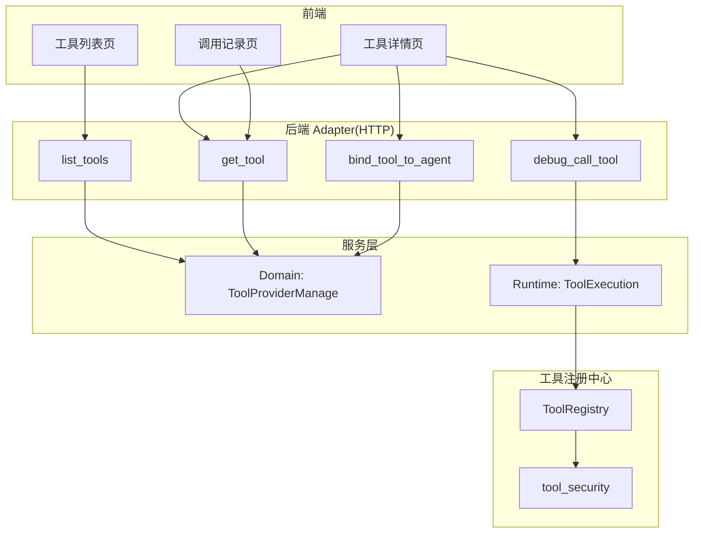
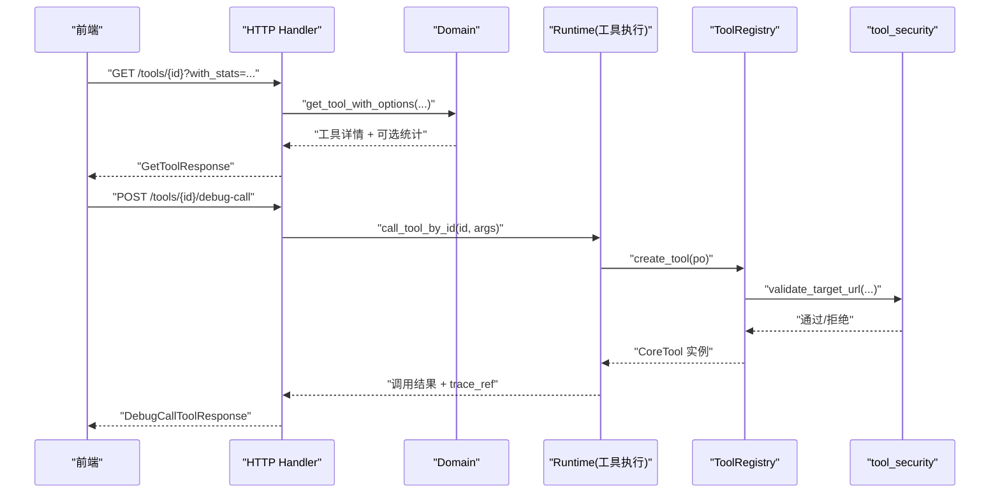
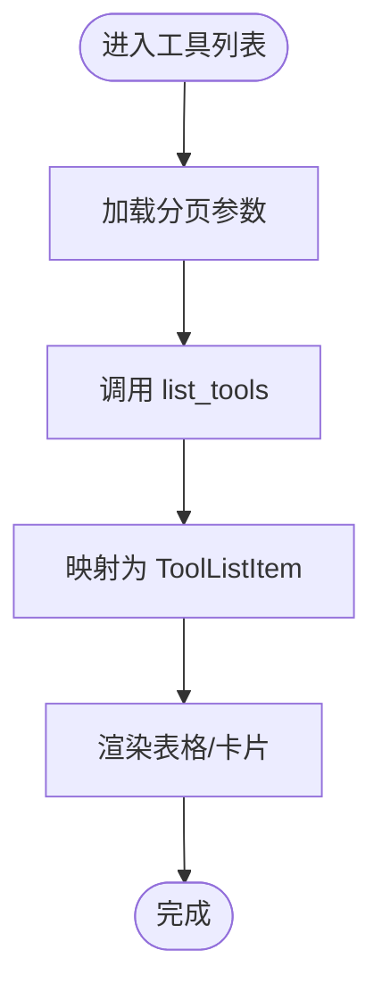
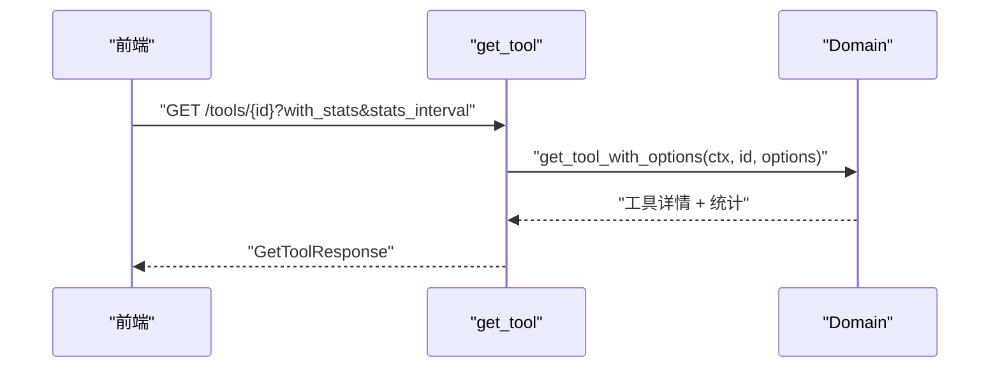
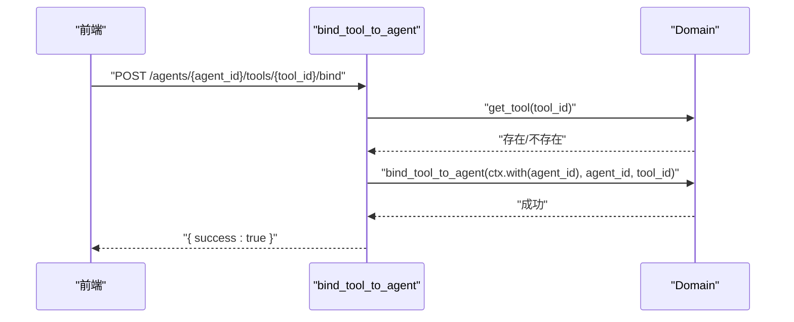
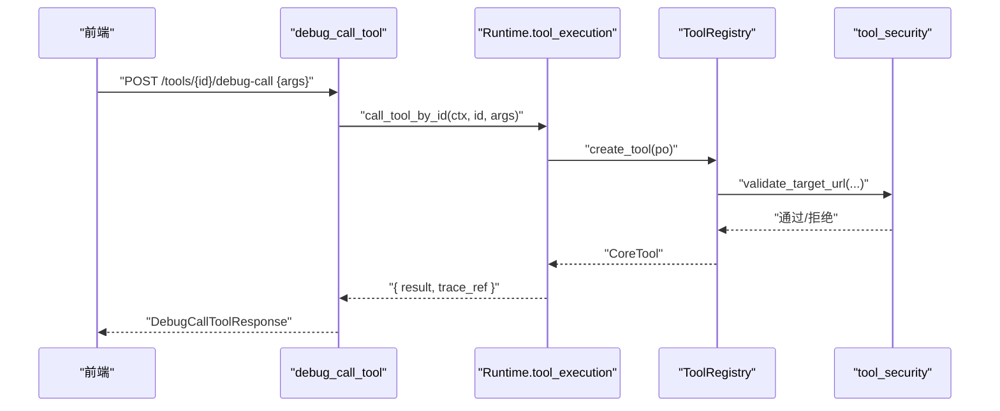
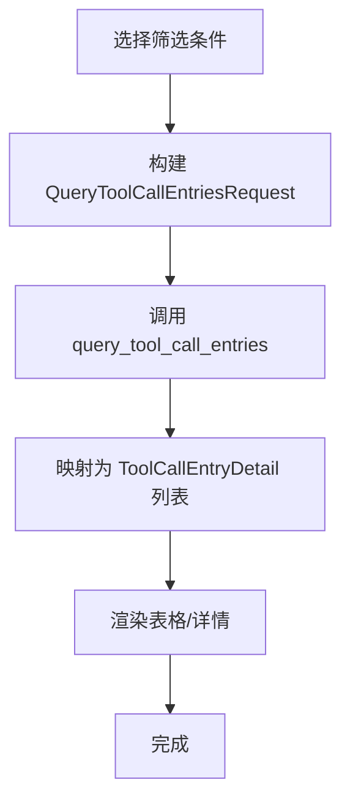
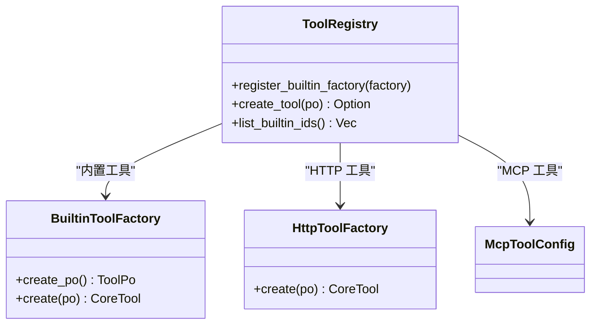
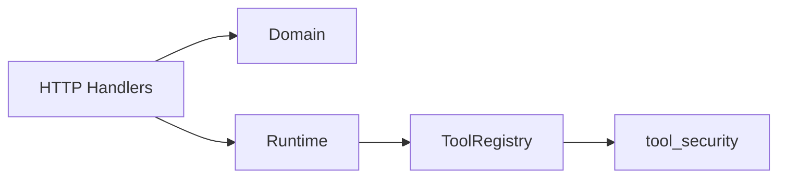

# 工具管理

<cite>
**本文引用的文件**
- [src/handlers/finance/tool/mod.rs](src/handlers/finance/tool/mod.rs)
- [common/src/api/tool.rs](common/src/api/tool.rs)
- [src/handlers/finance/tool/list_tools.rs](src/handlers/finance/tool/list_tools.rs)
- [src/handlers/finance/tool/get_tool.rs](src/handlers/finance/tool/get_tool.rs)
- [src/handlers/finance/tool/bind_tool_to_agent.rs](src/handlers/finance/tool/bind_tool_to_agent.rs)
- [src/handlers/finance/tool/debug_call_tool.rs](src/handlers/finance/tool/debug_call_tool.rs)
- [src/pkg/tool_registry/mod.rs](src/pkg/tool_registry/mod.rs)
- [src/pkg/tool_registry/tool_security.rs](src/pkg/tool_registry/tool_security.rs)
- [frontend/src/pages/finance/tools.rs](frontend/src/pages/finance/tools.rs)
- [frontend/src/pages/finance/tool_detail.rs](frontend/src/pages/finance/tool_detail.rs)
- [frontend/src/pages/finance/tool_call_entries.rs](frontend/src/pages/finance/tool_call_entries.rs)
- [工具系统三层调用架构：CoreTool trait + Builtin/HTTP/MCP 三协议路由 + register_handler_tool 宏 + 神经工具免绑定三层校验](docs/wiki/knowledge/zh/工具系统三层调用架构：CoreTool trait + Builtin HTTP MCP 三协议路由 + register_handler_tool 宏 + 神经工具免绑定三层校验/工具系统三层调用架构：CoreTool trait + Builtin HTTP MCP 三协议路由 + register_handler_tool 宏 + 神经工具免绑定三层校验.md)
</cite>

## 目录
1. [简介](#简介)
2. [项目结构](#项目结构)
3. [核心组件](#核心组件)
4. [架构总览](#架构总览)
5. [详细组件分析](#详细组件分析)
6. [依赖关系分析](#依赖关系分析)
7. [性能考虑](#性能考虑)
8. [故障排查指南](#故障排查指南)
9. [结论](#结论)
10. [附录：前端集成示例](#附录前端集成示例)

## 简介
本章节面向“工具管理”功能，覆盖工具的注册、配置与管理界面，包括工具列表展示、工具详情查看、工具调用记录查询与调试。文档同时说明工具绑定到 Agent 的流程、参数校验、执行状态监控、错误处理机制，以及日志分析、性能指标收集与安全配置、访问权限控制与最佳实践。

## 项目结构
后端采用四层单向调用：Adapter（HTTP Handler）→ Domain → DAL → DAO；通用能力集中在 pkg 层。工具管理相关 HTTP 接口位于 handlers/finance/tool，API 请求/响应 DTO 在 common/src/api/tool.rs，工具注册与协议适配在 src/pkg/tool_registry，安全策略在 tool_security.rs。前端页面位于 frontend/src/pages/finance，包含工具列表、工具详情与调用记录页。

图表来源
- [src/handlers/finance/tool/mod.rs:1-46](src/handlers/finance/tool/mod.rs#L1-L46)
- [src/handlers/finance/tool/list_tools.rs:1-40](src/handlers/finance/tool/list_tools.rs#L1-L40)
- [src/handlers/finance/tool/get_tool.rs:1-47](src/handlers/finance/tool/get_tool.rs#L1-L47)
- [src/handlers/finance/tool/bind_tool_to_agent.rs:1-39](src/handlers/finance/tool/bind_tool_to_agent.rs#L1-L39)
- [src/handlers/finance/tool/debug_call_tool.rs:1-35](src/handlers/finance/tool/debug_call_tool.rs#L1-L35)
- [src/pkg/tool_registry/mod.rs:1-132](src/pkg/tool_registry/mod.rs#L1-L132)
- [src/pkg/tool_registry/tool_security.rs:1-487](src/pkg/tool_registry/tool_security.rs#L1-L487)

章节来源
- [src/handlers/finance/tool/mod.rs:1-46](src/handlers/finance/tool/mod.rs#L1-L46)
- [common/src/api/tool.rs:1-430](common/src/api/tool.rs#L1-L430)

## 核心组件
- HTTP 适配器（Handler）
  - 列表：列出工具并支持分页
  - 详情：获取工具配置与可选统计信息
  - 绑定：将工具绑定到指定 Agent
  - 调试：管理员直接调用工具进行调试
- API 数据模型
  - 创建/更新/删除工具、查询与搜索、调用记录查询等统一 DTO
- 工具注册中心
  - 按协议类型（内置/MCP/HTTP）注册工厂并创建工具实例
- 安全策略
  - URL/域名白名单、SSRF 防护、敏感头脱敏、响应体大小限制、文件系统沙箱

章节来源
- [src/handlers/finance/tool/list_tools.rs:1-40](src/handlers/finance/tool/list_tools.rs#L1-L40)
- [src/handlers/finance/tool/get_tool.rs:1-47](src/handlers/finance/tool/get_tool.rs#L1-L47)
- [src/handlers/finance/tool/bind_tool_to_agent.rs:1-39](src/handlers/finance/tool/bind_tool_to_agent.rs#L1-L39)
- [src/handlers/finance/tool/debug_call_tool.rs:1-35](src/handlers/finance/tool/debug_call_tool.rs#L1-L35)
- [common/src/api/tool.rs:1-430](common/src/api/tool.rs#L1-L430)
- [src/pkg/tool_registry/mod.rs:1-132](src/pkg/tool_registry/mod.rs#L1-L132)
- [src/pkg/tool_registry/tool_security.rs:1-487](src/pkg/tool_registry/tool_security.rs#L1-L487)

## 架构总览
工具管理遵循严格分层：
- Adapter 层：HTTP Handler 接收请求，解析参数，调用 Domain/DAL
- Domain 层：业务编排（如工具提供者的管理与执行）
- DAL/DAO 层：数据访问与持久化
- pkg 层：无业务感知的通用能力（工具注册、AOP、存储、日志等）

图表来源
- [src/handlers/finance/tool/get_tool.rs:1-47](src/handlers/finance/tool/get_tool.rs#L1-L47)
- [src/handlers/finance/tool/debug_call_tool.rs:1-35](src/handlers/finance/tool/debug_call_tool.rs#L1-L35)
- [src/pkg/tool_registry/mod.rs:1-132](src/pkg/tool_registry/mod.rs#L1-L132)
- [src/pkg/tool_registry/tool_security.rs:1-487](src/pkg/tool_registry/tool_security.rs#L1-L487)

## 详细组件分析

### 工具列表与查询
- 列表接口：仅接受分页参数，内部固定排序，返回工具项列表
- 查询接口：支持关键词、标签、协议、状态、MCP 服务器、是否启用等多条件过滤与分页
- 前端：工具列表页拉取分页数据并渲染

图表来源
- [src/handlers/finance/tool/list_tools.rs:1-40](src/handlers/finance/tool/list_tools.rs#L1-L40)
- [common/src/api/tool.rs:143-242](common/src/api/tool.rs#L143-L242)

章节来源
- [src/handlers/finance/tool/list_tools.rs:1-40](src/handlers/finance/tool/list_tools.rs#L1-L40)
- [common/src/api/tool.rs:143-242](common/src/api/tool.rs#L143-L242)
- [frontend/src/pages/finance/tools.rs](frontend/src/pages/finance/tools.rs)

### 工具详情与统计
- 详情接口：根据 ID 获取工具配置、协议、标签、开关状态等，可附带统计信息（调用次数、失败次数、时间范围与粒度）
- 统计维度：支持 hourly/daily 两种时序粒度
- 前端：工具详情页展示配置与统计面板

图表来源
- [src/handlers/finance/tool/get_tool.rs:1-47](src/handlers/finance/tool/get_tool.rs#L1-L47)
- [common/src/api/tool.rs:45-103](common/src/api/tool.rs#L45-L103)

章节来源
- [src/handlers/finance/tool/get_tool.rs:1-47](src/handlers/finance/tool/get_tool.rs#L1-L47)
- [common/src/api/tool.rs:45-103](common/src/api/tool.rs#L45-L103)
- [frontend/src/pages/finance/tool_detail.rs](frontend/src/pages/finance/tool_detail.rs)

### 工具绑定到 Agent
- 流程：先校验工具存在，再设置上下文中的 agent_id，最后执行绑定
- 语义：绑定后该 Agent 可在其工作流中调用此工具（受后续授权策略约束）
- 前端：在工具详情页或 Agent 管理页触发绑定操作

图表来源
- [src/handlers/finance/tool/bind_tool_to_agent.rs:1-39](src/handlers/finance/tool/bind_tool_to_agent.rs#L1-L39)
- [common/src/api/tool.rs:285-319](common/src/api/tool.rs#L285-L319)

章节来源
- [src/handlers/finance/tool/bind_tool_to_agent.rs:1-39](src/handlers/finance/tool/bind_tool_to_agent.rs#L1-L39)
- [common/src/api/tool.rs:285-319](common/src/api/tool.rs#L285-L319)

### 工具调试调用
- 入口：管理员专用，跳过 Agent 授权，直接走 call_tool_by_id
- 输出：返回成功标志、业务结果、trace ID 与状态文本
- 用途：在工具详情页快速验证参数与行为

图表来源
- [src/handlers/finance/tool/debug_call_tool.rs:1-35](src/handlers/finance/tool/debug_call_tool.rs#L1-L35)
- [src/pkg/tool_registry/mod.rs:1-132](src/pkg/tool_registry/mod.rs#L1-L132)
- [src/pkg/tool_registry/tool_security.rs:1-487](src/pkg/tool_registry/tool_security.rs#L1-L487)

章节来源
- [src/handlers/finance/tool/debug_call_tool.rs:1-35](src/handlers/finance/tool/debug_call_tool.rs#L1-L35)
- [common/src/api/tool.rs:120-141](common/src/api/tool.rs#L120-L141)

### 工具调用记录查询
- 查询能力：支持按 call_id、agent/project/task/tool、状态、时间范围、limit 等筛选
- 单条记录：按 call_id 精确获取，并可限定 tool_id 缩小范围
- 前端：调用记录页展示列表与详情

图表来源
- [common/src/api/tool.rs:321-429](common/src/api/tool.rs#L321-L429)

章节来源
- [common/src/api/tool.rs:321-429](common/src/api/tool.rs#L321-L429)
- [frontend/src/pages/finance/tool_call_entries.rs](frontend/src/pages/finance/tool_call_entries.rs)

### 工具注册与协议路由
- 全局注册表：维护内置工具工厂、HTTP 工厂、MCP 工具工厂
- 创建工具：根据 ToolPo 的协议类型分派到对应工厂创建 CoreTool 实例
- 安全校验：HTTP 类工具在创建/调用前进行目标地址、域名白名单/黑名单、本地网络访问控制、响应大小限制与敏感头脱敏

图表来源
- [src/pkg/tool_registry/mod.rs:1-132](src/pkg/tool_registry/mod.rs#L1-L132)

章节来源
- [src/pkg/tool_registry/mod.rs:1-132](src/pkg/tool_registry/mod.rs#L1-L132)
- [src/pkg/tool_registry/tool_security.rs:1-487](src/pkg/tool_registry/tool_security.rs#L1-L487)

## 依赖关系分析
- Handler 依赖 Domain 提供的工具提供者管理能力
- Debug 调用依赖 Runtime 的工具执行能力
- 工具执行依赖 ToolRegistry 按协议创建具体实现
- 安全策略贯穿 HTTP/MCP/Shell/FS 等外部交互路径

图表来源
- [src/handlers/finance/tool/mod.rs:1-46](src/handlers/finance/tool/mod.rs#L1-L46)
- [src/pkg/tool_registry/mod.rs:1-132](src/pkg/tool_registry/mod.rs#L1-L132)
- [src/pkg/tool_registry/tool_security.rs:1-487](src/pkg/tool_registry/tool_security.rs#L1-L487)

章节来源
- [src/handlers/finance/tool/mod.rs:1-46](src/handlers/finance/tool/mod.rs#L1-L46)
- [src/pkg/tool_registry/mod.rs:1-132](src/pkg/tool_registry/mod.rs#L1-L132)

## 性能考虑
- 列表与查询使用分页，避免一次性加载大量数据
- 工具详情支持按需加载统计信息，减少不必要计算
- HTTP 工具响应体限制与超时保护，防止大响应阻塞
- DNS 解析与地址校验前置，尽早失败，降低无效请求开销
- 建议：对高频查询增加缓存层（例如 Redis），对统计聚合使用异步任务预计算

[本节为通用指导，不直接分析具体文件]

## 故障排查指南
- 工具未找到：检查工具 ID 是否正确，确认工具已创建且未被删除
- 绑定失败：确认工具存在且当前用户具备相应权限；检查 Agent 是否存在
- 调试调用失败：
  - 检查工具协议配置（URL、模板、参数 Schema）
  - 检查域名白名单/黑名单与本地网络访问策略
  - 检查响应体大小限制与超时配置
- 调用记录缺失：确认 trace 写入是否成功，核对 call_id 与时间范围
- 权限问题：调试接口仅限管理员；确保路由层角色校验通过

章节来源
- [src/handlers/finance/tool/debug_call_tool.rs:1-35](src/handlers/finance/tool/debug_call_tool.rs#L1-L35)
- [src/pkg/tool_registry/tool_security.rs:1-487](src/pkg/tool_registry/tool_security.rs#L1-L487)
- [common/src/api/tool.rs:120-141](common/src/api/tool.rs#L120-L141)

## 结论
工具管理模块以清晰的层次划分和严格的协议路由为核心，结合完善的安全策略与可观测性能力，提供了从工具注册、配置、绑定到调试与调用的完整闭环。通过分页查询、按需统计与严格的输入校验，系统在可用性与安全性之间取得平衡。建议在大规模部署时引入缓存与异步统计以提升性能，并持续完善审计与告警。

[本节为总结，不直接分析具体文件]

## 附录：前端集成示例
以下给出在前端各页面中集成工具管理功能的步骤与要点（基于现有页面文件）：

- 工具列表页
  - 调用列表接口，传入分页参数
  - 渲染工具名称、描述、协议、标签、状态、是否启用
  - 支持跳转至工具详情页

- 工具详情页
  - 调用详情接口，可选择加载统计信息（时间范围与粒度）
  - 展示工具配置、参数 Schema、标签、开关状态
  - 提供“调试调用”入口：构造参数 JSON，调用调试接口，展示结果与 trace ID
  - 提供“绑定到 Agent”入口：选择目标 Agent 并发起绑定

- 调用记录页
  - 支持按 call_id、agent/project/task/tool、状态、时间范围筛选
  - 展示每条记录的输入、输出、错误、耗时与状态
  - 点击某条记录可查看详细信息

章节来源
- [frontend/src/pages/finance/tools.rs](frontend/src/pages/finance/tools.rs)
- [frontend/src/pages/finance/tool_detail.rs](frontend/src/pages/finance/tool_detail.rs)
- [frontend/src/pages/finance/tool_call_entries.rs](frontend/src/pages/finance/tool_call_entries.rs)
- [common/src/api/tool.rs:143-429](common/src/api/tool.rs#L143-L429)