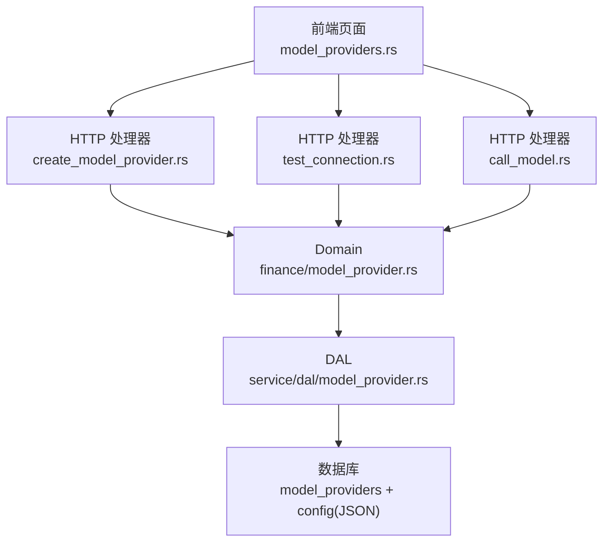
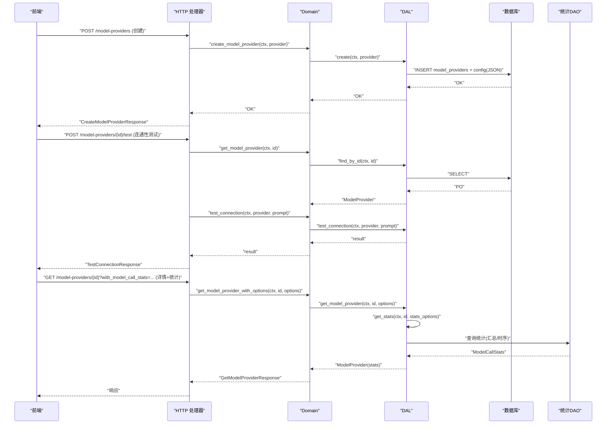
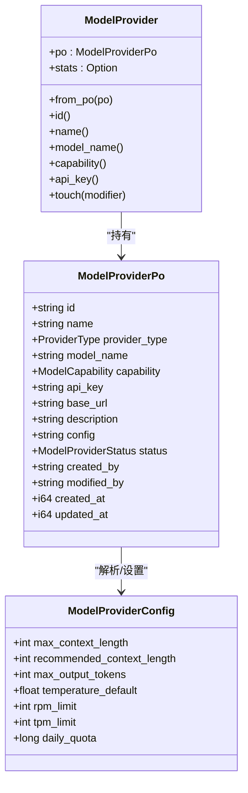
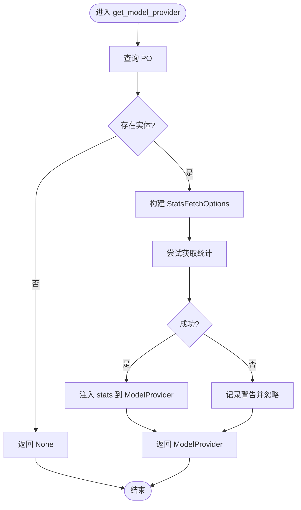
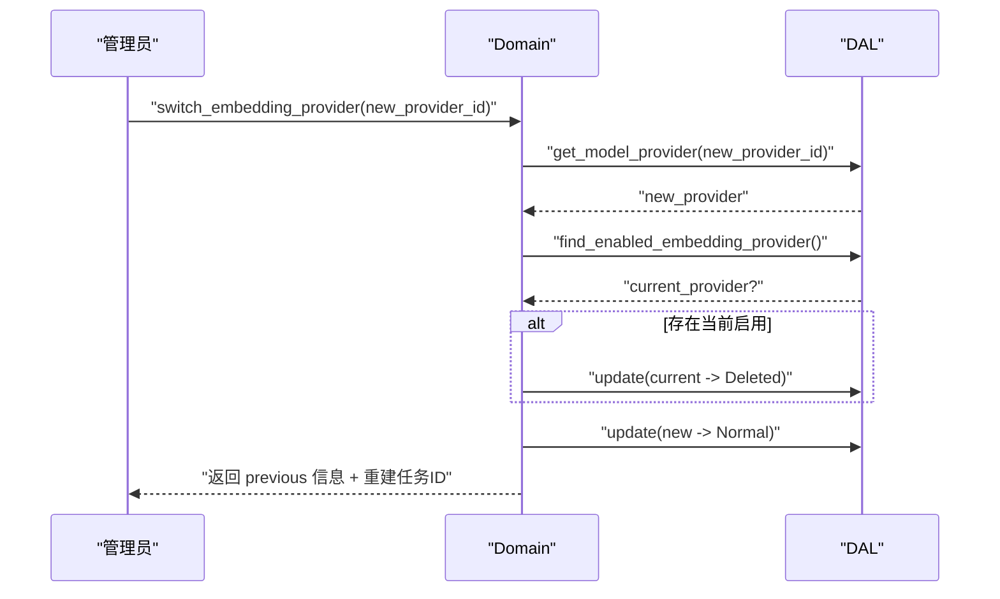
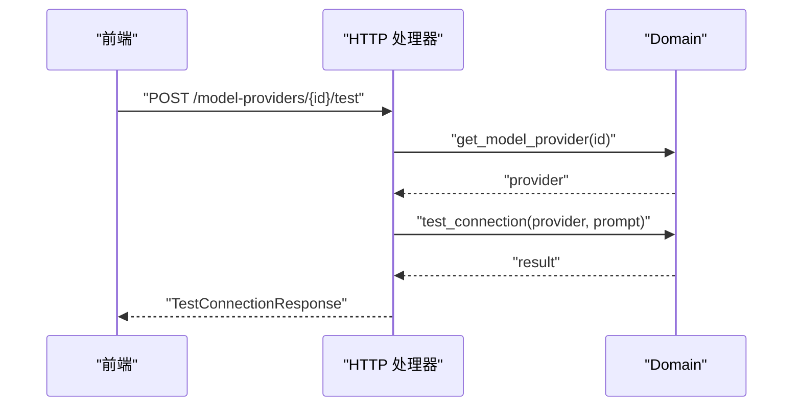
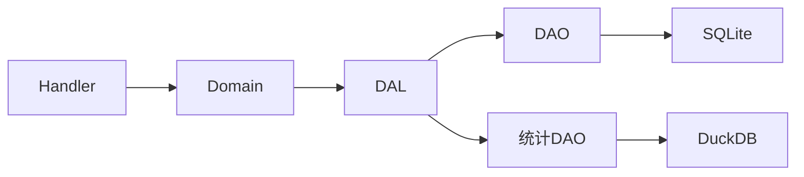

# 模型提供商管理（前端 UI 层）

<cite>
**本文引用的文件**
- [common/src/api/model_provider.rs](common/src/api/model_provider.rs)
- [src/models/model_provider.rs](src/models/model_provider.rs)
- [src/service/domain/finance/model_provider.rs](src/service/domain/finance/model_provider.rs)
- [src/service/dal/model_provider.rs](src/service/dal/model_provider.rs)
- [src/handlers/finance/model_provider/mod.rs](src/handlers/finance/model_provider/mod.rs)
- [src/handlers/finance/model_provider/create_model_provider.rs](src/handlers/finance/model_provider/create_model_provider.rs)
- [src/handlers/finance/model_provider/test_connection.rs](src/handlers/finance/model_provider/test_connection.rs)
- [src/handlers/finance/model_provider/call_model.rs](src/handlers/finance/model_provider/call_model.rs)
- [common/src/enums/provider.rs](common/src/enums/provider.rs)
- [migrations/20260510000000_model_provider_config.sql](migrations/20260510000000_model_provider_config.sql)
- [frontend/src/pages/finance/model_providers.rs](frontend/src/pages/finance/model_providers.rs)
- [tests/model_provider_management_integration.md](tests/model_provider_management_integration.md)
</cite>

## 目录
1. [简介](#简介)
2. [项目结构](#项目结构)
3. [核心组件](#核心组件)
4. [架构总览](#架构总览)
5. [详细组件分析](#详细组件分析)
6. [依赖关系分析](#依赖关系分析)
7. [性能与成本考量](#性能与成本考量)
8. [故障排查指南](#故障排查指南)
9. [结论](#结论)
10. [附录：配置模板与最佳实践](#附录：配置模板与最佳实践)

## 简介
本文件面向管理员，系统化说明“模型提供商管理”功能，覆盖多模型提供商的配置、测试、监控与切换。支持的提供商类型包括 OpenAI、DeepSeek、通义千问、豆包、Ollama、自定义 OpenAI 兼容、FastEmbed 本地向量化以及豆包 Vision 多模态 Embedding。文档重点解释 API 密钥管理、连接测试、调用统计、上下文窗口与推荐长度配置、Embedding Provider 切换与向量索引重建流程，并提供配置模板、最佳实践与常见问题解决方案，帮助高效管理 AI 模型资源。

> 📌 视角说明（AGENTS §2.1.3 Level 3 互补视角平行卡）：
> 本长文是「模型提供商管理」主题的 **前端 UI 层** 视角。同主题还有以下平行视角卡，请按需交叉阅读：
> - [模型提供商管理（业务功能层）](docs/wiki/zh/content/功能模块/模型提供商管理.md)

## 项目结构
本项目遵循严格四层单向调用：Adapter（HTTP Handler）→ Domain → DAL → DAO。模型提供商管理相关代码分布在以下位置：
- Adapter 层：HTTP 处理器位于 src/handlers/finance/model_provider/*，按方法粒度拆分，统一通过宏注册为 HTTP 接口与工具。
- Domain 层：业务规则与编排位于 src/service/domain/finance/model_provider.rs，负责创建、查询、更新、删除、连接测试、Embedding Provider 切换等。
- DAL 层：数据访问抽象位于 src/service/dal/model_provider.rs，封装 ModelProviderDalImpl，聚合 DAO 与统计 DAO，提供带选项的获取与分页查询。
- 数据模型与枚举：src/models/model_provider.rs 定义 PO 与业务对象；common/src/enums/provider.rs 定义 ProviderType 与 ModelCapability。
- 前端页面：frontend/src/pages/finance/model_providers.rs 提供列表、新增、启用/禁用、调用测试、切换 Embedding Provider 等交互。
- 迁移脚本：migrations/20260510000000_model_provider_config.sql 为 model_providers 表增加 JSON config 字段。

图表来源
- [src/handlers/finance/model_provider/create_model_provider.rs:1-69](src/handlers/finance/model_provider/create_model_provider.rs#L1-L69)
- [src/handlers/finance/model_provider/test_connection.rs:1-68](src/handlers/finance/model_provider/test_connection.rs#L1-L68)
- [src/handlers/finance/model_provider/call_model.rs:1-42](src/handlers/finance/model_provider/call_model.rs#L1-L42)
- [src/service/domain/finance/model_provider.rs:1-149](src/service/domain/finance/model_provider.rs#L1-L149)
- [src/service/dal/model_provider.rs:1-223](src/service/dal/model_provider.rs#L1-L223)
- [migrations/20260510000000_model_provider_config.sql:1-3](migrations/20260510000000_model_provider_config.sql#L1-L3)

章节来源
- [src/handlers/finance/model_provider/mod.rs:1-25](src/handlers/finance/model_provider/mod.rs#L1-L25)
- [common/src/api/model_provider.rs:1-391](common/src/api/model_provider.rs#L1-L391)
- [src/models/model_provider.rs:1-248](src/models/model_provider.rs#L1-L248)
- [common/src/enums/provider.rs:1-154](common/src/enums/provider.rs#L1-L154)
- [frontend/src/pages/finance/model_providers.rs:1-502](frontend/src/pages/finance/model_providers.rs#L1-L502)
- [tests/model_provider_management_integration.md:1-121](tests/model_provider_management_integration.md#L1-L121)

## 核心组件
- 提供商类型与能力
  - ProviderType：OpenAI、DeepSeek、Qwen、Doubao、Ollama、Custom、FastEmbed、DoubaoVision。
  - ModelCapability：Agent（对话/思考/工具调用）、Embedding（向量化）。
- 数据模型
  - ModelProviderPo：持久化对象，包含 id、name、provider_type、model_name、capability、api_key、base_url、description、config(JSON)、status、审计字段与时间戳。
  - ModelProvider：业务对象，包装 PO 并可选附带 ModelCallStats。
  - ModelProviderConfig：JSON 配置，支持 max_context_length、recommended_context_length、max_output_tokens、temperature_default、rpm_limit、tpm_limit、daily_quota。
- DAL 接口
  - create/find_by_id/get_model_provider(query options)/find_all/query/update/delete/find_enabled_embedding_provider/get_stats。
- Domain 实现
  - CRUD、test_connection、switch_embedding_provider（唯一性校验、状态切换、触发重建）。
- HTTP 处理器
  - create_model_provider、get_model_provider、list_model_providers、update_model_provider、delete_model_provider、test_model_provider_connection、call_model、rebuild_progress、rebuild_vectors_task、switch_embedding_provider。
- 前端界面
  - 列表展示、新增表单（名称、类型、模型名、API Key、Base URL、描述、上下文长度）、启用/禁用、调用测试、切换 Embedding Provider 确认弹窗。

章节来源
- [common/src/enums/provider.rs:1-154](common/src/enums/provider.rs#L1-L154)
- [src/models/model_provider.rs:1-248](src/models/model_provider.rs#L1-L248)
- [src/service/dal/model_provider.rs:1-223](src/service/dal/model_provider.rs#L1-L223)
- [src/service/domain/finance/model_provider.rs:1-149](src/service/domain/finance/model_provider.rs#L1-L149)
- [src/handlers/finance/model_provider/mod.rs:1-25](src/handlers/finance/model_provider/mod.rs#L1-L25)
- [frontend/src/pages/finance/model_providers.rs:1-502](frontend/src/pages/finance/model_providers.rs#L1-L502)

## 架构总览
下图展示了从前端到后端的完整调用链，涵盖创建、测试、调用与统计注入。

图表来源
- [src/handlers/finance/model_provider/create_model_provider.rs:1-69](src/handlers/finance/model_provider/create_model_provider.rs#L1-L69)
- [src/handlers/finance/model_provider/test_connection.rs:1-68](src/handlers/finance/model_provider/test_connection.rs#L1-L68)
- [src/service/domain/finance/model_provider.rs:1-149](src/service/domain/finance/model_provider.rs#L1-L149)
- [src/service/dal/model_provider.rs:1-223](src/service/dal/model_provider.rs#L1-L223)

## 详细组件分析

### 提供商类型与能力
- 支持的 ProviderType：OpenAI、DeepSeek、Qwen、Doubao、Ollama、Custom、FastEmbed、DoubaoVision。
- 能力区分：Agent 用于推理与工具调用；Embedding 用于向量化。
- 前端下拉框与后端枚举一致，便于选择与展示。

章节来源
- [common/src/enums/provider.rs:1-154](common/src/enums/provider.rs#L1-L154)
- [frontend/src/pages/finance/model_providers.rs:1-502](frontend/src/pages/finance/model_providers.rs#L1-L502)

### 数据模型与配置
- ModelProviderPo：存储基础信息与 JSON config。
- ModelProvider：业务对象，可附加 ModelCallStats。
- ModelProviderConfig：上下文窗口、输出限制、温度、速率限制、配额等。
- 迁移脚本为 model_providers 表添加 config 字段，以 JSON 形式存储扩展配置。

图表来源
- [src/models/model_provider.rs:1-248](src/models/model_provider.rs#L1-L248)
- [migrations/20260510000000_model_provider_config.sql:1-3](migrations/20260510000000_model_provider_config.sql#L1-L3)

章节来源
- [src/models/model_provider.rs:1-248](src/models/model_provider.rs#L1-L248)
- [migrations/20260510000000_model_provider_config.sql:1-3](migrations/20260510000000_model_provider_config.sql#L1-L3)

### DAL 层与统计注入
- DAL 提供 ModelProviderFetchOptions，支持是否加载 ModelCallStats、时间范围与时序粒度。
- get_model_provider 在获取基础实体后，根据 options 注入统计；若统计失败则降级记录警告并继续返回实体。
- find_enabled_embedding_provider 用于确保 Embedding Provider 的唯一性。

图表来源
- [src/service/dal/model_provider.rs:124-156](src/service/dal/model_provider.rs#L124-L156)

章节来源
- [src/service/dal/model_provider.rs:1-223](src/service/dal/model_provider.rs#L1-L223)

### Domain 层：创建、更新与切换
- 创建：构造 PO 与 Config，调用 DAL 插入。
- 更新：对 Embedding Provider 进行唯一性校验，防止多个启用的 Embedding Provider。
- 切换：将当前启用的 Embedding Provider 置为 Deleted，新 Provider 置为 Normal；向量索引重建由调用方通过任务触发。

图表来源
- [src/service/domain/finance/model_provider.rs:103-147](src/service/domain/finance/model_provider.rs#L103-L147)

章节来源
- [src/service/domain/finance/model_provider.rs:1-149](src/service/domain/finance/model_provider.rs#L1-L149)

### HTTP 处理器：创建、测试与调用
- 创建：接收 CreateModelProviderRequest，构造 PO 与 Config，调用 Domain 创建，返回响应。
- 测试：获取 Provider，使用默认或用户提供的 prompt 执行 test_connection，空响应视为失败。
- 调用：复用 test_connection 流程生成文本补全结果。

图表来源
- [src/handlers/finance/model_provider/test_connection.rs:1-68](src/handlers/finance/model_provider/test_connection.rs#L1-L68)
- [src/handlers/finance/model_provider/call_model.rs:1-42](src/handlers/finance/model_provider/call_model.rs#L1-L42)

章节来源
- [src/handlers/finance/model_provider/create_model_provider.rs:1-69](src/handlers/finance/model_provider/create_model_provider.rs#L1-L69)
- [src/handlers/finance/model_provider/test_connection.rs:1-68](src/handlers/finance/model_provider/test_connection.rs#L1-L68)
- [src/handlers/finance/model_provider/call_model.rs:1-42](src/handlers/finance/model_provider/call_model.rs#L1-L42)

### 前端界面：列表、新增、测试与切换
- 列表：展示名称、类型、能力、模型、状态与操作按钮。
- 新增：表单包含名称、类型、模型名、API Key、Base URL、描述、最大上下文长度、推荐上下文长度；提交后自动触发连接测试提示。
- 测试：弹出对话框输入 Prompt，调用后端接口显示结果。
- 切换：当启用 Embedding Provider 冲突时，弹出确认弹窗，告知将禁用当前、启用新的并重建向量索引。

章节来源
- [frontend/src/pages/finance/model_providers.rs:1-502](frontend/src/pages/finance/model_providers.rs#L1-L502)
- [tests/model_provider_management_integration.md:1-121](tests/model_provider_management_integration.md#L1-L121)

## 依赖关系分析
- 模块耦合
  - Handler 仅依赖 Domain，不直接访问 DAL/DAO。
  - Domain 依赖 DAL，DAL 聚合 DAO 与统计 DAO。
  - 数据模型与枚举在 common 与 models 中共享，避免重复定义。
- 外部依赖
  - 数据库：SQLite，使用 .sqlx 离线查询缓存。
  - 统计：DuckDB 统计与 LanceDB/HNSW/InMemory/SqliteVss 向量后端（通过 DAL 的统计与存储抽象）。
- 潜在循环依赖
  - 通过 trait 与 Arc 解耦，DAL 与 Domain 之间无循环引用。
- 集成点
  - 统计注入：DAL 在获取详情时可选注入 ModelCallStats。
  - 向量重建：切换 Embedding Provider 后由调用方触发重建任务。

图表来源
- [src/service/dal/model_provider.rs:1-223](src/service/dal/model_provider.rs#L1-L223)
- [src/service/domain/finance/model_provider.rs:1-149](src/service/domain/finance/model_provider.rs#L1-L149)

章节来源
- [src/service/dal/model_provider.rs:1-223](src/service/dal/model_provider.rs#L1-L223)
- [src/service/domain/finance/model_provider.rs:1-149](src/service/domain/finance/model_provider.rs#L1-L149)

## 性能与成本考量
- 上下文窗口与压缩阈值
  - max_context_length：模型支持的最大 token 数，作为基准值。
  - recommended_context_length：建议的工作上下文上限，优先作为压缩触发阈值；未设置时按 max_context_length * 60% 自动计算。
- 速率与配额
  - rpm_limit、tpm_limit、daily_quota：可在 ModelProviderConfig 中配置，用于限流与配额控制（结合上层策略使用）。
- 统计与成本分析
  - 通过 with_model_call_stats 获取调用汇总、token 汇总与时序数据，辅助成本分析与使用限制管理。
- 向量重建影响
  - 切换 Embedding Provider 会触发向量索引重建，期间搜索可能受影响；建议在低峰期执行并监控进度。

章节来源
- [src/models/model_provider.rs:1-248](src/models/model_provider.rs#L1-L248)
- [src/service/dal/model_provider.rs:124-156](src/service/dal/model_provider.rs#L124-L156)
- [frontend/src/pages/finance/model_providers.rs:394-416](frontend/src/pages/finance/model_providers.rs#L394-L416)

## 故障排查指南
- 连接测试失败
  - 检查 API Key 与 Base URL 是否正确。
  - 查看 TestConnectionResponse 的 error 字段；空响应会被判定为失败。
- 启用 Embedding Provider 冲突
  - 系统会返回 embedding_provider_switch_required 错误；需先切换到目标 Embedding Provider。
- 统计注入失败
  - DAL 会记录警告并降级返回实体；检查统计服务与数据库连接。
- 向量重建耗时
  - 切换后重建可能需要较长时间；通过 rebuild_progress 接口跟踪任务状态。

章节来源
- [src/handlers/finance/model_provider/test_connection.rs:1-68](src/handlers/finance/model_provider/test_connection.rs#L1-L68)
- [src/service/domain/finance/model_provider.rs:54-82](src/service/domain/finance/model_provider.rs#L54-L82)
- [src/service/dal/model_provider.rs:124-156](src/service/dal/model_provider.rs#L124-L156)
- [frontend/src/pages/finance/model_providers.rs:134-159](frontend/src/pages/finance/model_providers.rs#L134-L159)

## 结论
模型提供商管理功能提供了完整的配置、测试、监控与切换能力，支持多种提供商类型与能力区分。通过 DAL 的统计注入与 Domain 的唯一性校验，确保系统在多提供商环境下稳定运行。结合上下文窗口配置与速率/配额限制，可实现更精细的成本与性能管理。建议在生产环境合理设置上下文阈值与配额，并在切换 Embedding Provider 时规划重建窗口以降低影响。

## 附录：配置模板与最佳实践
- 配置模板（示例字段）
  - 名称：如“OpenAI 主账号”
  - 类型：OpenAI / DeepSeek / Qwen / Doubao / Ollama / Custom / FastEmbed / DoubaoVision
  - 能力：Agent 或 Embedding
  - 模型名称：如“gpt-4o”
  - API Key：安全存储，避免明文泄露
  - Base URL：可选，用于自定义兼容端点
  - 描述：可选
  - 最大上下文长度：模型支持的 token 上限
  - 推荐上下文长度：建议工作上下文上限，留空按最大值 60% 自动计算
  - 其他：max_output_tokens、temperature_default、rpm_limit、tpm_limit、daily_quota
- 最佳实践
  - 为不同环境（开发/测试/生产）分别配置提供商，避免误用生产密钥。
  - 设置合理的 rpm/tpm/daily 配额，防止突发流量导致超支。
  - 定期审查调用统计，识别高成本模型与异常调用。
  - 切换 Embedding Provider 前评估重建时间与影响，选择低峰期执行。
  - 使用 with_model_call_stats 获取详细统计，结合预算与告警机制。

章节来源
- [common/src/api/model_provider.rs:1-391](common/src/api/model_provider.rs#L1-L391)
- [src/models/model_provider.rs:1-248](src/models/model_provider.rs#L1-L248)
- [frontend/src/pages/finance/model_providers.rs:1-502](frontend/src/pages/finance/model_providers.rs#L1-L502)
- [tests/model_provider_management_integration.md:1-121](tests/model_provider_management_integration.md#L1-L121)