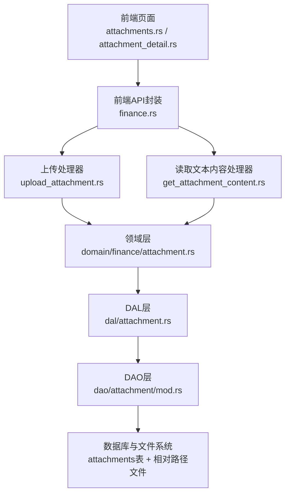
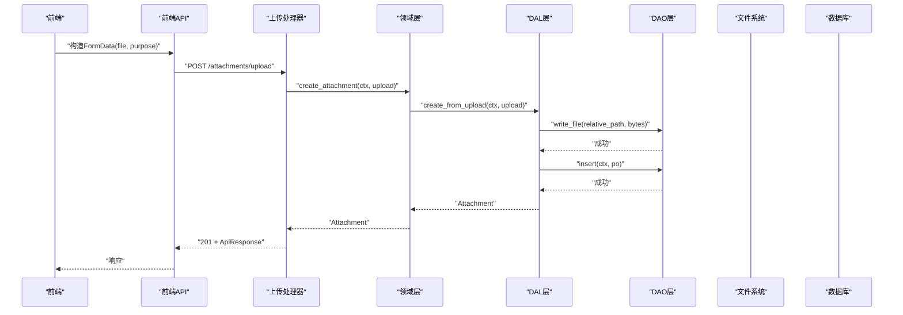
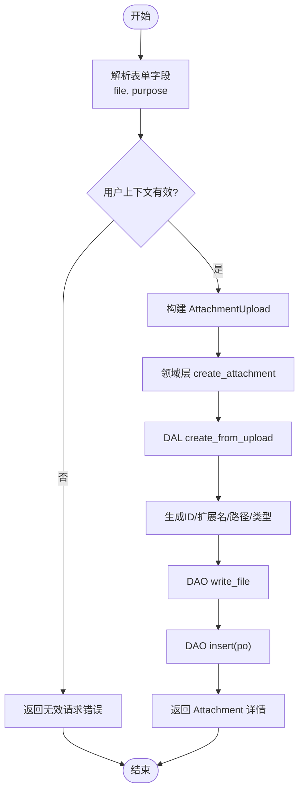
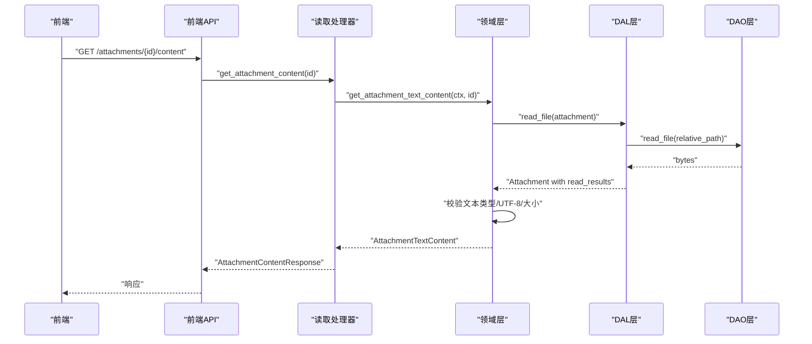
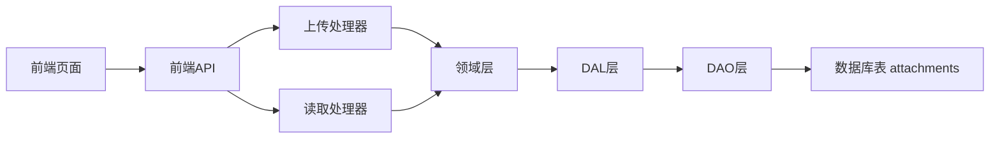

# 附件管理

<cite>
**本文引用的文件**
- [attachment.rs](src/models/attachment.rs)
- [file.rs](common/src/enums/file.rs)
- [mod.rs（附件处理器）](src/handlers/finance/attachment/mod.rs)
- [upload_attachment.rs](src/handlers/finance/attachment/upload_attachment.rs)
- [get_attachment_content.rs](src/handlers/finance/attachment/get_attachment_content.rs)
- [attachment.rs（领域层）](src/service/domain/finance/attachment.rs)
- [attachment.rs（DAL层）](src/service/dal/attachment.rs)
- [mod.rs（DAO层）](src/service/dao/attachment/mod.rs)
- [20260617000000_attachments.sql](migrations/20260617000000_attachments.sql)
- [attachments.rs（前端页面）](frontend/src/pages/finance/attachments.rs)
- [attachment_detail.rs（前端详情页）](frontend/src/pages/finance/attachment_detail.rs)
- [finance.rs（前端API）](frontend/src/api/finance.rs)
</cite>

## 目录
1. [简介](#简介)
2. [项目结构](#项目结构)
3. [核心组件](#核心组件)
4. [架构总览](#架构总览)
5. [详细组件分析](#详细组件分析)
6. [依赖关系分析](#依赖关系分析)
7. [性能与存储优化](#性能与存储优化)
8. [故障排查指南](#故障排查指南)
9. [结论](#结论)
10. [附录：使用示例与最佳实践](#附录使用示例与最佳实践)

## 简介
本文件为“附件管理”功能的完整技术文档，覆盖文件上传、预览、编辑与版本控制相关能力。系统采用严格四层单向调用：Adapter（HTTP Handler / 工具回调）→ Domain → DAL → DAO，禁止跨层调用与同层互调。附件属于 Finance 域通用上传资产，支持文本与二进制两类内容；文本类附件提供在线查看与编辑能力，并内置内容大小限制、MIME 校验与乐观锁冲突检测。

## 项目结构
附件管理涉及后端 Adapter、Domain、DAL、DAO 以及前端页面与 API 封装，整体组织如下：
- Adapter 层：HTTP 处理器负责解析请求、鉴权上下文、参数校验与响应组装。
- Domain 层：业务规则（文本类型判定、大小限制、MIME 白名单、乐观锁）。
- DAL 层：编排文件名、路径、类型推断、元数据与文件写入组合。
- DAO 层：持久化 AttachmentPo 与相对路径的文件读写。
- 前端：列表页、详情页、上传与保存交互，调用 finance API。

**图表来源**
- [mod.rs（附件处理器）:1-21](src/handlers/finance/attachment/mod.rs#L1-L21)
- [upload_attachment.rs:17-83](src/handlers/finance/attachment/upload_attachment.rs#L17-L83)
- [get_attachment_content.rs:12-38](src/handlers/finance/attachment/get_attachment_content.rs#L12-L38)
- [attachment.rs（领域层）:18-137](src/service/domain/finance/attachment.rs#L18-L137)
- [attachment.rs（DAL层）:94-190](src/service/dal/attachment.rs#L94-L190)
- [mod.rs（DAO层）:24-57](src/service/dao/attachment/mod.rs#L24-L57)

**章节来源**
- [mod.rs（附件处理器）:1-21](src/handlers/finance/attachment/mod.rs#L1-L21)
- [attachment.rs（领域层）:18-137](src/service/domain/finance/attachment.rs#L18-L137)
- [attachment.rs（DAL层）:94-190](src/service/dal/attachment.rs#L94-L190)
- [mod.rs（DAO层）:24-57](src/service/dao/attachment/mod.rs#L24-L57)

## 核心组件
- 模型与枚举
  - 附件持久化对象与业务实体：AttachmentPo、Attachment、AttachmentReadResult、AttachmentUpload、TextAttachmentCreate、TextContentUpdate、AttachmentTextContent。
  - 文件类型枚举 FileType：Document、Image、Audio、Video、Binary。
- 处理器（Adapter）
  - 上传：解析 multipart/form-data，提取 file 与 purpose，调用领域层创建。
  - 读取文本内容：按 ID 获取文本内容，返回元数据与 UTF-8 文本。
- 领域层（Domain）
  - 创建附件（上传或文本）、查询、删除、更新文本内容。
  - 文本类型判定、MIME 白名单、内容大小限制、乐观锁冲突处理。
- 数据访问层（DAL/DAO）
  - 生成存储名与相对路径、推断 MIME 与扩展名、写入/读取文件、更新元数据、分页查询。
  - 数据库表 attachments 及索引。

**章节来源**
- [attachment.rs（模型）:9-186](src/models/attachment.rs#L9-L186)
- [file.rs:11-56](common/src/enums/file.rs#L11-L56)
- [upload_attachment.rs:17-83](src/handlers/finance/attachment/upload_attachment.rs#L17-L83)
- [get_attachment_content.rs:12-38](src/handlers/finance/attachment/get_attachment_content.rs#L12-L38)
- [attachment.rs（领域层）:18-137](src/service/domain/finance/attachment.rs#L18-L137)
- [attachment.rs（DAL层）:94-190](src/service/dal/attachment.rs#L94-L190)
- [mod.rs（DAO层）:24-57](src/service/dao/attachment/mod.rs#L24-L57)
- [20260617000000_attachments.sql:1-23](migrations/20260617000000_attachments.sql#L1-L23)

## 架构总览
附件管理遵循四层单向调用：
- Adapter（HTTP 处理器）：接收请求、解析参数、调用领域服务。
- Domain（业务逻辑）：校验与编排业务规则（文本类型、大小、MIME、乐观锁）。
- DAL（数据访问编排）：生成文件名/路径、推断类型、组合元数据与文件写入。
- DAO（持久化）：数据库操作与文件读写。

**图表来源**
- [upload_attachment.rs:17-83](src/handlers/finance/attachment/upload_attachment.rs#L17-L83)
- [attachment.rs（领域层）:18-39](src/service/domain/finance/attachment.rs#L18-L39)
- [attachment.rs（DAL层）:96-134](src/service/dal/attachment.rs#L96-L134)
- [mod.rs（DAO层）:24-57](src/service/dao/attachment/mod.rs#L24-L57)

## 详细组件分析

### 上传流程（multipart/form-data）
- 处理器从 multipart 中解析 file 与 purpose，校验用户上下文，构建 AttachmentUpload。
- 领域层委托 DAL 创建，DAL 生成唯一 ID、扩展名、相对路径、文件类型，写入文件并插入元数据。
- 返回附件详情。

**图表来源**
- [upload_attachment.rs:17-83](src/handlers/finance/attachment/upload_attachment.rs#L17-L83)
- [attachment.rs（DAL层）:96-134](src/service/dal/attachment.rs#L96-L134)

**章节来源**
- [upload_attachment.rs:17-83](src/handlers/finance/attachment/upload_attachment.rs#L17-L83)
- [attachment.rs（DAL层）:96-134](src/service/dal/attachment.rs#L96-L134)

### 文本内容读取与在线编辑
- 处理器通过 ID 获取文本内容，仅对文本类附件开放。
- 领域层校验是否为文本类型、UTF-8 可解码、内容大小限制。
- 更新时支持可选的 expected_updated_at 进行乐观锁冲突检测。

**图表来源**
- [get_attachment_content.rs:12-38](src/handlers/finance/attachment/get_attachment_content.rs#L12-L38)
- [attachment.rs（领域层）:68-124](src/service/domain/finance/attachment.rs#L68-L124)
- [attachment.rs（DAL层）:171-189](src/service/dal/attachment.rs#L171-L189)
- [mod.rs（DAO层）:24-57](src/service/dao/attachment/mod.rs#L24-L57)

**章节来源**
- [get_attachment_content.rs:12-38](src/handlers/finance/attachment/get_attachment_content.rs#L12-L38)
- [attachment.rs（领域层）:68-124](src/service/domain/finance/attachment.rs#L68-L124)
- [attachment.rs（DAL层）:171-189](src/service/dal/attachment.rs#L171-L189)

### 文件类型与格式支持
- 文件类型枚举：Document、Image、Audio、Video、Binary。
- 文本类型判定：基于 MIME 白名单与扩展名判断，允许 text/*、application/json/yaml/toml/xml/javascript 等。
- 扩展名推断：优先从原始文件名提取，否则根据 MIME 映射；后缀安全清洗。
- 二进制附件不支持在线内容读取，仅支持元数据展示与下载（由上层业务决定）。

**章节来源**
- [file.rs:11-56](common/src/enums/file.rs#L11-L56)
- [attachment.rs（领域层）:206-247](src/service/domain/finance/attachment.rs#L206-L247)
- [attachment.rs（DAL层）:198-277](src/service/dal/attachment.rs#L198-L277)

### 存储策略与访问控制
- 存储策略：
  - 相对路径按日期分目录：YYYYMMDD/id.ext。
  - 文件名唯一且安全：UUID v7 + 安全化的扩展名。
  - 元数据与文件分离：数据库记录元数据，文件以相对路径存储。
- 访问控制：
  - 所有读取与更新均校验 root_user_id 与当前用户上下文。
  - 删除为软删除（status=0），查询自动过滤已删除记录。
- 数据安全：
  - 文本内容禁止包含 NUL 字节。
  - 文本大小限制（默认 64KB）。
  - 文件名路径穿越防护（禁止 /、\、..、绝对路径）。

**章节来源**
- [attachment.rs（DAL层）:96-134](src/service/dal/attachment.rs#L96-L134)
- [attachment.rs（DAL层）:192-250](src/service/dal/attachment.rs#L192-L250)
- [attachment.rs（领域层）:159-221](src/service/domain/finance/attachment.rs#L159-L221)
- [mod.rs（DAO层）:24-57](src/service/dao/attachment/mod.rs#L24-L57)
- [20260617000000_attachments.sql:1-23](migrations/20260617000000_attachments.sql#L1-L23)

### 版本历史追踪
- 当前实现未维护多版本历史表；每次更新会覆盖文件内容并刷新元数据（updated_at）。
- 如需版本历史，可在 DAO/DAL 层引入版本快照机制（例如追加 _vN 文件或新增版本表），并在 Domain 层增加版本查询与回滚接口。

[本节为概念性说明，不直接分析具体文件]

### 搜索、分类标签与批量操作
- 搜索与分类：
  - 支持按 root_user_id、purpose、file_type 分页查询。
  - 可通过前端筛选器组合这些条件实现搜索与分类。
- 批量操作：
  - 当前未提供批量删除/移动接口；可在 Adapter 层增加批量端点，复用 DAL/DAO 的 delete 与 query 能力。
- 标签：
  - purpose 字段可作为用途标签；可扩展为多标签结构（需变更模型与查询）。

**章节来源**
- [mod.rs（DAO层）:11-22](src/service/dao/attachment/mod.rs#L11-L22)
- [attachment.rs（领域层）:126-132](src/service/domain/finance/attachment.rs#L126-L132)

### 安全扫描机制
- 当前未集成外部病毒扫描；建议在上传后异步触发扫描任务，失败则标记状态并阻止访问。
- 建议方案：在 DAL 层写文件后，调用扫描服务；成功再入库，失败则拒绝并记录日志。

[本节为概念性说明，不直接分析具体文件]

## 依赖关系分析
- 处理器依赖领域层接口，领域层依赖 DAL，DAL 依赖 DAO。
- 前端依赖 finance API 封装，调用后端处理器。
- 数据库表 attachments 提供索引优化查询。

**图表来源**
- [mod.rs（附件处理器）:1-21](src/handlers/finance/attachment/mod.rs#L1-L21)
- [attachment.rs（领域层）:18-137](src/service/domain/finance/attachment.rs#L18-L137)
- [attachment.rs（DAL层）:94-190](src/service/dal/attachment.rs#L94-L190)
- [mod.rs（DAO层）:24-57](src/service/dao/attachment/mod.rs#L24-L57)
- [20260617000000_attachments.sql:1-23](migrations/20260617000000_attachments.sql#L1-L23)

**章节来源**
- [mod.rs（附件处理器）:1-21](src/handlers/finance/attachment/mod.rs#L1-L21)
- [attachment.rs（领域层）:18-137](src/service/domain/finance/attachment.rs#L18-L137)
- [attachment.rs（DAL层）:94-190](src/service/dal/attachment.rs#L94-L190)
- [mod.rs（DAO层）:24-57](src/service/dao/attachment/mod.rs#L24-L57)
- [20260617000000_attachments.sql:1-23](migrations/20260617000000_attachments.sql#L1-L23)

## 性能与存储优化
- 文本内容限制：默认 64KB，避免大文本占用内存与带宽。
- 文件路径按日期分目录，提升文件系统遍历效率。
- 数据库索引：root_user_id、purpose、status、created_at，优化查询性能。
- 建议：
  - 对大文件启用流式上传与分块校验。
  - 引入 CDN 或对象存储加速静态资源访问。
  - 对频繁查询的元数据增加缓存层（如 Redis）。

[本节提供一般性指导，不直接分析具体文件]

## 故障排查指南
- 常见错误与定位：
  - 缺少用户上下文：检查认证中间件与 RequestContext。
  - 非文本类型读取失败：确认 FileType 与 MIME 是否匹配文本白名单。
  - 文本内容过大：检查 MAX_TEXT_CONTENT_BYTES 限制。
  - 乐观锁冲突：更新时 expected_updated_at 与 updated_at 不一致导致冲突。
  - 文件不存在：检查相对路径与 DAO 文件读写权限。
- 调试建议：
  - 打印 relative_path 与 stored_name，验证路径生成逻辑。
  - 检查 attachments 表记录与文件系统一致性。
  - 捕获并记录错误码与消息，便于前端提示。

**章节来源**
- [upload_attachment.rs:25-71](src/handlers/finance/attachment/upload_attachment.rs#L25-L71)
- [attachment.rs（领域层）:88-124](src/service/domain/finance/attachment.rs#L88-L124)
- [attachment.rs（领域层）:187-221](src/service/domain/finance/attachment.rs#L187-L221)
- [attachment.rs（DAL层）:171-189](src/service/dal/attachment.rs#L171-L189)

## 结论
附件管理功能实现了安全的文件上传、文本内容的在线查看与编辑、严格的类型与大小校验、以及基于用户上下文的访问控制。通过 DAL/DAO 分层设计，保证了代码的可维护性与扩展性。未来可增强版本历史、批量操作与安全扫描能力，进一步提升用户体验与安全性。

[本节总结性内容，不直接分析具体文件]

## 附录：使用示例与最佳实践
- 前端上传示例
  - 构造 FormData，包含 file 与 purpose 字段，调用 upload_attachment。
  - 参考路径：[finance.rs:249-253](frontend/src/api/finance.rs#L249-L253)
- 前端列表与删除
  - 列表加载：list_attachments。
  - 删除：delete_attachment，确认后刷新列表。
  - 参考路径：[attachments.rs:30-73](frontend/src/pages/finance/attachments.rs#L30-L73)、[attachments.rs:162-183](frontend/src/pages/finance/attachments.rs#L162-L183)
- 前端详情与编辑
  - 读取文本内容：get_attachment_content。
  - 保存编辑：update_attachment_content，支持可选乐观锁。
  - 参考路径：[attachment_detail.rs:24-67](frontend/src/pages/finance/attachment_detail.rs#L24-L67)
- 最佳实践
  - 始终校验用户上下文与权限。
  - 对文本内容做大小与格式校验。
  - 使用相对路径与唯一文件名，避免冲突。
  - 对敏感文件考虑加密存储与访问审计。

**章节来源**
- [finance.rs:237-271](frontend/src/api/finance.rs#L237-L271)
- [attachments.rs:30-73](frontend/src/pages/finance/attachments.rs#L30-L73)
- [attachments.rs:162-183](frontend/src/pages/finance/attachments.rs#L162-L183)
- [attachment_detail.rs:24-67](frontend/src/pages/finance/attachment_detail.rs#L24-L67)