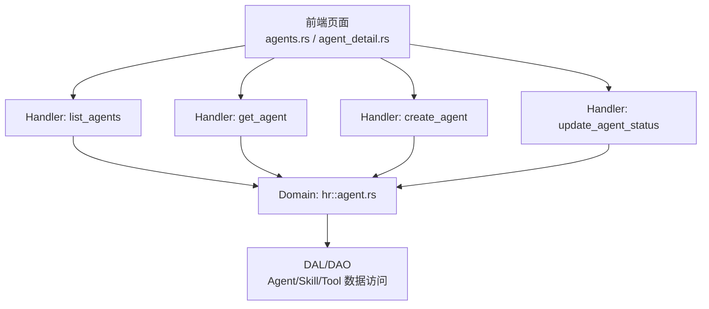
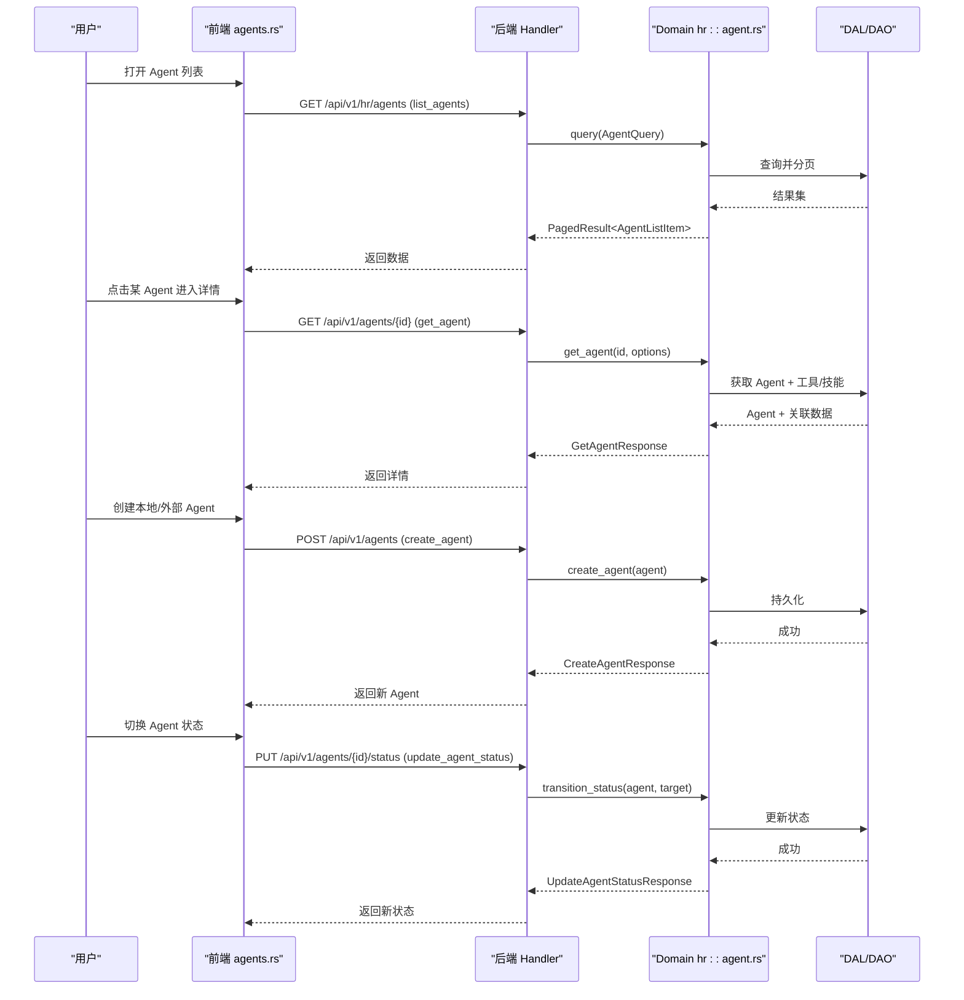
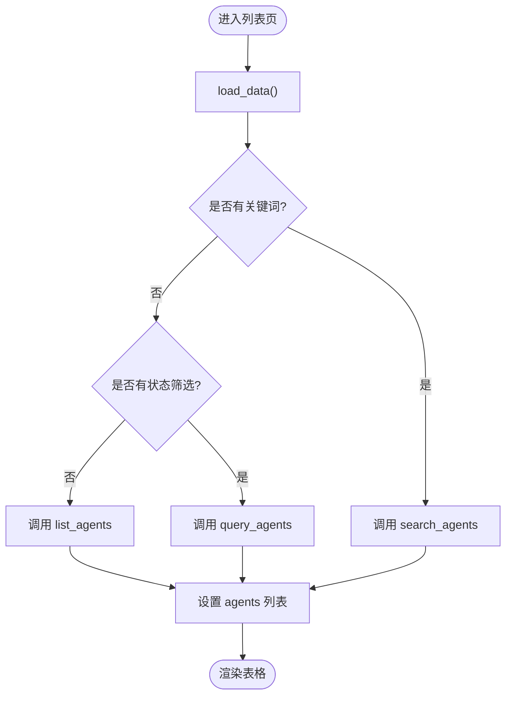
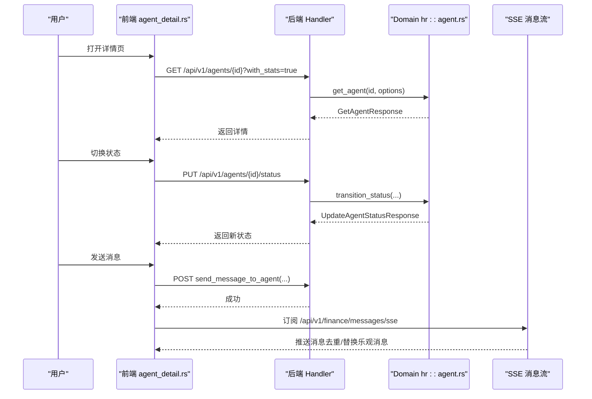
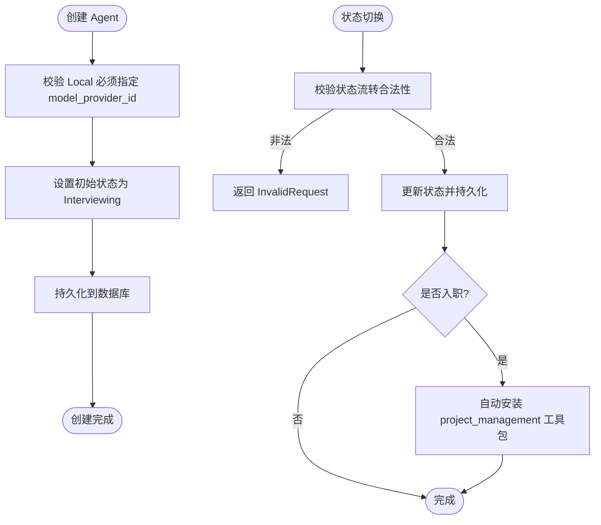
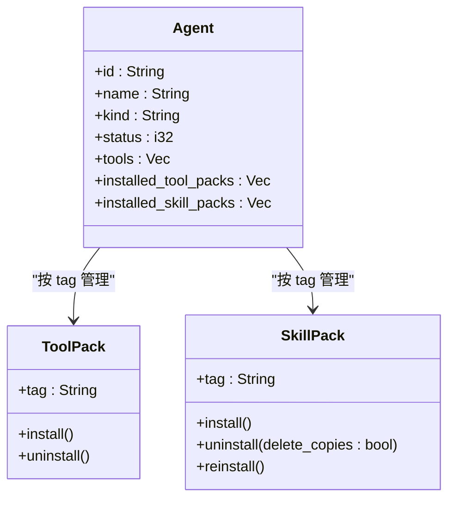
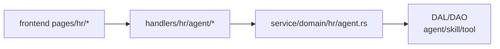

# Agent 管理功能

<cite>
**本文引用的文件**
- [frontend/src/pages/hr/agents.rs](frontend/src/pages/hr/agents.rs)
- [frontend/src/pages/hr/agent_detail.rs](frontend/src/pages/hr/agent_detail.rs)
- [src/handlers/hr/agent/mod.rs](src/handlers/hr/agent/mod.rs)
- [src/handlers/hr/agent/list_agents.rs](src/handlers/hr/agent/list_agents.rs)
- [src/handlers/hr/agent/get_agent.rs](src/handlers/hr/agent/get_agent.rs)
- [src/handlers/hr/agent/create_agent.rs](src/handlers/hr/agent/create_agent.rs)
- [src/handlers/hr/agent/update_agent_status.rs](src/handlers/hr/agent/update_agent_status.rs)
- [src/service/domain/hr/agent.rs](src/service/domain/hr/agent.rs)
</cite>

## 目录
1. [简介](#简介)
2. [项目结构](#项目结构)
3. [核心组件](#核心组件)
4. [架构总览](#架构总览)
5. [详细组件分析](#详细组件分析)
6. [依赖关系分析](#依赖关系分析)
7. [性能考虑](#性能考虑)
8. [故障排查指南](#故障排查指南)
9. [结论](#结论)
10. [附录](#附录)

## 简介
本文件面向 Agent 管理功能的完整实现，覆盖前端列表页与详情页、后端 HTTP Handler、领域层业务规则与数据访问调用。重点说明：
- 列表页的数据加载、搜索过滤、分页与用户交互
- 详情页的信息展示、状态切换、配置编辑、调试（消息与 SSE）
- Agent 生命周期管理（创建、更新、删除、启用禁用）的端到端流程
- 与技能包、工具的绑定关系界面与后端处理
- 权限控制、数据验证、表单处理与用户体验优化建议
- 结合代码路径的最佳实践示例

## 项目结构
Agent 管理采用严格四层单向调用：Adapter（HTTP Handler）→ Domain → DAL → DAO。前端通过 Dioxus 页面调用后端 API，后端由 Axum 暴露接口，Domain 层负责业务校验与编排，DAL/DAO 负责数据存取。

图表来源
- [frontend/src/pages/hr/agents.rs:1-150](frontend/src/pages/hr/agents.rs#L1-L150)
- [frontend/src/pages/hr/agent_detail.rs:1-120](frontend/src/pages/hr/agent_detail.rs#L1-L120)
- [src/handlers/hr/agent/list_agents.rs:1-62](src/handlers/hr/agent/list_agents.rs#L1-L62)
- [src/handlers/hr/agent/get_agent.rs:1-138](src/handlers/hr/agent/get_agent.rs#L1-L138)
- [src/handlers/hr/agent/create_agent.rs:1-60](src/handlers/hr/agent/create_agent.rs#L1-L60)
- [src/handlers/hr/agent/update_agent_status.rs:1-129](src/handlers/hr/agent/update_agent_status.rs#L1-L129)
- [src/service/domain/hr/agent.rs:1-120](src/service/domain/hr/agent.rs#L1-L120)

章节来源
- [src/handlers/hr/agent/mod.rs:1-55](src/handlers/hr/agent/mod.rs#L1-L55)

## 核心组件
- 前端列表页：支持本地/外部 Agent 创建、关键词搜索、状态筛选、删除确认、模型提供商选择等
- 前端详情页：概览信息、状态切换、工具与技能安装/卸载、对话与记忆、关系图、知识图谱
- 后端 Handler：按方法粒度拆分，统一通过 Domain 编排业务逻辑
- 领域层：Agent 创建/查询/搜索/更新/删除、状态流转、工具包/技能包安装卸载、入职就绪校验

章节来源
- [frontend/src/pages/hr/agents.rs:40-150](frontend/src/pages/hr/agents.rs#L40-L150)
- [frontend/src/pages/hr/agent_detail.rs:84-236](frontend/src/pages/hr/agent_detail.rs#L84-L236)
- [src/handlers/hr/agent/mod.rs:1-55](src/handlers/hr/agent/mod.rs#L1-L55)
- [src/service/domain/hr/agent.rs:60-120](src/service/domain/hr/agent.rs#L60-L120)

## 架构总览
下图展示了从前端到后端的完整调用链，包括列表、详情、创建、状态变更等关键路径。

图表来源
- [frontend/src/pages/hr/agents.rs:85-139](frontend/src/pages/hr/agents.rs#L85-L139)
- [frontend/src/pages/hr/agent_detail.rs:134-236](frontend/src/pages/hr/agent_detail.rs#L134-L236)
- [src/handlers/hr/agent/list_agents.rs:21-62](src/handlers/hr/agent/list_agents.rs#L21-L62)
- [src/handlers/hr/agent/get_agent.rs:24-138](src/handlers/hr/agent/get_agent.rs#L24-L138)
- [src/handlers/hr/agent/create_agent.rs:18-60](src/handlers/hr/agent/create_agent.rs#L18-L60)
- [src/handlers/hr/agent/update_agent_status.rs:24-129](src/handlers/hr/agent/update_agent_status.rs#L24-L129)
- [src/service/domain/hr/agent.rs:60-270](src/service/domain/hr/agent.rs#L60-L270)

## 详细组件分析

### 列表页：数据展示、搜索过滤、分页与交互
- 数据加载策略
  - 无关键词且无状态筛选：调用 list_agents
  - 无关键词但有状态筛选：调用 query_agents
  - 有关键词：调用 search_agents（可同时带状态筛选）
- 搜索防抖与竞态保护
  - 使用 search_request_id 丢弃过期请求结果，避免 race condition
  - 输入框 oninput 触发 300ms 延时再发起请求
- 用户交互
  - 创建本地/外部 Agent 弹窗，表单校验与错误提示
  - 删除确认对话框，确认后调用 delete_agent
  - 重置按钮清空筛选条件并重新加载

图表来源
- [frontend/src/pages/hr/agents.rs:85-139](frontend/src/pages/hr/agents.rs#L85-L139)

章节来源
- [frontend/src/pages/hr/agents.rs:40-150](frontend/src/pages/hr/agents.rs#L40-L150)
- [frontend/src/pages/hr/agents.rs:285-423](frontend/src/pages/hr/agents.rs#L285-L423)
- [frontend/src/pages/hr/agents.rs:425-649](frontend/src/pages/hr/agents.rs#L425-L649)

### 详情页：信息展示、状态切换、配置编辑与调试
- 基本信息与运行时配置
  - 显示 ID、类型、状态、模型提供商、创建时间
  - 外部 Agent 显示 CLI/Remote 配置（命令、参数、工作目录、超时、Prompt 模板、A2A Server、目标 Agent、认证 Token）
- 状态切换
  - 提供空闲/思考中/已入职/休息中选项，调用 update_agent_status
  - 成功后刷新详情并提示
- 工具与技能
  - 工具包：按 tag 安装/卸载，刷新已安装列表
  - 技能包：按 tag 安装/卸载，支持单个技能安装与卸载
  - 已安装技能卡片网格展示
- 调试能力
  - 聊天输入发送消息，SSE 实时接收消息
  - 消息乐观更新与失败回滚，typing 指示器与超时保护
  - 关系图与知识图谱视图

图表来源
- [frontend/src/pages/hr/agent_detail.rs:134-236](frontend/src/pages/hr/agent_detail.rs#L134-L236)
- [frontend/src/pages/hr/agent_detail.rs:238-324](frontend/src/pages/hr/agent_detail.rs#L238-L324)
- [src/handlers/hr/agent/get_agent.rs:24-138](src/handlers/hr/agent/get_agent.rs#L24-L138)
- [src/handlers/hr/agent/update_agent_status.rs:24-129](src/handlers/hr/agent/update_agent_status.rs#L24-L129)

章节来源
- [frontend/src/pages/hr/agent_detail.rs:84-236](frontend/src/pages/hr/agent_detail.rs#L84-L236)
- [frontend/src/pages/hr/agent_detail.rs:326-560](frontend/src/pages/hr/agent_detail.rs#L326-L560)
- [frontend/src/pages/hr/agent_detail.rs:561-800](frontend/src/pages/hr/agent_detail.rs#L561-L800)

### 生命周期管理：创建、更新、删除、启用禁用
- 创建 Agent
  - 前端构造 CreateAgentRequest/CreateExternalAgentRequest，提交后刷新列表
  - 后端校验 Local Agent 必须指定 model_provider_id，新建状态固定为 Interviewing
- 更新 Agent
  - 详情页编辑弹窗，保存时调用更新接口（此处以状态更新为主）
- 删除 Agent
  - 列表页删除确认，调用 delete_agent，成功后刷新列表
- 启用/禁用（状态切换）
  - 详情页状态按钮调用 update_agent_status
  - 领域层进行状态机校验，允许合法流转；入职时自动安装 project_management 工具包

图表来源
- [src/service/domain/hr/agent.rs:60-84](src/service/domain/hr/agent.rs#L60-L84)
- [src/service/domain/hr/agent.rs:213-270](src/service/domain/hr/agent.rs#L213-L270)
- [src/handlers/hr/agent/create_agent.rs:18-60](src/handlers/hr/agent/create_agent.rs#L18-L60)
- [src/handlers/hr/agent/update_agent_status.rs:24-129](src/handlers/hr/agent/update_agent_status.rs#L24-L129)

章节来源
- [src/service/domain/hr/agent.rs:60-270](src/service/domain/hr/agent.rs#L60-L270)
- [src/handlers/hr/agent/create_agent.rs:1-60](src/handlers/hr/agent/create_agent.rs#L1-L60)
- [src/handlers/hr/agent/update_agent_status.rs:1-129](src/handlers/hr/agent/update_agent_status.rs#L1-L129)

### 与技能包、工具绑定的关系管理界面
- 工具包
  - 按 tag 安装/卸载，幂等处理（已安装则跳过）
  - 刷新已安装工具包列表
- 技能包
  - 按 tag 安装/卸载，支持重装（覆盖副本或新建安装）
  - 单个技能安装/卸载，已安装技能卡片网格展示
- 工具绑定
  - 详情页获取已绑定工具 ID 列表，用于概览展示

图表来源
- [src/service/domain/hr/agent.rs:313-397](src/service/domain/hr/agent.rs#L313-L397)
- [src/service/domain/hr/agent.rs:414-564](src/service/domain/hr/agent.rs#L414-L564)
- [frontend/src/pages/hr/agent_detail.rs:561-800](frontend/src/pages/hr/agent_detail.rs#L561-L800)

章节来源
- [src/service/domain/hr/agent.rs:313-655](src/service/domain/hr/agent.rs#L313-L655)
- [frontend/src/pages/hr/agent_detail.rs:561-800](frontend/src/pages/hr/agent_detail.rs#L561-L800)

### 权限控制、数据验证、表单处理与用户体验优化
- 权限控制
  - 创建 Agent 前校验用户上下文（uid），缺失则返回 InvalidRequest
- 数据验证
  - 创建 Local Agent 必须指定 model_provider_id
  - 新建状态必须为 Interviewing
  - 状态流转遵循有限状态机，非法跳转返回 InvalidRequest
- 表单处理
  - 前端对必填字段进行空值校验，错误通过 toast 提示
  - 外部 Agent 创建根据类型动态渲染 CLI/Remote 配置项
- 用户体验优化
  - 搜索防抖与竞态保护（search_request_id）
  - SSE 连接失败提示与资源释放
  - 发送消息失败时恢复输入并重置 typing 状态
  - 关系图按需加载，避免全量 N+1 查询

章节来源
- [src/handlers/hr/agent/create_agent.rs:18-60](src/handlers/hr/agent/create_agent.rs#L18-L60)
- [src/service/domain/hr/agent.rs:60-84](src/service/domain/hr/agent.rs#L60-L84)
- [src/service/domain/hr/agent.rs:213-270](src/service/domain/hr/agent.rs#L213-L270)
- [frontend/src/pages/hr/agents.rs:73-139](frontend/src/pages/hr/agents.rs#L73-L139)
- [frontend/src/pages/hr/agent_detail.rs:238-324](frontend/src/pages/hr/agent_detail.rs#L238-L324)

## 依赖关系分析
- Handler 与 Domain 解耦：每个 Handler 仅负责参数解析与响应构造，业务逻辑集中在 Domain
- Domain 聚合 DAL/DAO：工具、技能、Agent 数据访问通过 DAL/DAO 抽象，避免跨层耦合
- 前端与后端契约：通过 common::api 中的请求/响应类型保持一致

图表来源
- [src/handlers/hr/agent/mod.rs:1-55](src/handlers/hr/agent/mod.rs#L1-L55)
- [src/service/domain/hr/agent.rs:1-120](src/service/domain/hr/agent.rs#L1-L120)
- [frontend/src/pages/hr/agents.rs:1-150](frontend/src/pages/hr/agents.rs#L1-L150)

章节来源
- [src/handlers/hr/agent/mod.rs:1-55](src/handlers/hr/agent/mod.rs#L1-L55)
- [src/service/domain/hr/agent.rs:1-120](src/service/domain/hr/agent.rs#L1-L120)

## 性能考虑
- 列表页搜索防抖：300ms 延迟减少频繁请求
- 竞态保护：search_request_id 丢弃过期结果，避免 UI 闪烁
- 详情页按需加载：关系图数据按 agent_id 过滤任务后再批量查询项目，避免 N+1
- SSE 消息去重：收到消息后检查是否存在相同 message_id，避免重复渲染
- 工具/技能列表缓存：前端信号存储，减少重复请求

[本节为通用性能建议，不直接分析具体文件]

## 故障排查指南
- 搜索无结果或数据错乱
  - 检查 search_request_id 是否正确递增
  - 确认关键词与状态筛选组合是否符合预期
- 状态切换失败
  - 查看后端日志中的 InvalidRequest 错误，确认当前状态与目标状态是否合法
- SSE 消息未更新
  - 检查 EventSource 初始化是否成功，onmessage 回调是否正确注册与释放
- 工具/技能安装失败
  - 确认 tag 是否存在，已安装则幂等跳过；技能包安装失败会记录警告日志

章节来源
- [frontend/src/pages/hr/agents.rs:73-139](frontend/src/pages/hr/agents.rs#L73-L139)
- [src/service/domain/hr/agent.rs:213-270](src/service/domain/hr/agent.rs#L213-L270)
- [frontend/src/pages/hr/agent_detail.rs:238-324](frontend/src/pages/hr/agent_detail.rs#L238-L324)
- [src/service/domain/hr/agent.rs:414-564](src/service/domain/hr/agent.rs#L414-L564)

## 结论
Agent 管理功能在前端与后端之间形成了清晰的职责划分与稳定的调用链路。列表页与详情页提供了完整的 CRUD、状态管理与扩展能力（工具/技能）。领域层的状态机与幂等操作保证了数据一致性与可维护性。建议在后续迭代中继续强化：
- 更细粒度的权限控制（基于组织/项目）
- 更丰富的搜索与排序能力
- 更完善的错误码与用户提示
- 更全面的集成测试覆盖

[本节为总结性内容，不直接分析具体文件]

## 附录
- 关键 API 路径参考
  - 列表：GET /api/v1/hr/agents
  - 详情：GET /api/v1/agents/{id}
  - 创建：POST /api/v1/agents
  - 状态更新：PUT /api/v1/agents/{id}/status
- 相关代码路径
  - 列表页：frontend/src/pages/hr/agents.rs
  - 详情页：frontend/src/pages/hr/agent_detail.rs
  - Handler 入口：src/handlers/hr/agent/mod.rs
  - 领域逻辑：src/service/domain/hr/agent.rs

[本节为补充信息，不直接分析具体文件]