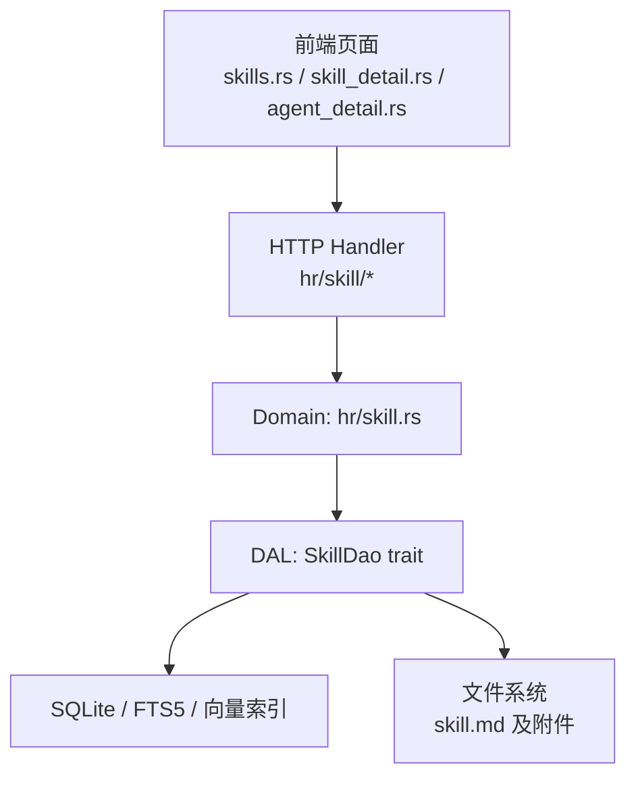
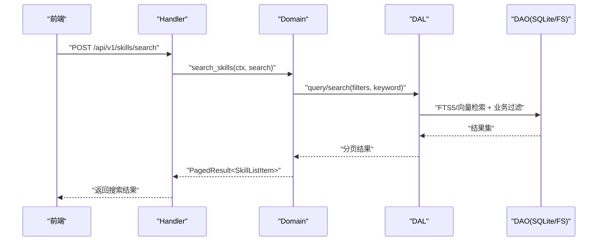
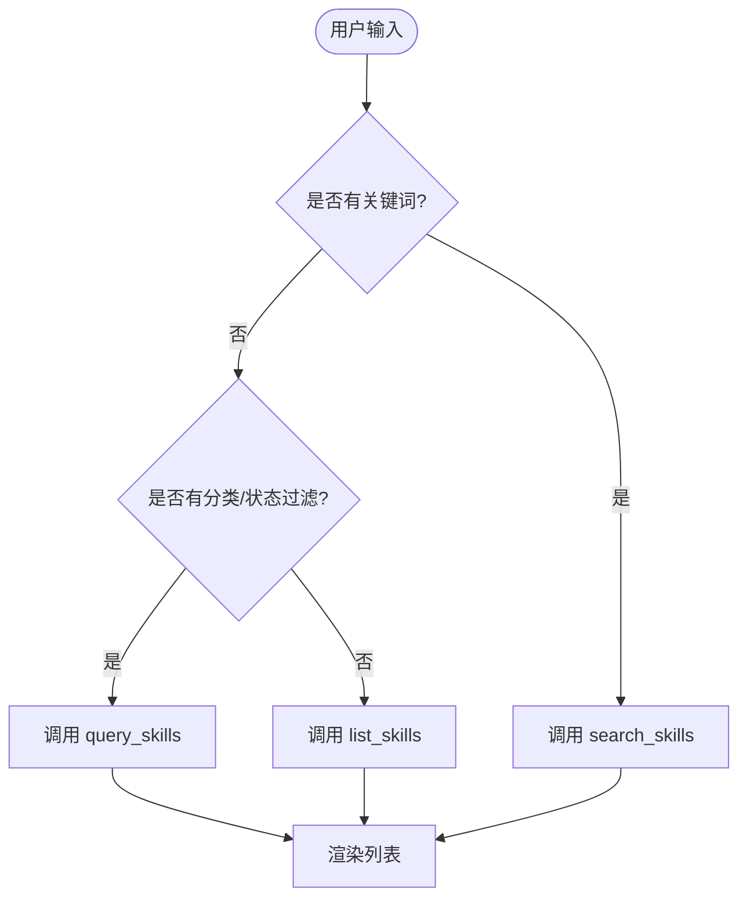
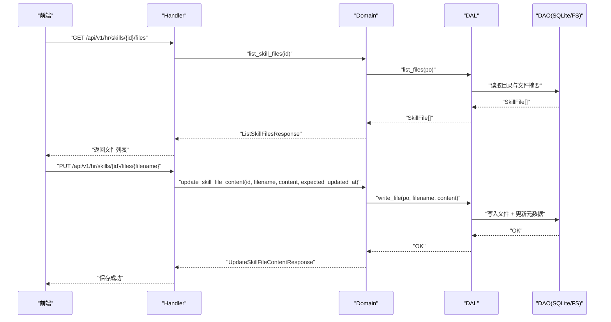
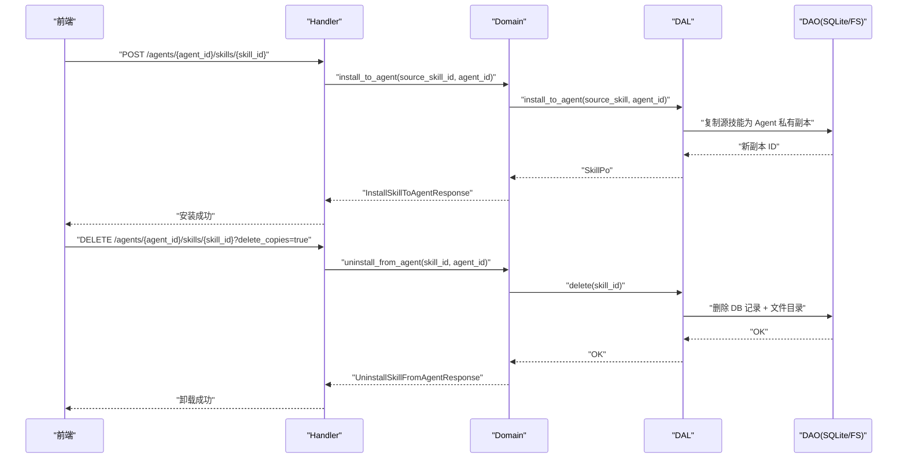
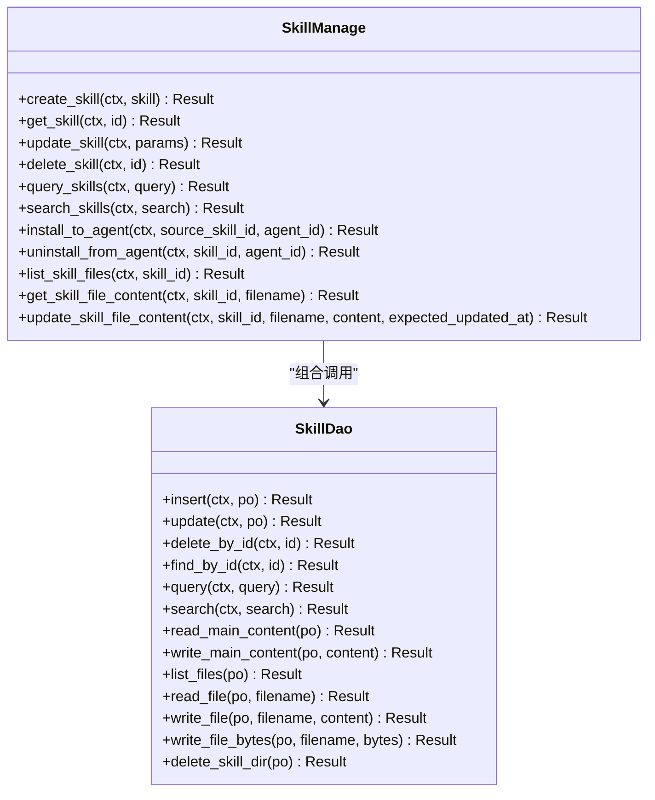
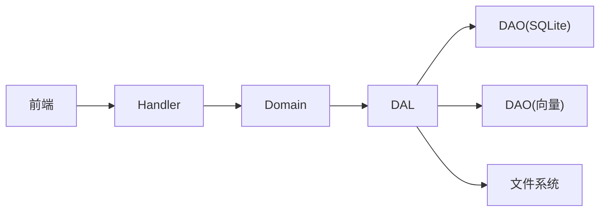

# 技能管理系统

<cite>
**本文引用的文件**
- [src/handlers/hr/skill/mod.rs](src/handlers/hr/skill/mod.rs)
- [src/handlers/hr/skill/search_skills.rs](src/handlers/hr/skill/search_skills.rs)
- [src/handlers/hr/skill/install_skill_to_agent.rs](src/handlers/hr/skill/install_skill_to_agent.rs)
- [src/handlers/hr/skill/uninstall_skill_from_agent.rs](src/handlers/hr/skill/uninstall_skill_from_agent.rs)
- [src/service/domain/hr/skill.rs](src/service/domain/hr/skill.rs)
- [src/service/dao/skill/mod.rs](src/service/dao/skill/mod.rs)
- [src/service/dao/skill/sqlite.rs](src/service/dao/skill/sqlite.rs)
- [common/src/enums/skill.rs](common/src/enums/skill.rs)
- [common/src/api/skill.rs](common/src/api/skill.rs)
- [frontend/src/pages/hr/skills.rs](frontend/src/pages/hr/skills.rs)
- [frontend/src/pages/hr/skill_detail.rs](frontend/src/pages/hr/skill_detail.rs)
- [frontend/src/pages/hr/agent_detail.rs](frontend/src/pages/hr/agent_detail.rs)
- [frontend/src/api/hr.rs](frontend/src/api/hr.rs)
- [docs/superpowers/plans/2026-07-30-tool-skill-search-install.md](docs/superpowers/plans/2026-07-30-tool-skill-search-install.md)
- [docs/superpowers/plans/2026-07-23-p0-skill-detail-and-task-edit.md](docs/superpowers/plans/2026-07-23-p0-skill-detail-and-task-edit.md)
</cite>

## 目录
1. [简介](#简介)
2. [项目结构](#项目结构)
3. [核心组件](#核心组件)
4. [架构总览](#架构总览)
5. [详细组件分析](#详细组件分析)
6. [依赖关系分析](#依赖关系分析)
7. [性能与可用性](#性能与可用性)
8. [故障排查指南](#故障排查指南)
9. [结论](#结论)
10. [附录：开发规范、打包格式与发布流程](#附录开发规范打包格式与发布流程)

## 简介
本文件系统性地梳理“技能管理系统”的完整能力，覆盖技能包浏览页面的分类展示、搜索过滤、版本信息与安装状态；技能详情页面的文件结构查看、内容编辑、依赖关系展示与版本管理；技能包的安装卸载流程、依赖检查机制、冲突处理与回滚策略；技能包与 Agent 的绑定解绑操作、权限控制与变更同步；以及文件上传下载、内容预览、语法高亮和实时保存等前端交互。文档同时给出技能开发规范、打包格式与发布流程指导，帮助开发者快速上手并高质量交付。

## 项目结构
技能管理系统采用严格四层单向调用：Adapter（HTTP Handler / 公开回调 Handler / AOP Producer）→ Domain → DAL → DAO，禁止跨层调用与同层互调。后端以 Axum 提供 HTTP 接口，Domain 承载业务规则，DAL 封装领域服务，DAO 负责数据访问与文件存储。前端基于 Dioxus + Tailwind + DaisyUI，提供技能库列表、技能详情、Agent 技能管理等页面。

图表来源
- [src/handlers/hr/skill/mod.rs:1-36](src/handlers/hr/skill/mod.rs#L1-L36)
- [src/service/domain/hr/skill.rs:1-339](src/service/domain/hr/skill.rs#L1-L339)
- [src/service/dao/skill/mod.rs:1-194](src/service/dao/skill/mod.rs#L1-L194)

章节来源
- [src/handlers/hr/skill/mod.rs:1-36](src/handlers/hr/skill/mod.rs#L1-L36)
- [src/service/dao/skill/mod.rs:1-194](src/service/dao/skill/mod.rs#L1-L194)

## 核心组件
- 技能查询与搜索
  - 支持按分类、状态、作者、标签、关键词进行条件过滤与全文/语义混合搜索。
  - 统一查询参数 SkillQuery 与搜索参数 SkillSearch，后者复用 SkillQuery 作为业务过滤。
- 技能详情与文件管理
  - 列出技能文件、读取/更新文件内容，包含路径安全校验与乐观锁保护。
- 技能安装与卸载
  - 单技能安装到 Agent（创建私有副本），批量按 tag 安装/卸载技能包，支持删除副本选项。
- 权限与安全
  - 仅作者可访问/修改技能内容与元信息；导入目标路径严格校验，防止越权与路径穿越。
- 前端交互
  - 技能库列表页支持筛选与搜索防抖；详情页支持文件预览、在线编辑、元信息编辑；Agent 详情页支持搜索式安装与卸载确认。

章节来源
- [src/service/domain/hr/skill.rs:1-339](src/service/domain/hr/skill.rs#L1-L339)
- [src/service/dao/skill/mod.rs:18-47](src/service/dao/skill/mod.rs#L18-L47)
- [common/src/api/skill.rs:11-466](common/src/api/skill.rs#L11-L466)
- [frontend/src/pages/hr/skills.rs:1-378](frontend/src/pages/hr/skills.rs#L1-L378)
- [frontend/src/pages/hr/skill_detail.rs:1-344](frontend/src/pages/hr/skill_detail.rs#L1-L344)
- [frontend/src/pages/hr/agent_detail.rs:766-1218](frontend/src/pages/hr/agent_detail.rs#L766-L1218)

## 架构总览
技能管理系统的请求链路遵循 Adapter → Domain → DAL → DAO 的单向调用原则。Handler 将请求转换为 Domain 方法调用，Domain 组合多个 DAL 操作完成业务逻辑，DAL 通过 DAO 访问数据库与文件系统。

图表来源
- [src/handlers/hr/skill/search_skills.rs:1-50](src/handlers/hr/skill/search_skills.rs#L1-L50)
- [src/service/domain/hr/skill.rs:126-132](src/service/domain/hr/skill.rs#L126-L132)
- [src/service/dao/skill/mod.rs:101-109](src/service/dao/skill/mod.rs#L101-L109)

## 详细组件分析

### 技能包浏览页面：分类展示、搜索过滤、版本信息与安装状态
- 分类与状态筛选
  - 前端 skills.rs 提供分类输入框与状态下拉选择，支持即时触发加载。
  - 当有关键词时走搜索接口；无关键词但有过滤条件时走通用查询接口；否则走基础列表接口。
- 搜索与防抖
  - 使用 request_id 机制避免竞态，结合 300ms 延时减少频繁请求。
- 版本信息与安装状态
  - 列表项包含状态（草稿/已发布/已过期）、标签、分类等元信息；Agent 详情页显示已安装技能包与单个已安装技能卡片。

图表来源
- [frontend/src/pages/hr/skills.rs:42-105](frontend/src/pages/hr/skills.rs#L42-L105)
- [src/handlers/hr/skill/search_skills.rs:16-49](src/handlers/hr/skill/search_skills.rs#L16-L49)

章节来源
- [frontend/src/pages/hr/skills.rs:1-378](frontend/src/pages/hr/skills.rs#L1-L378)
- [src/handlers/hr/skill/search_skills.rs:1-50](src/handlers/hr/skill/search_skills.rs#L1-L50)
- [common/src/enums/skill.rs:6-19](common/src/enums/skill.rs#L6-L19)

### 技能详情页面：文件结构查看、内容编辑、依赖关系展示与版本管理
- 文件结构查看
  - 详情页左侧列出文件清单，右侧显示选中文件内容；支持文件大小显示与空状态提示。
- 内容编辑与保存
  - 使用 CodeEditor 组件进行 Markdown 编辑；保存时调用 update_skill_file_content，后端进行路径安全校验与乐观锁检查。
- 依赖关系展示
  - 当前实现未显式解析依赖图；可通过 tags/category 与 parent_skill_id 间接表达关联关系。
- 版本管理
  - 通过 updated_at 与 expected_updated_at 实现乐观锁；删除为软删除（标记为 Expired）。

图表来源
- [frontend/src/pages/hr/skill_detail.rs:58-86](frontend/src/pages/hr/skill_detail.rs#L58-L86)
- [src/service/domain/hr/skill.rs:233-287](src/service/domain/hr/skill.rs#L233-L287)
- [src/service/dao/skill/mod.rs:113-133](src/service/dao/skill/mod.rs#L113-L133)

章节来源
- [frontend/src/pages/hr/skill_detail.rs:1-344](frontend/src/pages/hr/skill_detail.rs#L1-L344)
- [src/service/domain/hr/skill.rs:186-287](src/service/domain/hr/skill.rs#L186-L287)
- [common/src/api/skill.rs:195-249](common/src/api/skill.rs#L195-L249)

### 技能包安装/卸载流程、依赖检查机制、冲突处理与回滚策略
- 安装流程
  - 单技能安装：POST /agents/{agent_id}/skills/{skill_id}，创建 Agent 私有副本（parent_skill_id 不为空）。
  - 技能包安装：按 tag 批量安装，记录到 Agent 的 installed_skill_packs。
- 卸载流程
  - 单技能卸载：DELETE /agents/{agent_id}/skills/{skill_id}，删除 Agent 侧副本（DB + 文件目录）。
  - 技能包卸载：DELETE /agents/{agent_id}/skill-packs/{tag}?delete_copies={true|false}，可选择是否删除副本。
- 依赖检查机制
  - 通过 tags/category/parent_skill_id 表达依赖关系；DAO 支持 has_parent 过滤副本。
- 冲突处理
  - 文件更新使用乐观锁（expected_updated_at），不匹配返回 Conflict。
  - 路径安全校验阻止非法 target_path。
- 回滚策略
  - 当前实现未内置事务级回滚；建议对关键步骤（如批量安装）在 Domain 层增加补偿逻辑或记录失败明细以便重试。

图表来源
- [src/handlers/hr/skill/install_skill_to_agent.rs:11-36](src/handlers/hr/skill/install_skill_to_agent.rs#L11-L36)
- [src/handlers/hr/skill/uninstall_skill_from_agent.rs:9-34](src/handlers/hr/skill/uninstall_skill_from_agent.rs#L9-L34)
- [src/service/domain/hr/skill.rs:141-184](src/service/domain/hr/skill.rs#L141-L184)
- [src/service/dao/skill/sqlite.rs:106-147](src/service/dao/skill/sqlite.rs#L106-L147)

章节来源
- [src/handlers/hr/skill/install_skill_to_agent.rs:1-37](src/handlers/hr/skill/install_skill_to_agent.rs#L1-L37)
- [src/handlers/hr/skill/uninstall_skill_from_agent.rs:1-35](src/handlers/hr/skill/uninstall_skill_from_agent.rs#L1-L35)
- [src/service/domain/hr/skill.rs:141-184](src/service/domain/hr/skill.rs#L141-L184)
- [common/src/api/skill.rs:366-407](common/src/api/skill.rs#L366-L407)

### 技能包与 Agent 的绑定/解绑、权限控制与变更同步
- 绑定/解绑
  - 绑定：安装技能到 Agent（单技能或按 tag 批量），记录到 Agent 运行时配置。
  - 解绑：从 Agent 移除 tag 或删除副本；支持保留副本或删除副本两种模式。
- 权限控制
  - 仅作者可访问/修改技能内容与元信息；Handler/DAL 层进行 author_id 校验。
- 变更同步
  - 文件更新后更新 updated_at 与 modifier_id；前端通过重新拉取详情与文件列表保持同步。

图表来源
- [src/service/domain/hr/skill.rs:13-339](src/service/domain/hr/skill.rs#L13-L339)
- [src/service/dao/skill/mod.rs:49-133](src/service/dao/skill/mod.rs#L49-L133)

章节来源
- [src/service/domain/hr/skill.rs:13-339](src/service/domain/hr/skill.rs#L13-L339)
- [src/service/dao/skill/mod.rs:49-133](src/service/dao/skill/mod.rs#L49-L133)

### 文件上传下载、内容预览、语法高亮与实时保存
- 上传下载
  - 文件列表与内容读取通过 list_skill_files 与 get_skill_file_content 实现；更新通过 update_skill_file_content。
- 内容预览
  - 详情页左侧文件列表点击后异步加载内容，支持加载中状态与错误提示。
- 语法高亮
  - 使用 CodeEditor 组件，语言设置为 markdown，具备等宽字体与行号显示。
- 实时保存
  - 前端维护 file_content_dirty 状态，仅在修改后启用保存按钮；后端通过乐观锁防止并发冲突。

章节来源
- [frontend/src/pages/hr/skill_detail.rs:20-86](frontend/src/pages/hr/skill_detail.rs#L20-L86)
- [src/service/domain/hr/skill.rs:233-287](src/service/domain/hr/skill.rs#L233-L287)
- [common/src/api/skill.rs:229-249](common/src/api/skill.rs#L229-L249)

## 依赖关系分析
- 组件耦合与内聚
  - Handler 仅做参数转换与响应包装，业务集中在 Domain；DAL 统一对外接口，DAO 专注数据与文件操作，内聚度高。
- 直接/间接依赖
  - Domain 依赖 SkillDao 与 SkillVectorDao；DAO 依赖 SQLite 与文件系统；前端依赖 common API DTO。
- 外部依赖与集成点
  - 向量搜索与 FTS5 全文检索；SQLite 离线查询缓存；前端 Dioxus/WASM。
- 接口契约与实现细节
  - SkillQuery/SkillSearch 定义查询与搜索参数；DTO 前后端共享，保证一致性。

图表来源
- [src/handlers/hr/skill/mod.rs:1-36](src/handlers/hr/skill/mod.rs#L1-L36)
- [src/service/dao/skill/mod.rs:171-194](src/service/dao/skill/mod.rs#L171-L194)

章节来源
- [src/service/dao/skill/mod.rs:171-194](src/service/dao/skill/mod.rs#L171-L194)

## 性能与可用性
- 搜索性能
  - 使用 FTS5 全文检索与向量语义搜索混合，提升相关性；前端防抖减少无效请求。
- 文件读写
  - 小文件自动预读内容，详情页按需加载，降低首屏压力。
- 并发控制
  - 乐观锁避免覆盖写；request_id 机制避免竞态。
- 降级策略
  - 向量搜索失败时可降级为关键词搜索；FTS5 不可用时可退化为简单匹配。

[本节为通用性能讨论，不直接分析具体文件]

## 故障排查指南
- 常见错误
  - 权限不足：author_id 校验失败，检查登录上下文与资源归属。
  - 路径非法：target_path 包含绝对路径或反斜杠，检查前端输入与后端校验。
  - 乐观锁冲突：expected_updated_at 不匹配，提示用户刷新后重试。
- 调试建议
  - 查看 Handler 日志与 Domain 错误码；检查 DAO SQL 执行与文件 IO 异常。
  - 前端通过 toast 提示与 loading 状态定位问题阶段。

章节来源
- [src/service/domain/hr/skill.rs:249-287](src/service/domain/hr/skill.rs#L249-L287)
- [frontend/src/pages/hr/skill_detail.rs:58-86](frontend/src/pages/hr/skill_detail.rs#L58-L86)

## 结论
技能管理系统实现了从浏览、搜索、详情编辑到安装卸载的完整闭环，采用清晰的分层架构与严格的权限控制，确保数据安全与一致性。前端提供良好的用户体验，包括搜索防抖、文件预览、语法高亮与实时保存。建议在批量操作中引入更完善的补偿与回滚机制，进一步提升系统健壮性。

[本节为总结，不直接分析具体文件]

## 附录：开发规范、打包格式与发布流程
- 开发规范
  - 严格四层单向调用；PO 对象仅在 DAO/DAL 内部使用；Domain 输入输出为 Command/Query 与业务实体；service 层公共方法首参为 ctx: RequestContext；命名遵循 snake_case，Trait 不加后缀，实现类加 Impl 后缀。
- 打包格式
  - 技能包以 skill.md 为主内容文件，支持附加文件；tags/category 用于分类与聚合；parent_skill_id 表示副本关系。
- 发布流程
  - 创建技能 → 编写内容 → 设置状态为 Published → 通过 tag 批量安装到 Agent → 验证功能 → 监控使用情况。

章节来源
- [docs/superpowers/plans/2026-07-23-p0-skill-detail-and-task-edit.md:30-57](docs/superpowers/plans/2026-07-23-p0-skill-detail-and-task-edit.md#L30-L57)
- [docs/superpowers/plans/2026-07-30-tool-skill-search-install.md:1572-1595](docs/superpowers/plans/2026-07-30-tool-skill-search-install.md#L1572-L1595)