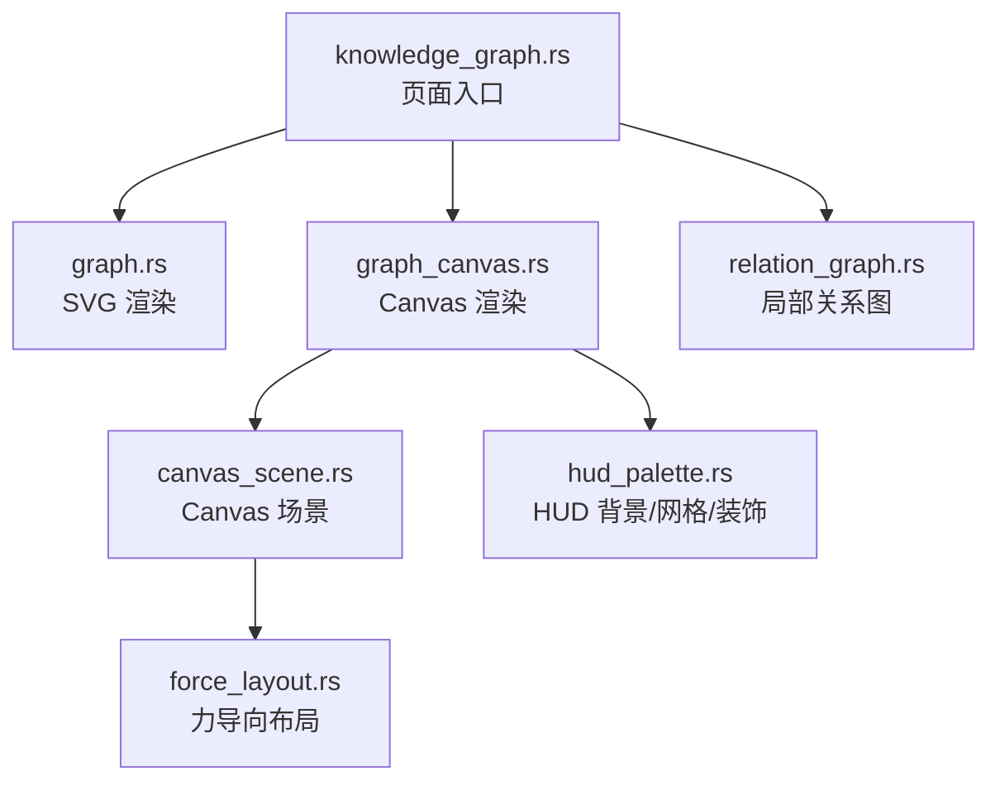
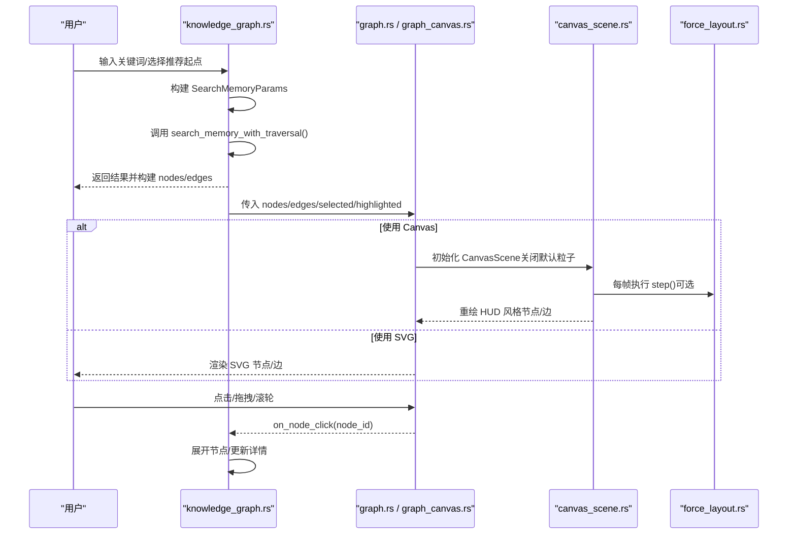
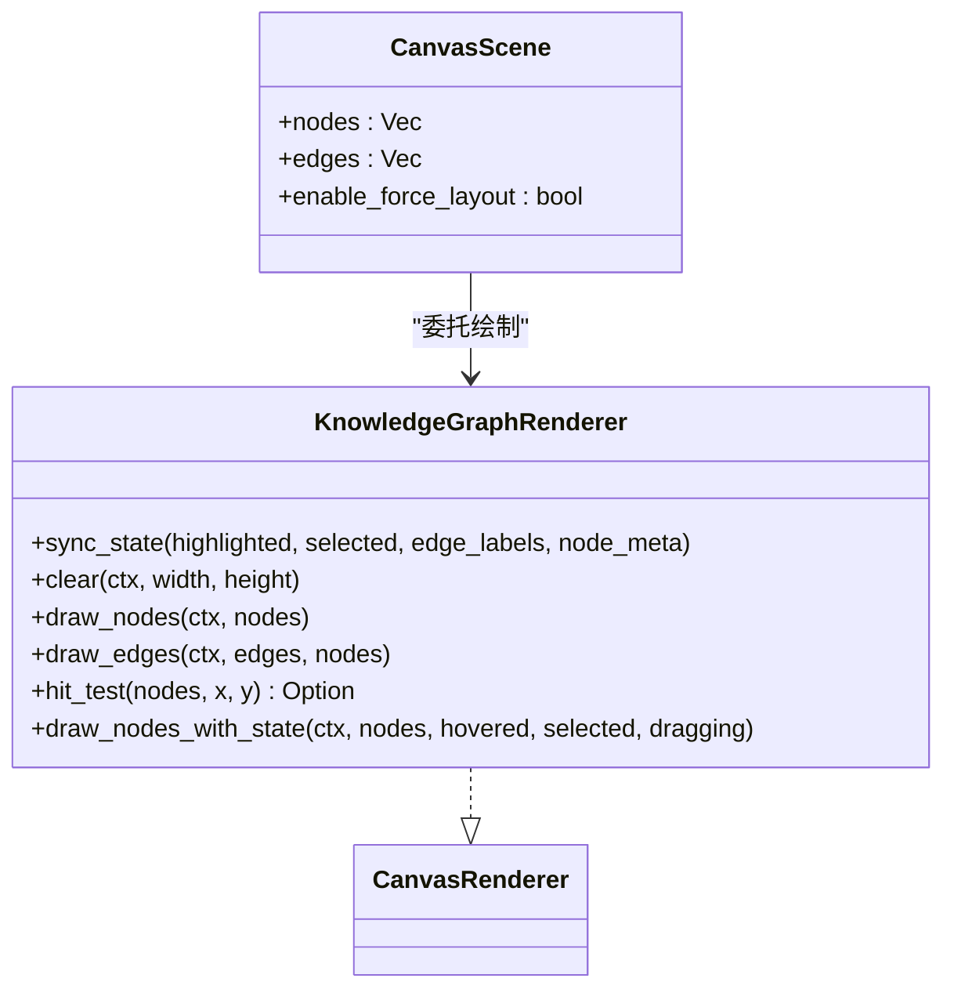
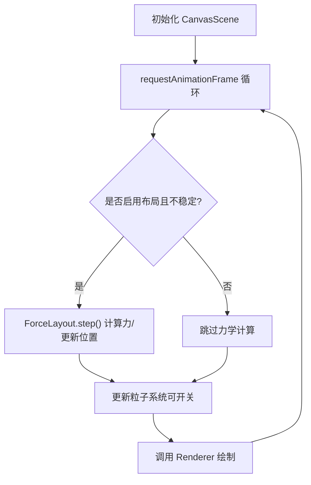
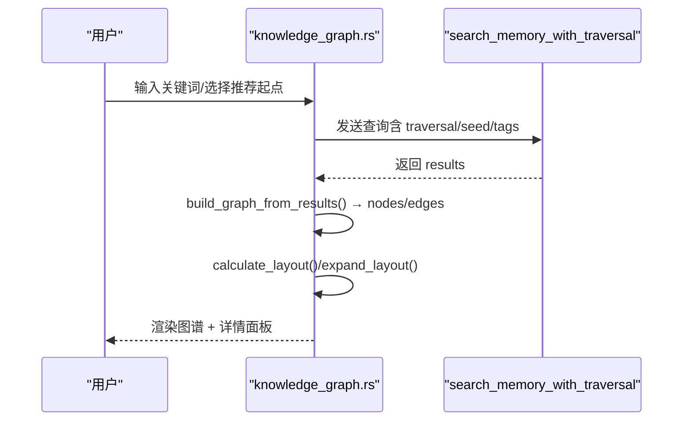
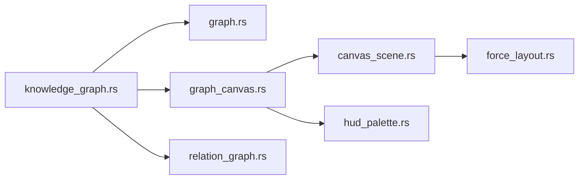

# 知识图谱可视化

<cite>
**本文引用的文件**
- [frontend/src/components/graph.rs](frontend/src/components/graph.rs)
- [frontend/src/components/graph_canvas.rs](frontend/src/components/graph_canvas.rs)
- [frontend/src/components/canvas_scene.rs](frontend/src/components/canvas_scene.rs)
- [frontend/src/components/force_layout.rs](frontend/src/components/force_layout.rs)
- [frontend/src/components/hud_palette.rs](frontend/src/components/hud_palette.rs)
- [frontend/src/pages/hr/knowledge_graph.rs](frontend/src/pages/hr/knowledge_graph.rs)
- [frontend/src/components/relation_graph.rs](frontend/src/components/relation_graph.rs)
- [docs/superpowers/plans/2026-07-13-search-and-knowledge-graph.md](docs/superpowers/plans/2026-07-13-search-and-knowledge-graph.md)
- [docs/superpowers/plans/2026-07-15-knowledge-graph-enhancement.md](docs/superpowers/plans/2026-07-15-knowledge-graph-enhancement.md)
- [docs/superpowers/plans/2026-07-24-canvas-dynamic-rendering.md](docs/superpowers/plans/2026-07-24-canvas-dynamic-rendering.md)

### 本文关联的三类文档（四类互引闭环）

**① 设计文档（Design）**：
- [Canvas 渲染与可视化手册](docs/archive/design-archive/canvas_rendering_playbook.md) — HUD 风格 Canvas 渲染、图表与知识图谱可视化规范

**② 落地计划（Plan）**：
- [知识图谱推荐起点与组件复用重构](docs/archive/plan-archive/知识图谱推荐起点与组件复用重构.md) — 知识图谱推荐起点与 Canvas 组件复用重构
- [统计图表Phase1基础设施与时序图展示重构](docs/archive/plan-archive/统计图表Phase1基础设施与时序图展示重构.md) — 图表组件落地点与前后端对接

**④ RAG 原子知识卡**：
- [Canvas HUD 可视化 RAG 卡](docs/wiki/knowledge/zh/Canvas%20HUD%20%E5%8F%AF%E8%A7%86%E5%8C%96%EF%BC%9AGraphCanvas%20%E7%9F%A5%E8%AF%86%E5%9B%BE%E8%B0%B1%20+%20%E5%9B%BE%E8%A1%A8%E5%9C%BA%E6%99%AFLineDonut%20+%20%E4%BB%AA%E8%A1%A8%E7%9B%98Gauge%E5%8F%8C%E7%89%88%20+%20HudPalette%E6%A9%99%E5%85%89%E5%85%89%E6%99%95/Canvas%20HUD%20%E5%8F%AF%E8%A7%86%E5%8C%96%EF%BC%9AGraphCanvas%20%E7%9F%A5%E8%AF%86%E5%9B%BE%E8%B0%B1%20+%20%E5%9B%BE%E8%A1%A8%E5%9C%BA%E6%99%AFLineDonut%20+%20%E4%BB%AA%E8%A1%A8%E7%9B%98Gauge%E5%8F%8C%E7%89%88%20+%20HudPalette%E6%A9%99%E5%85%89%E5%85%89%E6%99%95.md) — GraphCanvas + Line/Donut + Gauge 仪表盘速查
</cite>

## 目录
1. [简介](#简介)
2. [项目结构](#项目结构)
3. [核心组件](#核心组件)
4. [架构总览](#架构总览)
5. [详细组件分析](#详细组件分析)
6. [依赖关系分析](#依赖关系分析)
7. [性能与大图渲染](#性能与大图渲染)
8. [交互操作指南](#交互操作指南)
9. [数据导入导出与缓存策略](#数据导入导出与缓存策略)
10. [图谱分析能力](#图谱分析能力)
11. [样式定制与主题切换](#样式定制与主题切换)
12. [故障排查](#故障排查)
13. [结论](#结论)

## 简介
本章节面向“知识图谱可视化”功能，系统性说明渲染引擎、节点布局算法、边连接绘制、交互操作（缩放平移、拖拽、连线创建、批量选择与框选）、数据导入导出、缓存与性能优化、大图渲染方案，以及高级分析能力（路径查找、社区发现、中心性计算）和样式定制与响应式适配。文档严格基于仓库中前端 Dioxus + Canvas/SVG 实现与相关设计计划进行梳理。

## 项目结构
知识图谱可视化由页面入口、渲染组件、布局算法、HUD 风格工具等模块组成：
- 页面入口：hr/knowledge_graph.rs 负责搜索、推荐起点、节点展开、详情面板与视图切换
- SVG 渲染：graph.rs 提供轻量级 SVG 渲染、标签与多色边框、基础布局函数
- Canvas 渲染：graph_canvas.rs 实现 HUD 驾驶舱风格的 Canvas 渲染器，复用 graph.rs 的视觉语义
- Canvas 基础设施：canvas_scene.rs 提供场景循环、力导向、事件桥接、粒子系统开关
- 布局算法：force_layout.rs 提供斥力/引力/阻尼/边界/分层约束的纯函数实现
- HUD 工具：hud_palette.rs 提供背景、网格、四角装饰等统一视觉元素
- 关系图：relation_graph.rs 用于局部关系展示（中心+关联实体）

**图表来源**
- [frontend/src/pages/hr/knowledge_graph.rs:114-759](frontend/src/pages/hr/knowledge_graph.rs#L114-L759)
- [frontend/src/components/graph.rs:201-751](frontend/src/components/graph.rs#L201-L751)
- [frontend/src/components/graph_canvas.rs:48-526](frontend/src/components/graph_canvas.rs#L48-L526)
- [frontend/src/components/canvas_scene.rs:21-579](frontend/src/components/canvas_scene.rs#L21-L579)
- [frontend/src/components/force_layout.rs:11-324](frontend/src/components/force_layout.rs#L11-L324)
- [frontend/src/components/hud_palette.rs:1-123](frontend/src/components/hud_palette.rs#L1-L123)
- [frontend/src/components/relation_graph.rs:80-124](frontend/src/components/relation_graph.rs#L80-L124)

**章节来源**
- [frontend/src/pages/hr/knowledge_graph.rs:114-759](frontend/src/pages/hr/knowledge_graph.rs#L114-L759)
- [frontend/src/components/graph.rs:201-751](frontend/src/components/graph.rs#L201-L751)
- [frontend/src/components/graph_canvas.rs:48-526](frontend/src/components/graph_canvas.rs#L48-L526)
- [frontend/src/components/canvas_scene.rs:21-579](frontend/src/components/canvas_scene.rs#L21-L579)
- [frontend/src/components/force_layout.rs:11-324](frontend/src/components/force_layout.rs#L11-L324)
- [frontend/src/components/hud_palette.rs:1-123](frontend/src/components/hud_palette.rs#L1-L123)
- [frontend/src/components/relation_graph.rs:80-124](frontend/src/components/relation_graph.rs#L80-L124)

## 核心组件
- Graph（SVG）：节点/边渲染、标签与多色边框、选中高亮、呼吸光晕、缩放平移、拖拽、重置视图、圆形/辐射布局
- KnowledgeGraphCanvas（Canvas）：HUD 风格渲染、流光边、扫描环、旋转刻度环、tag 标签、summary 摘要、外部状态同步
- CanvasScene：requestAnimationFrame 渲染循环、力导向步进、粒子系统（可开关）、事件桥接（命中检测、拖拽、点击）
- ForceLayout：斥力/引力/阻尼/边界/分层约束；稳定检测；圆形初始布局
- HUD 工具：深色背景、径向光晕、网格、四角刻度
- 页面入口：搜索、推荐起点、节点展开、详情面板、风格切换、错误提示

**章节来源**
- [frontend/src/components/graph.rs:201-751](frontend/src/components/graph.rs#L201-L751)
- [frontend/src/components/graph_canvas.rs:48-526](frontend/src/components/graph_canvas.rs#L48-L526)
- [frontend/src/components/canvas_scene.rs:21-579](frontend/src/components/canvas_scene.rs#L21-L579)
- [frontend/src/components/force_layout.rs:11-324](frontend/src/components/force_layout.rs#L11-L324)
- [frontend/src/components/hud_palette.rs:1-123](frontend/src/components/hud_palette.rs#L1-L123)
- [frontend/src/pages/hr/knowledge_graph.rs:114-759](frontend/src/pages/hr/knowledge_graph.rs#L114-L759)

## 架构总览
知识图谱采用“页面控制 + 双渲染后端（SVG/Canvas）+ 通用布局算法”的分层架构：
- 页面层：聚合搜索、推荐、展开、详情、视图切换
- 渲染层：SVG 用于轻量场景；Canvas 用于高性能 HUD 风格
- 布局层：圆形/辐射布局用于快速定位；力导向用于自动排布
- 工具层：HUD 背景/网格/装饰统一视觉风格

**图表来源**
- [frontend/src/pages/hr/knowledge_graph.rs:163-325](frontend/src/pages/hr/knowledge_graph.rs#L163-L325)
- [frontend/src/components/graph_canvas.rs:448-526](frontend/src/components/graph_canvas.rs#L448-L526)
- [frontend/src/components/canvas_scene.rs:350-489](frontend/src/components/canvas_scene.rs#L350-L489)
- [frontend/src/components/force_layout.rs:75-177](frontend/src/components/force_layout.rs#L75-L177)

## 详细组件分析

### SVG 渲染组件 Graph
- 节点模型：id、label、node_type、x/y、tags、summary
- 边模型：source、target、label（关系类型）
- 视觉：
  - 节点填充色按类型区分；选中态橙色描边；未选中态呼吸光晕
  - 多色 tag 边框弧段；节点上方横向 tag 标签；下方一行摘要
  - 边颜色/虚线/流光根据关系类型；边标签居中显示
- 交互：
  - 节点拖拽（mousedown/mousemove/mouseup），区分点击与拖拽
  - 画布缩放（滚轮）和平移（按住左键拖动）
  - 选中节点高亮；支持 highlighted_node_ids 高亮集合
  - 右上角“重置视图”按钮恢复初始变换
- 布局：
  - calculate_layout：无中心节点时圆形布局；有中心节点时将其置于正中，其余围绕分布
  - expand_layout：在已有布局基础上围绕指定中心新增节点

**图表来源**
- [frontend/src/components/graph.rs:201-659](frontend/src/components/graph.rs#L201-L659)

**章节来源**
- [frontend/src/components/graph.rs:5-176](frontend/src/components/graph.rs#L5-L176)
- [frontend/src/components/graph.rs:201-659](frontend/src/components/graph.rs#L201-L659)
- [frontend/src/components/graph.rs:661-751](frontend/src/components/graph.rs#L661-L751)

### Canvas 渲染组件 KnowledgeGraphCanvas
- 复用 GraphNode/GraphEdge 数据结构，转换为 CanvasNode/CanvasEdge
- 自定义 KnowledgeGraphRenderer：
  - HUD 背景（深色径向渐变+网格+四角）
  - 边：实线流光（lineDashOffset 动画）、虚线静态；选中节点关联边加速
  - 节点：选中态扫描环+旋转刻度环；未选中态呼吸光晕；多色 tag 边框；摘要与 tag 标签
- 通过 sync_state 将外部 selected/highlighted/edge_labels/node_meta 同步到渲染器
- 关闭 CanvasScene 默认粒子，避免视觉过载

**图表来源**
- [frontend/src/components/graph_canvas.rs:48-426](frontend/src/components/graph_canvas.rs#L48-L426)
- [frontend/src/components/canvas_scene.rs:43-74](frontend/src/components/canvas_scene.rs#L43-L74)

**章节来源**
- [frontend/src/components/graph_canvas.rs:48-526](frontend/src/components/graph_canvas.rs#L48-L526)

### Canvas 场景与力导向布局
- CanvasScene：
  - requestAnimationFrame 驱动渲染循环
  - 力导向步进（可开关），稳定检测后减少计算
  - 事件桥：鼠标坐标转换→命中检测→拖拽/点击回调
  - 粒子系统：数据流、辉光、背景、诞生/消亡（可独立开关）
- ForceLayout：
  - 斥力（库仑力，反比于距离平方）
  - 吸引力（胡克定律，正比于位移）
  - 阻尼（速度衰减）
  - 边界约束（不超出画布）
  - 分层约束（y 方向拉向目标层）
  - 圆形初始布局

**图表来源**
- [frontend/src/components/canvas_scene.rs:350-489](frontend/src/components/canvas_scene.rs#L350-L489)
- [frontend/src/components/force_layout.rs:75-177](frontend/src/components/force_layout.rs#L75-L177)

**章节来源**
- [frontend/src/components/canvas_scene.rs:21-579](frontend/src/components/canvas_scene.rs#L21-L579)
- [frontend/src/components/force_layout.rs:11-324](frontend/src/components/force_layout.rs#L11-L324)

### 页面入口与数据流
- 搜索：构造 SearchMemoryParams（query/tags/traversal/seed_node_ids/agent_id），调用 search_memory_with_traversal
- 推荐起点：加载 Top 度数节点作为入口
- 节点展开：以 clicked node 为 seed，增量获取关联节点，expand_layout 追加到现有布局
- 详情面板：展示类型、分数、内容、摘要、标签、关系元信息
- 视图切换：Canvas（HUD）/ SVG 两种渲染模式

**图表来源**
- [frontend/src/pages/hr/knowledge_graph.rs:163-325](frontend/src/pages/hr/knowledge_graph.rs#L163-L325)
- [frontend/src/pages/hr/knowledge_graph.rs:25-88](frontend/src/pages/hr/knowledge_graph.rs#L25-L88)

**章节来源**
- [frontend/src/pages/hr/knowledge_graph.rs:114-759](frontend/src/pages/hr/knowledge_graph.rs#L114-L759)

## 依赖关系分析
- knowledge_graph.rs 依赖 graph.rs（布局/渲染）、graph_canvas.rs（Canvas 渲染）、api::hr（搜索/推荐）
- graph_canvas.rs 依赖 canvas_scene.rs（场景/事件/布局）、graph.rs（视觉语义）
- canvas_scene.rs 依赖 force_layout.rs（布局）、particles（粒子）
- relation_graph.rs 复用 CanvasNode/CanvasEdge 构建局部关系图

**图表来源**
- [frontend/src/pages/hr/knowledge_graph.rs:1-15](frontend/src/pages/hr/knowledge_graph.rs#L1-L15)
- [frontend/src/components/graph_canvas.rs:20-23](frontend/src/components/graph_canvas.rs#L20-L23)
- [frontend/src/components/canvas_scene.rs:16-19](frontend/src/components/canvas_scene.rs#L16-L19)

**章节来源**
- [frontend/src/pages/hr/knowledge_graph.rs:1-15](frontend/src/pages/hr/knowledge_graph.rs#L1-L15)
- [frontend/src/components/graph_canvas.rs:20-23](frontend/src/components/graph_canvas.rs#L20-L23)
- [frontend/src/components/canvas_scene.rs:16-19](frontend/src/components/canvas_scene.rs#L16-L19)

## 性能与大图渲染
- 渲染模式选择：
  - SVG：适合少量节点、简单交互
  - Canvas：适合大规模节点，HUD 风格，关闭多余粒子降低开销
- 力导向优化：
  - 稳定检测：当总位移低于阈值停止计算，减少 CPU 占用
  - 分层约束：对带 layer 的节点施加 y 方向拉力，改善层次化布局
- 事件与命中检测：
  - CanvasScene 使用 hit_test 圆碰撞检测，O(n) 但足够高效
  - 拖拽时禁用布局或标记不稳定，避免抖动
- 粒子系统：
  - 可按需关闭数据流/辉光/背景/诞生消亡粒子，显著降低渲染压力
- 高清屏适配：
  - 根据 devicePixelRatio 设置 canvas 物理尺寸与缩放，保证清晰度

**章节来源**
- [frontend/src/components/canvas_scene.rs:350-489](frontend/src/components/canvas_scene.rs#L350-L489)
- [frontend/src/components/force_layout.rs:75-177](frontend/src/components/force_layout.rs#L75-L177)
- [frontend/src/components/graph_canvas.rs:507-526](frontend/src/components/graph_canvas.rs#L507-L526)

## 交互操作指南
- 缩放与平移（SVG）：
  - 滚轮缩放（限制范围 0.5x~2.0x）
  - 按住左键拖动平移画布
  - “重置视图”恢复初始变换
- 节点拖拽（SVG/Canvas）：
  - mousedown 开始拖拽，mousemove 更新位置，mouseup 结束
  - 区分点击与拖拽（移动超过阈值视为拖拽）
  - Canvas 模式下拖拽会触发辉光效果
- 连线创建：
  - 当前实现以“点击节点展开关联”为主，非自由连线创建
  - 如需自由连线，可在页面层增加连线模式并在 CanvasScene 中扩展事件处理
- 批量选择与框选：
  - 当前未实现框选；可通过扩展 CanvasScene 的 onmousedown/onmousemove/onmouseup 实现矩形选择逻辑
  - 批量高亮可使用 highlighted_node_ids 传入多个 ID

**章节来源**
- [frontend/src/components/graph.rs:257-352](frontend/src/components/graph.rs#L257-L352)
- [frontend/src/components/canvas_scene.rs:506-575](frontend/src/components/canvas_scene.rs#L506-L575)

## 数据导入导出与缓存策略
- 数据导入：
  - 通过 search_memory_with_traversal 获取搜索结果，build_graph_from_results 构建 nodes/edges
  - 支持 tags 过滤、traversal_depth/breadth/strategy、seed_node_ids、agent_id
- 数据导出：
  - 当前未见显式导出接口；可在页面层序列化 nodes/edges 为 JSON 供下载
- 缓存策略：
  - detail_map 限制最大条目数（如 >200 清理），防止无限增长
  - expanded_nodes 记录已展开节点，避免重复请求
  - click_request_id 用于丢弃过期并发请求结果，保证 UI 一致性

**章节来源**
- [frontend/src/pages/hr/knowledge_graph.rs:183-325](frontend/src/pages/hr/knowledge_graph.rs#L183-L325)

## 图谱分析能力
- 路径查找：
  - 当前未实现显式路径查找；可通过 traversal 参数逐步探索邻接节点，结合前端状态模拟路径回溯
- 社区发现：
  - 当前未实现社区划分算法；可基于边权重/关系类型在后端或前端聚类
- 中心性计算：
  - 推荐起点包含 degree/incoming_count/outgoing_count，可作为中心性指标参考
  - 可在页面层统计节点度数，辅助排序与筛选

**章节来源**
- [frontend/src/pages/hr/knowledge_graph.rs:141-161](frontend/src/pages/hr/knowledge_graph.rs#L141-L161)

## 样式定制与主题切换
- 节点样式：
  - 类型色板：knowledge_node/short_term/trace/relation 等
  - 动态半径：基于 tags 数量、摘要、名称长度调整
  - 选中态：橙色描边+扫描环；未选中态：呼吸光晕
- 边样式：
  - 关系类型决定颜色与虚实线；实线边流光，虚线边静态
  - 边标签背景框提高可读性
- HUD 主题：
  - 深色背景+径向光晕+网格+四角刻度，统一驾驶舱风格
- 响应式适配：
  - Canvas 根据 devicePixelRatio 调整物理尺寸
  - SVG 使用固定 viewBox，配合 CSS 缩放

**章节来源**
- [frontend/src/components/graph.rs:48-176](frontend/src/components/graph.rs#L48-L176)
- [frontend/src/components/graph_canvas.rs:96-426](frontend/src/components/graph_canvas.rs#L96-L426)
- [frontend/src/components/hud_palette.rs:37-123](frontend/src/components/hud_palette.rs#L37-L123)

## 故障排查
- 节点拖拽错乱：
  - 确保节点 mousedown 阻止冒泡，避免同时触发画布平移
- 点击误判为拖拽：
  - 使用 drag_moved 阈值判断，松开时若未移动则视为点击
- 并发请求覆盖：
  - 使用 click_request_id 丢弃旧结果，保证最新点击生效
- 内存泄漏：
  - 限制 detail_map 大小，及时清理无效条目
- 渲染卡顿：
  - 关闭不必要的粒子系统；启用稳定检测；减少力导向步长

**章节来源**
- [frontend/src/components/graph.rs:257-352](frontend/src/components/graph.rs#L257-L352)
- [frontend/src/pages/hr/knowledge_graph.rs:241-325](frontend/src/pages/hr/knowledge_graph.rs#L241-L325)

## 结论
该知识图谱可视化方案以“页面控制 + 双渲染后端 + 通用布局算法”为核心，兼顾易用性与性能。SVG 版本适合轻量场景，Canvas 版本提供 HUD 风格与高性能渲染。通过力导向、标签/摘要、关系类型差异化、粒子系统等特性，实现了丰富的交互与视觉效果。未来可扩展自由连线、框选、路径查找、社区发现与中心性计算等高级能力，进一步提升图谱分析与探索体验。