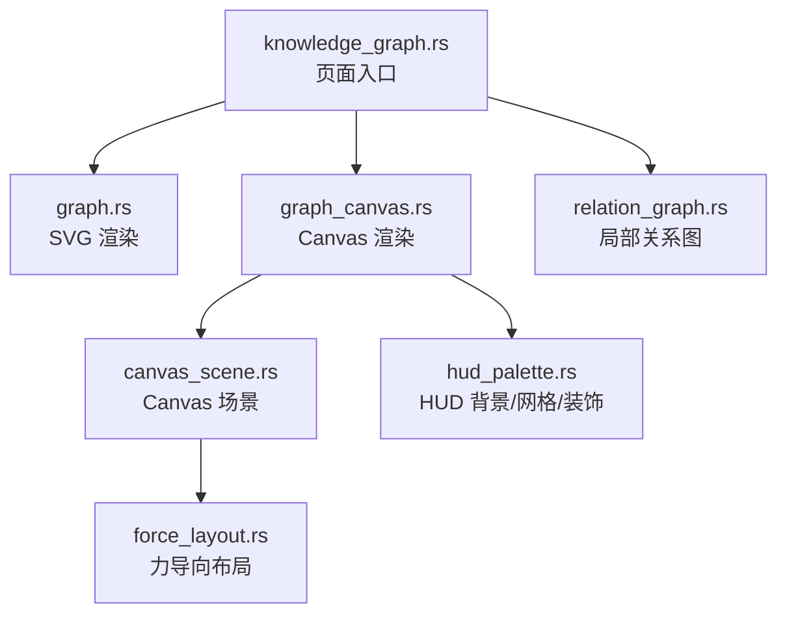
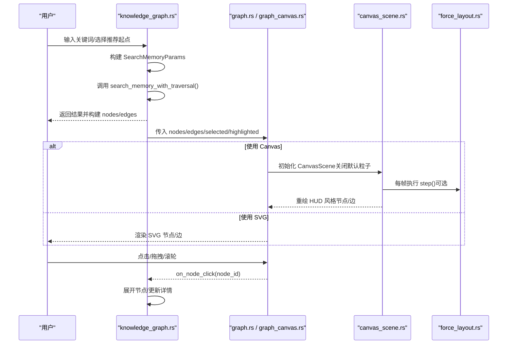
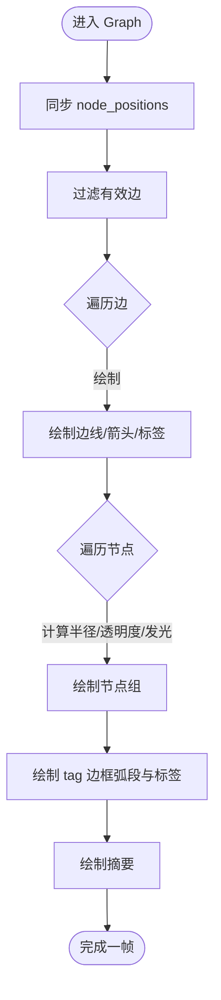
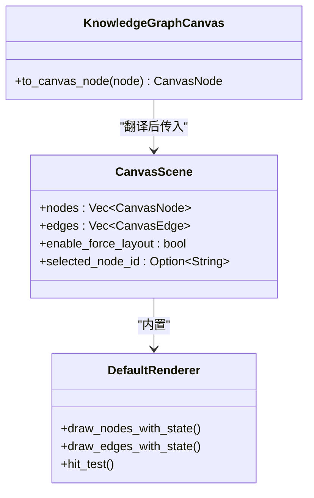
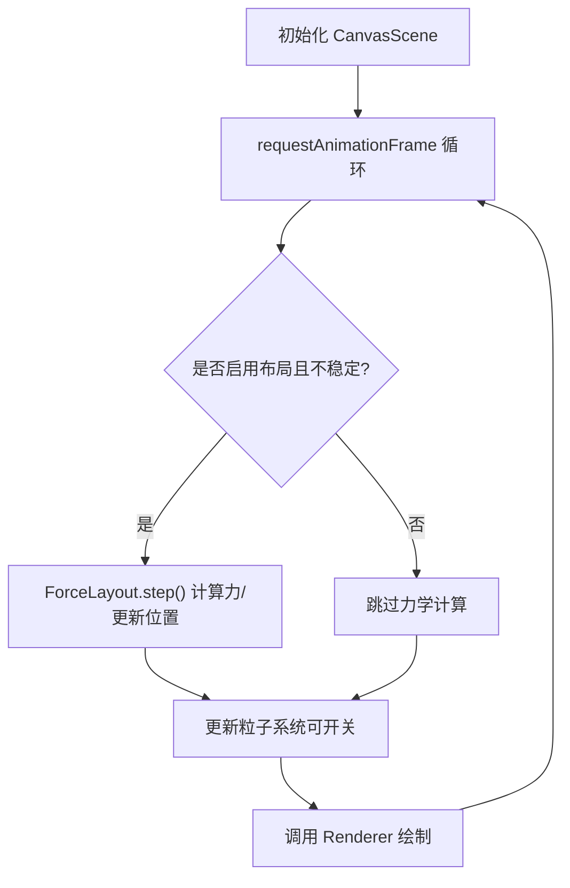
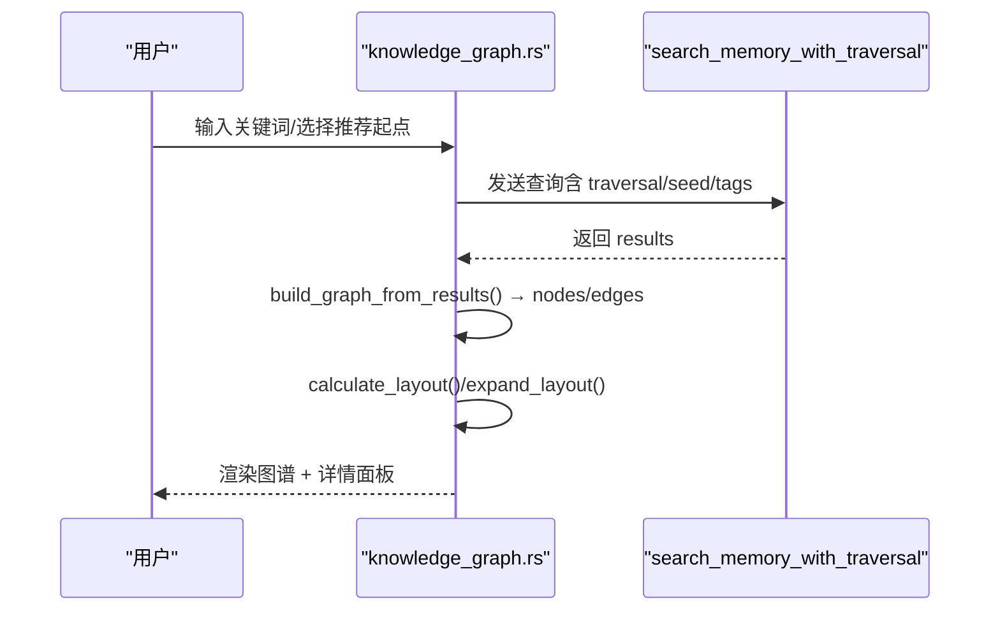
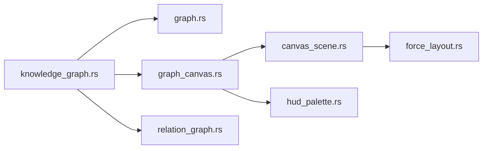

# 知识图谱可视化

<cite>
**本文引用的文件**
- [frontend/src/components/graph.rs](frontend/src/components/graph.rs)
- [frontend/src/components/graph_canvas.rs](frontend/src/components/graph_canvas.rs)
- [frontend/src/components/canvas_scene.rs](frontend/src/components/canvas_scene.rs)
- [frontend/src/components/force_layout.rs](frontend/src/components/force_layout.rs)
- [frontend/src/components/hud_palette.rs](frontend/src/components/hud_palette.rs)
- [frontend/src/pages/hr/knowledge_graph.rs](frontend/src/pages/hr/knowledge_graph.rs)
- [frontend/src/components/relation_graph.rs](frontend/src/components/relation_graph.rs)
- （2026-09-04 清理：superpowers 目录已归档，待 doc-maintainer 跟进）
- （2026-09-04 清理：superpowers 目录已归档，待 doc-maintainer 跟进）
- （2026-09-04 清理：superpowers 目录已归档，待 doc-maintainer 跟进）

### 本文关联的三类文档（四类互引闭环）

**① 设计文档（Design）**：
- [Canvas 渲染与可视化手册](docs/archive/design-archive/canvas_rendering_playbook.md) — HUD 风格 Canvas 渲染、图表与知识图谱可视化规范

**② 落地计划（Plan）**：
- [知识图谱推荐起点与组件复用重构](docs/archive/plan-archive/知识图谱推荐起点与组件复用重构.md) — 知识图谱推荐起点与 Canvas 组件复用重构
- [统计图表Phase1基础设施与时序图展示重构](docs/archive/plan-archive/统计图表Phase1基础设施与时序图展示重构.md) — 图表组件落地点与前后端对接

**④ RAG 原子知识卡**：
- [Canvas HUD 可视化 RAG 卡](docs/wiki/knowledge/zh/Canvas%20HUD%20%E5%8F%AF%E8%A7%86%E5%8C%96%EF%BC%9AGraphCanvas%20%E7%9F%A5%E8%AF%86%E5%9B%BE%E8%B0%B1%20+%20%E5%9B%BE%E8%A1%A8%E5%9C%BA%E6%99%AFLineDonut%20+%20%E4%BB%AA%E8%A1%A8%E7%9B%98Gauge%E5%8F%8C%E7%89%88%20+%20HudPalette%E6%A9%99%E5%85%89%E5%85%89%E6%99%95/Canvas%20HUD%20%E5%8F%AF%E8%A7%86%E5%8C%96%EF%BC%9AGraphCanvas%20%E7%9F%A5%E8%AF%86%E5%9B%BE%E8%B0%B1%20+%20%E5%9B%BE%E8%A1%A8%E5%9C%BA%E6%99%AFLineDonut%20+%20%E4%BB%AA%E8%A1%A8%E7%9B%98Gauge%E5%8F%8C%E7%89%88%20+%20HudPalette%E6%A9%99%E5%85%89%E5%85%89%E6%99%95.md) — GraphCanvas + Line/Donut + Gauge 仪表盘速查
</cite>

## 目录
1. [简介](#简介)
2. [项目结构](#项目结构)
3. [核心组件](#核心组件)
4. [架构总览](#架构总览)
5. [详细组件分析](#详细组件分析)
6. [依赖关系分析](#依赖关系分析)
7. [性能与大图渲染](#性能与大图渲染)
8. [交互操作指南](#交互操作指南)
9. [数据导入导出与缓存策略](#数据导入导出与缓存策略)
10. [图谱分析能力](#图谱分析能力)
11. [样式定制与主题切换](#样式定制与主题切换)
12. [故障排查](#故障排查)
13. [结论](#结论)

## 简介
本章节面向“知识图谱可视化”功能，系统性说明渲染引擎、节点布局算法、边连接绘制、交互操作（缩放平移、拖拽、连线创建、批量选择与框选）、数据导入导出、缓存与性能优化、大图渲染方案，以及高级分析能力（路径查找、社区发现、中心性计算）和样式定制与响应式适配。文档严格基于仓库中前端 Dioxus + Canvas/SVG 实现与相关设计计划进行梳理。

## 项目结构
知识图谱可视化由页面入口、渲染组件、布局算法、HUD 风格工具等模块组成：
- 页面入口：hr/knowledge_graph.rs 负责搜索、推荐起点、节点展开、详情面板与视图切换
- SVG 渲染：graph.rs 提供轻量级 SVG 渲染、标签与多色边框、基础布局函数
- Canvas 渲染：graph_canvas.rs 实现 HUD 驾驶舱风格的 Canvas 渲染器，复用 graph.rs 的视觉语义
- Canvas 基础设施：canvas_scene.rs 提供场景循环、力导向、事件桥接、粒子系统开关
- 布局算法：force_layout.rs 提供斥力/引力/阻尼/边界/分层约束的纯函数实现
- HUD 工具：hud_palette.rs 提供背景、网格、四角装饰等统一视觉元素
- 关系图：relation_graph.rs 用于局部关系展示（中心+关联实体）

**图表来源**
- [frontend/src/pages/hr/knowledge_graph.rs:114-759](frontend/src/pages/hr/knowledge_graph.rs#L114-L759)
- [frontend/src/components/graph.rs:201-751](frontend/src/components/graph.rs#L201-L751)
- [frontend/src/components/graph_canvas.rs:48-526](frontend/src/components/graph_canvas.rs#L48-L526)
- [frontend/src/components/canvas_scene.rs:21-579](frontend/src/components/canvas_scene.rs#L21-L579)
- [frontend/src/components/force_layout.rs:11-324](frontend/src/components/force_layout.rs#L11-L324)
- [frontend/src/components/hud_palette.rs:1-123](frontend/src/components/hud_palette.rs#L1-L123)
- [frontend/src/components/relation_graph.rs:80-124](frontend/src/components/relation_graph.rs#L80-L124)

**章节来源**
- [frontend/src/pages/hr/knowledge_graph.rs:114-759](frontend/src/pages/hr/knowledge_graph.rs#L114-L759)
- [frontend/src/components/graph.rs:201-751](frontend/src/components/graph.rs#L201-L751)
- [frontend/src/components/graph_canvas.rs:48-526](frontend/src/components/graph_canvas.rs#L48-L526)
- [frontend/src/components/canvas_scene.rs:21-579](frontend/src/components/canvas_scene.rs#L21-L579)
- [frontend/src/components/force_layout.rs:11-324](frontend/src/components/force_layout.rs#L11-L324)
- [frontend/src/components/hud_palette.rs:1-123](frontend/src/components/hud_palette.rs#L1-L123)
- [frontend/src/components/relation_graph.rs:80-124](frontend/src/components/relation_graph.rs#L80-L124)

## 核心组件
- Graph（SVG）：节点/边渲染、标签与多色边框、选中高亮、呼吸光晕、缩放平移、拖拽、重置视图、圆形/辐射布局
- KnowledgeGraphCanvas（Canvas）：HUD 风格渲染、流光边、扫描环、旋转刻度环、tag 标签、summary 摘要、外部状态同步
- CanvasScene：requestAnimationFrame 渲染循环、力导向步进、粒子系统（可开关）、事件桥接（命中检测、拖拽、点击）
- ForceLayout：斥力/引力/阻尼/边界/分层约束；稳定检测；圆形初始布局
- HUD 工具：深色背景、径向光晕、网格、四角刻度
- 页面入口：搜索、推荐起点、节点展开、详情面板、风格切换、错误提示

**章节来源**
- [frontend/src/components/graph.rs:201-751](frontend/src/components/graph.rs#L201-L751)
- [frontend/src/components/graph_canvas.rs:48-526](frontend/src/components/graph_canvas.rs#L48-L526)
- [frontend/src/components/canvas_scene.rs:21-579](frontend/src/components/canvas_scene.rs#L21-L579)
- [frontend/src/components/force_layout.rs:11-324](frontend/src/components/force_layout.rs#L11-L324)
- [frontend/src/components/hud_palette.rs:1-123](frontend/src/components/hud_palette.rs#L1-L123)
- [frontend/src/pages/hr/knowledge_graph.rs:114-759](frontend/src/pages/hr/knowledge_graph.rs#L114-L759)

## 架构总览
知识图谱采用“页面控制 + 双渲染后端（SVG/Canvas）+ 通用布局算法”的分层架构：
- 页面层：聚合搜索、推荐、展开、详情、视图切换
- 渲染层：SVG 用于轻量场景；Canvas 用于高性能 HUD 风格
- 布局层：圆形/辐射布局用于快速定位；力导向用于自动排布
- 工具层：HUD 背景/网格/装饰统一视觉风格

**图表来源**
- [frontend/src/pages/hr/knowledge_graph.rs:163-325](frontend/src/pages/hr/knowledge_graph.rs#L163-L325)
- [frontend/src/components/graph_canvas.rs:448-526](frontend/src/components/graph_canvas.rs#L448-L526)
- [frontend/src/components/canvas_scene.rs:350-489](frontend/src/components/canvas_scene.rs#L350-L489)
- [frontend/src/components/force_layout.rs:75-177](frontend/src/components/force_layout.rs#L75-L177)

## 详细组件分析

### SVG 渲染组件 Graph
- 节点模型：id、label（展示名：名称优先，回退正文首行）、description（正文，hover 详情用）、node_type、x/y、tags、summary
- 边模型：source、target、label（关系类型）
- 视觉：
  - 节点为**矩形信息卡**：左侧类型色竖条 + 名称 + 摘要/描述两行 + 底部标签胶囊（最多 3 个 + 聚合 `+N`）
  - 选中态橙色描边 + 外扩扫描框；未选中态类型色呼吸框
  - 边颜色/虚线/流光根据关系类型；边标签居中显示
- 交互：
  - 节点拖拽（mousedown/mousemove/mouseup），区分点击与拖拽
  - 画布缩放（滚轮）和平移（按住左键拖动）
  - 选中节点高亮；支持 highlighted_node_ids 高亮集合
  - 右上角“重置视图”按钮恢复初始变换
- 布局：
  - calculate_layout：无中心节点时圆形布局；有中心节点时将其置于正中，其余围绕分布
  - expand_layout：在已有布局基础上围绕指定中心新增节点

**图表来源**
- [frontend/src/components/graph.rs:201-659](frontend/src/components/graph.rs#L201-L659)

**章节来源**
- [frontend/src/components/graph.rs:5-176](frontend/src/components/graph.rs#L5-L176)
- [frontend/src/components/graph.rs:201-659](frontend/src/components/graph.rs#L201-L659)
- [frontend/src/components/graph.rs:661-751](frontend/src/components/graph.rs#L661-L751)

### Canvas 渲染组件 KnowledgeGraphCanvas

**2026-09-17 收敛：它现在只是一层「数据翻译」适配层，不再自带渲染器。**

- 唯一职责：`GraphNode` / `GraphEdge` → `CanvasNode` / `CanvasEdge`
- 卡片尺寸在此算一次并写进 `CanvasNode.radius`（= 卡片外接圆半径）：力导向的
  碰撞避让按 `radius` 算最小中心距，填成小圆半径时 168px 宽的卡片照样互压
- 渲染 / 力导向 / 粒子 / hover 详情 / 拖拽全部复用 `CanvasScene` 的
  `DefaultRenderer`，接线与 Agent 关系图（`relation_graph.rs`）逐项对齐
- 边的关系类型进 `CanvasEdge.tag`：既是边着色依据，也是 hover 详情卡的首行
- 无正文的端点节点自动退化为圆形小点（`CanvasNode::is_card` 判定），不硬撑空卡片

⚠️ **曾经的坑**：这里原有 400+ 行 `KnowledgeGraphRenderer`（自定义 HUD 渲染器），
但 `CanvasScene` 内部硬编码 `let renderer = DefaultRenderer`，**它从未被执行**；
实际产物是「圆圈 + 圆下完整 ID」，也就是「只显示『知识节点』和它的 id」的直接来源。
教训：凡「实现了但没接线」的代码等价于不存在，还会让后来者据注释误判现状。

**章节来源**
- [frontend/src/components/graph_canvas.rs](frontend/src/components/graph_canvas.rs)（纯适配层）
- [frontend/src/components/canvas_scene.rs](frontend/src/components/canvas_scene.rs)（CanvasScene + DefaultRenderer）

### Canvas 场景与力导向布局
- CanvasScene：
  - requestAnimationFrame 驱动渲染循环
  - 力导向步进（可开关），稳定检测后减少计算
  - 事件桥：鼠标坐标转换→命中检测→拖拽/点击回调
  - 粒子系统：数据流、辉光、背景、诞生/消亡（可独立开关）
- ForceLayout：
  - 斥力（库仑力，反比于距离平方）
  - 吸引力（胡克定律，正比于位移）
  - 阻尼（速度衰减）
  - 边界约束（不超出画布）
  - 分层约束（y 方向拉向目标层）
  - 圆形初始布局

**图表来源**
- [frontend/src/components/canvas_scene.rs:350-489](frontend/src/components/canvas_scene.rs#L350-L489)
- [frontend/src/components/force_layout.rs:75-177](frontend/src/components/force_layout.rs#L75-L177)

**章节来源**
- [frontend/src/components/canvas_scene.rs:21-579](frontend/src/components/canvas_scene.rs#L21-L579)
- [frontend/src/components/force_layout.rs:11-324](frontend/src/components/force_layout.rs#L11-L324)

### 页面入口与数据流
- 搜索：构造 SearchMemoryParams（query/tags/traversal/seed_node_ids/agent_id），调用 search_memory_with_traversal
- 推荐起点：加载 Top 度数节点作为入口
- 节点展开：以 clicked node 为 seed，增量获取关联节点，expand_layout 追加到现有布局
- 详情面板：展示类型、分数、内容、摘要、标签、关系元信息
- 视图切换：Canvas（HUD）/ SVG 两种渲染模式

**图表来源**
- [frontend/src/pages/hr/knowledge_graph.rs:163-325](frontend/src/pages/hr/knowledge_graph.rs#L163-L325)
- [frontend/src/pages/hr/knowledge_graph.rs:25-88](frontend/src/pages/hr/knowledge_graph.rs#L25-L88)

**章节来源**
- [frontend/src/pages/hr/knowledge_graph.rs:114-759](frontend/src/pages/hr/knowledge_graph.rs#L114-L759)

## 依赖关系分析
- knowledge_graph.rs 依赖 graph.rs（布局/渲染）、graph_canvas.rs（Canvas 渲染）、api::hr（搜索/推荐）
- graph_canvas.rs 依赖 canvas_scene.rs（场景/事件/布局）、graph.rs（视觉语义）
- canvas_scene.rs 依赖 force_layout.rs（布局）、particles（粒子）
- relation_graph.rs 复用 CanvasNode/CanvasEdge 构建局部关系图

**图表来源**
- [frontend/src/pages/hr/knowledge_graph.rs:1-15](frontend/src/pages/hr/knowledge_graph.rs#L1-L15)
- [frontend/src/components/graph_canvas.rs:20-23](frontend/src/components/graph_canvas.rs#L20-L23)
- [frontend/src/components/canvas_scene.rs:16-19](frontend/src/components/canvas_scene.rs#L16-L19)

**章节来源**
- [frontend/src/pages/hr/knowledge_graph.rs:1-15](frontend/src/pages/hr/knowledge_graph.rs#L1-L15)
- [frontend/src/components/graph_canvas.rs:20-23](frontend/src/components/graph_canvas.rs#L20-L23)
- [frontend/src/components/canvas_scene.rs:16-19](frontend/src/components/canvas_scene.rs#L16-L19)

## 性能与大图渲染
- 渲染模式选择：
  - SVG：适合少量节点、简单交互
  - Canvas：适合大规模节点，HUD 风格，关闭多余粒子降低开销
- 力导向优化：
  - 稳定检测：当总位移低于阈值停止计算，减少 CPU 占用
  - 分层约束：对带 layer 的节点施加 y 方向拉力，改善层次化布局
- 事件与命中检测：
  - CanvasScene 使用 hit_test 圆碰撞检测，O(n) 但足够高效
  - 拖拽时禁用布局或标记不稳定，避免抖动
- 粒子系统：
  - 可按需关闭数据流/辉光/背景/诞生消亡粒子，显著降低渲染压力
- 高清屏适配：
  - 根据 devicePixelRatio 设置 canvas 物理尺寸与缩放，保证清晰度

**章节来源**
- [frontend/src/components/canvas_scene.rs:350-489](frontend/src/components/canvas_scene.rs#L350-L489)
- [frontend/src/components/force_layout.rs:75-177](frontend/src/components/force_layout.rs#L75-L177)
- [frontend/src/components/graph_canvas.rs:507-526](frontend/src/components/graph_canvas.rs#L507-L526)

## 交互操作指南
- 缩放与平移（SVG / Canvas 双路径统一，2026-09-17 起）：
  - 滚轮缩放，**以光标为锚点**（想看哪里就放大哪里）；Canvas 限 0.35x~2.5x，SVG 限 0.5x~2.0x
  - 拖拽**空白处**平移画布；按住节点拖动则是移动节点本身
  - 右下角浮层：缩放百分比读数 + 放大 / 缩小 / 「适应内容」/ 「重置视图」
  - 「适应内容」把全部节点重新包进画布并居中 —— 节点被拖散或缩得太深后的出口
  - 操作提示写在面板标题行右侧（「滚轮缩放 · 拖拽空白平移」）：滚轮与空白拖拽没有
    天然视觉线索，浮层只能暗示「可缩放」
- 节点拖拽（SVG/Canvas）：
  - mousedown 开始拖拽，mousemove 更新位置，mouseup 结束
  - 区分点击与拖拽（移动超过阈值视为拖拽）
  - Canvas 模式下拖拽会触发辉光效果
- 连线创建：
  - 当前实现以“点击节点展开关联”为主，非自由连线创建
  - 如需自由连线，可在页面层增加连线模式并在 CanvasScene 中扩展事件处理
- 批量选择与框选：
  - 当前未实现框选；可通过扩展 CanvasScene 的 onmousedown/onmousemove/onmouseup 实现矩形选择逻辑
  - 批量高亮可使用 highlighted_node_ids 传入多个 ID

**章节来源**
- [frontend/src/components/graph.rs:257-352](frontend/src/components/graph.rs#L257-L352)
- [frontend/src/components/canvas_scene.rs:506-575](frontend/src/components/canvas_scene.rs#L506-L575)

## 数据导入导出与缓存策略
- 数据导入：
  - 通过 search_memory_with_traversal 获取搜索结果，build_graph_from_results 构建 nodes/edges
  - 支持 tags 过滤、traversal_depth/breadth/strategy、seed_node_ids、agent_id
- 数据导出：
  - 当前未见显式导出接口；可在页面层序列化 nodes/edges 为 JSON 供下载
- 缓存策略：
  - detail_map 限制最大条目数（如 >200 清理），防止无限增长
  - expanded_nodes 记录已展开节点，避免重复请求
  - click_request_id 用于丢弃过期并发请求结果，保证 UI 一致性

**章节来源**
- [frontend/src/pages/hr/knowledge_graph.rs:183-325](frontend/src/pages/hr/knowledge_graph.rs#L183-L325)

## 图谱分析能力
- 路径查找：
  - 当前未实现显式路径查找；可通过 traversal 参数逐步探索邻接节点，结合前端状态模拟路径回溯
- 社区发现：
  - 当前未实现社区划分算法；可基于边权重/关系类型在后端或前端聚类
- 中心性计算：
  - 推荐起点包含 degree/incoming_count/outgoing_count，可作为中心性指标参考
  - 可在页面层统计节点度数，辅助排序与筛选

**章节来源**
- [frontend/src/pages/hr/knowledge_graph.rs:141-161](frontend/src/pages/hr/knowledge_graph.rs#L141-L161)

## 样式定制与主题切换
- 节点样式：
  - 类型色板：knowledge_node/short_term/trace/relation 等
  - 动态半径：基于 tags 数量、摘要、名称长度调整
  - 选中态：橙色描边+扫描环；未选中态：呼吸光晕
- 边样式：
  - 关系类型决定颜色与虚实线；实线边流光，虚线边静态
  - 边标签背景框提高可读性
- HUD 主题：
  - 深色背景+径向光晕+网格+四角刻度，统一驾驶舱风格
- 响应式适配：
  - Canvas 根据 devicePixelRatio 调整物理尺寸
  - SVG 使用固定 viewBox，配合 CSS 缩放

**章节来源**
- [frontend/src/components/graph.rs:48-176](frontend/src/components/graph.rs#L48-L176)
- [frontend/src/components/graph_canvas.rs:96-426](frontend/src/components/graph_canvas.rs#L96-L426)
- [frontend/src/components/hud_palette.rs:37-123](frontend/src/components/hud_palette.rs#L37-L123)

## 故障排查
- 节点拖拽错乱：
  - 确保节点 mousedown 阻止冒泡，避免同时触发画布平移
- 点击误判为拖拽：
  - 使用 drag_moved 阈值判断，松开时若未移动则视为点击
- 并发请求覆盖：
  - 使用 click_request_id 丢弃旧结果，保证最新点击生效
- 内存泄漏：
  - 限制 detail_map 大小，及时清理无效条目
- 渲染卡顿：
  - 关闭不必要的粒子系统；启用稳定检测；减少力导向步长

**章节来源**
- [frontend/src/components/graph.rs:257-352](frontend/src/components/graph.rs#L257-L352)
- [frontend/src/pages/hr/knowledge_graph.rs:241-325](frontend/src/pages/hr/knowledge_graph.rs#L241-L325)

## 2026-09-17 更新：圆形节点改矩形信息卡

用户反馈画布节点「只显示『知识节点』占位词和 ID，没有任何有用信息」。根因有三：
① `MemoryResult.content` 装的是 `node_description`（正文），知识节点的真实名称
`node_name` 根本没出 API；② 关系端点在同批结果查不到时回退「知识节点」，一屏
节点全是同一个词；③ 圆形节点只塞得下 10 个字。本次改造：

- **后端**：`MemoryResult` 新增 `name: Option<String>`（知识节点 = `node_name`），
  `search_memory` / `query_memory` 两个转换点同步回填
- **节点渲染**：圆形 → 矩形信息卡（左类型色竖条 + 名称 + 摘要/描述两行 + 标签胶囊），
  Canvas 与 SVG 双路径共用 `graph.rs` 的几何/折行/截断 SSOT
- **ID 退到 hover**：卡片上不再出现 ID；hover 详情 = 名称/类型/标签/摘要/描述/ID
- **回退名**：查不到名称的节点显示「未命名节点」，不再用类型词占位
- **连线修复**：CanvasScene 渲染循环此前捕获 props.edges 快照，展开节点新增的边
  不渲染（新节点没连线）；边列表改走 signal 每帧读取，边 hover 阈值 6→10px

**章节来源**
- [frontend/src/components/node_card.rs](frontend/src/components/node_card.rs)（卡片几何/文案 SSOT）
- [frontend/src/components/canvas_scene.rs](frontend/src/components/canvas_scene.rs)（edges signal 同步）
- [frontend/src/components/graph_canvas.rs](frontend/src/components/graph_canvas.rs)（Canvas 适配层）
- [common/src/api/neural_tools.rs](common/src/api/neural_tools.rs)（MemoryResult.name）

### 第二轮（同日）：渲染架构收敛 —— 复用默认渲染器

第一轮改完后用户反馈「仍然很不好用，傻傻的」。排查发现**三处图谱底层本就是同一套
`CanvasScene`**，差异全在上层接线，而知识图谱这一路三项都配反了：

| | Agent 关系图 | 知识图谱（改前） |
|---|---|---|
| 渲染器 | `DefaultRenderer`（内置） | 自定义 `KnowledgeGraphRenderer` —— **死代码，从未执行** |
| 力导向 | 开启 | **关闭** |
| 四类粒子 | 全开 | **全关** |
| 选中态 | 内部管理 | 外部 `selected_node_id` 无法驱动画布 |

改造方向：**不再维护第二套渲染器**，差异一律用数据表达（节点形态、是否有正文）。

- **删除 `KnowledgeGraphRenderer`**（`graph_canvas.rs` 565 → 145 行），该文件降为纯适配层
- **`DefaultRenderer` 升级为双形态**：`CanvasNode` 新增 `summary` / `description` /
  `tags` / `highlighted`；有正文画矩形信息卡，只有名称 + 类型仍画圆形 ——
  工作台拓扑与 Agent 关系图**视觉零变化**
- **节点 hover 详情改用 `node_card::hover_lines`**，删掉画布上「圆下直出完整 ID」
- **边 hover 打通**：适配层此前用 `..Default::default()` 把 `tag` / `description`
  丢成 `None`，而 tooltip 在 `tag` 为 `None` 时直接 return —— 这才是「连线 hover
  没反应」的完整根因（阈值只是次要因素）。现在 hover 边橙色加粗 + 弹关系详情卡
- **力导向支持卡片尺寸避让**：新增按等效半径的碰撞分离力（点斥力在近距离压不住
  168px 卡片）、弹簧自然长度按两端半径放宽、边界留白取最大半径
- **hover 卡加画布内避让**：右缘放不下自动翻左侧，纵向夹在画布内
- **`selected_node_id` 受控**：`CanvasScene` 新增该 prop，外部（列表 / 详情面板）
  切换选中能反向驱动画布

**几何 SSOT 从 `graph.rs` 迁到 `node_card.rs`**：`graph.rs` 是业务组件，而
`canvas_scene.rs`（基础设施）也要用同一套几何 —— 基础设施反向依赖业务组件是错的。
卡片宽度同时改为内容驱动（`box_width`，纯名称卡片在 104~168px 间收窄），
SVG 与 Canvas 两条路径都走它。

**章节来源**
- [frontend/src/components/node_card.rs](frontend/src/components/node_card.rs)（几何/文案 SSOT，中立无业务依赖）
- [frontend/src/components/canvas_scene.rs](frontend/src/components/canvas_scene.rs)（DefaultRenderer 双形态 + 边 hover + 视口避让）
- [frontend/src/components/force_layout.rs](frontend/src/components/force_layout.rs)（碰撞分离 + 自适应边界）
- [frontend/src/components/graph_canvas.rs](frontend/src/components/graph_canvas.rs)（纯适配层）

### 第三轮（同日）：Canvas 视口控制 —— 与 SVG 版对齐手感

前两轮之后 Canvas 版仍**完全没有视口控制**：滚轮缩放、拖拽平移、一键归位在 SVG 兜底版
都有，Canvas 版一个都没有 —— 「节点飞出去就回不来」是「不好用」的最后一块。本轮把视口
做进共享基础设施，三处图谱（工作台 / Agent 关系图 / 知识图谱）同时获得同一套手感。

- **`Viewport` 成为共享基础设施**：`scale / pan_x / pan_y` +
  `world_to_screen` / `screen_to_world` / `zoomed_at`（光标锚点缩放）/ `panned`，
  与 SVG 版 `view_transform` 同语义；`fit_viewport` 按节点包围盒（卡片用实际卡宽高、
  圆用半径）算「适应内容」视口
- **渲染只套一次 `ctx` 变换**（`save → translate → scale → … → restore`）：节点 / 边 /
  四类粒子继续活在世界坐标，力导向、拖拽落点、命中检测的语义**一律不变**，
  只在事件里读鼠标坐标时做一次 `screen_to_world` 换算
- **hover 浮层与视口解耦**：`CanvasRenderer` 新增 `draw_overlays`（默认空实现），
  hover 详情卡与边提示移到 `restore` 之后按**屏幕坐标**绘制 —— 放大十倍不会连带把详情卡
  放大十倍，「贴边翻到另一侧」的避让也才按真实的屏幕边界计算
- **命中阈值随缩放换算**：边 hover 维持屏幕 10px 的可点中宽度（世界坐标阈值 `10 / scale`），
  缩小视图后照样点得中细线
- **空白拖拽 = 平移**：位移超过 0.5px 才记为拖动，否则「点一下空白」会把随后的 click 吞掉
- **右下角浮层**：缩放百分比读数（独立 `ZoomBadge` 组件隔离重渲染）+ 放大 / 缩小 /
  适应内容 / 重置视图；`CanvasScene` 因此多包一层 `div.relative`，canvas 仍是 100% 尺寸

**章节来源**
- [frontend/src/components/canvas_scene.rs](frontend/src/components/canvas_scene.rs)（Viewport / fit_viewport / draw_overlays / 事件换算）
- [frontend/src/pages/hr/knowledge_graph.rs](frontend/src/pages/hr/knowledge_graph.rs)（操作提示）

### 第四轮（同日）：详情面板字段可读性 —— 后端映射 + 前端去重

前三轮解决的是「看不见信息」（圆形节点、没动效、没视口）。这一轮解决的是**看到了信息但信息是错的**：搜索出节点与关系边后，详情面板的「匹配分数 / 摘要 / 内容」三栏分别踩了三个坑。

| 现象 | 根因 | 修法 |
| --- | --- | --- |
| 「匹配分数」恒为 `N/A` | `score` 取的是 `vector_distance`，关键词命中没有距离 → 恒空；即便有值，距离是**越小越相似**，与「分数」的直觉相反 | 后端统一换算成**相关度 0~1（越大越相关）**，一并暴露 `match_type`（语义/关键词/混合）；前端按百分比展示，无匹配过程整行不渲染 |
| 「摘要」与「内容」一字不差 | 写入侧缺省把摘要落成「正文全文 / 正文前 100 字」；空串还会渲染出一个空的摘要块 | 写入侧缺省不再伪造摘要；读侧空串归一成 `None`；前端判「摘要是否为正文前缀」，重复则只渲染正文 |
| 关系边「内容」是 `Causes` | 映射用了 `format!("{:?}")`（Debug）输出 Rust 变体名，而中文化词表只认 `Display` 的 `causes` | 改走 `Display`，并让 `name` / `content` 返回中文关系标签；详情面板补「关系」栏，用节点名而非 UUID 显示两端 |

同时把 `search_memory` / `query_memory` 里**两份逐字相同的字段映射拷贝**收敛成 `Memory::to_api_result()` —— 这类「同一份语义写两遍」是字段漂移的温床。`published` 这类入库控制标记也不再作为业务标签回传（此前会在卡片上多出一个英文胶囊）。

**章节来源**
- [src/models/memory.rs](src/models/memory.rs)（`Memory::to_api_result`）
- [frontend/src/pages/hr/knowledge_graph.rs](frontend/src/pages/hr/knowledge_graph.rs)（详情面板）
- [frontend/src/components/node_card.rs](frontend/src/components/node_card.rs)（`body_lines` / `hover_lines` 去重）
- [frontend/src/utils/number.rs](frontend/src/utils/number.rs)（`format_relevance`）

### 第五轮（同日）：边权重 —— 粗细与浓淡表达关联强度

第四轮修好字段后仍留了一个洞口：关系边的数据层只有 `relation_type` 一列，**图上所有连线长得一模一样** ——「A 依赖 B」与「A 顺带提到 B」视觉上无法区分。本轮给关系加一列强度，并只用**粗细 + 浓淡**表达它。

**为什么强度只能由写入方声明（而不是框架派生）**

可派生的候选信号是「共现证据数」（`knowledge_reference` 里两个节点被同一条短期记忆共同引用），
但两条节点写入路径（`save_long_term_memory` / `create_memory`）都恒传 `references: vec![]`，
该表实际为空 → 派生值恒 0，等于没有信息。知道「这两个概念关联有多强」的只有产出这条关系的模型，
所以走 `save_long_term_memory` 的 `relations[].weight` 声明。

| 层 | 变化 |
| --- | --- |
| 迁移 | `knowledge_node_relation` 加 `weight REAL`（可空、无默认值，存量行 = `NULL`） |
| 后端 | `KnowledgeNodeRelationPo.weight: Option<f32>`；5 处关系 SELECT + 3 处 INSERT 同步；`MemoryResult.weight` 透传给图谱 |
| 工具契约 | `KnowledgeRelationParam.weight`（可选，0~1）；写入前 `normalized_weight()` 归一化；工具描述与沉淀提示词都说明「拿不准就省略」 |
| 渲染 | 新增中立模块 `edge_style`：强度 → `(线宽, 不透明度系数)`；Canvas 与 SVG 两条路径共用同一套系数 |
| hover | 边提示卡多一行 `强度: 80%`（**仅在标注过时**渲染） |

**三条容易踩的语义边界**

1. **`None`（未标注）必须与 `0.0`（明确很弱）分开**：未标注渲染**基准线宽**，
   若当成 0，存量关系会整片塌到最细，看起来像「所有关联都很弱」——那是伪造出来的语义。
   反过来，缺省也**不落默认值**：补一个 0.5 会把「模型没标」变成「模型标了中等强度」，
   图上的粗细从此不再反映真实判断。
2. **强度不占用颜色通道**：边色已被关系类型（`tag_color` 按 tag 哈希）与状态语义
   （关系图 ready/not_ready）占用，再拿颜色表达强度会和语义色打架。粗细 + 不透明度
   是还没被占用的两个通道。
3. **hover 只显示标注过的强度**：未标注时整行不渲染 —— 写「强度 0%」会被读成
   「明确很弱」。共享的 `canvas_scene` 因此不会给 Agent 关系图平白多出一行噪音。

配一条面板提示「线越粗关联越强」：粗细这层编码没有天然的视觉线索，不点一句会被当成渲染抖动。

**章节来源**
- [migrations/20260917000001_add_weight_to_knowledge_relation.sql](migrations/20260917000001_add_weight_to_knowledge_relation.sql)
- [frontend/src/components/edge_style.rs](frontend/src/components/edge_style.rs)（`weight_style` / `weight_label`）
- [frontend/src/components/canvas_scene.rs](frontend/src/components/canvas_scene.rs)（边绘制与 hover 提示）
- [src/handlers/hr/agent/save_long_term_memory.rs](src/handlers/hr/agent/save_long_term_memory.rs)（写入侧归一化）

## 结论
该知识图谱可视化方案以“页面控制 + 双渲染后端 + 通用布局算法”为核心，兼顾易用性与性能。SVG 版本适合轻量场景，Canvas 版本提供 HUD 风格与高性能渲染。通过力导向、标签/摘要、关系类型差异化、粒子系统等特性，实现了丰富的交互与视觉效果。未来可扩展自由连线、框选、路径查找、社区发现与中心性计算等高级能力，进一步提升图谱分析与探索体验。