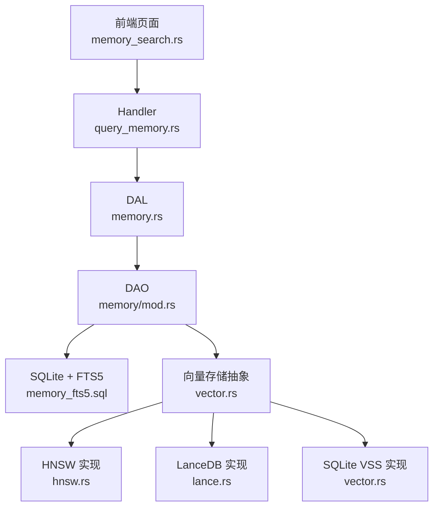
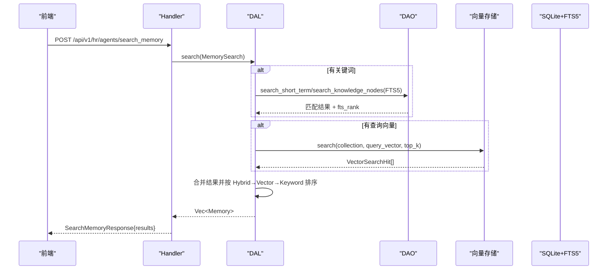
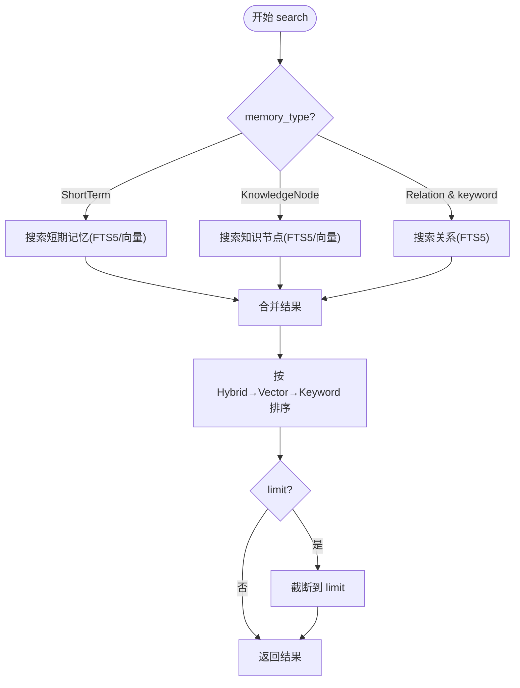
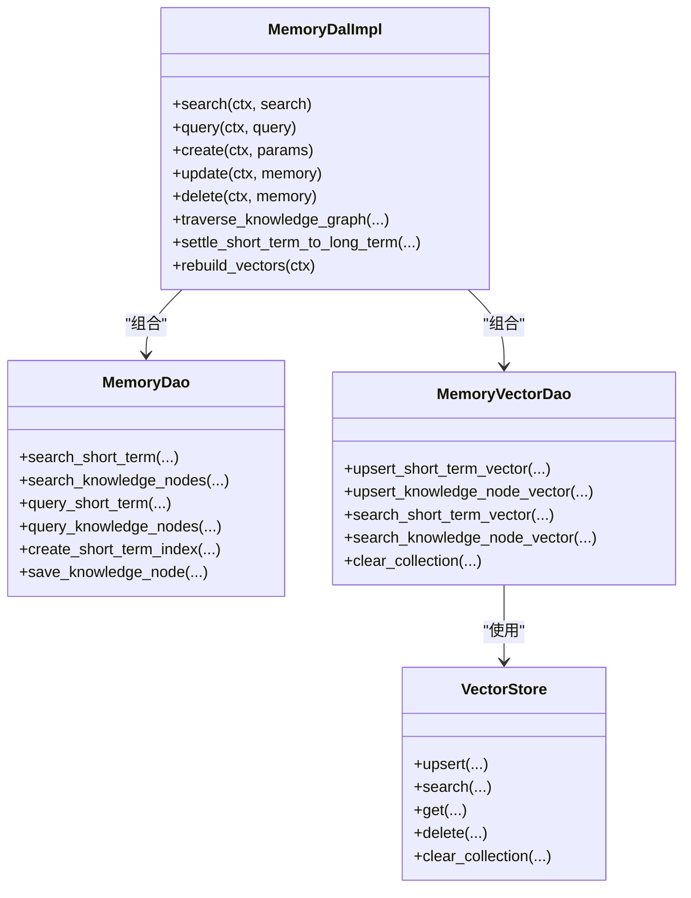

# 记忆搜索功能

<cite>
**本文引用的文件**
- [src/models/memory.rs](src/models/memory.rs)
- [src/service/dao/memory/mod.rs](src/service/dao/memory/mod.rs)
- [src/service/dal/memory.rs](src/service/dal/memory.rs)
- [src/handlers/hr/agent/query_memory.rs](src/handlers/hr/agent/query_memory.rs)
- [common/src/api/neural_tools.rs](common/src/api/neural_tools.rs)
- [frontend/src/pages/hr/memory_search.rs](frontend/src/pages/hr/memory_search.rs)
- [src/pkg/storage/vector.rs](src/pkg/storage/vector.rs)
- [src/pkg/storage/hnsw.rs](src/pkg/storage/hnsw.rs)
- [src/pkg/storage/lance.rs](src/pkg/storage/lance.rs)
- [common/src/enums/memory.rs](common/src/enums/memory.rs)
- [tests/integration/memory_test.rs](tests/integration/memory_test.rs)
- [migrations/20260712000000_memory_fts5.sql](migrations/20260712000000_memory_fts5.sql)
</cite>

## 目录
1. [简介](#简介)
2. [项目结构](#项目结构)
3. [核心组件](#核心组件)
4. [架构总览](#架构总览)
5. [详细组件分析](#详细组件分析)
6. [依赖关系分析](#依赖关系分析)
7. [性能与索引策略](#性能与索引策略)
8. [故障排查指南](#故障排查指南)
9. [结论](#结论)
10. [附录：搜索语法与高级用法](#附录搜索语法与高级用法)

## 简介
本文件面向“记忆搜索”能力，覆盖语义检索引擎、查询构建器、结果排序与相关性评分；搜索结果展示、记忆片段查看、上下文关联与内容预览；记忆管理（创建/编辑、分类标记、优先级、生命周期）；记忆与 Agent 的关联、访问控制与共享机制；以及搜索性能优化、索引策略、缓存方案与并发处理。同时提供搜索语法、过滤条件与高级查询示例，帮助开发者快速理解并正确使用记忆搜索。

## 项目结构
记忆搜索贯穿 Adapter（HTTP Handler / 神经工具）、Domain（运行时编排）、DAL（跨 DAO 流程编排）、DAO（SQLite + FTS5 + 向量存储）四层，严格单向调用。前端 Dioxus 页面通过 API 调用后端接口，完成关键词搜索或条件查询。

图表来源
- [frontend/src/pages/hr/memory_search.rs:1-181](frontend/src/pages/hr/memory_search.rs#L1-L181)
- [src/handlers/hr/agent/query_memory.rs:1-150](src/handlers/hr/agent/query_memory.rs#L1-L150)
- [src/service/dal/memory.rs:1-186](src/service/dal/memory.rs#L1-L186)
- [src/service/dao/memory/mod.rs:1-192](src/service/dao/memory/mod.rs#L1-L192)
- [src/pkg/storage/vector.rs:1-74](src/pkg/storage/vector.rs#L1-L74)
- [src/pkg/storage/hnsw.rs:512-554](src/pkg/storage/hnsw.rs#L512-L554)
- [src/pkg/storage/lance.rs:1-294](src/pkg/storage/lance.rs#L1-L294)
- [migrations/20260712000000_memory_fts5.sql](migrations/20260712000000_memory_fts5.sql)

章节来源
- [frontend/src/pages/hr/memory_search.rs:1-181](frontend/src/pages/hr/memory_search.rs#L1-L181)
- [src/handlers/hr/agent/query_memory.rs:1-150](src/handlers/hr/agent/query_memory.rs#L1-L150)
- [src/service/dal/memory.rs:1-186](src/service/dal/memory.rs#L1-L186)
- [src/service/dao/memory/mod.rs:1-192](src/service/dao/memory/mod.rs#L1-L192)
- [src/pkg/storage/vector.rs:1-74](src/pkg/storage/vector.rs#L1-L74)

## 核心组件
- 模型层
  - MemoryTrace：原始思考闭环记录，不可修改删除，仅追加。
  - ShortTermMemoryIndexPo：短期记忆索引（summary/tags/trace_ids/status）。
  - LongTermKnowledgeNodePo：长期知识节点（node_description/summary/tags/is_published）。
  - KnowledgeReferencePo/KnowledgeNodeRelationPo：引用与关系。
  - Memory：业务实体，携带 PO 与 SearchMatchInfo。
- DAO 层
  - MemoryDao：短期/长期记忆的 CRUD、FTS5 全文检索、关系操作。
  - MemoryVectorDao：向量索引 upsert/search/get/delete/clear。
  - MemoryQuery/MemorySearch：统一查询与搜索参数（含 filters/top_k/阈值等）。
- DAL 层
  - MemoryDalImpl：混合搜索（关键词+向量）、结果聚合排序、图谱遍历、沉淀流程、重建向量索引。
- 存储层
  - VectorStore 抽象：支持 HNSW、LanceDB、SQLite VSS 多后端。
  - FTS5 虚拟表与触发器：自动同步 short_term/knowledge_node 的全文索引。
- 前端
  - HrMemorySearch：根据关键词是否为空选择 query_memory 或 search_memory，展示结果、标签、分数。

章节来源
- [src/models/memory.rs:1-424](src/models/memory.rs#L1-L424)
- [src/service/dao/memory/mod.rs:13-192](src/service/dao/memory/mod.rs#L13-L192)
- [src/service/dal/memory.rs:70-186](src/service/dal/memory.rs#L70-L186)
- [src/pkg/storage/vector.rs:18-74](src/pkg/storage/vector.rs#L18-L74)
- [frontend/src/pages/hr/memory_search.rs:10-181](frontend/src/pages/hr/memory_search.rs#L10-L181)

## 架构总览
记忆搜索采用“关键词 + 向量语义 + 图谱关系”三位一体：
- 关键词搜索：FTS5 MATCH + BM25 排序。
- 向量语义：Embedding Provider 生成向量，存入 HNSW/LanceDB/VSS，按距离排序。
- 图谱关系：基于 KnowledgeNodeRelationPo 进行遍历与推荐起点。

图表来源
- [src/handlers/hr/agent/query_memory.rs:21-75](src/handlers/hr/agent/query_memory.rs#L21-L75)
- [src/service/dal/memory.rs:190-276](src/service/dal/memory.rs#L190-L276)
- [src/service/dao/memory/mod.rs:169-182](src/service/dao/memory/mod.rs#L169-L182)
- [src/pkg/storage/vector.rs:35-43](src/pkg/storage/vector.rs#L35-L43)

## 详细组件分析

### 语义检索引擎（DAL 混合搜索）
- 入口：MemoryDal::search(ctx, MemorySearch)
- 策略：
  - 若 memory_type=All/ShortTerm，执行短期记忆搜索（FTS5 或向量）。
  - 若 memory_type=All/KnowledgeNode，执行知识节点搜索（FTS5 或向量）。
  - 若 memory_type=All/Relation 且有关键词，执行关系关键词搜索。
- 排序：Hybrid 优先 → Vector 次之 → Keyword 最后；组内按 vector_distance 升序或 fts_rank 升序。
- 限制：filters.limit 截断结果。

图表来源
- [src/service/dal/memory.rs:190-276](src/service/dal/memory.rs#L190-L276)

章节来源
- [src/service/dal/memory.rs:190-276](src/service/dal/memory.rs#L190-L276)

### 查询构建器（MemoryQuery/MemorySearch）
- MemoryQuery：agent_id、status、exclude_status、keyword、limit、memory_type、tags、task_id、include_shared、node_type。
- MemorySearch：keyword、query_vector、top_k、vector_distance_threshold、filters（复用 MemoryQuery）。
- 权限与共享：查询他人 Agent 的记忆时强制只返回 published 节点（通过 tags 过滤），include_shared 控制是否包含其他 Agent 的 published 节点。

章节来源
- [src/service/dao/memory/mod.rs:13-58](src/service/dao/memory/mod.rs#L13-L58)
- [src/handlers/hr/agent/query_memory.rs:44-71](src/handlers/hr/agent/query_memory.rs#L44-L71)

### 结果排序与相关性评分
- FTS5：BM25 评分，rank 越小越相关。
- 向量：distance 越小越相似。
- 混合排序：Hybrid > Vector > Keyword；同类型内部按 distance 或 rank 升序。

章节来源
- [src/service/dal/memory.rs:220-268](src/service/dal/memory.rs#L220-L268)
- [src/service/dao/memory/mod.rs:169-182](src/service/dao/memory/mod.rs#L169-L182)

### 搜索结果展示、片段查看、上下文关联与内容预览
- 前端 HrMemorySearch：
  - 无关键词：调用 query_memory（条件过滤）。
  - 有关键词：调用 search_memory（关键词+向量）。
  - 展示：content 前100字符、summary、tags 标签、score、memory_type。
- 记忆片段查看：
  - 短期记忆：read_memory_content 可读取完整 trace 内容。
- 上下文关联：
  - 知识图谱遍历 traverse_knowledge_graph（BFS/DFS，深度/广度控制）。
  - 推荐起点 recommend_seed_nodes（按度数 Top N）。

章节来源
- [frontend/src/pages/hr/memory_search.rs:10-181](frontend/src/pages/hr/memory_search.rs#L10-L181)
- [src/service/dao/memory/mod.rs:184-192](src/service/dao/memory/mod.rs#L184-L192)
- [src/service/dal/memory.rs:518-576](src/service/dal/memory.rs#L518-L576)
- [src/service/dal/memory.rs:314-375](src/service/dal/memory.rs#L314-L375)

### 记忆管理：创建/编辑、分类标记、优先级、生命周期
- 创建：
  - AppendTraces：写入每日 JSONL（不向量化）。
  - CreateShortTerm：写库 + 向量化 summary/tags。
  - CreateKnowledgeNode：写库 + 写引用 + 向量化。
  - CreateRelations：写关系。
- 编辑：
  - update：ShortTerm/KnowledgeNode 更新后重新向量化；Trace/Relation 不支持。
- 删除：
  - delete：ShortTerm 软删除 + 删向量；KnowledgeNode 级联删除关系/引用/节点/向量；Trace/Relation 不支持。
- 分类标记：
  - tags：JSON 数组字符串，用于过滤与向量化文本拼接。
  - is_published：冗余字段加速 published 过滤。
- 生命周期：
  - MemoryStatus：Active/Settled/Forgotten。
  - settle_short_term_to_long_term：将 Active 短期记忆沉淀为长期知识节点，并标记 Settled。

章节来源
- [src/service/dal/memory.rs:377-516](src/service/dal/memory.rs#L377-L516)
- [src/service/dal/memory.rs:578-652](src/service/dal/memory.rs#L578-L652)
- [common/src/enums/memory.rs:12-30](common/src/enums/memory.rs#L12-L30)
- [src/models/memory.rs:158-266](src/models/memory.rs#L158-L266)

### 记忆与 Agent 的关联、访问控制与共享机制
- 关联：
  - agent_id：所有记忆/节点均归属特定 Agent。
  - task_id：聚焦特定任务的记忆（注意力机制）。
- 访问控制：
  - 查询他人 Agent 的记忆时，强制只返回 published 节点（tags 包含 "published"）。
  - include_shared：查询自己时可包含 published 共享节点；查询他人时不包含。
- 共享：
  - 通过 tags 中的 "published" 表达共享状态；is_published 冗余字段加速查询。

章节来源
- [src/handlers/hr/agent/query_memory.rs:44-71](src/handlers/hr/agent/query_memory.rs#L44-L71)
- [src/models/memory.rs:212-266](src/models/memory.rs#L212-L266)

## 依赖关系分析
- DAL 依赖 DAO（MemoryDao、MemoryVectorDao）、ModelProviderDao、CortexDao。
- DAO 依赖 SQLite 与 FTS5 迁移、向量存储抽象（HNSW/LanceDB/VSS）。
- 前端依赖 common API DTO（SearchMemoryParams/QueryMemoryParams/MemoryResult）。

图表来源
- [src/service/dal/memory.rs:181-186](src/service/dal/memory.rs#L181-L186)
- [src/service/dao/memory/mod.rs:62-553](src/service/dao/memory/mod.rs#L62-L553)
- [src/pkg/storage/vector.rs:18-74](src/pkg/storage/vector.rs#L18-L74)

章节来源
- [src/service/dal/memory.rs:181-186](src/service/dal/memory.rs#L181-L186)
- [src/service/dao/memory/mod.rs:62-553](src/service/dao/memory/mod.rs#L62-L553)
- [src/pkg/storage/vector.rs:18-74](src/pkg/storage/vector.rs#L18-L74)

## 性能与索引策略
- 全文索引：FTS5 虚拟表 + 触发器自动同步 short_term/knowledge_node，支持 unicode61/trigram 分词，BM25 排序。
- 向量索引：
  - HNSW：内存中 lazy rebuild，search 时按需重建索引，余弦距离。
  - LanceDB：持久化表，内置 HNSW，支持元数据过滤。
  - SQLite VSS：vss0 扩展，JOIN metadata 查询，距离排序。
- 重建策略：rebuild_vectors 检测 model_provider_id 变化，清空集合后逐条 embed 并 upsert。
- 并发与降级：
  - 向量化失败仅 warn 降级，不影响主流程。
  - 删除/更新向量索引失败不影响主事务。
- 前端优化：
  - fetch_request_id 丢弃过期请求结果，避免 tab 切换覆盖。
  - 空关键词走 query_memory，减少向量计算开销。

章节来源
- [migrations/20260712000000_memory_fts5.sql](migrations/20260712000000_memory_fts5.sql)
- [src/pkg/storage/hnsw.rs:512-554](src/pkg/storage/hnsw.rs#L512-L554)
- [src/pkg/storage/lance.rs:263-282](src/pkg/storage/lance.rs#L263-L282)
- [src/pkg/storage/vector.rs:126-173](src/pkg/storage/vector.rs#L126-L173)
- [src/service/dal/memory.rs:654-799](src/service/dal/memory.rs#L654-L799)
- [frontend/src/pages/hr/memory_search.rs:10-181](frontend/src/pages/hr/memory_search.rs#L10-L181)

## 故障排查指南
- 搜索无结果：
  - 检查 FTS5 索引是否创建成功（迁移是否执行）。
  - 检查 MemoryQuery.filters 是否正确设置 agent_id/tags/task_id。
- 向量搜索不准确：
  - 检查 Embedding Provider 是否启用且唯一。
  - 检查是否需要 rebuild_vectors（model_provider_id 变更）。
- 权限问题：
  - 查询他人 Agent 记忆时，确认 tags 包含 "published"。
- 前端显示异常：
  - 检查 fetch_request_id 机制是否生效，避免旧请求覆盖新结果。

章节来源
- [src/service/dal/memory.rs:654-799](src/service/dal/memory.rs#L654-L799)
- [src/handlers/hr/agent/query_memory.rs:44-71](src/handlers/hr/agent/query_memory.rs#L44-L71)
- [frontend/src/pages/hr/memory_search.rs:10-181](frontend/src/pages/hr/memory_search.rs#L10-L181)

## 结论
记忆搜索通过 FTS5 全文检索、向量语义检索与知识图谱关系的结合，提供了高精度、可扩展的检索能力。DAL 层负责混合搜索与排序，DAO 层封装 SQLite 与向量存储细节，前端提供直观交互。通过严格的分层与权限控制，系统在保证性能的同时确保了数据安全与一致性。

## 附录：搜索语法与高级用法
- 关键词搜索：
  - FTS5 MATCH 支持短语匹配与特殊字符转义。
  - 多关键词默认 AND 语义，BM25 综合评分。
- 向量搜索：
  - 通过 MemorySearch.query_vector 传入查询向量。
  - 可通过 vector_distance_threshold 调整阈值（默认 0.8）。
- 过滤条件：
  - agent_id、memory_type、tags、task_id、status、node_type。
- 高级查询：
  - 图谱遍历：traversal_depth、traversal_breadth、traversal_strategy、seed_node_ids。
  - 推荐起点：recommend_seed_nodes(agent_id, limit)。

示例（HTTP 请求参考）：
- 搜索记忆：POST /api/v1/hr/agents/search_memory
  - 请求体：SearchMemoryParams{query, max_results, memory_type, traversal_*, seed_node_ids, tags, task_id, agent_id}
- 查询记忆：POST /api/v1/hr/agents/query_memory
  - 请求体：QueryMemoryParams{agent_id, memory_type, limit, tags, task_id, status}

章节来源
- [common/src/api/neural_tools.rs:7-32](common/src/api/neural_tools.rs#L7-L32)
- [common/src/api/neural_tools.rs:68-91](common/src/api/neural_tools.rs#L68-L91)
- [tests/integration/memory_test.rs:194-208](tests/integration/memory_test.rs#L194-L208)
- [tests/integration/memory_test.rs:486-522](tests/integration/memory_test.rs#L486-L522)