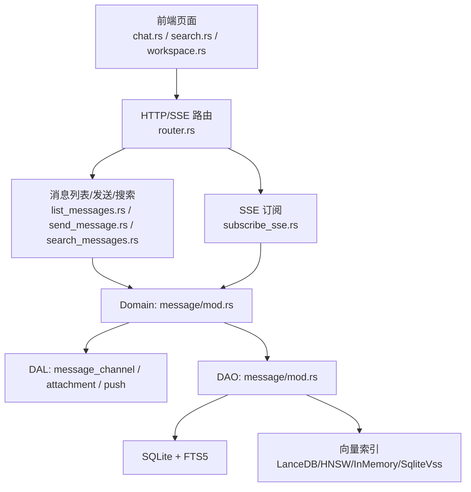
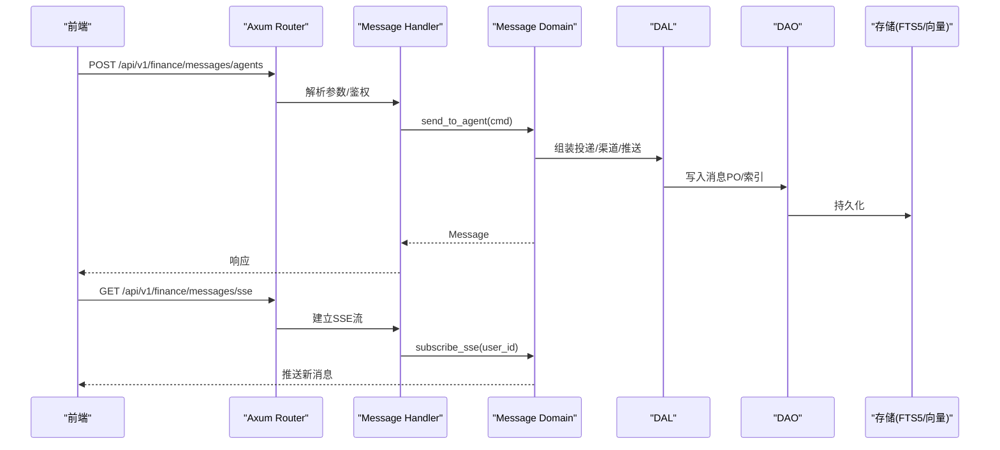
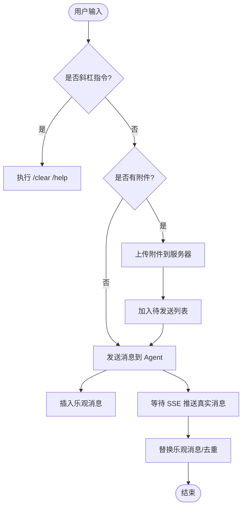
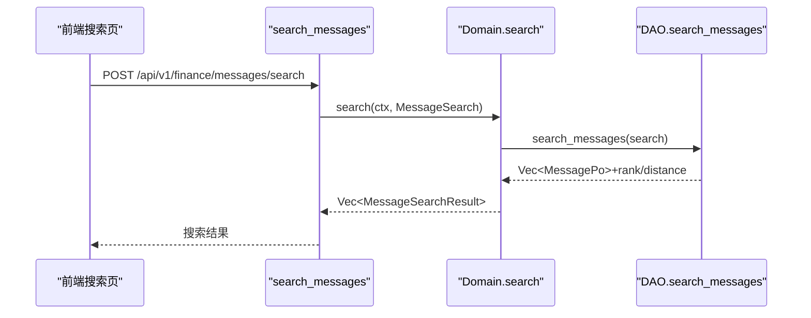
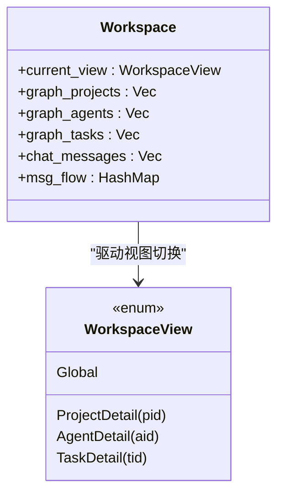
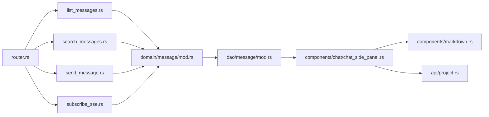

# 消息与工作区页面

<cite>
**本文引用的文件**
- [frontend/src/pages/message/chat.rs](frontend/src/pages/message/chat.rs)
- [frontend/src/components/chat/chat_side_panel.rs](frontend/src/components/chat/chat_side_panel.rs)
- [frontend/src/components/chat/mod.rs](frontend/src/components/chat/mod.rs)
- [frontend/src/components/markdown.rs](frontend/src/components/markdown.rs)
- [frontend/src/api/project.rs](frontend/src/api/project.rs)
- [frontend/styles/input.css](frontend/styles/input.css)
- [frontend/src/pages/message/search.rs](frontend/src/pages/message/search.rs)
- [frontend/src/pages/workspace.rs](frontend/src/pages/workspace.rs)
- [frontend/src/pages/reception.rs](frontend/src/pages/reception.rs)
- [frontend/src/pages/settings.rs](frontend/src/pages/settings.rs)
- [frontend/src/api/message.rs](frontend/src/api/message.rs)
- [src/router.rs](src/router.rs)
- [src/handlers/finance/message/list_messages.rs](src/handlers/finance/message/list_messages.rs)
- [src/handlers/finance/message/search_messages.rs](src/handlers/finance/message/search_messages.rs)
- [src/handlers/finance/message/send_message.rs](src/handlers/finance/message/send_message.rs)
- [src/handlers/finance/message/subscribe_sse.rs](src/handlers/finance/message/subscribe_sse.rs)
- [src/service/domain/message/mod.rs](src/service/domain/message/mod.rs)
- [src/service/dao/message/mod.rs](src/service/dao/message/mod.rs)
- [common/src/enums/message.rs](common/src/enums/message.rs)
</cite>

## 更新摘要
**变更内容**
- 新增聊天页面信息侧栏功能，支持项目对话和默认对话两种模式
- 实现refresh_tick状态管理和localStorage持久化机制
- 增强Markdown渲染组件，支持Mermaid图表和紧凑模式
- 修复API客户端查询参数缺失问题
- 优化移动端响应式布局

## 目录
1. [简介](#简介)
2. [项目结构](#项目结构)
3. [核心组件](#核心组件)
4. [架构总览](#架构总览)
5. [详细组件分析](#详细组件分析)
6. [依赖关系分析](#依赖关系分析)
7. [性能与可用性](#性能与可用性)
8. [故障排查指南](#故障排查指南)
9. [结论](#结论)
10. [附录](#附录)

## 简介
本模块围绕"消息与工作区"展开，覆盖聊天界面（实时消息、富文本编辑、文件分享、表情支持）、消息搜索（全文检索、高级筛选、历史记录）、工作区概览（仪表盘、快捷入口、最近活动）、接待机器人（自动回复、意图识别、转人工处理）和系统设置（个人偏好、通知配置、主题定制）。重点说明 WebSocket/SSE 连接管理、消息持久化、离线同步与冲突解决机制，并记录聊天室管理、消息路由、推送通知与多媒体处理功能。同时给出消息加密、隐私保护、性能优化与用户体验改进方案，以及智能助手、上下文感知与个性化推荐的技术实现路径。

**最新更新**：聊天页面增强了侧面板集成，新增信息面板切换按钮、refresh_tick状态管理、localStorage持久化等功能，为项目对话和默认对话模式提供丰富的上下文信息展示。

## 项目结构
前端采用 Dioxus 构建 SPA，后端使用 Axum 提供 REST + SSE 接口；消息域通过 Domain → DAL → DAO 分层组织，DAO 层基于 SQLx + SQLite，向量检索由 LanceDB/HNSW/InMemory/SqliteVss 多后端降级，全文检索使用 FTS5。



**图表来源**
- [src/router.rs:415-496](src/router.rs#L415-L496)
- [src/handlers/finance/message/list_messages.rs:1-122](src/handlers/finance/message/list_messages.rs#L1-L122)
- [src/handlers/finance/message/search_messages.rs:1-79](src/handlers/finance/message/search_messages.rs#L1-L79)
- [src/handlers/finance/message/subscribe_sse.rs:1-93](src/handlers/finance/message/subscribe_sse.rs#L1-L93)
- [src/service/domain/message/mod.rs:1-378](src/service/domain/message/mod.rs#L1-L378)
- [src/service/dao/message/mod.rs:1-229](src/service/dao/message/mod.rs#L1-L229)

**章节来源**
- [src/router.rs:415-496](src/router.rs#L415-L496)
- [src/handlers/finance/message/list_messages.rs:1-122](src/handlers/finance/message/list_messages.rs#L1-L122)
- [src/handlers/finance/message/search_messages.rs:1-79](src/handlers/finance/message/search_messages.rs#L1-L79)
- [src/handlers/finance/message/subscribe_sse.rs:1-93](src/handlers/finance/message/subscribe_sse.rs#L1-L93)
- [src/service/domain/message/mod.rs:1-378](src/service/domain/message/mod.rs#L1-L378)
- [src/service/dao/message/mod.rs:1-229](src/service/dao/message/mod.rs#L1-L229)

## 核心组件
- **聊天界面**：支持项目/默认对话切换、乐观发送、SSE 实时接收、附件上传、打字指示器、滚动到底部策略、移动端侧边栏。
- **信息侧栏**：新增可收起的 ChatSidePanel，项目对话模式提供总览/任务/产物/Agent四个Tab，默认对话模式提供共用Agent Tab和用户信息Tab。
- **消息搜索**：关键词搜索返回匹配类型与相似度距离，支持按项目/任务/收发方过滤。
- **工作区概览**：三栏布局（Project/Canvas/Agent），视图状态机驱动图数据按需加载，底部游戏式对话框联动当前视图上下文。
- **接待机器人**：初始化流程包含模型与向量模型配置，登录获取角色后进入主界面。
- **系统设置**：主题切换、API 地址本地保存。

**章节来源**
- [frontend/src/pages/message/chat.rs:1-1535](frontend/src/pages/message/chat.rs#L1-L1535)
- [frontend/src/components/chat/chat_side_panel.rs:1-793](frontend/src/components/chat/chat_side_panel.rs#L1-L793)
- [frontend/src/pages/message/search.rs:1-124](frontend/src/pages/message/search.rs#L1-L124)
- [frontend/src/pages/workspace.rs:1-800](frontend/src/pages/workspace.rs#L1-L800)
- [frontend/src/pages/reception.rs:1-626](frontend/src/pages/reception.rs#L1-L626)
- [frontend/src/pages/settings.rs:1-89](frontend/src/pages/settings.rs#L1-L89)

## 架构总览
消息域遵循 Adapter → Domain → DAL → DAO 单向调用，Handler 作为 Adapter 将请求转换为 Command/Query 交给 Domain，Domain 组合 DAL 完成业务编排，最终通过 DAO 访问存储。



**图表来源**
- [src/router.rs:415-496](src/router.rs#L415-L496)
- [src/handlers/finance/message/send_message.rs:1-41](src/handlers/finance/message/send_message.rs#L1-L41)
- [src/handlers/finance/message/subscribe_sse.rs:1-93](src/handlers/finance/message/subscribe_sse.rs#L1-L93)
- [src/service/domain/message/mod.rs:246-331](src/service/domain/message/mod.rs#L246-L331)
- [src/service/dao/message/mod.rs:1-229](src/service/dao/message/mod.rs#L1-L229)

## 详细组件分析

### 聊天界面（实时消息、富文本编辑、文件分享、表情支持）
- **会话上下文**：支持"默认对话"与"项目对话"，根据 selected_project 决定 to_agent_id 路由优先级。
- **实时消息**：浏览器 EventSource 订阅 /api/v1/finance/messages/sse，收到消息后去重并替换乐观消息。
- **历史分页**：上拉加载更多（before_timestamp），下拉轮询新消息（after_timestamp）。
- **附件上传**：选择文件后构造 FormData 上传至附件服务，成功后加入待发送列表，随消息一并发送。
- **输入体验**：支持斜杠指令菜单、发送超时保护（is_typing 60s 复位）、滚动到底部策略（at_bottom 判断）。

**更新**：新增信息侧栏集成，在Header右侧添加信息面板切换按钮，支持项目对话和默认对话两种模式。



**图表来源**
- [frontend/src/pages/message/chat.rs:180-282](frontend/src/pages/message/chat.rs#L180-L282)
- [frontend/src/pages/message/chat.rs:302-394](frontend/src/pages/message/chat.rs#L302-L394)
- [frontend/src/pages/message/chat.rs:396-457](frontend/src/pages/message/chat.rs#L396-L457)

**章节来源**
- [frontend/src/pages/message/chat.rs:1-1535](frontend/src/pages/message/chat.rs#L1-L1535)

### 信息侧栏（ChatSidePanel）
**新增功能**：聊天页面右侧新增可收起的 ChatSidePanel，提供丰富的上下文信息展示。

- **交互设计**：
  - 默认收起；Header 右侧出现「信息面板」切换按钮（项目对话与默认对话均显示），点击展开/收起
  - 展开状态持久化到 localStorage（key: `chat_project_panel_open`），刷新页面后恢复
  - 桌面端（lg 及以上）：右侧静态列 `w-96`；移动端：固定右侧抽屉覆盖层（带关闭按钮）
  - 面板头部：刷新按钮（手动）+ SSE 收到当前会话新消息时自动防抖刷新（2s，后到覆盖先到）

- **Tab 结构**（按对话模式动态组装）：
  | 模式 | Tab 序列 |
  |------|---------|
  | 项目对话（选中 project） | 总览 / 任务 / 产物 / Agent |
  | 默认对话（无 project） | Agent（前台） / 我 |

- **数据加载**：
  - `use_effect` 监听 `project_id` 与 `refresh_tick`：
    - 项目模式：并行 `get_project(id, with_progress_summary=true, with_task_graph=true, with_artifacts=true)` + `list_project_tasks(id)`
    - 默认模式：无需预加载（Agent/用户 Tab 各自懒加载）
  - `refresh_tick` 变化时 `spawn` 防抖：sleep 2s 后重新加载（代际计数丢弃过期请求）

- **Tab 功能详解**：
  - **总览**：项目目标、进度汇总、执行计划/结果、任务依赖图
  - **任务**：任务列表项，点击展开详情（懒加载 + 缓存）
  - **产物**：项目级产物 + 任务级产物（按任务分组）
  - **Agent**：负责人或前台Agent信息展示
  - **我**：当前用户信息展示

**章节来源**
- [frontend/src/components/chat/chat_side_panel.rs:1-793](frontend/src/components/chat/chat_side_panel.rs#L1-L793)
- [frontend/src/components/chat/mod.rs:1-15](frontend/src/components/chat/mod.rs#L1-L15)

### Markdown渲染增强
**新增功能**：通用 Markdown 渲染组件，支持表格、删除线、任务列表扩展语法，以及 Mermaid 图表渲染。

- **MarkdownRenderer组件**：
  - 使用 pulldown-cmark 将 Markdown 渲染为 HTML 后通过 `dangerous_inner_html` 注入
  - 支持紧凑模式（compact=true），用于聊天气泡、卡片等小容器场景
  - XSS安全：原始 HTML 事件降级为纯文本，避免注入风险
  - 自动缓存：按 content 缓存 HTML，避免重复解析

- **Mermaid支持**：
  - 独立 `MermaidDiagram` 组件渲染裸 Mermaid 字符串
  - 通过 vendor mermaid.js + JS interop 支持流程图、甘特图等
  - 自动扫描容器内的 ```mermaid
代码块并替换为 SVG
**章节来源**
- [frontend/src/components/markdown.rs:1-206](frontend/src/components/markdown.rs#L1-L206)
- [frontend/styles/input.css:203-372](frontend/styles/input.css#L203-L372)
### 消息搜索全文检索、高级筛选、历史记录
- **搜索能力**：支持关键词搜索，返回 match_typekeyword/vector/hybrid、fts_rank、vector_distance。
- **筛选条件**：可按 project_id、task_id、from_id、to_id 过滤，limit 控制结果数量。
- **前端展示**：表格列出内容摘要、发送方角色、类型、匹配信息、时间戳。


**图表来源**
- [frontend/src/pages/message/search.rs:27-53](frontend/src/pages/message/search.rs#L27-L53)
- [src/handlers/finance/message/search_messages.rs:19-55](src/handlers/finance/message/search_messages.rs#L19-L55)
- [src/service/dao/message/mod.rs:162-176](src/service/dao/message/mod.rs#L162-L176)

**章节来源**
- [frontend/src/pages/message/search.rs:1-124](frontend/src/pages/message/search.rs#L1-L124)
- [src/handlers/finance/message/search_messages.rs:1-79](src/handlers/finance/message/search_messages.rs#L1-L79)
- [src/service/dao/message/mod.rs:1-229](src/service/dao/message/mod.rs#L1-L229)

### 工作区概览（仪表盘、快捷入口、最近活动）
- **视图状态机**：Global / ProjectDetail / AgentDetail / TaskDetail，不同视图按需加载 tasks、agents、projects。
- **消息流量**：本地按分钟桶累积最近 60 分钟消息量，渲染折线图。
- **底部对话框**：根据当前视图动态绑定 project/task/agent 上下文，支持 SSE 实时消息与红点提示。



**图表来源**
- [frontend/src/pages/workspace.rs:102-334](frontend/src/pages/workspace.rs#L102-L334)
- [frontend/src/pages/workspace.rs:336-466](frontend/src/pages/workspace.rs#L336-L466)
- [frontend/src/pages/workspace.rs:535-753](frontend/src/pages/workspace.rs#L535-L753)

**章节来源**
- [frontend/src/pages/workspace.rs:1-800](frontend/src/pages/workspace.rs#L1-L800)

### 接待机器人（自动回复、意图识别、转人工处理）
- **系统初始化**：创建组织与管理员，配置对话模型与可选向量模型，异步进度轮询。
- **登录流程**：选择组织后登录，获取用户角色并跳转主界面。
- **前台 Agent**：默认对话可自动路由到前台 Agent，复杂需求建议新建项目组织。

**章节来源**
- [frontend/src/pages/reception.rs:1-626](frontend/src/pages/reception.rs#L1-L626)

### 系统设置（个人偏好、通知配置、主题定制）
- **主题切换**：支持多种主题，设置保存在浏览器 localStorage。
- **API 地址**：可配置后端 API Base URL，便于多环境切换。

**章节来源**
- [frontend/src/pages/settings.rs:1-89](frontend/src/pages/settings.rs#L1-L89)

## 依赖关系分析
- **路由层**：统一在 router.rs 中注册 /api/v1 下的受保护与公开路由，消息相关集中在 finance/messages。
- **Handler 层**：list_messages、send_message、search_messages、subscribe_sse 分别对应消息的查询、发送、搜索与实时推送。
- **Domain 层**：聚合 delivery 与 management 能力，定义命令与订阅结果结构。
- **DAO 层**：提供通用查询、全文检索、向量索引操作，支持多后端降级。

**更新**：新增 ChatSidePanel 组件依赖 markdown 渲染和 project API，增强信息展示能力。



**图表来源**
- [src/router.rs:415-496](src/router.rs#L415-L496)
- [src/handlers/finance/message/list_messages.rs:1-122](src/handlers/finance/message/list_messages.rs#L1-L122)
- [src/handlers/finance/message/search_messages.rs:1-79](src/handlers/finance/message/search_messages.rs#L1-L79)
- [src/handlers/finance/message/send_message.rs:1-41](src/handlers/finance/message/send_message.rs#L1-L41)
- [src/handlers/finance/message/subscribe_sse.rs:1-93](src/handlers/finance/message/subscribe_sse.rs#L1-L93)
- [src/service/domain/message/mod.rs:1-378](src/service/domain/message/mod.rs#L1-L378)
- [src/service/dao/message/mod.rs:1-229](src/service/dao/message/mod.rs#L1-L229)

**章节来源**
- [src/router.rs:415-496](src/router.rs#L415-L496)
- [src/service/domain/message/mod.rs:1-378](src/service/domain/message/mod.rs#L1-L378)
- [src/service/dao/message/mod.rs:1-229](src/service/dao/message/mod.rs#L1-L229)

## 性能与可用性
- **分页与增量**：列表接口支持 before/after 时间戳双向分页，减少全量传输；SSE 仅推送新增消息。
- **向量检索降级**：默认 LanceDB，支持 HNSW/InMemory/SqliteVss 多后端降级，保证检索可用性与性能。
- **内存与连接**：SSE 流在客户端断开或服务关闭时通过 Drop guard 自动注销连接，避免内存泄漏。
- **前端优化**：乐观更新、去重替换、滚动到底部策略、消息流量本地缓存（最近 60 分钟）。
- **并发与批量**：工作区视图按需加载，批量查询关联 agents/projects，避免 N+1 问题。
- **侧栏性能**：ChatSidePanel 使用防抖刷新（2s）和代际计数机制，避免频繁请求；任务详情懒加载 + 缓存。

**更新**：新增信息侧栏的性能优化，包括防抖刷新、localStorage持久化、懒加载等机制。

## 故障排查指南
- **SSE 连接失败**：检查浏览器 EventSource 初始化与后端 keep-alive；确认 JWT 中间件已注入 RequestContext。
- **消息重复或丢失**：确认前端 replace_tmp_with_real 逻辑与去重键（message_id）；检查 SSE 事件顺序与过滤条件。
- **搜索无结果**：验证 keyword 是否为空、filters 是否正确传递；检查 FTS5 索引与向量索引是否就绪。
- **附件上传失败**：检查 FormData 构造与 Blob 类型；确认后端附件接口权限与存储路径。
- **工作区视图数据为空**：确认当前视图对应的加载逻辑是否触发；检查批量查询是否成功。
- **信息侧栏不显示**：检查 panel_open 状态和 localStorage 读取；确认 refresh_tick 是否正确递增。

**更新**：新增信息侧栏相关的故障排查指南。

**章节来源**
- [frontend/src/pages/message/chat.rs:240-282](frontend/src/pages/message/chat.rs#L240-L282)
- [frontend/src/pages/message/chat.rs:302-394](frontend/src/pages/message/chat.rs#L302-L394)
- [src/handlers/finance/message/subscribe_sse.rs:17-50](src/handlers/finance/message/subscribe_sse.rs#L17-L50)
- [src/handlers/finance/message/search_messages.rs:23-47](src/handlers/finance/message/search_messages.rs#L23-L47)

## 结论
本模块以清晰的四层架构与领域驱动设计实现了消息与工作区的核心能力：聊天界面提供实时交互与富媒体支持，搜索能力结合全文与向量检索提升可发现性，工作区视图驱动按需加载保障性能，SSE 推送确保低延迟体验。**最新的信息侧栏功能进一步增强了项目对话和默认对话的上下文信息展示能力**，通过可收起的面板、多Tab设计和防抖刷新机制，为用户提供更丰富的项目信息和Agent状态。通过严格的中间件与错误处理、合理的分页与增量策略、以及多后端降级的检索能力，系统在可用性与性能之间取得平衡。后续可在消息加密、隐私保护、智能助手与个性化推荐方面持续演进。

## 附录

### 关键枚举与类型
- **消息角色**：User / Agent / System
- **消息类型**：Text / Image / File / Audio / Video / ToolCallRequest / ToolCallResult / ConfirmRequest / ConfirmResponse / TaskAssignment / TaskDispatchNotification / ProjectFollowupNotification
- **消息状态**：Recalled / Pending / Processing / Processed / Failed

**章节来源**
- [common/src/enums/message.rs:7-189](common/src/enums/message.rs#L7-L189)

### API 端点速查
- **发送消息到 Agent**：POST /api/v1/finance/messages/agents
- **消息列表**：GET /api/v1/finance/messages
- **消息搜索**：POST /api/v1/finance/messages/search
- **SSE 订阅**：GET /api/v1/finance/messages/sse

**更新**：新增项目信息查询API，支持with_progress_summary、with_task_graph、with_artifacts等查询参数。

**章节来源**
- [src/router.rs:415-496](src/router.rs#L415-L496)
- [frontend/src/api/message.rs:10-68](frontend/src/api/message.rs#L10-L68)
- [frontend/src/api/project.rs:35-59](frontend/src/api/project.rs#L35-L59)

### 新增功能特性
- **信息侧栏**：可收起的右侧面板，支持项目对话和默认对话两种模式
- **状态持久化**：panel_open状态保存到localStorage，刷新页面后保持
- **防抖刷新**：SSE消息触发2秒防抖刷新，避免频繁请求
- **Markdown增强**：支持表格、删除线、任务列表和Mermaid图表
- **紧凑模式**：适用于聊天气泡、卡片等小容器的Markdown渲染

**章节来源**
- [frontend/src/components/chat/chat_side_panel.rs:76-84](frontend/src/components/chat/chat_side_panel.rs#L76-L84)
- [frontend/src/components/markdown.rs:39-87](frontend/src/components/markdown.rs#L39-L87)
- [frontend/styles/input.css:337-372](frontend/styles/input.css#L337-L372)