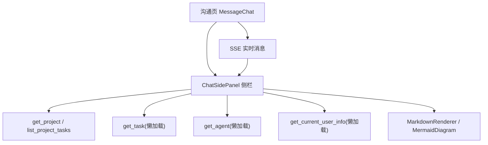
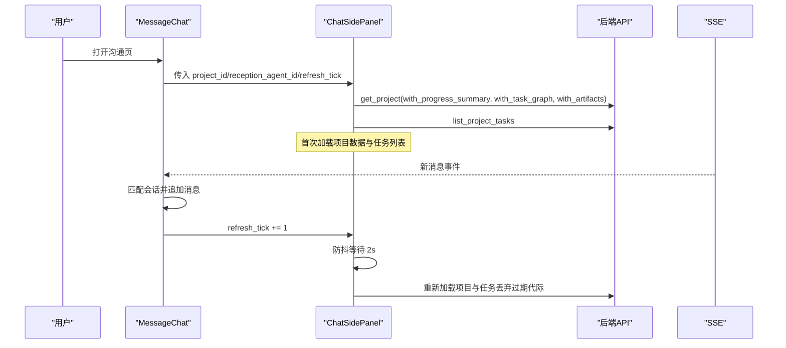
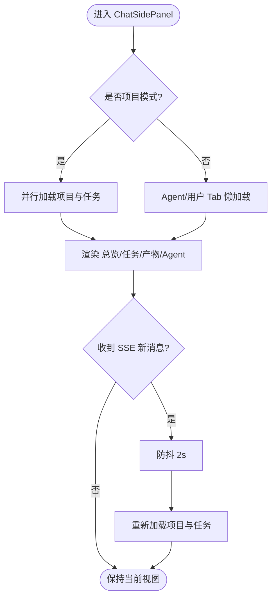
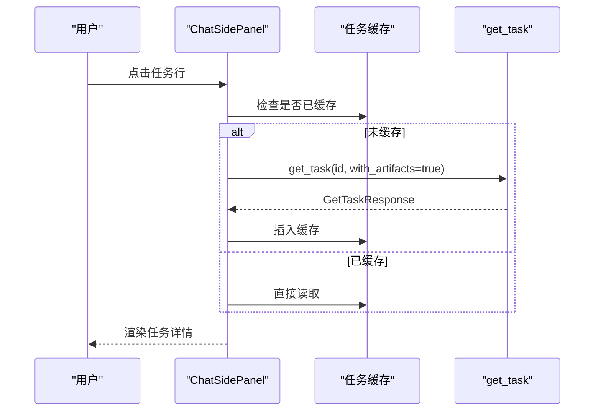
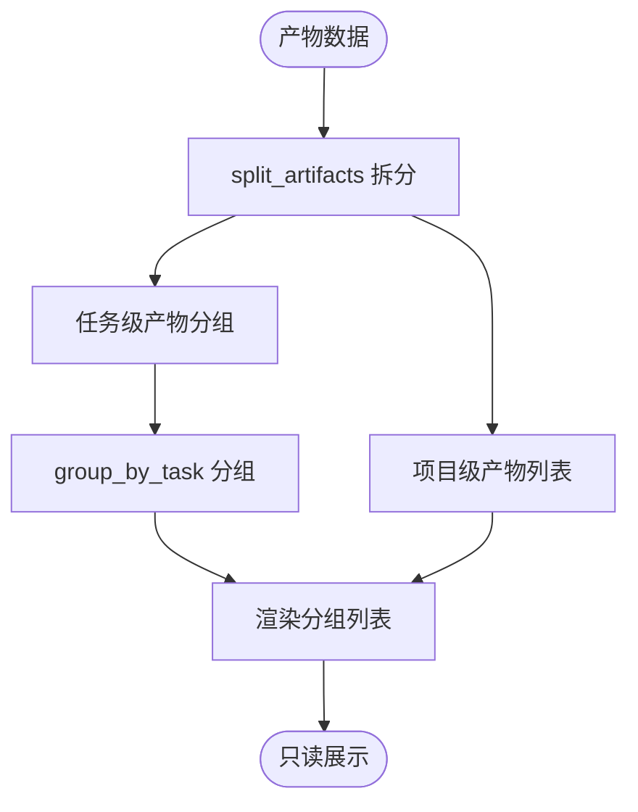
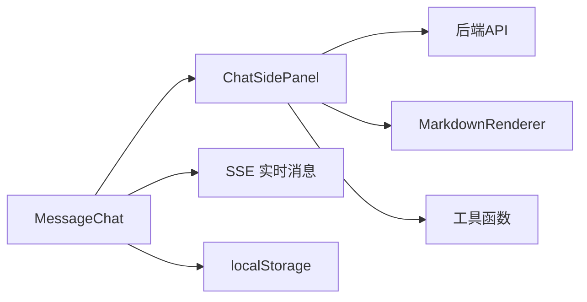

# 聊天侧面板

<cite>
**本文引用的文件**
- [chat_side_panel.rs](frontend/src/components/chat/chat_side_panel.rs)
- [chat.rs](frontend/src/pages/message/chat.rs)
- [project.rs](frontend/src/api/project.rs)
- [mod.rs（chat 组件）](frontend/src/components/chat/mod.rs)
- [markdown.rs](frontend/src/components/markdown.rs)
- [input.css](frontend/styles/input.css)
</cite>

## 目录
1. [简介](#简介)
2. [项目结构](#项目结构)
3. [核心组件](#核心组件)
4. [架构总览](#架构总览)
5. [详细组件分析](#详细组件分析)
6. [依赖关系分析](#依赖关系分析)
7. [性能与交互特性](#性能与交互特性)
8. [故障排查指南](#故障排查指南)
9. [结论](#结论)

## 简介
本功能为沟通页面新增的“信息侧栏”，用于在项目对话或默认对话中提供只读上下文：项目总览、任务列表与详情、产物分组展示、Agent 信息与当前用户信息。支持手动刷新与 SSE 消息触发的防抖自动刷新，展开状态通过 localStorage 持久化，桌面端以右侧列显示，移动端以抽屉覆盖层呈现。

## 项目结构
该功能由以下关键文件协作实现：
- 侧栏主组件：`ChatSidePanel`，负责 Tab 切换、数据加载、子 Tab 渲染
- 沟通页集成：在 `MessageChat` 中挂载侧栏、处理 SSE 刷新信号、localStorage 记忆
- API 客户端：补全项目查询参数，确保进度汇总、任务图、产物等字段可被读取
- Markdown 渲染：统一将执行计划/结果、描述等 Markdown 内容渲染为 HTML，并支持 Mermaid 图
- 样式：Tailwind + DaisyUI 主题，Markdown 容器样式与紧凑模式

图表来源
- [chat.rs:76-84](frontend/src/pages/message/chat.rs#L76-L84)
- [chat_side_panel.rs:102-185](frontend/src/components/chat/chat_side_panel.rs#L102-L185)
- [project.rs:35-59](frontend/src/api/project.rs#L35-L59)
- [markdown.rs:61-112](frontend/src/components/markdown.rs#L61-L112)

章节来源
- [chat_side_panel.rs:1-793](frontend/src/components/chat/chat_side_panel.rs#L1-L793)
- [chat.rs:76-84](frontend/src/pages/message/chat.rs#L76-L84)
- [project.rs:35-59](frontend/src/api/project.rs#L35-L59)
- [markdown.rs:61-112](frontend/src/components/markdown.rs#L61-L112)

## 核心组件
- ChatSidePanel：主容器，管理项目/默认两种模式的 Tab 集合、数据加载、防抖刷新、缓存与 UI 状态
- AgentInfoTab：懒加载并展示 Agent 详情（名称、类型、生命周期状态、运行时状态、角色、能力、描述、工具数量）
- UserInfoTab：懒加载当前用户信息（显示名/用户名、邮箱、角色、状态），并提供设置页跳转
- MarkdownRenderer/MermaidDiagram：统一 Markdown 渲染与 Mermaid 图渲染，支持紧凑模式与 DOM 注入安全

章节来源
- [chat_side_panel.rs:95-269](frontend/src/components/chat/chat_side_panel.rs#L95-L269)
- [chat_side_panel.rs:602-728](frontend/src/components/chat/chat_side_panel.rs#L602-L728)
- [markdown.rs:61-112](frontend/src/components/markdown.rs#L61-L112)

## 架构总览
侧栏遵循“只读展示”的设计原则，所有数据均通过现有后端 API 获取，不引入写操作；通过 Dioxus 的信号与 effect 管理状态，结合异步任务进行懒加载与防抖刷新。

图表来源
- [chat.rs:192-216](frontend/src/pages/message/chat.rs#L192-L216)
- [chat_side_panel.rs:123-185](frontend/src/components/chat/chat_side_panel.rs#L123-L185)
- [project.rs:35-59](frontend/src/api/project.rs#L35-L59)

## 详细组件分析

### ChatSidePanel 主组件
- 职责：根据对话模式动态组装 Tab，管理项目/任务/产物/Agent/我 的数据加载与展示
- 数据加载策略：
  - 项目模式：并行请求项目详情（含进度汇总、任务图、产物）与任务列表
  - 默认模式：Agent/用户 Tab 各自懒加载
- 防抖刷新：SSE 触发时递增计数器，内部使用代际计数丢弃过期请求，sleep 2s 后重新加载
- 状态管理：active_tab、expanded_task_id、task_cache、loading、load_gen、prev_project_id、prev_tick
- 布局：头部标题+刷新按钮+收起按钮；DaisyUI tabs-boxed 小号样式；内容区滚动

图表来源
- [chat_side_panel.rs:102-185](frontend/src/components/chat/chat_side_panel.rs#L102-L185)
- [chat_side_panel.rs:194-234](frontend/src/components/chat/chat_side_panel.rs#L194-L234)

章节来源
- [chat_side_panel.rs:95-269](frontend/src/components/chat/chat_side_panel.rs#L95-L269)

### 总览 Tab（仅项目模式）
- 展示项目基础信息（状态徽标、优先级、标签、负责人）
- 项目目标（Markdown 渲染）
- 进度汇总（整体百分比条与各状态计数）
- 执行计划/执行结果（Markdown 渲染）
- 任务依赖图（Mermaid 图）

章节来源
- [chat_side_panel.rs:286-353](frontend/src/components/chat/chat_side_panel.rs#L286-L353)
- [markdown.rs:61-87](frontend/src/components/markdown.rs#L61-L87)
- [markdown.rs:89-112](frontend/src/components/markdown.rs#L89-L112)

### 任务 Tab（仅项目模式）
- 任务列表项：标题、状态徽标、进度条、负责人
- 点击展开单任务详情（懒加载 + 缓存到 HashMap）
- 展开内容：描述、开始/截止时间、进度百分比、执行计划/结果、产物名称列表、跳转详情页链接

图表来源
- [chat_side_panel.rs:355-452](frontend/src/components/chat/chat_side_panel.rs#L355-L452)
- [chat_side_panel.rs:454-511](frontend/src/components/chat/chat_side_panel.rs#L454-L511)

章节来源
- [chat_side_panel.rs:355-511](frontend/src/components/chat/chat_side_panel.rs#L355-L511)

### 产物 Tab（仅项目模式）
- 数据源：项目详情中的 artifacts（with_artifacts）
- 分组逻辑：
  - split_artifacts：按 task_id 是否为 None 拆分为项目级/任务级
  - group_by_task：任务级产物按 task_id 分组，组标题优先取任务名，否则截断 ID
- 每行展示：名称、来源类型徽标、文件大小、创建时间、跳转链接（只读）

图表来源
- [chat_side_panel.rs:65-93](frontend/src/components/chat/chat_side_panel.rs#L65-L93)
- [chat_side_panel.rs:513-579](frontend/src/components/chat/chat_side_panel.rs#L513-L579)

章节来源
- [chat_side_panel.rs:513-600](frontend/src/components/chat/chat_side_panel.rs#L513-L600)

### Agent 与用户 Tab
- AgentInfoTab：懒加载 Agent 详情，展示名称、类型、生命周期状态、运行时状态、角色、能力、描述、工具数量，跳转详情页
- UserInfoTab：懒加载当前用户信息，展示显示名/用户名、邮箱、角色、状态，跳转设置页

章节来源
- [chat_side_panel.rs:602-728](frontend/src/components/chat/chat_side_panel.rs#L602-L728)

### 沟通页集成（MessageChat）
- 新增 panel_open 信号，从 localStorage 初始化并回写
- 新增 refresh_tick 信号，SSE 命中当前会话时递增
- 两种对话 Header 右侧追加“信息面板”切换按钮
- 布局：桌面端右侧静态列，移动端固定抽屉 + 背景遮罩

章节来源
- [chat.rs:76-84](frontend/src/pages/message/chat.rs#L76-L84)
- [chat.rs:192-216](frontend/src/pages/message/chat.rs#L192-L216)
- [chat.rs:483-490](frontend/src/pages/message/chat.rs#L483-L490)

## 依赖关系分析
- ChatSidePanel 依赖：
  - API：get_project、list_project_tasks、get_task、get_agent、get_current_user_info
  - 组件：MarkdownRenderer、MermaidDiagram
  - 工具：format_file_size、progress_bar_class、project_status_badge/text、task_status_badge/text
- MessageChat 依赖：
  - SSE 连接与消息处理
  - localStorage 读写
  - ChatSidePanel 组件

图表来源
- [chat_side_panel.rs:16-29](frontend/src/components/chat/chat_side_panel.rs#L16-L29)
- [chat.rs:76-84](frontend/src/pages/message/chat.rs#L76-L84)

章节来源
- [chat_side_panel.rs:16-29](frontend/src/components/chat/chat_side_panel.rs#L16-L29)
- [chat.rs:76-84](frontend/src/pages/message/chat.rs#L76-L84)

## 性能与交互特性
- 防抖刷新：SSE 触发后等待 2s，避免频繁请求；使用代际计数丢弃过期请求结果
- 懒加载：任务详情与 Agent/用户信息按需加载，减少初始负载
- 缓存：任务详情缓存到 HashMap，重复展开直接命中
- 只读设计：无写操作，降低复杂度与风险
- 响应式布局：桌面端右侧列，移动端抽屉覆盖层
- Markdown 渲染：紧凑模式适配卡片/气泡场景，Mermaid 图支持任务依赖可视化

章节来源
- [chat_side_panel.rs:123-185](frontend/src/components/chat/chat_side_panel.rs#L123-L185)
- [chat_side_panel.rs:390-412](frontend/src/components/chat/chat_side_panel.rs#L390-L412)
- [markdown.rs:61-112](frontend/src/components/markdown.rs#L61-L112)

## 故障排查指南
- 项目数据加载失败：检查 get_project 与 list_project_tasks 返回错误，查看 toast 提示
- 任务详情加载失败：检查 get_task 请求参数 with_artifacts，查看缓存是否命中
- Agent/用户信息加载失败：检查对应 API 可用性，查看 failed 状态与空提示
- SSE 连接失败：检查 EventSource 初始化与 onerror 回调，确认实时消息无法接收
- 防抖刷新异常：检查 refresh_tick 递增逻辑与 load_gen 代际比较
- Markdown 渲染异常：检查 content 是否为空，compact 模式样式是否正确应用

章节来源
- [chat_side_panel.rs:147-154](frontend/src/components/chat/chat_side_panel.rs#L147-L154)
- [chat_side_panel.rs:402-411](frontend/src/components/chat/chat_side_panel.rs#L402-L411)
- [chat_side_panel.rs:614-618](frontend/src/components/chat/chat_side_panel.rs#L614-L618)
- [chat.rs:254-296](frontend/src/pages/message/chat.rs#L254-L296)

## 结论
聊天侧面板以只读方式增强沟通页面的上下文信息，通过项目总览、任务详情、产物分组、Agent 与用户信息提升用户体验。防抖刷新与懒加载优化了性能，Markdown 与 Mermaid 支持提升了可读性与可视化能力。整体设计简洁、可扩展，符合前端组件化与状态管理的最佳实践。