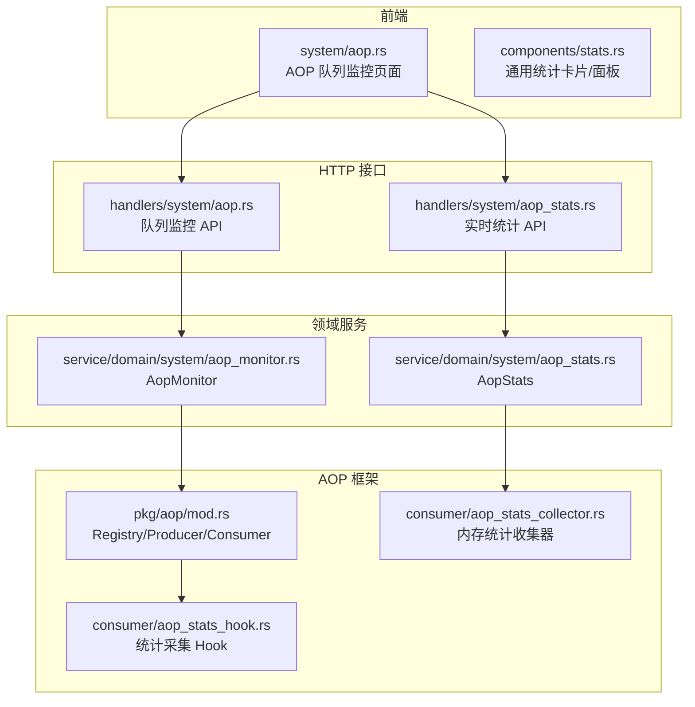
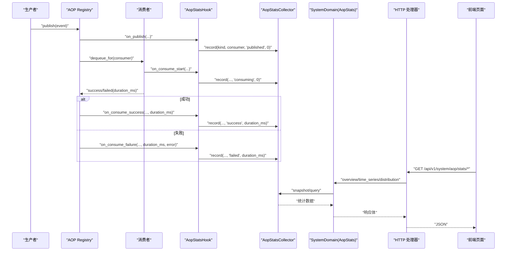
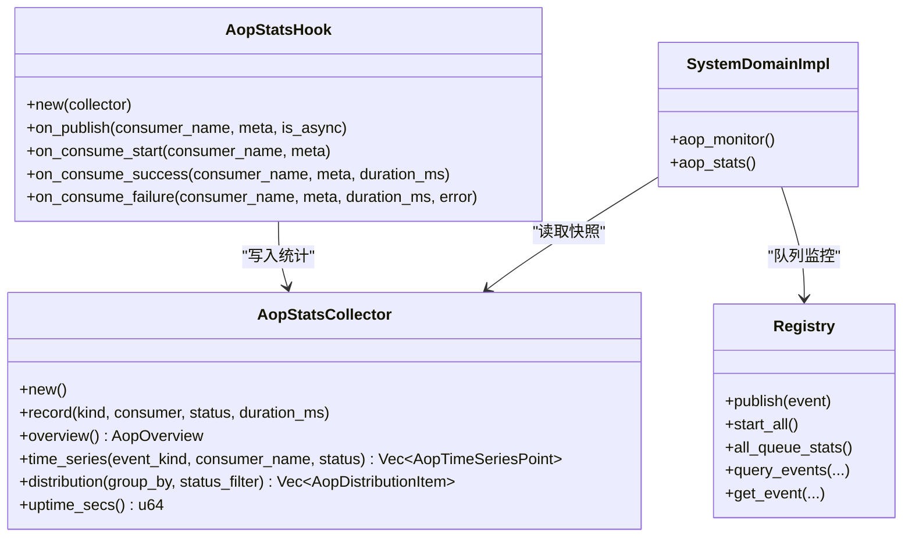
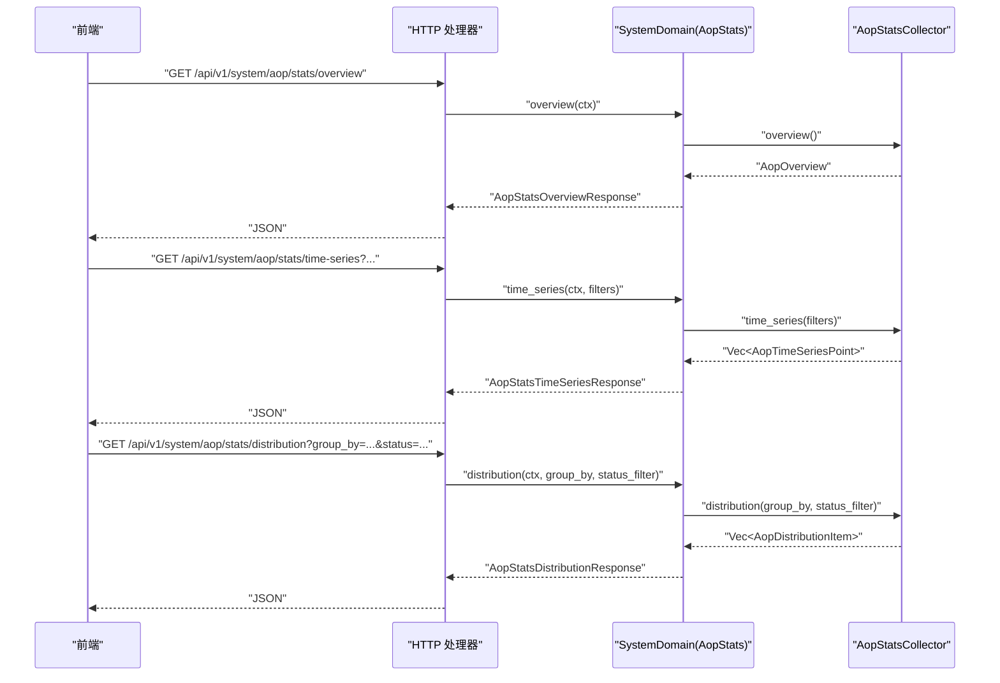
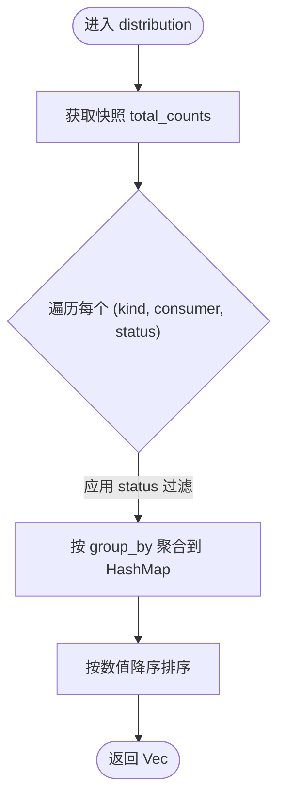
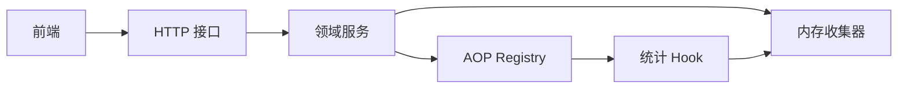

# AOP 监控面板

<cite>
**本文引用的文件**
- [src/pkg/aop/mod.rs](src/pkg/aop/mod.rs)
- [src/consumer/aop_stats_collector.rs](src/consumer/aop_stats_collector.rs)
- [src/consumer/aop_stats_hook.rs](src/consumer/aop_stats_hook.rs)
- [src/handlers/system/aop.rs](src/handlers/system/aop.rs)
- [src/handlers/system/aop_stats.rs](src/handlers/system/aop_stats.rs)
- [src/service/domain/system/aop_monitor.rs](src/service/domain/system/aop_monitor.rs)
- [src/service/domain/system/aop_stats.rs](src/service/domain/system/aop_stats.rs)
- [common/src/api/system.rs](common/src/api/system.rs)
- [frontend/src/pages/system/aop.rs](frontend/src/pages/system/aop.rs)
- [frontend/src/components/stats.rs](frontend/src/components/stats.rs)
- [docs/superpowers/plans/2026-07-25-stats-charts-phase3.md](docs/superpowers/plans/2026-07-25-stats-charts-phase3.md)
- [DuckDB 多维统计双层互补：record_event! 宏自动表推断 + RuntimeStatsCollector 内存滑动窗口 + 5 维度开箱即用表](docs/wiki/knowledge/zh/DuckDB 多维统计双层互补：record_event! 宏自动表推断 + RuntimeStatsCollector 内存滑动窗口 + 5 维度开箱即用表/DuckDB 多维统计双层互补：record_event! 宏自动表推断 + RuntimeStatsCollector 内存滑动窗口 + 5 维度开箱即用表.md)
- [AOP 生产消费事件中心：纯框架零业务 + pkg/aop/core 6 Trait + Registry 全局单例 + 8 类业务消费者注册](docs/wiki/knowledge/zh/AOP 生产消费事件中心：纯框架零业务 + pkg/aop/core 6 Trait + Registry 全局单例 + 8 类业务消费者注册/AOP 生产消费事件中心：纯框架零业务 + pkg/aop/core 6 Trait + Registry 全局单例 + 8 类业务消费者注册.md)
</cite>

## 目录
1. [简介](#简介)
2. [项目结构](#项目结构)
3. [核心组件](#核心组件)
4. [架构总览](#架构总览)
5. [详细组件分析](#详细组件分析)
6. [依赖关系分析](#依赖关系分析)
7. [性能考量](#性能考量)
8. [故障诊断指南](#故障诊断指南)
9. [结论](#结论)
10. [附录](#附录)

## 简介
本文件面向 AOP 监控面板，系统性说明事件追踪、实时监控仪表板、异常告警机制与性能分析工具的设计与实践。重点覆盖：
- 事件追踪系统：请求链路追踪、调用栈分析、性能指标收集
- 实时监控仪表板：QPS 监控、响应时间分布、错误率统计
- 异常告警机制：阈值配置、告警规则、通知渠道（扩展建议）
- 性能分析工具：慢请求分析、资源使用监控、瓶颈识别（扩展建议）
- 数据采集：埋点方式、采样策略、数据聚合
- 可视化展示：图表类型、时间范围选择、多维度筛选
- 告警管理：自定义规则、分级告警、静默期配置（扩展建议）
- 数据存储：时序数据库、保留策略、索引优化（结合现有内存采集器与 DuckDB 统计能力）
- 故障诊断：性能问题定位、系统异常排查、容量规划建议

## 项目结构
AOP 监控由“框架层 + 业务 Hook + 领域服务 + HTTP 接口 + 前端页面”构成，遵循四层单向调用原则，AOP 框架保持零业务依赖，业务侧通过 Hook 注入统计采集逻辑。

图示来源
- [src/pkg/aop/mod.rs:1-61](src/pkg/aop/mod.rs#L1-L61)
- [src/consumer/aop_stats_collector.rs:1-52](src/consumer/aop_stats_collector.rs#L1-L52)
- [src/consumer/aop_stats_hook.rs:1-33](src/consumer/aop_stats_hook.rs#L1-L33)
- [src/handlers/system/aop.rs:1-41](src/handlers/system/aop.rs#L1-L41)
- [src/handlers/system/aop_stats.rs:1-41](src/handlers/system/aop_stats.rs#L1-L41)
- [src/service/domain/system/aop_monitor.rs:1-28](src/service/domain/system/aop_monitor.rs#L1-L28)
- [src/service/domain/system/aop_stats.rs:1-53](src/service/domain/system/aop_stats.rs#L1-L53)
- [frontend/src/pages/system/aop.rs:1-100](frontend/src/pages/system/aop.rs#L1-L100)
- [frontend/src/components/stats.rs:64-116](frontend/src/components/stats.rs#L64-L116)

章节来源
- [src/pkg/aop/mod.rs:1-61](src/pkg/aop/mod.rs#L1-L61)
- [frontend/src/pages/system/aop.rs:1-100](frontend/src/pages/system/aop.rs#L1-L100)

## 核心组件
- AOP 框架 Registry：提供事件发布、消费者注册、调度启动与队列查询能力，是监控数据的源头。
- 统计采集 Hook：在 publish/consume_start/success/failure 四个回调中记录事件维度与耗时，采用后台任务写入，避免阻塞主流程。
- 内存统计收集器：维护按 (event_kind, consumer_name, status) 维度的计数器与最近 60 分钟滑动窗口时序数据，提供概览、时序、分布查询。
- 领域服务 AopMonitor/AopStats：对外暴露统一查询入口，屏蔽底层实现细节。
- HTTP 接口：提供队列状态、事件列表/详情以及实时统计的 REST API。
- 前端页面：实时监控（队列卡片、事件列表、详情弹窗）与统计图表（概览卡片、折线图、环形图），支持 5 秒轮询刷新。

章节来源
- [src/consumer/aop_stats_hook.rs:35-82](src/consumer/aop_stats_hook.rs#L35-L82)
- [src/consumer/aop_stats_collector.rs:43-196](src/consumer/aop_stats_collector.rs#L43-L196)
- [src/service/domain/system/aop_monitor.rs:1-28](src/service/domain/system/aop_monitor.rs#L1-L28)
- [src/service/domain/system/aop_stats.rs:1-53](src/service/domain/system/aop_stats.rs#L1-L53)
- [src/handlers/system/aop.rs:1-41](src/handlers/system/aop.rs#L1-L41)
- [src/handlers/system/aop_stats.rs:1-41](src/handlers/system/aop_stats.rs#L1-L41)
- [frontend/src/pages/system/aop.rs:349-531](frontend/src/pages/system/aop.rs#L349-L531)

## 架构总览
AOP 监控的数据流从事件发布开始，经消费者处理，Hook 捕获关键阶段并写入内存收集器；领域服务读取收集器快照，HTTP 接口将结果返回给前端进行可视化。

图示来源
- [src/pkg/aop/mod.rs:24-61](src/pkg/aop/mod.rs#L24-L61)
- [src/consumer/aop_stats_hook.rs:35-82](src/consumer/aop_stats_hook.rs#L35-L82)
- [src/consumer/aop_stats_collector.rs:61-196](src/consumer/aop_stats_collector.rs#L61-L196)
- [src/handlers/system/aop_stats.rs:16-41](src/handlers/system/aop_stats.rs#L16-L41)
- [src/service/domain/system/aop_stats.rs:14-53](src/service/domain/system/aop_stats.rs#L14-L53)
- [frontend/src/pages/system/aop.rs:349-531](frontend/src/pages/system/aop.rs#L349-L531)

## 详细组件分析

### AOP 框架与调度
- 全局 Registry 单例：集中管理消费者注册、事件分发与 worker 调度。
- 启动流程：init_all 仅启动异步消费者轮询，业务消费者在 consumer::init 中注册。
- 监控接入点：在 start_all 的 worker 循环中，于 on_event 前后插入 Hook 回调，记录消费开始与结果。

章节来源
- [src/pkg/aop/mod.rs:24-61](src/pkg/aop/mod.rs#L24-L61)
- [docs/superpowers/plans/2026-07-25-stats-charts-phase3.md:272-337](docs/superpowers/plans/2026-07-25-stats-charts-phase3.md#L272-L337)

### 统计采集 Hook
- 四个回调：on_publish、on_consume_start、on_consume_success、on_consume_failure。
- 非阻塞写入：通过 tokio::spawn 后台执行 record，避免影响 AOP 主流程延迟。
- 维度键：(event_kind, consumer_name, status)，用于后续聚合与过滤。

章节来源
- [src/consumer/aop_stats_hook.rs:14-82](src/consumer/aop_stats_hook.rs#L14-L82)

### 内存统计收集器
- 数据结构：基于 RuntimeStatsCollector<AopDimKey>，维护总计数与最近 60 分钟分钟级桶。
- 方法：
  - overview：汇总 published/published_sync、consumed(success+failed)、平均耗时。
  - time_series：按 event_kind/consumer/status 过滤，输出分钟级时序点。
  - distribution：按 consumer/status/kind 分组，支持 status 过滤。
- 内存占用估算：约 38KB（60 桶 × 组合数 × 字节）。

章节来源
- [src/consumer/aop_stats_collector.rs:1-196](src/consumer/aop_stats_collector.rs#L1-L196)

### 领域服务与 HTTP 接口
- AopMonitor：封装队列统计、事件列表与详情查询。
- AopStats：直接读取内存收集器，提供 overview/time_series/distribution。
- HTTP 端点：
  - GET /api/v1/system/aop/stats（队列统计）
  - GET /api/v1/system/aop/:consumer/stats（消费者统计）
  - GET /api/v1/system/aop/:consumer/events（事件列表）
  - GET /api/v1/system/aop/:consumer/events/:event_id（事件详情）
  - GET /api/v1/system/aop/stats/overview（概览）
  - GET /api/v1/system/aop/stats/time-series（时序）
  - GET /api/v1/system/aop/stats/distribution（分布）

章节来源
- [src/service/domain/system/aop_monitor.rs:1-28](src/service/domain/system/aop_monitor.rs#L1-L28)
- [src/service/domain/system/aop_stats.rs:1-53](src/service/domain/system/aop_stats.rs#L1-L53)
- [src/handlers/system/aop.rs:14-41](src/handlers/system/aop.rs#L14-L41)
- [src/handlers/system/aop_stats.rs:16-41](src/handlers/system/aop_stats.rs#L16-L41)
- [common/src/api/system.rs:69-104](common/src/api/system.rs#L69-L104)

### 前端可视化
- 实时监控 Tab：队列卡片（pending/in_progress/oldest_age/order_keys）、事件列表（支持状态过滤）、事件详情弹窗。
- 统计图表 Tab：概览卡片（总发布/总消费/成功/失败/平均耗时）、折线图（最近 60 分钟）、环形图（状态分布、消费者分布），5 秒轮询自动刷新。
- 通用统计组件：StatsCard/StatsPanel 复用，统一视觉风格。

章节来源
- [frontend/src/pages/system/aop.rs:41-347](frontend/src/pages/system/aop.rs#L41-L347)
- [frontend/src/pages/system/aop.rs:349-531](frontend/src/pages/system/aop.rs#L349-L531)
- [frontend/src/components/stats.rs:64-116](frontend/src/components/stats.rs#L64-L116)

### 类图（代码级）

图示来源
- [src/consumer/aop_stats_collector.rs:43-196](src/consumer/aop_stats_collector.rs#L43-L196)
- [src/consumer/aop_stats_hook.rs:14-82](src/consumer/aop_stats_hook.rs#L14-L82)
- [src/service/domain/system/aop_monitor.rs:1-28](src/service/domain/system/aop_monitor.rs#L1-L28)
- [src/service/domain/system/aop_stats.rs:14-53](src/service/domain/system/aop_stats.rs#L14-L53)
- [src/pkg/aop/mod.rs:24-61](src/pkg/aop/mod.rs#L24-L61)

### 序列图（API 工作流）

图示来源
- [src/handlers/system/aop_stats.rs:16-41](src/handlers/system/aop_stats.rs#L16-L41)
- [src/service/domain/system/aop_stats.rs:14-53](src/service/domain/system/aop_stats.rs#L14-L53)
- [src/consumer/aop_stats_collector.rs:74-196](src/consumer/aop_stats_collector.rs#L74-L196)

### 流程图（统计聚合算法）

图示来源
- [src/consumer/aop_stats_collector.rs:155-190](src/consumer/aop_stats_collector.rs#L155-L190)

## 依赖关系分析
- 耦合与内聚：
  - AOP 框架与业务解耦：框架不感知业务实体，Hook 为业务注入点。
  - 领域服务对收集器的依赖为只读快照，降低写放大。
  - HTTP 接口薄封装，职责单一。
- 外部依赖：
  - 运行时统计基础：RuntimeStatsCollector（分钟级桶、滑动窗口）。
  - 前端图表：LineChart/DonutChart 复用现有组件。
- 潜在循环依赖：无，层级单向调用清晰。

图示来源
- [src/pkg/aop/mod.rs:24-61](src/pkg/aop/mod.rs#L24-L61)
- [src/consumer/aop_stats_hook.rs:35-82](src/consumer/aop_stats_hook.rs#L35-L82)
- [src/consumer/aop_stats_collector.rs:43-196](src/consumer/aop_stats_collector.rs#L43-L196)
- [src/service/domain/system/aop_stats.rs:14-53](src/service/domain/system/aop_stats.rs#L14-L53)
- [src/handlers/system/aop_stats.rs:16-41](src/handlers/system/aop_stats.rs#L16-L41)
- [frontend/src/pages/system/aop.rs:349-531](frontend/src/pages/system/aop.rs#L349-L531)

章节来源
- [src/pkg/aop/mod.rs:24-61](src/pkg/aop/mod.rs#L24-L61)
- [src/consumer/aop_stats_hook.rs:35-82](src/consumer/aop_stats_hook.rs#L35-L82)
- [src/consumer/aop_stats_collector.rs:43-196](src/consumer/aop_stats_collector.rs#L43-L196)
- [src/service/domain/system/aop_stats.rs:14-53](src/service/domain/system/aop_stats.rs#L14-L53)
- [src/handlers/system/aop_stats.rs:16-41](src/handlers/system/aop_stats.rs#L16-L41)
- [frontend/src/pages/system/aop.rs:349-531](frontend/src/pages/system/aop.rs#L349-L531)

## 性能考量
- 采集路径零阻塞：Hook 使用 tokio::spawn 后台写入，避免影响 AOP 主流程延迟。
- 内存占用可控：60 分钟滑动窗口，约 38KB 内存占用，适合进程内实时统计。
- 查询性能：overview/time_series/distribution 均为内存快照聚合，毫秒级响应。
- 前端轮询：5 秒轮询频率平衡了实时性与网络开销。
- 降级策略：stats 查询失败不应阻塞主流程（参考运行修复计划中的降级思路）。

[本节为通用指导，无需具体文件引用]

## 故障诊断指南
- 性能问题定位：
  - 查看平均耗时与失败率：通过 overview 快速判断整体健康度。
  - 时序趋势：通过 time_series 观察突发流量或异常时段。
  - 分布分析：通过 distribution 按 consumer/status/kind 定位热点与瓶颈。
- 系统异常排查：
  - 队列堆积：检查 pending_count、in_progress_count、oldest_event_age_secs。
  - 消费者失败：关注 failed 分布与错误信息（可在事件详情中查看 payload_preview）。
  - 退避与重试：确认 on_event 失败后存在退避 sleep，避免 CPU 自旋。
- 容量规划建议：
  - 根据峰值 QPS 与平均耗时评估 collector 与 worker 并发度。
  - 若需持久化与长周期分析，可考虑引入时序数据库（如 Prometheus/TimescaleDB）与索引优化（按 event_kind/consumer/status 建索引）。
  - 前端渲染大数据量时注意分页与节流。

章节来源
- [src/handlers/system/aop.rs:14-41](src/handlers/system/aop.rs#L14-L41)
- [src/consumer/aop_stats_collector.rs:74-196](src/consumer/aop_stats_collector.rs#L74-L196)
- [docs/superpowers/plans/2026-07-23-runtime-issues-fix.md:398-430](docs/superpowers/plans/2026-07-23-runtime-issues-fix.md#L398-L430)

## 结论
AOP 监控面板以内存统计收集器为核心，结合 Hook 埋点与领域服务抽象，提供了低延迟、可扩展的实时监控能力。前端通过轮询与图表组件实现了直观的可视化体验。未来可扩展告警机制（阈值、规则、通知渠道）与持久化存储（时序数据库、保留策略、索引优化），以满足更复杂的运维需求。

[本节为总结性内容，无需具体文件引用]

## 附录
- 监控数据采集
  - 埋点方式：在 AOP 框架的 publish 与 consume 生命周期中插入 Hook 回调。
  - 采样策略：全量采集（内存收集器），适合进程内实时统计；如需长期分析可引入采样与持久化。
  - 数据聚合：按 (event_kind, consumer_name, status) 维度聚合，支持过滤与分组。
- 可视化展示
  - 图表类型：折线图（时序）、环形图（分布）、概览卡片（关键指标）。
  - 时间范围：最近 60 分钟（分钟级桶）。
  - 多维度筛选：event_kind、consumer_name、status。
- 告警管理（扩展建议）
  - 阈值配置：基于 overview 与 time_series 设置 QPS、失败率、平均耗时阈值。
  - 告警规则：按 consumer/status/kind 定义规则，支持多条件组合。
  - 通知渠道：邮件、Webhook、IM 等（需集成消息渠道模块）。
  - 静默期配置：避免告警风暴，设置冷却时间与去重策略。
- 数据存储（扩展建议）
  - 时序数据库：Prometheus/TimescaleDB/InfluxDB，用于长期存储与复杂查询。
  - 数据保留策略：滚动窗口（如 30 天）、冷热分层。
  - 索引优化：按 event_kind、consumer_name、status、timestamp 建立索引，提升查询性能。

[本节为扩展性建议，无需具体文件引用]