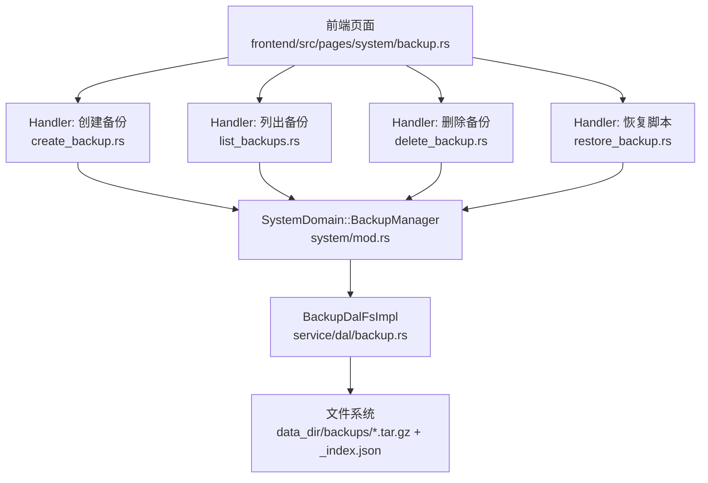
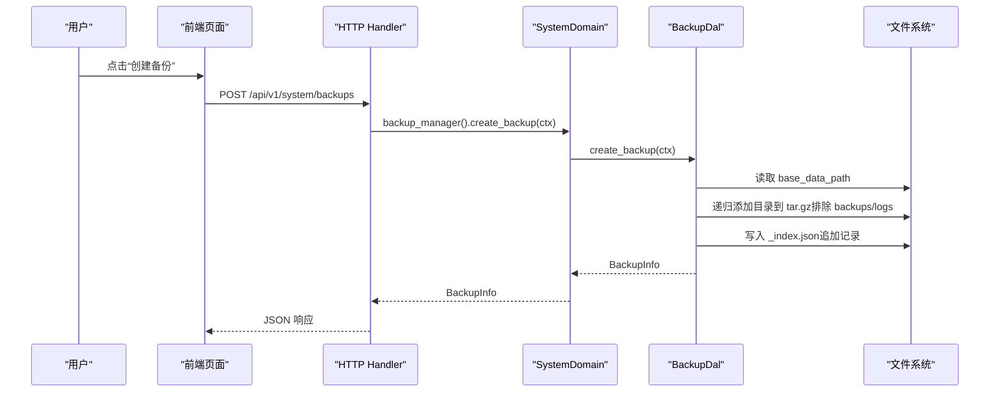
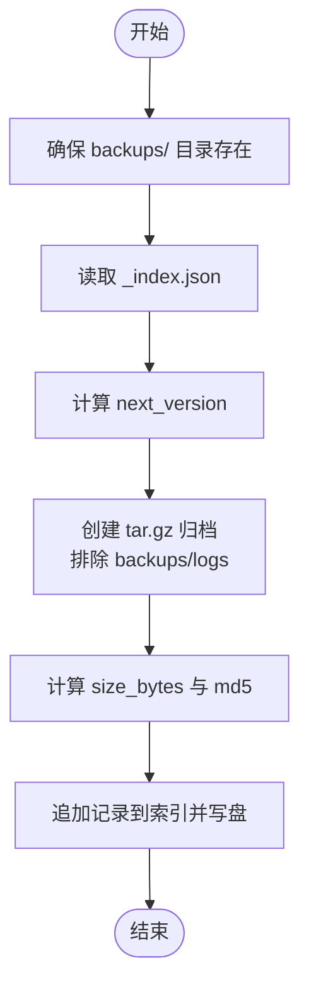
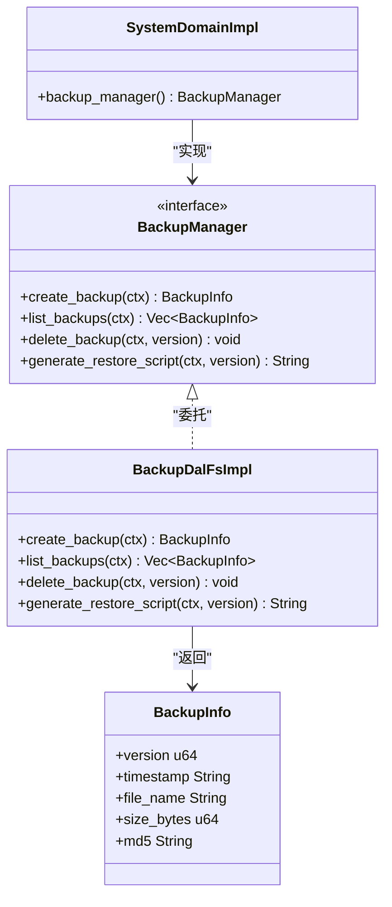

# 备份恢复管理（前端 UI 层）

<cite>
**本文引用的文件**
- [backup.rs](src/service/dal/backup.rs)
- [mod.rs（系统域）](src/service/domain/system/mod.rs)
- [create_backup.rs](src/handlers/system/backup/create_backup.rs)
- [list_backups.rs](src/handlers/system/backup/list_backups.rs)
- [delete_backup.rs](src/handlers/system/backup/delete_backup.rs)
- [restore_backup.rs](src/handlers/system/backup/restore_backup.rs)
- [backup.rs（前端页面）](frontend/src/pages/system/backup.rs)
</cite>

## 目录
1. [简介](#简介)
2. [项目结构](#项目结构)
3. [核心组件](#核心组件)
4. [架构总览](#架构总览)
5. [详细组件分析](#详细组件分析)
6. [依赖关系分析](#依赖关系分析)
7. [性能与容量考量](#性能与容量考量)
8. [故障排除指南](#故障排除指南)
9. [结论](#结论)
10. [附录：API 与文件格式](#附录api-与文件格式)

## 简介
本模块提供系统级数据备份与恢复能力，覆盖以下范围：
- 数据库快照：通过打包数据目录实现“逻辑快照”，包含 SQLite 数据库文件、附件存储、配置文件、知识库文件等。
- 增量备份策略：当前实现为全量归档；版本化索引支持后续扩展增量策略。
- 备份恢复操作：提供创建备份、列出备份、删除备份、生成恢复脚本的能力；恢复以“停止服务 → 解压覆盖 → 重启”的脚本方式执行。
- 进度监控：当前未暴露实时进度接口；可通过后台任务或日志观察。
- 策略配置：未内置定时备份与保留策略；可结合外部 Cron 与运维脚本实现。
- 存储空间管理：压缩归档（tar.gz）、排除敏感目录（backups/logs）、MD5 校验。
- 安全性控制：仅 SuperAdmin 可执行高危操作；传输层由上层路由鉴权保障。
- 验证与完整性：归档 MD5 校验、索引重建机制。
- 灾难恢复：基于版本号的回滚脚本，支持选择性恢复（按版本）。

> 📌 视角说明（AGENTS §2.1.3 Level 3 互补视角平行卡）：
> 本长文是「备份恢复管理」主题的 **前端 UI 层** 视角。同主题还有以下平行视角卡，请按需交叉阅读：
> - [备份恢复管理（业务功能层）](docs/wiki/zh/content/功能模块/系统管理/备份恢复管理.md)

## 项目结构
备份恢复功能遵循四层单向调用：Adapter（HTTP Handler）→ Domain → DAL → DAO（DAL 直接操作文件系统与索引）。

图表来源
- [create_backup.rs:1-27](src/handlers/system/backup/create_backup.rs#L1-L27)
- [list_backups.rs:1-21](src/handlers/system/backup/list_backups.rs#L1-L21)
- [delete_backup.rs:1-25](src/handlers/system/backup/delete_backup.rs#L1-L25)
- [restore_backup.rs:1-35](src/handlers/system/backup/restore_backup.rs#L1-L35)
- [mod.rs（系统域）:143-149](src/service/domain/system/mod.rs#L143-L149)
- [backup.rs（DAL）:70-84](src/service/dal/backup.rs#L70-L84)

章节来源
- [create_backup.rs:1-27](src/handlers/system/backup/create_backup.rs#L1-L27)
- [list_backups.rs:1-21](src/handlers/system/backup/list_backups.rs#L1-L21)
- [delete_backup.rs:1-25](src/handlers/system/backup/delete_backup.rs#L1-L25)
- [restore_backup.rs:1-35](src/handlers/system/backup/restore_backup.rs#L1-L35)
- [mod.rs（系统域）:143-149](src/service/domain/system/mod.rs#L143-L149)
- [backup.rs（DAL）:70-84](src/service/dal/backup.rs#L70-L84)

## 核心组件
- 备份信息模型与索引
  - BackupInfo：记录版本号、时间戳、文件名、大小、MD5。
  - BackupIndex：维护 schema_version 与备份列表，持久化为 _index.json。
- 备份 DAL 接口与实现
  - BackupDal trait：定义 create/list/delete/generate_restore_script。
  - BackupDalFsImpl：基于文件系统的实现，负责 tar.gz 归档、索引读写、MD5 计算、索引重建。
- 系统域聚合
  - SystemDomainImpl 暴露 backup_manager()，将请求委派给 DAL。
- HTTP 处理器
  - 创建、列出、删除、恢复脚本四个 Handler，均受角色中间件保护，并在内部二次校验 SuperAdmin。
- 前端页面
  - 展示备份列表、创建备份、删除确认、恢复脚本预览与复制。

章节来源
- [backup.rs（DAL）:21-52](src/service/dal/backup.rs#L21-L52)
- [backup.rs（DAL）:70-84](src/service/dal/backup.rs#L70-L84)
- [backup.rs（DAL）:88-243](src/service/dal/backup.rs#L88-L243)
- [mod.rs（系统域）:143-149](src/service/domain/system/mod.rs#L143-L149)
- [create_backup.rs:1-27](src/handlers/system/backup/create_backup.rs#L1-L27)
- [list_backups.rs:1-21](src/handlers/system/backup/list_backups.rs#L1-L21)
- [delete_backup.rs:1-25](src/handlers/system/backup/delete_backup.rs#L1-L25)
- [restore_backup.rs:1-35](src/handlers/system/backup/restore_backup.rs#L1-L35)
- [backup.rs（前端页面）:40-153](frontend/src/pages/system/backup.rs#L40-L153)

## 架构总览
备份恢复采用“适配器→领域→数据访问”的清晰分层，避免业务耦合。DAL 层专注文件系统与归档操作，Domain 层做职责聚合，Handler 层只做权限校验与参数传递。

图表来源
- [create_backup.rs:16-26](src/handlers/system/backup/create_backup.rs#L16-L26)
- [mod.rs（系统域）:262-277](src/service/domain/system/mod.rs#L262-L277)
- [backup.rs（DAL）:100-152](src/service/dal/backup.rs#L100-L152)

## 详细组件分析

### 备份数据归档流程（DAL）
- 目标：将数据目录打包为 tar.gz 归档，排除 backups/ 与 logs/ 子目录，避免循环备份与日志膨胀。
- 关键步骤：
  - 确保 backups/ 目录存在。
  - 读取现有索引，计算下一个版本号。
  - 生成 ISO8601 时间戳与文件名 v{version}_{timestamp}.tar.gz。
  - 使用 Builder + GzEncoder 流式写入归档。
  - 计算文件大小与 MD5。
  - 更新索引并落盘。
- 异常处理：
  - 索引不存在时返回默认空索引。
  - 列表为空时扫描目录重建索引（防御性）。
  - 删除时若文件不存在仍保证索引一致性。

图表来源
- [backup.rs（DAL）:100-152](src/service/dal/backup.rs#L100-L152)
- [backup.rs（DAL）:247-266](src/service/dal/backup.rs#L247-L266)
- [backup.rs（DAL）:268-321](src/service/dal/backup.rs#L268-L321)
- [backup.rs（DAL）:342-356](src/service/dal/backup.rs#L342-L356)
- [backup.rs（DAL）:358-394](src/service/dal/backup.rs#L358-L394)

章节来源
- [backup.rs（DAL）:100-152](src/service/dal/backup.rs#L100-L152)
- [backup.rs（DAL）:247-266](src/service/dal/backup.rs#L247-L266)
- [backup.rs（DAL）:268-321](src/service/dal/backup.rs#L268-L321)
- [backup.rs（DAL）:342-356](src/service/dal/backup.rs#L342-L356)
- [backup.rs（DAL）:358-394](src/service/dal/backup.rs#L358-L394)

### 备份列表与删除
- 列表：读取索引并按 version 降序返回；若索引为空则扫描目录重建。
- 删除：根据 version 定位记录，删除对应 .tar.gz 文件，更新索引。

章节来源
- [backup.rs（DAL）:154-196](src/service/dal/backup.rs#L154-L196)

### 恢复脚本生成
- 输入：备份版本号。
- 输出：bash 脚本，内容包含：
  - 提示先停止服务。
  - 自动备份当前 data_dir（移动为带时间戳的 .bak.*）。
  - 解压指定版本的 tar.gz 到 data_dir。
  - 提示重启服务。
- 安全：仅 SuperAdmin 可调用。

章节来源
- [restore_backup.rs:1-35](src/handlers/system/backup/restore_backup.rs#L1-L35)
- [backup.rs（DAL）:198-243](src/service/dal/backup.rs#L198-L243)

### 权限与安全
- 路由层：require_role_middleware(UserRole::Admin) 确保 Admin/SuperAdmin 可进入。
- Handler 内部：check_super_admin 二次校验，仅放行 SuperAdmin。
- 传输层：由上层 Axum 路由与中间件保障认证与授权。

章节来源
- [mod.rs（备份模块）:19-32](src/handlers/system/backup/mod.rs#L19-L32)
- [create_backup.rs:16-26](src/handlers/system/backup/create_backup.rs#L16-L26)
- [delete_backup.rs:14-24](src/handlers/system/backup/delete_backup.rs#L14-L24)
- [restore_backup.rs:18-35](src/handlers/system/backup/restore_backup.rs#L18-L35)

### 前端交互
- 列表展示：版本、时间、文件名、大小、MD5（截断显示）。
- 创建备份：成功后刷新列表。
- 删除确认：弹窗确认后调用删除接口。
- 恢复脚本：弹窗展示脚本，支持复制到剪贴板。

章节来源
- [backup.rs（前端页面）:40-153](frontend/src/pages/system/backup.rs#L40-L153)
- [backup.rs（前端页面）:155-321](frontend/src/pages/system/backup.rs#L155-L321)

## 依赖关系分析
- Handler 依赖 SystemDomain 的 BackupManager 抽象。
- SystemDomain 注入 BackupDal 实现，解耦具体存储细节。
- DAL 依赖配置获取 base_data_path，并使用标准库与第三方库完成归档与校验。
- 前端依赖后端 API 进行 CRUD 与脚本获取。

图表来源
- [mod.rs（系统域）:60-114](src/service/domain/system/mod.rs#L60-L114)
- [mod.rs（系统域）:143-149](src/service/domain/system/mod.rs#L143-L149)
- [backup.rs（DAL）:21-52](src/service/dal/backup.rs#L21-L52)
- [backup.rs（DAL）:70-84](src/service/dal/backup.rs#L70-L84)

章节来源
- [mod.rs（系统域）:60-114](src/service/domain/system/mod.rs#L60-L114)
- [mod.rs（系统域）:143-149](src/service/domain/system/mod.rs#L143-L149)
- [backup.rs（DAL）:21-52](src/service/dal/backup.rs#L21-L52)
- [backup.rs（DAL）:70-84](src/service/dal/backup.rs#L70-L84)

## 性能与容量考量
- 归档性能：使用流式 Builder + GzEncoder，避免一次性加载大文件到内存。
- 排除目录：排除 backups/ 与 logs/，防止重复备份与日志膨胀。
- 索引重建：当索引缺失或为空时，扫描目录重建，提升鲁棒性。
- 容量监控：当前未内置容量监控；建议结合操作系统磁盘监控与定期清理策略。
- 压缩率：tar.gz 压缩比取决于数据内容；对文本类数据（如配置、知识文件）效果较好。

[本节为通用指导，不直接分析具体文件]

## 故障排除指南
- 无法列出备份：
  - 检查 backups/ 目录是否存在；若索引缺失，将触发重建。
  - 查看 _index.json 是否可读且格式正确。
- 创建备份失败：
  - 确认 base_data_path 可写。
  - 检查磁盘空间与权限。
  - 关注 tar 构建过程中的 IO 错误。
- 删除备份失败：
  - 确认版本号存在。
  - 检查 _index.json 中记录与实际文件是否一致。
- 恢复脚本执行失败：
  - 确认已停止服务。
  - 确认 data_dir 路径正确且有写权限。
  - 检查 tar.gz 文件完整性（MD5）。

章节来源
- [backup.rs（DAL）:154-196](src/service/dal/backup.rs#L154-L196)
- [backup.rs（DAL）:198-243](src/service/dal/backup.rs#L198-L243)
- [backup.rs（DAL）:358-394](src/service/dal/backup.rs#L358-L394)

## 结论
本模块提供了稳定、可审计的系统级备份与恢复能力，通过版本化索引与 MD5 校验保障数据完整性，通过排除目录与压缩归档优化存储与性能。当前实现聚焦全量归档与脚本化恢复，适合生产环境的灾难恢复场景。未来可扩展增量备份、定时任务、容量监控与在线恢复等高级特性。

[本节为总结，不直接分析具体文件]

## 附录：API 与文件格式

### HTTP API
- 创建备份
  - 方法：POST
  - 路径：/api/v1/system/backups
  - 权限：SuperAdmin
  - 响应：BackupInfo
- 列出备份
  - 方法：GET
  - 路径：/api/v1/system/backups
  - 权限：Admin/SuperAdmin
  - 响应：Vec<BackupInfo>
- 删除备份
  - 方法：DELETE
  - 路径：/api/v1/system/backups/{version}
  - 权限：SuperAdmin
  - 响应：无
- 恢复脚本
  - 方法：GET
  - 路径：/api/v1/system/backups/{version}/restore
  - 权限：SuperAdmin
  - 响应：text/plain（bash 脚本）

章节来源
- [create_backup.rs:16-26](src/handlers/system/backup/create_backup.rs#L16-L26)
- [list_backups.rs:13-21](src/handlers/system/backup/list_backups.rs#L13-L21)
- [delete_backup.rs:14-24](src/handlers/system/backup/delete_backup.rs#L14-L24)
- [restore_backup.rs:18-35](src/handlers/system/backup/restore_backup.rs#L18-L35)

### 备份文件格式
- 归档：tar.gz
- 索引：_index.json（schema_version 与 backups 列表）
- 元信息：BackupInfo（version、timestamp、file_name、size_bytes、md5）

章节来源
- [backup.rs（DAL）:21-52](src/service/dal/backup.rs#L21-L52)
- [backup.rs（DAL）:247-266](src/service/dal/backup.rs#L247-L266)

### 迁移兼容性
- 当前版本 schema_version=1；若未来升级索引结构，需考虑向后兼容与迁移策略。
- 文件名约定：v{version}_{timestamp}.tar.gz；解析版本号用于排序与恢复。

章节来源
- [backup.rs（DAL）:35-52](src/service/dal/backup.rs#L35-L52)
- [backup.rs（DAL）:358-394](src/service/dal/backup.rs#L358-L394)