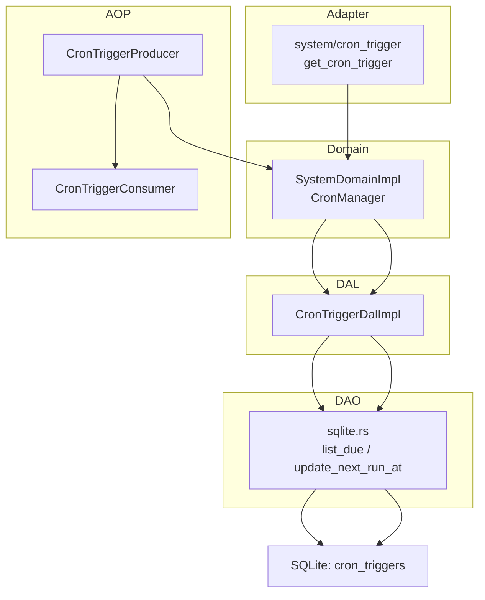
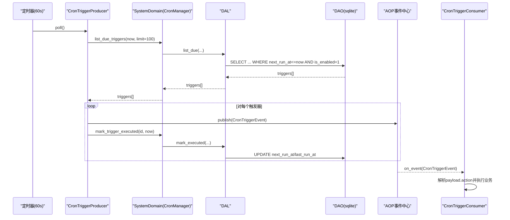
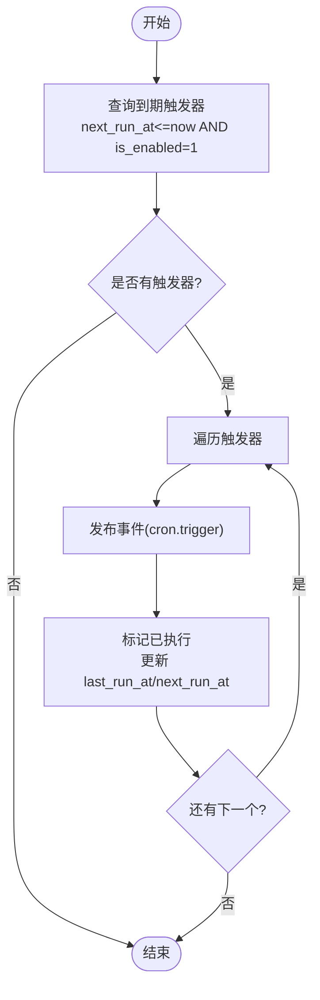
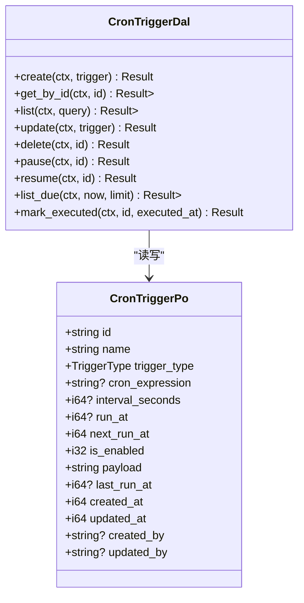
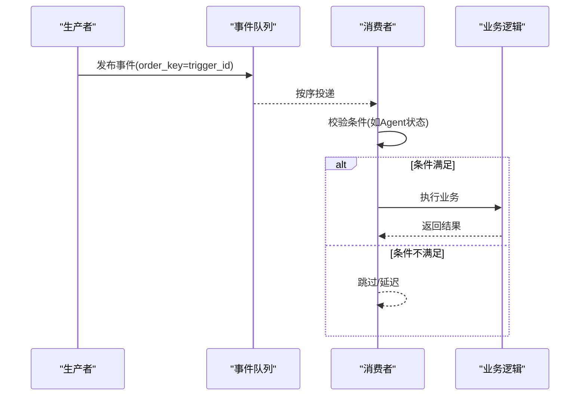
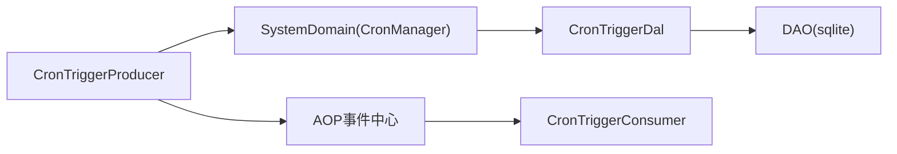

# 定时任务调度（前端 UI 层）

<cite>
**本文引用的文件**
- [cron_trigger.rs（模型）](src/models/cron_trigger.rs)
- [cron_trigger.rs（事件）](src/models/events/cron_trigger.rs)
- [cron_trigger.rs（生产者）](src/producer/cron_trigger.rs)
- [scheduler.rs（消费者）](src/consumer/scheduler.rs)
- [sqlite.rs（DAO 实现）](src/service/dao/cron_trigger/sqlite.rs)
- [cron_trigger.rs（DAL）](src/service/dal/cron_trigger.rs)
- [mod.rs（系统域 CronManager 实现）](src/service/domain/system/mod.rs)
- [cron_trigger.rs（公共枚举）](common/src/enums/cron_trigger.rs)
- [cron_trigger.rs（公共 API DTO）](common/src/api/cron_trigger.rs)
- [get_cron_trigger.rs（处理器）](src/handlers/system/cron_trigger/get_cron_trigger.rs)
- [response.rs（处理器响应 DTO）](src/handlers/system/cron_trigger/response.rs)
- [20260711000000_cron_triggers.sql（数据库迁移）](migrations/20260711000000_cron_triggers.sql)
- [20260806000001_execution_plan_result.sql（执行计划/结果字段）](migrations/20260806000001_execution_plan_result.sql)
- [task.rs（任务模型）](src/models/task.rs)
- [triggers.rs（前端触发器页面片段）](frontend/src/pages/system/triggers.rs)
</cite>

## 目录
1. [简介](#简介)
2. [项目结构](#项目结构)
3. [核心组件](#核心组件)
4. [架构总览](#架构总览)
5. [详细组件分析](#详细组件分析)
6. [依赖关系分析](#依赖关系分析)
7. [性能与扩展性](#性能与扩展性)
8. [故障排查指南](#故障排查指南)
9. [结论](#结论)
10. [附录：最佳实践与常见问题](#附录：最佳实践与常见问题)

## 简介
本章节面向“定时任务调度”子系统，围绕 Cron 表达式配置、任务管理、执行历史追踪、任务依赖关系、任务类型支持、执行环境隔离、监控告警、调试工具与故障恢复进行系统化说明。该子系统基于四层单向调用（Adapter → Domain → DAL → DAO），通过 AOP 事件中心驱动生产-消费解耦，使用 SQLite 持久化触发器配置，并预留 Cron 表达式解析扩展点。

> 📌 视角说明（AGENTS §2.1.3 Level 3 互补视角平行卡）：
> 本长文是「定时任务调度」主题的 **前端 UI 层** 视角。同主题还有以下平行视角卡，请按需交叉阅读：
> - [定时任务调度（业务功能层）](docs/wiki/zh/content/功能模块/系统管理/定时任务调度.md)

## 项目结构
定时任务调度涉及以下关键层次与文件：
- Adapter（HTTP Handler）：提供触发器的创建、查询、更新、删除、暂停/恢复等接口。
- Domain（系统域 CronManager）：对外暴露触发器管理能力，统一入口。
- DAL（CronTriggerDal）：封装业务级数据访问语义（如暂停/恢复、计算下次执行时间）。
- DAO（SQLite 实现）：直接操作 cron_triggers 表，负责到期扫描与状态更新。
- Producer/Consumer（AOP 事件）：生产者轮询到期触发器并发布事件；消费者按 payload.action 分发到具体业务逻辑。
- 前端：系统管理页展示触发器列表与基础编辑能力。

**图表来源**
- [get_cron_trigger.rs:11-25](src/handlers/system/cron_trigger/get_cron_trigger.rs#L11-L25)
- [mod.rs:206-230](src/service/domain/system/mod.rs#L206-L230)
- [cron_trigger.rs（DAL）:37-74](src/service/dal/cron_trigger.rs#L37-L74)
- [sqlite.rs:166-213](src/service/dao/cron_trigger/sqlite.rs#L166-L213)
- [cron_trigger.rs（生产者）:26-87](src/producer/cron_trigger.rs#L26-L87)
- [scheduler.rs:39-95](src/consumer/scheduler.rs#L39-L95)

**章节来源**
- [cron_trigger.rs（模型）:10-66](src/models/cron_trigger.rs#L10-L66)
- [cron_trigger.rs（事件）:1-30](src/models/events/cron_trigger.rs#L1-L30)
- [cron_trigger.rs（生产者）:1-88](src/producer/cron_trigger.rs#L1-L88)
- [scheduler.rs:1-211](src/consumer/scheduler.rs#L1-L211)
- [sqlite.rs:166-213](src/service/dao/cron_trigger/sqlite.rs#L166-L213)
- [cron_trigger.rs（DAL）:1-177](src/service/dal/cron_trigger.rs#L1-L177)
- [mod.rs:206-230](src/service/domain/system/mod.rs#L206-L230)
- [cron_trigger.rs（公共枚举）:1-47](common/src/enums/cron_trigger.rs#L1-L47)
- [cron_trigger.rs（公共 API DTO）:1-105](common/src/api/cron_trigger.rs#L1-L105)
- [get_cron_trigger.rs:1-25](src/handlers/system/cron_trigger/get_cron_trigger.rs#L1-L25)
- [response.rs:8-96](src/handlers/system/cron_trigger/response.rs#L8-L96)
- [20260711000000_cron_triggers.sql:1-25](migrations/20260711000000_cron_triggers.sql#L1-L25)
- [20260806000001_execution_plan_result.sql:1-9](migrations/20260806000001_execution_plan_result.sql#L1-L9)

## 核心组件
- 触发器模型与持久化：CronTriggerPo 定义触发器配置与运行元数据（类型、表达式/间隔/一次性时间、下次执行时间、是否启用、负载、上次执行时间等）。
- 领域能力：SystemDomainImpl::CronManager 提供创建、查询、更新、删除、暂停/恢复、获取到期触发器等能力。
- 数据访问层：DAL 封装业务语义（如根据类型计算下次执行时间、一次性触发后禁用等），DAO 实现 SQL 查询与更新。
- 事件驱动：CronTriggerProducer 周期性扫描到期触发器并发布事件；CronTriggerConsumer 订阅事件并按 action 路由到业务处理。
- 前端界面：系统管理页提供触发器列表展示与基础编辑能力。

**章节来源**
- [cron_trigger.rs（模型）:10-66](src/models/cron_trigger.rs#L10-L66)
- [mod.rs:206-230](src/service/domain/system/mod.rs#L206-L230)
- [cron_trigger.rs（DAL）:37-177](src/service/dal/cron_trigger.rs#L37-L177)
- [sqlite.rs:166-213](src/service/dao/cron_trigger/sqlite.rs#L166-L213)
- [cron_trigger.rs（生产者）:26-87](src/producer/cron_trigger.rs#L26-L87)
- [scheduler.rs:39-211](src/consumer/scheduler.rs#L39-L211)
- [triggers.rs:113-150](frontend/src/pages/system/triggers.rs#L113-L150)

## 架构总览
定时任务调度采用“生产者-事件中心-消费者”的异步解耦模式：
- 生产者每 60 秒轮询一次，查询 next_run_at <= now 且启用的触发器，发布 cron.trigger 事件，并立即标记已执行（更新 last_run_at 与 next_run_at）。
- 消费者同步消费事件，解析 payload.action 并调用领域服务完成具体业务（如 agent_rest、project_followup）。
- 所有数据变更通过 DAL/DAO 落库，保证一致性。

**图表来源**
- [cron_trigger.rs（生产者）:38-87](src/producer/cron_trigger.rs#L38-L87)
- [mod.rs:206-230](src/service/domain/system/mod.rs#L206-L230)
- [cron_trigger.rs（DAL）:131-177](src/service/dal/cron_trigger.rs#L131-L177)
- [sqlite.rs:166-213](src/service/dao/cron_trigger/sqlite.rs#L166-L213)
- [scheduler.rs:39-95](src/consumer/scheduler.rs#L39-L95)

## 详细组件分析

### Cron 表达式与执行计划
- 触发类型：
  - Once：一次性触发，执行后自动禁用。
  - Interval：固定间隔触发，执行后按 interval_seconds 计算下一次执行时间。
  - Cron：表达式触发，当前实现返回“不支持”错误，需后续扩展解析逻辑。
- 执行计划设计：
  - 通过 next_run_at 字段控制调度时机，索引优化查询性能。
  - 生产者批量拉取（limit=100）避免单次过多 IO。
  - 消费者同步处理，确保同一触发器顺序执行（order_key=trigger_id）。

**图表来源**
- [cron_trigger.rs（生产者）:42-87](src/producer/cron_trigger.rs#L42-L87)
- [sqlite.rs:166-213](src/service/dao/cron_trigger/sqlite.rs#L166-L213)
- [cron_trigger.rs（DAL）:140-177](src/service/dal/cron_trigger.rs#L140-L177)

**章节来源**
- [cron_trigger.rs（DAL）:140-177](src/service/dal/cron_trigger.rs#L140-L177)
- [cron_trigger.rs（生产者）:42-87](src/producer/cron_trigger.rs#L42-L87)
- [sqlite.rs:166-213](src/service/dao/cron_trigger/sqlite.rs#L166-L213)
- [cron_trigger.rs（公共枚举）:9-22](common/src/enums/cron_trigger.rs#L9-L22)

### 任务管理功能（CRUD、启用/禁用）
- 创建：通过 CreateCronTriggerRequest 指定名称、类型、表达式/间隔/一次性时间、负载 JSON。
- 查询：支持按类型、是否启用、分页限制查询；详情接口按 ID 获取。
- 更新：可修改名称、类型、表达式/间隔/一次性时间、负载。
- 删除：软删除或物理删除（由 DAO 实现决定）。
- 启用/禁用：pause/resume 更新 is_enabled 并记录修改人。

**图表来源**
- [cron_trigger.rs（模型）:10-66](src/models/cron_trigger.rs#L10-L66)
- [cron_trigger.rs（DAL）:37-74](src/service/dal/cron_trigger.rs#L37-L74)

**章节来源**
- [cron_trigger.rs（公共 API DTO）:8-43](common/src/api/cron_trigger.rs#L8-L43)
- [response.rs:8-96](src/handlers/system/cron_trigger/response.rs#L8-L96)
- [get_cron_trigger.rs:11-25](src/handlers/system/cron_trigger/get_cron_trigger.rs#L11-L25)
- [cron_trigger.rs（DAL）:109-129](src/service/dal/cron_trigger.rs#L109-L129)

### 执行历史追踪（执行记录、成功失败状态、耗时统计）
- 执行记录：每次触发在数据库中记录 last_run_at，并在事件中包含 created_at。
- 成功/失败状态：当前未显式记录执行结果状态，可在消费者中扩展记录执行结果与错误信息。
- 耗时统计：可通过 AOP 统计框架或自定义埋点记录消费者处理耗时，结合 DuckDB 统计能力进行分析。

建议扩展点：
- 在消费者 on_event 成功后写入 execution_result 与 duration_ms。
- 在失败路径记录 error 与重试次数。

**章节来源**
- [cron_trigger.rs（事件）:4-30](src/models/events/cron_trigger.rs#L4-L30)
- [sqlite.rs:189-213](src/service/dao/cron_trigger/sqlite.rs#L189-L213)
- [20260806000001_execution_plan_result.sql:1-9](migrations/20260806000001_execution_plan_result.sql#L1-L9)

### 任务依赖关系（串行、并行、条件触发）
- 串行执行：通过 order_key=trigger_id 保证同一触发器的事件顺序消费。
- 并行执行：不同触发器之间可并行处理（取决于事件队列与消费者并发度）。
- 条件触发：通过 payload.extra 传递上下文参数，消费者内部做条件判断（如 Agent 运行时状态检查）。

**图表来源**
- [cron_trigger.rs（事件）:13-29](src/models/events/cron_trigger.rs#L13-L29)
- [scheduler.rs:139-194](src/consumer/scheduler.rs#L139-L194)

**章节来源**
- [scheduler.rs:139-194](src/consumer/scheduler.rs#L139-L194)

### 任务类型支持（系统维护、数据同步、报告生成、清理任务）
- 系统维护：agent_rest（记忆沉淀）、project_followup（项目进度巡检）已实现。
- 数据同步：可扩展为新的 action，通过 payload.extra 传入同步目标与策略。
- 报告生成：新增 action，消费者调用报告生成领域服务。
- 清理任务：新增 action，调用清理领域服务（如过期数据清理）。

**章节来源**
- [scheduler.rs:78-91](src/consumer/scheduler.rs#L78-L91)
- [scheduler.rs:104-194](src/consumer/scheduler.rs#L104-L194)

### 执行环境隔离（资源限制、超时控制、错误重试）
- 资源限制：消费者同步处理，避免单触发器长时间占用；可通过外部限流控制并发。
- 超时控制：建议在消费者中对长耗时操作添加超时保护（参考文档中的 think 超时示例）。
- 错误重试：当前消费者同步模式，失败将阻塞队列；可引入重试机制与死信队列。

**章节来源**
- [scheduler.rs:49-51](src/consumer/scheduler.rs#L49-L51)

### 监控告警（执行失败通知、性能异常检测、资源使用监控）
- 执行失败通知：可在消费者失败时发送通知（邮件/IM）。
- 性能异常检测：利用 AOP 统计与 DuckDB 分析执行耗时与吞吐。
- 资源使用监控：结合系统指标（CPU/内存/IO）与队列积压情况设置阈值告警。

**章节来源**
- [scheduler.rs:83-90](src/consumer/scheduler.rs#L83-L90)

### 任务调试工具（手动触发、日志查看、参数测试）
- 手动触发：可通过 API 临时创建一次性触发器或调用领域方法模拟触发。
- 日志查看：生产者与消费者均输出结构化日志，便于定位问题。
- 参数测试：通过 payload.extra 传入测试参数，验证业务逻辑分支。

**章节来源**
- [cron_trigger.rs（公共 API DTO）:8-43](common/src/api/cron_trigger.rs#L8-L43)
- [cron_trigger.rs（生产者）:64-83](src/producer/cron_trigger.rs#L64-L83)
- [scheduler.rs:58-76](src/consumer/scheduler.rs#L58-L76)

### 故障恢复机制（失败重试、死锁检测、资源清理）
- 失败重试：建议引入指数退避重试与最大重试次数限制。
- 死锁检测：监控队列积压与 oldest_event_age_secs，超过阈值触发告警。
- 资源清理：定期清理已完成/失败的触发器记录，释放存储。

**章节来源**
- [scheduler.rs:83-90](src/consumer/scheduler.rs#L83-L90)

## 依赖关系分析
- 耦合度：
  - Producer 依赖 Domain/DAL/DAO 读取与更新触发器状态。
  - Consumer 依赖事件结构与 payload 约定，与业务领域解耦。
- 内聚性：
  - DAL 封装触发器生命周期与调度逻辑，DAO 专注 SQL。
  - Domain 提供统一入口，屏蔽底层细节。
- 外部依赖：
  - SQLite 用于持久化。
  - AOP 事件中心用于解耦生产与消费。

**图表来源**
- [cron_trigger.rs（生产者）:26-87](src/producer/cron_trigger.rs#L26-L87)
- [mod.rs:206-230](src/service/domain/system/mod.rs#L206-L230)
- [cron_trigger.rs（DAL）:37-74](src/service/dal/cron_trigger.rs#L37-L74)
- [sqlite.rs:166-213](src/service/dao/cron_trigger/sqlite.rs#L166-L213)
- [scheduler.rs:39-95](src/consumer/scheduler.rs#L39-L95)

**章节来源**
- [cron_trigger.rs（生产者）:26-87](src/producer/cron_trigger.rs#L26-L87)
- [mod.rs:206-230](src/service/domain/system/mod.rs#L206-L230)
- [cron_trigger.rs（DAL）:37-74](src/service/dal/cron_trigger.rs#L37-L74)
- [sqlite.rs:166-213](src/service/dao/cron_trigger/sqlite.rs#L166-L213)
- [scheduler.rs:39-95](src/consumer/scheduler.rs#L39-L95)

## 性能与扩展性
- 查询优化：next_run_at 与 is_enabled 建立索引，提升到期扫描效率。
- 批处理：生产者每次最多拉取 100 条，避免单次过大负载。
- 扩展点：
  - Cron 表达式解析：当前返回“不支持”，需实现解析器并更新 mark_executed。
  - 执行结果记录：在消费者中扩展 execution_result 与 duration_ms。
  - 重试与死信：引入重试策略与失败队列。

**章节来源**
- [sqlite.rs:166-213](src/service/dao/cron_trigger/sqlite.rs#L166-L213)
- [cron_trigger.rs（生产者）:55-83](src/producer/cron_trigger.rs#L55-L83)
- [cron_trigger.rs（DAL）:168-173](src/service/dal/cron_trigger.rs#L168-L173)

## 故障排查指南
- 常见问题：
  - Cron 表达式类型不可用：当前实现返回“不支持”，需实现解析逻辑。
  - 触发器未执行：检查 next_run_at 与 is_enabled 字段是否正确。
  - 消费者处理失败：查看日志中 unknown action 或 payload 解析错误。
- 排查步骤：
  - 确认触发器状态与负载格式正确。
  - 检查事件队列积压与消费者健康状态。
  - 验证数据库索引与查询性能。

**章节来源**
- [cron_trigger.rs（DAL）:168-173](src/service/dal/cron_trigger.rs#L168-L173)
- [scheduler.rs:83-90](src/consumer/scheduler.rs#L83-L90)

## 结论
定时任务调度子系统通过清晰的层次划分与事件驱动架构，实现了触发器配置的持久化管理与执行流程的解耦。当前已支持一次性与固定间隔触发，Cron 表达式解析待扩展。建议补充执行结果记录、重试机制与监控告警，以提升系统的可靠性与可观测性。

## 附录：最佳实践与常见问题
- 最佳实践：
  - 使用 payload.extra 传递上下文参数，保持消费者通用性。
  - 为长耗时操作添加超时保护，避免资源泄漏。
  - 定期清理已完成/失败的触发器记录，释放存储。
- 常见问题解决方案：
  - Cron 表达式不可用：实现解析器并更新 mark_executed。
  - 触发器未执行：检查 next_run_at 与 is_enabled。
  - 消费者处理失败：查看日志并修复 payload 格式。

**章节来源**
- [cron_trigger.rs（DAL）:168-173](src/service/dal/cron_trigger.rs#L168-L173)
- [scheduler.rs:83-90](src/consumer/scheduler.rs#L83-L90)