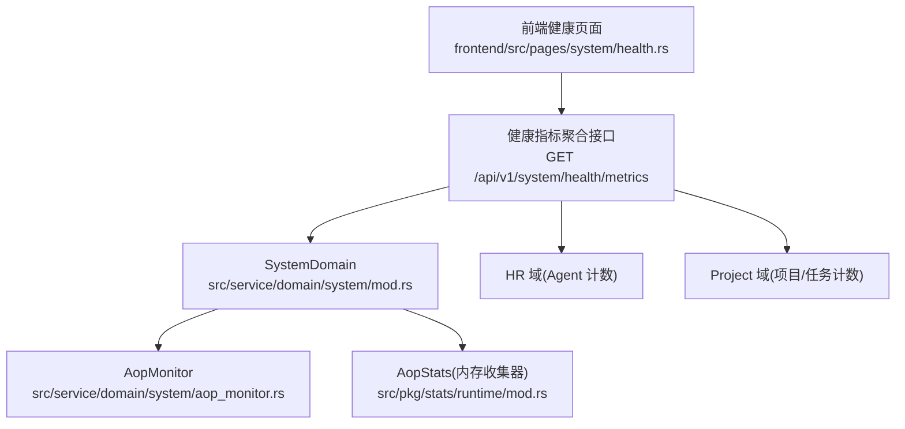
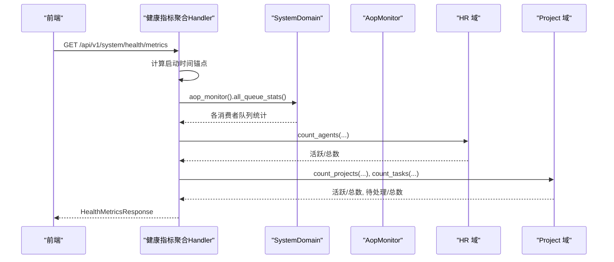
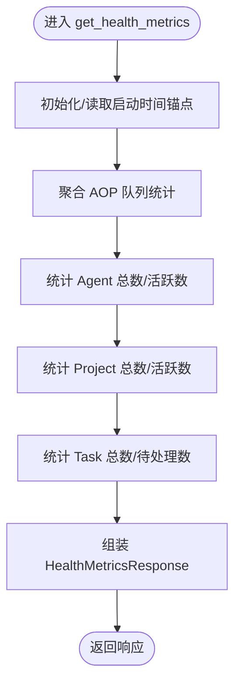
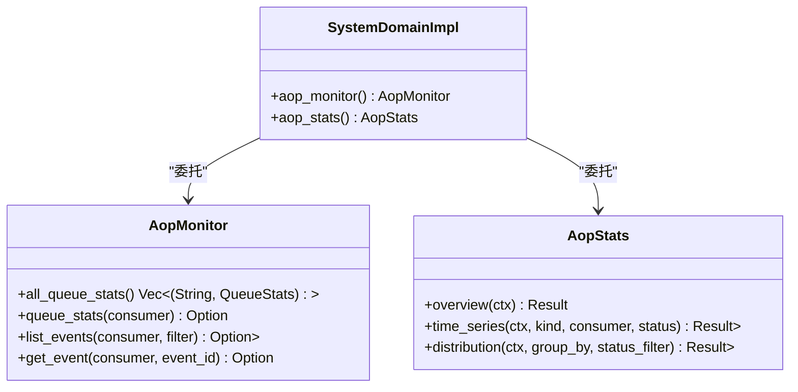
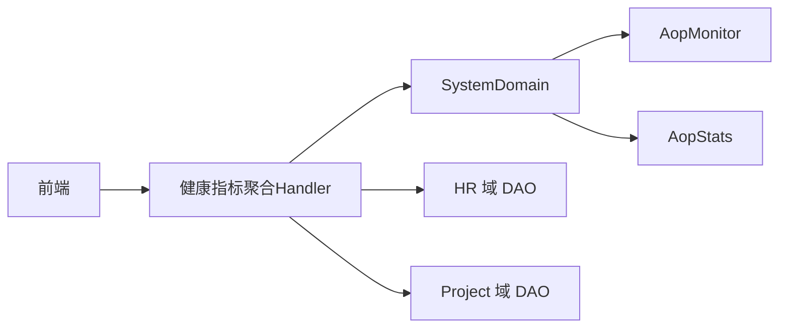

# 系统健康检查

<cite>
**本文引用的文件**
- [src/handlers/health.rs](src/handlers/health.rs)
- [src/handlers/system/health_metrics.rs](src/handlers/system/health_metrics.rs)
- [common/src/api/system.rs](common/src/api/system.rs)
- [src/service/domain/system/mod.rs](src/service/domain/system/mod.rs)
- [src/service/domain/system/aop_monitor.rs](src/service/domain/system/aop_monitor.rs)
- [src/handlers/system/aop.rs](src/handlers/system/aop.rs)
- [frontend/src/pages/system/health.rs](frontend/src/pages/system/health.rs)
- [frontend/src/layouts/navbar.rs](frontend/src/layouts/navbar.rs)
- [src/config.rs](src/config.rs)
- [src/pkg/stats/mod.rs](src/pkg/stats/mod.rs)
- [src/pkg/stats/runtime/mod.rs](src/pkg/stats/runtime/mod.rs)
- （2026-09-04 清理：superpowers 目录已归档，待 doc-maintainer 跟进）
- [src/handlers/finance/model_provider/test_connection.rs](src/handlers/finance/model_provider/test_connection.rs)
</cite>

## 目录
1. [简介](#简介)
2. [项目结构](#项目结构)
3. [核心组件](#核心组件)
4. [架构总览](#架构总览)
5. [详细组件分析](#详细组件分析)
6. [依赖关系分析](#依赖关系分析)
7. [性能与容量](#性能与容量)
8. [故障诊断与恢复](#故障诊断与恢复)
9. [告警与可视化](#告警与可视化)
10. [维护与自动化](#维护与自动化)
11. [结论](#结论)

## 简介
本文件面向“系统健康检查”能力，覆盖服务状态监控、性能指标采集、故障诊断工具、告警配置管理、健康检查策略、指标可视化展示、故障自愈机制、系统维护操作与运维自动化脚本，以及常见故障模式、诊断方法与恢复策略。内容基于仓库中已实现的健康端点、AOP 监控、统计收集器与前端仪表盘进行说明，并给出可扩展的实践建议。

## 项目结构
健康检查相关代码主要分布在以下层次：
- Adapter（HTTP Handler）层：提供健康探针与健康指标聚合接口，暴露给前端或外部监控系统。
- Domain/DAL/DAO 层：通过 SystemDomain 的 AopMonitor/AopStats 等能力，聚合 AOP 队列与统计信息；同时聚合 Agent/Project/Task 等业务维度计数。
- pkg 层：提供运行时统计基础设施（内存型 RuntimeStatsCollector）与持久化统计（DuckDB），支撑实时与历史指标。
- 前端：系统健康页面以 HUD 形式轮询后端指标，使用 Gauge 组件进行可视化。

**图表来源**
- [src/handlers/system/health_metrics.rs:1-135](src/handlers/system/health_metrics.rs#L1-L135)
- [src/service/domain/system/mod.rs:102-204](src/service/domain/system/mod.rs#L102-L204)
- [src/service/domain/system/aop_monitor.rs:1-27](src/service/domain/system/aop_monitor.rs#L1-L27)
- [src/pkg/stats/runtime/mod.rs:1-37](src/pkg/stats/runtime/mod.rs#L1-L37)

**章节来源**
- [src/handlers/system/health_metrics.rs:1-135](src/handlers/system/health_metrics.rs#L1-L135)
- [frontend/src/pages/system/health.rs:1-54](frontend/src/pages/system/health.rs#L1-L54)
- [src/service/domain/system/mod.rs:102-204](src/service/domain/system/mod.rs#L102-L204)

## 核心组件
- 基础健康探针：返回进程版本与在线状态，用于存活探测。
- 健康指标聚合：统一聚合 AOP 队列深度、运行时长、活跃 Agent/项目、待处理任务数等。
- AOP 监控与统计：提供队列快照、事件列表、概览与时序分布，支撑健康评分与告警。
- 运行时统计：内存型收集器提供低开销的滑动窗口时序数据，适合实时看板。
- 前端 HUD：10 秒轮询刷新，按阈值着色，直观呈现系统健康度。

**章节来源**
- [src/handlers/health.rs:1-16](src/handlers/health.rs#L1-L16)
- [src/handlers/system/health_metrics.rs:1-135](src/handlers/system/health_metrics.rs#L1-L135)
- [common/src/api/system.rs:1-37](common/src/api/system.rs#L1-L37)
- [src/service/domain/system/mod.rs:172-204](src/service/domain/system/mod.rs#L172-L204)
- [src/pkg/stats/runtime/mod.rs:1-37](src/pkg/stats/runtime/mod.rs#L1-L37)
- [frontend/src/pages/system/health.rs:1-54](frontend/src/pages/system/health.rs#L1-L54)

## 架构总览
健康检查采用“单点聚合 + 多源拉取”的架构：前端仅调用一个健康指标聚合接口，由后端在 handler 内并行/顺序访问多个域与子系统，汇总后返回。AOP 监控通过 SystemDomain 暴露，统计通过内存收集器提供，业务计数通过 HR/Project 域 DAO 查询。

**图表来源**
- [src/handlers/system/health_metrics.rs:33-135](src/handlers/system/health_metrics.rs#L33-L135)
- [src/service/domain/system/aop_monitor.rs:7-27](src/service/domain/system/aop_monitor.rs#L7-L27)

**章节来源**
- [src/handlers/system/health_metrics.rs:1-135](src/handlers/system/health_metrics.rs#L1-L135)
- [common/src/api/system.rs:7-33](common/src/api/system.rs#L7-L33)

## 详细组件分析

### 基础健康探针
- 功能：返回服务在线与版本信息，适合作为 Kubernetes Liveness/Readiness 探针或负载均衡健康检查。
- 特点：无副作用、极低开销、快速响应。

**章节来源**
- [src/handlers/health.rs:1-16](src/handlers/health.rs#L1-L16)

### 健康指标聚合接口
- 功能：聚合后端在线、AOP 队列待处理/处理中、进程运行时长、活跃 Agent/项目、待处理任务等。
- 设计要点：
  - 使用全局 OnceLock 记录首次请求时间作为 uptime 近似值，避免侵入启动流程。
  - 通过 SystemDomain.aop_monitor() 获取所有消费者队列快照，累加 pending/in_progress。
  - 通过 HR/Project 域的 DAO 查询计数，支持状态过滤（如排除 Deleted、限定 Active/InProgress）。
- 输出模型：HealthMetricsResponse 字段明确定义，便于前端渲染与阈值判断。

**图表来源**
- [src/handlers/system/health_metrics.rs:33-135](src/handlers/system/health_metrics.rs#L33-L135)

**章节来源**
- [src/handlers/system/health_metrics.rs:1-135](src/handlers/system/health_metrics.rs#L1-L135)
- [common/src/api/system.rs:7-33](common/src/api/system.rs#L7-L33)

### AOP 监控与统计
- AopMonitor：提供 all_queue_stats、queue_stats、list_events、get_event，用于查看消费者队列深度、事件明细与最老事件年龄。
- AopStats：提供 overview、time_series、distribution，基于内存收集器（最近 60 分钟，按分钟桶），零 DB 依赖，重启重置。
- 埋点位置：发布阶段与消费阶段均注入 on_publish/on_consume_start/on_consume_success/on_consume_failure，便于计算成功率与平均耗时。

**图表来源**
- [src/service/domain/system/mod.rs:102-204](src/service/domain/system/mod.rs#L102-L204)
- [src/service/domain/system/aop_monitor.rs:1-27](src/service/domain/system/aop_monitor.rs#L1-L27)

**章节来源**
- [src/service/domain/system/mod.rs:172-204](src/service/domain/system/mod.rs#L172-L204)
- [src/service/domain/system/aop_monitor.rs:1-27](src/service/domain/system/aop_monitor.rs#L1-L27)
- （2026-09-04 清理：superpowers 目录已归档，待 doc-maintainer 跟进）

### 前端健康仪表盘
- 功能：10 秒轮询健康指标，使用 Gauge 组件展示 AOP 队列深度、活跃比例、待处理任务、运行时长等。
- 颜色策略：根据阈值将指标映射到绿/黄/红，帮助快速识别异常。
- 导航入口：侧边栏菜单包含“健康检查”，便于管理员快速定位。

**章节来源**
- [frontend/src/pages/system/health.rs:1-54](frontend/src/pages/system/health.rs#L1-L54)
- [frontend/src/layouts/navbar.rs:321-344](frontend/src/layouts/navbar.rs#L321-L344)

### 外部连通性测试（示例）
- 模型提供者连接测试：通过 POST /api/v1/model-providers/{id}/test 发送示例提示词验证连通性与鉴权，可作为外部 API 验证模板。

**章节来源**
- [src/handlers/finance/model_provider/test_connection.rs:1-38](src/handlers/finance/model_provider/test_connection.rs#L1-L38)

## 依赖关系分析
- Handler 层依赖 SystemDomain 抽象，解耦具体实现；SystemDomain 再委托 AopMonitor/AopStats 与 DAL/DAO。
- 健康指标聚合对 HR/Project 域的 DAO 存在直接依赖，用于计数；AOP 监控通过 Registry 暴露队列状态。
- 前端依赖 common 定义的 HealthMetricsResponse 数据结构，保证前后端契约一致。

**图表来源**
- [src/handlers/system/health_metrics.rs:19-26](src/handlers/system/health_metrics.rs#L19-L26)
- [src/service/domain/system/mod.rs:102-204](src/service/domain/system/mod.rs#L102-L204)

**章节来源**
- [src/handlers/system/health_metrics.rs:1-135](src/handlers/system/health_metrics.rs#L1-L135)
- [src/service/domain/system/mod.rs:102-204](src/service/domain/system/mod.rs#L102-L204)

## 性能与容量
- 健康指标聚合：单次请求触发多次域查询与 AOP 队列快照，建议在高峰期控制并发或引入缓存（例如短期缓存队列快照）。
- AOP 统计：内存收集器使用滑动窗口（60 分钟，按分钟桶），内存占用估算约数十 KB，适合高频查询。
- 日志时序：LogQuery 支持按小时桶聚合，限制扫描条目上限，避免大窗口下的性能问题。
- 退避策略：AOP worker 在 on_event 失败后加入 sleep，避免 CPU 紧密自旋，降低资源消耗。

**章节来源**
- [src/pkg/stats/runtime/mod.rs:1-37](src/pkg/stats/runtime/mod.rs#L1-L37)
- [src/service/domain/system/mod.rs:280-342](src/service/domain/system/mod.rs#L280-L342)
- （2026-09-04 清理：superpowers 目录已归档，待 doc-maintainer 跟进）

## 故障诊断与恢复
- 队列积压诊断：通过 AOP 监控接口查看消费者队列 pending/in_progress 与最老事件年龄，定位慢消费者或阻塞任务。
- 事件排查：按消费者名称列出事件摘要与详情，结合错误信息进行根因分析。
- 失败重试与退避：on_event 失败会 nack 并 sleep，防止雪崩；需关注错误率与平均耗时趋势。
- 外部依赖验证：参考模型提供者连接测试，扩展数据库连接检查、外部 API 验证等健康检查项。

**章节来源**
- [src/handlers/system/aop.rs:40-86](src/handlers/system/aop.rs#L40-L86)
- （2026-09-04 清理：superpowers 目录已归档，待 doc-maintainer 跟进）
- [src/handlers/finance/model_provider/test_connection.rs:1-38](src/handlers/finance/model_provider/test_connection.rs#L1-L38)

## 告警与可视化
- 健康评分策略（建议）：
  - 主动探测：定期调用基础健康探针与健康指标聚合接口，判定后端在线与关键指标是否达标。
  - 被动监控：基于 AOP 统计的失败率、平均耗时、队列深度变化趋势进行预警。
  - 健康评分算法（建议）：加权组合 backend_online、aop_pending、aop_in_progress、active_agents/total_agents、pending_tasks/total_tasks，设置多级阈值（绿/黄/红）。
- 指标可视化：
  - 实时图表：前端 HUD 使用 Gauge 组件展示当前值与阈值颜色。
  - 历史趋势：利用 AopStats.time_series 与 LogQuery.time_series 绘制近 60 分钟趋势。
  - 对比分析：按 consumer/status/kind 分组 distribution，对比不同消费者或状态的性能差异。
- 告警规则与通知渠道（建议）：
  - 阈值设置：aop_pending≥10、aop_in_progress>0 持续 N 分钟、失败率>5%、平均耗时>阈值。
  - 通知渠道：邮件、Webhook、IM 机器人等，结合消息通道能力推送告警。

**章节来源**
- [frontend/src/pages/system/health.rs:20-48](frontend/src/pages/system/health.rs#L20-L48)
- [src/service/domain/system/mod.rs:183-204](src/service/domain/system/mod.rs#L183-L204)
- （2026-09-04 清理：superpowers 目录已归档，待 doc-maintainer 跟进）

## 维护与自动化
- 服务重启：通过进程管理器（systemd/docker）重启；健康探针可用于自动重启决策。
- 配置热更新：当前配置加载为一次性初始化，可在启动时重新加载或通过外部配置中心推送新配置后重启生效。
- 缓存清理：AOP 统计为内存型，重启即重置；如需持久化可结合 DuckDB 统计模块。
- 定期巡检：利用 CronTrigger 创建系统级定时任务（如 agent_rest、project_followup），执行健康检查与数据沉淀。
- 性能调优：观察 AOP 队列深度与耗时分布，调整消费者并发与退避参数；必要时扩容或优化慢查询。
- 容量规划：基于历史趋势与峰值负载评估资源需求，预留弹性空间。

**章节来源**
- [src/config.rs:1-78](src/config.rs#L1-L78)
- [src/service/domain/system/mod.rs:358-416](src/service/domain/system/mod.rs#L358-L416)
- [src/pkg/stats/mod.rs:1-43](src/pkg/stats/mod.rs#L1-L43)

## 结论
本项目已具备完善的基础健康检查能力：基础探针、健康指标聚合、AOP 监控与统计、前端 HUD 可视化，以及对外部依赖的连通性测试模板。在此基础上，可通过健康评分算法、告警规则与通知渠道构建完整的可观测体系，并结合 Cron 任务实现自动化巡检与容量规划。建议在生产环境中逐步引入更丰富的健康检查项（数据库连接、外部 API 验证）、强化告警与自愈策略，持续提升系统稳定性与可维护性。