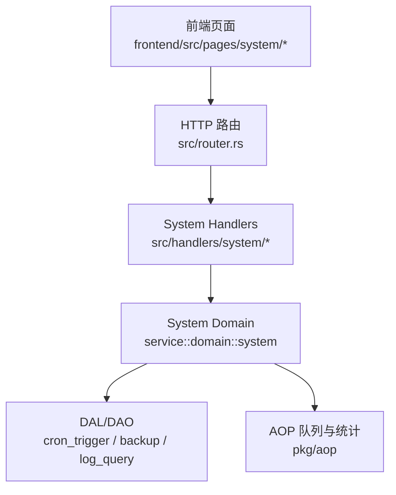
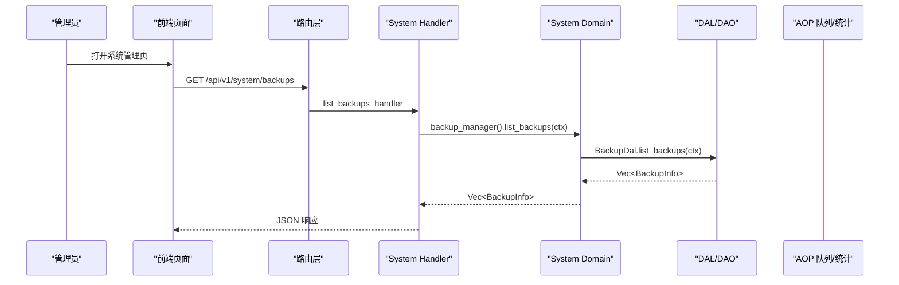
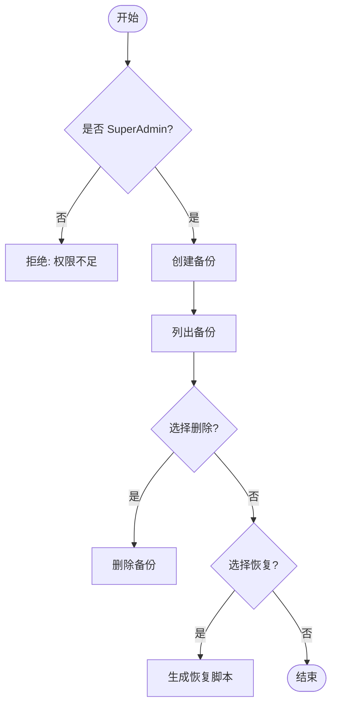
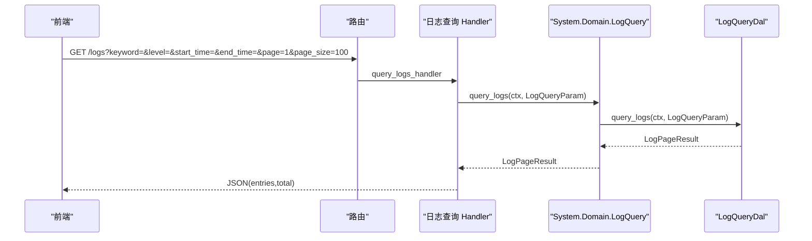
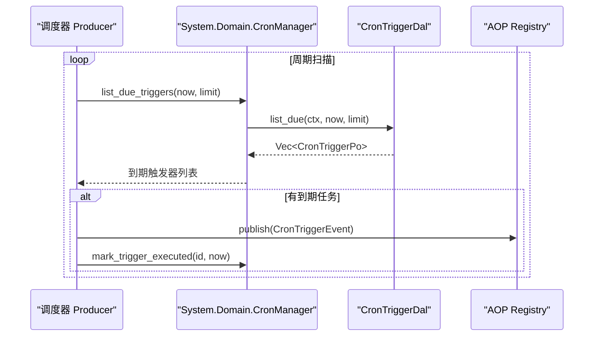
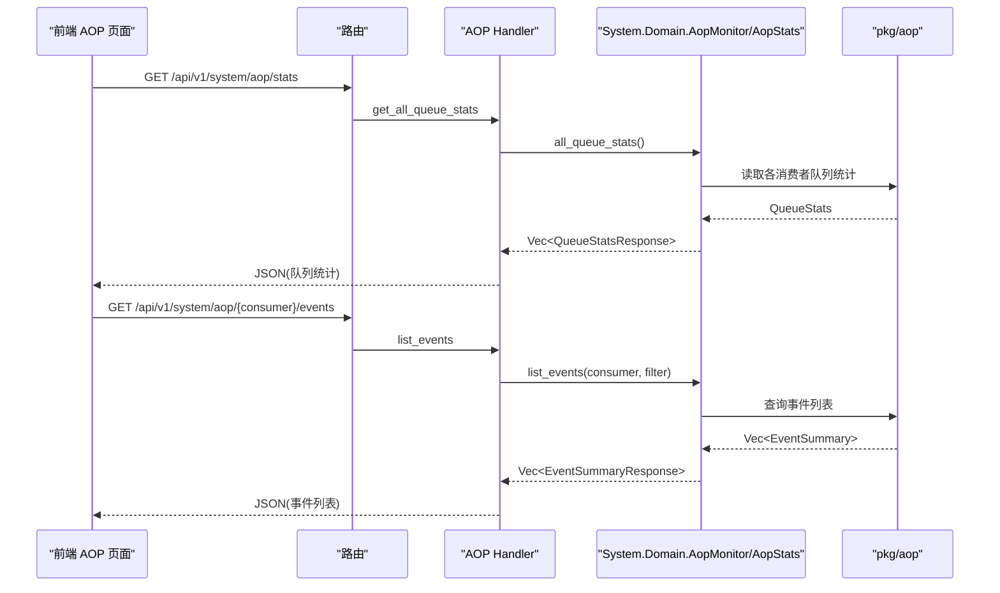
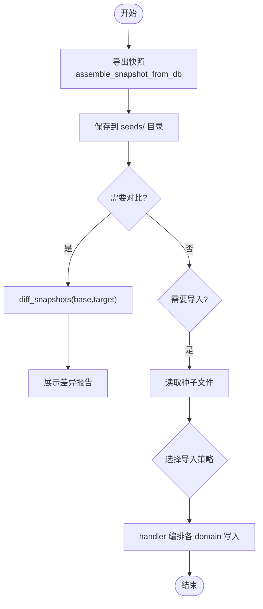
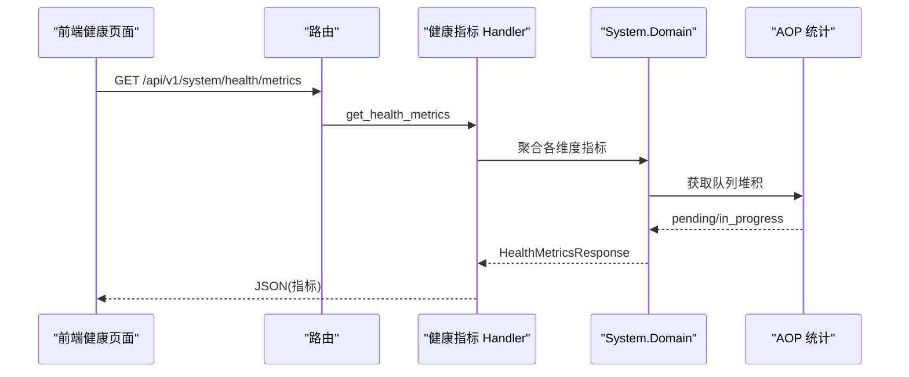
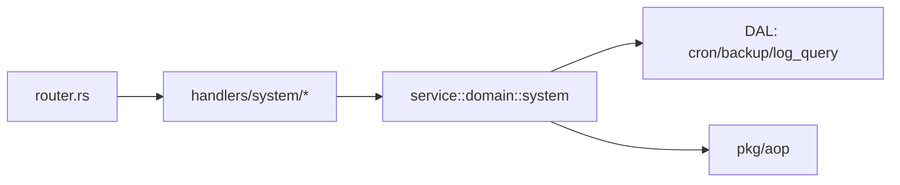

# 系统管理页面

<cite>
**本文引用的文件**
- [src/router.rs](src/router.rs)
- [src/handlers/system/mod.rs](src/handlers/system/mod.rs)
- [src/handlers/system/backup/mod.rs](src/handlers/system/backup/mod.rs)
- [src/handlers/system/backup/list_backups.rs](src/handlers/system/backup/list_backups.rs)
- [src/service/domain/system/mod.rs](src/service/domain/system/mod.rs)
- [common/src/api/system.rs](common/src/api/system.rs)
- [src/handlers/system/aop.rs](src/handlers/system/aop.rs)
- [frontend/src/pages/system/aop.rs](frontend/src/pages/system/aop.rs)
- [src/producer/cron_trigger.rs](src/producer/cron_trigger.rs)
- [frontend/src/pages/system/triggers.rs](frontend/src/pages/system/triggers.rs)
- （2026-09-04 清理：superpowers 目录已归档，待 doc-maintainer 跟进）
- （2026-09-04 清理：superpowers 目录已归档，待 doc-maintainer 跟进）
- [src/handlers/system/seed/mod.rs](src/handlers/system/seed/mod.rs)
- [frontend/src/pages/system/health.rs](frontend/src/pages/system/health.rs)
</cite>

## 目录
1. [简介](#简介)
2. [项目结构](#项目结构)
3. [核心组件](#核心组件)
4. [架构总览](#架构总览)
5. [详细组件分析](#详细组件分析)
6. [依赖关系分析](#依赖关系分析)
7. [性能考虑](#性能考虑)
8. [故障排查指南](#故障排查指南)
9. [结论](#结论)
10. [附录](#附录)

## 简介
本模块为系统管理页面，面向运维与管理员提供备份恢复、日志查询、定时任务管理、AOP 监控面板、种子数据管理与系统健康检查等能力。后端遵循四层单向调用（Adapter → Domain → DAL → DAO），所有公共方法以 RequestContext 作为首参，跨层传递使用 ctx.clone()；Domain 对外暴露业务实体，PO 仅在 DAL/DAO 内部使用。前端基于 Dioxus + Tailwind/DaisyUI，提供可视化、实时监控、批量操作与审计追踪界面。

## 项目结构
系统管理相关路由集中在 router 中注册，Handler 按功能域拆分到 system 子模块，Domain 层统一在 service::domain::system 聚合各子能力（Cron、Backup、LogQuery、AOP 监控与统计、Seed）。

图表来源
- [src/router.rs:637-675](src/router.rs#L637-L675)
- [src/handlers/system/mod.rs:1-13](src/handlers/system/mod.rs#L1-L13)
- [src/service/domain/system/mod.rs:1-114](src/service/domain/system/mod.rs#L1-L114)

章节来源
- [src/router.rs:637-675](src/router.rs#L637-L675)
- [src/handlers/system/mod.rs:1-13](src/handlers/system/mod.rs#L1-L13)

## 核心组件
- 备份恢复：创建、列出、删除备份，生成恢复脚本；高危操作二次校验仅 SuperAdmin 可执行。
- 日志查询：分页查询、级别分布与时序聚合，支持关键词、时间范围过滤。
- 定时任务：创建/暂停/恢复/删除 Cron 触发器，调度器轮询到期任务并标记执行。
- AOP 监控：队列状态统计、事件列表与详情、实时统计概览与时序/分布。
- 种子数据：导出/导入/对比默认模板与当前配置，支持敏感字段占位符与多种导入策略。
- 健康检查：服务在线、AOP 堆积、活跃 Agent/项目、待处理任务、运行时长等 HUD 指标。

章节来源
- [src/handlers/system/backup/mod.rs:1-32](src/handlers/system/backup/mod.rs#L1-L32)
- [src/service/domain/system/mod.rs:116-204](src/service/domain/system/mod.rs#L116-L204)
- [common/src/api/system.rs:7-33](common/src/api/system.rs#L7-L33)

## 架构总览
系统管理采用“Handler 编排 + Domain 抽象 + DAL 实现”的分层模式。路由将请求分发至 Handler，Handler 通过 SystemDomain 访问具体子能力（CronManager、BackupManager、LogQuery、AopMonitor、AopStats），DAL 对接持久化与存储。AOP 队列与统计由 pkg/aop 提供，Domain 层仅聚合查询。

图表来源
- [src/router.rs:637-646](src/router.rs#L637-L646)
- [src/handlers/system/backup/list_backups.rs:1-21](src/handlers/system/backup/list_backups.rs#L1-L21)
- [src/service/domain/system/mod.rs:143-149](src/service/domain/system/mod.rs#L143-L149)

## 详细组件分析

### 备份恢复
- 能力边界
  - 创建备份：调用 Domain 的 BackupManager.create_backup，返回备份元信息。
  - 列出备份：返回所有备份版本清单。
  - 删除备份：仅 SuperAdmin 可执行，Handler 内二次校验角色。
  - 恢复：通过生成恢复脚本接口，结合外部工具或流程执行恢复。
- 安全控制
  - 路由层要求 Admin/SuperAdmin 进入；高危操作在 Handler 内再次校验 SuperAdmin。
- 进度与审计
  - 建议对长耗时备份/恢复引入后台任务与进度查询（可通过 background_task registry 扩展）。
  - 所有变更应记录审计日志（建议在 Handler 层输出结构化日志，包含操作人、资源 ID、结果）。

图表来源
- [src/handlers/system/backup/mod.rs:19-32](src/handlers/system/backup/mod.rs#L19-L32)
- [src/handlers/system/backup/list_backups.rs:1-21](src/handlers/system/backup/list_backups.rs#L1-L21)
- [src/service/domain/system/mod.rs:143-149](src/service/domain/system/mod.rs#L143-L149)

章节来源
- [src/handlers/system/backup/mod.rs:1-32](src/handlers/system/backup/mod.rs#L1-L32)
- [src/handlers/system/backup/list_backups.rs:1-21](src/handlers/system/backup/list_backups.rs#L1-L21)
- [src/service/domain/system/mod.rs:143-149](src/service/domain/system/mod.rs#L143-L149)

### 日志查询系统
- 能力边界
  - 分页查询：支持关键词、日志 ID、级别、时间范围过滤。
  - 级别分布：拉取时间范围内日志并在 Rust 侧聚合级别计数。
  - 时序聚合：按小时桶统计日志数量，用于折线图展示。
- 性能特性
  - 聚合查询限制扫描条目上限，避免大窗口全量扫描影响性能。
- 前端交互
  - 支持筛选条件组合、分页加载、图表渲染。

图表来源
- [src/router.rs:647-660](src/router.rs#L647-L660)
- [src/service/domain/system/mod.rs:151-170](src/service/domain/system/mod.rs#L151-L170)
- [src/service/domain/system/mod.rs:280-342](src/service/domain/system/mod.rs#L280-L342)

章节来源
- [src/router.rs:647-660](src/router.rs#L647-L660)
- [src/service/domain/system/mod.rs:151-170](src/service/domain/system/mod.rs#L151-L170)
- [src/service/domain/system/mod.rs:280-342](src/service/domain/system/mod.rs#L280-L342)

### 定时任务管理
- 能力边界
  - 创建/更新/删除触发器，支持一次性、间隔与 Cron 表达式（Cron 类型需后续完善）。
  - 暂停/恢复触发器，查看到期任务列表。
  - 调度器周期性扫描到期任务，发布事件并标记执行。
- 初始化行为
  - 启动时幂等注入两条系统级定时任务（Agent 睡眠沉淀、项目进度巡检），若已存在同 action 则跳过。
- 前端交互
  - 列表展示、编辑表单、调度信息格式化显示、暂停/恢复/删除操作。

图表来源
- [src/producer/cron_trigger.rs:55-87](src/producer/cron_trigger.rs#L55-L87)
- [src/service/domain/system/mod.rs:116-141](src/service/domain/system/mod.rs#L116-L141)
- [src/service/domain/system/mod.rs:358-415](src/service/domain/system/mod.rs#L358-L415)

章节来源
- [src/producer/cron_trigger.rs:55-87](src/producer/cron_trigger.rs#L55-L87)
- [src/service/domain/system/mod.rs:116-141](src/service/domain/system/mod.rs#L116-L141)
- [src/service/domain/system/mod.rs:358-415](src/service/domain/system/mod.rs#L358-L415)
- [frontend/src/pages/system/triggers.rs:113-148](frontend/src/pages/system/triggers.rs#L113-L148)

### AOP 监控面板
- 能力边界
  - 队列监控：获取所有消费者队列统计、指定消费者队列统计、事件列表与详情。
  - 实时统计：概览（累计发布/消费/成功/失败/平均耗时）、时序（滑动窗口分钟桶）、分布（按 consumer/status/kind）。
- 前端交互
  - 仪表盘刷新、图表渲染（环形图、折线图）、事件详情弹窗、状态徽章。
- 后端实现
  - Handler 调用 SystemDomain.AopMonitor/AopStats，聚合底层队列与统计信息。

图表来源
- [src/router.rs:661-675](src/router.rs#L661-L675)
- [src/handlers/system/aop.rs:1-41](src/handlers/system/aop.rs#L1-L41)
- [common/src/api/system.rs:55-191](common/src/api/system.rs#L55-L191)
- [frontend/src/pages/system/aop.rs:1-372](frontend/src/pages/system/aop.rs#L1-L372)

章节来源
- [src/router.rs:661-675](src/router.rs#L661-L675)
- [src/handlers/system/aop.rs:1-41](src/handlers/system/aop.rs#L1-L41)
- [common/src/api/system.rs:55-191](common/src/api/system.rs#L55-L191)
- [frontend/src/pages/system/aop.rs:1-372](frontend/src/pages/system/aop.rs#L1-L372)
- （2026-09-04 清理：superpowers 目录已归档，待 doc-maintainer 跟进）

### 种子数据管理
- 能力边界
  - 导出快照：从 DB 组装组织、用户、模型 Provider、Agent、Skill 定义，敏感字段使用占位符。
  - 导入快照：支持 PreserveIds、RegenerateIds、DryRun、SkipExisting 策略，敏感字段由管理员填写。
  - 对比差异：文件 vs DB、文件 vs 文件，返回字段级变更。
  - 默认模板：内置默认配置，可应用或预览。
- 架构原则
  - seed 子模块为纯工具箱，不持有 DAL 引用，不调用其他 domain；DB 读写由 handler 编排各 domain 完成。
- 前端交互
  - 文件列表、内容查看、保存/加载/删除、差异报告展示。

图表来源
- （2026-09-04 清理：superpowers 目录已归档，待 doc-maintainer 跟进）
- [src/handlers/system/seed/mod.rs:285-311](src/handlers/system/seed/mod.rs#L285-L311)

章节来源
- （2026-09-04 清理：superpowers 目录已归档，待 doc-maintainer 跟进）
- [src/handlers/system/seed/mod.rs:285-311](src/handlers/system/seed/mod.rs#L285-L311)

### 系统健康检查
- 能力边界
  - 指标项：后端在线、AOP 队列堆积、活跃 Agent/项目、待处理任务、运行时长。
  - 手动检查：触发健康检查并反馈结果。
- 前端交互
  - HUD 仪表盘墙，Gauge 组件展示指标，10 秒轮询刷新。

图表来源
- [frontend/src/pages/system/health.rs:1-97](frontend/src/pages/system/health.rs#L1-L97)
- [common/src/api/system.rs:7-33](common/src/api/system.rs#L7-L33)

章节来源
- [frontend/src/pages/system/health.rs:1-97](frontend/src/pages/system/health.rs#L1-L97)
- [common/src/api/system.rs:7-33](common/src/api/system.rs#L7-L33)

## 依赖关系分析
- 路由层依赖 Handler 模块，Handler 依赖 SystemDomain 抽象。
- SystemDomain 聚合 CronManager、BackupManager、LogQuery、AopMonitor、AopStats。
- DAL 层实现具体持久化逻辑，DAO 负责 SQL 与存储细节。
- AOP 队列与统计由 pkg/aop 提供，Domain 仅做聚合查询。

图表来源
- [src/router.rs:637-675](src/router.rs#L637-L675)
- [src/handlers/system/mod.rs:1-13](src/handlers/system/mod.rs#L1-L13)
- [src/service/domain/system/mod.rs:1-114](src/service/domain/system/mod.rs#L1-L114)

章节来源
- [src/router.rs:637-675](src/router.rs#L637-L675)
- [src/handlers/system/mod.rs:1-13](src/handlers/system/mod.rs#L1-L13)
- [src/service/domain/system/mod.rs:1-114](src/service/domain/system/mod.rs#L1-L114)

## 性能考虑
- 日志聚合查询限制扫描条目上限，避免大窗口全量扫描。
- AOP 统计使用滑动窗口与分钟桶聚合，降低计算压力。
- 健康指标允许降级为 0，减少跨域高成本查询对整体性能的影响。
- 备份/恢复长耗时操作建议引入后台任务与进度查询，避免阻塞请求。

## 故障排查指南
- 权限问题
  - 备份高危操作需 SuperAdmin，若被拒绝请检查用户角色与中间件配置。
- 队列堆积
  - 通过 AOP 监控查看各消费者 pending/in_progress 与最老事件年龄，定位慢消费者。
- 日志异常
  - 使用级别分布与时序视图快速定位异常时段与级别，结合关键词过滤缩小范围。
- 定时任务未执行
  - 检查触发器状态、下次执行时间、调度器是否正常运行，确认 payload 中的 action 是否匹配消费者。
- 健康指标异常
  - 关注 AOP 堆积、待处理任务数与运行时长，必要时重启相关消费者或服务。

章节来源
- [src/handlers/system/backup/mod.rs:19-32](src/handlers/system/backup/mod.rs#L19-L32)
- [src/handlers/system/aop.rs:1-41](src/handlers/system/aop.rs#L1-L41)
- [src/service/domain/system/mod.rs:280-342](src/service/domain/system/mod.rs#L280-L342)
- [src/producer/cron_trigger.rs:55-87](src/producer/cron_trigger.rs#L55-L87)
- [frontend/src/pages/system/health.rs:1-97](frontend/src/pages/system/health.rs#L1-L97)

## 结论
系统管理页面围绕备份恢复、日志查询、定时任务、AOP 监控、种子数据与健康检查六大能力，提供了完整的运维可视化管理入口。通过清晰的层次划分与安全控制、性能优化与故障排查手段，确保系统在复杂场景下的稳定与可维护性。建议在生产环境中结合告警配置与自动化运维实践，进一步提升故障自愈能力。

## 附录
- 最佳实践
  - 安全控制：路由层角色校验 + Handler 高危操作二次校验；所有变更记录审计日志。
  - 操作日志：结构化日志包含操作人、资源 ID、结果与耗时。
  - 回滚机制：备份恢复配合种子数据 diff，支持 DryRun 预演与选择性导入。
  - 运维自动化：定时任务驱动常规维护（如 Agent 睡眠沉淀、项目进度巡检）；AOP 监控联动告警。
  - 告警配置：基于 AOP 堆积阈值、日志异常级别、健康指标退化设置告警规则。
  - 故障自愈：自动重试失败事件、限流与降级策略、关键服务健康检查与自愈脚本。