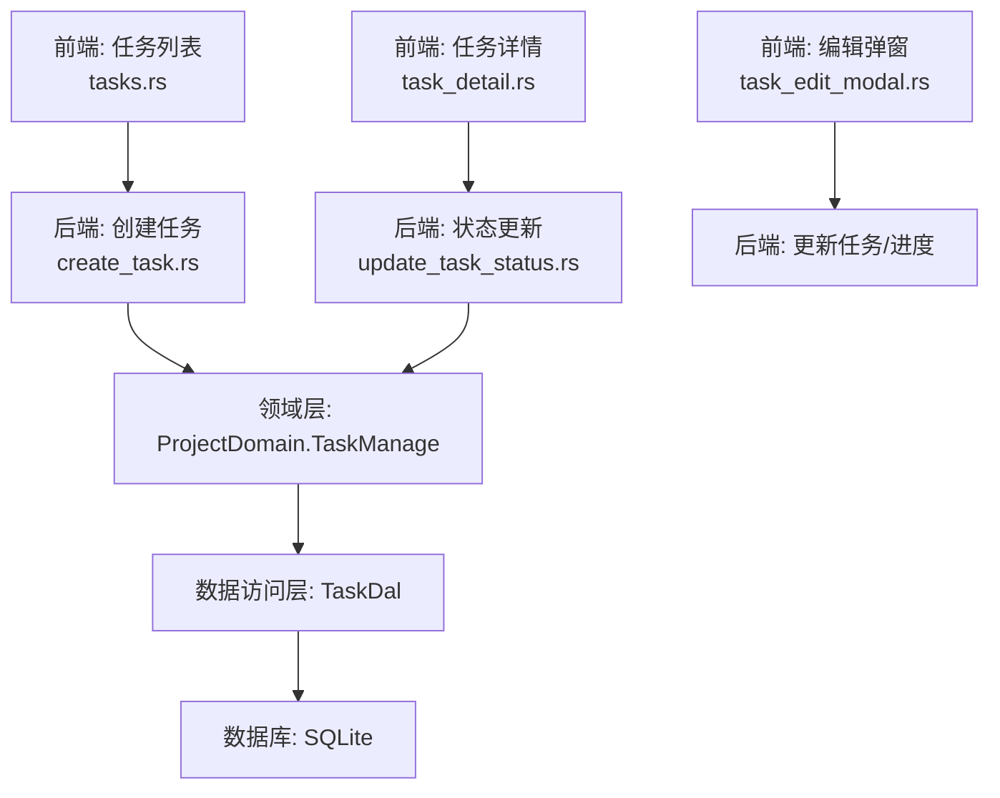
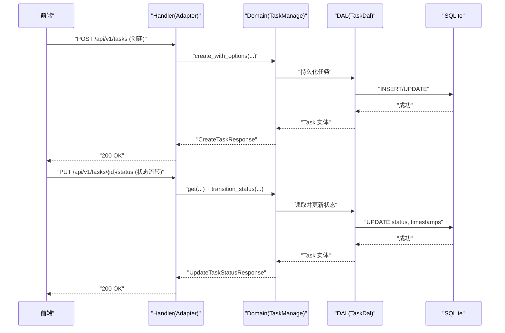
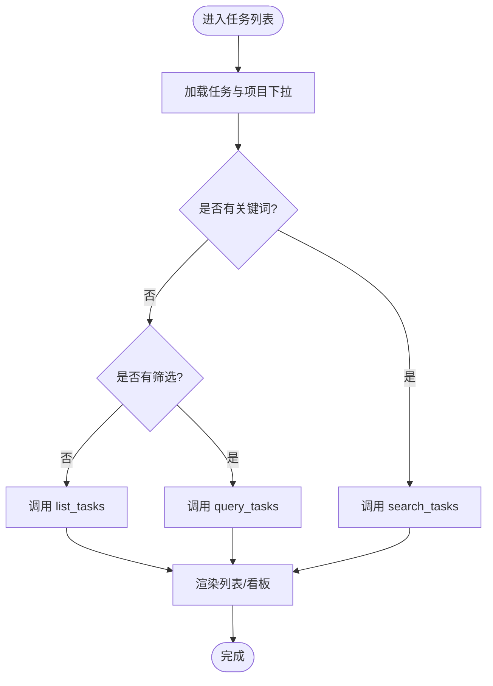
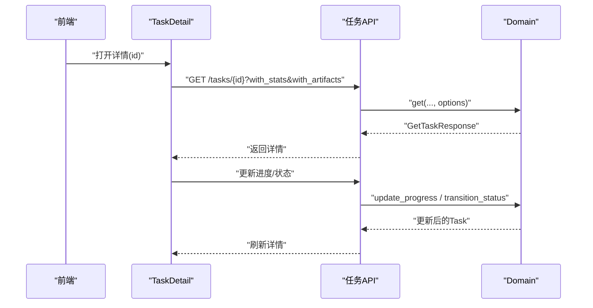
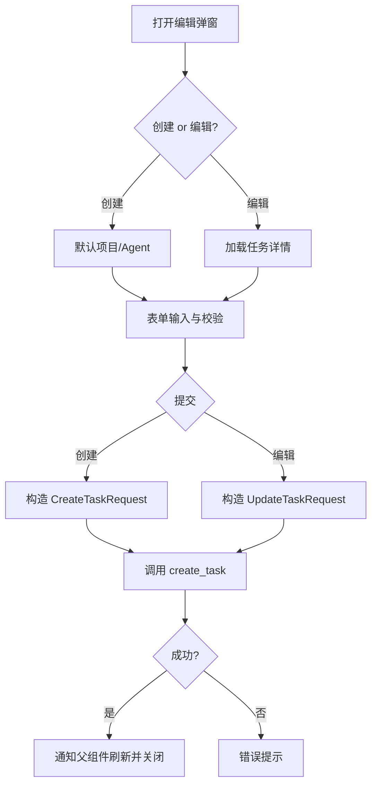
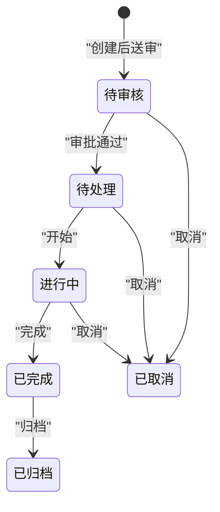
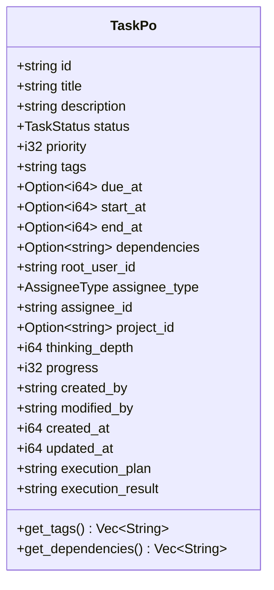
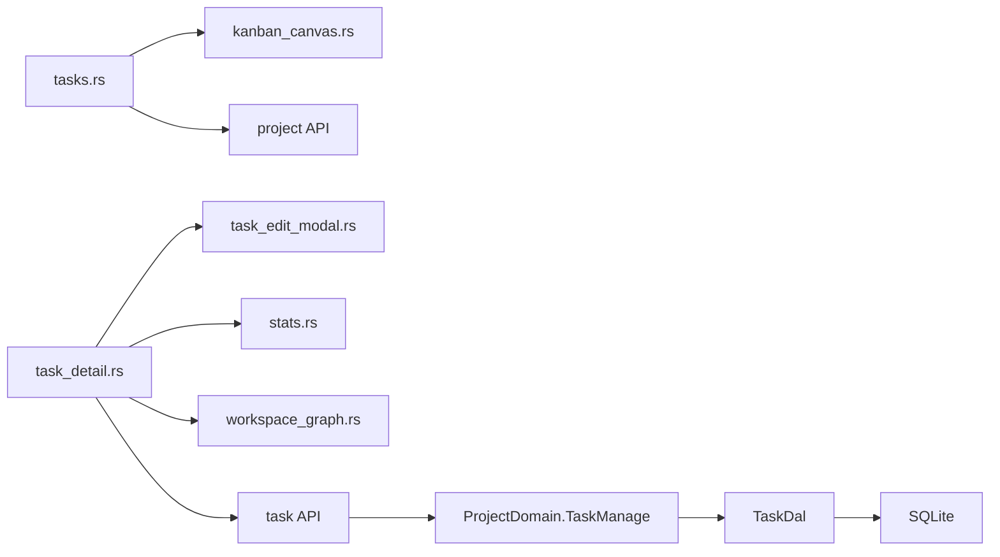

# 任务管理功能

<cite>
**本文引用的文件**
- [common/src/enums/task.rs](common/src/enums/task.rs)
- [src/models/task.rs](src/models/task.rs)
- [common/src/api/task.rs](common/src/api/task.rs)
- [src/handlers/project/task/mod.rs](src/handlers/project/task/mod.rs)
- [src/handlers/project/task/create_task.rs](src/handlers/project/task/create_task.rs)
- [src/handlers/project/task/update_task_status.rs](src/handlers/project/task/update_task_status.rs)
- [src/service/domain/project/mod.rs](src/service/domain/project/mod.rs)
- [frontend/src/pages/project/tasks.rs](frontend/src/pages/project/tasks.rs)
- [frontend/src/pages/project/task_detail.rs](frontend/src/pages/project/task_detail.rs)
- [frontend/src/pages/project/task_edit_modal.rs](frontend/src/pages/project/task_edit_modal.rs)
- [frontend/src/components/kanban_canvas.rs](frontend/src/components/kanban_canvas.rs)
- [任务状态机 + 项目聚合进度追踪：TaskStatus 4 态流转 + execution_plan_result 结构化存储 + TaskGraph 依赖 DAG Mermaid](docs/wiki/knowledge/zh/任务状态机与项目聚合：TaskStatus 4 态 + progress 0-100 自动联动 + execution_plan_result JSON Patch + TaskGraph 依赖 DAG/任务状态机与项目聚合：TaskStatus 4 态 + progress 0-100 自动联动 + execution_plan_result JSON Patch + TaskGraph 依赖 DAG.md)
</cite>

## 目录
1. [简介](#简介)
2. [项目结构](#项目结构)
3. [核心组件](#核心组件)
4. [架构总览](#架构总览)
5. [详细组件分析](#详细组件分析)
6. [依赖关系分析](#依赖关系分析)
7. [性能考量](#性能考量)
8. [故障排查指南](#故障排查指南)
9. [结论](#结论)
10. [附录](#附录)

## 简介
本文件面向“任务管理”能力，覆盖任务列表页的创建、分配、优先级与截止日期管理；任务详情页的信息展示（描述、附件、评论、子任务）；编辑模态框的交互设计、表单验证与数据绑定；任务状态流转、进度跟踪与里程碑管理；任务依赖解析、甘特图与时间线视图；以及团队协作、模板、批量操作、搜索与高级筛选的技术实现。文档严格遵循四层单向调用：Adapter → Domain → DAL → DAO，并基于仓库现有代码进行说明。

## 项目结构
任务管理涉及前后端多模块协作：
- 前端页面：任务列表、任务详情、任务编辑弹窗、看板画布
- 后端接口：任务创建、查询、搜索、更新、状态变更、进度更新
- 领域模型：任务实体、持久化对象、枚举定义
- 领域服务：任务管理能力（创建、查询、更新、状态流转、进度更新）

图表来源
- [frontend/src/pages/project/tasks.rs:1-120](frontend/src/pages/project/tasks.rs#L1-L120)
- [frontend/src/pages/project/task_detail.rs:48-122](frontend/src/pages/project/task_detail.rs#L48-L122)
- [frontend/src/pages/project/task_edit_modal.rs:156-232](frontend/src/pages/project/task_edit_modal.rs#L156-L232)
- [src/handlers/project/task/create_task.rs:21-85](src/handlers/project/task/create_task.rs#L21-L85)
- [src/handlers/project/task/update_task_status.rs:21-40](src/handlers/project/task/update_task_status.rs#L21-L40)
- [src/service/domain/project/mod.rs:228-359](src/service/domain/project/mod.rs#L228-L359)

章节来源
- [frontend/src/pages/project/tasks.rs:1-120](frontend/src/pages/project/tasks.rs#L1-L120)
- [frontend/src/pages/project/task_detail.rs:48-122](frontend/src/pages/project/task_detail.rs#L48-L122)
- [frontend/src/pages/project/task_edit_modal.rs:156-232](frontend/src/pages/project/task_edit_modal.rs#L156-L232)
- [src/handlers/project/task/mod.rs:1-27](src/handlers/project/task/mod.rs#L1-L27)
- [src/handlers/project/task/create_task.rs:21-85](src/handlers/project/task/create_task.rs#L21-L85)
- [src/handlers/project/task/update_task_status.rs:21-40](src/handlers/project/task/update_task_status.rs#L21-L40)
- [src/service/domain/project/mod.rs:228-359](src/service/domain/project/mod.rs#L228-L359)

## 核心组件
- 任务枚举与模型
  - 任务状态：已取消、待审核、待处理、进行中、已完成、已归档
  - 负责人类型：用户、Agent
  - 业务实体 Task 与持久化对象 TaskPo，包含标题、描述、优先级、标签、截止时间、开始/结束时间、依赖、根用户、分配对象、项目、思考深度、进度、创建/修改者、执行计划/结果等字段
- 任务 API DTO
  - 创建/获取/更新/状态更新/进度更新请求与响应
  - 列表项、通用查询、搜索请求（支持关键词、项目、负责人类型/ID、状态列表、分页）
- 领域能力
  - 任务创建（含可选字段）、任务查询/搜索、任务更新、任务状态流转、任务进度更新
- 前端页面与组件
  - 任务列表：列表视图与看板视图，支持项目/状态/负责人类型筛选与关键词搜索
  - 任务详情：基本信息、标签与依赖、统计面板、进度与状态、关系图、产物
  - 编辑弹窗：创建/编辑模式，表单校验与数据绑定
  - 看板画布：Canvas 渲染的多列泳道看板

章节来源
- [common/src/enums/task.rs:8-100](common/src/enums/task.rs#L8-L100)
- [src/models/task.rs:16-343](src/models/task.rs#L16-L343)
- [common/src/api/task.rs:10-299](common/src/api/task.rs#L10-L299)
- [src/service/domain/project/mod.rs:228-359](src/service/domain/project/mod.rs#L228-L359)
- [frontend/src/pages/project/tasks.rs:24-397](frontend/src/pages/project/tasks.rs#L24-L397)
- [frontend/src/pages/project/task_detail.rs:26-719](frontend/src/pages/project/task_detail.rs#L26-L719)
- [frontend/src/pages/project/task_edit_modal.rs:19-437](frontend/src/pages/project/task_edit_modal.rs#L19-L437)
- [frontend/src/components/kanban_canvas.rs:19-286](frontend/src/components/kanban_canvas.rs#L19-L286)

## 架构总览
任务管理采用 Adapter → Domain → DAL → DAO 的单向分层：
- Adapter（HTTP Handler）：接收请求，参数校验，调用 Domain
- Domain：封装业务规则（状态流转、进度更新、创建/更新），返回业务实体
- DAL：组合 DAO，提供查询/搜索/统计等能力
- DAO：持久化到 SQLite

图表来源
- [src/handlers/project/task/create_task.rs:21-85](src/handlers/project/task/create_task.rs#L21-L85)
- [src/handlers/project/task/update_task_status.rs:21-40](src/handlers/project/task/update_task_status.rs#L21-L40)
- [src/service/domain/project/mod.rs:228-359](src/service/domain/project/mod.rs#L228-L359)

## 详细组件分析

### 任务列表页（创建、分配、优先级、截止日期、搜索与筛选）
- 视图模式：列表视图与看板视图切换
- 筛选条件：项目、状态、负责人类型；关键词搜索
- 数据加载策略：无关键词+无筛选→列表接口；有筛选→通用查询；有关键词→搜索接口（可叠加筛选）
- 看板视图：按状态分组，使用 Canvas 绘制多列泳道，卡片显示标题、优先级、进度条
- 交互：点击行跳转详情；筛选变化触发异步加载；防抖搜索避免重复请求

图表来源
- [frontend/src/pages/project/tasks.rs:41-123](frontend/src/pages/project/tasks.rs#L41-L123)
- [frontend/src/pages/project/tasks.rs:142-162](frontend/src/pages/project/tasks.rs#L142-L162)
- [frontend/src/components/kanban_canvas.rs:140-244](frontend/src/components/kanban_canvas.rs#L140-L244)

章节来源
- [frontend/src/pages/project/tasks.rs:24-397](frontend/src/pages/project/tasks.rs#L24-L397)
- [frontend/src/components/kanban_canvas.rs:19-286](frontend/src/components/kanban_canvas.rs#L19-L286)

### 任务详情页（信息展示、状态流转、进度更新、关系图、产物）
- 基本信息：标题、描述、优先级、负责人、根用户、项目、创建/更新时间、截止/开始/结束时间
- 标签与依赖：标签列表、前置任务 ID 列表
- 统计面板：任务统计数据与模型调用统计（按需加载）
- 进度与状态：进度条与更新弹窗；状态按钮（送审、待处理、开始、完成、取消、归档）
- 关系图：同项目任务、关联 Agent、关联 Project 的可视化
- 产物：任务级产物列表，支持查看详情

图表来源
- [frontend/src/pages/project/task_detail.rs:48-122](frontend/src/pages/project/task_detail.rs#L48-L122)
- [frontend/src/pages/project/task_detail.rs:124-292](frontend/src/pages/project/task_detail.rs#L124-L292)
- [frontend/src/pages/project/task_detail.rs:294-323](frontend/src/pages/project/task_detail.rs#L294-L323)
- [src/handlers/project/task/update_task_status.rs:21-40](src/handlers/project/task/update_task_status.rs#L21-L40)

章节来源
- [frontend/src/pages/project/task_detail.rs:26-719](frontend/src/pages/project/task_detail.rs#L26-L719)

### 任务编辑模态框（交互设计、表单验证、数据绑定）
- 模式：创建（默认分配给 Agent）与编辑（预填充字段）
- 表单字段：标题（必填）、描述、优先级（0-10）、标签（逗号分隔）、截止时间（Unix 毫秒）、负责人类型与 ID、关联项目、前置任务 ID（逗号分隔）
- 数据绑定：信号驱动双向绑定；编辑模式异步加载任务详情与下拉数据
- 提交逻辑：创建时构造 CreateTaskRequest；编辑时构造 UpdateTaskRequest；成功后回调父组件刷新

图表来源
- [frontend/src/pages/project/task_edit_modal.rs:66-154](frontend/src/pages/project/task_edit_modal.rs#L66-L154)
- [frontend/src/pages/project/task_edit_modal.rs:156-232](frontend/src/pages/project/task_edit_modal.rs#L156-L232)
- [frontend/src/pages/project/task_edit_modal.rs:241-411](frontend/src/pages/project/task_edit_modal.rs#L241-L411)

章节来源
- [frontend/src/pages/project/task_edit_modal.rs:19-437](frontend/src/pages/project/task_edit_modal.rs#L19-L437)

### 任务状态流转与进度跟踪
- 状态枚举：已取消、待审核、待处理、进行中、已完成、已归档
- 状态流转：通过统一方法 transition_status 校验并更新状态，同时维护开始/结束时间戳
- 进度跟踪：update_progress 设置 0-100 进度，自动截断范围并更新时间戳
- 业务实体方法：start、complete、cancel、set_progress 等

图表来源
- [common/src/enums/task.rs:8-27](common/src/enums/task.rs#L8-L27)
- [src/models/task.rs:172-188](src/models/task.rs#L172-L188)
- [src/handlers/project/task/update_task_status.rs:21-40](src/handlers/project/task/update_task_status.rs#L21-L40)

章节来源
- [common/src/enums/task.rs:8-100](common/src/enums/task.rs#L8-L100)
- [src/models/task.rs:16-343](src/models/task.rs#L16-L343)
- [src/handlers/project/task/update_task_status.rs:21-40](src/handlers/project/task/update_task_status.rs#L21-L40)

### 任务依赖关系解析、甘特图与时间线视图
- 依赖关系：任务 Po 中 dependencies 字段以 JSON 数组存储前置任务 ID；提供 get_dependencies 反序列化方法
- 依赖展示：详情页“标签与依赖”区域列出前置任务 ID
- 甘特图/时间线：当前仓库未实现专用甘特图或时间线视图；可在详情页“关系图”基础上扩展为时间轴视图（建议复用 WorkspaceGraph 组件）

图表来源
- [src/models/task.rs:16-63](src/models/task.rs#L16-L63)
- [src/models/task.rs:237-315](src/models/task.rs#L237-L315)

章节来源
- [src/models/task.rs:16-343](src/models/task.rs#L16-L343)
- [frontend/src/pages/project/task_detail.rs:463-492](frontend/src/pages/project/task_detail.rs#L463-L492)

### 团队协作与通知
- 任务分配通知：当任务分配给 Agent 时，Handler 编排 Message Domain 发送 TaskAssignment 消息，使 Agent 感知任务上下文
- 协作能力：任务详情“关系图”展示关联 Agent 与 Project，便于跨角色协同

章节来源
- [src/handlers/project/task/create_task.rs:65-82](src/handlers/project/task/create_task.rs#L65-L82)
- [frontend/src/pages/project/task_detail.rs:71-116](frontend/src/pages/project/task_detail.rs#L71-L116)

### 任务模板、批量操作、搜索与高级筛选
- 任务模板：当前仓库未提供“任务模板”能力；可通过“创建任务”流程结合常用字段预设实现（建议在 Domain 层扩展模板能力）
- 批量操作：当前未提供批量更新/删除；可在 Handler/DAL 层新增批量接口（如批量状态更新、批量进度更新）
- 搜索与高级筛选：
  - 搜索：search_tasks 支持关键词（FTS5 + 向量语义混合搜索）
  - 高级筛选：query_tasks 支持项目、状态列表、负责人类型/ID、分页等组合过滤

章节来源
- [common/src/api/task.rs:254-299](common/src/api/task.rs#L254-L299)
- [frontend/src/pages/project/tasks.rs:55-106](frontend/src/pages/project/tasks.rs#L55-L106)

## 依赖关系分析
- 前端依赖
  - tasks.rs 依赖 KanbanCanvas 组件与项目/任务 API
  - task_detail.rs 依赖任务详情 API、统计面板、关系图组件
  - task_edit_modal.rs 依赖项目/Agent 列表 API 与任务 CRUD API
- 后端依赖
  - Handler 依赖 Domain（ProjectDomain.TaskManage）
  - Domain 依赖 DAL（TaskDal）与枚举/模型
  - 模型 TaskPo/Task 提供数据结构与业务方法
  - API DTO 定义前后端契约

图表来源
- [frontend/src/pages/project/tasks.rs:1-120](frontend/src/pages/project/tasks.rs#L1-L120)
- [frontend/src/pages/project/task_detail.rs:1-122](frontend/src/pages/project/task_detail.rs#L1-L122)
- [frontend/src/pages/project/task_edit_modal.rs:1-154](frontend/src/pages/project/task_edit_modal.rs#L1-L154)
- [src/handlers/project/task/mod.rs:1-27](src/handlers/project/task/mod.rs#L1-L27)
- [src/service/domain/project/mod.rs:228-359](src/service/domain/project/mod.rs#L228-L359)

章节来源
- [frontend/src/pages/project/tasks.rs:1-120](frontend/src/pages/project/tasks.rs#L1-L120)
- [frontend/src/pages/project/task_detail.rs:1-122](frontend/src/pages/project/task_detail.rs#L1-L122)
- [frontend/src/pages/project/task_edit_modal.rs:1-154](frontend/src/pages/project/task_edit_modal.rs#L1-L154)
- [src/handlers/project/task/mod.rs:1-27](src/handlers/project/task/mod.rs#L1-L27)
- [src/service/domain/project/mod.rs:228-359](src/service/domain/project/mod.rs#L228-L359)

## 性能考量
- 前端
  - 搜索防抖：输入关键词后延迟 300ms 再发起请求，避免频繁请求
  - 过期请求丢弃：使用 search_request_id 标记最新请求，丢弃旧结果
  - 看板渲染：Canvas 使用 requestAnimationFrame 动画循环，减少重绘开销
- 后端
  - 状态流转：在 Domain 层集中校验，减少重复逻辑
  - 进度更新：边界截断（0-100），避免无效写入
  - 统计与产物：按需加载（with_stats/with_artifacts），降低响应体积

[本节为通用指导，不直接分析具体文件]

## 故障排查指南
- 任务不存在
  - 现象：详情加载失败或空状态
  - 排查：确认任务 ID 正确；检查 get_task 返回值；查看 toast 错误提示
- 状态流转失败
  - 现象：状态更新报错
  - 排查：确认当前状态允许的目标状态；检查 update_task_status 返回值
- 进度更新无效
  - 现象：进度未变化
  - 排查：确认传入进度在 0-100；检查 update_task_progress 响应
- 编辑弹窗数据未加载
  - 现象：编辑模式打开后表单为空
  - 排查：确认 show_signal 同步 props.show；检查 get_task 与下拉数据加载逻辑

章节来源
- [frontend/src/pages/project/task_detail.rs:695-707](frontend/src/pages/project/task_detail.rs#L695-L707)
- [frontend/src/pages/project/task_edit_modal.rs:66-154](frontend/src/pages/project/task_edit_modal.rs#L66-L154)
- [src/handlers/project/task/update_task_status.rs:21-40](src/handlers/project/task/update_task_status.rs#L21-L40)

## 结论
任务管理功能在前端提供了丰富的列表、看板、详情与编辑能力；在后端通过清晰的 Adapter → Domain → DAL → DAO 分层实现了任务的创建、查询、搜索、更新、状态流转与进度跟踪。依赖关系以 JSON 数组形式存储，支持依赖展示与可视化扩展。当前未实现甘特图与时间线视图，但具备扩展基础。团队协作通过任务分配通知与关系图增强。未来可扩展模板、批量操作与更丰富的可视化能力。

[本节为总结性内容，不直接分析具体文件]

## 附录
- 关键 API 参考
  - 创建任务：POST /api/v1/tasks
  - 获取任务：GET /api/v1/tasks/{id}
  - 更新任务：PUT /api/v1/tasks/{id}
  - 状态更新：PUT /api/v1/tasks/{id}/status
  - 进度更新：PUT /api/v1/tasks/{id}/progress
  - 查询任务：POST /api/v1/tasks/query
  - 搜索任务：POST /api/v1/tasks/search

章节来源
- [common/src/api/task.rs:10-299](common/src/api/task.rs#L10-L299)
- [src/handlers/project/task/mod.rs:1-27](src/handlers/project/task/mod.rs#L1-L27)