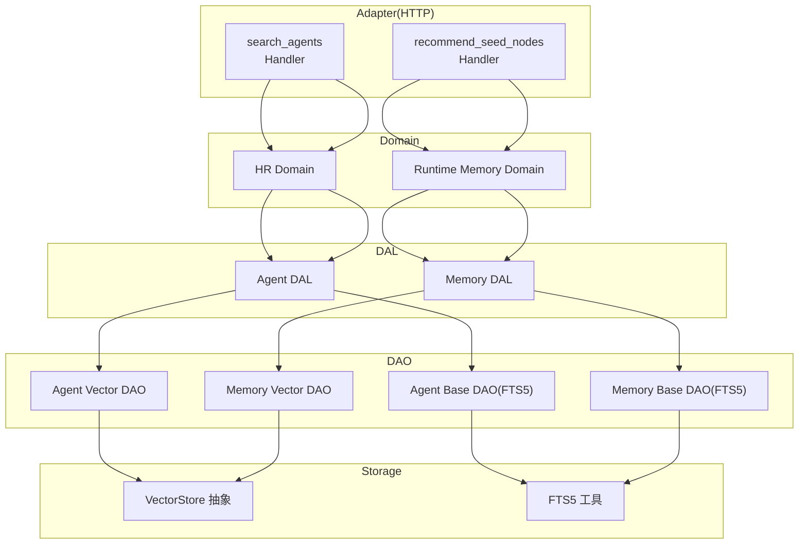
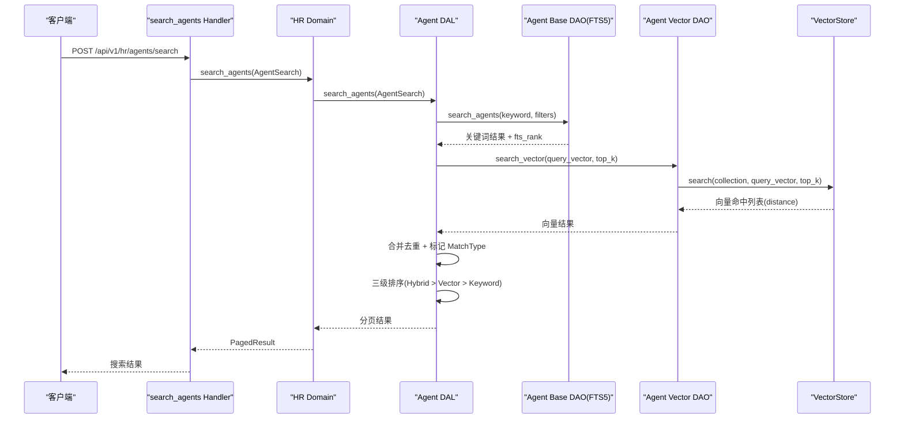
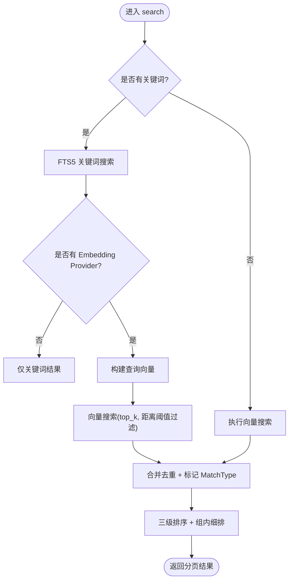
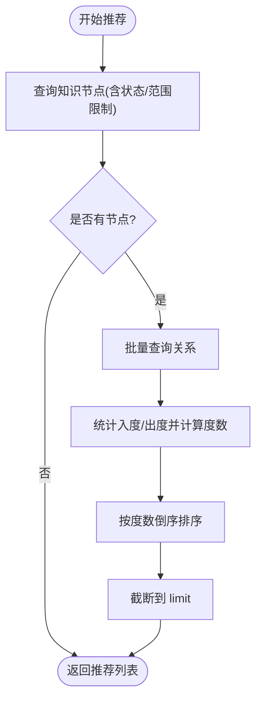
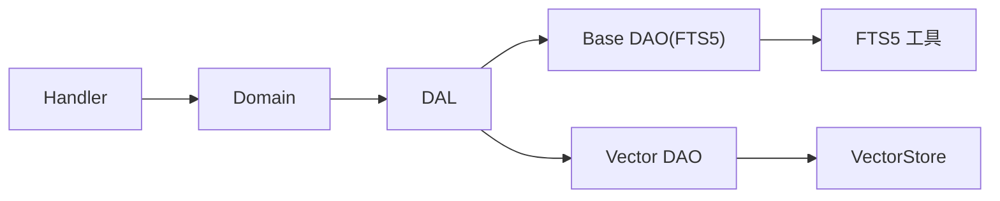

# Agent 搜索与推荐

<cite>
**本文引用的文件**
- [vector_search_architecture.md](docs/vector_search_architecture.md)
- [agent/mod.rs](src/service/dao/agent/mod.rs)
- [search_agents.rs](src/handlers/hr/agent/search_agents.rs)
- [memory.rs](src/service/dal/memory.rs)
- [recommend_seed_nodes.rs](src/handlers/hr/agent/recommend_seed_nodes.rs)
- [fts5.rs](src/pkg/storage/fts5.rs)
- [vector.rs](src/pkg/storage/vector.rs)
- [agent.rs](common/src/api/agent.rs)
</cite>

## 目录
1. [简介](#简介)
2. [项目结构](#项目结构)
3. [核心组件](#核心组件)
4. [架构总览](#架构总览)
5. [详细组件分析](#详细组件分析)
6. [依赖关系分析](#依赖关系分析)
7. [性能考虑](#性能考虑)
8. [故障排查指南](#故障排查指南)
9. [结论](#结论)
10. [附录](#附录)

## 简介
本文件面向“Agent 搜索与推荐”能力，系统性说明基于向量搜索的 Agent 发现机制、语义检索算法与相似度计算、种子节点推荐算法的工作原理与应用场景，并提供搜索 API 的使用示例（关键词搜索、语义搜索、混合搜索），同时给出排序策略、个性化定制建议以及性能优化与缓存策略。

本项目采用严格四层单向调用：Adapter（HTTP Handler / 公开回调 Handler / AOP Producer）→ Domain → DAL → DAO；PO 仅在 DAO/DAL 内部使用，Domain 层输入为 Command/Query，输出业务实体与事件；DAL 对外接口统一使用业务实体；service 层公共方法首参为 RequestContext；通用工具在 pkg 层；启动分两阶段初始化；技术栈包含 Axum + sqlx(SQLite, FTS5) + DuckDB(统计) + LanceDB/HNSW/InMemory 多后端向量存储。

**章节来源**
- [vector_search_architecture.md:1-529](docs/vector_search_architecture.md#L1-L529)

## 项目结构
围绕 Agent 搜索与推荐，涉及的关键路径如下：
- Adapter 层：HTTP Handler 暴露搜索与推荐接口
- Domain 层：编排业务逻辑（如记忆域提供种子节点推荐入口）
- DAL 层：组合基础 DAO 与向量 DAO，实现混合搜索与推荐算法
- DAO 层：基础数据 CRUD 与 FTS5 全文检索；向量 DAO 负责向量索引 CRUD
- 存储层：FTS5 工具、向量存储抽象与多后端实现

**图表来源**
- [search_agents.rs:1-68](src/handlers/hr/agent/search_agents.rs#L1-L68)
- [recommend_seed_nodes.rs:1-55](src/handlers/hr/agent/recommend_seed_nodes.rs#L1-L55)
- [memory.rs:314-375](src/service/dal/memory.rs#L314-L375)
- [agent/mod.rs:33-92](src/service/dao/agent/mod.rs#L33-L92)
- [vector.rs:18-74](src/pkg/storage/vector.rs#L18-L74)
- [fts5.rs:1-44](src/pkg/storage/fts5.rs#L1-L44)

**章节来源**
- [vector_search_architecture.md:46-131](docs/vector_search_architecture.md#L46-L131)

## 核心组件
- Agent 搜索统一入参：支持关键词、查询向量、Top K、距离阈值与业务过滤条件复用
- 混合搜索三态匹配：Hybrid（双命中）> Vector（仅向量）> Keyword（仅关键词）
- 种子节点推荐：按知识节点的关联度数（入边+出边）倒序返回 Top N
- 存储抽象：VectorStore 统一接口，支持 InMemory/LanceDB/HNSW/SqliteVss 等后端
- FTS5 工具：短语匹配转义，避免特殊字符误解析

**章节来源**
- [agent/mod.rs:33-92](src/service/dao/agent/mod.rs#L33-L92)
- [vector_search_architecture.md:72-131](docs/vector_search_architecture.md#L72-L131)
- [memory.rs:314-375](src/service/dal/memory.rs#L314-L375)
- [vector.rs:18-74](src/pkg/storage/vector.rs#L18-L74)
- [fts5.rs:6-18](src/pkg/storage/fts5.rs#L6-L18)

## 架构总览
Agent 搜索与推荐遵循分层聚合、职责清晰的原则：
- DAO 层只做单一职责：基础数据 DAO 不碰向量，向量 DAO 不碰业务数据
- DAL 层组合基础 DAO + 向量 DAO，实现混合搜索与推荐算法
- 存储层纯通用能力，无业务逻辑

**图表来源**
- [search_agents.rs:15-68](src/handlers/hr/agent/search_agents.rs#L15-L68)
- [agent/mod.rs:81-92](src/service/dao/agent/mod.rs#L81-L92)
- [vector.rs:35-43](src/pkg/storage/vector.rs#L35-L43)
- [vector_search_architecture.md:97-118](docs/vector_search_architecture.md#L97-L118)

## 详细组件分析

### Agent 搜索（关键词/语义/混合）
- 统一入参 AgentSearch：keyword、query_vector、top_k、vector_distance_threshold、filters
- 关键词搜索：通过 FTS5 MATCH + BM25 排序，返回 (AgentPo, fts_rank)
- 语义搜索：通过 VectorStore.search 获取候选 ID 与 distance
- 混合搜索：合并去重，标记 MatchType，三级排序并组内细排

**图表来源**
- [agent/mod.rs:33-92](src/service/dao/agent/mod.rs#L33-L92)
- [vector_search_architecture.md:72-131](docs/vector_search_architecture.md#L72-L131)

**章节来源**
- [search_agents.rs:15-68](src/handlers/hr/agent/search_agents.rs#L15-L68)
- [agent/mod.rs:33-92](src/service/dao/agent/mod.rs#L33-L92)
- [vector_search_architecture.md:72-131](docs/vector_search_architecture.md#L72-L131)

### 相似度计算与距离阈值
- 相似度度量：余弦距离（或等价距离函数），由具体 VectorStore 实现决定
- 距离阈值：默认 0.8，可通过 vector_distance_threshold 配置；超过阈值的向量结果被过滤
- 内容哈希：用于判断是否需要重建索引，避免重复向量化

**章节来源**
- [vector_search_architecture.md:161-203](docs/vector_search_architecture.md#L161-L203)
- [vector.rs:270-289](src/pkg/storage/vector.rs#L270-L289)

### 种子节点推荐算法
- 目标：为知识图谱页面提供“推荐起点”，帮助用户快速定位核心节点
- 算法步骤：
  1) 拉取知识节点（可限定 agent_id，全局推荐时包含 published 节点）
  2) 批量查询这些节点的所有关系
  3) 应用层统计每个节点的入度与出度，计算度数 = 入度 + 出度
  4) 按度数倒序排序，截断到 limit 返回
- 应用场景：知识图谱导航、热点知识发现、引导式探索

**图表来源**
- [memory.rs:314-375](src/service/dal/memory.rs#L314-L375)
- [recommend_seed_nodes.rs:19-35](src/handlers/hr/agent/recommend_seed_nodes.rs#L19-L35)

**章节来源**
- [memory.rs:314-375](src/service/dal/memory.rs#L314-L375)
- [recommend_seed_nodes.rs:1-55](src/handlers/hr/agent/recommend_seed_nodes.rs#L1-L55)

### 搜索 API 使用示例
- 关键词搜索：POST /api/v1/hr/agents/search，传入 keyword 与 filters，走 FTS5 路径
- 语义搜索：当存在可用 Embedding Provider 时，keyword 会被转换为 query_vector，走向量路径
- 混合搜索：同时具备 keyword 与向量能力时，DAL 层合并结果并标记 MatchType，按 Hybrid > Vector > Keyword 排序

请求体字段参考 SearchAgentsRequest，响应为 PagedResult<AgentListItem>。

**章节来源**
- [search_agents.rs:15-68](src/handlers/hr/agent/search_agents.rs#L15-L68)
- [agent.rs:295-316](common/src/api/agent.rs#L295-L316)

### 排序策略与个性化定制
- 三级排序：Hybrid 优先（双命中最强相关性），Vector 次之，Keyword 最后
- 组内细排：Hybrid/Vector 按 vector_distance 升序；Keyword 按 fts_rank 升序（BM25 越小越相关）
- 个性化定制：
  - 调整 vector_distance_threshold 控制语义匹配宽松度
  - 通过 filters 进行角色、状态、创建者、模型提供商等维度过滤
  - 结合分页参数实现个性化展示

**章节来源**
- [vector_search_architecture.md:72-131](docs/vector_search_architecture.md#L72-L131)
- [memory.rs:220-247](src/service/dal/memory.rs#L220-L247)

## 依赖关系分析
- Handler 依赖 Domain，Domain 依赖 DAL，DAL 组合 Base DAO 与 Vector DAO
- VectorStore 抽象屏蔽后端差异，上层零感知
- FTS5 工具模块被各 DAO 复用，避免 DAO 间耦合

**图表来源**
- [search_agents.rs:15-68](src/handlers/hr/agent/search_agents.rs#L15-L68)
- [memory.rs:314-375](src/service/dal/memory.rs#L314-L375)
- [vector.rs:18-74](src/pkg/storage/vector.rs#L18-L74)
- [fts5.rs:1-44](src/pkg/storage/fts5.rs#L1-L44)

**章节来源**
- [vector_search_architecture.md:46-131](docs/vector_search_architecture.md#L46-L131)

## 性能考虑
- 向量存储后端选择：
  - InMemory：开发测试、小数据集，零系统依赖
  - LanceDB：生产级高性能，列式存储
  - HNSW：纯 Rust HNSW 索引，lazy rebuild，持久化支持
  - SqliteVss：SQLite VSS 扩展，适合已有 SQLite 生态
- 降级策略：向量化失败不影响主流程，仅 warn 降级；向量不可用时回退到 FTS5
- 索引生命周期：
  - 创建/更新：触发器自动同步 FTS5；DAL 层主动 upsert 向量索引
  - 删除/归档：触发器自动同步 FTS5；DAL 层主动清理向量索引
- 内容哈希校验：避免重复向量化，节省 Embedding API 成本
- 分页与限制：搜索场景限制最大返回数量，避免全量结果拖慢

**章节来源**
- [vector_search_architecture.md:120-158](docs/vector_search_architecture.md#L120-L158)
- [vector.rs:270-289](src/pkg/storage/vector.rs#L270-L289)

## 故障排查指南
- 向量搜索失败：检查 Embedding Provider 是否启用，查看日志中的降级提示
- FTS5 关键词不命中：确认关键词已正确转义为短语匹配，避免特殊字符误解析
- 种子节点推荐为空：确认知识节点状态为 Active 且未被 Forgotten，检查关系是否存在
- 距离阈值过严：适当调大 vector_distance_threshold 以提升召回率

**章节来源**
- [fts5.rs:6-18](src/pkg/storage/fts5.rs#L6-L18)
- [memory.rs:400-460](src/service/dal/memory.rs#L400-L460)

## 结论
Agent 搜索与推荐通过“FTS5 + 向量”的混合检索与“度数优先”的种子节点推荐，提供了高召回、高相关的发现能力。分层架构与存储抽象保证了可扩展性与可维护性；降级策略与内容哈希校验提升了鲁棒性与经济性。实际使用中可根据业务需求调整距离阈值、过滤条件与分页策略，以获得最佳体验。

## 附录
- 向量存储后端对比与适用场景见设计文档
- 混合搜索三态匹配与排序策略详见架构文档
- 种子节点推荐算法流程与数据来源见 DAL 实现

**章节来源**
- [vector_search_architecture.md:161-203](docs/vector_search_architecture.md#L161-L203)
- [memory.rs:314-375](src/service/dal/memory.rs#L314-L375)