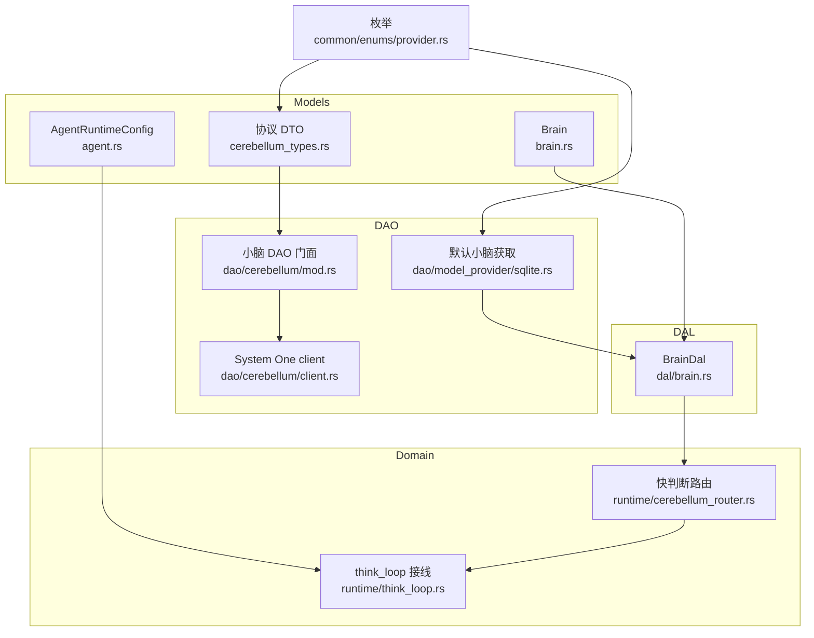
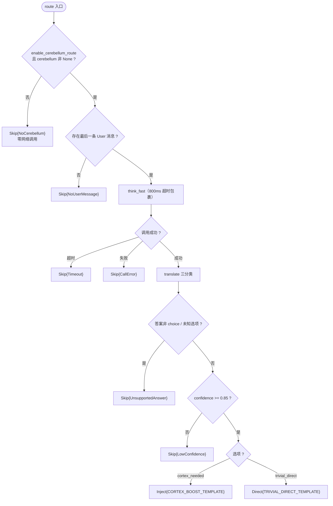
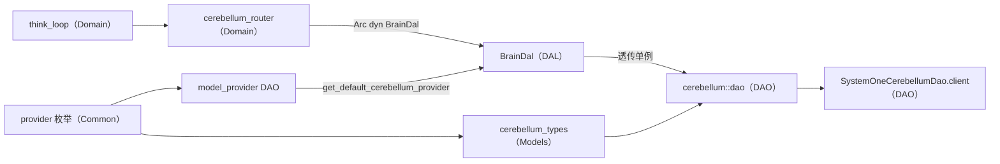
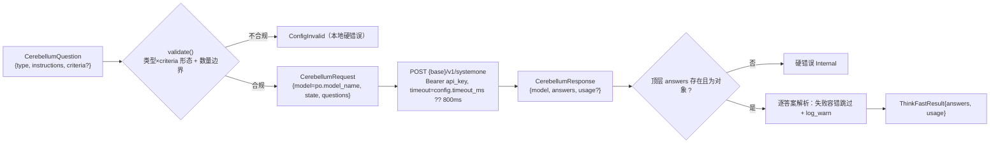

# 小脑快判断（System One）

<cite>
**本文引用的文件**
- [src/models/cerebellum_types.rs#L23-L202](src/models/cerebellum_types.rs#L23-L202) — System One 协议 DTO（QuestionType/QuestionCriteria/CerebellumQuestion::validate/CerebellumRequest/CerebellumAnswer/CerebellumResponse/ThinkFastResult）
- [src/service/dao/cerebellum/mod.rs#L24-L87](src/service/dao/cerebellum/mod.rs#L24-L87) — CerebellumDao trait + SystemOneCerebellumDao 单例 + dao()/init()
- [src/service/dao/cerebellum/client.rs#L23-L219](src/service/dao/cerebellum/client.rs#L23-L219) — resolve_endpoint / resolve_timeout_ms / think_fast 编解码 + 错误分类
- [src/service/domain/runtime/cerebellum_router.rs#L29-L293](src/service/domain/runtime/cerebellum_router.rs#L29-L293) — 常量集中 + DegradedReason / RouteDecision / route() / translate() / route_with_default_dao()
- [src/service/domain/runtime/think_loop.rs#L288-L337](src/service/domain/runtime/think_loop.rs#L288-L337) — run_think_loop 首轮前单点接线
- [src/service/dal/brain.rs#L208-L215](src/service/dal/brain.rs#L208-L215) — wake_brain Local 分支注入 brain.cerebellum
- [src/service/dal/brain.rs#L416-L428](src/service/dal/brain.rs#L416-L428) — BrainDal::think_fast 透传 cerebellum dao
- [src/service/dao/model_provider/sqlite.rs#L236-L262](src/service/dao/model_provider/sqlite.rs#L236-L262) — get_default_cerebellum_provider
- [src/models/brain.rs#L16-L76](src/models/brain.rs#L16-L76) — Brain 新增 cerebellum 字段与构造器
- [src/models/agent.rs#L80-L148](src/models/agent.rs#L80-L148) — AgentRuntimeConfig 双开关
- [common/src/enums/provider.rs#L14-L56](common/src/enums/provider.rs#L14-L56) — ProviderType::Jev=8 / ModelCapability::Decision=2
- [src/service/domain/runtime/cerebellum_router.rs#L295-L596](src/service/domain/runtime/cerebellum_router.rs#L295-L596) — 路由三分类单元测试

**更新摘要（2026-09-30，base b82d3f7f→8fa050d0）**：本次区间引入「小脑快判断（Cerebellum）」能力全链路。新增 System One 协议 DTO（`src/models/cerebellum_types.rs`）与 `SystemOneCerebellumDao` client（`src/service/dao/cerebellum/`），新增 `ProviderType::Jev=8` / `ModelCapability::Decision=2` 两个尾部追加枚举变体，新增默认小脑获取（`get_default_cerebellum_provider`）与 Brain 注入（`brain.cerebellum`），并在 think 循环首轮前落地运行时快判断路由三分类（`cerebellum_router.rs` 的 Direct/Inject/Skip + `think_loop.rs` 单点接线）。这是本主题首篇长文。

**本文关联三类文档**
- 【① Design 决策快照】
  - [runtime_design.md](docs/design/runtime_design.md) — Agent 唤醒 + 工具二分整体设计，本能力的宿主运行时设计
- 【② Plan 落地快照】
  - 暂无（本次同步区间未落地对应的 `docs/plan/` 快照件）
- 【④ RAG 原子知识卡】
  - [小脑快判断（Cerebellum）：System One 协议 DTO + SystemOneCerebellumDao client + 默认小脑获取 + 运行时快判断路由三分类](docs/wiki/knowledge/zh/小脑快判断（Cerebellum）：System One 协议 DTO + SystemOneCerebellumDao client + 默认小脑获取 + 运行时快判断路由三分类/小脑快判断（Cerebellum）：System One 协议 DTO + SystemOneCerebellumDao client + 默认小脑获取 + 运行时快判断路由三分类.md) — 同主题原子卡，含 §4 硬约束 12 条与三分类决策表
- 【③ 关联 Wiki 长文】
  - [运行时领域.md](docs/wiki/zh/content/核心模块/服务层/领域层/运行时领域.md) — think_loop 宿主运行时全貌
  - [数据模型.md](docs/wiki/zh/content/数据模型/数据模型.md) — ModelProvider 实体与枚举口径
</cite>

## 目录
1. [简介](#简介)
2. [项目结构](#项目结构)
3. [核心组件](#核心组件)
4. [架构总览](#架构总览)
5. [详细组件分析](#详细组件分析)
6. [依赖关系分析](#依赖关系分析)
7. [性能与并发](#性能与并发)
8. [故障排查指南](#故障排查指南)
9. [结论](#结论)
10. [附录：协议编解码与关键流程](#附录协议编解码与关键流程)

## 简介
本章节面向「AI Agent 运行时」的读者，介绍 AI Orz 的「System One 快判断」能力（代号小脑 Cerebellum）。核心语义是：在进入大脑（cortex）主循环之前，让小脑（`jev` / TypeSafe AI System One 决策模型）用一次亚秒级调用给出「琐碎直回 / 需完整思考」的路由结论，从而为寒暄、客套、简单确认类请求省掉完整多轮 cortex 主循环的 token 与延迟成本。

小脑不兼容 OpenAI 的 `chat/completions` 协议，走独立的 `POST {base}/v1/systemone`（Bearer 鉴权）；系统为此新增 `ProviderType::Jev = 8` 与 `ModelCapability::Decision = 2` 两个用途枚举，二者均为 `#[repr(i32)]` 尾部追加变体，免 DB migration。整条链路由「协议 DTO → System One client → 默认小脑获取 → Brain 注入 → 运行时路由三分类 → think_loop 单点接线」六段构成，任何异常都收敛为「静默跳过 = 现状」，并可通过管理面停用默认小脑实现一键全局回滚（零代码、零重启）。

> 📌 源码口径说明：本能力的 System One 协议口径依据官方公开文档多来源交叉实证，**未经真实端点实测**；连通性 Spike 顺延至凭据到位后二期启动前集中纠偏（见 [src/models/cerebellum_types.rs#L8-L16](src/models/cerebellum_types.rs#L8-L16)）。

## 项目结构
小脑相关代码按分层架构分布：

- **Models 层**：`src/models/cerebellum_types.rs`（协议 DTO 单一事实源）、`src/models/brain.rs`（Brain 新增 `cerebellum` 字段）、`src/models/agent.rs`（运行双开关）。
- **DAO 层**：`src/service/dao/cerebellum/`（`mod.rs` 门面 + `client.rs` HTTP client）、`src/service/dao/model_provider/sqlite.rs`（默认小脑获取）。
- **DAL 层**：`src/service/dal/brain.rs`（Brain 装配注入 + `think_fast` 透传）。
- **Domain 层**：`src/service/domain/runtime/cerebellum_router.rs`（运行时快判断路由）。
- **Common 枚举**：`common/src/enums/provider.rs`（`ProviderType::Jev` / `ModelCapability::Decision`）。



**图表来源**
- [src/models/cerebellum_types.rs#L23-L202](src/models/cerebellum_types.rs#L23-L202)
- [src/service/dao/cerebellum/mod.rs#L29-L87](src/service/dao/cerebellum/mod.rs#L29-L87)
- [src/service/domain/runtime/cerebellum_router.rs#L95-L293](src/service/domain/runtime/cerebellum_router.rs#L95-L293)
- [src/service/dal/brain.rs#L208-L215](src/service/dal/brain.rs#L208-L215)

## 核心组件
- **协议 DTO（`cerebellum_types.rs`）**：三类问题/答案一一对应——`noul`（无选项，输出 0~1 概率，无 confidence）/ `choice`（≤255 选项，输出 choice + confidence + probabilities）/ `score`（2~10 级有序等级，输出 score + probabilities + legend + confidence）。`CerebellumQuestion::validate` 前置执行「类型 × criteria 形态 + 数量边界」硬校验。
- **System One client（`dao/cerebellum/`）**：`CerebellumDao` trait + `SystemOneCerebellumDao` 单例（`OnceLock`）。无状态、全配置随 `&ModelProviderPo` 传入；`client.rs` 负责端点/超时解析、请求编解码、响应结构校验与错误分类。
- **默认小脑获取（`get_default_cerebellum_provider`）**：与 embedding 版同构，查询 `capability = Decision AND status = Normal AND api_key 非空` 取第一条；语义即「status 单启用即默认」。
- **Brain 注入（`dal/brain.rs` + `models/brain.rs`）**：`wake_brain` 在 Local 分支注入 `brain.cerebellum`；无启用记录则为 `None`，行为与现状逐字节一致。
- **运行时快判断路由（`cerebellum_router.rs`）**：`route()` 只发一个 choice 问题（`route`），两选项 `trivial_direct` / `cortex_needed`；`confidence >= 0.85` 才采纳，否则保守降级；`translate()` 纯函数完成三分类。
- **think_loop 接线（`think_loop.rs`）**：`run_think_loop` 首轮前单点接线，四场景（awaken/sleep_and_settle/summary/intent_analyze）自动全覆盖。

**章节来源**
- [src/models/cerebellum_types.rs#L30-L110](src/models/cerebellum_types.rs#L30-L110)
- [src/service/dao/cerebellum/mod.rs#L29-L87](src/service/dao/cerebellum/mod.rs#L29-L87)
- [src/service/dao/model_provider/sqlite.rs#L236-L262](src/service/dao/model_provider/sqlite.rs#L236-L262)
- [src/models/brain.rs#L16-L76](src/models/brain.rs#L16-L76)
- [src/service/domain/runtime/cerebellum_router.rs#L29-L92](src/service/domain/runtime/cerebellum_router.rs#L29-L92)

## 架构总览
下图展示一次 Agent 唤醒中，小脑快判断如何嵌在 cortex 主循环之前。

```mermaid
sequenceDiagram
participant Consumer as "MessageConsumer"
participant Awaken as "RuntimeDomain.awakening"
participant Brain as "BrainDal.wake_brain"
participant Loop as "run_think_loop"
participant Router as "cerebellum_router.route"
participant Cere as "SystemOneCerebellumDao"
Consumer->>Awaken : "awaken(ctx, agent, message, options)"
Awaken->>Brain : "wake_brain(agent, memories)"
Brain->>Brain : "get_default_cerebellum_provider → brain.cerebellum"
Awaken->>Loop : "run_think_loop(params)"
Loop->>Loop : "brain.cerebellum 判空 + 定位最后一条 User 文本"
Loop->>Router : "route_with_default_dao(ctx, cerebellum, enabled, ...)"
Router->>Brain : "dal.think_fast(ctx, provider, state, questions)"
Brain->>Cere : "think_fast(...) / POST {base}/v1/systemone"
Cere-->>Brain : "ThinkFastResult{answers, usage}"
Brain-->>Router : "ThinkFastResult"
Router-->>Loop : "RouteDecision: Direct / Inject / Skip"
alt Inject
Loop->>Loop : "messages.insert(0, System{增强提示})"
else Direct 且开关开
Loop-->>Awaken : "ThinkLoopResult::Final（短路主循环）"
else Skip
Loop->>Loop : "空操作，进入正常主循环"
end
```

**图表来源**
- [src/service/dal/brain.rs#L208-L215](src/service/dal/brain.rs#L208-L215)
- [src/service/dal/brain.rs#L416-L428](src/service/dal/brain.rs#L416-L428)
- [src/service/domain/runtime/cerebellum_router.rs#L95-L293](src/service/domain/runtime/cerebellum_router.rs#L95-L293)
- [src/service/domain/runtime/think_loop.rs#L288-L337](src/service/domain/runtime/think_loop.rs#L288-L337)

## 详细组件分析

### 协议 DTO：三类型问题与答案
`QuestionType` 定义 `Noul` / `Choice` / `Score` 三型；`QuestionCriteria` 用 `#[serde(untagged)]` 承载双形态（choice→选项对象、score→有序等级数组），`CerebellumQuestion::validate` 强制「类型与 criteria 形态匹配」并校验数量边界（choice ∈ [1,255]、score ∈ [2,10]、noul 不带 criteria），不合规直接 `ConfigInvalid`。响应侧 `CerebellumAnswer` 用 `#[serde(tag = "type")]` 区分三型，并提供 `as_noul` / `as_choice` / `as_score` 取值器；`CerebellumResponse` 的 `usage` 缺失时容错为零值。

**章节来源**
- [src/models/cerebellum_types.rs#L30-L202](src/models/cerebellum_types.rs#L30-L202)

### System One client：编解码与错误分类
`resolve_endpoint` 中 `provider.base_url` 非空即优先（支持自建 relay），缺省走 `DEFAULT_SYSTEM_ONE_BASE_URL`（`https://api.typesafe.ai`）；**`api_key` 为空的硬错误**（与 cortex `validate_provider_for_request` 口径一致）。`resolve_timeout_ms` 以 `config.timeout_ms` 优先，缺省/脏 config 兜底 `DEFAULT_CEREBELLUM_TIMEOUT_MS = 800`。`think_fast` 先做 questions 非空 + 逐个 validate 的硬校验，再发请求；响应结构校验「顶层必须携带对象形态的 answers」（硬错误），而单个答案解析失败走容错跳过并 `log_warn!`（协议版本演进容忍）。错误分类与 cortex 同口径：429 → `ModelRateLimited`、401|403 → `ModelAuth`、4xx → `ModelBadRequest`（含内容过滤 → `ModelContentFiltered`）、5xx → `ModelServerError`。

**章节来源**
- [src/service/dao/cerebellum/client.rs#L23-L219](src/service/dao/cerebellum/client.rs#L23-L219)
- [src/service/dao/cerebellum/mod.rs#L24-L87](src/service/dao/cerebellum/mod.rs#L24-L87)

### 默认小脑获取与 Brain 注入
默认小脑与 embedding 版同构：`get_default_cerebellum_provider` 查询 `capability = Decision AND status = Normal` 取候选列表后过滤 `api_key` 非空项（limit 100 足以覆盖绝大多数组织规模）。`wake_brain` 在 Local 分支调用该查询并写入 `brain.cerebellum`（查询失败向上传播、无启用记录 → `None`）；Cli/Remote 外部 Agent 维持 `None`。`BrainDal::think_fast` 把调用透传给 `dao::cerebellum::dao()` 单例（快判断无状态、全配置随 `&ModelProviderPo` 传入），使 domain 层 `cerebellum_router` 只依赖 `BrainDal` trait（测试可注入 mock）。

**章节来源**
- [src/service/dao/model_provider/sqlite.rs#L236-L283](src/service/dao/model_provider/sqlite.rs#L236-L283)
- [src/service/dal/brain.rs#L208-L215](src/service/dal/brain.rs#L208-L215)
- [src/service/dal/brain.rs#L416-L428](src/service/dal/brain.rs#L416-L428)
- [src/models/brain.rs#L16-L76](src/models/brain.rs#L16-L76)

### 运行时路由三分类
`route()` 先判总开关与用户消息是否存在，再构造**轻量上下文**（只带 `agent_id` / `agent_name` / `last_user_message` 三项，不取全量记忆与完整会话历史），随后用一个 choice 问题包裹 `tokio::time::timeout(800ms)` 调用 `dal.think_fast`；`translate()` 纯函数把答案翻译为 `Direct` / `Inject` / `Skip` 三分类。所有降级原因（`NoCerebellum` / `NoUserMessage` / `CallError` / `Timeout` / `LowConfidence` / `UnsupportedAnswer`）通过 `DegradedReason::as_str()` 统一为观测口径。



**图表来源**
- [src/service/domain/runtime/cerebellum_router.rs#L95-L293](src/service/domain/runtime/cerebellum_router.rs#L95-L293)

**章节来源**
- [src/service/domain/runtime/cerebellum_router.rs#L29-L293](src/service/domain/runtime/cerebellum_router.rs#L29-L293)

### think_loop 接线与结果处理
`run_think_loop` 在首轮前做单点接线：`brain.cerebellum` 为 `Some` 时，取 messages 中最后一条 `User` 文本 → `route_with_default_dao`；`Direct` + `cerebellum_trivial_direct=true` → 提前 `return ThinkLoopResult::Final`；`Inject` → `messages.insert(0, ChatMessage::System{增强提示})`；`Skip` → 空操作。因接线位于 `run_think_loop`（而非各调用点），四场景自动全覆盖。结果只增强不替代：`Inject` 只是在消息序列头部追加一条 System 提示，cortex 主循环照常执行；只有显式打开 `cerebellum_trivial_direct` 才会短路主循环。

**章节来源**
- [src/service/domain/runtime/think_loop.rs#L288-L337](src/service/domain/runtime/think_loop.rs#L288-L337)
- [src/models/agent.rs#L80-L148](src/models/agent.rs#L80-L148)

### 枚举与运行开关
`ProviderType::Jev = 8`（Display `"jev"`）与 `ModelCapability::Decision = 2`（含 `is_decision()`，Display `"decision"`）均为 `#[repr(i32)]` 尾部追加变体，避免存量 DB 判别值错位。`AgentRuntimeConfig` 新增两个开关：`enable_cerebellum_route`（serde default `true`，有启用小脑即自动参与路由）与 `cerebellum_trivial_direct`（serde default `false`，TRIVIAL 直回默认关闭，需 Spike 实测 + 灰度后另行拍板放开）。

**章节来源**
- [common/src/enums/provider.rs#L14-L56](common/src/enums/provider.rs#L14-L56)
- [common/src/enums/provider.rs#L126-L151](common/src/enums/provider.rs#L126-L151)
- [src/models/agent.rs#L80-L148](src/models/agent.rs#L80-L148)

## 依赖关系分析
- 严格单向：Adapter → Domain → DAL → DAO → Models，禁止跨层/同层互调。小脑链路中 `cerebellum_router`（Domain）只依赖 `BrainDal`（DAL trait），DAL 透传 DAO 单例，DAO 依赖 `ModelProviderPo`（Models）。
- `cerebellum_router` 通过 `Arc<dyn BrainDal>` 注入依赖，生产入口 `route_with_default_dao` 绑定 `dal::brain::dal()`，测试注入 `MockBrainDal`（见 `cerebellum_router.rs` 单测）。
- 枚举 `ProviderType` / `ModelCapability` 贯穿 Models、DAO 与展示层，保证用途过滤（Decision 与 Agent/Embedding 隔离）类型一致。



**图表来源**
- [src/service/domain/runtime/cerebellum_router.rs#L95-L293](src/service/domain/runtime/cerebellum_router.rs#L95-L293)
- [src/service/dal/brain.rs#L208-L215](src/service/dal/brain.rs#L208-L215)
- [src/service/dao/cerebellum/mod.rs#L45-L87](src/service/dao/cerebellum/mod.rs#L45-L87)

**章节来源**
- [src/service/domain/runtime/cerebellum_router.rs#L95-L293](src/service/domain/runtime/cerebellum_router.rs#L95-L293)
- [src/service/dal/brain.rs#L416-L428](src/service/dal/brain.rs#L416-L428)

## 性能与并发
- **亚秒预算双保险**：路由层用 `tokio::time::timeout(800ms)` 包裹整次调用（`CEREBELLUM_ROUTE_TIMEOUT_MS`），DAO 层再用 per-request `timeout(config.timeout_ms ?? 800ms)` 兜底；任一层超时都收敛为 `Skip`，不阻塞主循环。
- **单次请求并行评估**：System One 协议在单次请求内并行独立评估多个类型化问题（`CerebellumRequest.questions` 为 qid → question 映射），路由目前只发一个 `route` 问题，成本与延迟可控。
- **轻量上下文铁律**：`state` 只携带三项轻量信息，保证调用是「亚秒快判断」而非「第二个大脑」，避免把记忆检索/历史拼装成本引入快判断路径。
- **零调用降级**：无启用小脑或总开关关闭时不发起任何网络调用，既省成本也保住「停用即回滚」语义。
- **单例复用**：`SystemOneCerebellumDao` 通过 `OnceLock` 全局单例，`reqwest::Client` 复用连接池（`pkg::http::presets::llm()`）。

**章节来源**
- [src/service/domain/runtime/cerebellum_router.rs#L29-L46](src/service/domain/runtime/cerebellum_router.rs#L29-L46)
- [src/service/domain/runtime/cerebellum_router.rs#L159-L188](src/service/domain/runtime/cerebellum_router.rs#L159-L188)
- [src/service/dao/cerebellum/client.rs#L23-L38](src/service/dao/cerebellum/client.rs#L23-L38)
- [src/service/dao/cerebellum/mod.rs#L45-L57](src/service/dao/cerebellum/mod.rs#L45-L57)

## 故障排查指南
- **症状一：小脑路由完全未生效（日志中无 `cerebellum_route` 记录，请求行为与未接入时一致）**
  - 起点锚点：[src/service/domain/runtime/think_loop.rs#L293-L337](src/service/domain/runtime/think_loop.rs#L293-L337) 的 `brain.cerebellum` 判空分支。
  - 次级排查：确认默认小脑是否真的装配成功——查 `get_default_cerebellum_provider`（[src/service/dao/model_provider/sqlite.rs#L236-L262](src/service/dao/model_provider/sqlite.rs#L236-L262)）的条件：`capability=Decision` + `status=Normal` + `api_key` 非空；若 `brain.cerebellum=None` 会直接 `Skip{NoCerebellum}`。其次确认 `enable_cerebellum_route` 是否被显式关为 `false`（Agent 级回滚开关），以及 `wake_brain` 是否走了 Local 分支（Cli/Remote 恒为 `None`）。

- **症状二：路由频繁 `Skip{CallError}` / `Skip{Timeout}`（小脑结果从不被采纳）**
  - 起点锚点：[src/service/domain/runtime/cerebellum_router.rs#L159-L188](src/service/domain/runtime/cerebellum_router.rs#L159-L188) 的超时/失败降级分支与结构化日志。
  - 次级排查：① 检查 provider 配置——`api_key` 为空会在 `resolve_endpoint` 直接硬错误（[src/service/dao/cerebellum/client.rs#L45-L58](src/service/dao/cerebellum/client.rs#L45-L58)），`base_url` 缺省走默认端点；② 检查 `config.timeout_ms` 是否被设得过小而频繁触发超时，或默认端点连通性/鉴权问题（`skip` 日志的 `degraded_reason=timeout` vs `call_error` 可区分）；③ 关注 `model_call_error` 映射的 401/403（鉴权）与 5xx（服务端）提示。

- **症状三：小脑返回正常但始终 `Skip{UnsupportedAnswer}`（决策永不生效）**
  - 起点锚点：[src/service/domain/runtime/cerebellum_router.rs#L236-L272](src/service/domain/runtime/cerebellum_router.rs#L236-L272) 的 `translate()` 纯函数。
  - 次级排查：① 响应 `answers` 的键必须等于 `ROUTE_QUESTION_ID = "route"`，选项 id 必须是 `trivial_direct` / `cortex_needed`——键/选项字面量漂移会导致永远命中 `_ => Skip{UnsupportedAnswer}`；② 确认答案类型为 `choice`（`score`/`noul` 会被判为不支持）；③ 若顶层缺 `answers` 或 `answers` 非对象，client 会直接硬错误（[src/service/dao/cerebellum/client.rs#L120-L149](src/service/dao/cerebellum/client.rs#L120-L149)）。

- **症状四：`trivial_direct` 高置信结论不直回（仍进入完整主循环）**
  - 起点锚点：[src/service/domain/runtime/think_loop.rs#L308-L324](src/service/domain/runtime/think_loop.rs#L308-L324) 的 `Direct` 分支。
  - 次级排查：`Direct` 只有当 `cerebellum_trivial_direct=true` 才会短路主循环；该开关默认 `false`（[src/models/agent.rs#L80-L86](src/models/agent.rs#L80-L86)），开关关闭时「既不直回也不注入」属保守口径而非故障。

- **症状五：`Inject` 未按预期改变回答质量（增强提示似乎没生效）**
  - 起点锚点：[src/service/domain/runtime/think_loop.rs#L326-L333](src/service/domain/runtime/think_loop.rs#L326-L333) 的 `Inject` 分支。
  - 次级排查：`Inject` 只向消息序列头部插入一条 `ChatMessage::System`（`CORTEX_BOOST_TEMPLATE`），cortex 主循环照常执行——若误期望其「替代主循环」则属认知偏差；`Direct` 与 `Inject` 的阈值同为 `CEREBELLUM_ROUTE_CONFIDENCE_THRESHOLD = 0.85`，低置信两向都不动作。

**章节来源**
- [src/service/domain/runtime/cerebellum_router.rs#L236-L272](src/service/domain/runtime/cerebellum_router.rs#L236-L272)
- [src/service/domain/runtime/think_loop.rs#L288-L337](src/service/domain/runtime/think_loop.rs#L288-L337)
- [src/service/dao/cerebellum/client.rs#L45-L58](src/service/dao/cerebellum/client.rs#L45-L58)
- [src/service/dao/model_provider/sqlite.rs#L236-L262](src/service/dao/model_provider/sqlite.rs#L236-L262)
- [src/models/agent.rs#L80-L86](src/models/agent.rs#L80-L86)

## 结论
小脑快判断以「协议 DTO → client → 默认小脑获取 → Brain 注入 → 运行时路由三分类 → think_loop 单点接线」六段实现了一次几乎零成本的意图快判断：让寒暄/简单确认类请求不必付出完整多轮 cortex 主循环的 token 与延迟成本，同时保持绝对安全——三层降级（无小脑 / 调用失败或超时 / 低置信）全部收敛为「静默跳过 = 现状」，且可通过管理面停用默认小脑一键全局回滚（`brain.cerebellum` 变 `None` 即断链，零代码零重启）。结果默认只增强不替代（`Inject` 插 System 提示、`Direct` 直回默认关），把「是否放开直回」的决策留给 Spike 实测与灰度。协议口径当前未经真实端点实测，连通性 Spike 顺延至凭据到位后集中纠偏。

## 附录：协议编解码与关键流程

### System One 协议编解码链路


**图表来源**
- [src/models/cerebellum_types.rs#L64-L110](src/models/cerebellum_types.rs#L64-L110)
- [src/service/dao/cerebellum/client.rs#L60-L157](src/service/dao/cerebellum/client.rs#L60-L157)

### 路由决策三分类与 think_loop 动作对照
```mermaid
stateDiagram-v2
[*] --> Skip
Skip --> Direct : "trivial_direct 且 confidence>=0.85"
Skip --> Inject : "cortex_needed 且 confidence>=0.85"
Direct --> FinalReturn : "开关 cerebellum_trivial_direct=true"
Direct --> Continue : "开关关闭：不直回不注入"
Inject --> Continue : "messages.insert(0, System)"
Continue --> [*] : "进入 cortex 主循环"
FinalReturn --> [*] : "ThinkLoopResult::Final"
```

**图表来源**
- [src/service/domain/runtime/cerebellum_router.rs#L80-L92](src/service/domain/runtime/cerebellum_router.rs#L80-L92)
- [src/service/domain/runtime/think_loop.rs#L308-L337](src/service/domain/runtime/think_loop.rs#L308-L337)

---

### 本文关联的文档
- 📐 Design: docs/design/runtime_design.md
- 🎴 RAG 卡: docs/wiki/knowledge/zh/小脑快判断（Cerebellum）：System One 协议 DTO + SystemOneCerebellumDao client + 默认小脑获取 + 运行时快判断路由三分类/小脑快判断（Cerebellum）：System One 协议 DTO + SystemOneCerebellumDao client + 默认小脑获取 + 运行时快判断路由三分类.md
- 📄 关联长文: docs/wiki/zh/content/核心模块/服务层/领域层/运行时领域.md

---

### 更新摘要（2026-09-30，base b82d3f7f→8fa050d0）
**主题**：小脑快判断（Cerebellum / System One）能力首次落地
**关键变更**：
1. 新增 System One 协议 DTO 与 client（`src/models/cerebellum_types.rs` + `src/service/dao/cerebellum/{mod,client}.rs`）
2. 新增枚举 `ProviderType::Jev=8` / `ModelCapability::Decision=2`（尾部追加免 migration）
3. 新增默认小脑获取 `get_default_cerebellum_provider` + `Brain.cerebellum` 字段与 `wake_brain` 注入
4. 新增运行时路由三分类 `cerebellum_router.rs`（Direct/Inject/Skip + 三层降级）与 `think_loop.rs` 首轮前单点接线
5. `AgentRuntimeConfig` 新增 `enable_cerebellum_route`(默认 true) / `cerebellum_trivial_direct`(默认 false) 双开关
**涉及 RAG 卡**：小脑快判断（Cerebellum）卡（本次新建）