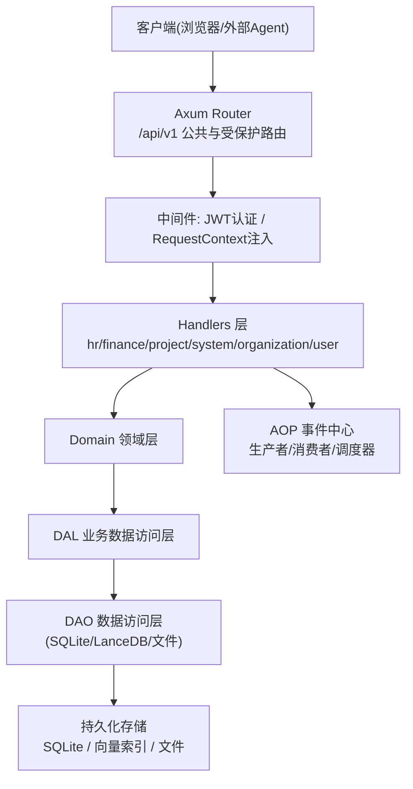
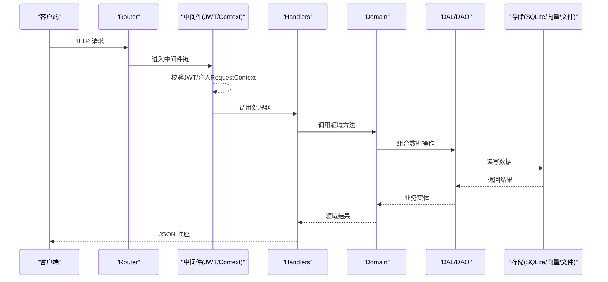
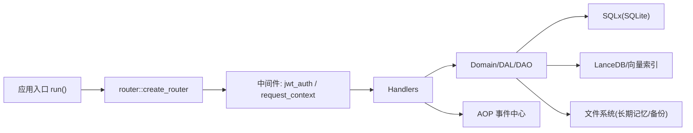

# 功能模块

<cite>
**本文引用的文件**
- [src/main.rs](src/main.rs)
- [src/lib.rs](src/lib.rs)
- [src/router.rs](src/router.rs)
- [common/src/lib.rs](common/src/lib.rs)
- [Cargo.toml](Cargo.toml)
- [docs/ARCHITECTURE.md](docs/ARCHITECTURE.md)
</cite>

## 目录
1. [简介](#简介)
2. [项目结构](#项目结构)
3. [核心组件](#核心组件)
4. [架构总览](#架构总览)
5. [详细组件分析](#详细组件分析)
6. [依赖分析](#依赖分析)
7. [性能考虑](#性能考虑)
8. [故障排查指南](#故障排查指南)
9. [结论](#结论)
10. [附录](#附录)

## 简介
本文件为 AI Orz 的功能模块文档，面向产品、运营与开发者，系统性介绍以下能力：用户与组织管理、AI Agent 管理、模型提供商管理、工具生态（含 MCP）、消息系统、项目管理、知识图谱、系统管理等。内容涵盖业务场景、操作流程、API 接口概览与使用方法，并提供架构图、业务流程图与配置示例指引，帮助快速理解与上手。

## 项目结构
后端采用 Axum 路由 + 分层服务（handlers → domain → dal → dao → models），前端为 Dioxus SPA，前后端通过 common crate 共享 DTO 与枚举类型，保证类型一致性与契约稳定。

图示来源
- [src/router.rs:12-136](src/router.rs#L12-L136)
- [src/lib.rs:114-172](src/lib.rs#L114-L172)
- [docs/ARCHITECTURE.md:12-46](docs/ARCHITECTURE.md#L12-L46)

章节来源
- [src/router.rs:12-136](src/router.rs#L12-L136)
- [src/lib.rs:114-172](src/lib.rs#L114-L172)
- [common/src/lib.rs:1-19](common/src/lib.rs#L1-L19)
- [docs/ARCHITECTURE.md:12-46](docs/ARCHITECTURE.md#L12-L46)

## 核心组件
- 路由与中间件
  - 统一入口在 router.rs，划分公共路由与受保护路由；JWT 认证与 RequestContext 注入按洋葱模型顺序执行，确保上下文安全。
- 领域与分层
  - handlers 仅做请求解析与响应组装；domain 编排业务规则；dal/dao 专注数据访问；models 定义实体。
- 事件总线(AOP)
  - 启动时注册生产者与消费者，支持异步消费、轮询生产、顺序保证与统计收集。
- 存储
  - SQLite 主库 + 向量检索(LanceDB/HNSW) + 文件(长期记忆原始细节)。

章节来源
- [src/router.rs:12-136](src/router.rs#L12-L136)
- [docs/ARCHITECTURE.md:122-147](docs/ARCHITECTURE.md#L122-L147)
- [docs/ARCHITECTURE.md:229-241](docs/ARCHITECTURE.md#L229-L241)
- [docs/ARCHITECTURE.md:150-184](docs/ARCHITECTURE.md#L150-L184)

## 架构总览

图示来源
- [src/router.rs:12-136](src/router.rs#L12-L136)
- [src/lib.rs:114-172](src/lib.rs#L114-L172)
- [docs/ARCHITECTURE.md:325-385](docs/ARCHITECTURE.md#L325-L385)

## 详细组件分析

### 用户与组织管理
- 业务场景
  - 多租户隔离：组织作为顶级租户，包含用户、Agent、模型提供商等。
  - 角色权限：SuperAdmin/Admin/Member，系统初始化后创建首个 SuperAdmin。
  - 登录鉴权：JWT + HttpOnly Cookie，公共路由无需认证，受保护路由强制认证。
- 关键流程
  - 系统初始化检查与初始化
  - 登录/登出
  - 当前用户组织信息获取与更新
  - 组织与用户 CRUD
- API 概览
  - 公共
    - GET /api/v1/organization/initialize/check
    - POST /api/v1/organization/initialize
    - GET /api/v1/organization/initialize/progress
    - POST /api/v1/organization/auth/login
    - POST /api/v1/organization/auth/logout
    - GET /api/v1/organization/list
  - 受保护
    - GET/PUT /api/v1/organization/me
    - GET/PUT/DELETE /api/v1/organization/{id}
    - POST /api/v1/organization/user
    - GET /api/v1/organization/user/me/list
    - GET /api/v1/organization/user/{org_id}/list
    - PUT /api/v1/organization/user/update
    - GET /api/v1/organization/user/username/{username}
    - DELETE /api/v1/organization/user/id/{user_id}
- 使用建议
  - 首次部署先调用初始化接口，再创建 Admin/SuperAdmin。
  - 所有受保护接口需携带有效 JWT。

章节来源
- [src/router.rs:61-94](src/router.rs#L61-L94)
- [src/router.rs:242-290](src/router.rs#L242-L290)
- [docs/ARCHITECTURE.md:122-147](docs/ARCHITECTURE.md#L122-L147)

### AI Agent 管理
- 业务场景
  - 以“智能体”为单位进行任务执行、工具绑定、技能装配、记忆与知识图谱联动。
  - 支持内部 Agent 与外部 Agent（通过 A2A 协议）。
- 关键流程
  - 创建/查询/搜索/更新/删除 Agent
  - 安装/卸载工具包与技能包
  - 绑定/解绑工具到 Agent
  - 记忆检索与种子节点推荐
- API 概览
  - /api/v1/hr/agents (CRUD、query/search、reception、external)
  - /api/v1/hr/agents/{id}/tool-packs, skill-packs
  - /api/v1/hr/agents/{agent_id}/tools/{tool_id}/bind
  - /api/v1/hr/agents/search_memory, query_memory, recommend_seed_nodes
- 使用建议
  - 为新 Agent 装配必要技能与工具，开启记忆检索以提升推理质量。
  - 对外暴露的 Agent 可通过 A2A 订阅与回调集成。

章节来源
- [src/router.rs:292-413](src/router.rs#L292-L413)
- [docs/ARCHITECTURE.md:69-119](docs/ARCHITECTURE.md#L69-L119)

### 模型提供商管理
- 业务场景
  - 统一管理 LLM 提供商配置，支持 OpenAI 兼容、Ollama 等，供多个 Agent 复用。
  - 提供连接测试、切换嵌入模型、重建向量进度查询与直接调用测试。
- 关键流程
  - 创建/查询/更新/删除 Provider
  - 测试连接、切换嵌入模型、重建进度
  - 调用测试（call_model）
- API 概览
  - /api/v1/finance/model-providers (CRUD、test、switch、call、rebuild-progress)
- 使用建议
  - 优先选择高可用、低延迟的提供商；嵌入模型与生成模型可分离配置。
  - 定期测试连接与重建进度，保障向量检索可用性。

章节来源
- [src/router.rs:446-480](src/router.rs#L446-L480)
- [docs/ARCHITECTURE.md:503-513](docs/ARCHITECTURE.md#L503-L513)

### 工具生态系统（含 MCP）
- 业务场景
  - 工具注册、查询、调试、状态管理与绑定到 Agent。
  - MCP Server 管理、工具同步与列表查询。
- 关键流程
  - 创建/查询/搜索/更新/删除工具
  - 绑定/解绑工具到 Agent
  - 调试调用（Admin）
  - MCP Server 增删改查、状态切换、工具同步
- API 概览
  - /api/v1/finance/tools (CRUD、query/search/tags/debug-call/bind/unbind)
  - /api/v1/finance/mcp-servers (CRUD、status、sync tools)
  - /api/v1/finance/tool-call-entries (调用记录查询)
- 使用建议
  - 将常用能力封装为工具并绑定给 Agent；通过 tool-call-entries 审计调用。
  - MCP 工具通过同步拉取，保持工具清单与远程一致。

章节来源
- [src/router.rs:525-601](src/router.rs#L525-L601)

### 消息系统
- 业务场景
  - 多渠道消息收发、SSE 实时推送、消息检索与订阅。
  - 与 Agent 协作：向 Agent 发送消息触发思考与工具调用。
- 关键流程
  - 发送消息到 Agent、列出/搜索消息、SSE 订阅
  - 消息渠道管理（创建/查询/更新/测试/删除）
- API 概览
  - /api/v1/finance/messages/agents (POST)
  - /api/v1/finance/messages (GET/POST search)
  - /api/v1/finance/messages/sse (GET)
  - /api/v1/finance/message-channels (CRUD、status、test)
- 使用建议
  - 使用 SSE 实现前端实时对话体验；结合 Agent 能力完成自动回复。
  - 多渠道接入时，优先测试连通性再启用。

章节来源
- [src/router.rs:482-524](src/router.rs#L482-L524)

### 项目管理
- 业务场景
  - 项目、任务、产物(Artifact)的聚合管理，支撑团队协作与交付物沉淀。
- 关键流程
  - 项目 CRUD、状态更新、查询与搜索
  - 任务 CRUD、状态/进度更新、按项目/Agent 列举
  - 产物 CRUD、文本产物创建、内容获取与路径注册
- API 概览
  - /api/v1/projects (CRUD、query、search、status)
  - /api/v1/tasks (CRUD、query、search、status、progress、按项目/Agent 列举)
  - /api/v1/artifacts (CRUD、text、register-from-path、content)
- 使用建议
  - 将复杂目标拆分为任务，产物关联至任务便于追溯。
  - 使用搜索与查询接口构建工作台视图。

章节来源
- [src/router.rs:145-240](src/router.rs#L145-L240)

### 知识图谱
- 业务场景
  - 基于短期/长期记忆的归纳与关系建模，支持检索增强与推荐种子节点。
- 关键流程
  - 记忆写入与检索（工作记忆/短期/长期）
  - 知识图谱节点与关系维护（标签、发布态）
  - 推荐种子节点用于引导 Agent 思考
- API 概览
  - /api/v1/hr/agents/search_memory, query_memory
  - /api/v1/hr/agents/recommend_seed_nodes
- 使用建议
  - 在 Agent 思考前检索相关知识与近期摘要，提升回答质量。
  - 对重要知识节点打标签并选择性发布，便于跨 Agent 共享。

章节来源
- [docs/ARCHITECTURE.md:150-184](docs/ARCHITECTURE.md#L150-L184)
- [src/router.rs:402-413](src/router.rs#L402-L413)

### 系统管理
- 业务场景
  - 定时任务(Cron)、备份恢复、日志查询与统计、AOP 队列监控、健康指标、Seed 配置迁移、后台任务进度。
- 关键流程
  - Cron 触发器 CRUD、暂停/恢复
  - 备份创建/列表/删除/恢复
  - 日志级别分布与时序统计
  - AOP 队列统计与事件查看
  - Seed 导出/导入/Diff/默认应用
  - 后台任务进度查询与清理
- API 概览
  - /api/v1/system/cron-triggers (CRUD、pause/resume)
  - /api/v1/system/backups (CRUD、restore)
  - /api/v1/system/logs (查询、stats)
  - /api/v1/system/aop/* (stats/events)
  - /api/v1/system/health/metrics
  - /api/v1/system/seed/* (list/save/load/diff/default/apply-default)
  - /api/v1/system/tasks/* (progress/list/cleanup)
- 使用建议
  - 高危操作（备份恢复）需具备管理员权限并在 Handler 内二次校验。
  - 通过 AOP stats 监控事件处理吞吐与积压情况。

章节来源
- [src/router.rs:603-739](src/router.rs#L603-L739)

### A2A 协议（Agent-to-Agent）
- 业务场景
  - 外部 Agent 发现与通信：公开 Agent Card、JSON-RPC 调用、SSE 订阅、回调。
- 关键流程
  - 获取 Agent 卡片(.well-known/agent.json)
  - 通过 /a2a 发起 JSON-RPC 调用（JWT 保护）
  - 通过 /a2a/subscribe 建立 SSE 订阅
  - 外部回调 /a2a/callback/{task_id} 推送任务更新
- API 概览
  - GET /.well-known/agent.json
  - POST /a2a (JSON-RPC)
  - POST /a2a/subscribe (SSE)
  - POST /a2a/callback/{task_id}
- 使用建议
  - 外部 Agent 应先获取卡片，再进行 RPC 调用与订阅；回调地址需公网可达。

章节来源
- [src/router.rs:19-58](src/router.rs#L19-L58)

## 依赖分析
- 运行时与框架
  - Axum 0.8 提供 Web 路由与中间件；Tokio 异步运行时。
- 数据存储
  - SQLx 0.8 操作 SQLite；LanceDB/Instant-distance 提供向量检索；fastembed 本地向量化。
- 安全与鉴权
  - jsonwebtoken + cookie 实现 JWT 认证与会话。
- 事件与监控
  - AOP 事件中心、tracing/tracing-subscriber 日志、自定义宏 log_info/log_error 等。
- 工具与扩展
  - rmcp 支持 MCP；reqwest 用于 HTTP 调用；tar/flate2 用于备份压缩。

图示来源
- [src/lib.rs:114-172](src/lib.rs#L114-L172)
- [src/router.rs:12-136](src/router.rs#L12-L136)
- [Cargo.toml:17-71](Cargo.toml#L17-L71)

章节来源
- [Cargo.toml:17-71](Cargo.toml#L17-L71)
- [docs/ARCHITECTURE.md:538-559](docs/ARCHITECTURE.md#L538-L559)

## 性能考虑
- 中间件顺序
  - JWT 认证在外层先执行，RequestContext 在内层后执行，避免上下文缺失导致 401/403。
- 存储优化
  - 原始细节按天追加写入 Markdown，减少数据库压力；索引与知识图谱存 SQLite，按需检索。
- 向量检索
  - 使用 LanceDB/HNSW 加速相似检索；嵌入模型可切换与重建，关注进度与降级策略。
- 事件处理
  - AOP 支持优先级与顺序键，相同 key 顺序锁保证顺序，不同 key 并行处理。
- 资源限制
  - 合理设置并发与超时；大文件上传与附件下载注意分块与流式传输。

章节来源
- [docs/ARCHITECTURE.md:137-147](docs/ARCHITECTURE.md#L137-L147)
- [docs/ARCHITECTURE.md:150-184](docs/ARCHITECTURE.md#L150-L184)
- [docs/ARCHITECTURE.md:229-241](docs/ARCHITECTURE.md#L229-L241)

## 故障排查指南
- 常见问题定位
  - 401/403：检查 JWT 是否有效且中间件顺序正确（JWT 外层，Context 内层）。
  - 向量检索失败：确认嵌入模型可用、重建进度完成；必要时回退到内存或降级策略。
  - 消息未送达：检查消息渠道状态与连接测试；查看 AOP 队列积压与错误事件。
  - 备份/恢复失败：核对权限与磁盘空间；查看备份列表与日志。
- 诊断手段
  - 日志查询与统计：/system/logs 与 stats 接口。
  - AOP 监控：/system/aop/stats 与 events。
  - 健康指标：/system/health/metrics。
  - 后台任务：/system/tasks 列表与进度。

章节来源
- [src/router.rs:603-739](src/router.rs#L603-L739)
- [docs/ARCHITECTURE.md:137-147](docs/ARCHITECTURE.md#L137-L147)

## 结论
AI Orz 提供了完整的组织化 Agent 平台能力，覆盖从用户与组织、Agent 与模型、工具生态、消息与项目到系统与 A2A 的全链路。通过清晰的分层架构、类型安全的 DTO 共享、稳健的事件总线与灵活的存储方案，既满足企业级治理需求，也兼顾了易用性与可扩展性。建议在生产环境结合 AOP 监控与日志统计持续优化性能与稳定性。

## 附录

### API 分组速览
- 公共路由
  - 系统初始化、登录/登出、组织列表、健康检查、A2A 公开端点
- 受保护路由
  - HR（Agent/技能）、Finance（模型/消息/工具/MCP）、Project（项目/任务/产物）、System（系统管理）、Organization（组织/用户）、User（个人）

章节来源
- [src/router.rs:12-739](src/router.rs#L12-L739)

### 配置示例指引
- 服务器监听地址与前端静态目录
  - 通过环境变量 FRONTEND_DIST_DIR 覆盖前端目录；server.listen_addr 来自配置。
- 基础数据路径
  - base_data_path 用于存储 SQLite、向量索引与长期记忆文件。
- 参考位置
  - 运行入口与配置读取见 lib.rs；路由与静态文件服务见 router.rs。

章节来源
- [src/lib.rs:156-172](src/lib.rs#L156-L172)
- [src/router.rs:12-59](src/router.rs#L12-L59)