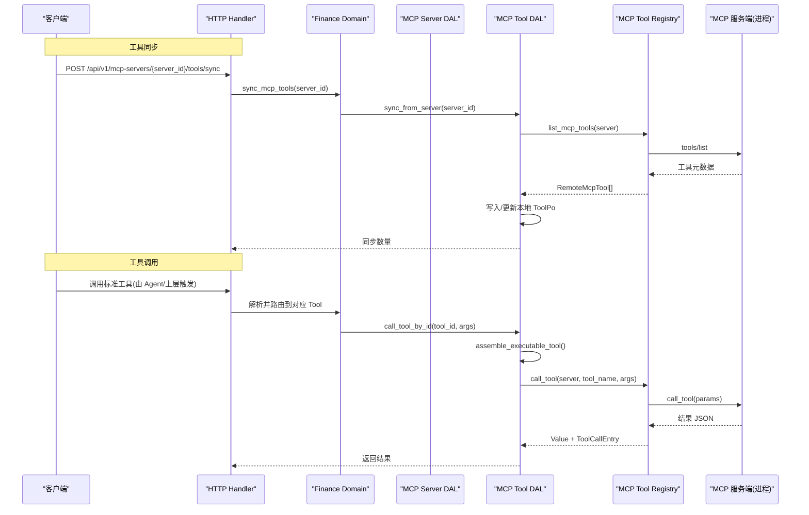
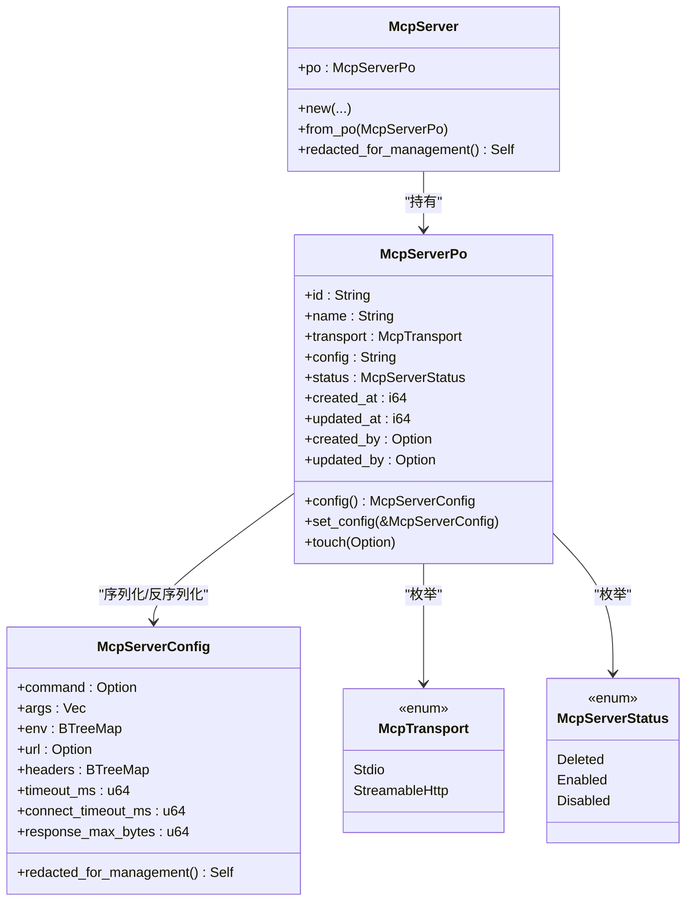
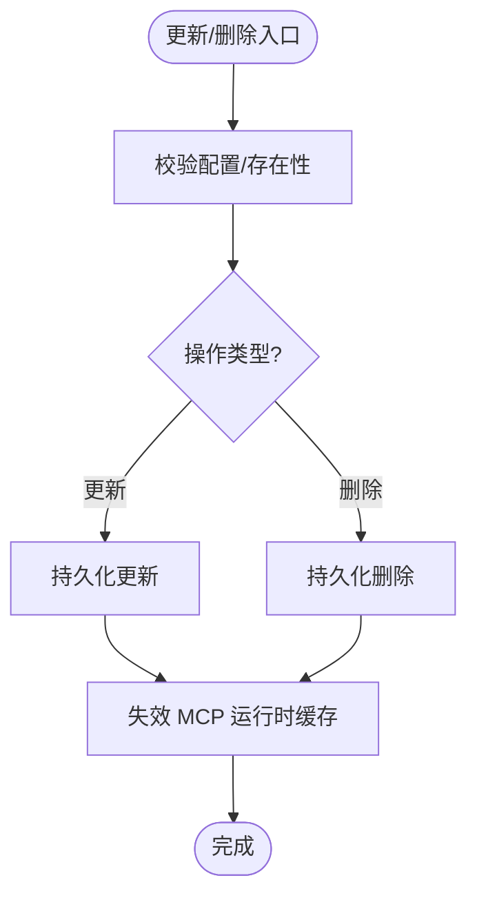
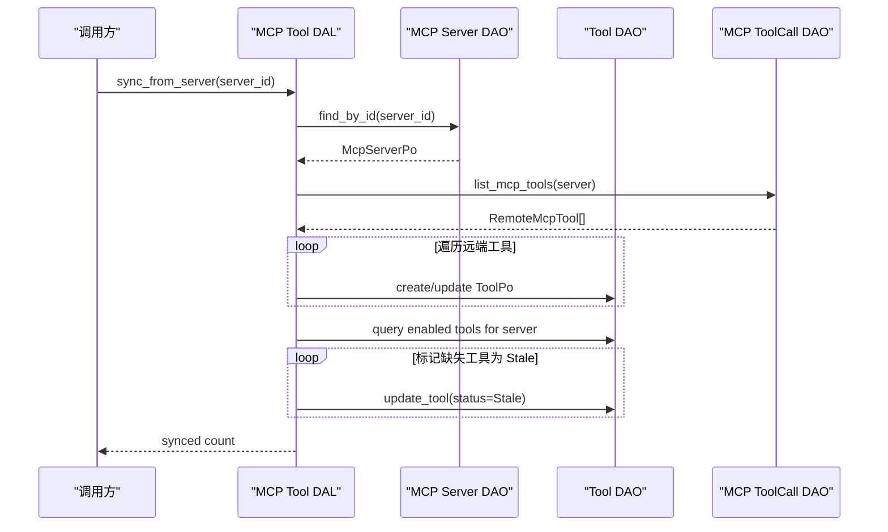
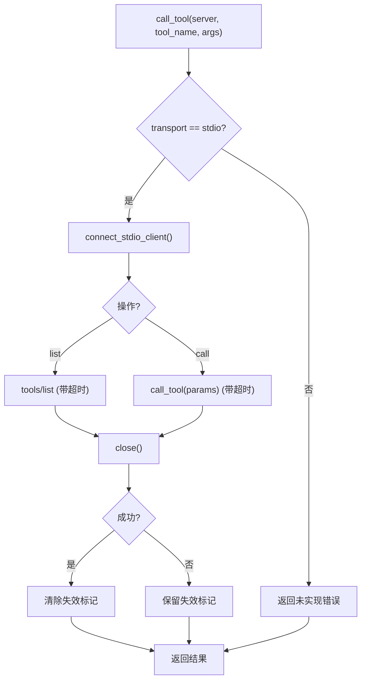
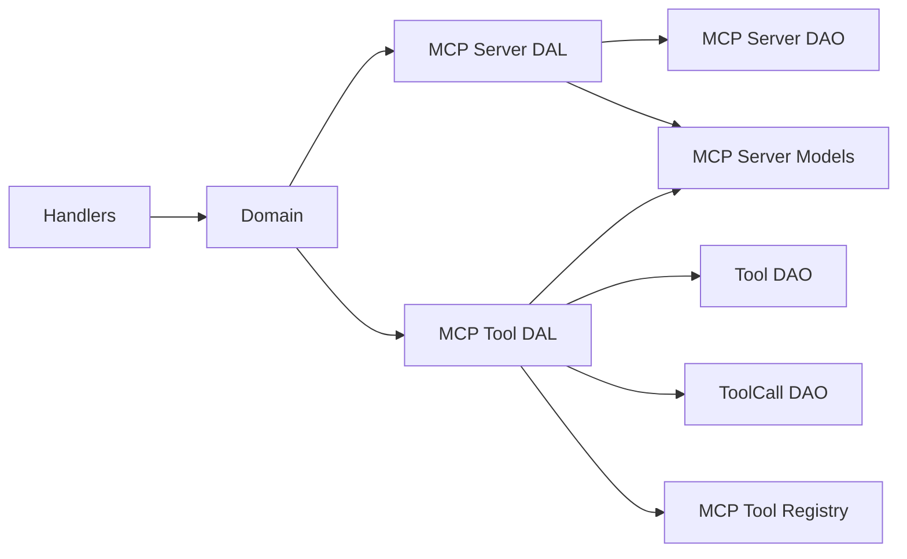

# MCP 服务器集成

<cite>
**本文引用的文件**
- [common/src/api/mcp_server.rs](common/src/api/mcp_server.rs)
- [src/models/mcp_server.rs](src/models/mcp_server.rs)
- [src/pkg/tool_registry/mcp.rs](src/pkg/tool_registry/mcp.rs)
- [src/service/dal/mcp_server.rs](src/service/dal/mcp_server.rs)
- [src/service/dal/mcp_tool.rs](src/service/dal/mcp_tool.rs)
- [src/handlers/finance/mcp_server/mod.rs](src/handlers/finance/mcp_server/mod.rs)
- [src/handlers/finance/mcp_tool/sync_mcp_tools.rs](src/handlers/finance/mcp_tool/sync_mcp_tools.rs)
- [src/handlers/finance/mcp_tool/list_mcp_tools_by_server.rs](src/handlers/finance/mcp_tool/list_mcp_tools_by_server.rs)
- [src/service/domain/finance/mcp_server.rs](src/service/domain/finance/mcp_server.rs)
- [migrations/20260623000000_mcp_servers.sql](migrations/20260623000000_mcp_servers.sql)
</cite>

## 目录
1. [简介](#简介)
2. [项目结构](#项目结构)
3. [核心组件](#核心组件)
4. [架构总览](#架构总览)
5. [详细组件分析](#详细组件分析)
6. [依赖关系分析](#依赖关系分析)
7. [性能与可靠性](#性能与可靠性)
8. [故障排查指南](#故障排查指南)
9. [结论](#结论)
10. [附录：配置示例与最佳实践](#附录配置示例与最佳实践)

## 简介
本文件面向“MCP（Model Context Protocol）服务器集成”的企业级落地，覆盖协议规范要点、服务器配置、连接管理、工具同步机制、创建/更新/删除操作、连接状态监控与故障恢复、工具发现与参数映射、结果转换、错误处理策略、性能优化建议、调用追踪与日志调试方法，以及多服务器管理与降级策略。

本项目采用严格四层单向调用：Adapter（HTTP Handler / 公开回调 / AOP Producer）→ Domain → DAL → DAO，禁止跨层调用与同层互调；Domain 输入为 Command/Query，输出为业务实体与内部事件；DAL 对外统一使用业务实体；通用基础设施工具集中在 pkg 层，无业务感知。

## 项目结构
围绕 MCP 的核心代码分布在以下层次：
- Adapter 层：HTTP 处理器暴露 MCP Server 管理与工具同步接口
- Domain 层：Finance 域聚合 MCP Server 管理能力
- DAL 层：MCP Server 与 MCP Tool 的领域数据访问抽象
- Models：MCP Server 实体、传输类型、配置与脱敏
- Tool Registry：MCP 工具运行时、stdio 客户端、工具执行封装
- Migration：数据库表结构定义

```mermaid
graph TB
subgraph "Adapter"
H1["handlers/finance/mcp_server/*"]
H2["handlers/finance/mcp_tool/*"]
end
subgraph "Domain"
D1["service/domain/finance/mcp_server.rs"]
end
subgraph "DAL"
L1["service/dal/mcp_server.rs"]
L2["service/dal/mcp_tool.rs"]
end
subgraph "Models"
M1["models/mcp_server.rs"]
end
subgraph "Tool Registry"
T1["pkg/tool_registry/mcp.rs"]
end
subgraph "DB"
DB["migrations/..._mcp_servers.sql"]
end
H1 --> D1
H2 --> D1
D1 --> L1
D1 --> L2
L1 --> M1
L2 --> M1
L2 --> T1
L1 --> DB
L2 --> DB
```

图表来源
- [src/handlers/finance/mcp_server/mod.rs:1-24](src/handlers/finance/mcp_server/mod.rs#L1-L24)
- [src/handlers/finance/mcp_tool/sync_mcp_tools.rs:1-28](src/handlers/finance/mcp_tool/sync_mcp_tools.rs#L1-L28)
- [src/service/domain/finance/mcp_server.rs:1-39](src/service/domain/finance/mcp_server.rs#L1-L39)
- [src/service/dal/mcp_server.rs:1-160](src/service/dal/mcp_server.rs#L1-L160)
- [src/service/dal/mcp_tool.rs:1-385](src/service/dal/mcp_tool.rs#L1-L385)
- [src/models/mcp_server.rs:1-322](src/models/mcp_server.rs#L1-L322)
- [src/pkg/tool_registry/mcp.rs:1-399](src/pkg/tool_registry/mcp.rs#L1-L399)
- [migrations/20260623000000_mcp_servers.sql](migrations/20260623000000_mcp_servers.sql)

章节来源
- [src/handlers/finance/mcp_server/mod.rs:1-24](src/handlers/finance/mcp_server/mod.rs#L1-L24)
- [src/handlers/finance/mcp_tool/sync_mcp_tools.rs:1-28](src/handlers/finance/mcp_tool/sync_mcp_tools.rs#L1-L28)
- [src/service/domain/finance/mcp_server.rs:1-39](src/service/domain/finance/mcp_server.rs#L1-L39)
- [src/service/dal/mcp_server.rs:1-160](src/service/dal/mcp_server.rs#L1-L160)
- [src/service/dal/mcp_tool.rs:1-385](src/service/dal/mcp_tool.rs#L1-L385)
- [src/models/mcp_server.rs:1-322](src/models/mcp_server.rs#L1-L322)
- [src/pkg/tool_registry/mcp.rs:1-399](src/pkg/tool_registry/mcp.rs#L1-L399)
- [migrations/20260623000000_mcp_servers.sql](migrations/20260623000000_mcp_servers.sql)

## 核心组件
- MCP Server 实体与配置：定义传输类型、状态、连接配置及脱敏能力
- MCP Server DAL：提供创建、查询、更新、状态切换、删除等能力，并在变更时使缓存失效
- MCP Tool DAL：负责远程工具发现、本地 Tool 记录同步、按 ID 或已装配 Tool 执行、列表查询
- MCP Tool Registry：实现 stdio 客户端连接、工具列表获取、工具调用、超时控制、会话关闭与失败标记
- HTTP Handlers：暴露 MCP Server CRUD、状态更新、工具同步与列表接口

章节来源
- [src/models/mcp_server.rs:1-322](src/models/mcp_server.rs#L1-L322)
- [src/service/dal/mcp_server.rs:1-160](src/service/dal/mcp_server.rs#L1-L160)
- [src/service/dal/mcp_tool.rs:1-385](src/service/dal/mcp_tool.rs#L1-L385)
- [src/pkg/tool_registry/mcp.rs:1-399](src/pkg/tool_registry/mcp.rs#L1-L399)
- [src/handlers/finance/mcp_server/mod.rs:1-24](src/handlers/finance/mcp_server/mod.rs#L1-L24)
- [src/handlers/finance/mcp_tool/sync_mcp_tools.rs:1-28](src/handlers/finance/mcp_tool/sync_mcp_tools.rs#L1-L28)
- [src/handlers/finance/mcp_tool/list_mcp_tools_by_server.rs:1-34](src/handlers/finance/mcp_tool/list_mcp_tools_by_server.rs#L1-L34)

## 架构总览
下图展示从 HTTP 请求到 MCP 工具执行的完整链路，包括工具同步流程与运行时调用路径。



图表来源
- [src/handlers/finance/mcp_tool/sync_mcp_tools.rs:1-28](src/handlers/finance/mcp_tool/sync_mcp_tools.rs#L1-L28)
- [src/service/dal/mcp_tool.rs:108-167](src/service/dal/mcp_tool.rs#L108-L167)
- [src/pkg/tool_registry/mcp.rs:90-140](src/pkg/tool_registry/mcp.rs#L90-L140)
- [src/pkg/tool_registry/mcp.rs:142-192](src/pkg/tool_registry/mcp.rs#L142-L192)
- [src/service/dal/mcp_tool.rs:219-250](src/service/dal/mcp_tool.rs#L219-L250)

## 详细组件分析

### MCP Server 实体与配置
- 传输类型：支持 stdio 与 streamable_http（当前仅 stdio 可用）
- 状态：Enabled/Disabled/Deleted（软删除）
- 配置项：command/args/env/url/headers/timeout_ms/connect_timeout_ms/response_max_bytes
- 安全：提供 redacted_for_management 对敏感字段进行脱敏（env、headers、url 用户信息与查询参数）



图表来源
- [src/models/mcp_server.rs:17-58](src/models/mcp_server.rs#L17-L58)
- [src/models/mcp_server.rs:60-95](src/models/mcp_server.rs#L60-L95)
- [src/models/mcp_server.rs:97-167](src/models/mcp_server.rs#L97-L167)
- [src/models/mcp_server.rs:224-322](src/models/mcp_server.rs#L224-L322)

章节来源
- [src/models/mcp_server.rs:1-322](src/models/mcp_server.rs#L1-L322)

### MCP Server DAL（创建/更新/删除/状态）
- 创建：校验配置后持久化，填充审计字段
- 查询：分页查询，返回业务实体
- 更新：校验配置、更新时间戳与修改人，并失效相关 MCP 运行时缓存
- 状态切换：更新状态并失效缓存
- 删除：软删除并失效缓存



图表来源
- [src/service/dal/mcp_server.rs:105-129](src/service/dal/mcp_server.rs#L105-L129)
- [src/service/dal/mcp_server.rs:132-159](src/service/dal/mcp_server.rs#L132-L159)

章节来源
- [src/service/dal/mcp_server.rs:1-160](src/service/dal/mcp_server.rs#L1-L160)

### MCP Tool DAL（工具同步/执行/列表）
- 同步：从远端 MCP 服务拉取工具元数据，写入/更新本地 ToolPo，未保留的工具标记为 Stale
- 列表：按服务器过滤、分页、脱敏展示
- 执行：组装可执行 Tool（校验协议、状态、服务器启用），通过 ToolCallDao 执行并返回结果与追踪条目



图表来源
- [src/service/dal/mcp_tool.rs:108-167](src/service/dal/mcp_tool.rs#L108-L167)
- [src/service/dal/mcp_tool.rs:169-217](src/service/dal/mcp_tool.rs#L169-L217)
- [src/service/dal/mcp_tool.rs:219-250](src/service/dal/mcp_tool.rs#L219-L250)

章节来源
- [src/service/dal/mcp_tool.rs:1-385](src/service/dal/mcp_tool.rs#L1-L385)

### MCP Tool Registry（连接管理/工具发现/调用）
- 连接：基于 stdio 启动子进程，设置环境变量，建立会话；支持连接超时与初始化超时
- 工具发现：调用 tools/list，超时保护，关闭会话
- 工具调用：构造 CallToolRequestParams，带参数校验与超时保护，序列化结果
- 失效：成功调用后清除失效标记；失败保持失效以便下次重建



图表来源
- [src/pkg/tool_registry/mcp.rs:72-101](src/pkg/tool_registry/mcp.rs#L72-L101)
- [src/pkg/tool_registry/mcp.rs:103-140](src/pkg/tool_registry/mcp.rs#L103-L140)
- [src/pkg/tool_registry/mcp.rs:142-192](src/pkg/tool_registry/mcp.rs#L142-L192)
- [src/pkg/tool_registry/mcp.rs:200-240](src/pkg/tool_registry/mcp.rs#L200-L240)

章节来源
- [src/pkg/tool_registry/mcp.rs:1-399](src/pkg/tool_registry/mcp.rs#L1-L399)

### HTTP 处理器（API）
- MCP Server 管理：创建、获取、列表、更新、状态更新、删除
- 工具同步：POST /api/v1/mcp-servers/{server_id}/tools/sync
- 工具列表：GET /api/v1/mcp-servers/{server_id}/tools

章节来源
- [src/handlers/finance/mcp_server/mod.rs:1-24](src/handlers/finance/mcp_server/mod.rs#L1-L24)
- [src/handlers/finance/mcp_tool/sync_mcp_tools.rs:1-28](src/handlers/finance/mcp_tool/sync_mcp_tools.rs#L1-L28)
- [src/handlers/finance/mcp_tool/list_mcp_tools_by_server.rs:1-34](src/handlers/finance/mcp_tool/list_mcp_tools_by_server.rs#L1-L34)

## 依赖关系分析
- Handler 依赖 Domain 暴露的管理能力
- Domain 依赖 DAL（MCP Server DAL、MCP Tool DAL）
- DAL 依赖 DAO（MCP Server DAO、Tool DAO、ToolCall DAO）
- Model 层提供实体与配置，被 DAL/DAO 使用
- Tool Registry 提供运行时能力，被 Tool DAL 调用



图表来源
- [src/handlers/finance/mcp_server/mod.rs:1-24](src/handlers/finance/mcp_server/mod.rs#L1-L24)
- [src/service/domain/finance/mcp_server.rs:1-39](src/service/domain/finance/mcp_server.rs#L1-L39)
- [src/service/dal/mcp_server.rs:1-160](src/service/dal/mcp_server.rs#L1-L160)
- [src/service/dal/mcp_tool.rs:1-385](src/service/dal/mcp_tool.rs#L1-L385)
- [src/pkg/tool_registry/mcp.rs:1-399](src/pkg/tool_registry/mcp.rs#L1-L399)

章节来源
- [src/handlers/finance/mcp_server/mod.rs:1-24](src/handlers/finance/mcp_server/mod.rs#L1-L24)
- [src/service/domain/finance/mcp_server.rs:1-39](src/service/domain/finance/mcp_server.rs#L1-L39)
- [src/service/dal/mcp_server.rs:1-160](src/service/dal/mcp_server.rs#L1-L160)
- [src/service/dal/mcp_tool.rs:1-385](src/service/dal/mcp_tool.rs#L1-L385)
- [src/pkg/tool_registry/mcp.rs:1-399](src/pkg/tool_registry/mcp.rs#L1-L399)

## 性能与可靠性
- 超时控制：工具列表与调用均设置超时，避免阻塞；连接初始化也设置超时
- 会话管理：每次调用后显式关闭会话，减少资源泄漏风险
- 失效机制：更新/删除/状态切换会失效 MCP 运行时缓存，保证一致性
- 参数校验：工具参数必须为 JSON Object，否则快速失败
- 响应大小限制：配置 response_max_bytes 防止大响应导致内存压力
- 进程隔离：stdio 模式通过独立进程运行 MCP 服务端，降低主进程风险
- 降级策略：streamable_http 尚未实现，调用将返回未实现错误；可通过禁用该传输或提前校验规避
- 批量同步：同步过程先写新增/更新，再标记缺失为 Stale，减少不一致窗口

[本节为通用指导，不直接分析具体文件]

## 故障排查指南
- 命令不可用：stdio 模式下 command 必须在 PATH 中或使用绝对路径；若未找到将报错
- 连接超时：检查 connect_timeout_ms 与目标进程是否能及时初始化
- 调用超时：检查 timeout_ms 与远端处理能力
- 会话关闭失败：即使关闭失败也会继续返回结果，但需关注日志以定位资源问题
- 工具未启用：确保 ToolPo.status 为 Enabled，且关联的 McpServerPo.status 为 Enabled
- 配置非法：更新时会校验配置，如 stdio 缺少 command 将拒绝
- 流式 HTTP 未实现：当前不支持 streamable_http，需改用 stdio 或等待后续实现

章节来源
- [src/pkg/tool_registry/mcp.rs:200-268](src/pkg/tool_registry/mcp.rs#L200-L268)
- [src/service/dal/mcp_server.rs:132-159](src/service/dal/mcp_server.rs#L132-L159)
- [src/service/dal/mcp_tool.rs:325-344](src/service/dal/mcp_tool.rs#L325-L344)

## 结论
本项目实现了 MCP 服务器的标准化管理与工具同步机制，通过 DAL 与 Tool Registry 的组合，提供了安全的 stdio 连接、严格的超时与资源管理、一致的状态与缓存失效策略。配合 HTTP Handler 暴露的 API，可实现企业级的 MCP 服务器接入、工具发现与调用。未来可扩展 streamable_http 传输、连接池与熔断降级等特性。

[本节为总结，不直接分析具体文件]

## 附录：配置示例与最佳实践

### 配置 DTO 与默认值
- 创建/更新时使用 McpServerConfigDto，包含 command/args/env/url/headers/timeout_ms/connect_timeout_ms/response_max_bytes
- 默认 stdio 配置提供合理的超时与响应大小限制

章节来源
- [common/src/api/mcp_server.rs:10-32](common/src/api/mcp_server.rs#L10-L32)
- [src/models/mcp_server.rs:125-150](src/models/mcp_server.rs#L125-L150)

### 工具同步与列表
- 同步：调用 sync_mcp_tools 将远端工具元数据写入本地 ToolPo，便于后续管理与执行
- 列表：按服务器列出已同步工具，支持分页与关键字搜索

章节来源
- [src/handlers/finance/mcp_tool/sync_mcp_tools.rs:1-28](src/handlers/finance/mcp_tool/sync_mcp_tools.rs#L1-L28)
- [src/handlers/finance/mcp_tool/list_mcp_tools_by_server.rs:1-34](src/handlers/finance/mcp_tool/list_mcp_tools_by_server.rs#L1-L34)
- [src/service/dal/mcp_tool.rs:169-217](src/service/dal/mcp_tool.rs#L169-L217)

### 工具调用追踪与日志
- 执行路径通过 ToolCallDao 执行，返回 ToolCallEntry，便于追踪与统计
- 建议在测试环境中初始化 ToolCallLogger，并将 trace base path 指向临时目录

章节来源
- [src/service/dal/mcp_tool.rs:219-250](src/service/dal/mcp_tool.rs#L219-L250)

### 多服务器管理与负载均衡
- 当前实现为单实例运行时，未内置连接池或负载均衡
- 建议通过多进程部署多个服务实例，结合外部负载均衡器分发请求
- 对于高并发场景，可考虑在 Tool Registry 层引入连接复用与会话池（需评估安全性与资源占用）

[本节为通用指导，不直接分析具体文件]

### 熔断与降级
- 当前未实现熔断器；可在调用前检查服务器状态与可用性
- 对失败率高的服务器，可将其状态置为 Disabled，避免继续调用
- 对关键路径，可增加重试与退避策略（需在更高层实现）

[本节为通用指导，不直接分析具体文件]

### 安全与脱敏
- 管理面展示配置时使用 redacted_for_management，对 env、headers、url 进行脱敏
- 避免在 ToolPo.config 中重复存储服务器凭据，仅保存 server_id 与 tool_name

章节来源
- [src/models/mcp_server.rs:152-167](src/models/mcp_server.rs#L152-L167)
- [src/pkg/tool_registry/mcp.rs:28-40](src/pkg/tool_registry/mcp.rs#L28-L40)